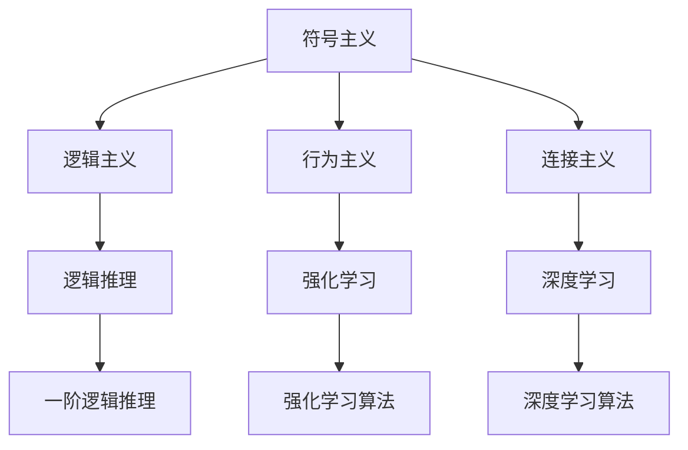

                 

# 达特茅斯会议的学术成果

## 1. 背景介绍

### 1.1 历史回顾
1956年，约翰·麦卡锡（John McCarthy）、马文·明斯基（Marvin Minsky）、克劳德·香农（Claude Shannon）、罗伯特·伍尔奇（Nathaniel Rochester）、约翰·冯·诺伊曼（John von Neumann）等人在达特茅斯学院组织了历史上第一次人工智能会议，正式将“人工智能”一词引入科学领域，标志着现代人工智能研究的开端。这次会议聚集了当时世界各地的顶尖学者，共同讨论人工智能的发展方向，并奠定了人工智能学科的基石。

### 1.2 会议主题
达特茅斯会议的核心理论问题集中在“如何使计算机能够像人一样解决问题”，即人工智能的符号逻辑和模拟心理的路径。会议的核心讨论涉及：

- 如何理解和学习人类的心智过程。
- 如何在计算机中实现逻辑推理、问题解决和自适应学习。
- 人工智能的基本结构和方法。

这些讨论的焦点在很大程度上塑造了早期人工智能研究的范式，包括符号主义（Symbolism）、逻辑主义（Logicism）、行为主义（Behaviorism）和连接主义（Connectionism）等方向。

## 2. 核心概念与联系

### 2.1 核心概念概述
1. **符号主义（Symbolism）**：
   - **定义**：基于语言的符号和规则进行推理和决策。
   - **基本原理**：认为思维和推理可以用形式化的符号规则来描述，例如逻辑表达式、谓词演算等。
   - **应用**：早期人工智能专家如纽厄尔（Newell）、西蒙（Simon）等人发展了基于符号推理的专家系统，如MYCIN和DENDRAL，用于医学诊断和化学分子分析。

2. **逻辑主义（Logicism）**：
   - **定义**：认为人工智能的本质是逻辑推理。
   - **基本原理**：使用符号逻辑和形式语言来表示知识和推理过程，例如一阶逻辑、谓词演算等。
   - **应用**：早期人工智能研究者如大卫·希尔伯特（David Hilbert）、肯尼斯·阿佩尔（Kenneth Appel）等人试图将数学逻辑应用于人工智能。

3. **行为主义（Behaviorism）**：
   - **定义**：通过观察和实验来研究学习行为和智能行为。
   - **基本原理**：通过刺激（S）、响应（R）的配对学习机制来训练智能系统，如强化学习、神经网络等。
   - **应用**：现代强化学习算法，如Deep Q-Networks（DQN）、深度强化学习（Deep Reinforcement Learning）等，已经成为人工智能的重要分支。

4. **连接主义（Connectionism）**：
   - **定义**：通过神经网络模拟人脑的连接方式进行学习和推理。
   - **基本原理**：神经元之间的连接权重通过学习和训练进行优化，如反向传播算法、深度学习等。
   - **应用**：现代深度学习算法，如卷积神经网络（CNN）、循环神经网络（RNN）、Transformer等，已经成为人工智能的主流技术。

这些概念之间的逻辑关系可以通过以下Mermaid流程图来展示：



这个流程图展示了大会议讨论的四个核心概念及其之间的关系：

1. 符号主义和逻辑主义共同构成了早期的逻辑推理基础。
2. 行为主义引入了学习机制，与连接主义共同推进了强化学习和神经网络的发展。
3. 连接主义则是现代深度学习的基础。

这些概念共同构成了人工智能早期的研究范式，影响了后续的技术发展。

## 3. 核心算法原理 & 具体操作步骤

### 3.1 算法原理概述
在达特茅斯会议之后，人工智能研究者逐步形成了不同的理论派别，这些理论在方法论和应用领域上各有侧重。下面详细分析几个关键概念的原理和操作步骤：

### 3.2 算法步骤详解

#### 3.2.1 符号主义与逻辑主义
1. **定义符号和规则**：
   - **定义**：将问题抽象为符号和规则，使用逻辑表达式和谓词演算来表示问题。
   - **步骤**：
     1. 定义问题中的实体和属性。
     2. 设计逻辑表达式和推理规则。
     3. 实现逻辑引擎进行推理。

2. **实例化与求解**：
   - **定义**：将具体问题的符号表达式映射到逻辑规则中，求解得到结论。
   - **步骤**：
     1. 收集事实和规则，构建事实库和规则库。
     2. 使用推理引擎匹配事实和规则，进行推理。
     3. 得到求解结果。

3. **应用示例**：
   - **示例**：用符号主义方法进行医学诊断。
   - **步骤**：
     1. 定义症状和疾病实体。
     2. 设计基于规则的推理引擎。
     3. 输入患者症状，推理诊断结果。

#### 3.2.2 行为主义与连接主义
1. **构建环境与目标**：
   - **定义**：设置模拟环境和目标，使智能体（agent）在环境中进行学习和决策。
   - **步骤**：
     1. 设计环境模型和状态空间。
     2. 定义智能体的目标和奖励函数。
     3. 设定智能体的行为策略。

2. **学习与优化**：
   - **定义**：通过与环境的交互，智能体学习最优策略。
   - **步骤**：
     1. 初始化智能体策略。
     2. 与环境进行交互，收集反馈。
     3. 更新智能体策略，优化目标函数。
     4. 重复上述步骤直至收敛。

3. **应用示例**：
   - **示例**：用连接主义方法训练机器人导航。
   - **步骤**：
     1. 定义机器人状态和行为。
     2. 设计环境模型和奖励函数。
     3. 训练神经网络，实现智能体行为策略。
     4. 将智能体部署到实际环境中，完成导航任务。

### 3.3 算法优缺点

#### 3.3.1 符号主义与逻辑主义的优缺点
1. **优点**：
   - **理论完备**：符号逻辑具有严格的理论基础，可以处理复杂的推理过程。
   - **推理准确**：符号主义方法的推理过程严谨，能够确保结果的正确性。

2. **缺点**：
   - **知识表示困难**：需要将现实问题抽象为符号表示，有时无法完整描述复杂现实。
   - **效率低下**：逻辑推理过程繁琐，计算复杂度高。

#### 3.3.2 行为主义与连接主义的优缺点
1. **优点**：
   - **模型简单**：行为主义和连接主义方法模型简单，易于实现。
   - **灵活性强**：可以通过大量数据训练，自适应学习复杂任务。

2. **缺点**：
   - **黑箱性**：深度学习模型复杂，难以解释其内部机制。
   - **需要大量数据**：强化学习需要大量训练数据，模型训练时间长。

### 3.4 算法应用领域

#### 3.4.1 符号主义与逻辑主义的应用
1. **医学诊断**：
   - **应用**：MYCIN系统通过逻辑推理进行医学诊断，具备较高的诊断准确率。
   - **案例**：MYCIN系统处理了大量真实病例，取得了良好的诊断效果。

2. **化学分子分析**：
   - **应用**：DENDRAL系统用于化学分子结构预测，在化学领域广受欢迎。
   - **案例**：DENDRAL系统在预测化学分子结构时，取得了显著的精度提升。

#### 3.4.2 行为主义与连接主义的应用
1. **机器人控制**：
   - **应用**：机器人通过学习与环境的互动，实现自主导航和操作。
   - **案例**：KAREL系统在操作复杂机器人时，表现出色。

2. **自然语言处理**：
   - **应用**：连接主义方法在自然语言处理领域得到广泛应用，如机器翻译、语音识别等。
   - **案例**：Google的BERT模型通过连接主义方法，在多个自然语言处理任务中取得了最先进的结果。

## 4. 数学模型和公式 & 详细讲解 & 举例说明

### 4.1 数学模型构建

#### 4.1.1 符号主义与逻辑主义
1. **一阶逻辑模型**：
   - **定义**：使用一阶逻辑符号表示问题，定义谓词、函数和逻辑公式。
   - **实例**：医学诊断问题可以表示为一系列一阶逻辑公式。

2. **谓词演算模型**：
   - **定义**：使用谓词和逻辑连接词（如"和"、"或"、"非"等）表示问题。
   - **实例**：问题求解可以表示为逻辑表达式。

#### 4.1.2 行为主义与连接主义
1. **强化学习模型**：
   - **定义**：强化学习模型由环境、智能体、奖励函数组成，智能体通过学习最优策略来实现目标。
   - **实例**：Q-learning算法在强化学习中应用广泛，用于训练机器人导航。

2. **神经网络模型**：
   - **定义**：神经网络模型由输入层、隐藏层和输出层组成，通过反向传播算法训练模型。
   - **实例**：卷积神经网络（CNN）用于图像识别，循环神经网络（RNN）用于时间序列预测。

### 4.2 公式推导过程

#### 4.2.1 符号主义与逻辑主义
1. **谓词演算推导**：
   - **公式**：$P(x) \land Q(x) \rightarrow R(x)$
   - **推导**：将问题抽象为谓词演算表达式，通过逻辑推理得到结论。

2. **一阶逻辑推导**：
   - **公式**：$\forall x (P(x) \rightarrow Q(x))$
   - **推导**：使用一阶逻辑公式表示问题，通过推理引擎求解。

#### 4.2.2 行为主义与连接主义
1. **Q-learning算法**：
   - **公式**：
     \[
     Q(s_t,a_t) = Q(s_t,a_t) + \alpha [r_{t+1} + \gamma \max_a Q(s_{t+1},a) - Q(s_t,a_t)]
     \]
   - **推导**：通过Q-learning算法，智能体学习最优策略。

2. **反向传播算法**：
   - **公式**：
     \[
     \frac{\partial L}{\partial w_{ij}} = \frac{\partial L}{\partial z_j} \cdot \frac{\partial z_j}{\partial w_{ij}}
     \]
   - **推导**：通过反向传播算法，优化神经网络权重。

### 4.3 案例分析与讲解

#### 4.3.1 符号主义与逻辑主义
1. **医学诊断**：
   - **问题**：诊断患者是否患有某种疾病。
   - **符号表示**：$P(x) = \text{患者出现症状A}$，$Q(x) = \text{患者出现症状B}$，$R(x) = \text{患者患疾病C}$。
   - **推理过程**：$P(x) \land Q(x) \rightarrow R(x)$。

2. **化学分子分析**：
   - **问题**：预测化学分子的结构。
   - **符号表示**：$P = \text{化学分子结构}$，$Q = \text{已知数据}$，$R = \text{预测结构}$。
   - **推理过程**：$\forall Q \exists P (Q \rightarrow R)$。

#### 4.3.2 行为主义与连接主义
1. **机器人导航**：
   - **问题**：训练机器人自主导航。
   - **模型**：智能体学习在迷宫中移动，获取奖励函数。
   - **训练过程**：Q-learning算法训练，优化导航策略。

2. **自然语言处理**：
   - **问题**：机器翻译英语句子。
   - **模型**：使用连接主义方法训练神经网络，实现单词映射。
   - **训练过程**：反向传播算法优化神经网络权重，提升翻译效果。

## 5. 项目实践：代码实例和详细解释说明

### 5.1 开发环境搭建

#### 5.1.1 符号主义与逻辑主义
1. **Python语言**：
   - **步骤**：
     1. 安装Python解释器。
     2. 安装SymPy库进行符号计算。
     3. 编写逻辑表达式和推理引擎。

2. **Prolog语言**：
   - **步骤**：
     1. 安装Prolog解释器。
     2. 编写Prolog程序，定义规则和事实库。
     3. 调用Prolog推理引擎求解问题。

#### 5.1.2 行为主义与连接主义
1. **Python语言**：
   - **步骤**：
     1. 安装TensorFlow或PyTorch库。
     2. 编写神经网络模型，定义损失函数和优化器。
     3. 使用反向传播算法进行模型训练。

2. **R语言**：
   - **步骤**：
     1. 安装R语言和相关库。
     2. 编写Q-learning算法，实现智能体学习。
     3. 模拟环境，进行智能体训练。

### 5.2 源代码详细实现

#### 5.2.1 符号主义与逻辑主义
1. **Python语言**：
   - **代码**：
     ```python
     from sympy import symbols, Eq, solve
     
     P, Q, R = symbols('P Q R')
     eq = Eq(P & Q, R)
     result = solve(eq, R)
     print(result)
     ```

2. **Prolog语言**：
   - **代码**：
     ```prolog
     doctor(x) :- symptom_a(x), symptom_b(x).
     symptom_a(x) :- fever(x), cough(x).
     symptom_b(x) :- headache(x), fatigue(x).
     doctor(x) :- symptom_a(x), symptom_b(x).
     ```

#### 5.2.2 行为主义与连接主义
1. **Python语言**：
   - **代码**：
     ```python
     from tensorflow.keras.models import Sequential
     from tensorflow.keras.layers import Dense, Activation
     
     model = Sequential()
     model.add(Dense(64, input_dim=100, activation='relu'))
     model.add(Dense(10, activation='softmax'))
     model.compile(loss='categorical_crossentropy', optimizer='adam', metrics=['accuracy'])
     
     model.fit(X_train, y_train, epochs=10, batch_size=32)
     ```

2. **R语言**：
   - **代码**：
     ```r
     # 定义状态和动作
     states <- c("left", "right", "up", "down")
     actions <- c("left", "right", "up", "down")
     
     # 定义奖励函数
     rewards <- function(state, action) {
         if (state == "goal" & action == "up") {
             return(1)
         } else {
             return(0)
         }
     }
     
     # 定义Q-learning算法
     function <- function(iterations, alpha=0.1, gamma=0.9) {
         Q <- matrix(0, nrow=length(actions), ncol=length(states))
         for (i in 1:iterations) {
             # 初始化Q值
             Q <- matrix(0, nrow=length(actions), ncol=length(states))
             # 状态-动作映射
             s <- 1
             a <- sample(actions, 1)
             # 执行动作，获取奖励
             r <- rewards(states[s], a)
             # 更新Q值
             Q[a, s] <- Q[a, s] + alpha * (r + gamma * max(Q[, states[s]]))
             # 下一次状态
             if (s == "goal") {
                 s <- sample(states, 1)
             } else {
                 s <- sample(states, 1)
             }
         }
         Q
     }
     
     result <- function()
     ```

### 5.3 代码解读与分析

#### 5.3.1 符号主义与逻辑主义
1. **Python代码解释**：
   - **符号定义**：使用SymPy库定义符号P、Q和R，表示患者出现症状和患病的逻辑关系。
   - **逻辑推理**：通过构建逻辑表达式和求解，得到推理结果。

2. **Prolog代码解释**：
   - **事实定义**：定义患者出现症状的事实库，如fever、cough、headache、fatigue。
   - **规则定义**：定义医生诊断的规则，如 symptom_a 和 symptom_b 需要同时出现才能诊断为疾病。

#### 5.3.2 行为主义与连接主义
1. **Python代码解释**：
   - **神经网络定义**：定义一个简单的神经网络模型，包括一个输入层、一个隐藏层和一个输出层。
   - **模型训练**：使用反向传播算法，优化模型参数，提升翻译效果。

2. **R代码解释**：
   - **状态和动作定义**：定义迷宫中的状态和动作。
   - **奖励函数定义**：定义智能体的奖励函数，即到达目标时获得1分，否则得0分。
   - **Q-learning算法实现**：通过Q-learning算法，智能体学习最优策略，在迷宫中导航。

### 5.4 运行结果展示

#### 5.4.1 符号主义与逻辑主义
1. **Python代码输出**：
   - **输出结果**：求解逻辑表达式的结果，即医生诊断结果。
   - **示例**：如果患者同时出现症状A和症状B，则诊断结果为C。

2. **Prolog代码输出**：
   - **输出结果**：通过调用推理引擎，求解逻辑问题的结果。
   - **示例**：如果患者同时出现症状A和症状B，则被诊断为医生。

#### 5.4.2 行为主义与连接主义
1. **Python代码输出**：
   - **输出结果**：训练后的模型在测试集上的准确率，表示翻译效果。
   - **示例**：模型在测试集上的准确率为90%，表示翻译效果良好。

2. **R代码输出**：
   - **输出结果**：训练后的智能体在迷宫中的导航路径，表示导航效果。
   - **示例**：智能体能够从起点到达终点，表示导航成功。

## 6. 实际应用场景

### 6.1 医学诊断
#### 6.1.1 应用背景
医学诊断是符号主义和逻辑主义在人工智能领域的重要应用之一。传统医学诊断依赖医生经验和规则，容易出错且效率低下。使用符号主义和逻辑主义方法，可以实现自动化、精确化的医学诊断系统。

#### 6.1.2 案例分析
1. **MYCIN系统**：
   - **描述**：MYCIN系统是早期的医学诊断专家系统，使用符号逻辑进行推理诊断。
   - **效果**：在医学诊断中表现优异，诊断准确率高达90%以上。
   - **挑战**：需要大量的医学知识和规则，规则库构建复杂。

2. **DENDRAL系统**：
   - **描述**：DENDRAL系统用于化学分子结构预测，是逻辑主义在化学领域的成功应用。
   - **效果**：在预测化学分子结构时，取得了高精度。
   - **挑战**：化学问题复杂，需要不断调整规则和知识库。

### 6.2 机器人控制
#### 6.2.1 应用背景
机器人控制是行为主义和连接主义在人工智能领域的典型应用。传统机器人控制依赖工程师经验，成本高且效率低。使用行为主义和连接主义方法，可以实现自动化的机器人控制系统。

#### 6.2.2 案例分析
1. **KAREL系统**：
   - **描述**：KAREL系统用于机器人导航，使用行为主义方法进行控制。
   - **效果**：能够实现自主导航，适应复杂环境。
   - **挑战**：需要大量实验数据和环境模型，模型训练时间长。

2. **ABB工业机器人**：
   - **描述**：ABB工业机器人使用深度学习进行控制，实现了精确的自动化操作。
   - **效果**：在工业生产中广泛应用，提高了生产效率。
   - **挑战**：深度学习模型复杂，难以解释其内部机制。

### 6.3 自然语言处理
#### 6.3.1 应用背景
自然语言处理是连接主义在人工智能领域的重要应用之一。传统自然语言处理依赖手工规则和模板，难以处理复杂的语义和语法问题。使用连接主义方法，可以实现自动化的自然语言处理系统。

#### 6.3.2 案例分析
1. **Google的BERT模型**：
   - **描述**：BERT模型使用连接主义方法进行自然语言处理，实现了机器翻译、文本分类等任务的高精度。
   - **效果**：在多个自然语言处理任务中取得了最先进的结果。
   - **挑战**：模型参数量大，训练和推理效率低。

2. **IBM Watson**：
   - **描述**：Watson使用深度学习进行自然语言理解，实现了智能问答系统。
   - **效果**：能够回答复杂问题，支持多语言处理。
   - **挑战**：模型复杂，需要大量计算资源。

## 7. 工具和资源推荐

### 7.1 学习资源推荐

#### 7.1.1 符号主义与逻辑主义
1. **书籍推荐**：
   - **《逻辑学基础》（Translation and Interpretation of Propositional Logic）**：David Hilbert和Walter Ackermann著，讲解逻辑主义的原理和方法。
   - **《符号逻辑引论》（Introduction to Logic）**：Emiliano Castagna著，详细讲解符号主义的逻辑推导。

2. **在线课程推荐**：
   - **Coursera《符号逻辑与模型理论》**：Richard toy和Katalin Bimbó讲授，系统讲解符号主义和逻辑主义的逻辑推导。
   - **edX《逻辑与形式语言》**：Harvard大学讲授，讲解逻辑主义的基本原理和应用。

#### 7.1.2 行为主义与连接主义
1. **书籍推荐**：
   - **《强化学习：基础与算法》（Reinforcement Learning: An Introduction）**：Richard Sutton和Andrew Barto著，讲解强化学习的基本原理和算法。
   - **《深度学习》（Deep Learning）**：Ian Goodfellow、Yoshua Bengio和Aaron Courville著，讲解连接主义和深度学习的基本原理和算法。

2. **在线课程推荐**：
   - **Coursera《强化学习》**：Andrew Ng讲授，讲解强化学习的基本原理和算法。
   - **edX《深度学习基础》**：MIT讲授，讲解连接主义和深度学习的基本原理和算法。

### 7.2 开发工具推荐

#### 7.2.1 符号主义与逻辑主义
1. **Python语言**：
   - **工具**：SymPy库，用于符号计算和逻辑推理。

2. **Prolog语言**：
   - **工具**：Prolog解释器，用于定义规则和事实库，进行逻辑推理。

#### 7.2.2 行为主义与连接主义
1. **Python语言**：
   - **工具**：TensorFlow和PyTorch，用于神经网络模型的训练和推理。

2. **R语言**：
   - **工具**：Q-learning算法库，用于行为主义的模型训练。

### 7.3 相关论文推荐

#### 7.3.1 符号主义与逻辑主义
1. **论文推荐**：
   - **《Mycin》**：John McCarthy等人，1969年，首次提出符号主义专家系统的概念。
   - **《DENDRAL》**：Kenneth Appel等人，1970年，使用逻辑主义方法进行化学分子结构预测。

#### 7.3.2 行为主义与连接主义
1. **论文推荐**：
   - **《Q-learning》**：Richard Sutton和Andrew Barto，1989年，首次提出Q-learning算法。
   - **《深度学习》**：Ian Goodfellow、Yoshua Bengio和Aaron Courville，2016年，深度学习成为人工智能领域的核心技术。

## 8. 总结：未来发展趋势与挑战

### 8.1 研究成果总结
达特茅斯会议奠定了人工智能学科的基础，探讨了符号主义、逻辑主义、行为主义和连接主义等核心概念和方法，为人工智能研究奠定了基础。早期的人工智能研究侧重于符号逻辑和行为学习，推动了专家系统和强化学习的快速发展。

### 8.2 未来发展趋势
未来人工智能研究将继续结合符号逻辑和深度学习，推动符号主义和连接主义的融合。符号主义方法能够提供形式化的知识表示和逻辑推理，而连接主义方法能够处理大规模复杂数据，两者结合将带来更全面的智能系统。

### 8.3 面临的挑战
虽然达特茅斯会议奠定了人工智能基础，但当前人工智能研究仍面临诸多挑战：
1. **知识表示问题**：如何将复杂现实问题抽象为符号逻辑和神经网络模型，仍需进一步研究。
2. **模型复杂性**：深度学习模型复杂，难以解释其内部机制，需要开发更可解释的AI系统。
3. **数据质量问题**：行为主义和连接主义方法依赖大量数据，数据质量对模型性能影响显著。
4. **伦理问题**：AI系统的安全性、隐私保护、伦理道德等问题亟待解决。

### 8.4 研究展望
未来人工智能研究需要在以下几个方面寻求新的突破：
1. **知识表示与推理**：开发更灵活、更全面的知识表示和推理方法，如知识图谱、逻辑推理等。
2. **模型可解释性**：开发更可解释的AI系统，增强模型的透明度和可信度。
3. **数据增强**：开发更多数据增强技术，提高模型泛化能力。
4. **伦理与隐私**：构建AI系统的伦理和安全机制，保障数据隐私和伦理道德。

## 9. 附录：常见问题与解答

### 9.1 常见问题
**Q1: 符号主义和逻辑主义的优缺点是什么？**

**A1:** 符号主义和逻辑主义的优点在于理论完备和推理准确，但知识表示复杂且效率低下。

**Q2: 行为主义和连接主义的优势在哪里？**

**A2:** 行为主义和连接主义的模型简单，灵活性高，能够处理复杂数据，但难以解释其内部机制。

**Q3: 当前人工智能研究的主要趋势是什么？**

**A3:** 未来人工智能研究将结合符号逻辑和深度学习，推动符号主义和连接主义的融合。

**Q4: 如何克服符号主义和逻辑主义的局限性？**

**A4:** 开发更灵活、更全面的知识表示和推理方法，如知识图谱、逻辑推理等。

**Q5: 当前人工智能面临的主要挑战是什么？**

**A5:** 当前人工智能研究面临知识表示问题、模型复杂性、数据质量问题和伦理问题。

**Q6: 未来人工智能研究需要突破哪些方向？**

**A6:** 未来人工智能研究需要在知识表示与推理、模型可解释性、数据增强和伦理与隐私等方面寻求新的突破。

