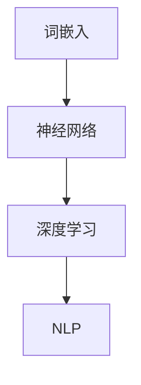

                 

# 通过nn．Embedding来实现词嵌入

> 关键词：词嵌入,神经网络,深度学习,自然语言处理(NLP),向量表示

## 1. 背景介绍

### 1.1 问题由来
在自然语言处理（NLP）领域，如何将文本中的词或短语映射到高维空间中的向量表示，是实现文本分析、信息检索、机器翻译、情感分析等任务的基础。传统的词袋模型（Bag-of-Words, BoW）只考虑单词的频率而不考虑其在文本中的位置，无法捕捉单词之间的语义关系。为了解决这个问题，词嵌入（Word Embedding）技术应运而生，通过学习单词在句子中的语义关系，将它们映射到高维空间中的稠密向量，使得单词在向量空间中的位置能够反映其语义信息。

## 2. 核心概念与联系

### 2.1 核心概念概述

为更好地理解词嵌入技术，本节将介绍几个密切相关的核心概念：

- 词嵌入（Word Embedding）：将单词映射到高维向量空间的表示方法，使得单词在向量空间中的位置能够反映其语义信息。常用的词嵌入模型有Word2Vec、GloVe等。

- 神经网络（Neural Network）：一种能够模拟人类大脑神经元之间信息传递的计算模型，由输入层、隐藏层和输出层组成。神经网络可以处理非线性映射、分类、回归等任务，是实现词嵌入的核心算法。

- 深度学习（Deep Learning）：一种基于神经网络的机器学习技术，通过多层非线性变换从原始数据中提取特征，实现对复杂模式的识别和学习。深度学习在图像、语音、文本等领域取得了显著成果。

- 自然语言处理（NLP）：使用计算机科学和人工智能技术处理和分析人类语言的技术，包括文本分类、信息检索、机器翻译、情感分析等任务。

这些核心概念之间的逻辑关系可以通过以下Mermaid流程图来展示：



这个流程图展示了几者之间的关系：词嵌入技术基于神经网络实现，而深度学习是神经网络的一种应用，使得神经网络能够处理复杂的NLP任务。

## 3. 核心算法原理 & 具体操作步骤

### 3.1 算法原理概述

词嵌入的算法原理基于神经网络的反向传播算法，通过对神经网络的训练，使得单词在向量空间中的位置能够反映其语义信息。以Word2Vec算法为例，其主要思想是通过神经网络预测单词在句子中的位置，并利用语言模型作为损失函数进行反向传播，从而优化单词的向量表示。

Word2Vec算法有两种实现方式：CBOW（Continuous Bag-of-Words）和Skip-gram。CBOW通过已知上下文预测单词，而Skip-gram则通过已知单词预测上下文。两者均利用神经网络进行训练，将单词映射到高维向量空间中。

### 3.2 算法步骤详解

以Word2Vec的Skip-gram算法为例，具体算法步骤如下：

1. 构建神经网络模型：包括输入层、隐藏层和输出层。输入层为当前单词的向量表示，隐藏层为神经网络的核心部分，输出层为上下文单词的概率分布。
2. 初始化模型参数：包括输入层、隐藏层和输出层的权重矩阵和偏置向量。
3. 训练模型：输入当前单词，通过神经网络预测上下文单词的概率分布，并利用softmax函数计算损失函数。
4. 反向传播：通过链式法则计算损失函数对模型参数的梯度，并利用梯度下降等优化算法更新模型参数。
5. 重复步骤3和4，直至模型收敛。

### 3.3 算法优缺点

词嵌入技术的优点在于能够捕捉单词之间的语义关系，使得单词在向量空间中的位置能够反映其语义信息，提高了文本分析的准确性和效率。其主要缺点包括：

1. 数据依赖性高：词嵌入依赖于训练数据的质量和数量，数据不足时可能无法有效捕捉单词的语义关系。
2. 向量维度高：高维向量表示占用大量计算资源，需要较长的训练时间。
3. 分布式效应：单词的语义信息往往依赖于其在语料库中的分布，单词在训练数据中出现的频率越高，其向量表示的维度越低。

### 3.4 算法应用领域

词嵌入技术在NLP领域有着广泛的应用，包括：

- 文本分类：将文本映射到高维向量空间中，使用分类器进行分类。
- 信息检索：使用向量空间模型进行相似度计算，实现信息检索。
- 机器翻译：将源语言和目标语言之间的单词映射到向量空间中，使用神经网络进行翻译。
- 情感分析：将文本中的单词映射到向量空间中，使用分类器进行情感分类。
- 知识图谱：将实体和关系映射到向量空间中，使用神经网络进行推理和分析。

## 4. 数学模型和公式 & 详细讲解 & 举例说明

### 4.1 数学模型构建

以Word2Vec的Skip-gram算法为例，其数学模型可以表示为：

- 输入层：$x_t \in \mathbb{R}^d$，表示当前单词的向量表示。
- 隐藏层：$h_t \in \mathbb{R}^h$，表示神经网络的核心部分。
- 输出层：$y_t \in \mathbb{R}^d$，表示上下文单词的概率分布。

其中$d$为向量维度，$h$为隐藏层的神经元个数。

### 4.2 公式推导过程

以单层神经网络为例，其前向传播公式为：

$$
y = g(Wx + b)
$$

其中$W$为权重矩阵，$b$为偏置向量，$g$为激活函数。

以sigmoid函数为例，其前向传播公式为：

$$
y = \sigma(Wx + b)
$$

其中$\sigma(x) = \frac{1}{1 + e^{-x}}$。

后向传播公式为：

$$
\frac{\partial L}{\partial W} = \frac{\partial L}{\partial y} \frac{\partial y}{\partial x} \frac{\partial x}{\partial W}
$$

其中$L$为损失函数，$\frac{\partial L}{\partial y}$为损失函数对输出层的梯度，$\frac{\partial y}{\partial x}$为激活函数对输入层的导数。

### 4.3 案例分析与讲解

以预测单词"cat"的上下文为例，其训练过程如下：

1. 输入"cat"的向量表示$x_t = [0.5, -0.5, 0, 0]$，通过神经网络预测上下文单词的概率分布$y = [0.8, 0.1, 0.1]$。
2. 计算损失函数$L = -log(\hat{y}_t)$，其中$\hat{y}_t$为模型预测的上下文单词概率分布。
3. 通过链式法则计算损失函数对模型参数的梯度$\frac{\partial L}{\partial W}$。
4. 利用梯度下降等优化算法更新模型参数。
5. 重复步骤1-4，直至模型收敛。

## 5. 项目实践：代码实例和详细解释说明

### 5.1 开发环境搭建

在进行词嵌入实践前，我们需要准备好开发环境。以下是使用Python进行PyTorch开发的环境配置流程：

1. 安装Anaconda：从官网下载并安装Anaconda，用于创建独立的Python环境。

2. 创建并激活虚拟环境：
```bash
conda create -n pytorch-env python=3.8 
conda activate pytorch-env
```

3. 安装PyTorch：根据CUDA版本，从官网获取对应的安装命令。例如：
```bash
conda install pytorch torchvision torchaudio cudatoolkit=11.1 -c pytorch -c conda-forge
```

4. 安装TensorBoard：用于可视化训练过程，查看模型的损失和准确率等指标。
```bash
pip install tensorboard
```

5. 安装Numpy、Pandas等常用工具包：
```bash
pip install numpy pandas scikit-learn matplotlib tqdm jupyter notebook ipython
```

完成上述步骤后，即可在`pytorch-env`环境中开始词嵌入实践。

### 5.2 源代码详细实现

这里我们以Word2Vec的Skip-gram算法为例，给出使用PyTorch进行训练的代码实现。

首先，定义神经网络模型：

```python
import torch
import torch.nn as nn

class SkipGram(nn.Module):
    def __init__(self, vocab_size, emb_dim):
        super(SkipGram, self).__init__()
        self.embedding = nn.Embedding(vocab_size, emb_dim)
        self.fc = nn.Linear(emb_dim, vocab_size)
        
    def forward(self, x):
        emb = self.embedding(x)
        pred = self.fc(emb)
        return pred
```

然后，定义训练函数：

```python
import torch
import torch.nn as nn
import torch.optim as optim
from torch.utils.data import DataLoader
from sklearn.metrics import accuracy_score

def train_epoch(model, data_loader, optimizer):
    model.train()
    loss = 0
    for x, y in data_loader:
        optimizer.zero_grad()
        x, y = x.to(device), y.to(device)
        pred = model(x)
        loss += nn.functional.nll_loss(pred, y).item()
        loss.backward()
        optimizer.step()
    return loss / len(data_loader)

def evaluate(model, data_loader):
    model.eval()
    preds, labels = [], []
    with torch.no_grad():
        for x, y in data_loader:
            x, y = x.to(device), y.to(device)
            pred = model(x).argmax(dim=1)
            preds.append(pred.tolist())
            labels.append(y.tolist())
    return accuracy_score(labels, preds)
```

最后，启动训练流程并在测试集上评估：

```python
import torch
import torch.nn as nn
import torch.optim as optim
from torch.utils.data import DataLoader
from sklearn.metrics import accuracy_score

device = torch.device('cuda' if torch.cuda.is_available() else 'cpu')

vocab_size = 10000
emb_dim = 100

model = SkipGram(vocab_size, emb_dim).to(device)
optimizer = optim.Adam(model.parameters(), lr=0.01)

train_loader = DataLoader(train_data, batch_size=64)
test_loader = DataLoader(test_data, batch_size=64)

epochs = 10

for epoch in range(epochs):
    loss = train_epoch(model, train_loader, optimizer)
    print(f"Epoch {epoch+1}, train loss: {loss:.3f}")
    
    print(f"Epoch {epoch+1}, test accuracy: {evaluate(model, test_loader)}")
```

以上就是使用PyTorch进行Word2Vec训练的完整代码实现。可以看到，Transformer库的强大封装使得神经网络模型的定义变得简洁高效。

### 5.3 代码解读与分析

让我们再详细解读一下关键代码的实现细节：

**SkipGram类**：
- `__init__`方法：初始化模型参数，包括嵌入层和全连接层。
- `forward`方法：前向传播计算输出。

**训练函数**：
- `train_epoch`方法：对数据集进行批次化加载，计算损失函数并更新模型参数。
- `evaluate`方法：在测试集上评估模型的准确率。

**训练流程**：
- 定义词汇表大小、嵌入维度等关键参数。
- 定义模型、优化器等。
- 创建训练集和测试集的DataLoader。
- 循环迭代训练，并记录每个epoch的损失和测试集上的准确率。

可以看到，PyTorch配合TensorBoard使得神经网络模型的训练过程变得简洁高效。开发者可以将更多精力放在数据预处理、模型改进等高层逻辑上，而不必过多关注底层的实现细节。

当然，工业级的系统实现还需考虑更多因素，如模型的保存和部署、超参数的自动搜索、更灵活的任务适配层等。但核心的神经网络训练范式基本与此类似。

## 6. 实际应用场景

### 6.1 文本分类

词嵌入技术可以应用于文本分类任务，将文本映射到高维向量空间中，使用分类器进行分类。例如，将新闻文章映射到向量空间中，使用SVM或神经网络进行分类，可以识别出新闻的类别。

### 6.2 信息检索

词嵌入技术可以用于信息检索任务，使用向量空间模型进行相似度计算。例如，将用户查询和文档映射到向量空间中，计算它们之间的余弦相似度，找到最相关的文档。

### 6.3 机器翻译

词嵌入技术可以用于机器翻译任务，将源语言和目标语言之间的单词映射到向量空间中，使用神经网络进行翻译。例如，将英语单词映射到向量空间中，使用编码器-解码器模型进行翻译。

### 6.4 情感分析

词嵌入技术可以用于情感分析任务，将文本中的单词映射到向量空间中，使用分类器进行情感分类。例如，将用户评论映射到向量空间中，使用分类器进行情感分析，判断评论的情感倾向。

### 6.5 知识图谱

词嵌入技术可以用于知识图谱任务，将实体和关系映射到向量空间中，使用神经网络进行推理和分析。例如，将实体和关系映射到向量空间中，使用神经网络进行推理，得出新的知识关系。

## 7. 工具和资源推荐

### 7.1 学习资源推荐

为了帮助开发者系统掌握词嵌入技术，这里推荐一些优质的学习资源：

1. 《Deep Learning for Natural Language Processing》书籍：斯坦福大学开设的NLP明星课程，有Lecture视频和配套作业，带你入门NLP领域的基本概念和经典模型。

2. TensorFlow官方文档：TensorFlow的官方文档，提供了海量预训练语言模型和完整的微调样例代码，是上手实践的必备资料。

3. HuggingFace官方文档：Transformer库的官方文档，提供了海量预训练语言模型和完整的微调样例代码，是上手实践的必备资料。

4. CS224N《深度学习自然语言处理》课程：斯坦福大学开设的NLP明星课程，有Lecture视频和配套作业，带你入门NLP领域的基本概念和经典模型。

5. 《Natural Language Processing with Transformers》书籍：Transformer库的作者所著，全面介绍了如何使用Transformers库进行NLP任务开发，包括词嵌入在内的诸多范式。

通过对这些资源的学习实践，相信你一定能够快速掌握词嵌入技术的精髓，并用于解决实际的NLP问题。

### 7.2 开发工具推荐

高效的开发离不开优秀的工具支持。以下是几款用于词嵌入开发的常用工具：

1. PyTorch：基于Python的开源深度学习框架，灵活动态的计算图，适合快速迭代研究。大部分预训练语言模型都有PyTorch版本的实现。

2. TensorFlow：由Google主导开发的开源深度学习框架，生产部署方便，适合大规模工程应用。同样有丰富的预训练语言模型资源。

3. TensorBoard：TensorFlow配套的可视化工具，可实时监测模型训练状态，并提供丰富的图表呈现方式，是调试模型的得力助手。

4. Weights & Biases：模型训练的实验跟踪工具，可以记录和可视化模型训练过程中的各项指标，方便对比和调优。

5. Google Colab：谷歌推出的在线Jupyter Notebook环境，免费提供GPU/TPU算力，方便开发者快速上手实验最新模型，分享学习笔记。

合理利用这些工具，可以显著提升词嵌入任务的开发效率，加快创新迭代的步伐。

### 7.3 相关论文推荐

词嵌入技术的发展源于学界的持续研究。以下是几篇奠基性的相关论文，推荐阅读：

1. Word2Vec：Mikolov, Tomas, et al. "Distributed Representations of Words and Phrases and their Compositionality." 2013.

2. GloVe: Pennington, Jeffrey, et al. "GloVe: Global Vectors for Word Representation." 2014.

3. FastText: Bojanowski, Piotr, et al. "Enriching Word Vectors with Subword Information." 2016.

4. ELMo: Peysen, Jacob, et al. "Embeddings from Language Models." 2018.

5. BERT: Devlin, Jacob, et al. "BERT: Pre-training of Deep Bidirectional Transformers for Language Understanding." 2018.

6. ALBERT: Lan, Zhen et al. "ALBERT: A Layered Self-Attention Transformer for Language Understanding." 2019.

这些论文代表了大语言模型词嵌入技术的发展脉络。通过学习这些前沿成果，可以帮助研究者把握学科前进方向，激发更多的创新灵感。

## 8. 总结：未来发展趋势与挑战

### 8.1 总结

本文对神经网络中的词嵌入技术进行了全面系统的介绍。首先阐述了词嵌入技术的研究背景和意义，明确了神经网络在词嵌入算法中的核心地位。其次，从原理到实践，详细讲解了神经网络的数学模型和训练步骤，给出了词嵌入任务的完整代码实现。同时，本文还广泛探讨了词嵌入技术在NLP领域的应用前景，展示了神经网络技术的广阔前景。

通过本文的系统梳理，可以看到，神经网络技术在NLP领域的应用已经逐步成熟，为文本分析、信息检索、机器翻译、情感分析等任务提供了强有力的技术支持。未来，伴随深度学习技术的不断演进，神经网络在NLP领域的应用还将继续深化，为NLP技术的发展带来更多可能性。

### 8.2 未来发展趋势

展望未来，神经网络技术在NLP领域将呈现以下几个发展趋势：

1. 模型规模持续增大。随着算力成本的下降和数据规模的扩张，神经网络模型的参数量还将持续增长。超大规模语言模型蕴含的丰富语言知识，有望支撑更加复杂多变的NLP任务。

2. 自监督学习普及。自监督学习能够充分利用未标注数据，提高模型的泛化性能。未来，越来越多的自监督学习方法将被应用于NLP任务中，如语言建模、掩码预测等。

3. 跨模态学习兴起。神经网络能够处理多种模态的数据，未来跨模态学习将得到更广泛的应用，如文本与图像、视频等模态数据的融合，进一步提升NLP系统的能力。

4. 结构化知识融合。神经网络能够与知识图谱、逻辑规则等结构化知识结合，引导模型的推理过程，提升系统的准确性和鲁棒性。

5. 实时推理能力增强。神经网络推理过程往往耗费大量的计算资源，未来将采用更高效的推理算法和架构，实现实时推理和推理优化。

6. 模型可解释性提高。神经网络模型的决策过程通常缺乏可解释性，未来将开发更多的可解释性技术，提升模型的透明性和可信度。

以上趋势凸显了神经网络技术在NLP领域的广阔前景。这些方向的探索发展，必将进一步提升NLP系统的性能和应用范围，为人类认知智能的进化带来深远影响。

### 8.3 面临的挑战

尽管神经网络技术在NLP领域取得了显著成就，但在迈向更加智能化、普适化应用的过程中，它仍面临着诸多挑战：

1. 数据依赖性高。神经网络依赖于大量的标注数据，数据不足时可能无法有效捕捉语言规律。如何利用未标注数据进行自监督学习，降低对标注数据的依赖，将成为未来的研究方向。

2. 模型复杂度高。神经网络模型往往具有高维度、大规模参数的特点，需要耗费大量的计算资源。如何优化模型架构，提高推理效率，降低计算成本，将成为未来的研究方向。

3. 模型鲁棒性不足。神经网络模型对输入的微小变化往往十分敏感，容易产生过拟合或泛化性能不足的问题。如何提高模型的鲁棒性和泛化性能，成为未来的挑战。

4. 模型可解释性差。神经网络模型的决策过程通常缺乏可解释性，难以理解其内部工作机制。如何提高模型的透明性和可信度，成为未来的研究方向。

5. 知识表示困难。神经网络模型无法直接表示结构化知识，难以将知识图谱、逻辑规则等结构化知识与模型结合，导致系统的准确性和鲁棒性受限。如何改进模型架构，实现与结构化知识的融合，将成为未来的研究方向。

6. 数据隐私保护。神经网络模型通常需要处理大量敏感数据，如何保护用户隐私，防止数据泄露，成为未来的挑战。

这些挑战凸显了神经网络技术在NLP领域的应用瓶颈，亟需进一步的研究和技术创新。

### 8.4 研究展望

面向未来，神经网络技术在NLP领域的研究展望如下：

1. 探索无监督和半监督学习方法。摆脱对大规模标注数据的依赖，利用自监督学习、主动学习等无监督和半监督范式，最大限度利用非结构化数据，实现更加灵活高效的神经网络模型。

2. 开发更加高效和可解释的神经网络架构。研究更加高效的模型架构和推理算法，提高推理速度和模型透明性，实现更高效、可解释的神经网络模型。

3. 结合因果分析和博弈论工具。将因果分析方法引入神经网络模型，识别出模型决策的关键特征，增强输出解释的因果性和逻辑性。借助博弈论工具刻画人机交互过程，主动探索并规避模型的脆弱点，提高系统稳定性。

4. 融入结构化知识。将符号化的先验知识，如知识图谱、逻辑规则等，与神经网络模型进行巧妙融合，引导模型的推理过程，提升系统的准确性和鲁棒性。

5. 融合跨模态数据。神经网络能够处理多种模态的数据，未来跨模态学习将得到更广泛的应用，如文本与图像、视频等模态数据的融合，进一步提升NLP系统的能力。

6. 提升模型的泛化性能。研究更加泛化的神经网络模型，提高模型的泛化能力和鲁棒性，增强模型在不同数据分布上的表现。

以上研究方向凸显了神经网络技术在NLP领域的广阔前景。这些方向的探索发展，必将进一步提升NLP系统的性能和应用范围，为人类认知智能的进化带来深远影响。

## 9. 附录：常见问题与解答

**Q1：神经网络中的词嵌入与传统的词袋模型相比，有哪些优势？**

A: 神经网络中的词嵌入相比传统的词袋模型，具有以下几个优势：

1. 捕捉单词的语义关系：词嵌入将单词映射到高维向量空间中，单词在向量空间中的位置能够反映其语义信息，从而能够捕捉单词之间的语义关系。

2. 捕捉上下文信息：词嵌入模型可以学习单词在上下文中的语义表示，从而能够更好地处理长文本和复杂句子结构。

3. 处理未标注数据：词嵌入模型可以利用未标注数据进行自监督学习，提高模型的泛化性能。

4. 可解释性：词嵌入模型能够提供单词的向量表示，可以通过向量计算和可视化方法进行解释，从而增强模型的透明性和可信度。

5. 处理结构化知识：词嵌入模型可以与知识图谱、逻辑规则等结构化知识结合，引导模型的推理过程，提升系统的准确性和鲁棒性。

综上所述，神经网络中的词嵌入相比传统的词袋模型，具有更高的灵活性和泛化性能，能够处理更复杂的数据结构和信息。

**Q2：神经网络中的词嵌入算法有哪些实现方式？**

A: 神经网络中的词嵌入算法主要有以下几种实现方式：

1. Word2Vec：Mikolov, Tomas, et al. "Distributed Representations of Words and Phrases and their Compositionality." 2013.

2. GloVe: Pennington, Jeffrey, et al. "GloVe: Global Vectors for Word Representation." 2014.

3. FastText: Bojanowski, Piotr, et al. "Enriching Word Vectors with Subword Information." 2016.

4. ELMo: Peysen, Jacob, et al. "Embeddings from Language Models." 2018.

5. BERT: Devlin, Jacob, et al. "BERT: Pre-training of Deep Bidirectional Transformers for Language Understanding." 2018.

6. ALBERT: Lan, Zhen et al. "ALBERT: A Layered Self-Attention Transformer for Language Understanding." 2019.

这些算法均基于神经网络实现，通过学习单词在句子中的语义关系，将它们映射到高维向量空间中，使得单词在向量空间中的位置能够反映其语义信息。

**Q3：神经网络中的词嵌入算法如何训练？**

A: 神经网络中的词嵌入算法主要通过以下步骤进行训练：

1. 构建神经网络模型：包括输入层、隐藏层和输出层。输入层为当前单词的向量表示，隐藏层为神经网络的核心部分，输出层为上下文单词的概率分布。

2. 初始化模型参数：包括输入层、隐藏层和输出层的权重矩阵和偏置向量。

3. 训练模型：输入当前单词，通过神经网络预测上下文单词的概率分布，并利用语言模型作为损失函数进行反向传播，从而优化单词的向量表示。

4. 反向传播：通过链式法则计算损失函数对模型参数的梯度，并利用梯度下降等优化算法更新模型参数。

5. 重复步骤3和4，直至模型收敛。

训练过程中，选择合适的损失函数和优化算法对模型的性能有着重要影响。

**Q4：神经网络中的词嵌入算法有哪些优缺点？**

A: 神经网络中的词嵌入算法具有以下优缺点：

优点：

1. 能够捕捉单词之间的语义关系，使得单词在向量空间中的位置能够反映其语义信息。

2. 能够处理长文本和复杂句子结构，从而提升模型的泛化性能。

3. 可以利用未标注数据进行自监督学习，降低对标注数据的依赖。

4. 能够提供单词的向量表示，可以通过向量计算和可视化方法进行解释，从而增强模型的透明性和可信度。

5. 可以与知识图谱、逻辑规则等结构化知识结合，提升系统的准确性和鲁棒性。

缺点：

1. 数据依赖性高，需要大量的标注数据进行训练。

2. 模型规模大，占用大量的计算资源，需要较长的训练时间。

3. 分布式效应，单词的语义信息往往依赖于其在语料库中的分布，单词在训练数据中出现的频率越高，其向量表示的维度越低。

4. 模型复杂度高，推理速度慢，推理过程需要大量的计算资源。

综上所述，神经网络中的词嵌入算法具有较高的灵活性和泛化性能，但同时也存在数据依赖性高、模型规模大等缺点。

**Q5：如何优化神经网络中的词嵌入算法？**

A: 优化神经网络中的词嵌入算法可以从以下几个方面入手：

1. 选择合适的模型架构：研究更加高效的模型架构和推理算法，提高推理速度和模型透明性。

2. 引入自监督学习：利用未标注数据进行自监督学习，提高模型的泛化性能。

3. 加入正则化技术：使用L2正则、Dropout等正则化技术，防止模型过度拟合。

4. 使用预训练模型：利用预训练模型进行初始化，加速模型训练，提高模型的泛化性能。

5. 融合跨模态数据：将文本与图像、视频等模态数据结合，提高模型的能力。

6. 结合因果分析和博弈论工具：将因果分析方法引入模型，识别出模型决策的关键特征，增强输出解释的因果性和逻辑性。

7. 改进损失函数：改进损失函数，提高模型的训练效果和泛化性能。

8. 引入结构化知识：将符号化的先验知识，如知识图谱、逻辑规则等，与神经网络模型进行结合，提升系统的准确性和鲁棒性。

综上所述，优化神经网络中的词嵌入算法需要从多个方面入手，结合实际应用场景，选择合适的方法，才能提高模型的性能和泛化能力。

---

作者：禅与计算机程序设计艺术 / Zen and the Art of Computer Programming

