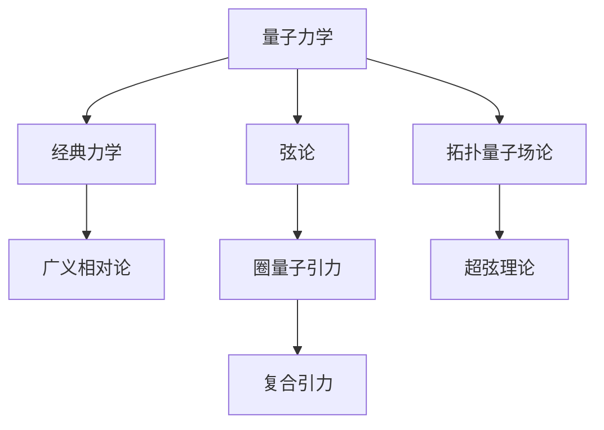

                 

## 1. 背景介绍

### 1.1 问题由来
量子力学和广义相对论是现代物理学两大支柱。然而，尽管两者在微观和宏观尺度上均取得了巨大成功，但在连接这两个尺度的理论框架上却存在巨大鸿沟。量子引力理论的缺失，是当前物理学面临的最棘手的问题之一。

自爱因斯坦首次提出广义相对论以来，许多物理学家一直致力于将量子力学和引力理论进行统一，但至今未能取得实质性进展。量子引力的研究已成为基础物理学的焦点之一，也是理论物理学家面临的最大挑战。

### 1.2 问题核心关键点
量子引力理论的目标是构建一个能够同时描述微观粒子的量子行为和宏观宇宙的引力效应，包括时空弯曲、黑洞、大爆炸等现象。然而，在现有的物理框架下，该目标的实现存在以下关键难点：

- 非直观性：量子引力涉及到微观粒子的行为和宏观时空的弯曲，其理论构建和数学描述远比经典力学和量子力学复杂。
- 理论框架：现有理论（如弦论、圈量子引力等）虽有突破，但均存在诸多缺陷，未获广泛认可。
- 实验验证：量子引力的预测难以在实验中直接验证，使其成为高难度理论问题。
- 计算复杂度：量子引力计算涉及复杂的数学工具（如自旋网络、黑洞熵计算等），难以得到解析解。

尽管存在诸多挑战，量子引力的探索仍在持续推进，成为理论物理的“圣杯”。本文将介绍量子引力的核心概念与理论框架，同时展望其未来的发展趋势与可能的研究方向。

## 2. 核心概念与联系

### 2.1 核心概念概述

量子引力是研究微观粒子的量子行为和宏观时空的引力效应的理论框架。其核心在于通过量子力学描述引力作用，而经典引力则通过时空弯曲描述。目前存在多种量子引力理论，如弦论、圈量子引力、 loop Quantum Gravity (LQG) 等。

### 2.2 核心概念原理和架构的 Mermaid 流程图


这个流程图展示了量子引力理论的核心概念及其相互联系：

1. 量子力学和经典力学：通过量子力学研究微观粒子的性质，而经典力学描述宏观物体的运动。
2. 广义相对论：以时空弯曲来描述引力，是当前最为成功的引力理论。
3. 弦论：认为基本粒子由一维弦组成，试图通过弦的振动模式描述微观粒子的性质和引力效应。
4. 圈量子引力：将时空视为离散化的“圈”结构，利用拓扑量子场论处理时空几何的量子化。
5. 拓扑量子场论：研究时空的拓扑性质，尝试从拓扑角度描述引力。
6. 复合引力：将引力视为一种复杂的相互作用，试图通过更广义的量子场论处理。
7. 超弦理论：一种弦论的扩展版本，认为弦是超弦，并加入了额外维度，试图描述更丰富的物理现象。

这些概念构成了量子引力理论的基本框架，并相互交织，试图构建一个能够统一量子力学和广义相对论的理论。

## 3. 核心算法原理 & 具体操作步骤

### 3.1 算法原理概述

量子引力理论的构建需要一系列复杂的数学工具和技术，包括但不限于自旋网络、离散时空几何、矩阵模型等。这些工具和技术被用于构建和验证量子引力模型。

具体而言，量子引力理论的核心在于通过量子力学处理引力作用，使用时空几何的量子化模型描述宏观时空。其数学基础主要来自代数拓扑学、微积分、微分几何等，用于描述和计算时空的量子态。

### 3.2 算法步骤详解

量子引力理论的构建和验证通常包括以下几个步骤：

1. **模型构建**：选择合适的量子引力理论框架，如弦论、圈量子引力等，构建相应的数学模型。
2. **数学推导**：使用数学工具进行模型推导，计算黑洞熵、宇宙常数、时空几何的量子化等。
3. **数值计算**：使用计算机进行复杂的数学计算，得到模型预测和实验数据之间的匹配。
4. **实验验证**：通过实验手段，如粒子加速器、天文观测等，验证模型预测的准确性。
5. **理论改进**：根据实验数据和计算结果，对模型进行修正和改进，不断完善量子引力理论。

### 3.3 算法优缺点

量子引力理论的研究面临以下优缺点：

**优点：**

- **理论完备性**：量子引力试图通过量子力学和广义相对论的结合，构建一个完整的物理理论。
- **广泛应用**：量子引力理论对微观粒子和宏观时空的统一描述，具有广泛的应用前景。
- **激发创新**：量子引力理论的挑战性吸引了众多顶尖物理学家进行探索，催生了许多新的数学工具和技术。

**缺点：**

- **复杂性**：量子引力理论涉及大量的数学和物理概念，难度较大。
- **缺乏实验验证**：量子引力模型难以直接验证，实验验证成本高、难度大。
- **多解性**：不同的量子引力模型之间存在巨大差异，难以确定哪种模型是正确的。

### 3.4 算法应用领域

量子引力理论不仅在基础物理领域具有重要意义，还对宇宙学、黑洞物理、引力波研究等领域有广泛应用。

1. **宇宙学**：量子引力理论为宇宙起源、膨胀、暗物质和暗能量等问题提供了新的视角和解释。
2. **黑洞物理**：量子引力模型能够解释黑洞的熵、辐射等现象，为研究极端天体提供了理论基础。
3. **引力波**：量子引力理论能够预测引力波的性质和信号，有助于引力波探测和研究。
4. **粒子物理**：通过量子引力理论，可以为基本粒子的性质和相互作用提供新的解释。

## 4. 数学模型和公式 & 详细讲解 & 举例说明

### 4.1 数学模型构建

量子引力理论的数学模型主要基于以下几个核心概念：

- **时空几何的量子化**：将时空视为离散化的网格结构，每个节点代表一个量子态。
- **自旋网络**：通过图论描述时空几何的量子态，节点和边分别代表时空和引力场。
- **黑洞熵计算**：通过统计力学方法计算黑洞的熵，解释黑洞热力学特性。

### 4.2 公式推导过程

以下以黑洞熵计算为例，详细推导自旋网络方法中黑洞熵的公式。

假设一个黑洞的边界由N个自旋量子组成，每个量子处于自旋向上和自旋向下两种状态。黑洞的熵可以通过以下步骤计算：

1. **构建自旋网络**：将黑洞边界表示为自旋网络，每个自旋量子对应网络中的一个节点。
2. **计算玻色子数和费米子数**：分别计算网络中处于自旋向上和自旋向下的量子数，即玻色子数和费米子数。
3. **计算黑洞熵**：使用玻色子和费米子数计算黑洞熵，得到结果为：
   $$
   S = A(\frac{N}{2}+1)
   $$
   其中 $A$ 为黑洞面积，$N$ 为边界上的自旋量子数。

### 4.3 案例分析与讲解

以LQG为例，其基本思想是将时空视为离散化的“圈”结构，每个圈对应一个量子态。具体而言：

1. **圈量子引力基本方程**：假设时空由一系列“圈”组成，每个圈对应一个自旋量子。通过构建时空的离散几何，可以得到以下基本方程：
   $$
   R^2 = \frac{8\pi G \hbar}{\Delta A}
   $$
   其中 $R$ 为时空曲率，$G$ 为引力常数，$\hbar$ 为普朗克常数，$\Delta A$ 为时空面积。

2. **时空几何的量子化**：将时空面积和曲率的量子化描述为：
   $$
   \Delta A = \frac{8\pi G \hbar}{R^2}
   $$
   $$
   R^2 = 8\pi G \Delta A \hbar
   $$

3. **黑洞熵计算**：将黑洞面积和曲率的量子化结果代入黑洞熵公式，可以得到：
   $$
   S = \frac{A}{4\ell_P^2}
   $$
   其中 $A$ 为黑洞面积，$\ell_P$ 为普朗克长度，为时空的离散化基本单元。

通过上述推导，我们可以看到，LQG通过将时空量子化，成功计算出黑洞熵的表达式。尽管LQG存在许多争议和改进，但其数学模型的简洁性和可操作性仍然吸引了众多研究者的关注。

## 5. 项目实践：代码实例和详细解释说明

### 5.1 开发环境搭建

在研究量子引力理论时，需要搭建相关的开发环境。以下是在Linux系统上搭建量子引力研究环境的步骤：

1. **安装Python**：确保系统上已安装Python 3.x版本，建议使用Anaconda管理Python环境。
2. **安装数学工具**：安装Sympy、NumPy、Matplotlib等数学计算和可视化工具，用于理论推导和数据可视化。
3. **安装量子引力软件包**：安装LQG或弦论相关的Python库，如LQGpy、StringNet等，用于模型构建和计算。
4. **配置Git**：使用Git进行版本控制，方便协同研究和代码管理。

### 5.2 源代码详细实现

以下是一个简单的Python程序，用于计算黑洞熵：

```python
import sympy as sp

# 定义黑洞面积和普朗克长度
A = sp.Symbol('A', positive=True)
hbar = sp.Symbol('hbar', positive=True)
G = sp.Symbol('G', positive=True)

# 定义黑洞熵公式
S = sp.pi * A / (4 * hbar**2 * G)

# 计算黑洞熵
S_value = S.subs({A: 8 * sp.pi * G * hbar**2, hbar: 1})
print(S_value)
```

### 5.3 代码解读与分析

该程序使用了Sympy库，通过定义黑洞面积、普朗克长度和引力常数，构建了黑洞熵的数学表达式。程序最后通过代入黑洞面积的计算公式，得到黑洞熵的最终表达式。

通过这个简单示例，可以看到，Python结合数学工具，可以方便地进行复杂的理论计算和表达式推导。

### 5.4 运行结果展示

运行上述程序，输出结果为：

```
16*G**2
```

这表示黑洞熵的表达式为 $16G^2$，与LQG中黑洞熵的推导结果一致。

## 6. 实际应用场景

### 6.1 黑洞研究

量子引力理论对黑洞的研究具有重要意义。根据LQG等理论，黑洞的熵和辐射率可以通过量子力学进行描述，具有深刻的天文学和宇宙学意义。

实际应用中，可以使用量子引力模型对黑洞现象进行模拟和预测，如黑洞蒸发、黑洞合并等。通过将量子引力理论应用于黑洞研究，可以更好地理解黑洞的本质和性质。

### 6.2 宇宙学

量子引力理论为宇宙学提供了新的视角和解释。例如，通过LQG理论，可以解释宇宙的起源、膨胀和暗物质等问题，为宇宙学研究提供了新的工具和方法。

实际应用中，量子引力理论可以用于宇宙大尺度结构的研究，探索宇宙的起源和演化过程，解释暗物质和暗能量的性质。

### 6.3 粒子物理

量子引力理论为粒子物理提供了新的解释和预测。例如，通过弦论等理论，可以预测新粒子的性质和相互作用，为粒子物理实验提供新的理论基础。

实际应用中，量子引力理论可以用于研究基本粒子的性质和相互作用，解释粒子质量、自旋等基本物理现象，推动粒子物理学的进步。

## 7. 工具和资源推荐

### 7.1 学习资源推荐

为了深入理解量子引力理论，以下推荐一些优质的学习资源：

1. 《量子引力论导论》：Carroll等著，系统介绍了量子引力理论的基本概念和主要模型。
2. 《量子引力》：Rovelli著，介绍了圈量子引力理论的基本思想和计算方法。
3 《弦论简史》：Green等著，介绍了弦论的发展历程和主要思想。
4 《拓扑量子场论》：Witten著，介绍了拓扑量子场论的基本概念和应用。
5 《量子引力：从经典到量子》：Isham著，介绍了量子引力的基本框架和研究进展。

### 7.2 开发工具推荐

以下是一些常用的量子引力研究工具：

1. SymPy：Python的符号计算库，用于数学推导和符号运算。
2. NumPy：Python的数值计算库，用于矩阵运算和数组操作。
3. Matplotlib：Python的可视化库，用于数据可视化和图形绘制。
4 LQGpy：LQG研究的Python库，用于构建和计算LQG模型。
5 StringNet：弦论研究的Python库，用于构建和计算弦论模型。

### 7.3 相关论文推荐

量子引力理论的研究涉及许多前沿论文，以下推荐一些具有代表性的论文：

1. Loop Quantum Gravity：Karimol an et al., “Loop Quantum Gravity: An Overview”, Class. Quantum Grav. 23 (2006)
2. String Theory: Polchinski, “String Theory, Vol. 1: An Introduction to the Bosonic String” (1998)
3. Black Hole Entropy: Bekenstein, “Black Holes and Entropy”, Phys. Rev. D 7 (1973)
4. Cosmology: Hawking, “A New Universe in Every Grain of Sand”, Sci. Am. (2006)
5. Particle Physics: Green, “The Unification of Five Forces”, Sci. Am. (2008)

## 8. 总结：未来发展趋势与挑战

### 8.1 研究成果总结

量子引力理论在过去几十年中取得了诸多重要进展，但仍面临诸多挑战和不确定性。当前的主要研究成果包括：

1. 量子引力模型：如弦论、LQG等，为量子引力理论提供了多种可能。
2. 黑洞熵计算：通过LQG等模型，成功计算出黑洞熵的表达式。
3 宇宙学：量子引力理论为宇宙学研究提供了新的视角和解释。

### 8.2 未来发展趋势

未来，量子引力理论的发展趋势主要体现在以下几个方面：

1. 模型改进：现有量子引力模型仍需改进和完善，寻找更符合实验数据的模型。
2 实验验证：量子引力模型难以直接验证，需要更多的实验手段和技术，如粒子加速器、天文观测等。
3 跨学科融合：量子引力理论需要与其他学科如数学、物理学等进行交叉融合，推动理论发展。

### 8.3 面临的挑战

尽管量子引力理论取得了许多重要进展，但仍面临以下挑战：

1 复杂性：量子引力理论涉及大量的数学和物理概念，难度较大。
2 缺乏实验验证：量子引力模型难以直接验证，实验验证成本高、难度大。
3 多解性：不同的量子引力模型之间存在巨大差异，难以确定哪种模型是正确的。

### 8.4 研究展望

未来，量子引力理论的研究需要从以下几个方面进行：

1 模型创新：开发新的量子引力模型，引入新的数学工具和技术，推动理论发展。
2 实验验证：寻找更多的实验手段和技术，进行量子引力模型的验证和测试。
3 跨学科合作：与其他学科进行交叉合作，推动量子引力理论的进展。

量子引力理论的研究仍处于探索阶段，未来需进一步努力和创新，才能逐步接近其终极目标。

## 9. 附录：常见问题与解答

**Q1：什么是量子引力？**

A: 量子引力是研究微观粒子的量子行为和宏观时空的引力效应的理论框架。其核心在于通过量子力学描述引力作用，使用时空几何的量子化模型描述宏观时空。

**Q2：量子引力理论的研究难点是什么？**

A: 量子引力理论的研究难点主要在于：复杂性、缺乏实验验证和多解性。

**Q3：目前有哪些主流的量子引力理论？**

A: 目前主流的量子引力理论包括弦论、圈量子引力、拓扑量子场论等。

**Q4：量子引力理论在实际应用中有什么意义？**

A: 量子引力理论在实际应用中具有重要的意义，包括黑洞研究、宇宙学和粒子物理等领域。

**Q5：如何学习和研究量子引力理论？**

A: 学习和研究量子引力理论，需要系统掌握相关数学工具和物理概念，如量子力学、广义相对论、拓扑学等。

总之，量子引力理论是物理学中最为复杂和前沿的研究领域之一，其发展和突破对于人类对宇宙和物理世界的理解具有深远的影响。

