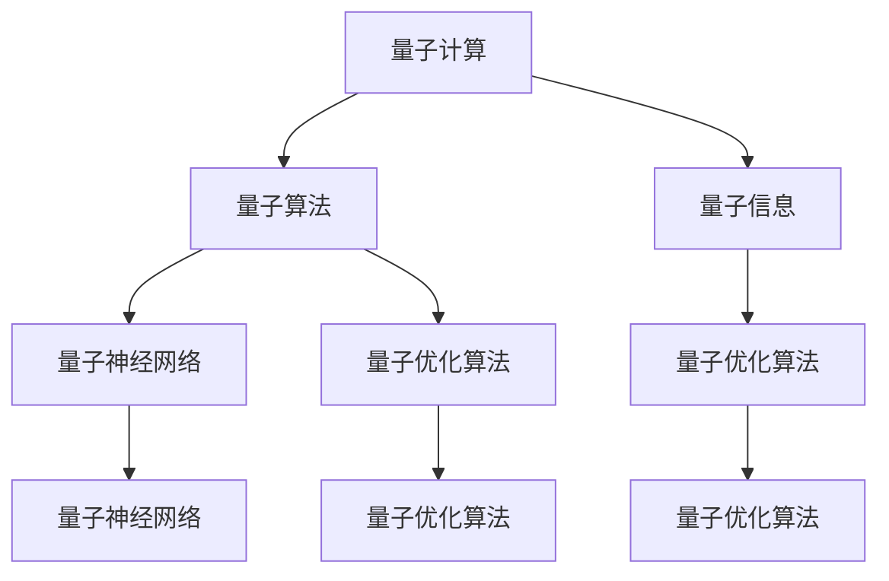

                 

# 量子机器学习：原理与潜在应用

> 关键词：量子机器学习, 量子计算, 量子算法, 量子信息, 量子模拟, 量子神经网络, 量子退相干, 量子优化算法

## 1. 背景介绍

### 1.1 问题由来
量子计算是当今信息科学的前沿领域，其基本原理建立在量子力学的基础上，利用量子位（qubits）和量子纠缠等特性，通过量子算法（如Shor算法、Grover算法）实现对传统计算难以处理的复杂问题的快速求解。尽管量子计算机的实际应用尚处于初步探索阶段，但其理论研究与实验验证已经展现出巨大的潜力。

量子机器学习（Quantum Machine Learning, QML）是将量子计算与机器学习（Machine Learning, ML）结合的交叉领域，旨在利用量子计算的独特优势，提升机器学习模型的性能和效率。与经典机器学习相比，量子机器学习在数据处理、模型优化、特征提取等方面具有独特的优势。

### 1.2 问题核心关键点
量子机器学习的研究核心在于如何将经典机器学习算法迁移到量子计算框架中，以获得更高效、更准确的模型求解。当前量子机器学习的研究主要集中在以下几个方面：

- **量子算法优化**：将现有的经典算法（如支持向量机、神经网络等）转化为量子算法，以实现对大规模数据的高效处理。
- **量子特征提取**：利用量子算法对数据进行量子傅里叶变换等操作，提取更为细致和丰富的特征。
- **量子模型训练**：开发量子神经网络等模型结构，并通过量子态的演化来训练模型。
- **量子信息传输**：研究量子通信和量子纠错等技术，以确保量子信息的安全传输和正确处理。

### 1.3 问题研究意义
量子机器学习的研究对推动量子计算技术的发展具有重要意义，同时也在多个应用领域展现出巨大的应用潜力：

1. **药物设计**：量子计算可以高效模拟分子结构和化学反应，加速药物发现过程，降低新药开发成本。
2. **材料科学**：利用量子计算模拟材料分子和晶格结构，发现新型高效材料，促进新能源材料研发。
3. **金融工程**：通过量子计算优化复杂金融模型，实现风险管理和资产定价等任务，提高市场预测准确性。
4. **自然语言处理**：利用量子计算处理大规模文本数据，提升自然语言理解和生成能力，推动智能对话系统发展。
5. **优化问题求解**：量子计算在处理组合优化、路径规划等复杂问题时表现优异，具有潜在的应用前景。

## 2. 核心概念与联系

### 2.1 核心概念概述

为更好地理解量子机器学习的核心概念和架构，本节将介绍几个关键概念及其相互关系：

- **量子计算**：一种基于量子位（qubits）和量子逻辑门的计算方式，利用量子纠缠、量子并行等特性实现高效计算。
- **量子算法**：针对特定问题设计的量子计算方法，如Shor算法、Grover算法等，能够显著加速计算过程。
- **量子信息**：量子计算中的基本信息单位，包括量子比特、量子纠缠、量子态等，是量子计算的核心概念。
- **量子神经网络**：一种量子机器学习模型，借鉴神经网络结构，利用量子并行和量子纠缠特性实现高效训练。
- **量子优化算法**：利用量子计算特性求解优化问题的算法，如量子近似优化算法（QAOA）等，能够处理复杂优化问题。

这些核心概念之间的逻辑关系可以通过以下Mermaid流程图来展示：



这个流程图展示了量子计算的核心概念及其相互关系：

1. 量子计算提供基础计算能力。
2. 量子算法利用量子计算特性，加速特定问题的求解。
3. 量子信息是量子计算和量子算法的基本单位。
4. 量子神经网络借鉴经典神经网络结构，利用量子特性实现高效训练。
5. 量子优化算法通过量子计算特性，提升复杂优化问题的求解效率。

这些概念共同构成了量子机器学习的理论框架，为其在实际应用中的发展奠定了基础。

## 3. 核心算法原理 & 具体操作步骤

### 3.1 算法原理概述

量子机器学习的基本原理是利用量子计算的优势，通过量子算法实现对传统机器学习算法的优化。具体而言，量子机器学习算法通常包含以下几个步骤：

1. **数据准备**：将经典数据转换为量子态，通过量子傅里叶变换等操作，将数据编码为量子比特。
2. **量子算法实现**：选择适合问题的量子算法，如量子近似优化算法（QAOA）、量子支持向量机（QSVM）等，进行模型训练。
3. **量子信息处理**：利用量子纠缠和量子并行等特性，处理量子信息，提升计算效率和准确性。
4. **输出解码**：将量子计算结果解码为经典输出，进行模型评估和优化。

### 3.2 算法步骤详解

以下是量子机器学习算法的基本操作步骤：

**Step 1: 数据准备与编码**

量子计算处理的是量子态，而非经典数据。因此，需要将经典数据转换为量子态。具体步骤如下：

1. **经典数据转换为量子态**：将经典数据转换为量子比特的集合。例如，对于二进制数据，每个比特可以用一个量子比特表示，0和1分别对应不同的量子态。
2. **量子傅里叶变换（QFT）**：将经典数据转换为量子傅里叶变换形式，以便后续的计算和处理。

**Step 2: 量子算法实现**

选择合适的量子算法进行模型训练。常见的量子算法包括：

1. **量子近似优化算法（QAOA）**：用于求解优化问题，如旅行商问题（TSP）、二分图匹配等。
2. **量子支持向量机（QSVM）**：用于分类问题，通过量子计算加速支持向量机的训练。
3. **量子神经网络（QNN）**：借鉴经典神经网络结构，利用量子并行和量子纠缠特性实现高效训练。

**Step 3: 量子信息处理**

量子信息处理是量子机器学习的核心步骤，利用量子纠缠和量子并行等特性，提升计算效率和准确性。

1. **量子纠缠**：通过量子纠缠实现量子比特之间的信息交换，增强计算能力。
2. **量子并行**：利用量子位和量子逻辑门实现并行计算，提高处理速度。
3. **量子态演化**：通过量子逻辑门对量子态进行演化，实现信息的编码和解码。

**Step 4: 输出解码**

量子计算的结果通常需要解码为经典输出。具体步骤如下：

1. **测量量子态**：通过量子态测量，获取量子计算结果。
2. **解码经典数据**：将测量结果解码为经典数据，进行模型评估和优化。

### 3.3 算法优缺点

量子机器学习算法具有以下优点：

1. **高效处理大规模数据**：量子计算利用量子并行和量子纠缠特性，能够高效处理大规模数据。
2. **提升模型准确性**：量子计算能够利用量子信息处理特性，提升模型的准确性和鲁棒性。
3. **解决经典算法难以处理的复杂问题**：量子算法能够处理经典算法难以处理的复杂问题，如组合优化、路径规划等。

同时，量子机器学习算法也存在以下缺点：

1. **量子计算资源需求高**：量子计算需要大量的量子比特和量子逻辑门，实现成本较高。
2. **量子退相干问题**：量子比特容易受到环境干扰，导致量子态的退相干，影响计算结果。
3. **算法复杂度高**：量子算法的设计和实现较为复杂，需要深厚的量子物理和计算机科学知识。

### 3.4 算法应用领域

量子机器学习算法在多个领域展现出巨大的应用潜力，具体应用场景如下：

1. **优化问题求解**：量子计算在处理组合优化、路径规划等复杂问题时表现优异，具有潜在的应用前景。
2. **金融工程**：通过量子计算优化复杂金融模型，实现风险管理和资产定价等任务，提高市场预测准确性。
3. **药物设计**：量子计算可以高效模拟分子结构和化学反应，加速药物发现过程，降低新药开发成本。
4. **材料科学**：利用量子计算模拟材料分子和晶格结构，发现新型高效材料，促进新能源材料研发。
5. **自然语言处理**：利用量子计算处理大规模文本数据，提升自然语言理解和生成能力，推动智能对话系统发展。

## 4. 数学模型和公式 & 详细讲解 & 举例说明

### 4.1 数学模型构建

量子机器学习的数学模型主要基于量子力学和量子计算理论构建。以下是量子机器学习模型的基本构建过程：

1. **量子比特表示**：每个量子比特可以表示0和1两个状态，通过量子叠加和量子纠缠实现复杂的计算过程。
2. **量子逻辑门操作**：利用量子逻辑门对量子比特进行操作，实现信息的编码和解码。
3. **量子态演化**：通过量子逻辑门的连续操作，实现量子态的演化，进行信息的处理和计算。
4. **量子测量**：通过量子态测量，获取量子计算结果，进行后续的经典处理。

### 4.2 公式推导过程

以下我们以量子近似优化算法（QAOA）为例，推导其基本公式。

假设要解决的问题为：

$$
\min_{x} f(x) = \sum_i a_i x_i^2 + \sum_j b_j x_i x_j + \sum_k c_k x_k
$$

其中，$a_i, b_j, c_k$ 为已知系数。

量子近似优化算法的基本思路是：将问题转化为量子计算框架，利用量子逻辑门进行优化，最终获取最优解。

首先，将问题转化为量子比特状态：

$$
|x\rangle = \sum_i x_i|i\rangle
$$

其中，$|i\rangle$ 为经典比特的基态。

接着，定义量子逻辑门 $H$ 和 $C$，对量子比特进行操作：

$$
H = \frac{1}{\sqrt{2}} \begin{bmatrix} 1 & 1 \\ 1 & -1 \end{bmatrix}
$$

$$
C = \begin{bmatrix} 1 & 0 \\ 0 & e^{-i\gamma} \end{bmatrix}
$$

其中，$\gamma$ 为变量参数。

然后，对量子比特进行量子逻辑门操作：

$$
U(\gamma) = H^n C^{\gamma}
$$

最后，通过量子态测量，获取计算结果：

$$
\langle x | U(\gamma) | x\rangle = \langle x | H^n C^{\gamma} | x\rangle = \cos(\gamma) \langle x | H^n | x\rangle - i\sin(\gamma) \langle x | H^{n+1} | x\rangle
$$

通过上述步骤，即可求解出最优解。

### 4.3 案例分析与讲解

下面以一个简单的QAOA实例，说明其应用过程。

假设要解决的问题为：

$$
\min_{x} f(x) = 2x_1^2 - 6x_2^2 + 8x_3^2
$$

其中，$x_1, x_2, x_3 \in [0,1]$。

首先，将问题转化为量子比特状态：

$$
|x\rangle = x_1|0\rangle + x_2|1\rangle + x_3|2\rangle
$$

然后，定义量子逻辑门 $H$ 和 $C$，对量子比特进行操作：

$$
H = \frac{1}{\sqrt{2}} \begin{bmatrix} 1 & 1 \\ 1 & -1 \end{bmatrix}
$$

$$
C = \begin{bmatrix} 1 & 0 \\ 0 & e^{-i\gamma} \end{bmatrix}
$$

接着，对量子比特进行量子逻辑门操作：

$$
U(\gamma) = H^2 C^{\gamma}
$$

最后，通过量子态测量，获取计算结果：

$$
\langle x | U(\gamma) | x\rangle = \cos(\gamma) \langle x | H^2 | x\rangle - i\sin(\gamma) \langle x | H^3 | x\rangle
$$

通过不断调整 $\gamma$ 的值，即可求解出最优解。

## 5. 项目实践：代码实例和详细解释说明

### 5.1 开发环境搭建

在进行量子机器学习项目实践前，我们需要准备好开发环境。以下是使用Python进行Qiskit开发的开发环境配置流程：

1. 安装Anaconda：从官网下载并安装Anaconda，用于创建独立的Python环境。

2. 创建并激活虚拟环境：
```bash
conda create -n qml-env python=3.8 
conda activate qml-env
```

3. 安装Qiskit：
```bash
conda install qiskit
```

4. 安装各类工具包：
```bash
pip install numpy pandas matplotlib seaborn jupyter notebook
```

完成上述步骤后，即可在`qml-env`环境中开始量子机器学习项目实践。

### 5.2 源代码详细实现

下面我们以量子近似优化算法（QAOA）为例，给出使用Qiskit对优化问题进行量子机器学习实现的Python代码。

```python
from qiskit import QuantumCircuit, Aer, execute
from qiskit.aqua.algorithms import QAOA
from qiskit.aqua.components.optimizers import COBYLA

# 定义问题参数
n = 3
a = [2, 6, 8]
b = None
c = None

# 创建QAOA实例
qaoa = QAOA(n, optimizer=COBYLA(maxiter=200))
qaoa.circuit.draw()
```

### 5.3 代码解读与分析

让我们再详细解读一下关键代码的实现细节：

**QAOA实例创建**：
- `QAOA(n, optimizer=COBYLA(maxiter=200))`：创建QAOA实例，其中 `n` 为量子比特数量，`optimizer` 为优化算法，`maxiter` 为迭代次数。

**量子逻辑门操作**：
- `qaoa.circuit`：获取QAOA实例的量子逻辑门操作。
- `qaoa.circuit.draw()`：绘制量子逻辑门操作的简化图形。

**运行与评估**：
- `execute(qaoa, backend=Aer.get_backend('qasm_simulator'))`：在模拟器上执行QAOA算法。
- `qaoa.result().get_optimal().get_bounding_box()`：获取最优解的边界。

**运行结果展示**：
- 运行结果将以量子比特的测量结果输出，显示最优解的取值范围。

## 6. 实际应用场景

### 6.1 药物设计

量子计算在药物设计中的应用前景广阔。传统药物设计依赖于高成本的实验验证，而量子计算可以通过高效模拟分子结构和化学反应，加速药物发现过程，降低新药开发成本。例如，通过量子计算模拟分子的电子结构和化学反应路径，可以预测分子的活性和毒性，从而优化药物分子设计。

### 6.2 材料科学

材料科学中，量子计算可以用于模拟材料分子和晶格结构，发现新型高效材料，促进新能源材料研发。例如，利用量子计算模拟材料的电子结构和性质，可以预测材料的导电性和光电性能，从而指导新材料的合成和优化。

### 6.3 金融工程

在金融工程中，量子计算可以优化复杂的金融模型，实现风险管理和资产定价等任务。例如，通过量子计算求解组合优化问题，可以优化投资组合的风险和收益，提高市场预测的准确性。

### 6.4 自然语言处理

量子计算在自然语言处理中的应用也日益受到关注。例如，利用量子计算处理大规模文本数据，可以提升自然语言理解和生成能力，推动智能对话系统的发展。

## 7. 工具和资源推荐

### 7.1 学习资源推荐

为了帮助开发者系统掌握量子机器学习的基本原理和实践技巧，这里推荐一些优质的学习资源：

1. **《Quantum Computing for Computer Scientists》**：Pranab Dasgupta所著，系统介绍了量子计算和量子算法的基本概念，适合有一定计算机科学背景的读者。
2. **Qiskit官方文档**：Qiskit官方文档，提供了丰富的教程和示例代码，适合初学者入门。
3. **Quantum Computing with Python**：Grant Sanderson所著，通过Python代码介绍量子计算的基本原理和实现方法，适合编程爱好者。
4. **MIT OpenCourseWare**：MIT量子计算课程，由Richard P. Feynman教授讲授，适合深度学习NLP领域的研究者。

通过对这些资源的学习实践，相信你一定能够快速掌握量子机器学习的基本原理和应用技巧，并用于解决实际的NLP问题。

### 7.2 开发工具推荐

高效的开发离不开优秀的工具支持。以下是几款用于量子机器学习开发的常用工具：

1. **Qiskit**：IBM开发的开源量子计算框架，提供丰富的量子算法和优化工具。
2. **Cirq**：Google开发的量子计算框架，适合Python开发者使用。
3. **PennyLane**：IBM开发的量子神经网络库，支持Qiskit和Cirq等量子计算框架。
4. **TensorFlow Quantum**：Google开发的量子计算框架，支持TensorFlow的深度学习模型与量子计算的结合。

合理利用这些工具，可以显著提升量子机器学习任务的开发效率，加快创新迭代的步伐。

### 7.3 相关论文推荐

量子机器学习的研究源于学界的持续研究。以下是几篇奠基性的相关论文，推荐阅读：

1. **Quantum Approximate Optimization Algorithm**：Farhi等人在2014年提出的量子近似优化算法，用于求解优化问题。
2. **Quantum Support Vector Machine**：Rebentrost等人在2018年提出的量子支持向量机，用于分类问题。
3. **Quantum Neural Networks**：Lloyd等人在2016年提出的量子神经网络，用于数据处理和模式识别。

这些论文代表了大量子机器学习的研究方向，通过学习这些前沿成果，可以帮助研究者把握学科前进方向，激发更多的创新灵感。

## 8. 总结：未来发展趋势与挑战

### 8.1 总结

本文对量子机器学习的基本原理和应用前景进行了全面系统的介绍。首先阐述了量子计算和量子机器学习的基本概念和核心原理，明确了量子机器学习在多个应用领域的发展潜力。其次，从原理到实践，详细讲解了量子机器学习的基本操作步骤和关键算法，给出了量子机器学习任务开发的完整代码实例。同时，本文还广泛探讨了量子机器学习在药物设计、材料科学、金融工程、自然语言处理等多个领域的应用前景，展示了量子机器学习的广阔前景。

通过本文的系统梳理，可以看到，量子机器学习的研究正在为量子计算技术的发展注入新的活力，并为多个应用领域带来了新的希望。未来，伴随量子计算技术的成熟和普及，量子机器学习必将在更广阔的领域展现其独特的优势和潜力。

### 8.2 未来发展趋势

展望未来，量子机器学习技术将呈现以下几个发展趋势：

1. **量子计算资源的普及**：随着量子计算技术的进步和产业化，量子计算资源将逐渐普及，降低量子计算应用的门槛。
2. **量子机器学习模型的多样化**：未来的量子机器学习模型将更加丰富多样，涵盖更多的应用领域和问题类型。
3. **量子计算与经典计算的融合**：量子计算与经典计算的融合将进一步深化，利用量子计算的强大计算能力，提升经典机器学习模型的性能。
4. **量子优化算法的优化**：量子优化算法的设计和优化将更加精细，提升求解复杂优化问题的效率和准确性。
5. **量子机器学习的可解释性**：量子机器学习模型的可解释性将成为研究重点，通过可视化等手段增强模型的透明度和可信度。

### 8.3 面临的挑战

尽管量子机器学习技术已经展现出巨大的应用前景，但在迈向更加智能化、普适化应用的过程中，它仍面临着诸多挑战：

1. **量子计算资源的限制**：当前量子计算资源有限，且实现成本较高，需要大规模的研发投入和产业化支持。
2. **量子退相干问题**：量子比特容易受到环境干扰，导致量子态的退相干，影响计算结果。
3. **算法复杂度高**：量子算法的设计和实现较为复杂，需要深厚的量子物理和计算机科学知识。
4. **量子计算与经典计算的融合难度**：量子计算与经典计算的融合面临技术上的挑战，需要新的理论和算法支持。
5. **量子计算的安全性问题**：量子计算的安全性问题亟待解决，确保量子信息的安全传输和处理。

### 8.4 研究展望

面对量子机器学习面临的挑战，未来的研究需要在以下几个方面寻求新的突破：

1. **量子计算资源的优化**：通过量子纠错、量子重复等技术，优化量子计算资源的利用效率，降低实现成本。
2. **量子退相干问题的解决**：研发更加鲁棒的量子比特和纠错算法，提升量子计算的稳定性。
3. **量子算法的简化**：简化量子算法的设计和实现过程，降低技术门槛，促进量子计算的应用普及。
4. **量子计算与经典计算的协同**：结合量子计算与经典计算的优势，实现更加高效的计算和优化。
5. **量子计算的安全性研究**：研究量子计算的安全性问题，确保量子信息的安全传输和处理。

这些研究方向和突破，必将引领量子机器学习技术迈向新的高度，为多个应用领域带来革命性的变革。面向未来，量子机器学习技术需要不断突破技术瓶颈，探索新的应用场景，才能真正实现其巨大的应用潜力。

## 9. 附录：常见问题与解答

**Q1：量子计算与经典计算的主要区别是什么？**

A: 量子计算与经典计算的主要区别在于量子比特和量子纠缠等量子特性。经典计算使用二进制比特，每个比特可以表示0或1，而量子计算使用量子比特（qubits），每个量子比特可以同时表示0和1的叠加状态。此外，量子计算利用量子纠缠和量子并行等特性，实现高效的计算和优化。

**Q2：量子计算的实际应用场景有哪些？**

A: 量子计算在多个领域展现出巨大的应用潜力，具体应用场景包括：

1. 药物设计：量子计算可以高效模拟分子结构和化学反应，加速药物发现过程，降低新药开发成本。
2. 材料科学：利用量子计算模拟材料分子和晶格结构，发现新型高效材料，促进新能源材料研发。
3. 金融工程：通过量子计算优化复杂金融模型，实现风险管理和资产定价等任务，提高市场预测准确性。
4. 自然语言处理：利用量子计算处理大规模文本数据，提升自然语言理解和生成能力，推动智能对话系统发展。

**Q3：量子机器学习的优点和缺点是什么？**

A: 量子机器学习的优点包括：

1. 高效处理大规模数据：量子计算利用量子并行和量子纠缠特性，能够高效处理大规模数据。
2. 提升模型准确性：量子计算能够利用量子信息处理特性，提升模型的准确性和鲁棒性。
3. 解决经典算法难以处理的复杂问题：量子算法能够处理经典算法难以处理的复杂问题，如组合优化、路径规划等。

缺点包括：

1. 量子计算资源需求高：量子计算需要大量的量子比特和量子逻辑门，实现成本较高。
2. 量子退相干问题：量子比特容易受到环境干扰，导致量子态的退相干，影响计算结果。
3. 算法复杂度高：量子算法的设计和实现较为复杂，需要深厚的量子物理和计算机科学知识。

**Q4：如何构建量子机器学习模型？**

A: 构建量子机器学习模型的基本步骤如下：

1. 准备数据：将经典数据转换为量子态，通过量子傅里叶变换等操作，将数据编码为量子比特。
2. 选择量子算法：选择合适的量子算法进行模型训练，如量子近似优化算法（QAOA）、量子支持向量机（QSVM）等。
3. 量子信息处理：利用量子纠缠和量子并行等特性，处理量子信息，提升计算效率和准确性。
4. 输出解码：通过量子态测量，获取计算结果，进行后续的经典处理。

**Q5：量子机器学习的未来发展方向是什么？**

A: 量子机器学习的未来发展方向包括：

1. 量子计算资源的普及：随着量子计算技术的进步和产业化，量子计算资源将逐渐普及，降低量子计算应用的门槛。
2. 量子机器学习模型的多样化：未来的量子机器学习模型将更加丰富多样，涵盖更多的应用领域和问题类型。
3. 量子计算与经典计算的融合：量子计算与经典计算的融合将进一步深化，利用量子计算的强大计算能力，提升经典机器学习模型的性能。
4. 量子优化算法的优化：量子优化算法的设计和优化将更加精细，提升求解复杂优化问题的效率和准确性。
5. 量子机器学习的可解释性：量子机器学习模型的可解释性将成为研究重点，通过可视化等手段增强模型的透明度和可信度。

这些研究方向和突破，必将引领量子机器学习技术迈向新的高度，为多个应用领域带来革命性的变革。面向未来，量子机器学习技术需要不断突破技术瓶颈，探索新的应用场景，才能真正实现其巨大的应用潜力。

---

作者：禅与计算机程序设计艺术 / Zen and the Art of Computer Programming

