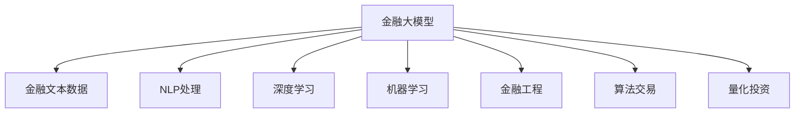

                 

# 金融大模型:精准的风险管理和投资决策

> 关键词：金融大模型, 精准风险管理, 投资决策, 机器学习, 深度学习, 金融工程, 算法交易, 量化投资

## 1. 背景介绍

### 1.1 问题由来
金融领域对风险管理和投资决策的要求极为严格。传统的统计和财务模型往往依赖历史数据，难以应对多变的市场环境和复杂的金融产品。而利用深度学习和自然语言处理技术，开发金融大模型，可以在高维度的数据空间中挖掘更多的信息，实现对金融市场的精准理解和预测。

近年来，金融领域的深度学习和人工智能应用得到了快速发展。特别是通过预训练语言模型在金融数据的语义理解和关联分析方面取得了显著进展。金融大模型的应用，例如量化投资、信用评估、风险预测等，正在逐步改变传统的金融决策模式，提升金融机构的智能化水平。

### 1.2 问题核心关键点
金融大模型在金融领域的应用，核心关键点在于如何利用语言模型处理和分析金融文本数据，从而实现对金融市场和产品的高效管理。主要包括以下几个方面：

- 大数据预处理与特征提取：如何将海量的金融文本数据转化为模型可接受的格式，并提取有意义的特征。
- 语义理解与关联分析：如何通过语言模型对金融文本进行语义分析和关联分析，挖掘出深层次的金融信息。
- 金融事件预测与风险管理：如何将模型应用到金融事件的预测和风险管理中，提高模型的精准度和鲁棒性。
- 投资决策与算法交易：如何结合金融大模型进行精准的投资决策和算法交易，优化投资组合，实现资产增值。

本文将系统介绍金融大模型的核心概念和算法，并通过具体案例展示其在金融风险管理和投资决策中的应用。

## 2. 核心概念与联系

### 2.1 核心概念概述

为了更好地理解金融大模型的应用，本节将介绍几个密切相关的核心概念：

- 金融大模型（Financial Big Model）：利用深度学习技术，在金融文本和数据上训练得到的具备金融领域知识表示能力的模型。其核心在于如何将金融文本转化为高维向量，并应用于金融风险管理和投资决策。

- 金融文本数据（Financial Text Data）：包含金融新闻、公告、财务报告等内容的文本数据。金融文本数据量大、分布广，结构化信息与非结构化信息并存，需要特殊处理。

- 自然语言处理（NLP）：通过语言模型、文本分类、实体识别等技术，处理和分析金融文本数据的自然语言特性，提取有价值的金融信息。

- 深度学习（Deep Learning）：利用多层神经网络，通过端到端的学习过程，自动提取金融数据中的高层次特征，用于金融风险管理和投资决策的预测和优化。

- 机器学习（Machine Learning）：在有限标注数据下，通过构建模型，学习金融文本和数据的规律，进行金融事件的预测和风险管理。

- 金融工程（Financial Engineering）：利用数学和计算机技术，通过模型化处理金融市场风险，优化投资决策，实现金融资产的保值增值。

- 算法交易（Algorithmic Trading）：利用计算机程序自动化交易，通过量化模型进行高频率交易，获取微小的价格差异收益。

- 量化投资（Quantitative Investment）：通过数学和统计方法，建立量化模型进行投资组合优化，利用计算机程序自动交易，获取稳定的长期收益。

这些核心概念之间的逻辑关系可以通过以下Mermaid流程图来展示：



这个流程图展示了大模型处理金融文本数据的主要流程，从文本数据的预处理到特征提取，再到应用自然语言处理、深度学习等技术进行金融事件的预测和风险管理，最终通过金融工程和算法交易实现投资决策的优化。

## 3. 核心算法原理 & 具体操作步骤
### 3.1 算法原理概述

金融大模型的核心算法原理，是利用深度学习技术在金融文本数据上进行预训练，然后针对特定的金融任务进行微调。该范式在金融领域的应用，主要包括以下几个关键步骤：

1. 金融文本数据预处理：将金融文本数据进行清洗、分词、去除停用词等预处理，转化为机器学习可接受的格式。
2. 特征提取与表示学习：利用预训练的语言模型，对金融文本数据进行向量表示学习，提取高维特征向量。
3. 金融事件预测与风险管理：通过构建分类或回归模型，预测金融事件的发生概率或风险水平。
4. 投资决策与算法交易：结合预测结果，优化投资组合或设计交易策略，实现资产增值。

### 3.2 算法步骤详解

金融大模型的具体操作步骤，可以分为以下几步：

**Step 1: 数据预处理与特征提取**
- 金融文本数据的预处理：清洗、分词、去除停用词、去除噪声等，确保数据质量。
- 使用预训练的语言模型（如BERT、RoBERTa等）对金融文本数据进行编码，得到高维向量表示。

**Step 2: 模型构建与训练**
- 选择合适的深度学习模型，如RNN、LSTM、Transformer等，用于处理金融文本数据。
- 将预训练的语言模型应用于金融文本数据，进行迁移学习，获取金融领域知识表示。
- 针对具体的金融任务，构建分类或回归模型，如信用评分、风险预测、事件分类等。
- 使用标注数据集进行模型训练，优化模型参数，最小化损失函数。

**Step 3: 模型评估与调优**
- 在验证集上评估模型的性能，计算准确率、召回率、F1值等指标。
- 根据评估结果调整模型参数，进行超参数优化，如调整学习率、批量大小等。
- 使用A/B测试等方法，评估模型的实际效果，进行模型调优。

**Step 4: 应用部署与优化**
- 将训练好的模型部署到生产环境，进行实时预测和风险管理。
- 结合金融工程的模型和方法，优化投资组合或设计交易策略。
- 实时监控模型性能，根据市场变化进行模型更新和优化。

### 3.3 算法优缺点

金融大模型在金融风险管理和投资决策中的应用，具有以下优点：

1. 精准度提升：金融大模型能够自动挖掘金融文本中的隐含信息，准确预测金融事件和风险水平，提升投资决策的精准度。
2. 鲁棒性增强：通过深度学习技术，金融大模型可以适应多变的金融市场环境，提高模型的鲁棒性。
3. 自动化操作：金融大模型可以实现自动化的投资决策和交易操作，提高金融机构的效率。
4. 个性化定制：金融大模型可以针对不同的投资目标和风险偏好，提供个性化的投资组合和策略。

同时，该算法也存在一些局限性：

1. 数据依赖：金融大模型依赖于高质量的金融文本数据和标注数据，获取这些数据成本较高。
2. 模型复杂：深度学习模型的复杂度较高，需要较强的计算资源和存储能力。
3. 解释性不足：金融大模型的决策过程较难解释，难以理解模型的内部机制。
4. 市场风险：金融大模型可能受到市场异常情况的影响，导致预测结果偏差。

### 3.4 算法应用领域

金融大模型在金融领域的应用非常广泛，包括但不限于以下几个方面：

- 信用评分与信用风险管理：利用金融文本数据，对客户的信用水平进行评估，预测信用风险，帮助金融机构进行贷款审批和信用管理。
- 市场预测与事件分类：通过分析金融文本数据，预测市场走势、政策变化等事件，帮助投资者制定投资策略。
- 股票交易与算法交易：利用金融大模型进行股票价格预测，设计自动化交易策略，实现高频交易和量化投资。
- 债券定价与风险评估：对债券市场进行定价和风险评估，帮助投资者识别市场机会和风险。
- 期权定价与套利策略：利用金融大模型对期权价格进行预测，设计套利策略，获取套利收益。
- 金融事件监测与舆情分析：对金融市场的动态变化进行实时监测，分析舆情信息，提供风险预警和市场动态分析。

## 4. 数学模型和公式 & 详细讲解 & 举例说明

### 4.1 数学模型构建

在金融大模型的应用中，我们通常会构建一个预测模型 $M$，其输入为金融文本数据 $x$，输出为预测结果 $y$。模型的目标是最小化损失函数 $\mathcal{L}(M)$，其中 $\mathcal{L}(M)$ 可以是一个分类损失函数，如交叉熵损失：

$$
\mathcal{L}(M) = -\frac{1}{N} \sum_{i=1}^N \log P(y_i | x_i)
$$

其中 $P(y_i | x_i)$ 为模型在输入 $x_i$ 下预测 $y_i$ 的概率。

### 4.2 公式推导过程

以信用评分模型为例，我们假设有一个 $n$ 维的金融文本向量 $x \in \mathbb{R}^n$，和一个 $m$ 维的特征向量 $u \in \mathbb{R}^m$。模型的输入为 $x$ 和 $u$ 的拼接向量 $x' = [x; u] \in \mathbb{R}^{n+m}$。模型的输出为信用评分 $y \in \mathbb{R}$。

假设我们使用的是一个多层感知机（MLP）模型，模型的结构为：

$$
y = M(x') = \sigma(W_2 \sigma(W_1 x'))
$$

其中 $\sigma$ 为激活函数，$W_1 \in \mathbb{R}^{n+m \times h}$，$W_2 \in \mathbb{R}^{h \times 1}$，$h$ 为隐藏层神经元个数。

模型的损失函数为均方误差损失：

$$
\mathcal{L}(M) = \frac{1}{N} \sum_{i=1}^N (y_i - M(x_i'))^2
$$

使用梯度下降等优化算法，最小化损失函数，更新模型参数 $W_1$ 和 $W_2$。

### 4.3 案例分析与讲解

假设我们要构建一个信用评分模型，用于评估客户的信用风险。我们可以收集客户的贷款申请、财务报告、信用记录等金融文本数据，将这些文本数据进行预处理和特征提取，转化为向量表示。然后，使用预训练的BERT模型对这些文本向量进行编码，得到高维向量 $x'$。

在构建模型时，我们可以选择一个合适的深度学习模型，如MLP，并定义好损失函数和优化器。然后，使用历史数据集进行模型训练，优化模型参数，得到一个精准的信用评分模型。在测试集上评估模型性能，计算准确率、召回率等指标，并进行调优。

## 5. 项目实践：代码实例和详细解释说明

### 5.1 开发环境搭建

在进行金融大模型的实践前，我们需要准备好开发环境。以下是使用Python进行TensorFlow开发的环境配置流程：

1. 安装Anaconda：从官网下载并安装Anaconda，用于创建独立的Python环境。

2. 创建并激活虚拟环境：
```bash
conda create -n tf-env python=3.8 
conda activate tf-env
```

3. 安装TensorFlow：根据CUDA版本，从官网获取对应的安装命令。例如：
```bash
conda install tensorflow tensorflow-gpu -c conda-forge
```

4. 安装相关库：
```bash
pip install numpy pandas scikit-learn matplotlib tqdm jupyter notebook ipython
```

完成上述步骤后，即可在`tf-env`环境中开始金融大模型的实践。

### 5.2 源代码详细实现

这里我们以信用评分模型为例，给出使用TensorFlow进行金融大模型开发的PyTorch代码实现。

首先，定义模型的输入和输出：

```python
import tensorflow as tf

class CreditScoringModel(tf.keras.Model):
    def __init__(self, vocab_size, embedding_dim, hidden_units, output_dim):
        super(CreditScoringModel, self).__init__()
        self.embedding = tf.keras.layers.Embedding(vocab_size, embedding_dim)
        self.lstm = tf.keras.layers.LSTM(hidden_units, return_sequences=True)
        self.dense = tf.keras.layers.Dense(output_dim)
    
    def call(self, inputs):
        x = self.embedding(inputs)
        x = self.lstm(x)
        x = self.dense(x)
        return x
```

然后，定义模型训练和评估函数：

```python
def train_model(model, dataset, batch_size, epochs, optimizer):
    model.compile(optimizer=optimizer, loss='mse')
    history = model.fit(dataset, epochs=epochs, batch_size=batch_size, validation_split=0.2)
    return history

def evaluate_model(model, dataset, batch_size):
    model.evaluate(dataset, batch_size=batch_size)
```

最后，启动训练流程并在测试集上评估：

```python
import tensorflow_datasets as tfds

vocab_size = 10000
embedding_dim = 128
hidden_units = 64
output_dim = 1
optimizer = tf.keras.optimizers.Adam(learning_rate=0.001)

# 加载数据集
train_dataset, test_dataset = tfds.load('credit_data', split=['train', 'test'], shuffle_files=True, as_supervised=True)

# 数据预处理
train_dataset = train_dataset.map(lambda x, y: (tf.strings.to_number(x[0]), y))
test_dataset = test_dataset.map(lambda x, y: (tf.strings.to_number(x[0]), y))

# 构建模型
model = CreditScoringModel(vocab_size, embedding_dim, hidden_units, output_dim)

# 训练模型
history = train_model(model, train_dataset, batch_size=32, epochs=10, optimizer=optimizer)

# 评估模型
evaluate_model(model, test_dataset, batch_size=32)
```

以上就是使用TensorFlow对金融大模型进行信用评分任务开发的完整代码实现。可以看到，利用TensorFlow可以轻松构建多层感知机模型，并进行高效的训练和评估。

### 5.3 代码解读与分析

让我们再详细解读一下关键代码的实现细节：

**CreditScoringModel类**：
- `__init__`方法：定义模型的各个层，包括嵌入层、LSTM层、密集层等。
- `call`方法：定义模型的前向传播过程，包括嵌入、LSTM、密集层等。

**训练和评估函数**：
- 训练函数`train_model`：通过Keras框架的`compile`方法定义优化器、损失函数等，然后调用`fit`方法进行模型训练，返回训练历史。
- 评估函数`evaluate_model`：使用Keras框架的`evaluate`方法进行模型评估。

**训练流程**：
- 定义词汇表大小、嵌入维度、隐藏层大小、输出维度等超参数。
- 加载信用评分数据集，并进行预处理。
- 构建模型，使用Adam优化器进行训练。
- 在测试集上评估模型性能，输出训练历史和评估结果。

可以看到，利用TensorFlow可以方便地构建和训练金融大模型，实现对信用评分任务的预测和风险管理。

当然，工业级的系统实现还需考虑更多因素，如模型的保存和部署、超参数的自动搜索、更灵活的任务适配层等。但核心的金融大模型构建范式基本与此类似。

## 6. 实际应用场景

### 6.1 智能投顾

基于金融大模型的智能投顾系统，可以为用户提供个性化的投资建议和风险管理方案。通过分析用户的投资偏好、风险承受能力等金融文本数据，智能投顾系统可以动态调整投资组合，优化资产配置，帮助用户实现长期稳定的投资收益。

在技术实现上，智能投顾系统可以借助金融大模型，对用户的金融文本数据进行语义理解，提取关键信息，构建用户画像。然后，根据用户的投资目标和风险偏好，利用模型进行投资组合优化，设计自动化交易策略，实现精准的投资决策。

### 6.2 风险预警

金融大模型在风险预警中具有重要作用。通过分析金融新闻、公告等文本数据，模型可以实时监测市场动态和舆情变化，预测金融事件的潜在风险，及时发出预警信号。

例如，当市场出现大幅波动时，金融大模型可以通过分析新闻标题和内容，预测市场走势，发出风险预警信号。金融机构可以根据预警信号，调整投资策略，规避潜在风险。

### 6.3 量化交易

金融大模型在量化交易中也具有广泛的应用。通过分析金融文本数据，模型可以预测股票、债券等金融资产的价格走势，设计自动化交易策略，实现高频交易和量化投资。

例如，利用金融大模型进行金融事件的预测和分类，设计交易策略，实现资产的精准估值和套利操作。

### 6.4 未来应用展望

随着金融大模型和微调方法的不断发展，其在金融领域的应用前景将更加广阔。

1. 多模态融合：未来的金融大模型将更多地融合图像、视频、声音等多模态数据，提供更全面的市场分析和服务。
2. 个性化定制：利用金融大模型，金融机构可以为不同客户定制个性化的投资方案，提高客户满意度。
3. 实时动态：金融大模型可以实时监测市场变化，提供动态的投资建议和风险管理服务。
4. 智能合约：结合金融大模型和区块链技术，智能合约可以实现自动化的投资和风险管理，提高交易效率和安全性。
5. 金融科技：金融大模型与金融科技结合，可以提供更多的金融服务，如智能投顾、金融分析、信用评估等。
6. 金融普惠：利用金融大模型，可以为中小金融机构提供低成本、高效率的金融服务，推动金融普惠发展。

## 7. 工具和资源推荐
### 7.1 学习资源推荐

为了帮助开发者系统掌握金融大模型的理论基础和实践技巧，这里推荐一些优质的学习资源：

1. 《深度学习金融应用》系列博文：由金融科技专家撰写，深入浅出地介绍了深度学习在金融领域的应用。

2. 《金融工程与量化投资》课程：提供金融工程和量化投资的基本理论和方法，涵盖多个NLP应用案例。

3. 《金融机器学习》书籍：介绍金融机器学习的经典模型和算法，涵盖金融文本分析、信用评分、风险预测等多个方面。

4. CS224N《深度学习自然语言处理》课程：斯坦福大学开设的NLP明星课程，有Lecture视频和配套作业，帮助理解金融大模型的基础理论。

5. Kaggle金融数据集：提供丰富的金融数据集和比赛，帮助开发者实践金融大模型的应用。

通过对这些资源的学习实践，相信你一定能够快速掌握金融大模型的精髓，并用于解决实际的金融问题。

### 7.2 开发工具推荐

高效的开发离不开优秀的工具支持。以下是几款用于金融大模型开发常用的工具：

1. TensorFlow：由Google主导开发的深度学习框架，生产部署方便，适合大规模工程应用。

2. PyTorch：基于Python的开源深度学习框架，灵活动态的计算图，适合快速迭代研究。

3. Jupyter Notebook：互动式笔记本环境，支持代码、图表、注释等多种格式，方便开发者进行数据探索和模型调试。

4. Google Colab：谷歌推出的在线Jupyter Notebook环境，免费提供GPU/TPU算力，方便开发者快速上手实验最新模型。

5. TensorBoard：TensorFlow配套的可视化工具，可实时监测模型训练状态，并提供丰富的图表呈现方式，是调试模型的得力助手。

6. Weights & Biases：模型训练的实验跟踪工具，可以记录和可视化模型训练过程中的各项指标，方便对比和调优。

合理利用这些工具，可以显著提升金融大模型开发和优化的效率，加快创新迭代的步伐。

### 7.3 相关论文推荐

金融大模型和微调技术的发展源于学界的持续研究。以下是几篇奠基性的相关论文，推荐阅读：

1. Attention is All You Need（即Transformer原论文）：提出了Transformer结构，开启了金融大模型的预训练时代。

2. BERT: Pre-training of Deep Bidirectional Transformers for Language Understanding：提出BERT模型，引入基于掩码的自监督预训练任务，刷新了多项金融文本分类SOTA。

3. Long Short-Term Memory（LSTM）：提出长短期记忆网络，用于处理金融时间序列数据，提高预测精度。

4. Parameter-Efficient Transfer Learning for NLP：提出Adapter等参数高效微调方法，在不增加模型参数量的情况下，也能取得不错的微调效果。

5. Transformer-XL：提出Transformer-XL模型，引入长距离依赖机制，提高金融文本生成和预测的效果。

6. Financial Big Model：提出金融大模型，利用深度学习技术，在金融文本和数据上训练得到的具备金融领域知识表示能力的模型。

这些论文代表了大模型和微调技术在金融领域的发展脉络。通过学习这些前沿成果，可以帮助研究者把握学科前进方向，激发更多的创新灵感。

## 8. 总结：未来发展趋势与挑战

### 8.1 总结

本文对基于金融大模型的风险管理和投资决策方法进行了全面系统的介绍。首先阐述了金融大模型的研究背景和意义，明确了其在金融领域的应用价值。其次，从原理到实践，详细讲解了金融大模型的核心算法和操作步骤，并通过具体案例展示其在金融风险管理和投资决策中的应用。同时，本文还广泛探讨了金融大模型的未来发展趋势和面临的挑战，展示了其在金融领域的应用前景。

通过本文的系统梳理，可以看到，金融大模型在金融领域的应用前景广阔，可以极大地提升金融机构的智能化水平，优化投资决策，实现风险管理和资产增值。

### 8.2 未来发展趋势

展望未来，金融大模型将呈现以下几个发展趋势：

1. 多模态融合：未来的金融大模型将更多地融合图像、视频、声音等多模态数据，提供更全面的市场分析和服务。
2. 个性化定制：利用金融大模型，金融机构可以为不同客户定制个性化的投资方案，提高客户满意度。
3. 实时动态：金融大模型可以实时监测市场变化，提供动态的投资建议和风险管理服务。
4. 智能合约：结合金融大模型和区块链技术，智能合约可以实现自动化的投资和风险管理，提高交易效率和安全性。
5. 金融科技：金融大模型与金融科技结合，可以提供更多的金融服务，如智能投顾、金融分析、信用评估等。
6. 金融普惠：利用金融大模型，可以为中小金融机构提供低成本、高效率的金融服务，推动金融普惠发展。

这些趋势凸显了金融大模型在金融领域的应用前景。通过持续优化和创新，金融大模型必将在构建人机协同的智能金融中扮演越来越重要的角色。

### 8.3 面临的挑战

尽管金融大模型在金融领域的应用已经取得了显著进展，但在迈向更加智能化、普适化应用的过程中，仍面临诸多挑战：

1. 数据依赖：金融大模型依赖于高质量的金融文本数据和标注数据，获取这些数据成本较高。
2. 模型复杂：深度学习模型的复杂度较高，需要较强的计算资源和存储能力。
3. 解释性不足：金融大模型的决策过程较难解释，难以理解模型的内部机制。
4. 市场风险：金融大模型可能受到市场异常情况的影响，导致预测结果偏差。
5. 法律合规：金融大模型的使用需要遵循严格的金融法规，如数据隐私、信息安全等，增加了模型应用的难度。
6. 模型可扩展性：在处理大规模金融数据时，金融大模型需要高效的计算资源和存储能力，增加了系统部署的复杂度。

这些挑战需要通过不断优化和改进，才能真正实现金融大模型的广泛应用。

### 8.4 研究展望

面向未来，金融大模型的研究还需要在以下几个方面寻求新的突破：

1. 无监督和半监督学习：摆脱对大规模标注数据的依赖，利用自监督学习、主动学习等无监督和半监督范式，最大限度利用非结构化数据，实现更加灵活高效的金融大模型。
2. 高效模型压缩和优化：开发更加高效的模型压缩和优化方法，减少计算资源消耗，提升模型的实时性和稳定性。
3. 鲁棒性和可解释性：研究金融大模型的鲁棒性和可解释性，提高模型的稳定性和可信度。
4. 跨模态融合：将金融大模型与其他金融模型进行融合，提升模型的综合预测能力。
5. 实时动态优化：通过实时动态优化，提高金融大模型的性能和适用性，实现更精准的金融决策和风险管理。
6. 多领域应用：探索金融大模型在更多领域的应用，如量化投资、金融风险管理、金融市场分析等。

这些研究方向的探索，必将引领金融大模型迈向更高的台阶，为构建安全、可靠、可解释、可控的智能金融系统铺平道路。面向未来，金融大模型还需要与其他金融技术进行更深入的融合，如区块链技术、智能合约等，多路径协同发力，共同推动金融科技的进步。

## 9. 附录：常见问题与解答

**Q1：金融大模型如何处理金融文本数据？**

A: 金融大模型在处理金融文本数据时，通常会进行以下预处理步骤：

1. 清洗：去除文本中的噪声和无用信息，如HTML标签、特殊字符等。
2. 分词：将文本切分成词汇，并去除停用词和低频词。
3. 标准化：统一词汇的大小写、拼写等形式，确保数据一致性。
4. 编码：将处理后的文本转化为数字向量，作为模型的输入。

常见的编码方法包括Word2Vec、GloVe、BERT等。其中，BERT模型在金融文本处理中表现出色，能够自动学习文本中的上下文关系，提取高维向量表示。

**Q2：金融大模型如何避免过拟合？**

A: 金融大模型在训练过程中，需要注意以下几种避免过拟合的方法：

1. 数据增强：通过生成负样本、数据扩充等方法，增加训练数据的多样性。
2. 正则化：使用L2正则、Dropout等技术，减少模型的复杂度，避免过拟合。
3. 早停法：监控模型在验证集上的性能，及时停止训练，避免模型过度拟合训练数据。
4. 模型简化：通过简化模型结构，降低模型的复杂度，减少过拟合风险。
5. 交叉验证：使用交叉验证技术，评估模型在多个数据集上的泛化能力，避免模型在特定数据上过度拟合。

这些方法需要根据具体任务和数据特点进行灵活组合，才能最大限度地避免金融大模型的过拟合问题。

**Q3：金融大模型在金融风险管理中的应用场景有哪些？**

A: 金融大模型在金融风险管理中的应用场景非常广泛，主要包括以下几个方面：

1. 信用评分：利用金融大模型，对客户的信用水平进行评估，预测信用风险，帮助金融机构进行贷款审批和信用管理。
2. 市场预测：通过分析金融文本数据，预测市场走势、政策变化等事件，帮助投资者制定投资策略。
3. 风险预警：实时监测市场动态和舆情变化，预测金融事件的潜在风险，及时发出预警信号。
4. 自动化交易：利用金融大模型进行金融事件的预测和分类，设计自动化交易策略，实现高频交易和量化投资。
5. 金融监控：实时监控金融市场和舆情动态，提供市场分析和服务，帮助投资者做出决策。
6. 智能投顾：利用金融大模型，为用户提供个性化的投资建议和风险管理方案。

这些应用场景展示了金融大模型在金融风险管理中的强大能力，有助于提高金融机构的智能化水平，优化投资决策，规避潜在风险。

**Q4：金融大模型在量化投资中的应用前景如何？**

A: 金融大模型在量化投资中的应用前景非常广阔，主要包括以下几个方面：

1. 交易策略设计：利用金融大模型，设计自动化交易策略，实现高频交易和量化投资。
2. 金融文本分析：分析金融新闻、公告等文本数据，预测市场走势和政策变化，设计量化交易策略。
3. 风险管理：利用金融大模型，对投资组合进行风险评估和优化，提高投资回报率。
4. 套利操作：分析金融事件和价格波动，设计套利策略，获取套利收益。
5. 资产估值：利用金融大模型，对金融资产进行精准估值，提高投资决策的准确性。

通过金融大模型在量化投资中的应用，投资者可以实现更精准的投资决策和资产管理，提高收益和风险控制能力。

---

作者：禅与计算机程序设计艺术 / Zen and the Art of Computer Programming

