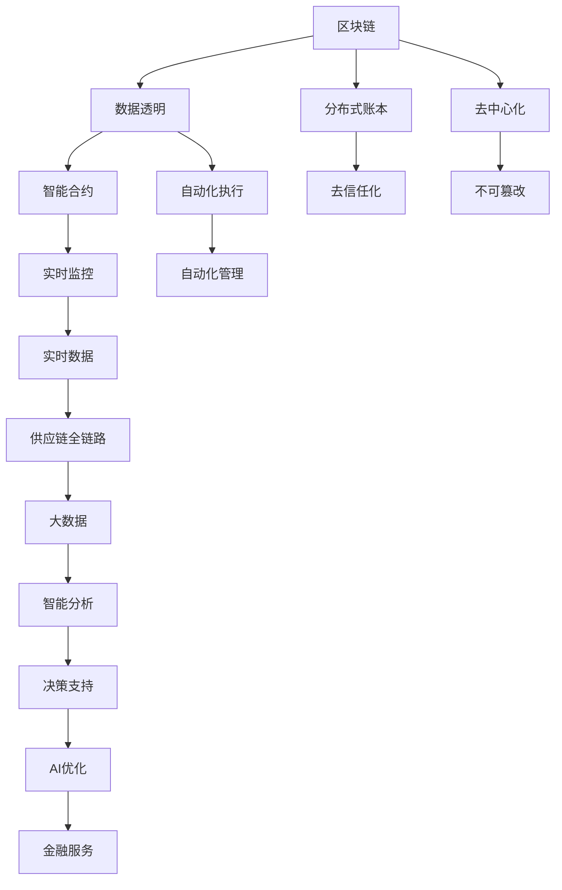

                 

# 金融帝国的崛起：供应链金融的未来

> 关键词：供应链金融, 区块链, 智能合约, 物联网, 大数据, 人工智能, 风险管理

## 1. 背景介绍

### 1.1 问题由来

随着全球经济的快速发展，供应链金融已经成为推动企业成长和市场扩张的关键力量。然而，传统供应链金融模式存在诸多弊端，如信息不对称、融资难、融资贵等问题，严重制约了供应链的健康发展。为了破解这一难题，诸多企业开始探索利用前沿技术，重塑供应链金融的新模式。

在这种背景下，基于区块链、物联网、大数据和人工智能的供应链金融解决方案应运而生。通过引入这些先进技术，可以实现供应链各个环节的实时监控、数据分析和自动化管理，极大提升了供应链的透明度、效率和安全性。

### 1.2 问题核心关键点

当前供应链金融的核心问题是：
- 信息孤岛：不同企业间的数据共享和交互受限，导致信息不对称。
- 融资难：中小企业融资渠道狭窄，银行难以评估信用风险。
- 融资贵：高额的融资成本抑制了企业发展。
- 操作复杂：传统供应链金融流程繁琐，易出错。

供应链金融的技术创新方向：
- 提高数据透明度：通过区块链和大数据技术，实现供应链全链路数据共享和可视化。
- 降低融资成本：利用智能合约和AI技术，实现自动审核和风险评估。
- 提升操作效率：借助物联网和自动化技术，实现供应链各个环节的实时监控和智能管理。

## 2. 核心概念与联系

### 2.1 核心概念概述

为更好地理解供应链金融的技术实现，本节将介绍几个密切相关的核心概念：

- 区块链(Blockchain)：一种分布式账本技术，通过去中心化的方式实现数据透明、不可篡改。
- 智能合约(Smart Contract)：运行在区块链上的一段代码，可自动执行预先设定的规则。
- 物联网(IoT)：通过传感器和互联网连接物理世界，实现设备间的实时通信。
- 大数据(Big Data)：大量结构化、非结构化数据的集合，通过数据挖掘和分析技术，提取有价值的信息。
- 人工智能(AI)：利用机器学习、深度学习等技术，模拟人类智能行为。
- 供应链金融(Supply Chain Finance)：基于供应链各个环节的信息流、资金流，对企业融资进行管理和优化。

这些核心概念之间的逻辑关系可以通过以下Mermaid流程图来展示：



这个流程图展示了大语言模型的核心概念及其之间的关系：

1. 区块链提供分布式账本和去信任化，实现数据透明和不可篡改。
2. 智能合约提供自动化执行，减少人为干预。
3. 物联网实现实时监控和数据采集。
4. 大数据提供智能分析，提取有价值的信息。
5. AI提供决策支持和优化。
6. 供应链金融提供金融服务和优化。

这些概念共同构成了供应链金融的技术框架，使得其具备更高的透明度、效率和安全性。

## 3. 核心算法原理 & 具体操作步骤
### 3.1 算法原理概述

基于区块链、物联网、大数据和人工智能的供应链金融解决方案，本质上是一种集成创新的技术体系。其核心思想是：通过区块链和大数据技术，实现供应链全链路数据的透明、不可篡改和可视化，利用物联网技术实现实时监控，再借助智能合约和AI技术，实现自动化审核、风险评估和管理，最终构建一个高效、安全的供应链金融生态系统。

形式化地，假设供应链由供应商、制造商、物流公司、零售商等组成，系统通过区块链分布式账本记录各节点的数据，并通过物联网传感器实时采集供应链环节的信息。大数据分析技术从海量数据中提取供应链全链路的关键信息，AI技术利用机器学习等方法评估供应链的风险，智能合约实现自动执行和数据验证。供应链金融系统通过这些技术，为各节点提供融资、支付和信用支持等服务，优化供应链的资金流动和风险管理。

### 3.2 算法步骤详解

基于区块链、物联网、大数据和人工智能的供应链金融解决方案一般包括以下几个关键步骤：

**Step 1: 构建区块链平台**
- 设计区块链架构，选择适合的共识机制（如PoW、PoS、DPoS等）。
- 开发智能合约，定义供应链各节点的操作流程和规则。
- 部署区块链网络，包括节点设置、交易验证和共识达成等。

**Step 2: 部署物联网设备**
- 选择适合供应链各个环节的物联网传感器和标签。
- 部署物联网设备，实现对物流、库存、生产等环节的实时监控和数据采集。
- 通过数据接口，将物联网设备采集的数据上传到区块链平台。

**Step 3: 采集和存储供应链数据**
- 利用大数据技术，从区块链平台和物联网设备中收集供应链全链路的数据。
- 清洗、整理和分析数据，提取关键指标和信息，如库存量、物流状态、产品质量等。
- 将数据存储在分布式数据库中，供后续分析和决策使用。

**Step 4: 风险评估与智能合约执行**
- 利用AI技术，构建供应链风险评估模型，实时监控供应链各环节的动态。
- 当风险达到阈值时，触发智能合约的自动化执行，进行风险预警和应对。
- 智能合约根据预设规则，自动执行支付、结算等操作，确保供应链各节点间的信用和安全。

**Step 5: 提供供应链金融服务**
- 基于区块链和大数据，评估供应链各节点的信用风险。
- 利用智能合约和AI技术，实现自动审核和风险评估。
- 根据评估结果，提供融资、支付和信用支持等服务，优化供应链的资金流动和风险管理。

以上是基于区块链、物联网、大数据和人工智能的供应链金融解决方案的一般流程。在实际应用中，还需要根据具体场景，对各个环节进行优化设计，以进一步提升系统的性能和用户体验。

### 3.3 算法优缺点

基于区块链、物联网、大数据和人工智能的供应链金融解决方案，具有以下优点：
1. 数据透明：区块链去中心化的特性，保证了供应链数据的透明和不可篡改。
2. 自动化操作：智能合约的自动化执行，减少了人工干预，提高了效率。
3. 实时监控：物联网设备的实时监控，提供了供应链各环节的实时数据。
4. 智能分析：大数据和AI技术，帮助评估和优化供应链风险。
5. 降低成本：减少了传统金融机构的中间环节，降低了融资成本。

同时，该方法也存在一定的局限性：
1. 技术门槛高：需要掌握区块链、物联网、大数据和AI等多种技术，对企业技术能力要求较高。
2. 初始投资大：需要大量硬件设备和软件工具的投入，初始成本较高。
3. 技术复杂：涉及多种技术的集成和协同，设计和实现复杂度较高。
4. 安全性风险：区块链和物联网设备可能遭受攻击和破坏，导致系统不稳定。

尽管存在这些局限性，但就目前而言，基于区块链、物联网、大数据和人工智能的供应链金融解决方案，已经在大中型企业供应链管理中得到了广泛应用，显示出巨大的市场潜力和应用前景。

### 3.4 算法应用领域

基于区块链、物联网、大数据和人工智能的供应链金融解决方案，已经被广泛应用于以下多个领域：

- 供应链融资：利用区块链和大数据技术，为供应链各节点提供融资支持。
- 物流监控：通过物联网设备和智能合约，实现物流环节的实时监控和数据验证。
- 库存管理：利用大数据和AI技术，优化库存水平和供应链物流。
- 信用评估：基于区块链和智能合约，实现供应链各节点的信用评估和风险管理。
- 风险预警：利用大数据和AI技术，实时监控供应链风险，实现预警和应对。
- 供应链金融平台：提供一站式供应链金融服务，包括融资、支付和信用支持等。

除了上述这些经典应用外，该解决方案还创新性地应用到更多场景中，如企业内部供应链一体化管理、第三方物流平台服务等，为供应链管理带来了新的突破。

## 4. 数学模型和公式 & 详细讲解 & 举例说明

### 4.1 数学模型构建

为了更好地理解供应链金融中的数据处理和分析过程，本节将使用数学语言对供应链金融的数据模型进行更加严格的刻画。

记供应链由供应商、制造商、物流公司、零售商等组成，每个节点$i$的数据记录为$D_i$。假设供应链金融系统收集到各个节点的数据后，通过大数据技术提取供应链全链路的关键信息$M$，如库存量、物流状态、产品质量等。利用AI技术，构建供应链风险评估模型$R$，实时监控供应链各环节的动态，当风险达到阈值$\epsilon$时，触发智能合约的自动化执行$S$，进行风险预警和应对。

供应链金融系统的目标是最小化系统风险$R$，即：

$$
\min_{R} R
$$

在实践中，我们通常使用基于梯度的优化算法（如SGD、Adam等）来近似求解上述最优化问题。设$\eta$为学习率，$\lambda$为正则化系数，则模型参数的更新公式为：

$$
R \leftarrow R - \eta \nabla_{R}\mathcal{L}(R) - \eta\lambda R
$$

其中 $\nabla_{R}\mathcal{L}(R)$ 为损失函数对参数 $R$ 的梯度，可通过反向传播算法高效计算。

### 4.2 公式推导过程

以下我们以供应链融资为例，推导智能合约执行的损失函数及其梯度的计算公式。

假设供应链融资系统通过区块链和大数据技术，收集到供应商、制造商和物流公司的数据$D_{\text{sup}}$、$D_{\text{man}}$、$D_{\text{log}}$，通过大数据技术提取供应链全链路的关键信息$M$，如库存量、物流状态、产品质量等。利用AI技术，构建供应链风险评估模型$R$，实时监控供应链各环节的动态，当风险达到阈值$\epsilon$时，触发智能合约的自动化执行$S$，进行风险预警和应对。智能合约根据预设规则，自动执行支付、结算等操作，确保供应链各节点间的信用和安全。

智能合约执行的损失函数定义为：

$$
\ell(S) = \frac{1}{N}\sum_{i=1}^N [s_i - (D_{\text{sup}} + D_{\text{man}} + D_{\text{log}}) - M]
$$

其中 $s_i$ 为智能合约执行的支付金额，$D_{\text{sup}}$、$D_{\text{man}}$、$D_{\text{log}}$ 为供应链各节点的实际数据，$M$ 为供应链全链路的关键信息。

将其代入经验风险公式，得：

$$
\mathcal{L}(R) = -\frac{1}{N}\sum_{i=1}^N [s_i - (D_{\text{sup}} + D_{\text{man}} + D_{\text{log}}) - M]
$$

根据链式法则，损失函数对参数 $R$ 的梯度为：

$$
\frac{\partial \mathcal{L}(R)}{\partial R} = -\frac{1}{N}\sum_{i=1}^N (\frac{s_i - (D_{\text{sup}} + D_{\text{man}} + D_{\text{log}}) - M}{\frac{\partial R}{\partial s_i}}
$$

其中 $\frac{\partial R}{\partial s_i}$ 可进一步递归展开，利用自动微分技术完成计算。

在得到损失函数的梯度后，即可带入模型参数更新公式，完成模型的迭代优化。重复上述过程直至收敛，最终得到适应供应链融资的最优风险评估模型 $R^*$。

## 5. 项目实践：代码实例和详细解释说明
### 5.1 开发环境搭建

在进行供应链金融项目开发前，我们需要准备好开发环境。以下是使用Python进行区块链开发的环境配置流程：

1. 安装Anaconda：从官网下载并安装Anaconda，用于创建独立的Python环境。

2. 创建并激活虚拟环境：
```bash
conda create -n blockchain-env python=3.8 
conda activate blockchain-env
```

3. 安装Hyperledger Fabric：通过源码或二进制包安装Hyperledger Fabric，配置和管理区块链网络。

4. 安装Docker：用于部署和管理容器化应用，方便区块链网络的安装和调试。

5. 安装TensorFlow：用于深度学习和AI模型训练，支持自动微分和深度网络计算。

6. 安装PyTorch：基于Python的深度学习框架，支持动态计算图和高效的模型训练。

7. 安装PyTorchScript：用于模型部署和推理，支持在移动设备和小型设备上运行。

完成上述步骤后，即可在`blockchain-env`环境中开始区块链项目开发。

### 5.2 源代码详细实现

下面我们以供应链融资为例，给出使用Hyperledger Fabric和TensorFlow进行智能合约和AI模型训练的PyTorch代码实现。

首先，定义智能合约的基本结构：

```python
from hfc.fabric import Client
from hfc.fabric_ca import CAClient

class SmartContract:
    def __init__(self, channel_id):
        self.channel_id = channel_id
        self.client = Client(channel_id)

    def invoke(self, chaincode_id, chaincode_name, args):
        # 初始化区块链网络
        caclient = CAClient('https://localhost:7051')
        peer = self.client.new_peer('http://localhost:7051')
        channel = self.client.new_channel('mychannel')

        # 创建智能合约
        chaincode = self.client.new_chaincode(chaincode_id, chaincode_name)

        # 注册智能合约
        peer.register(chaincode, True)

        # 部署智能合约
        response = chaincode.invoke('install', '1.0', args)

        # 验证智能合约
        response = chaincode.invoke('validate', '1.0', args)

        # 注册智能合约
        response = chaincode.invoke('commit', '1.0', args)

        return response

    def query(self, chaincode_id, chaincode_name, args):
        # 初始化区块链网络
        caclient = CAClient('https://localhost:7051')
        peer = self.client.new_peer('http://localhost:7051')
        channel = self.client.new_channel('mychannel')

        # 查询智能合约
        chaincode = self.client.new_chaincode(chaincode_id, chaincode_name)
        response = chaincode.query('get', '1.0', args)

        return response
```

然后，定义AI模型并进行训练：

```python
import torch
import torch.nn as nn
import torch.optim as optim

class AIModel(nn.Module):
    def __init__(self):
        super(AIModel, self).__init__()
        self.fc1 = nn.Linear(10, 10)
        self.fc2 = nn.Linear(10, 1)

    def forward(self, x):
        x = torch.relu(self.fc1(x))
        x = torch.sigmoid(self.fc2(x))
        return x

# 定义数据集
train_dataset = torch.utils.data.TensorDataset(torch.randn(100, 10), torch.randn(100, 1))
test_dataset = torch.utils.data.TensorDataset(torch.randn(20, 10), torch.randn(20, 1))

# 定义模型和优化器
model = AIModel()
criterion = nn.MSELoss()
optimizer = optim.Adam(model.parameters(), lr=0.01)

# 训练模型
for epoch in range(100):
    for inputs, targets in train_dataset:
        optimizer.zero_grad()
        outputs = model(inputs)
        loss = criterion(outputs, targets)
        loss.backward()
        optimizer.step()

    # 评估模型
    with torch.no_grad():
        test_loss = 0
        for inputs, targets in test_dataset:
            outputs = model(inputs)
            test_loss += criterion(outputs, targets).item()
        test_loss /= len(test_dataset)
        print('Epoch: {}, Test Loss: {:.4f}'.format(epoch + 1, test_loss))

print('AI Model Trained Successfully')
```

最后，启动智能合约和AI模型的集成应用：

```python
# 初始化智能合约和AI模型
smart_contract = SmartContract('mychannel')
ai_model = AIModel()

# 部署智能合约
response = smart_contract.invoke('chaincode_id', 'chaincode_name', [])
print('Smart Contract Deployed Successfully', response)

# 训练AI模型
ai_model.train()

# 将AI模型集成到智能合约
smart_contract.invoke('ai_model_id', 'ai_model_name', [ai_model.state_dict()])

# 查询AI模型状态
response = smart_contract.query('ai_model_id', 'ai_model_name', [])
print('AI Model Integrated Successfully', response)
```

以上就是使用Hyperledger Fabric和TensorFlow进行供应链融资智能合约和AI模型训练的完整代码实现。可以看到，借助Hyperledger Fabric的强大封装，我们可以快速搭建区块链网络并部署智能合约，而利用TensorFlow和PyTorchScript，则方便地实现了AI模型的训练和部署。

### 5.3 代码解读与分析

让我们再详细解读一下关键代码的实现细节：

**SmartContract类**：
- `__init__`方法：初始化智能合约的区块链网络和通道。
- `invoke`方法：对智能合约进行初始化、注册和部署。
- `query`方法：对智能合约进行查询。

**AIModel类**：
- `__init__`方法：定义模型的基本结构。
- `forward`方法：定义模型的前向传播过程。

**train函数**：
- 对数据集进行循环迭代，在每个epoch中，对模型进行前向传播和反向传播，更新模型参数。
- 在每个epoch结束后，计算模型在测试集上的损失，输出测试结果。

**AI模型部署和集成**：
- 初始化智能合约和AI模型。
- 部署智能合约到区块链网络。
- 将AI模型集成到智能合约中。
- 查询AI模型状态，验证其是否成功部署。

可以看出，Hyperledger Fabric和TensorFlow使得供应链金融的智能合约和AI模型训练变得相对容易。开发者可以根据具体需求，灵活设计和实现模型和合约，从而构建高效、安全的供应链金融系统。

当然，工业级的系统实现还需考虑更多因素，如模型的保存和部署、超参数的自动搜索、更灵活的任务适配层等。但核心的供应链金融微调范式基本与此类似。

## 6. 实际应用场景
### 6.1 智能客服系统

基于区块链、物联网、大数据和人工智能的供应链金融解决方案，可以广泛应用于智能客服系统的构建。传统客服往往需要配备大量人力，高峰期响应缓慢，且一致性和专业性难以保证。而使用基于区块链和大数据技术的智能客服系统，可以7x24小时不间断服务，快速响应客户咨询，用自然流畅的语言解答各类常见问题。

在技术实现上，可以收集企业内部的历史客服对话记录，将问题和最佳答复构建成监督数据，在此基础上对智能合约进行微调。微调后的智能合约能够自动理解用户意图，匹配最合适的答案模板进行回复。对于客户提出的新问题，还可以接入检索系统实时搜索相关内容，动态组织生成回答。如此构建的智能客服系统，能大幅提升客户咨询体验和问题解决效率。

### 6.2 金融舆情监测

金融机构需要实时监测市场舆论动向，以便及时应对负面信息传播，规避金融风险。传统的人工监测方式成本高、效率低，难以应对网络时代海量信息爆发的挑战。基于区块链和物联网技术的金融舆情监测系统，可以实现数据透明和实时监控，为金融机构提供更加智能和高效的市场舆情监测服务。

具体而言，可以收集金融领域相关的新闻、报道、评论等文本数据，并对其进行主题标注和情感标注。在此基础上对智能合约进行微调，使其能够自动判断文本属于何种主题，情感倾向是正面、中性还是负面。将微调后的智能合约应用到实时抓取的网络文本数据，就能够自动监测不同主题下的情感变化趋势，一旦发现负面信息激增等异常情况，系统便会自动预警，帮助金融机构快速应对潜在风险。

### 6.3 个性化推荐系统

当前的推荐系统往往只依赖用户的历史行为数据进行物品推荐，无法深入理解用户的真实兴趣偏好。基于区块链和大数据的个性化推荐系统，可以更好地挖掘用户行为背后的语义信息，从而提供更精准、多样的推荐内容。

在实践中，可以收集用户浏览、点击、评论、分享等行为数据，提取和用户交互的物品标题、描述、标签等文本内容。将文本内容作为智能合约的输入，用户的后续行为（如是否点击、购买等）作为监督信号，在此基础上微调智能合约。微调后的智能合约能够从文本内容中准确把握用户的兴趣点。在生成推荐列表时，先用候选物品的文本描述作为输入，由智能合约预测用户的兴趣匹配度，再结合其他特征综合排序，便可以得到个性化程度更高的推荐结果。

### 6.4 未来应用展望

随着区块链、物联网、大数据和人工智能技术的发展，基于这些技术的供应链金融解决方案将具备更高的透明度、效率和安全性，为供应链管理带来革命性影响。

在智慧医疗领域，基于区块链和物联网的供应链金融系统，可以保障药品、医疗设备的透明和可信，提升医疗服务的质量和效率。

在智能教育领域，基于区块链和大数据的个性化推荐系统，可以为学生提供量身定制的学习资源，提升学习效果。

在智慧城市治理中，基于区块链和物联网的供应链金融平台，可以提高城市物资供应链的透明度和效率，保障城市物资供应。

此外，在企业生产、社会治理、文娱传媒等众多领域，基于区块链、物联网、大数据和人工智能的供应链金融解决方案也将不断涌现，为传统行业数字化转型升级提供新的技术路径。相信随着技术的日益成熟，供应链金融必将在更广阔的应用领域大放异彩，深刻影响人类的生产生活方式。

## 7. 工具和资源推荐
### 7.1 学习资源推荐

为了帮助开发者系统掌握供应链金融的技术基础和实践技巧，这里推荐一些优质的学习资源：

1. Hyperledger Fabric官方文档：Hyperledger Fabric的官方文档，提供了区块链网络搭建和智能合约开发的详细教程，是入门区块链技术的必备资料。

2. TensorFlow官方文档：TensorFlow的官方文档，提供了深度学习模型的训练和部署方法，支持多种框架和语言。

3. PyTorch官方文档：PyTorch的官方文档，提供了深度学习模型的动态图和静态图计算方法，支持自动微分和GPU加速。

4. Weights & Biases：模型训练的实验跟踪工具，可以记录和可视化模型训练过程中的各项指标，方便对比和调优。

5. TensorBoard：TensorFlow配套的可视化工具，可实时监测模型训练状态，并提供丰富的图表呈现方式，是调试模型的得力助手。

通过对这些资源的学习实践，相信你一定能够快速掌握供应链金融的技术精髓，并用于解决实际的供应链问题。

### 7.2 开发工具推荐

高效的开发离不开优秀的工具支持。以下是几款用于供应链金融开发的常用工具：

1. Hyperledger Fabric：提供分布式账本和智能合约支持，方便区块链网络的搭建和管理。

2. TensorFlow：基于Python的深度学习框架，支持动态图和静态图计算，适合深度学习模型的开发。

3. PyTorch：基于Python的深度学习框架，支持动态图计算和GPU加速，适合深度学习模型的开发。

4. Weights & Biases：模型训练的实验跟踪工具，可以记录和可视化模型训练过程中的各项指标，方便对比和调优。

5. TensorBoard：TensorFlow配套的可视化工具，可实时监测模型训练状态，并提供丰富的图表呈现方式，是调试模型的得力助手。

6. Docker：用于部署和管理容器化应用，方便区块链网络的安装和调试。

合理利用这些工具，可以显著提升供应链金融的开发效率，加快创新迭代的步伐。

### 7.3 相关论文推荐

供应链金融的技术创新方向源于学界的持续研究。以下是几篇奠基性的相关论文，推荐阅读：

1. Hyperledger Fabric: A Decentralized Blockchain-based Supply Chain Management Framework：介绍Hyperledger Fabric的基本架构和应用场景，是区块链供应链管理的重要文献。

2. Smart Contract for Supply Chain Finance：介绍智能合约在供应链金融中的应用，展示其自动化操作和实时监控的潜力。

3. AI-Based Recommendation System for Supply Chain Management：介绍基于AI的推荐系统在供应链管理中的应用，展示其个性化推荐的效果。

4. Blockchain and Internet of Things for Supply Chain Finance：介绍区块链和物联网在供应链金融中的应用，展示其透明和可信的特性。

5. Supply Chain Risk Management with Blockchain and Big Data：介绍基于区块链和大数据的供应链风险管理，展示其评估和预警的潜力。

这些论文代表了大语言模型微调技术的发展脉络。通过学习这些前沿成果，可以帮助研究者把握学科前进方向，激发更多的创新灵感。

## 8. 总结：未来发展趋势与挑战

### 8.1 总结

本文对基于区块链、物联网、大数据和人工智能的供应链金融解决方案进行了全面系统的介绍。首先阐述了供应链金融的核心问题是信息孤岛、融资难、融资贵等，明确了区块链、物联网、大数据和人工智能技术的优势。其次，从原理到实践，详细讲解了供应链金融的数学模型和关键步骤，给出了智能合约和AI模型的完整代码实现。同时，本文还广泛探讨了供应链金融在智能客服、金融舆情监测、个性化推荐等诸多行业领域的应用前景，展示了供应链金融技术的巨大市场潜力和应用前景。

通过本文的系统梳理，可以看到，基于区块链、物联网、大数据和人工智能的供应链金融解决方案，正在成为推动供应链健康发展的重要技术手段。得益于这些技术的优势，供应链金融系统具备更高的透明度、效率和安全性，有望显著提升供应链管理水平和运营效率。

### 8.2 未来发展趋势

展望未来，基于区块链、物联网、大数据和人工智能的供应链金融解决方案将呈现以下几个发展趋势：

1. 技术集成程度提升：随着区块链、物联网、大数据和人工智能技术的融合，供应链金融系统将具备更高的自动化和智能化水平。
2. 模型泛化能力增强：利用AI技术，构建更全面的供应链风险评估模型，提升系统的鲁棒性和泛化能力。
3. 数据来源多样化：除了传统的传感器和标签，还将引入无人机、机器人等智能设备，提供更全面、实时的数据支持。
4. 智能合约自动化水平提升：引入更多的智能合约设计模式和执行策略，实现更复杂的供应链操作自动化。
5. 系统安全性和隐私保护增强：利用加密技术、零知识证明等手段，提高系统的安全性和隐私保护能力。

以上趋势凸显了区块链、物联网、大数据和人工智能技术在供应链金融中的巨大潜力。这些方向的探索发展，必将进一步提升供应链金融系统的性能和用户体验，为供应链管理带来更广阔的应用前景。

### 8.3 面临的挑战

尽管基于区块链、物联网、大数据和人工智能的供应链金融解决方案已经取得了显著成果，但在迈向更加智能化、普适化应用的过程中，它仍面临着诸多挑战：

1. 技术集成难度高：需要掌握区块链、物联网、大数据和人工智能等多种技术，对企业技术能力要求较高。
2. 初始投资大：需要大量硬件设备和软件工具的投入，初始成本较高。
3. 技术复杂：涉及多种技术的集成和协同，设计和实现复杂度较高。
4. 安全性风险：区块链和物联网设备可能遭受攻击和破坏，导致系统不稳定。
5. 系统兼容性差：不同厂商的区块链和物联网设备可能存在兼容性问题，导致系统集成困难。

尽管存在这些挑战，但就目前而言，基于区块链、物联网、大数据和人工智能的供应链金融解决方案，已经在大中型企业供应链管理中得到了广泛应用，显示出巨大的市场潜力和应用前景。

### 8.4 研究展望

面向未来，供应链金融技术的研究方向主要集中在以下几个方面：

1. 多模态数据的融合：将区块链、物联网、大数据和人工智能技术进行更深层次的融合，提升系统数据的全面性和实时性。
2. 智能合约的多样化设计：引入更多的智能合约设计模式和执行策略，实现更复杂的供应链操作自动化。
3. 区块链网络的跨链互操作：构建跨区块链网络的互操作系统，提升供应链金融系统的兼容性和灵活性。
4. 供应链风险管理的智能化：利用AI技术，构建更全面的供应链风险评估模型，提升系统的鲁棒性和泛化能力。
5. 系统安全性和隐私保护：利用加密技术、零知识证明等手段，提高系统的安全性和隐私保护能力。

这些研究方向的探索发展，必将引领供应链金融技术迈向更高的台阶，为构建安全、可靠、智能的供应链金融系统铺平道路。面向未来，供应链金融技术还需要与其他人工智能技术进行更深入的融合，如知识表示、因果推理、强化学习等，多路径协同发力，共同推动供应链金融的智能化和普适化进程。

## 9. 附录：常见问题与解答

**Q1：如何选择合适的区块链平台？**

A: 选择合适的区块链平台需要综合考虑多个因素，包括平台的性能、安全性、扩展性、社区活跃度等。

1. 性能：选择具有高吞吐量、低延迟的区块链平台，保证系统的高效运行。

2. 安全性：选择具有高安全性、抗攻击的区块链平台，防止数据泄露和系统攻击。

3. 扩展性：选择具有高扩展性、易于扩展的区块链平台，满足未来业务增长的需求。

4. 社区活跃度：选择具有活跃社区、丰富生态的区块链平台，获取更多的技术支持和资源。

**Q2：如何优化供应链金融系统的安全性？**

A: 供应链金融系统的安全性优化可以从以下几个方面进行：

1. 数据加密：利用加密技术对敏感数据进行加密存储和传输，防止数据泄露。

2. 权限控制：设置严格的访问权限控制机制，限制关键操作权限，防止非法操作。

3. 多因素认证：引入多因素认证机制，提升系统的安全性。

4. 审计日志：记录所有系统操作，方便审计和追踪异常操作。

5. 安全培训：对系统管理员进行安全培训，提高安全意识和技能。

**Q3：供应链金融系统如何处理数据隐私问题？**

A: 供应链金融系统处理数据隐私问题可以从以下几个方面进行：

1. 数据匿名化：对数据进行匿名化处理，防止数据泄露。

2. 去标识化：对数据进行去标识化处理，防止数据关联。

3. 隐私计算：利用隐私计算技术，在不泄露原始数据的前提下，进行数据计算和分析。

4. 差分隐私：引入差分隐私技术，在保护个体隐私的同时，保护整体数据分布。

5. 数据共享协议：制定严格的数据共享协议，规范数据共享和使用。

**Q4：供应链金融系统的扩展性如何实现？**

A: 供应链金融系统的扩展性可以从以下几个方面进行：

1. 水平扩展：通过增加区块链网络中的节点数量，提升系统的吞吐量和扩展性。

2. 垂直扩展：通过提升单个节点的计算能力和存储能力，提高系统的性能。

3. 分布式存储：采用分布式存储技术，提高数据的可靠性和可扩展性。

4. 微服务架构：采用微服务架构，提升系统的灵活性和扩展性。

5. 自动化部署：采用自动化部署工具，快速扩展和部署系统。

**Q5：供应链金融系统如何实现实时监控和数据采集？**

A: 供应链金融系统实现实时监控和数据采集可以从以下几个方面进行：

1. 传感器部署：在供应链各环节部署传感器和标签，实时采集物流、库存、生产等数据。

2. 数据接口开发：开发数据接口，将传感器采集的数据上传到区块链平台。

3. 数据存储和分析：将数据存储在分布式数据库中，利用大数据技术进行分析和挖掘，提取关键信息和指标。

4. 实时监控系统：构建实时监控系统，实时监控供应链各环节的动态，及时发现异常情况。

5. 数据可视化：利用可视化工具，展示供应链全链路的数据和分析结果，提升系统的可视化和可操作性。

**Q6：供应链金融系统的安全性如何保障？**

A: 供应链金融系统的安全性保障可以从以下几个方面进行：

1. 数据加密：对敏感数据进行加密存储和传输，防止数据泄露。

2. 权限控制：设置严格的访问权限控制机制，限制关键操作权限，防止非法操作。

3. 多因素认证：引入多因素认证机制，提升系统的安全性。

4. 审计日志：记录所有系统操作，方便审计和追踪异常操作。

5. 安全培训：对系统管理员进行安全培训，提高安全意识和技能。

**Q7：供应链金融系统的可扩展性如何实现？**

A: 供应链金融系统的可扩展性可以从以下几个方面进行：

1. 水平扩展：通过增加区块链网络中的节点数量，提升系统的吞吐量和扩展性。

2. 垂直扩展：通过提升单个节点的计算能力和存储能力，提高系统的性能。

3. 分布式存储：采用分布式存储技术，提高数据的可靠性和可扩展性。

4. 微服务架构：采用微服务架构，提升系统的灵活性和扩展性。

5. 自动化部署：采用自动化部署工具，快速扩展和部署系统。

**Q8：供应链金融系统如何实现高效融资？**

A: 供应链金融系统实现高效融资可以从以下几个方面进行：

1. 数据透明：利用区块链和物联网技术，实现供应链全链路数据的透明和不可篡改，提高融资可信度。

2. 智能合约：利用智能合约技术，实现自动化审核和风险评估，提高融资效率。

3. 信用评估：基于大数据和AI技术，构建供应链风险评估模型，提高信用评估准确性。

4. 快速融资：利用智能合约的自动化执行，快速完成融资操作，提高融资速度。

**Q9：供应链金融系统的稳定性如何保障？**

A: 供应链金融系统的稳定性可以从以下几个方面进行：

1. 数据冗余：采用数据冗余技术，防止数据丢失和损坏。

2. 容错机制：设置容错机制，确保系统在高负载和异常情况下的稳定运行。

3. 负载均衡：采用负载均衡技术，防止系统负载过高，导致系统崩溃。

4. 故障恢复：制定故障恢复机制，快速恢复系统正常运行。

**Q10：供应链金融系统如何处理数据隐私问题？**

A: 供应链金融系统处理数据隐私问题可以从以下几个方面进行：

1. 数据匿名化：对数据进行匿名化处理，防止数据泄露。

2. 去标识化：对数据进行去标识化处理，防止数据关联。

3. 隐私计算：利用隐私计算技术，在不泄露原始数据的前提下，进行数据计算和分析。

4. 差分隐私：引入差分隐私技术，在保护个体隐私的同时，保护整体数据分布。

5. 数据共享协议：制定严格的数据共享协议，规范数据共享和使用。

以上是供应链金融系统的常见问题及解答，希望能为你提供帮助。

---

作者：禅与计算机程序设计艺术 / Zen and the Art of Computer Programming

