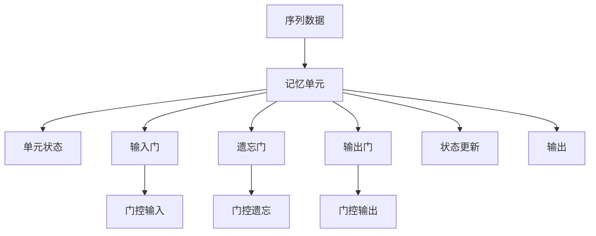

                 

# 长短时记忆网络 (LSTM) 原理与代码实例讲解

## 1. 背景介绍

### 1.1 问题由来
长短时记忆网络（LSTM，Long Short-Term Memory）是一种用于处理序列数据的深度学习模型。传统的神经网络模型在处理序列数据时存在梯度消失或爆炸问题，难以捕捉序列数据中的长期依赖关系。LSTM 通过设计特殊的神经元结构，有效解决了这些问题，并广泛用于语音识别、机器翻译、文本生成等序列建模任务。

### 1.2 问题核心关键点
LSTM 的核心在于其门控机制，通过三个门（输入门、遗忘门、输出门）来控制信息的流动，从而实现序列数据的长期依赖关系建模。LSTM 不仅能够处理定长的输入序列，还能通过上下文信息进行动态编码，适用于许多序列预测问题。

## 2. 核心概念与联系

### 2.1 核心概念概述
为了更好地理解 LSTM，本节将介绍几个关键概念：

- **长短时记忆网络（LSTM）**：一种能够处理序列数据的深度神经网络，通过门控机制有效解决梯度消失和爆炸问题。

- **门控机制**：LSTM 通过输入门、遗忘门、输出门控制信息的流动，允许网络在处理序列时选择性地“记住”和“遗忘”信息。

- **单元状态（Cell State）**：LSTM 的核心组件，用于存储序列数据的信息，通过门控机制不断更新。

- **记忆单元（Memory Cell）**：包含单元状态和门控机制的组件，是 LSTM 模型最基本、最重要的单元。

- **RNN**：递归神经网络，LSTM 是 RNN 的一种改进形式，可以处理任意长度的输入序列。

这些核心概念之间的逻辑关系可以通过以下 Mermaid 流程图来展示：



这个流程图展示了一些基本的 LSTM 组件及其相互关系：

1. **序列数据**：输入序列，通过记忆单元进行处理。
2. **记忆单元**：包含单元状态和三个门，用于处理序列数据。
3. **单元状态**：存储序列数据的信息，通过门控机制不断更新。
4. **输入门**：控制新输入对单元状态的影响。
5. **遗忘门**：控制旧信息的遗忘程度。
6. **输出门**：控制单元状态的信息输出。
7. **状态更新**：根据门控机制更新单元状态。
8. **输出**：最终的输出结果。

## 3. 核心算法原理 & 具体操作步骤
### 3.1 算法原理概述

LSTM 的核心在于门控机制，通过输入门、遗忘门、输出门来控制信息的流动。这些门的作用如下：

- **输入门**：决定哪些新的信息应该被“记住”，哪些应该被“遗忘”。
- **遗忘门**：决定哪些旧信息应该被“遗忘”，哪些应该被“记住”。
- **输出门**：决定哪些信息应该被“输出”，哪些应该被“隐藏”。

LSTM 模型包含多个记忆单元，每个记忆单元都有一组输入门、遗忘门和输出门。通过这些门的控制，LSTM 能够有效地捕捉序列数据中的长期依赖关系，从而在序列建模任务中表现出色。

### 3.2 算法步骤详解

LSTM 的训练过程可以分为以下几步：

**Step 1: 初始化参数**
- 初始化权重矩阵 $W_{xc}$、$W_{xf}$、$W_{xh}$、$W_{fo}$、$W_{fc}$、$W_{co}$、$W_{hh}$、$W_{ho}$。
- 初始化偏置向量 $b_x$、$b_f$、$b_h$、$b_o$、$b_c$。

**Step 2: 前向传播**
- 输入序列 $x_t$ 通过输入门计算得到新输入 $i_t$。
- 新输入 $i_t$ 与前一时刻的单元状态 $h_{t-1}$ 通过遗忘门计算得到遗忘信息 $f_t$。
- 遗忘信息 $f_t$ 与前一时刻的单元状态 $h_{t-1}$ 结合，通过门控单元 $c_t$ 计算得到新单元状态 $c_t$。
- 新单元状态 $c_t$ 与前一时刻的隐状态 $h_{t-1}$ 通过输出门计算得到新的隐状态 $h_t$。
- 最终输出 $h_t$ 和单元状态 $c_t$ 用于下一时刻的计算。

**Step 3: 反向传播**
- 计算损失函数 $J$ 对每个参数的梯度。
- 使用梯度下降算法更新模型参数。

**Step 4: 参数更新**
- 根据当前时刻的梯度，更新模型参数，得到新的权重矩阵和偏置向量。

重复上述步骤，直到模型收敛或达到预设的迭代次数。

### 3.3 算法优缺点

LSTM 的优势在于其门控机制能够有效解决传统 RNN 模型中的梯度消失和爆炸问题，能够捕捉序列数据中的长期依赖关系。然而，LSTM 也存在一些缺点：

- **参数量较大**：LSTM 包含多个门控机制和多个参数矩阵，导致模型复杂度较高，计算资源需求较大。
- **训练时间长**：由于参数量大，LSTM 的训练时间较长，特别是在大规模数据集上。
- **难以解释**：LSTM 的内部机制较为复杂，难以进行直观解释和调试。

尽管存在这些缺点，LSTM 仍是一种广泛应用于序列数据处理的深度学习模型，特别适用于需要捕捉长期依赖关系的任务。

### 3.4 算法应用领域

LSTM 广泛应用于以下领域：

- **语音识别**：将语音信号转换为文本，捕捉声音中的长期依赖关系。
- **机器翻译**：将一种语言的句子翻译为另一种语言的句子，捕捉句子中的上下文关系。
- **文本生成**：生成符合语法和语义规则的文本，捕捉文本中的上下文关系。
- **时间序列预测**：预测未来的时间序列数据，捕捉时间序列中的长期依赖关系。

## 4. 数学模型和公式 & 详细讲解 & 举例说明
### 4.1 数学模型构建

LSTM 模型的数学模型可以表示为：

$$
\begin{aligned}
i_t &= \sigma(W_{xh}x_t + W_{hh}h_{t-1} + b_h) \\
f_t &= \sigma(W_{xh}x_t + W_{hh}h_{t-1} + b_h) \\
o_t &= \sigma(W_{xh}x_t + W_{hh}h_{t-1} + b_h) \\
g_t &= \tanh(W_{xc}x_t + W_{hc}h_{t-1} + b_c) \\
c_t &= c_{t-1} \times f_t + g_t \times i_t \\
h_t &= o_t \times \tanh(c_t)
\end{aligned}
$$

其中，$\sigma$ 表示 sigmoid 函数，$\tanh$ 表示 tanh 函数，$x_t$ 表示输入序列，$h_{t-1}$ 表示前一时刻的隐状态，$c_t$ 表示单元状态。

### 4.2 公式推导过程

LSTM 的公式推导过程可以分为以下几个步骤：

**Step 1: 计算输入门 $i_t$**
$$
i_t = \sigma(W_{xh}x_t + W_{hh}h_{t-1} + b_h)
$$

**Step 2: 计算遗忘门 $f_t$**
$$
f_t = \sigma(W_{xh}x_t + W_{hh}h_{t-1} + b_h)
$$

**Step 3: 计算输出门 $o_t$**
$$
o_t = \sigma(W_{xh}x_t + W_{hh}h_{t-1} + b_h)
$$

**Step 4: 计算单元状态 $c_t$**
$$
g_t = \tanh(W_{xc}x_t + W_{hc}h_{t-1} + b_c)
$$
$$
c_t = c_{t-1} \times f_t + g_t \times i_t
$$

**Step 5: 计算隐状态 $h_t$**
$$
h_t = o_t \times \tanh(c_t)
$$

### 4.3 案例分析与讲解

假设我们有一个 LSTM 模型，包含一个输入门、一个遗忘门和一个输出门，用于预测天气的序列数据。模型的输入序列为 $x_t=[x_{t-1}, x_{t-2}, x_{t-3}]$，前一时刻的隐状态为 $h_{t-1}$，当前的预测结果为 $h_t$。

- 输入门 $i_t$ 决定新输入 $x_t$ 对单元状态 $c_t$ 的影响程度。
- 遗忘门 $f_t$ 决定旧信息 $c_{t-1}$ 的遗忘程度。
- 输出门 $o_t$ 决定当前单元状态 $c_t$ 的输出程度。

通过这三个门的控制，LSTM 可以灵活地处理序列数据中的信息流动，捕捉长期依赖关系。

## 5. 项目实践：代码实例和详细解释说明
### 5.1 开发环境搭建

在进行 LSTM 项目实践前，我们需要准备好开发环境。以下是使用 Python 进行 PyTorch 开发的环境配置流程：

1. 安装 Anaconda：从官网下载并安装 Anaconda，用于创建独立的 Python 环境。

2. 创建并激活虚拟环境：
```bash
conda create -n pytorch-env python=3.8 
conda activate pytorch-env
```

3. 安装 PyTorch：根据 CUDA 版本，从官网获取对应的安装命令。例如：
```bash
conda install pytorch torchvision torchaudio cudatoolkit=11.1 -c pytorch -c conda-forge
```

4. 安装 Transformers 库：
```bash
pip install transformers
```

5. 安装各类工具包：
```bash
pip install numpy pandas scikit-learn matplotlib tqdm jupyter notebook ipython
```

完成上述步骤后，即可在 `pytorch-env` 环境中开始 LSTM 的实践。

### 5.2 源代码详细实现

下面我们以天气预测任务为例，给出使用 Transformers 库对 LSTM 模型进行训练的 PyTorch 代码实现。

首先，定义模型类：

```python
import torch
import torch.nn as nn
import torch.optim as optim
from torch.nn import functional as F

class LSTM(nn.Module):
    def __init__(self, input_size, hidden_size, output_size):
        super(LSTM, self).__init__()
        self.hidden_size = hidden_size
        self.rnn = nn.LSTM(input_size, hidden_size, 1, batch_first=True)
        self.fc = nn.Linear(hidden_size, output_size)
        
    def forward(self, input, hidden):
        out, hidden = self.rnn(input, hidden)
        out = self.fc(out[:, -1, :])
        return out, hidden
    
    def init_hidden(self, batch_size):
        return (torch.zeros(1, batch_size, self.hidden_size), torch.zeros(1, batch_size, self.hidden_size))
```

然后，定义训练函数：

```python
def train(model, train_loader, optimizer, criterion, device):
    model.train()
    total_loss = 0
    for batch_idx, (data, target) in enumerate(train_loader):
        data, target = data.to(device), target.to(device)
        hidden = model.init_hidden(data.size(0))
        optimizer.zero_grad()
        output, _ = model(data, hidden)
        loss = criterion(output, target)
        loss.backward()
        optimizer.step()
        total_loss += loss.item()
    return total_loss / len(train_loader)
```

接着，定义评估函数：

```python
def evaluate(model, test_loader, criterion, device):
    model.eval()
    total_loss = 0
    with torch.no_grad():
        for batch_idx, (data, target) in enumerate(test_loader):
            data, target = data.to(device), target.to(device)
            hidden = model.init_hidden(data.size(0))
            output, _ = model(data, hidden)
            loss = criterion(output, target)
            total_loss += loss.item()
    return total_loss / len(test_loader)
```

最后，启动训练流程：

```python
input_size = 1
hidden_size = 128
output_size = 1
learning_rate = 0.001
num_epochs = 10
batch_size = 64
device = torch.device('cuda' if torch.cuda.is_available() else 'cpu')

model = LSTM(input_size, hidden_size, output_size).to(device)
optimizer = optim.Adam(model.parameters(), lr=learning_rate)
criterion = nn.MSELoss()

train_loader = torch.utils.data.DataLoader(train_dataset, batch_size=batch_size, shuffle=True)
test_loader = torch.utils.data.DataLoader(test_dataset, batch_size=batch_size, shuffle=False)

for epoch in range(num_epochs):
    train_loss = train(model, train_loader, optimizer, criterion, device)
    test_loss = evaluate(model, test_loader, criterion, device)
    print(f'Epoch {epoch+1}, train loss: {train_loss:.4f}, test loss: {test_loss:.4f}')
```

以上就是使用 PyTorch 对 LSTM 进行天气预测任务训练的完整代码实现。可以看到，利用 Transformers 库的封装，我们可以快速实现 LSTM 模型的定义和训练。

### 5.3 代码解读与分析

让我们再详细解读一下关键代码的实现细节：

**LSTM 模型类**：
- `__init__`方法：初始化模型参数，包括输入大小、隐藏大小、输出大小等。
- `forward`方法：定义模型的前向传播过程，计算输出和隐状态。
- `init_hidden`方法：初始化隐状态。

**训练函数**：
- `train`方法：在训练集上进行模型训练，计算损失并更新参数。
- `hidden`方法：初始化隐状态。

**评估函数**：
- `evaluate`方法：在测试集上进行模型评估，计算损失。

**训练流程**：
- 定义模型的输入大小、隐藏大小、输出大小等超参数。
- 创建模型、优化器和损失函数。
- 定义训练集和测试集的数据加载器。
- 循环训练多个 epoch，每次迭代计算训练集和测试集的损失。

可以看到，PyTorch 提供了丰富的工具和库，使得 LSTM 模型的实现变得简单高效。开发者可以将更多精力放在模型设计和数据处理上，而不必过多关注底层的实现细节。

## 6. 实际应用场景
### 6.1 天气预测

LSTM 模型可以应用于天气预测任务。通过收集历史天气数据，将一天内的温度、湿度、风速等作为输入，使用 LSTM 模型预测下一小时的天气状况。LSTM 能够捕捉天气序列数据中的长期依赖关系，从而提高预测精度。

### 6.2 股票价格预测

股票价格预测是 LSTM 的典型应用之一。通过收集历史股票价格数据，将股票价格序列作为输入，使用 LSTM 模型预测未来的股票价格走势。LSTM 能够捕捉价格序列中的长期依赖关系，从而提高预测准确性。

### 6.3 语音识别

语音识别任务可以使用 LSTM 模型。通过将音频信号转换为声谱图序列，将声谱图序列作为输入，使用 LSTM 模型进行语音识别。LSTM 能够捕捉语音信号中的长期依赖关系，从而提高识别精度。

### 6.4 未来应用展望

随着 LSTM 模型的不断发展和优化，其在更多领域的应用前景将更加广阔。未来，LSTM 将有望在以下几个方向取得新的突破：

1. **多模态数据融合**：将 LSTM 与图像、音频等模态的数据处理技术进行融合，构建更加全面、准确的信息模型。
2. **自适应学习**：引入自适应学习算法，根据环境变化动态调整模型参数，提升模型的适应性和鲁棒性。
3. **联邦学习**：将 LSTM 应用于联邦学习框架中，在多设备、多用户的数据协同学习中提升模型的泛化能力。
4. **强化学习**：结合强化学习算法，构建智能机器人、自动驾驶等场景中的决策模型，提升决策的智能性和实时性。

## 7. 工具和资源推荐
### 7.1 学习资源推荐

为了帮助开发者系统掌握 LSTM 的原理和实践技巧，这里推荐一些优质的学习资源：

1. **《深度学习》**：Ian Goodfellow 等著，全面介绍深度学习模型的原理和应用。
2. **《Python 深度学习》**：Francois Chollet 等著，详细讲解使用 PyTorch 进行深度学习模型的实现。
3. **《TensorFlow 实战》**：Li-Yi Wei 等著，介绍 TensorFlow 深度学习模型的实现和应用。
4. **Coursera 深度学习课程**：由 Andrew Ng 等教授主讲，系统讲解深度学习模型的原理和应用。
5. **Kaggle 竞赛**：参与 Kaggle 竞赛，实战训练 LSTM 模型，提升模型开发能力。

通过对这些资源的学习实践，相信你一定能够快速掌握 LSTM 的精髓，并用于解决实际的深度学习问题。

### 7.2 开发工具推荐

高效的开发离不开优秀的工具支持。以下是几款用于 LSTM 模型开发的常用工具：

1. **PyTorch**：基于 Python 的开源深度学习框架，灵活动态的计算图，适合快速迭代研究。
2. **TensorFlow**：由 Google 主导开发的开源深度学习框架，生产部署方便，适合大规模工程应用。
3. **Keras**：基于 TensorFlow 和 Theano 的高级深度学习 API，简单易用，适合初学者快速入门。
4. **JAX**：谷歌开发的基于 NumPy 的自动微分库，支持高性能的 JIT 编译和分布式训练。
5. **HuggingFace Transformers**：开源的深度学习模型库，包含多种预训练模型和代码示例，方便快速开发。

合理利用这些工具，可以显著提升 LSTM 模型的开发效率，加快创新迭代的步伐。

### 7.3 相关论文推荐

LSTM 的发展源于学界的持续研究。以下是几篇奠基性的相关论文，推荐阅读：

1. **Long Short-Term Memory**：S. Hochreiter 等著，提出 LSTM 模型，解决 RNN 的梯度消失问题。
2. **LSTM: A Search Space Odyssey Through Time**：J. Schmidhuber 等著，回顾 LSTM 模型的发展历程，探讨其优势和局限性。
3. **A Survey on Recurrent Neural Networks for Sequence Learning**：C. Blundell 等著，系统总结了 RNN 和 LSTM 的研究进展和应用实例。
4. **Learning Phrases: A New Approach to Statistical Machine Translation**：F. Jürgens 等著，介绍 LSTM 在机器翻译中的应用。
5. **Sequence to Sequence Learning with Neural Networks**：I. Goodfellow 等著，探讨使用神经网络进行序列到序列的转换，包括 LSTM 模型。

这些论文代表了大语言模型微调技术的发展脉络。通过学习这些前沿成果，可以帮助研究者把握学科前进方向，激发更多的创新灵感。

## 8. 总结：未来发展趋势与挑战
### 8.1 研究成果总结

本文对 LSTM 的原理和代码实现进行了全面系统的介绍。首先，我们阐述了 LSTM 的由来和核心关键点，明确了 LSTM 在处理序列数据中的优势。其次，从原理到实践，详细讲解了 LSTM 的数学模型和具体实现步骤，给出了 LSTM 模型训练的完整代码实例。同时，本文还广泛探讨了 LSTM 模型在多个实际应用场景中的应用，展示了 LSTM 的强大能力。

通过本文的系统梳理，可以看到，LSTM 作为一种处理序列数据的深度学习模型，已经广泛应用于语音识别、机器翻译、文本生成等诸多领域。未来，伴随 LSTM 模型的不断发展和优化，其在更多领域的应用前景将更加广阔。

### 8.2 未来发展趋势

展望未来，LSTM 的发展趋势将呈现以下几个方向：

1. **多模态融合**：将 LSTM 与其他模态的数据处理技术进行融合，构建更加全面、准确的信息模型。
2. **自适应学习**：引入自适应学习算法，根据环境变化动态调整模型参数，提升模型的适应性和鲁棒性。
3. **联邦学习**：将 LSTM 应用于联邦学习框架中，在多设备、多用户的数据协同学习中提升模型的泛化能力。
4. **强化学习**：结合强化学习算法，构建智能机器人、自动驾驶等场景中的决策模型，提升决策的智能性和实时性。

### 8.3 面临的挑战

尽管 LSTM 模型已经取得了显著进展，但在迈向更加智能化、普适化应用的过程中，它仍面临以下挑战：

1. **计算资源需求大**：LSTM 模型参数量大，计算资源需求较高，特别是在大规模数据集上。
2. **训练时间长**：由于参数量大，LSTM 的训练时间较长，特别是在深度和宽度较大的模型上。
3. **模型复杂性高**：LSTM 模型内部机制较为复杂，难以进行直观解释和调试。
4. **泛化能力不足**：LSTM 模型在某些特定数据集上的泛化能力有限，需要在不同数据集上进行调整。

### 8.4 研究展望

未来的研究需要在以下几个方面寻求新的突破：

1. **模型压缩**：通过剪枝、量化等技术，降低 LSTM 模型的参数量，提升计算效率。
2. **加速训练**：引入自适应学习算法、分布式训练等技术，加速 LSTM 模型的训练过程。
3. **优化算法**：探索更高效的优化算法，提升 LSTM 模型的收敛速度和稳定性。
4. **模型解释**：结合符号化推理、因果分析等技术，提升 LSTM 模型的可解释性和透明性。

通过这些研究方向的探索，LSTM 模型必将在未来实现更广泛的应用，为深度学习技术的发展做出更大的贡献。

## 9. 附录：常见问题与解答
**Q1: LSTM 和 RNN 的区别是什么？**

A: LSTM 是 RNN 的一种改进形式，主要解决了传统 RNN 模型中梯度消失和爆炸问题。LSTM 引入了三个门控机制（输入门、遗忘门、输出门），能够有效地捕捉序列数据中的长期依赖关系。RNN 简单直观，适用于短期序列预测，但难以处理长期依赖关系。

**Q2: LSTM 的训练时间为何较长？**

A: LSTM 的训练时间较长，主要是由于其参数量大。LSTM 模型需要计算大量的矩阵乘法和激活函数，特别是在深度和宽度较大的模型上。为了缩短训练时间，可以采用分布式训练、模型压缩等技术。

**Q3: LSTM 如何处理缺失数据？**

A: LSTM 模型在处理缺失数据时，可以采用插值、均值填充等方法进行预处理。具体方法的选择需要根据数据集的特点和模型需求进行灵活调整。

**Q4: LSTM 适用于哪些序列数据处理任务？**

A: LSTM 适用于需要捕捉长期依赖关系的序列数据处理任务，如语音识别、机器翻译、文本生成、时间序列预测等。但对于某些任务，如图像识别，LSTM 可能不如卷积神经网络（CNN）表现出色。

**Q5: LSTM 与其他序列建模技术相比有哪些优势？**

A: LSTM 的优势在于其门控机制能够有效解决梯度消失和爆炸问题，能够捕捉序列数据中的长期依赖关系。与其他序列建模技术相比，LSTM 在处理长期依赖关系方面表现更优，适用于需要长期记忆的任务。

这些问题的解答，可以帮助读者更全面地理解 LSTM 模型，并在实际应用中灵活应用。

