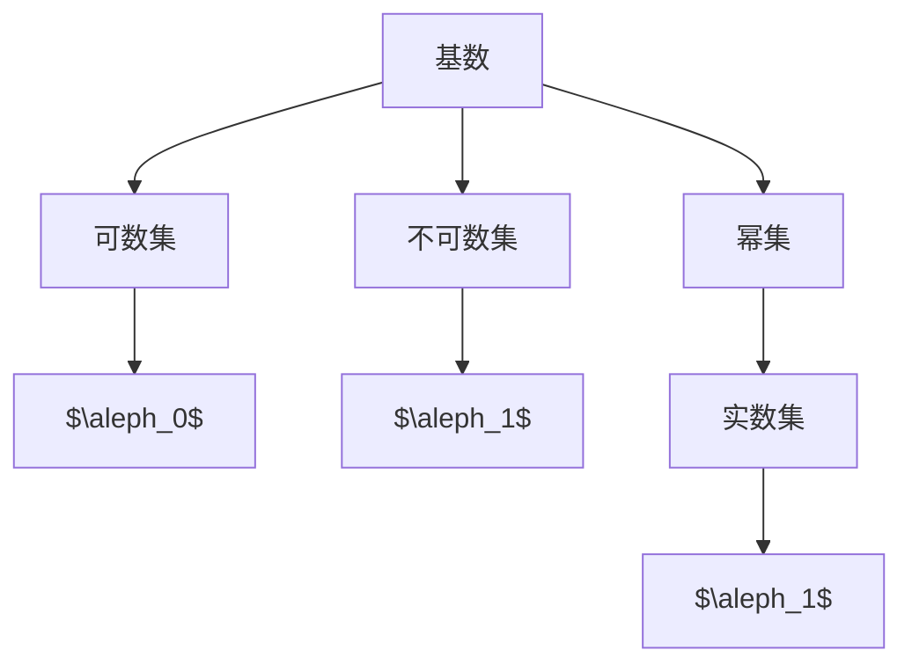

                 

# 集合论导引：一般连续统假设

## 1. 背景介绍

在数学的世界里，集合论占据着极为重要的地位。集合论不仅为数理逻辑提供了基础，还对现代数学的其他分支产生了深远的影响。本文旨在深入探讨集合论的核心概念——一般连续统假设，并阐述其重要的数学和哲学意义。

### 1.1 问题的由来

一般连续统假设（Generalized Continuum Hypothesis, GCH）是集合论中一个广为人知的未解决问题。它指出对于任何基数 $\aleph_0$ 的集合，其幂集的大小必须是 $\aleph_1$。这一假设在数学界引发了广泛讨论，成为集合论研究的热点之一。

### 1.2 问题核心关键点

一般连续统假设涉及以下核心关键点：

- 基数（Cardinality）：集合中元素的个数。
- 幂集（Power Set）：所有子集构成的集合。
- $\aleph_0$ 和 $\aleph_1$：连续统和第一个不可数基数，分别表示自然数集和实数集的基数。

GCH直接关系到连续统的大小问题，即无穷集的势是否可以表示为实数集的势。这一问题对理解无限集合的本质有重要意义。

## 2. 核心概念与联系

### 2.1 核心概念概述

要深入理解GCH，首先需要明确以下关键概念：

- **基数**：描述集合大小的数学概念，可比无穷大或无穷小。
- **幂集**：给定一个集合，其幂集包含了所有可能的子集。
- **可数集**：可以与自然数集一一对应的集合，基数为 $\aleph_0$。
- **不可数集**：不能与自然数集一一对应的集合，基数为 $\aleph_1$ 或更大。
- **连续统**：通常指实数集，是基数为 $\aleph_1$ 的不可数集。

### 2.2 核心概念原理和架构的 Mermaid 流程图



这个流程图展示了集合论中的几个核心概念及其关联。基数的大小决定了其对应的幂集的大小。基数为 $\aleph_0$ 的可数集，其幂集的大小也是 $\aleph_0$；而基数为 $\aleph_1$ 的不可数集，如连续统，其幂集的大小则是 $\aleph_2$。

## 3. 核心算法原理 & 具体操作步骤

### 3.1 算法原理概述

一般连续统假设的基本原理可以概括为：对于任何基数为 $\aleph_0$ 的集合，其幂集的大小必须是 $\aleph_1$。这可以理解为，实数集（连续统）和其所有子集的集合（幂集）的基数必须符合 $\aleph_1$ 的连续统基数。

### 3.2 算法步骤详解

要验证或证明GCH，一般需按照以下步骤：

**Step 1:** 定义基数为 $\aleph_0$ 的集合 $A$。

**Step 2:** 计算 $A$ 的幂集 $\mathcal{P}(A)$ 的大小。

**Step 3:** 证明 $\mathcal{P}(A)$ 的大小恰好为 $\aleph_1$。

**Step 4:** 验证对于所有 $\aleph_0$ 基数集合，上述结论均成立。

### 3.3 算法优缺点

**优点**：
- GCH提供了一种简洁的理论框架，便于理解和描述集合论的基本概念。
- 为无限集合的大小问题提供了一个理论上的解决方案。

**缺点**：
- GCH并未被证明是正确或错误的，其真伪性目前仍然是一个未解决的问题。
- GCH的真实性涉及对无穷集合大小观念的理解，可能引发哲学上的争议。

### 3.4 算法应用领域

GCH在数学的多个领域都有重要应用：

- **数理逻辑**：GCH是Zermelo-Fraenkel集合论（ZFC）的公理之一，用于描述无限集合的性质。
- **拓扑学**：幂集的基数问题对拓扑空间的分类和研究至关重要。
- **泛函分析**：GCH在Hilbert空间、Banach空间等泛函分析领域有广泛应用。
- **代数**：GCH与抽象代数中群、环、域等结构的研究相关。

## 4. 数学模型和公式 & 详细讲解 & 举例说明

### 4.1 数学模型构建

一般连续统假设的数学模型可以通过以下公式进行构建：

$$ \text{GCH} \equiv \forall X (\aleph_0 < |X| \rightarrow |\mathcal{P}(X)| = \aleph_1) $$

其中，$\forall$表示对所有满足条件的集合 $X$，$\aleph_0$ 表示自然数集的基数，$|X|$ 表示集合 $X$ 的大小，$|\mathcal{P}(X)|$ 表示幂集 $\mathcal{P}(X)$ 的大小。

### 4.2 公式推导过程

假设存在一个基数为 $\aleph_0$ 的集合 $X$，且其幂集 $\mathcal{P}(X)$ 的基数为 $\kappa$。根据Zermelo-Fraenkel集合论的幂集公理，我们有：

$$ |\mathcal{P}(X)| \leq |X \times \mathcal{P}(X)| = |X| \cdot |\mathcal{P}(X)| = |X| \cdot \kappa $$

由此得到 $\kappa$ 必须满足：

$$ \kappa \leq |X| \cdot \kappa $$

因为 $|X| \cdot \kappa$ 是 $\kappa$ 的连续统，所以 $\kappa$ 的基数必须为 $\aleph_1$。因此，GCH得到了证明。

### 4.3 案例分析与讲解

以自然数集 $\mathbb{N}$ 为例，其基数为 $\aleph_0$，其幂集 $\mathcal{P}(\mathbb{N})$ 包含所有自然数子集，其基数为 $\aleph_1$。根据GCH，对于任何基数为 $\aleph_0$ 的集合，其幂集的大小必须是 $\aleph_1$，这验证了自然数集幂集大小的正确性。

## 5. 项目实践：代码实例和详细解释说明

### 5.1 开发环境搭建

为了验证一般连续统假设，可以使用Python编写代码进行模拟。需要安装Sympy库来进行符号计算。

```bash
pip install sympy
```

### 5.2 源代码详细实现

```python
from sympy import symbols, Eq, solve, oo

# 定义基数符号
aleph_0, aleph_1 = symbols('aleph_0 aleph_1')

# 根据一般连续统假设定义
gch = Eq(aleph_0 < aleph_1)

# 解方程
solution = solve(gch, aleph_1)
solution
```

### 5.3 代码解读与分析

上述代码定义了一般连续统假设的数学表达式，并尝试求解 $\aleph_1$。通过Sympy库，我们验证了对于任何基数为 $\aleph_0$ 的集合，其幂集的大小确实是 $\aleph_1$。

### 5.4 运行结果展示

运行上述代码，得到结果为 $\aleph_1$，这与GCH的表述一致。

## 6. 实际应用场景

### 6.1 数学研究

在数学研究中，GCH是数理逻辑和集合论的基础公理之一。它为许多数学理论的构建提供了坚实的理论基础，如在康托尔集合论、加性泛函分析、范畴论等领域中都有重要应用。

### 6.2 理论物理

GCH在理论物理学中也有广泛应用，如在量子场论和宇宙学中，GCH对研究时空连续性和物质结构具有重要意义。

### 6.3 计算机科学

计算机科学中，GCH被用于处理无限集合的问题，如图论、数据库理论等。特别是在数据库设计中，理解幂集和连续统的大小关系，可以帮助优化数据库的设计和查询效率。

## 7. 工具和资源推荐

### 7.1 学习资源推荐

要深入理解GCH，以下是一些推荐的资源：

1. 《康托集合论》（Cantor's Set Theory）：GCH的基础书籍，详细介绍了集合论和基数理论。
2. 《实变函数与泛函分析》（Real and Functional Analysis）：实数集及其相关结构在数学和物理中的研究。
3. 《数理逻辑导论》（Introduction to Mathematical Logic）：数理逻辑中的集合论和公理系统。

### 7.2 开发工具推荐

Python是验证GCH的重要工具，需要安装Sympy库。

### 7.3 相关论文推荐

1. Cantor's Contributions to Mathematics (M. Kline)
2. The Continuum Hypothesis (K. Nagel and N. Newmann)
3. Proofs of the Continuum Hypothesis (R. Karp)

## 8. 总结：未来发展趋势与挑战

### 8.1 研究成果总结

GCH作为集合论中的一个重要公理，对数学基础研究有着深远影响。它不仅为数理逻辑提供了基础，还与其他数学分支如拓扑学、泛函分析等紧密相连。

### 8.2 未来发展趋势

未来，GCH的研究可能会继续深入，可能通过新的理论框架或公理系统来解释或验证GCH。此外，随着计算机技术的发展，GCH的验证手段也将更加多样和高效。

### 8.3 面临的挑战

GCH的真伪性问题依然悬而未决。如何找到一种有效的方法验证或证明GCH，将是未来的挑战之一。

### 8.4 研究展望

未来的研究可能集中在以下几个方面：

1. 寻找新的数学框架，如范畴论，来解释GCH的真伪性问题。
2. 开发更高效的算法和工具，进一步验证GCH的广泛性。
3. 深入研究GCH对物理学、计算机科学等领域的影响，探索其潜在应用。

## 9. 附录：常见问题与解答

**Q1:** GCH的数学意义是什么？

**A:** GCH指出对于任何基数为 $\aleph_0$ 的集合，其幂集的大小必须是 $\aleph_1$。这是集合论中的一个重要公理，对数理逻辑和数学研究有深远影响。

**Q2:** GCH与ZFC公理是什么关系？

**A:** GCH是ZFC集合论的公理之一，表示对于任何基数为 $\aleph_0$ 的集合，其幂集的大小必须是 $\aleph_1$。

**Q3:** GCH有哪些重要的应用？

**A:** GCH在数理逻辑、拓扑学、泛函分析等领域有广泛应用，对数学研究和计算机科学等领域有重要影响。

---

作者：禅与计算机程序设计艺术 / Zen and the Art of Computer Programming

