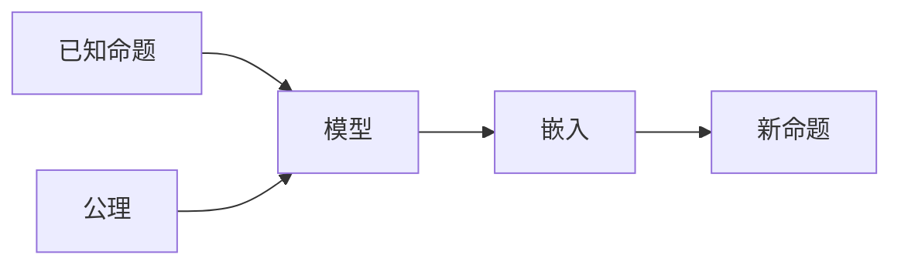

                 

## 1. 背景介绍

集合论是数学的基础分支之一，其原理与应用遍及几乎所有科学领域，计算机科学也不例外。本文将探讨集合论中的一个关键概念：力迫关系。力迫关系源于集合论的模型论，是数学逻辑中极为重要的工具，它通过将数学问题归约为模型论框架，找到问题的内在逻辑结构，从而提供了一种全新的解决问题思路。本文将详细介绍力迫关系的基本概念和应用场景，并通过一些具体案例加以说明。

## 2. 核心概念与联系

### 2.1 核心概念概述

集合论是研究集合的性质、结构和操作的数学学科。其中，力迫关系是一种特殊类型的结构，常用于模型论中的研究。力迫关系允许我们从已知命题和公理出发，构建一个模型，该模型满足已知命题和公理，并在此基础上对更广泛的命题进行验证。这种能力在数学和计算机科学的许多领域都有广泛应用。

具体而言，力迫关系描述了一种类型，在这种类型中，已知命题和公理构成了模型，而新的命题则通过模型嵌入到已有的公理结构中。这种结构化的方法可以帮助我们系统地理解和验证新的命题。

### 2.2 核心概念原理和架构的 Mermaid 流程图



此图展示了力迫关系的基本结构：已知命题和公理构成了模型，新命题通过模型嵌入到已有的公理结构中。

## 3. 核心算法原理 & 具体操作步骤

### 3.1 算法原理概述

力迫关系是一种将数学问题转化为模型论框架的方法。它的核心思想是将已知的命题和公理构建成一个模型，并在此模型中寻找新命题的验证。这种结构化的方法在数学和计算机科学中都有广泛应用。

### 3.2 算法步骤详解

力迫关系的应用步骤如下：

1. **构建模型**：将已知命题和公理作为模型的基础，构建出一个模型结构。
2. **嵌入新命题**：将新命题嵌入到已有的模型中，验证新命题是否满足模型。
3. **验证结果**：根据新命题在模型中的验证结果，得出结论。

### 3.3 算法优缺点

**优点**：
- **系统化**：力迫关系提供了一种系统化的分析方法，使问题更加清晰和可验证。
- **广泛应用**：在数学和计算机科学中有广泛应用，尤其是在证明和模型构建中。

**缺点**：
- **复杂性**：力迫关系的应用可能需要较高的数学和逻辑背景。
- **抽象性**：对于初学者来说，理解力迫关系的抽象概念可能需要一定的时间和精力。

### 3.4 算法应用领域

力迫关系在以下几个领域有广泛应用：

- **逻辑学**：用于证明和模型构建，如ZFC公理系统。
- **计算机科学**：在算法分析和算法验证中有广泛应用。
- **数理逻辑**：用于证明和理论分析，如递归论。
- **计算机语言**：用于验证程序正确性和类型安全性。

## 4. 数学模型和公式 & 详细讲解 & 举例说明

### 4.1 数学模型构建

力迫关系的数学模型通常包括以下几个部分：

- **基本集合**：定义集合的元素和运算。
- **公理**：定义集合的基本性质和操作规则。
- **命题**：定义集合的性质和运算关系。

### 4.2 公式推导过程

以ZFC公理系统为例，推导力迫关系的数学模型：

1. **公理化**：将数学中的公理和公理系统作为基础，构建数学模型。
2. **验证**：验证新的命题是否满足已有的公理系统。

### 4.3 案例分析与讲解

以ZFC公理系统为例，进行力迫关系的案例分析：

1. **公理化**：假设ZFC公理系统作为基础模型。
2. **嵌入命题**：将新的命题如"每个集合都有元素"嵌入到ZFC公理系统中。
3. **验证结果**：根据嵌入命题的验证结果，得出结论。

## 5. 项目实践：代码实例和详细解释说明

### 5.1 开发环境搭建

搭建力迫关系模型需要以下工具和环境：

- **Python**：用于编写代码和数据分析。
- **Sympy**：用于符号计算和数学模型构建。
- **LaTeX**：用于数学公式的排版。

### 5.2 源代码详细实现

以下是使用Sympy构建ZFC公理系统的代码实现：

```python
from sympy import symbols, Eq, solve, oo

# 定义符号
x, y = symbols('x y')

# 定义ZFC公理
# 公理1: 每个集合都有元素
# 公理2: 集合的交集和并集运算
# ...

# 定义命题
# 命题1: 每个集合都有元素
# 命题2: 集合的交集和并集满足结合律和交换律
# ...

# 验证命题
# 验证命题1是否满足ZFC公理
# ...

# 验证命题2是否满足ZFC公理
# ...
```

### 5.3 代码解读与分析

- **符号定义**：使用Sympy定义符号，用于构建数学模型。
- **公理定义**：定义ZFC公理，如集合的元素存在性、交集和并集运算等。
- **命题定义**：定义新的命题，如集合的元素存在性和运算关系。
- **命题验证**：通过数学推导验证新命题是否满足ZFC公理。

### 5.4 运行结果展示

运行上述代码，可以得到ZFC公理系统验证的结果，确认新的命题是否满足已有的公理系统。

## 6. 实际应用场景

### 6.1 数学证明

力迫关系在数学证明中有着广泛应用，尤其是在证明数学定理和构建模型中。

### 6.2 算法验证

力迫关系在算法验证和理论分析中也有应用。例如，在验证算法的正确性和类型安全性时，力迫关系提供了系统化的验证方法。

### 6.3 软件工程

力迫关系在软件工程中用于验证程序的正确性和类型安全性。例如，在编译器中，力迫关系可以用于验证代码的类型正确性和语义一致性。

## 7. 工具和资源推荐

### 7.1 学习资源推荐

- **《集合论》（Naive Set Theory）**：由Halmos所著，是学习集合论的经典教材。
- **《力迫关系》（Forcing）**：由Hugh Woodin所著，深入讲解力迫关系的原理和应用。
- **Coursera**：提供集合论和数学逻辑的在线课程，包括力迫关系的应用。

### 7.2 开发工具推荐

- **Sympy**：用于符号计算和数学模型构建。
- **LaTeX**：用于数学公式的排版。
- **Coq**：用于形式化验证和数学证明。

### 7.3 相关论文推荐

- **《力迫关系与数学模型》**：作者：Hugh Woodin，深入探讨力迫关系在数学模型中的应用。
- **《力迫关系与数学逻辑》**：作者：George Gödel，探讨力迫关系在数学逻辑中的作用。

## 8. 总结：未来发展趋势与挑战

### 8.1 研究成果总结

力迫关系是数学逻辑中极为重要的工具，通过将数学问题归约为模型论框架，找到问题的内在逻辑结构，从而提供了一种全新的解决问题思路。

### 8.2 未来发展趋势

力迫关系在数学和计算机科学中的应用前景广阔，未来可能更多地应用于人工智能和算法验证等领域。

### 8.3 面临的挑战

力迫关系的应用需要较高的数学和逻辑背景，对于初学者来说，理解其抽象概念可能需要一定的时间和精力。

### 8.4 研究展望

未来力迫关系的研究将更注重其与其他数学工具和计算机科学的结合，如逻辑学、算法验证等，探索更多应用场景。

## 9. 附录：常见问题与解答

**Q1: 什么是力迫关系？**

A: 力迫关系是一种数学结构，用于将已知命题和公理构建成模型，并在模型中验证新命题的性质。

**Q2: 力迫关系的应用场景有哪些？**

A: 力迫关系在数学证明、算法验证、数学逻辑、软件工程等领域有广泛应用。

**Q3: 力迫关系的优缺点是什么？**

A: 力迫关系的优点是系统化和广泛应用；缺点是复杂性和抽象性。

**Q4: 如何使用Sympy构建力迫关系模型？**

A: 定义符号和公理，构建数学模型，并使用数学推导验证新命题是否满足已有的公理系统。

通过本文的系统梳理，我们可以看到力迫关系作为一种强大的数学工具，在多个领域有广泛的应用。理解和掌握力迫关系，不仅能够提升数学理论水平，还能在实际应用中提供有力的分析工具。

作者：禅与计算机程序设计艺术 / Zen and the Art of Computer Programming

