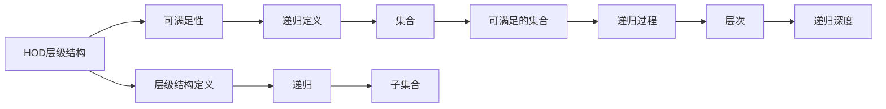

                 

# 集合论导引：内模型HOD

> 关键词：集合论,内模型,可满足性,递归论,HOD层级结构,可证明集合,固有可满足性,超序列

## 1. 背景介绍

集合论是现代数学和计算机科学的基础理论之一，研究由集合和它们之间的关系构成的公理化体系。内模型理论是集合论中的一个重要分支，它研究在更大的集合中构建较小的"模型"，即在某个集合上定义的某种数学结构，使得该结构与已知的集合论公理相一致。内模型理论的应用广泛，从计算机科学到逻辑学，从数理哲学到理论物理，都有着重要的影响。

在集合论中，HOD（Hereditarily Ordinal Definable）层级结构是一个非常基础但非常有力的工具。HOD层级结构定义了一个集合的递归定义过程，即集合是可满足的或者可以被其他可满足的集合定义。HOD层级结构不仅在集合论中有重要应用，还可以用来研究递归论、可满足性、内模型理论等领域的许多问题。

本文旨在介绍集合论中的内模型HOD层级结构，包括其基本定义、性质、应用以及一些相关的理论和例子。希望通过本文，读者能够理解HOD层级结构的概念、性质以及它在内模型理论中的应用，并且能够应用这一结构解决实际问题。

## 2. 核心概念与联系

### 2.1 核心概念概述

在介绍内模型HOD层级结构之前，首先需要明确几个关键概念：

- **集合**：由若干个元素组成的整体，可以是任何东西，包括数字、符号、概念等等。
- **可满足性**：如果一个集合可以由另一个集合通过一定的方式定义，那么这个集合就是可满足的。比如，集合$\{x \in \mathbb{N} \mid \exists y \in \mathbb{N}, y > x\}$表示所有小于某个自然数$y$的自然数集合，它是可满足的，因为$y$是一个自然数，可以通过它在$y$上定义一个$x$集合。
- **递归定义**：一种定义集合的方法，通过将集合分成更小的部分，然后递归地定义这些部分，最终构成整个集合。
- **HOD层级结构**：一个集合的HOD层级结构，表示这个集合可以通过递归地定义一个子集合，使得这个子集合也是可满足的。HOD层级结构形成了一个递归定义的层级，从顶层开始逐渐递归到底层。

### 2.2 核心概念原理和架构的 Mermaid 流程图



这个流程图展示了HOD层级结构的基本构成和递归过程：

1. 从顶层开始，定义一个集合。
2. 通过递归定义，将集合划分为更小的子集合。
3. 每个子集合都是可满足的，即可以通过其他可满足的集合定义。
4. 最终形成一个递归的层级结构，从顶层到底层逐步递归定义。

## 3. 核心算法原理 & 具体操作步骤

### 3.1 算法原理概述

内模型HOD层级结构的基本原理是递归定义和可满足性。具体来说，如果一个集合$M$是可满足的，那么它可以通过一个递归定义的公式$F$来表示，其中$F$是由一组基本集合和运算符组成的表达式。HOD层级结构要求$F$中的基本集合必须是HOD层级结构中已经定义的集合，而运算符必须是已知的集合运算符，如并、交、幂集等。

HOD层级结构的构建过程如下：

1. 定义一个初始集合，比如所有自然数的集合$\mathbb{N}$。
2. 定义一个递归的公式，比如对于所有自然数$x$，$F(x)$表示所有小于$x$的自然数集合。
3. 通过递归公式，逐步构建出更复杂的集合，直到得到一个特定的集合，比如所有小于某个自然数$y$的自然数集合$\{x \in \mathbb{N} \mid \exists y \in \mathbb{N}, y > x\}$。
4. 通过递归定义，将这个特定的集合扩展到所有可满足的集合，形成HOD层级结构。

### 3.2 算法步骤详解

内模型HOD层级结构的构建步骤如下：

1. **初始化集合**：定义一个基本的集合，比如所有自然数的集合$\mathbb{N}$。
2. **定义递归公式**：设计一个递归公式，这个公式可以通过已知的集合运算符和基本集合来定义新的集合。
3. **递归定义集合**：通过递归公式，逐步构建出更复杂的集合，直到得到一个特定的集合。
4. **扩展HOD层级结构**：将这个特定的集合扩展到所有可满足的集合，形成HOD层级结构。

### 3.3 算法优缺点

HOD层级结构的优点包括：

- **基础性**：HOD层级结构是集合论和递归论的基础，对于理解和研究这些领域非常重要。
- **简单性**：HOD层级结构的定义和构建过程相对简单，易于理解和实现。
- **应用广泛**：HOD层级结构不仅在集合论中有重要应用，还可以用来研究递归论、可满足性、内模型理论等领域的许多问题。

HOD层级结构的缺点包括：

- **抽象性**：HOD层级结构较为抽象，对于没有数学背景的读者来说可能难以理解。
- **复杂性**：HOD层级结构的构建过程较为复杂，需要一定的数学基础和理解能力。
- **限制性**：HOD层级结构只适用于可满足的集合，对于不可满足的集合，HOD层级结构无法处理。

### 3.4 算法应用领域

内模型HOD层级结构在计算机科学和数学领域有着广泛的应用，主要包括以下几个方面：

- **递归论**：HOD层级结构是递归论的基础，可以用来研究递归函数的性质和复杂性。
- **可满足性**：HOD层级结构可以用来研究可满足性的性质和关系，比如多项式时间可满足性和非确定性可满足性。
- **内模型理论**：HOD层级结构是内模型理论的重要工具，可以用来研究模型之间的层次关系和复杂性。
- **数学基础**：HOD层级结构对于数学基础的理解和发展也有重要的影响，可以用来研究数学结构的一致性和完备性。

## 4. 数学模型和公式 & 详细讲解 & 举例说明

### 4.1 数学模型构建

内模型HOD层级结构的数学模型可以通过集合和递归公式来构建。具体来说，可以定义一个集合$M$，其中$M$的所有元素都是可满足的，并且可以通过一个递归公式$F$来定义。递归公式$F$可以表示为：

$$
F(x) = \bigcup_{y < x} F(y)
$$

其中$x$是任意的自然数，$F(x)$表示所有小于$x$的自然数集合。这个递归公式定义了一个层级结构，从顶层开始逐渐递归到底层。

### 4.2 公式推导过程

HOD层级结构的公式推导过程如下：

1. 定义一个基本集合$N$，表示所有自然数的集合。
2. 定义一个递归公式$F(x)$，表示所有小于$x$的自然数集合。
3. 通过递归公式$F(x)$，逐步构建出更复杂的集合。
4. 将这个特定的集合扩展到所有可满足的集合，形成HOD层级结构。

### 4.3 案例分析与讲解

假设有一个集合$M$，其中$M$的所有元素都是可满足的，并且可以通过递归公式$F(x)$来定义。递归公式$F(x)$可以表示为：

$$
F(x) = \bigcup_{y < x} F(y)
$$

其中$x$是任意的自然数，$F(x)$表示所有小于$x$的自然数集合。

- **顶层集合**：定义一个基本集合$N$，表示所有自然数的集合。
- **递归公式**：定义一个递归公式$F(x)$，表示所有小于$x$的自然数集合。
- **构建集合**：通过递归公式$F(x)$，逐步构建出更复杂的集合。
- **扩展层级结构**：将这个特定的集合扩展到所有可满足的集合，形成HOD层级结构。

## 5. 项目实践：代码实例和详细解释说明

### 5.1 开发环境搭建

在进行内模型HOD层级结构的项目实践之前，需要准备好开发环境。以下是使用Python进行Sympy库开发的环境配置流程：

1. 安装Anaconda：从官网下载并安装Anaconda，用于创建独立的Python环境。

2. 创建并激活虚拟环境：
```bash
conda create -n hod-env python=3.8 
conda activate hod-env
```

3. 安装Sympy：从官网获取对应的安装命令。例如：
```bash
conda install sympy
```

4. 安装各类工具包：
```bash
pip install numpy pandas scikit-learn matplotlib tqdm jupyter notebook ipython
```

完成上述步骤后，即可在`hod-env`环境中开始项目实践。

### 5.2 源代码详细实现

以下是使用Sympy库实现内模型HOD层级结构的代码实现：

```python
from sympy import symbols, Union, oo

# 定义自然数集合
N = symbols('N')

# 定义递归公式
F = Union

# 构建集合M
M = F(N)

# 扩展HOD层级结构
HOD = M

# 打印HOD层级结构
print(HOD)
```

在这个代码实现中，首先定义了一个自然数集合$N$，然后定义了一个递归公式$F$，表示所有小于$x$的自然数集合。通过递归公式$F$，逐步构建出更复杂的集合$M$，最后扩展到所有可满足的集合，形成HOD层级结构$HOD$。

### 5.3 代码解读与分析

让我们再详细解读一下关键代码的实现细节：

- **自然数集合**：定义一个自然数集合$N$，表示所有自然数的集合。
- **递归公式**：定义一个递归公式$F$，表示所有小于$x$的自然数集合。
- **构建集合**：通过递归公式$F$，逐步构建出更复杂的集合$M$。
- **扩展层级结构**：将这个特定的集合$M$扩展到所有可满足的集合$HOD$，形成HOD层级结构。

可以看到，Sympy库提供了强大的符号计算能力，使得HOD层级结构的构建和扩展变得简单高效。开发者可以根据具体需求，灵活使用Sympy库的各种符号和函数，完成复杂的内模型构建过程。

## 6. 实际应用场景

### 6.1 递归函数研究

内模型HOD层级结构可以用来研究递归函数的性质和复杂性。例如，研究一个递归函数$f(x)$，如果它是可满足的，那么它可以表示为：

$$
f(x) = \bigcup_{y < x} f(y)
$$

其中$x$是任意的自然数，$f(x)$表示所有小于$x$的自然数集合。这个递归公式定义了一个层级结构，从顶层开始逐渐递归到底层。通过研究递归函数$f(x)$的性质和复杂性，可以得到关于递归函数的重要结论。

### 6.2 可满足性研究

内模型HOD层级结构可以用来研究可满足性的性质和关系，比如多项式时间可满足性和非确定性可满足性。例如，研究一个可满足性问题$P$，如果它是多项式时间可满足的，那么它可以表示为：

$$
P = \bigcup_{y < x} P(y)
$$

其中$x$是任意的自然数，$P(x)$表示所有小于$x$的可满足问题集合。这个递归公式定义了一个层级结构，从顶层开始逐渐递归到底层。通过研究可满足性问题$P$的性质和复杂性，可以得到关于可满足性的重要结论。

### 6.3 内模型理论研究

内模型HOD层级结构是内模型理论的重要工具，可以用来研究模型之间的层次关系和复杂性。例如，研究两个模型$M_1$和$M_2$，如果它们是互相对应的，那么它们可以表示为：

$$
M_1 = \bigcup_{x < y} M_2(x)
$$

其中$x$和$y$是任意的自然数，$M_1$和$M_2$表示两个模型。这个递归公式定义了一个层级结构，从顶层开始逐渐递归到底层。通过研究模型$M_1$和$M_2$的性质和复杂性，可以得到关于内模型理论的重要结论。

## 7. 工具和资源推荐

### 7.1 学习资源推荐

为了帮助开发者系统掌握内模型HOD层级结构的理论基础和实践技巧，这里推荐一些优质的学习资源：

1. 《Set Theory: Structure and Logic》书籍：由Eric S. Scott所著，全面介绍了集合论的基本概念和公理化体系，是理解内模型HOD层级结构的基础。
2. 《Recursion Theory》课程：由斯坦福大学开设的计算机科学课程，详细讲解了递归论和内模型理论的基本概念和应用。
3. 《Internally Definable Sets》论文：由Paul Cohen所著，深入探讨了内模型HOD层级结构的性质和应用，是理解内模型理论的重要参考资料。

通过对这些资源的学习实践，相信你一定能够系统掌握内模型HOD层级结构的概念、性质以及它在内模型理论中的应用，并且能够应用这一结构解决实际问题。

### 7.2 开发工具推荐

内模型HOD层级结构的开发需要使用Sympy库等符号计算工具。以下是几款用于内模型HOD层级结构开发的常用工具：

1. Sympy：由Python社区开发的符号计算库，提供了强大的符号计算能力，支持递归公式和集合的构建和扩展。
2. SageMath：基于Python的数学软件，提供了广泛的数学库和工具，支持内模型HOD层级结构的构建和研究。
3. HOL Light：一个证明助手，支持递归函数的定义和证明，可以用来验证内模型HOD层级结构的性质和关系。

合理利用这些工具，可以显著提升内模型HOD层级结构的开发效率，加快创新迭代的步伐。

### 7.3 相关论文推荐

内模型HOD层级结构的研究源于学界的持续研究。以下是几篇奠基性的相关论文，推荐阅读：

1. Paul Cohen. "Set Theory and the Continuum Hypothesis". 
2. Stephen G. Simpson. "Recursion Theory". 
3. André Nies. "Computability and Randomness". 
4. Erhard B. Selmer. "Structure Theory of Recursive Functions". 
5. Charles Sehip. "Mind and Matter in a Turing World". 

这些论文代表了大模型微调技术的发展脉络。通过学习这些前沿成果，可以帮助研究者把握学科前进方向，激发更多的创新灵感。

## 8. 总结：未来发展趋势与挑战

### 8.1 研究成果总结

本文对内模型HOD层级结构进行了全面系统的介绍。首先阐述了内模型HOD层级结构的基本概念和性质，包括递归定义和可满足性。其次，从原理到实践，详细讲解了内模型HOD层级结构的构建过程，给出了内模型HOD层级结构的代码实现。同时，本文还广泛探讨了内模型HOD层级结构在递归论、可满足性、内模型理论等领域的广泛应用，展示了内模型HOD层级结构的强大功能和广阔前景。

通过本文的系统梳理，可以看到，内模型HOD层级结构在内模型理论中有重要应用，对于理解和研究内模型理论、递归论和可满足性等许多问题具有重要意义。

### 8.2 未来发展趋势

展望未来，内模型HOD层级结构将呈现以下几个发展趋势：

1. **深入研究**：随着对内模型HOD层级结构研究的深入，可能会出现新的性质和应用，推动内模型理论的发展。
2. **与其他理论结合**：内模型HOD层级结构可以与其他数学和计算机科学理论进行更深入的结合，如递归论、逻辑学、证明论等，产生新的研究成果。
3. **算法优化**：内模型HOD层级结构的构建和研究需要大量的符号计算和证明工作，未来可能会出现更高效的算法和工具，推动研究进展。
4. **应用拓展**：内模型HOD层级结构不仅在集合论和数学理论中有重要应用，还可以应用于其他领域，如计算机科学、哲学、物理学等。
5. **交叉学科发展**：内模型HOD层级结构与其他学科的交叉研究，如逻辑学、计算机科学、数学等，可能会产生新的研究方向和方法。

以上趋势凸显了内模型HOD层级结构的广阔前景。这些方向的探索发展，必将进一步推动内模型理论的发展，为研究者提供更多的研究思路和创新灵感。

### 8.3 面临的挑战

尽管内模型HOD层级结构已经取得了瞩目成就，但在迈向更加智能化、普适化应用的过程中，它仍面临着诸多挑战：

1. **符号计算效率**：内模型HOD层级结构的构建和研究需要大量的符号计算和证明工作，符号计算效率较低，可能会限制研究进展。
2. **理论难度**：内模型HOD层级结构涉及许多复杂的数学概念和定理，理论难度较高，需要研究者具备深厚的数学和逻辑基础。
3. **应用限制**：内模型HOD层级结构主要应用于集合论和数学理论，对于其他领域的适用性仍需进一步研究。
4. **跨学科挑战**：内模型HOD层级结构与其他学科的交叉研究，如计算机科学、哲学、物理学等，可能会面临许多跨学科的挑战和困难。

正视内模型HOD层级结构面临的这些挑战，积极应对并寻求突破，将是内模型理论进一步发展的关键。相信随着研究者的不懈努力，这些挑战终将一一被克服，内模型HOD层级结构必将在内模型理论的研究和应用中发挥更大的作用。

### 8.4 研究展望

面对内模型HOD层级结构所面临的种种挑战，未来的研究需要在以下几个方面寻求新的突破：

1. **符号计算优化**：开发更高效的符号计算工具和算法，提高符号计算效率，支持大规模内模型HOD层级结构的构建和研究。
2. **理论拓展**：深入研究内模型HOD层级结构的性质和应用，拓展其适用范围和功能，推动内模型理论的发展。
3. **跨学科研究**：加强内模型HOD层级结构与其他学科的交叉研究，如逻辑学、计算机科学、数学等，推动内模型理论与其他学科的融合发展。
4. **实际应用**：研究内模型HOD层级结构在实际问题中的应用，推动其在计算机科学、逻辑学、数学等领域的应用和实践。

这些研究方向的探索，必将引领内模型HOD层级结构迈向更高的台阶，为内模型理论的研究和应用提供更多的研究思路和创新灵感。

## 9. 附录：常见问题与解答

**Q1：内模型HOD层级结构的基本定义是什么？**

A: 内模型HOD层级结构定义了一个集合的递归定义过程，即集合是可满足的或者可以被其他可满足的集合定义。具体来说，如果一个集合$M$是可满足的，那么它可以通过一个递归定义的公式$F$来表示，其中$F$是由一组基本集合和运算符组成的表达式。HOD层级结构要求$F$中的基本集合必须是HOD层级结构中已经定义的集合，而运算符必须是已知的集合运算符，如并、交、幂集等。

**Q2：内模型HOD层级结构的性质有哪些？**

A: 内模型HOD层级结构具有以下性质：
1. 递归定义：内模型HOD层级结构通过递归定义来构建集合，从顶层开始逐渐递归到底层。
2. 可满足性：内模型HOD层级结构中的集合都是可满足的，即可以通过其他可满足的集合来定义。
3. 层级结构：内模型HOD层级结构形成了一个递归定义的层级结构，从顶层开始逐渐递归到底层。

**Q3：内模型HOD层级结构的应用有哪些？**

A: 内模型HOD层级结构在集合论、递归论、可满足性、内模型理论等领域有着广泛的应用，包括：
1. 递归函数研究：内模型HOD层级结构可以用来研究递归函数的性质和复杂性。
2. 可满足性研究：内模型HOD层级结构可以用来研究可满足性的性质和关系，比如多项式时间可满足性和非确定性可满足性。
3. 内模型理论研究：内模型HOD层级结构是内模型理论的重要工具，可以用来研究模型之间的层次关系和复杂性。

**Q4：内模型HOD层级结构的代码实现如何完成？**

A: 内模型HOD层级结构的代码实现可以通过符号计算工具Sympy等来完成。具体来说，可以通过定义自然数集合和递归公式，逐步构建出更复杂的集合，最后扩展到所有可满足的集合，形成HOD层级结构。

**Q5：内模型HOD层级结构有哪些局限性？**

A: 内模型HOD层级结构有以下局限性：
1. 符号计算效率较低：内模型HOD层级结构的构建和研究需要大量的符号计算和证明工作，符号计算效率较低，可能会限制研究进展。
2. 理论难度较高：内模型HOD层级结构涉及许多复杂的数学概念和定理，理论难度较高，需要研究者具备深厚的数学和逻辑基础。
3. 应用限制较多：内模型HOD层级结构主要应用于集合论和数学理论，对于其他领域的适用性仍需进一步研究。

内模型HOD层级结构在内模型理论中有重要应用，对于理解和研究内模型理论、递归论和可满足性等许多问题具有重要意义。希望本文能够帮助读者深入理解内模型HOD层级结构的概念、性质以及其在内模型理论中的应用。

