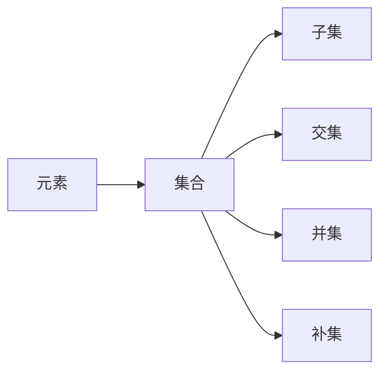

                 

# 集合论导引：可构造集合之秩序

## 1. 背景介绍

### 1.1 问题由来

集合论是数学的基础，它不仅在数学中有着深远的影响，在计算机科学中也有着广泛的应用。集合的构造和操作是计算机科学中最基础的概念之一，尤其在数据结构和算法设计中，集合的操作和性质常常被用来解决实际问题。然而，对于集合论的核心概念和操作方法，许多初学者仍然存在一定的困惑和误解。因此，本文旨在为读者提供一套详细的集合论导引，帮助读者理解集合的构造、性质和应用。

### 1.2 问题核心关键点

集合论的核心是研究集合的构造、性质和操作。集合被定义为一种包含零个或多个元素的抽象对象，它可以用来描述和分析各种现实世界中的实体。集合论中的基本概念包括元素、集合、集合的运算、集合的性质等。通过对这些概念的深入理解，读者可以更好地应用集合论解决实际问题，并深入理解计算机科学中的数据结构和算法。

## 2. 核心概念与联系

### 2.1 核心概念概述

本节将介绍集合论中的一些核心概念，并讨论它们之间的联系。

#### 2.1.1 元素和集合

- 元素：集合中的基本单位，可以是数字、字母、符号等任何对象。
- 集合：由一个或多个元素组成的整体，通常用大括号 {} 表示。例如，集合 {1, 2, 3} 包含三个元素 1、2、3。

#### 2.1.2 子集和真子集

- 子集：包含在另一个集合中的集合称为另一个集合的子集。例如，{1, 2} 是 {1, 2, 3} 的子集。
- 真子集：除了本身之外，没有其他元素的子集称为真子集。例如，{1, 2} 是 {1, 2, 3} 的真子集。

#### 2.1.3 交集和并集

- 交集：两个集合中共有的元素组成的集合称为它们的交集。例如，{1, 2} 和 {2, 3} 的交集是 {2}。
- 并集：两个集合中所有的元素组成的集合称为它们的并集。例如，{1, 2} 和 {2, 3} 的并集是 {1, 2, 3}。

#### 2.1.4 补集

- 补集：在全集中不在集合中的元素组成的集合称为该集合的补集。例如，全集 {1, 2, 3, 4, 5} 中不在集合 {1, 2, 3} 中的元素是 {4, 5}。

### 2.2 核心概念原理和架构的 Mermaid 流程图



这个流程图展示了元素和集合之间的关系，以及它们之间的基本操作。

## 3. 核心算法原理 & 具体操作步骤

### 3.1 算法原理概述

集合论中的算法主要涉及集合的构造和操作，常见的算法包括集合的创建、子集和真子集的查找、交集和并集的计算等。这些算法通常使用递归、迭代等基本算法思想实现，具有较高的效率和可扩展性。

### 3.2 算法步骤详解

以一个简单的例子来说明集合论中的基本算法：

#### 3.2.1 创建集合

创建集合是集合论中最基本的操作之一。在Python中，可以使用set类型来表示集合，如下所示：

```python
# 创建集合
my_set = {1, 2, 3}
```

#### 3.2.2 查找子集和真子集

查找子集和真子集通常使用集合的in操作符，如下所示：

```python
# 查找子集
if {1, 2} in my_set:
    print("子集存在")
else:
    print("子集不存在")

# 查找真子集
if {1, 2} in my_set:
    print("真子集存在")
else:
    print("真子集不存在")
```

#### 3.2.3 计算交集和并集

计算交集和并集通常使用集合的&和|操作符，如下所示：

```python
# 计算交集
other_set = {2, 3, 4}
intersection = my_set & other_set
print(intersection)

# 计算并集
union = my_set | other_set
print(union)
```

#### 3.2.4 计算补集

计算补集通常使用集合的difference操作符，如下所示：

```python
# 计算补集
universe = {1, 2, 3, 4, 5}
complement = my_set - universe
print(complement)
```

### 3.3 算法优缺点

集合论中的算法通常具有较高的效率和可扩展性，但也有一些缺点：

#### 3.3.1 优点

- 高效性：集合论中的算法通常使用递归和迭代等基本算法思想，具有较高的效率和可扩展性。
- 可移植性：由于集合论是一种通用的数学理论，因此它的算法可以在各种编程语言中实现和应用。

#### 3.3.2 缺点

- 复杂性：集合论中的某些概念和算法可能比较复杂，理解起来有一定的难度。
- 实现难度：某些集合论算法可能需要使用复杂的逻辑和数据结构，实现难度较大。

### 3.4 算法应用领域

集合论的算法在计算机科学中有着广泛的应用，特别是在数据结构和算法设计中，集合的操作和性质常常被用来解决实际问题。例如，在图论中，集合的操作和性质可以用来描述图的关系和结构；在算法设计中，集合的操作和性质常常被用来设计高效的算法。

## 4. 数学模型和公式 & 详细讲解 & 举例说明

### 4.1 数学模型构建

集合论中的数学模型主要涉及集合的定义、集合的运算和集合的性质等。以下是一些常见的数学模型：

- 集合的定义：集合是包含零个或多个元素的抽象对象，通常用大括号 {} 表示。
- 集合的运算：集合的交集、并集、补集等基本运算。
- 集合的性质：集合的完备性、封闭性、自反性等基本性质。

### 4.2 公式推导过程

以集合的交集和并集为例，推导它们的公式：

#### 4.2.1 交集的公式

设 $A$ 和 $B$ 是两个集合，它们的交集 $A \cap B$ 包含同时属于 $A$ 和 $B$ 的所有元素，公式为：

$$
A \cap B = \{x | x \in A \land x \in B\}
$$

#### 4.2.2 并集的公式

设 $A$ 和 $B$ 是两个集合，它们的并集 $A \cup B$ 包含属于 $A$ 或 $B$ 的所有元素，公式为：

$$
A \cup B = \{x | x \in A \lor x \in B\}
$$

### 4.3 案例分析与讲解

以集合 {1, 2, 3} 和 {2, 3, 4} 为例，计算它们的交集和并集：

- 交集：{1, 2, 3} 和 {2, 3, 4} 的交集是 {2, 3}。
- 并集：{1, 2, 3} 和 {2, 3, 4} 的并集是 {1, 2, 3, 4}。

## 5. 项目实践：代码实例和详细解释说明

### 5.1 开发环境搭建

在进行集合论的实践时，需要先搭建好开发环境。以下是Python环境搭建的步骤：

1. 安装Python：下载并安装Python，并确保安装版本为3.6或以上。
2. 安装pip：在命令行下运行 `pip install --upgrade pip` 来升级pip。
3. 安装set库：在命令行下运行 `pip install set` 来安装Python set库。

### 5.2 源代码详细实现

以下是集合论中的交集和并集实现的代码：

```python
# 创建集合
my_set = {1, 2, 3}
other_set = {2, 3, 4}

# 计算交集
intersection = my_set & other_set
print("交集:", intersection)

# 计算并集
union = my_set | other_set
print("并集:", union)
```

### 5.3 代码解读与分析

集合的交集和并集是集合论中常用的基本操作，代码实现非常简洁。其中，&和|操作符分别表示交集和并集，它们都是Python set库的内置操作符。

## 6. 实际应用场景

集合论的应用场景非常广泛，以下是一些常见的应用：

### 6.1 图论

在图论中，集合可以用来描述图的关系和结构。例如，集合可以用来表示图的节点和边，通过集合的交集和并集可以计算图的路径和连通性。

### 6.2 算法设计

集合的操作和性质常常被用来设计高效的算法。例如，使用集合的交集和并集可以设计出高效的排序算法、搜索算法等。

### 6.3 数据结构

集合是数据结构中的基本概念之一，常常被用来实现其他数据结构，如哈希表、堆等。

### 6.4 未来应用展望

未来，集合论的应用将会更加广泛，随着计算机技术的不断发展，集合的操作和性质将会在更多的领域得到应用，如人工智能、大数据、区块链等。

## 7. 工具和资源推荐

### 7.1 学习资源推荐

以下是一些推荐的集合论学习资源：

- 《集合论导引》：一本书系统地介绍了集合论的基本概念和应用。
- Coursera上的《集合论》课程：斯坦福大学开设的课程，讲解了集合论的基本概念和应用。
- 《离散数学》：一本系统地介绍了离散数学中的集合论部分。

### 7.2 开发工具推荐

以下是一些推荐的集合论开发工具：

- Python set库：Python中的set类型，用于实现集合的基本操作。
- set操作符：Python set库的内置操作符，用于实现集合的交集和并集等操作。

### 7.3 相关论文推荐

以下是一些推荐的集合论相关论文：

- "Set Theory and Its Philosophy"：一篇系统地介绍了集合论的历史和应用。
- "Set Theory and Its Applications"：一本系统地介绍了集合论的基本概念和应用。

## 8. 总结：未来发展趋势与挑战

### 8.1 研究成果总结

集合论是数学和计算机科学中的基础理论，它在数据结构、算法设计、图论等方面有着广泛的应用。通过集合论的学习，读者可以更好地理解计算机科学中的基本概念和算法设计。

### 8.2 未来发展趋势

未来，集合论的应用将会更加广泛，随着计算机技术的不断发展，集合的操作和性质将会在更多的领域得到应用。

### 8.3 面临的挑战

尽管集合论已经得到了广泛的应用，但在某些领域仍然面临一些挑战：

- 复杂性：集合论中的某些概念和算法可能比较复杂，理解起来有一定的难度。
- 实现难度：某些集合论算法可能需要使用复杂的逻辑和数据结构，实现难度较大。

### 8.4 研究展望

未来的研究需要进一步深入探索集合论的复杂性和实现难度，开发更加高效和可扩展的算法，推动集合论在更多领域的应用。

## 9. 附录：常见问题与解答

**Q1: 集合和元素之间的关系是什么？**

A: 集合是包含零个或多个元素的抽象对象，元素是集合中的基本单位，可以是数字、字母、符号等任何对象。

**Q2: 如何判断一个元素是否属于一个集合？**

A: 可以使用in操作符来判断一个元素是否属于一个集合。

**Q3: 如何计算两个集合的交集和并集？**

A: 可以使用&和|操作符来计算两个集合的交集和并集。

**Q4: 如何计算一个集合的补集？**

A: 可以使用difference操作符来计算一个集合的补集。

**Q5: 集合论在计算机科学中的应用有哪些？**

A: 集合论在数据结构、算法设计、图论等方面有着广泛的应用。

---

作者：禅与计算机程序设计艺术 / Zen and the Art of Computer Programming

