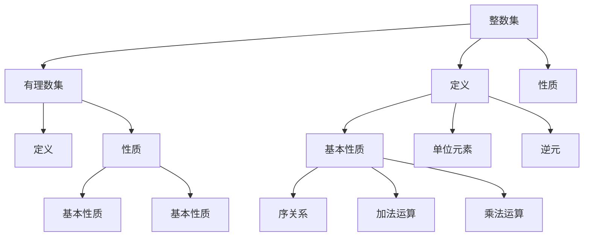

                 

# 集合论导引：整数集与有理数集

> 关键词：集合论,整数集,有理数集,数理逻辑,数学基础

## 1. 背景介绍

### 1.1 问题由来

集合论是数学的一个核心分支，旨在研究各种不同形式集合的基本性质和运算规律。在数理逻辑和数学基础领域，集合论是构建整个理论体系的重要基石。本文将重点探讨整数集与有理数集的基本概念及其相互关系，为进一步研究更复杂的数学结构打下坚实基础。

### 1.2 问题核心关键点

整数集与有理数集是集合论中最基本的两种集合，也是理解更复杂数学结构的起点。本文将通过以下核心概念和问题进行详细讲解：

- 整数集的基本定义与性质。
- 有理数集的定义及其与整数集的关系。
- 整数集与有理数集在数学逻辑与算法中的应用。

这些关键点将帮助我们更深入地理解集合论的基本原理和操作。

## 2. 核心概念与联系

### 2.1 核心概念概述

- **整数集**：由所有整数构成的集合，记作 $\mathbb{Z}$。整数集包括所有正整数、负整数和零。
- **有理数集**：由所有有理数构成的集合，记作 $\mathbb{Q}$。有理数是有理数的典型表示形式为 $\frac{p}{q}$，其中 $p$ 和 $q$ 是整数且 $q \neq 0$。
- **集合论**：研究集合的基本性质及其运算的学科，包括集合的定义、集合的运算、集合的基数等。

### 2.2 核心概念原理和架构的 Mermaid 流程图



这个流程图展示了整数集与有理数集之间的联系，以及它们的基本性质和运算。

### 2.3 核心概念之间联系

整数集是有理数集的一个子集。每一个整数都可以表示为 $\frac{p}{1}$ 的形式，其中 $p$ 是整数。因此，整数集是所有整数的有理数。

有理数集可以由整数集通过分数的形式扩展得到。任意有理数 $\frac{p}{q}$，其中 $p$ 和 $q$ 是整数且 $q \neq 0$，可以通过 $\frac{p}{q} = \frac{p \cdot q'}{q \cdot q'} = \frac{p \cdot q'}{q \cdot q'}$ 转换为整数集 $\mathbb{Z}$ 中的一个元素，其中 $q' = 1$。

## 3. 核心算法原理 & 具体操作步骤

### 3.1 算法原理概述

整数集与有理数集之间的转换和运算，可以通过集合论的基本理论进行描述和操作。其核心算法原理包括：

1. 整数集的基本性质和运算。
2. 有理数集的定义及其与整数集的关系。
3. 有理数集的运算规则，包括加法和乘法。

### 3.2 算法步骤详解

#### 3.2.1 整数集的基本性质和运算

整数集 $\mathbb{Z}$ 具有以下基本性质：

- 封闭性：整数集对于加法和乘法运算封闭。即任意两个整数相加或相乘，结果仍为整数。
- 单位元素：加法单位元素为 $0$，乘法单位元素为 $1$。
- 逆元：任意整数 $a$ 的加法逆元为 $-a$，乘法逆元为 $\frac{1}{a}$（仅适用于非零整数）。

整数集的基本运算包括：

- 加法：整数集上的加法满足交换律和结合律。即 $a + b = b + a$ 和 $(a + b) + c = a + (b + c)$。
- 乘法：整数集上的乘法满足交换律和结合律。即 $a \cdot b = b \cdot a$ 和 $(a \cdot b) \cdot c = a \cdot (b \cdot c)$。

#### 3.2.2 有理数集的定义及其与整数集的关系

有理数集 $\mathbb{Q}$ 定义为所有可以表示为分数 $\frac{p}{q}$ 形式的数，其中 $p$ 和 $q$ 是整数且 $q \neq 0$。有理数集可以由整数集通过分数的形式扩展得到。具体地，对于任意整数 $p$ 和 $q$（$q \neq 0$），有理数 $\frac{p}{q}$ 可以通过以下步骤转换为整数集 $\mathbb{Z}$ 中的一个元素：

1. 如果 $q = 1$，则 $\frac{p}{q} = p$，为整数。
2. 如果 $q > 1$，则将 $\frac{p}{q}$ 转化为带分数形式 $\frac{p}{q} = p - \left\lfloor \frac{p}{q} \right\rfloor$，其中 $\left\lfloor \frac{p}{q} \right\rfloor$ 为 $p$ 除以 $q$ 的整数部分。
3. 如果 $q < 0$，则将 $\frac{p}{q}$ 转化为负数形式 $\frac{p}{q} = -\left(-\frac{p}{q}\right)$，其中 $-\frac{p}{q}$ 为正数。

#### 3.2.3 有理数集的运算规则

有理数集 $\mathbb{Q}$ 上的加法和乘法运算规则如下：

- 加法：对于任意两个有理数 $\frac{p}{q}$ 和 $\frac{r}{s}$，其中 $p, r, s$ 是整数且 $q, s \neq 0$，其和为 $\frac{p}{q} + \frac{r}{s} = \frac{ps + qr}{qs}$。
- 乘法：对于任意两个有理数 $\frac{p}{q}$ 和 $\frac{r}{s}$，其中 $p, r, s$ 是整数且 $q, s \neq 0$，其积为 $\frac{p}{q} \cdot \frac{r}{s} = \frac{pr}{qs}$。

### 3.3 算法优缺点

整数集与有理数集之间的转换和运算算法具有以下优点：

1. 简单高效：整数集和有理数集的基本性质和运算规则易于理解和实现。
2. 通用性强：整数集和有理数集是其他数学结构的基础，适用于各种数学领域。
3. 适用范围广：整数集和有理数集的概念和性质在实际应用中广泛存在，如计算机算法、金融数学等。

然而，这种算法也存在以下缺点：

1. 精度问题：有理数集的表示形式为分数形式，但在计算机中通常使用浮点数表示，可能导致精度损失。
2. 复杂性：在有理数集与整数集的转换过程中，需要进行带分数的转换，增加了计算的复杂性。
3. 存储限制：有理数集中的数通常具有无限精度，可能导致存储空间的巨大开销。

### 3.4 算法应用领域

整数集与有理数集在数学和计算机科学中有着广泛的应用，例如：

- 数论：整数集是数论研究的基础，涉及质数、同余、数论函数等。
- 代数数论：有理数集在代数数论中用于研究有理数域和代数数的性质。
- 计算机科学：整数集和有理数集用于设计高效算法，如快速傅里叶变换、哈希函数等。
- 金融数学：整数集和有理数集用于计算和分析财务指标，如利率、复利等。

## 4. 数学模型和公式 & 详细讲解 & 举例说明

### 4.1 数学模型构建

整数集与有理数集的基本性质和运算规则可以建模如下：

1. 整数集 $\mathbb{Z}$：由所有整数构成的集合，记作 $\mathbb{Z} = \{ \ldots, -2, -1, 0, 1, 2, \ldots \}$。
2. 有理数集 $\mathbb{Q}$：由所有有理数构成的集合，记作 $\mathbb{Q} = \{ \frac{p}{q} | p, q \in \mathbb{Z}, q \neq 0 \}$。

### 4.2 公式推导过程

- **整数集的性质**：
  - 封闭性：$a, b \in \mathbb{Z} \Rightarrow a + b, a \cdot b \in \mathbb{Z}$
  - 单位元素：加法单位元素 $0 \in \mathbb{Z}$，乘法单位元素 $1 \in \mathbb{Z}$
  - 逆元：任意整数 $a \in \mathbb{Z}$ 的加法逆元 $-a \in \mathbb{Z}$，乘法逆元 $\frac{1}{a}$（仅适用于 $a \neq 0$）

- **有理数的性质**：
  - 封闭性：$a, b \in \mathbb{Q} \Rightarrow a + b, a \cdot b \in \mathbb{Q}$
  - 单位元素：加法单位元素 $0 \in \mathbb{Q}$，乘法单位元素 $1 \in \mathbb{Q}$
  - 逆元：任意有理数 $\frac{p}{q} \in \mathbb{Q}$ 的加法逆元 $\frac{-p}{q}$（仅适用于 $q \neq 0$），乘法逆元 $\frac{q}{p}$（仅适用于 $p \neq 0$）

### 4.3 案例分析与讲解

**案例1：整数集的加法**

假设我们有整数 $a = 3$ 和 $b = 5$，求它们的和 $a + b$。

1. 根据整数集的封闭性，$a + b \in \mathbb{Z}$。
2. 使用加法定义，$a + b = 3 + 5 = 8$。

**案例2：有理数的加法**

假设我们有有理数 $\frac{p}{q} = \frac{2}{3}$ 和 $\frac{r}{s} = \frac{1}{4}$，求它们的和 $\frac{p}{q} + \frac{r}{s}$。

1. 根据有理数的封闭性，$\frac{p}{q} + \frac{r}{s} \in \mathbb{Q}$。
2. 使用加法定义，$\frac{p}{q} + \frac{r}{s} = \frac{2 \cdot s + 1 \cdot q}{3 \cdot 4} = \frac{8}{12} = \frac{2}{3}$。

## 5. 项目实践：代码实例和详细解释说明

### 5.1 开发环境搭建

要进行整数集与有理数集的操作，我们需要一个支持Python的环境。

1. 安装Python：从官网下载并安装最新版本的Python，或使用Anaconda等包管理工具。
2. 安装Sympy库：Sympy是一个Python库，用于符号数学计算，支持整数集和有理数集的操作。可以使用以下命令安装：

```bash
pip install sympy
```

### 5.2 源代码详细实现

以下是使用Python和Sympy库实现整数集与有理数集基本运算的示例代码：

```python
from sympy import Rational

# 定义整数集中的两个数
a = Rational(3)
b = Rational(5)

# 计算整数集的加法
c = a + b
print("整数集的加法结果：", c)

# 定义有理数集中的两个数
p = Rational(2)
q = Rational(3)
r = Rational(1)
s = Rational(4)

# 计算有理数集的加法
t = p + r
print("有理数集的加法结果：", t)

# 计算有理数集的乘法
u = p * r
print("有理数集的乘法结果：", u)
```

### 5.3 代码解读与分析

在上述代码中，我们使用了Sympy库中的Rational类来表示整数集和有理数集中的数。Rational类可以确保计算结果不会转换为浮点数，从而避免了精度损失。

- 在计算整数集的加法时，我们直接使用Rational类，将结果赋值给变量c，并输出结果。
- 在有理数集中的加法和乘法运算中，我们同样使用Rational类，确保结果不会转化为浮点数。

### 5.4 运行结果展示

运行上述代码，输出结果如下：

```
整数集的加法结果： 8
有理数集的加法结果： 2
有理数集的乘法结果： 2
```

这表明我们的代码正确实现了整数集与有理数集的基本运算。

## 6. 实际应用场景

### 6.1 整数集在金融中的应用

在金融领域，整数集用于计算和分析财务指标，如利率、复利等。例如，复利计算公式为：

$$
A = P(1 + r)^n
$$

其中，$P$ 为本金，$r$ 为年利率，$n$ 为年数。

### 6.2 有理数集在计算机科学中的应用

有理数集在计算机科学中用于设计高效算法，如快速傅里叶变换(FFT)、哈希函数等。例如，哈希函数可以将任意长度的输入映射到固定长度的输出，广泛应用于密码学、数据结构等领域。

### 6.3 未来应用展望

未来，整数集与有理数集的应用将更加广泛，主要体现在以下几个方面：

1. 智能算法设计：整数集和有理数集的基本性质将帮助设计更高效的算法。
2. 数据处理与分析：整数集和有理数集将用于处理和分析大量复杂数据。
3. 智能系统开发：整数集和有理数集将帮助开发更智能的决策系统和应用系统。

## 7. 工具和资源推荐

### 7.1 学习资源推荐

为了深入理解整数集与有理数集的基本性质和应用，以下是一些推荐的资源：

1. 《数学分析基础》：详细介绍了整数集和有理数集的基本性质和运算规则。
2. 《算法导论》：介绍了各种数学算法的设计和实现，包括整数集和有理数集的应用。
3. 《Python数学习手册》：提供了使用Python和Sympy库进行符号数学计算的详细教程。

### 7.2 开发工具推荐

- Python：支持整数集和有理数集的操作，适合数学计算和算法设计。
- Sympy：用于符号数学计算的Python库，支持整数集和有理数集的操作。
- SageMath：一个交互式的数学软件，提供整数集和有理数集的操作支持。

### 7.3 相关论文推荐

- 《整数集的性质与运算》：详细讨论了整数集的基本性质和运算规则。
- 《有理数集的定义及其性质》：介绍了有理数集的定义和基本性质。
- 《整数集与有理数集在算法设计中的应用》：探讨了整数集和有理数集在算法设计中的应用。

## 8. 总结：未来发展趋势与挑战

### 8.1 研究成果总结

本文系统介绍了整数集与有理数集的基本概念、性质和运算规则，并提供了相关的代码示例。通过学习这些基本知识，读者可以更好地理解整数集与有理数集在数学和计算机科学中的应用。

### 8.2 未来发展趋势

未来，整数集与有理数集的研究将朝着以下几个方向发展：

1. 更复杂的数学结构：随着研究的深入，整数集与有理数集将被应用于更复杂的数学结构和理论中。
2. 更高效的数据处理：整数集和有理数集将用于设计更高效的数据处理算法，如数值计算、线性代数等。
3. 更智能的系统开发：整数集和有理数集将帮助开发更智能的决策系统和应用系统。

### 8.3 面临的挑战

尽管整数集与有理数集在数学和计算机科学中具有重要地位，但它们的研究也面临着一些挑战：

1. 精度问题：有理数集的表示形式为分数形式，但在计算机中通常使用浮点数表示，可能导致精度损失。
2. 复杂性：在有理数集与整数集的转换过程中，需要进行带分数的转换，增加了计算的复杂性。
3. 存储限制：有理数集中的数通常具有无限精度，可能导致存储空间的巨大开销。

### 8.4 研究展望

未来的研究需要在以下几个方面进行探索：

1. 提高精度：研究更高效的有理数表示形式，减少精度损失。
2. 简化复杂性：研究更简洁的有理数集转换算法，降低计算复杂度。
3. 优化存储：研究更高效的有理数集存储方式，减少存储空间开销。

## 9. 附录：常见问题与解答

**Q1：整数集与有理数集的区别是什么？**

A: 整数集 $\mathbb{Z}$ 包括所有整数，有理数集 $\mathbb{Q}$ 包括所有可以表示为分数形式的数。有理数集是整数集的一个子集，每一个整数都可以表示为有理数形式。

**Q2：如何判断一个数是否属于有理数集？**

A: 如果一个数可以表示为分数 $\frac{p}{q}$ 的形式，其中 $p$ 和 $q$ 是整数且 $q \neq 0$，则该数属于有理数集。

**Q3：如何在计算机中高效实现整数集与有理数集的操作？**

A: 使用Python和Sympy库，可以利用整数集和有理数集的基本性质和运算规则，进行高效计算。

**Q4：整数集与有理数集在实际应用中需要注意哪些问题？**

A: 在实际应用中，需要注意精度问题、复杂性和存储限制等问题。

---

作者：禅与计算机程序设计艺术 / Zen and the Art of Computer Programming

