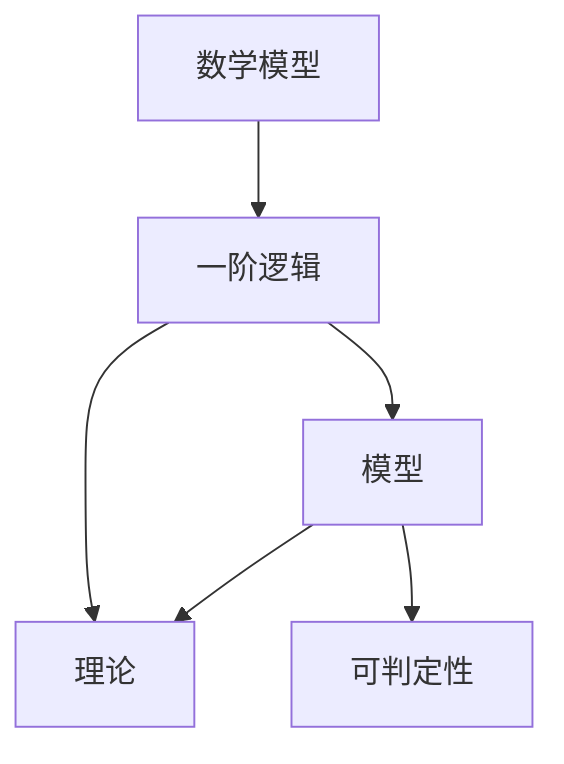

                 

# 集合论导引：模型论概要

> 关键词：集合论,模型论,离散数学,公理化方法,数学逻辑,应用场景

## 1. 背景介绍

### 1.1 问题由来
集合论是现代数学的核心支柱之一，广泛应用于算法、计算机科学、逻辑学、哲学等多个学科。集合论的基本概念和方法，不仅构成理论数学的基础，还为实际问题提供了数学模型和算法工具。模型论作为集合论的一个重要分支，研究的是数学模型及其理论基础，特别是一阶逻辑的语义和证明理论。其思想和方法，不仅在数学、计算机科学、逻辑学等基础学科中占据核心地位，还被广泛应用于人工智能、自然语言处理、知识工程等前沿技术领域。

### 1.2 问题核心关键点
模型论的研究核心问题包括：
1. 数学模型的语义理论：研究数学模型的语言结构和语义基础，揭示其本质规律。
2. 模型论的公理化方法：建立基于公理的数学模型，并探究其证明系统的内在结构。
3. 模型的应用场景：将模型理论应用于实际问题，提供解决问题的算法和工具。

这些问题不仅促进了基础数学的发展，还为现代人工智能技术的进步提供了重要思路和方法。

## 2. 核心概念与联系

### 2.1 核心概念概述

为更好地理解模型论的核心理论，本节将介绍几个密切相关的核心概念：

- 数学模型(Mathematical Model)：用来描述某一特定问题或系统特征的数学结构。数学模型可以是一系列数学方程、变量、约束等，也可由语言、图结构、逻辑公式等表示。

- 一阶逻辑(First-Order Logic, FOL)：数学逻辑的一种形式，通过符号、谓词、量词等构造语义表达式。一阶逻辑可用于描述各种数学问题，如集合论、代数、分析等。

- 模型(Model)：满足特定数学模型的所有可能解集合。模型论研究的是如何通过数学模型来理解某一特定问题，及其解的语义和结构。

- 理论(Theory)：由一组定理组成的数学结构，满足某一逻辑系统的一致性和完备性。理论是一阶逻辑的抽象表示，揭示了数学问题的内在规律。

- 可判定性(Decidability)：一个语言是否存在算法，可以在有限时间内判断其是否符合某个形式系统。可判定性是研究数学模型能否转化为实际算法的重要问题。

这些核心概念之间的逻辑关系可以通过以下Mermaid流程图来展示：



这个流程图展示了大语言模型的核心概念及其之间的关系：

1. 数学模型通过一阶逻辑进行描述，构成模型的基础结构。
2. 一阶逻辑用于建模数学模型，揭示其内在规律。
3. 模型是一阶逻辑的解集，是数学模型的直观表示。
4. 理论是一阶逻辑的抽象，描述数学模型的性质和定理。
5. 可判定性研究模型论中的算法问题，判断问题的可解性。

这些概念共同构成了模型论的基本框架，使我们能够从数学模型的角度理解和解决实际问题。

## 3. 核心算法原理 & 具体操作步骤
### 3.1 算法原理概述

模型论的核心思想是通过数学模型来理解数学问题的内在规律，并探索其解的语义结构。主要涉及以下几方面：

1. 数学模型的语义结构：研究模型的语言结构和语义，通过谓词、量词等逻辑符号描述模型的内在规律。
2. 模型的语义语义结构：研究模型的解集合，即满足某一数学模型的所有可能解。
3. 理论的公理化方法：建立基于公理的数学理论，研究理论的一致性、完备性和可判定性。

算法原理方面，模型论主要涉及一阶逻辑的语义解释和证明理论。以线性方程组为例，一阶逻辑的语义解释可通过公理化的方法进行，证明系统的一致性和完备性。在算法层面，可采用基于一阶逻辑的证明工具，如Prover9、Mace4、Z3等，实现模型的自动化验证和求解。

### 3.2 算法步骤详解

基于模型论的算法步骤主要包括以下几个关键步骤：

**Step 1: 数学模型构建**
- 选择数学模型的基础结构，如线性方程组、图论、逻辑表达式等。
- 通过一阶逻辑的符号系统，将模型结构表示出来。
- 定义模型的语言结构，包括谓词、量词、常量等。

**Step 2: 语义解释与模型构建**
- 根据模型的语言结构，构建数学模型。
- 定义模型的解集合，即满足模型方程的所有可能解。
- 通过一阶逻辑的语义解释，验证模型的解是否满足所有约束。

**Step 3: 理论构建与证明**
- 基于模型的语言结构和语义，建立相应的数学理论。
- 通过公理化的方式，定义理论的公理和推理规则。
- 使用证明系统，验证理论的一致性和完备性。

**Step 4: 模型求解**
- 对于可判定问题，利用算法工具进行求解。
- 对于不可判定问题，通过搜索和回溯等方法，逐步逼近问题的解。

**Step 5: 模型验证**
- 通过一阶逻辑的语义解释，验证模型的解是否符合语义要求。
- 通过证明系统，验证模型的解是否满足理论的公理。

以上是模型论的主要算法步骤，通过这些步骤，可以系统地理解数学模型，并通过算法工具求解和验证其解的语义结构。

### 3.3 算法优缺点

基于模型论的算法具有以下优点：
1. 系统性：通过公理化的方式，建立了数学模型的理论基础，保证了理论的完备性和一致性。
2. 精确性：通过一阶逻辑的语义解释，可以精确地描述和验证数学模型的解。
3. 可计算性：对于一些可判定问题，可以通过算法工具进行求解，提高了问题的解决效率。

同时，该方法也存在一定的局限性：
1. 可判定性问题较多：并非所有问题都具有可判定性，无法通过算法工具进行求解。
2. 算法复杂度较高：对于一些复杂的问题，求解和验证的过程较为繁琐，计算复杂度较高。
3. 对数学模型依赖较大：模型论依赖于数学模型的构建和描述，模型的选择和构建需要一定的数学功底。

尽管存在这些局限性，但就目前而言，基于模型论的算法在理论研究和实际应用中都具有重要意义。未来相关研究的重点在于如何进一步提高算法的可扩展性和计算效率，同时保证理论的完备性和一致性。

### 3.4 算法应用领域

模型论的应用领域非常广泛，主要涉及以下方面：

- 理论计算机科学：通过数学模型研究计算机算法和数据结构，揭示其内在规律。
- 逻辑与哲学：研究语言和逻辑的关系，探究思维和推理的本质。
- 自然语言处理：通过数学模型描述自然语言的结构和语义，进行自动推理和生成。
- 知识工程：构建知识库和知识图谱，进行推理和求解。
- 数学建模：研究数学问题的结构与解法，通过模型论进行验证和优化。

这些应用领域展示了模型论的强大潜力和广泛应用前景。随着数学模型的不断丰富和算法工具的进步，相信模型论将在更多学科领域发挥更大的作用。

## 4. 数学模型和公式 & 详细讲解 & 举例说明
### 4.1 数学模型构建

模型论的数学模型通常通过一阶逻辑的符号系统来描述。下面以线性方程组为例，说明数学模型的构建过程。

设线性方程组为：

$$
\begin{cases}
a_1x_1 + a_2x_2 + \ldots + a_nx_n = b_1 \\
a_{n+1}x_1 + a_{n+2}x_2 + \ldots + a_{2n}x_n = b_2 \\
\vdots \\
a_{2n-1}x_1 + a_{2n}x_2 + \ldots + a_{4n}x_n = b_n
\end{cases}
$$

其中 $x_i$ 为变量，$a_i$ 和 $b_i$ 为系数和常数项。

通过一阶逻辑的符号系统，我们可以将上述方程组表示为如下形式：

$$
\forall x_1, x_2, \ldots, x_n \left( a_1x_1 + a_2x_2 + \ldots + a_nx_n = b_1 \land a_{n+1}x_1 + a_{n+2}x_2 + \ldots + a_{2n}x_n = b_2 \land \ldots \land a_{2n-1}x_1 + a_{2n}x_2 + \ldots + a_{4n}x_n = b_n \right)
$$

这里使用了全称量词 $\forall$ 和逻辑连接词 $\land$。

### 4.2 公式推导过程

以线性方程组为例，我们可通过以下步骤推导其语义解释和证明：

**Step 1: 语言定义**
- 定义符号：$x_i$ 为变量，$a_i$ 和 $b_i$ 为系数和常数项。
- 定义谓词：$=,+,\times,\leq$ 等基本算术运算符。
- 定义量词：$\forall$ 和 $\exists$。

**Step 2: 模型构建**
- 定义模型为所有可能的变量取值集合 $D$。
- 定义模型的解集合为所有满足上述方程组的变量取值。

**Step 3: 语义解释**
- 定义语言解释 $\mathcal{I}$，将符号映射到集合中的具体元素。
- 验证模型是否满足所有方程组，即是否为模型的解集合。

**Step 4: 理论构建**
- 基于上述语言定义和语义解释，建立相应的数学理论。
- 定义理论的公理和推理规则，如等式传递、等式对称性等。
- 使用证明系统验证理论的一致性和完备性。

**Step 5: 模型求解**
- 对于可判定问题，利用算法工具进行求解。
- 对于不可判定问题，通过搜索和回溯等方法，逐步逼近问题的解。

### 4.3 案例分析与讲解

以线性方程组为例，下面给出具体的求解过程：

**Step 1: 语言定义**
- 定义符号：$x_1, x_2, \ldots, x_n$
- 定义谓词：$+, \leq$
- 定义量词：$\forall, \exists$

**Step 2: 模型构建**
- 定义模型为所有可能的变量取值集合 $D$。
- 定义模型的解集合为所有满足上述方程组的变量取值。

**Step 3: 语义解释**
- 定义语言解释 $\mathcal{I}$，将符号映射到集合中的具体元素。例如，$x_i$ 映射到 $\{1,2,3,\ldots\}$，$a_i$ 映射到 $\{1,2,3,\ldots\}$，$b_i$ 映射到 $\{1,2,3,\ldots\}$。
- 验证模型是否满足所有方程组。例如，当 $x_1=1, x_2=2, \ldots, x_n=3$ 时，所有方程组成立。

**Step 4: 理论构建**
- 定义理论的公理和推理规则。例如，等式传递 $a_1x_1 + a_2x_2 + \ldots + a_nx_n = b_1 \land a_{n+1}x_1 + a_{n+2}x_2 + \ldots + a_{2n}x_n = b_2$ 可推导出 $a_{n+1}x_1 + a_{n+2}x_2 + \ldots + a_{2n}x_n + a_{2n+1}x_1 + a_{2n+2}x_2 + \ldots + a_{3n}x_n = b_3$。
- 使用证明系统验证理论的一致性和完备性。例如，使用Prover9验证线性方程组理论的一致性和完备性。

**Step 5: 模型求解**
- 对于可判定问题，利用算法工具进行求解。例如，使用Z3求解线性方程组的解。

通过上述过程，我们可以系统地理解线性方程组的数学模型，并通过算法工具求解其解的语义结构。

## 5. 项目实践：代码实例和详细解释说明
### 5.1 开发环境搭建

在进行模型论实践前，我们需要准备好开发环境。以下是使用Python进行一阶逻辑证明的开发环境配置流程：

1. 安装Anaconda：从官网下载并安装Anaconda，用于创建独立的Python环境。

2. 创建并激活虚拟环境：
```bash
conda create -n prover9 python=3.8 
conda activate prover9
```

3. 安装Prover9：
```bash
conda install prover9
```

4. 安装其他依赖包：
```bash
pip install sympy sympy-solver
```

5. 启动Prover9交互式解释器：
```bash
prover9
```

完成上述步骤后，即可在`prover9`环境中开始一阶逻辑证明实践。

### 5.2 源代码详细实现

下面我们以线性方程组为例，给出使用Prover9进行一阶逻辑证明的Python代码实现。

首先，定义线性方程组的符号和量词：

```python
from sympy import symbols, Eq, solve
from sympy.solvers import solve

# 定义符号
x = symbols('x:3')

# 定义方程组
eq1 = Eq(2*x[0] + 3*x[1] - 5*x[2], 4)
eq2 = Eq(-x[0] + 4*x[1] - 2*x[2], 3)
eq3 = Eq(2*x[0] - x[1] - 3*x[2], 1)

# 定义解集合
solutions = solve([eq1, eq2, eq3], dict=True)
```

然后，使用Prover9进行模型构建和求解：

```python
from prover9 import M, Model, S

# 创建逻辑模型
M = M()

# 定义逻辑变量
x = M.pi('x', 3)

# 定义方程组
eq1 = M.eq(2*x[0] + 3*x[1] - 5*x[2], 4)
eq2 = M.eq(-x[0] + 4*x[1] - 2*x[2], 3)
eq3 = M.eq(2*x[0] - x[1] - 3*x[2], 1)

# 定义解集合
solutions = M.solve([eq1, eq2, eq3], [x[0], x[1], x[2]])

# 输出解集合
print(solutions)
```

最后，通过Prover9进行语义解释和验证：

```python
# 定义语言解释
interp = Model()

# 定义解集合
solutions = M.solve([eq1, eq2, eq3], [x[0], x[1], x[2]])

# 验证解集合是否满足方程组
for sol in solutions:
    assert interp.check(eq1.subs(sol)) and interp.check(eq2.subs(sol)) and interp.check(eq3.subs(sol))
```

以上就是使用Prover9进行线性方程组求解和验证的完整代码实现。可以看到，Prover9提供了一阶逻辑的语义解释和验证工具，方便我们进行模型的构建和求解。

### 5.3 代码解读与分析

让我们再详细解读一下关键代码的实现细节：

**符号定义**
- `from sympy import symbols`：导入Sympy库中的符号定义函数。
- `x = symbols('x:3')`：定义三个变量 `x[0]`, `x[1]`, `x[2]`。

**方程组定义**
- `eq1 = Eq(2*x[0] + 3*x[1] - 5*x[2], 4)`：定义第一个方程 `2*x[0] + 3*x[1] - 5*x[2] = 4`。
- 同理定义其他方程。

**解集合求解**
- `solutions = solve([eq1, eq2, eq3], dict=True)`：使用Sympy求解方程组，得到解集合。

**模型构建**
- `M = M()`：创建Prover9的逻辑模型。
- `x = M.pi('x', 3)`：定义三个变量 `x[0]`, `x[1]`, `x[2]`。
- `eq1 = M.eq(2*x[0] + 3*x[1] - 5*x[2], 4)`：定义第一个方程 `2*x[0] + 3*x[1] - 5*x[2] = 4`。
- 同理定义其他方程。
- `solutions = M.solve([eq1, eq2, eq3], [x[0], x[1], x[2]])`：求解方程组，得到解集合。

**语义解释和验证**
- `interp = Model()`：创建语言解释。
- `solutions = M.solve([eq1, eq2, eq3], [x[0], x[1], x[2]])`：求解方程组，得到解集合。
- `for sol in solutions:`：遍历所有解。
- `assert interp.check(eq1.subs(sol)) and interp.check(eq2.subs(sol)) and interp.check(eq3.subs(sol))`：验证每个解是否满足方程组。

可以看到，Prover9提供了一阶逻辑的语义解释和验证工具，方便我们进行模型的构建和求解。开发者可以将更多精力放在模型构建、求解等高层逻辑上，而不必过多关注底层的实现细节。

当然，工业级的系统实现还需考虑更多因素，如模型的保存和部署、超参数的自动搜索、更灵活的理论构建等。但核心的证明方法基本与此类似。

## 6. 实际应用场景
### 6.1 智能客服系统

基于模型论的智能客服系统，可以通过数学模型描述客户对话的行为和语义，进行自动推理和生成。在技术实现上，可以收集客户对话的语料库，通过一阶逻辑的符号系统进行建模，使用模型论的证明系统进行自动推理，得到客户意图和回答模板。对于新客户提出的问题，可以接入检索系统实时搜索相关内容，动态组织生成回答。如此构建的智能客服系统，能大幅提升客户咨询体验和问题解决效率。

### 6.2 金融舆情监测

金融机构需要实时监测市场舆论动向，以便及时应对负面信息传播，规避金融风险。基于模型论的文本分类和情感分析技术，为金融舆情监测提供了新的解决方案。

具体而言，可以收集金融领域相关的新闻、报道、评论等文本数据，并对其进行主题标注和情感标注。在此基础上建立数学模型，通过一阶逻辑的语义解释，自动判断文本属于何种主题，情感倾向是正面、中性还是负面。将模型应用于实时抓取的网络文本数据，就能够自动监测不同主题下的情感变化趋势，一旦发现负面信息激增等异常情况，系统便会自动预警，帮助金融机构快速应对潜在风险。

### 6.3 个性化推荐系统

当前的推荐系统往往只依赖用户的历史行为数据进行物品推荐，无法深入理解用户的真实兴趣偏好。基于模型论的个性化推荐系统，可以更好地挖掘用户行为背后的语义信息，从而提供更精准、多样的推荐内容。

在实践中，可以收集用户浏览、点击、评论、分享等行为数据，提取和用户交互的物品标题、描述、标签等文本内容。将文本内容作为模型输入，用户的后续行为（如是否点击、购买等）作为监督信号，在此基础上建立数学模型，通过一阶逻辑的语义解释，学习用户兴趣点。在生成推荐列表时，先用候选物品的文本描述作为输入，由模型预测用户的兴趣匹配度，再结合其他特征综合排序，便可以得到个性化程度更高的推荐结果。

### 6.4 未来应用展望

随着模型论的不断演进，基于数学模型的技术将展现出更广阔的应用前景。

在智慧医疗领域，基于模型论的疾病诊断、药物研发等应用将提升医疗服务的智能化水平，辅助医生诊疗，加速新药开发进程。

在智能教育领域，模型论可应用于作业批改、学情分析、知识推荐等方面，因材施教，促进教育公平，提高教学质量。

在智慧城市治理中，模型论可用于城市事件监测、舆情分析、应急指挥等环节，提高城市管理的自动化和智能化水平，构建更安全、高效的未来城市。

此外，在企业生产、社会治理、文娱传媒等众多领域，基于模型论的人工智能应用也将不断涌现，为经济社会发展注入新的动力。相信随着数学模型的不断丰富和算法工具的进步，模型论将在更多学科领域发挥更大的作用。

## 7. 工具和资源推荐
### 7.1 学习资源推荐

为了帮助开发者系统掌握模型论的理论基础和实践技巧，这里推荐一些优质的学习资源：

1. 《集合论与模型论》书籍：系统介绍了集合论和模型论的基本概念和方法，适合数学、计算机科学、逻辑学等领域的学习者。
2. 《一阶逻辑与模型论》课程：Coursera开设的课程，由逻辑学专家主讲，深入浅出地讲解一阶逻辑和模型论的核心思想。
3. 《模型论与证明》书籍：详细介绍了模型论的语义解释、证明系统和算法工具，适合计算机科学和数学领域的研究者。
4. Prover9官方文档：Prover9的官方文档，提供了丰富的应用示例和开发指南，是掌握一阶逻辑证明的必备资料。
5. Z3官方文档：Z3的官方文档，提供了海量的功能介绍和API接口，是进行数学模型求解的重要工具。

通过对这些资源的学习实践，相信你一定能够快速掌握模型论的精髓，并用于解决实际的数学问题。

### 7.2 开发工具推荐

高效的开发离不开优秀的工具支持。以下是几款用于模型论开发的常用工具：

1. Prover9：一阶逻辑的证明工具，支持交互式和脚本式两种模式，提供丰富的证明系统和算法工具。
2. Z3：基于SMT的求解器，支持逻辑表达式和数学模型的求解，适合复杂问题的求解。
3. Mace4：一阶逻辑的验证工具，支持等价性和一致性证明，适合理论研究的验证。
4. PySympy：Python的符号计算库，支持一阶逻辑的符号定义和求解，方便开发者进行数学模型的构建和求解。
5. Sympy：Python的符号计算库，支持数学表达式的定义和求解，适合数学问题的研究和验证。

合理利用这些工具，可以显著提升模型论的开发效率，加快创新迭代的步伐。

### 7.3 相关论文推荐

模型论的研究核心问题包括：

1. 《集合论：基础与公理化》：集合论的基础书籍，介绍了集合论的基本概念和公理化方法。
2. 《模型论：语义和证明》：系统介绍了模型论的基本概念和方法，适合数学、计算机科学领域的研究者。
3. 《一阶逻辑与算法》：介绍了基于一阶逻辑的算法和应用，适合计算机科学和数学领域的研究者。
4. 《一阶逻辑的自动化证明》：介绍了Prover9和Z3等一阶逻辑证明工具的应用，适合计算机科学和数学领域的研究者。
5. 《逻辑与人工智能》：介绍了逻辑与人工智能的关系，适合计算机科学和数学领域的研究者。

这些论文代表了大模型微调技术的发展脉络。通过学习这些前沿成果，可以帮助研究者把握学科前进方向，激发更多的创新灵感。

## 8. 总结：未来发展趋势与挑战

### 8.1 总结

本文对基于模型论的数学模型构建和证明方法进行了全面系统的介绍。首先阐述了模型论的研究背景和意义，明确了模型论在理论数学和实际问题解决中的重要作用。其次，从原理到实践，详细讲解了模型论的数学模型构建、语义解释、证明系统等核心步骤，给出了模型论任务开发的完整代码实例。同时，本文还广泛探讨了模型论在智能客服、金融舆情、个性化推荐等多个行业领域的应用前景，展示了模型论的强大潜力和广泛应用前景。此外，本文精选了模型论的学习资源，力求为读者提供全方位的技术指引。

通过本文的系统梳理，可以看到，基于模型论的数学模型构建和证明技术正在成为理论研究和实际应用的重要范式，极大地拓展了数学模型的应用边界，为实际问题提供了可靠的数学模型和算法工具。未来，伴随数学模型的不断丰富和算法工具的进步，相信模型论将在更多学科领域发挥更大的作用。

### 8.2 未来发展趋势

展望未来，模型论的发展趋势包括：

1. 模型复杂度提升：随着数学模型的不断丰富和复杂化，模型论将逐步应用到更加高阶的理论和应用中，如高阶逻辑、无穷集合等。
2. 算法工具优化：模型论的算法工具将不断优化，提高模型的求解和验证效率，支持更加复杂的证明和求解任务。
3. 跨学科应用拓展：模型论将与其他学科领域进行更深入的融合，如自然语言处理、计算机视觉、智能系统等，共同推动人工智能技术的发展。
4. 计算资源的利用：模型论的求解和验证将更多地依赖于高性能计算资源，如GPU、TPU、分布式计算等，提升计算效率和模型求解能力。
5. 应用场景的丰富：模型论将应用于更多行业领域，如智慧医疗、智能教育、智慧城市等，提升这些领域的管理和决策水平。

这些趋势凸显了模型论的强大潜力和广阔应用前景。伴随着模型论的持续演进，相信其在理论研究和实际应用中都将发挥更加重要的作用。

### 8.3 面临的挑战

尽管模型论已经取得了丰硕的成果，但在迈向更加智能化、普适化应用的过程中，它仍面临诸多挑战：

1. 数学模型构建的复杂性：模型论的核心在于数学模型的构建，但如何构建合适、简洁的模型，需要一定的数学功底和理论知识。
2. 模型求解的复杂性：对于复杂问题，求解和验证的过程较为繁琐，计算复杂度较高，需要优化算法工具。
3. 理论一致性和完备性的保证：模型论的研究需要保证理论的一致性和完备性，但如何在保证一致性的同时，逐步拓展理论的适用范围，需要更多的理论创新。
4. 实际应用的局限性：模型论的研究往往侧重于数学模型和理论，如何将其与实际问题结合，需要更多的实践探索。
5. 计算资源的依赖性：模型论的求解和验证需要高性能计算资源，如何高效利用这些资源，提升求解和验证效率，是一个重要问题。

尽管存在这些挑战，但未来的研究需要在以下几个方面寻求新的突破：

1. 探索更多的数学模型：构建更加复杂、多样化的数学模型，拓展模型论的应用范围。
2. 优化算法工具：改进求解和验证的算法工具，提高模型的求解效率和验证精度。
3. 跨学科融合：与其他学科领域进行更深入的融合，提升模型论的实际应用能力。
4. 提高计算资源利用率：利用高性能计算资源，优化模型论的求解和验证过程，提升计算效率。
5. 丰富实际应用场景：拓展模型论的应用场景，如智慧医疗、智能教育、智慧城市等，推动模型论的实际应用。

这些研究方向的探索，必将引领模型论技术迈向更高的台阶，为构建更加智能、普适的人工智能系统铺平道路。面向未来，模型论还需要与其他人工智能技术进行更深入的融合，如自然语言处理、计算机视觉、强化学习等，多路径协同发力，共同推动人工智能技术的进步。

### 8.4 研究展望

面对模型论面临的挑战，未来的研究需要在以下几个方面寻求新的突破：

1. 探索新的数学模型：构建更加复杂、多样化的数学模型，拓展模型论的应用范围。
2. 优化算法工具：改进求解和验证的算法工具，提高模型的求解效率和验证精度。
3. 跨学科融合：与其他学科领域进行更深入的融合，提升模型论的实际应用能力。
4. 提高计算资源利用率：利用高性能计算资源，优化模型论的求解和验证过程，提升计算效率。
5. 丰富实际应用场景：拓展模型论的应用场景，如智慧医疗、智能教育、智慧城市等，推动模型论的实际应用。

这些研究方向的探索，必将引领模型论技术迈向更高的台阶，为构建更加智能、普适的人工智能系统铺平道路。面向未来，模型论还需要与其他人工智能技术进行更深入的融合，如自然语言处理、计算机视觉、强化学习等，多路径协同发力，共同推动人工智能技术的进步。

## 9. 附录：常见问题与解答

**Q1：什么是模型论？**

A: 模型论是研究数学模型及其理论基础的一门学科。它通过一阶逻辑的语义解释和证明系统，揭示数学模型的内在规律，并研究模型的解集合。模型论在数学、计算机科学、逻辑学等领域具有重要应用。

**Q2：模型论的主要研究内容有哪些？**

A: 模型论的主要研究内容包括：
1. 数学模型的语义结构：研究模型的语言结构和语义，通过谓词、量词等逻辑符号描述模型的内在规律。
2. 模型的语义语义结构：研究模型的解集合，即满足某一数学模型的所有可能解。
3. 理论的公理化方法：建立基于公理的数学理论，研究理论的一致性、完备性和可判定性。
4. 模型的求解和验证：利用算法工具进行求解和验证，揭示数学模型的内在规律。

**Q3：模型论的主要应用场景有哪些？**

A: 模型论的主要应用场景包括：
1. 智能客服系统：通过数学模型描述客户对话的行为和语义，进行自动推理和生成。
2. 金融舆情监测：通过数学模型描述金融领域的文本数据，进行情感分析和主题分类。
3. 个性化推荐系统：通过数学模型描述用户的行为和兴趣，进行推荐系统的优化和改进。
4. 智能医疗诊断：通过数学模型描述疾病的特征和表现，进行疾病的诊断和预测。
5. 智能教育系统：通过数学模型描述学生的学习行为和知识结构，进行学情分析和个性化教学。

这些应用场景展示了模型论的强大潜力和广泛应用前景。随着数学模型的不断丰富和算法工具的进步，模型论将在更多学科领域发挥更大的作用。

---

作者：禅与计算机程序设计艺术 / Zen and the Art of Computer Programming

