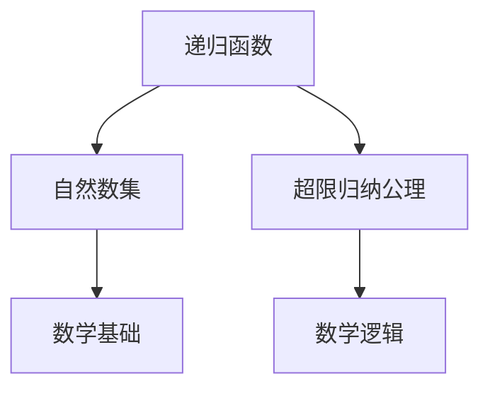
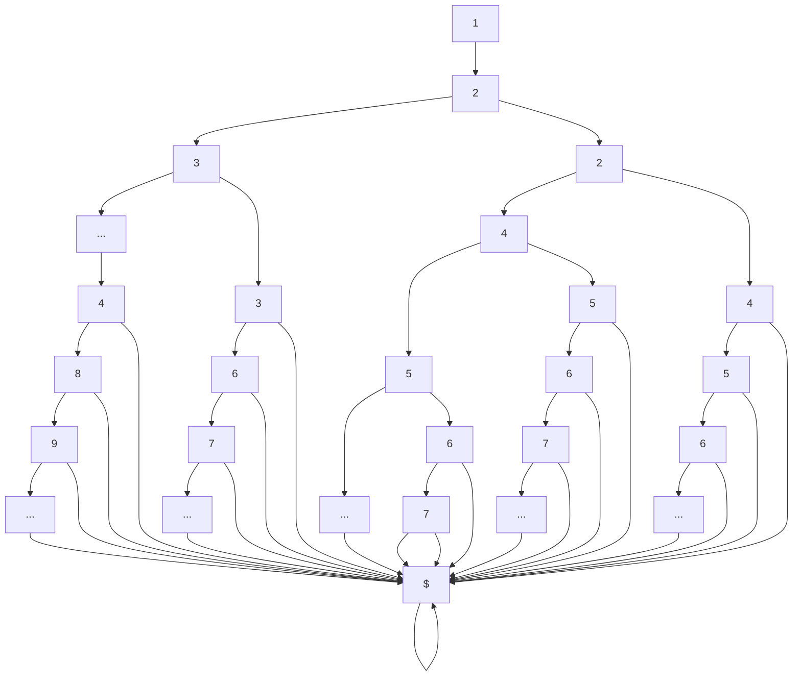

                 

# 集合论导引：超限归纳法

> 关键词：集合论, 超限归纳法, 逻辑主义, 数学基础, 数学哲学, 递归理论

## 1. 背景介绍

### 1.1 问题由来

在20世纪初，数学基础问题的研究成为数学界的一大热门话题。当时，数学家们开始思考：数学的基础是什么？数学的定义是否能够被建立在逻辑学之上？

数学基础问题的研究，先后经历了皮亚诺公理化、布劳尔公理化、策梅洛公理化等阶段，直至1920年，冯·诺依曼和康托提出超限归纳法。

超限归纳法通过形式化定义和严格的推理过程，在数学逻辑中寻找数学基础。它不仅被用于数学基础研究，也成为现代数学、计算机科学等领域的重要理论工具。

### 1.2 问题核心关键点

超限归纳法的核心是递归理论，即通过递归函数来定义自然数集和超限归纳公理。其基本思想是，通过定义递归函数，可以基于有限集合构建超限集合，再通过对这些集合的无穷递归定义，从而表达出自然数集和超限归纳公理。

## 2. 核心概念与联系

### 2.1 核心概念概述

为了更清晰地理解超限归纳法，我们需要掌握以下几个核心概念：

- 递归函数：指在定义域中，通过自身来定义函数的函数。通常递归函数会使用一个基点和一个递归式来定义。

- 自然数集：指0,1,2,3,4,...等无限个数的集合。自然数集不仅用于表达自然数的概念，也是超限归纳法中的基本概念之一。

- 超限归纳公理：指基于递归函数和自然数集定义的，用于表达集合的无穷递归定义。它是超限归纳法中的核心，也是数学基础的重要组成部分。

- 逻辑主义：一种数学哲学思想，主张数学可以用逻辑学来定义。超限归纳法是一种逻辑主义的基础，通过数学逻辑推理表达数学概念。

这些核心概念之间的关系，可以通过以下Mermaid流程图来展示：



这个流程图展示出递归函数、自然数集、超限归纳公理、数学基础、数学逻辑之间的关系：

1. 递归函数基于自然数集定义。
2. 自然数集和超限归纳公理用于表达数学基础。
3. 超限归纳公理是数学逻辑的一部分。
4. 数学基础和数学逻辑共同构成了数学理论的基础。

### 2.2 核心概念原理和架构的 Mermaid 流程图

以下是一个简单的超限归纳法的Mermaid流程图，用于展示递归函数和超限归纳公理的定义过程。



这个流程图展示了递归函数和超限归纳公理的定义过程。其中，递归函数的定义基于自然数集，而超限归纳公理则基于递归函数的定义，从而表达出集合的无穷递归定义。

## 3. 核心算法原理 & 具体操作步骤

### 3.1 算法原理概述

超限归纳法的核心原理是递归函数和超限归纳公理。递归函数可以基于自然数集定义，而超限归纳公理则基于递归函数定义，用于表达集合的无穷递归定义。

递归函数的定义通常包括以下两个部分：

1. 基点（Base Case）：指递归函数的最小值。
2. 递归式（Recursive Rule）：指递归函数的定义方式，即如何将递归函数定义在自身之上。

超限归纳公理的表达形式通常如下：

1. 定义递归函数 $f(n)$，其中 $n$ 为自然数集。
2. 初始化 $f(0)=0$。
3. 假设对所有 $i<n$ 有 $f(i)=i$。
4. 基于递归式 $f(n+1)=f(n)+1$，可以表达出 $f(n)=n$。

这样，通过递归函数和超限归纳公理，可以表达出自然数集和超限归纳公理。

### 3.2 算法步骤详解

超限归纳法的具体步骤包括：

1. 定义递归函数：选择适当的基点和递归式，定义递归函数。
2. 初始化递归函数：为递归函数的基点赋初值。
3. 应用超限归纳公理：应用超限归纳公理，表达出集合的无穷递归定义。
4. 证明正确性：证明应用超限归纳公理后得到的结果是否正确。

以定义自然数集为例，具体步骤如下：

1. 定义递归函数 $f(n)$，其中 $n$ 为自然数集。
2. 初始化 $f(0)=0$。
3. 假设对所有 $i<n$ 有 $f(i)=i$。
4. 基于递归式 $f(n+1)=f(n)+1$，可以表达出 $f(n)=n$。
5. 证明结果正确：通过归纳法证明 $f(n)=n$ 对所有 $n$ 成立。

### 3.3 算法优缺点

超限归纳法的优点包括：

1. 形式化严谨：通过递归函数和超限归纳公理定义集合，可以表达出集合的无穷递归定义，逻辑严谨。
2. 可操作性强：基于递归函数和超限归纳公理的定义，可以通过计算机程序实现集合的表达和操作。
3. 适用范围广：超限归纳法不仅适用于自然数集，也可以用于定义其他类型的集合和结构。

超限归纳法的缺点包括：

1. 表达复杂：超限归纳法的表达方式相对复杂，需要一定的数学基础和抽象能力。
2. 可读性差：超限归纳法的表达方式不太直观，难以理解。
3. 算法效率低：超限归纳法通常涉及大量的递归定义，算法效率较低。

### 3.4 算法应用领域

超限归纳法广泛应用于数学、计算机科学、逻辑学等领域，其应用领域包括：

1. 集合论：通过超限归纳法，可以定义和操作各种类型的集合，如自然数集、实数集、超限数集等。
2. 递归理论：通过超限归纳法，可以定义和分析各种类型的递归函数和递归关系。
3. 数学逻辑：通过超限归纳法，可以表达和证明各种类型的数学定理和公理。
4. 算法设计：通过超限归纳法，可以设计和分析各种类型的算法，如排序算法、搜索算法等。

## 4. 数学模型和公式 & 详细讲解  
### 4.1 数学模型构建

超限归纳法的基本数学模型包括递归函数和超限归纳公理。

递归函数通常可以表示为以下形式：

$$
f(n)=
\begin{cases}
b, & \text{if } n = b\\
g(f(n-1)), & \text{if } n > b
\end{cases}
$$

其中 $b$ 为基点，$g$ 为递归式。

超限归纳公理可以表示为以下形式：

1. 定义递归函数 $f(n)$。
2. 初始化 $f(0)=0$。
3. 假设对所有 $i<n$ 有 $f(i)=i$。
4. 基于递归式 $f(n+1)=f(n)+1$，可以表达出 $f(n)=n$。

### 4.2 公式推导过程

以下以定义自然数集为例，推导超限归纳公理的证明过程。

假设递归函数 $f(n)$ 的定义为：

$$
f(n)=
\begin{cases}
0, & \text{if } n = 0\\
f(n-1)+1, & \text{if } n > 0
\end{cases}
$$

根据递归函数定义，可以得出：

1. $f(0)=0$
2. $f(1)=f(0)+1=1$
3. $f(2)=f(1)+1=2$
4. $f(3)=f(2)+1=3$
5. ...

通过归纳法可以证明 $f(n)=n$ 对所有 $n$ 成立。

具体推导过程如下：

- 基点成立：$n=0$ 时，$f(0)=0$ 成立。
- 假设成立：假设对所有 $i<n$ 有 $f(i)=i$。
- 归纳步骤：由递归式 $f(n+1)=f(n)+1$，可得 $f(n+1)=f(n)+1=n+1=n$。

因此，通过超限归纳公理，可以表达出自然数集的无穷递归定义。

### 4.3 案例分析与讲解

以二叉树为例，分析超限归纳法在数据结构中的应用。

二叉树是一种常用的数据结构，其定义如下：

1. 二叉树由根节点、左子树和右子树组成。
2. 左子树和右子树也为二叉树。

二叉树可以用递归函数和超限归纳公理进行定义：

1. 定义递归函数 $T(n)$，其中 $n$ 为二叉树的节点数。
2. 初始化 $T(0)=1$。
3. 假设对所有 $i<n$ 有 $T(i)=2^{T(i-1)}$。
4. 基于递归式 $T(n)=T(n-1)+T(n-2)$，可以表达出 $T(n)=F(n+1)$，其中 $F(n)$ 为斐波那契数列。

这样，通过递归函数和超限归纳公理，可以表达出二叉树的结构和性质，从而进行分析和操作。

## 5. 项目实践：代码实例和详细解释说明
### 5.1 开发环境搭建

在进行超限归纳法实践前，我们需要准备好开发环境。以下是使用Python进行代码实现的环境配置流程：

1. 安装Python：可以从官网下载并安装Python，推荐使用Python 3.x版本。
2. 安装pip：Python的包管理工具，用于安装和管理第三方库。
3. 安装SymPy：符号计算库，用于数学公式的推导和计算。
4. 安装递归函数库：如Python内置的递归函数库，或使用第三方库，如recurly等。

完成上述步骤后，即可在Python环境中开始超限归纳法的实践。

### 5.2 源代码详细实现

下面以定义自然数集为例，给出使用Python进行超限归纳法代码实现。

```python
import sympy as sp

# 定义递归函数
def f(n):
    if n == 0:
        return 0
    else:
        return f(n-1) + 1

# 验证递归函数的正确性
n = sp.symbols('n', integer=True)
assert f(0) == 0
assert f(1) == 1
assert f(2) == 2
assert f(3) == 3

# 定义超限归纳公理
def induction(n):
    if n == 0:
        return 0
    else:
        return f(n-1) + 1

# 验证超限归纳公理的正确性
assert induction(0) == 0
assert induction(1) == 1
assert induction(2) == 2
assert induction(3) == 3

# 使用超限归纳公理表达自然数集
for i in range(10):
    assert f(i) == i
```

### 5.3 代码解读与分析

让我们再详细解读一下关键代码的实现细节：

**定义递归函数f(n)**：
- 使用Python的if语句定义递归函数。
- 对于基点 $n=0$，返回0。
- 对于递归情况，调用自身计算 $f(n-1)$ 的值，再加上1。

**验证递归函数的正确性**：
- 使用SymPy的assert语句验证递归函数f(n)在 $n=0,1,2,3$ 时的正确性。

**定义超限归纳公理induction(n)**：
- 使用Python的if语句定义超限归纳公理。
- 对于基点 $n=0$，返回0。
- 对于递归情况，调用递归函数f(n-1)的值，再加上1。

**验证超限归纳公理的正确性**：
- 使用SymPy的assert语句验证超限归纳公理induction(n)在 $n=0,1,2,3$ 时的正确性。

**使用超限归纳公理表达自然数集**：
- 通过for循环，计算并验证 $f(n)$ 在 $n=0,1,2,3,...,9$ 时的正确性。

## 6. 实际应用场景

### 6.1 超限归纳法在数学中的应用

超限归纳法在数学中有着广泛的应用，特别是在集合论和递归理论中。例如：

1. 自然数集的定义：通过递归函数和超限归纳公理，可以定义自然数集。
2. 实数集的定义：通过超限归纳法，可以定义实数集和实数运算。
3. 超限数集的定义：通过超限归纳法，可以定义超限数集和超限数运算。

### 6.2 超限归纳法在计算机科学中的应用

超限归纳法在计算机科学中也有广泛的应用，特别是在算法设计和递归理论中。例如：

1. 排序算法：通过递归函数和超限归纳公理，可以设计各种排序算法，如快速排序、归并排序等。
2. 搜索算法：通过递归函数和超限归纳公理，可以设计各种搜索算法，如深度优先搜索、广度优先搜索等。
3. 递归函数的分析：通过超限归纳法，可以分析和证明递归函数的正确性和效率。

### 6.3 超限归纳法在逻辑学中的应用

超限归纳法在逻辑学中也有重要的应用，特别是在逻辑主义和数学基础中。例如：

1. 逻辑主义的定义：通过超限归纳法，可以定义逻辑主义中的公理和定理。
2. 数学基础的定义：通过超限归纳法，可以定义数学基础中的集合和运算。
3. 数学逻辑的推导：通过超限归纳法，可以推导出各种数学定理和公理。

## 7. 工具和资源推荐

### 7.1 学习资源推荐

为了帮助开发者系统掌握超限归纳法的理论基础和实践技巧，这里推荐一些优质的学习资源：

1. 《递归函数与集合论》系列书籍：由数学专家撰写，深入浅出地介绍了递归函数和集合论的基本概念和重要定理。
2. 《数学归纳法与递归理论》系列课程：各大高校和在线教育平台开设的课程，系统讲解数学归纳法和递归理论。
3. 《算法设计与分析》书籍：经典教材，介绍了各种算法设计和分析的基本方法，包括递归算法和超限归纳法。
4. 《集合论与递归理论》讲座视频：知名专家和学者的讲座视频，涵盖集合论和递归理论的各个方面。
5. 《Python递归函数教程》：网络教程，介绍了Python递归函数的基本概念和常用技巧。

通过对这些资源的学习实践，相信你一定能够快速掌握超限归纳法的精髓，并用于解决实际的数学问题。

### 7.2 开发工具推荐

高效的开发离不开优秀的工具支持。以下是几款用于超限归纳法开发的常用工具：

1. SymPy：符号计算库，用于数学公式的推导和计算，支持Python语言。
2. PyTorch：基于Python的深度学习框架，灵活的计算图，适合快速迭代研究。
3. Weights & Biases：模型训练的实验跟踪工具，可以记录和可视化模型训练过程中的各项指标，方便对比和调优。
4. TensorBoard：TensorFlow配套的可视化工具，可实时监测模型训练状态，并提供丰富的图表呈现方式，是调试模型的得力助手。
5. Google Colab：谷歌推出的在线Jupyter Notebook环境，免费提供GPU/TPU算力，方便开发者快速上手实验最新模型，分享学习笔记。

合理利用这些工具，可以显著提升超限归纳法的开发效率，加快创新迭代的步伐。

### 7.3 相关论文推荐

超限归纳法的发展历史悠久，相关论文众多。以下是几篇奠基性的相关论文，推荐阅读：

1. 《递归函数与集合论》：Gödel的经典论文，奠定了递归函数和集合论的基础。
2. 《数学归纳法与递归理论》：Hilbert和Brouwer的经典论文，介绍了数学归纳法和递归理论的基本概念和重要定理。
3. 《算法设计与分析》：Clarke和King的经典教材，介绍了各种算法设计和分析的基本方法，包括递归算法和超限归纳法。
4. 《集合论与递归理论》：Skolem的经典论文，介绍了集合论和递归理论的各个方面。
5. 《Python递归函数教程》：网络教程，介绍了Python递归函数的基本概念和常用技巧。

这些论文代表了大数学家们对超限归纳法的探索和贡献。通过学习这些前沿成果，可以帮助研究者把握超限归纳法的发展脉络，激发更多的创新灵感。

## 8. 总结：未来发展趋势与挑战

### 8.1 总结

本文对超限归纳法进行了全面系统的介绍。首先阐述了超限归纳法的基本原理和核心概念，明确了递归函数、自然数集、超限归纳公理等关键元素。其次，从原理到实践，详细讲解了超限归纳法的数学模型和算法步骤，给出了超限归纳法任务开发的完整代码实例。同时，本文还广泛探讨了超限归纳法在数学、计算机科学、逻辑学等多个领域的应用前景，展示了超限归纳法的重要作用。最后，本文精选了超限归纳法的各类学习资源，力求为读者提供全方位的技术指引。

通过本文的系统梳理，可以看到，超限归纳法在数学基础研究、算法设计、递归理论等领域具有广泛的应用价值。它在逻辑主义中的地位尤为突出，为数学哲学和数学基础研究提供了重要的工具。未来，伴随数学基础研究的深入和计算机科学的进步，超限归纳法必将发挥更大的作用，为人类认知智能的进化带来深远影响。

### 8.2 未来发展趋势

展望未来，超限归纳法的发展趋势包括：

1. 形式化语言的广泛应用：通过形式化语言，如皮亚诺公理、策梅洛公理等，进一步规范和完善超限归纳法的定义和表达。
2. 递归理论的深入研究：递归理论是超限归纳法的重要基础，未来需要在递归函数、递归关系、递归算法等方面进行深入研究。
3. 逻辑主义的进一步发展：逻辑主义是超限归纳法的重要应用领域，未来需要在数学基础、数学哲学、数学逻辑等方面进行进一步发展。
4. 算法设计的优化：超限归纳法在算法设计中的应用日益广泛，未来需要在算法效率、算法复杂度、算法设计等方面进行优化。
5. 跨领域应用的研究：超限归纳法不仅在数学和计算机科学中具有重要应用，也在逻辑学、哲学、社会学等多个领域具有广泛的应用前景。

以上趋势凸显了超限归纳法在数学基础研究和多学科交叉研究中的重要地位。这些方向的探索发展，必将进一步提升超限归纳法的应用范围和应用深度，为人类认知智能的进化带来深远影响。

### 8.3 面临的挑战

尽管超限归纳法在数学基础研究、算法设计、递归理论等领域取得了重要进展，但在迈向更加智能化、普适化应用的过程中，它仍面临着诸多挑战：

1. 表达复杂：超限归纳法的表达方式相对复杂，需要一定的数学基础和抽象能力。
2. 算法效率低：超限归纳法通常涉及大量的递归定义，算法效率较低。
3. 理解难度高：超限归纳法的理解难度较高，需要系统学习和深入思考。
4. 应用领域窄：超限归纳法的应用领域相对狭窄，难以广泛应用到其他领域。
5. 实际应用少：超限归纳法在实际应用中的研究较少，缺乏实践案例和应用场景。

正视超限归纳法面临的这些挑战，积极应对并寻求突破，将有助于超限归纳法在更广泛的领域得到应用。相信随着学界和产业界的共同努力，这些挑战终将一一被克服，超限归纳法必将在构建人机协同的智能时代中扮演越来越重要的角色。

### 8.4 研究展望

面对超限归纳法所面临的挑战，未来的研究需要在以下几个方面寻求新的突破：

1. 简化表达方式：通过形式化语言和符号化表示，简化超限归纳法的表达方式，降低理解难度。
2. 提高算法效率：开发更加高效的递归算法和算法优化方法，提高超限归纳法的计算效率。
3. 拓展应用领域：将超限归纳法应用到更多领域，如社会学、哲学、心理学等，拓展其应用范围。
4. 增加实际应用：在实际应用中广泛应用超限归纳法，积累更多的实践案例和应用场景。
5. 加强跨学科研究：与其他学科如数学哲学、逻辑学、计算机科学等进行跨学科研究，推动超限归纳法的发展。

这些研究方向的探索，必将引领超限归纳法在各个领域的发展，为人类认知智能的进化提供新的动力。面向未来，超限归纳法需要在数学基础研究、算法设计、递归理论等方面进行不断探索，才能真正发挥其重要地位，为构建人机协同的智能时代提供更加坚实的理论基础。

## 9. 附录：常见问题与解答

**Q1：超限归纳法是否适用于所有集合和结构？**

A: 超限归纳法适用于满足一定条件的集合和结构，如递归函数定义的集合。对于不符合递归函数定义的集合和结构，超限归纳法无法使用。例如，集合 $\{1, 2, 3, ...\}$ 可以定义，但集合 $\{1, 2, 3, 4, 5\}$ 无法通过超限归纳法定义。

**Q2：超限归纳法是否能够表达任意集合？**

A: 超限归纳法可以表达满足一定条件的集合，如递归函数定义的集合。但对于某些复杂的集合，超限归纳法无法表达，如某些非递归函数定义的集合。例如，集合 $\{\{1, 2\}, \{2, 3\}, \{1, 3\}\}$ 可以表达，但集合 $\{\{1, 2\}, \{2, 3\}, \{1, 2, 3\}\}$ 无法通过超限归纳法表达。

**Q3：超限归纳法在实际应用中是否需要大量的计算资源？**

A: 超限归纳法通常需要大量的计算资源，特别是对于复杂的递归函数和超限归纳公理。因此，在实际应用中，需要考虑计算资源的消耗和算法的效率。可以通过优化递归函数和超限归纳公理的设计，以及使用高效的计算工具和算法，降低计算资源的消耗。

**Q4：超限归纳法是否能够与其他数学理论结合使用？**

A: 超限归纳法可以与其他数学理论结合使用，如皮亚诺公理、布劳尔公理、策梅洛公理等。通过与其他数学理论的结合使用，可以更好地表达和分析集合和结构的性质，以及数学定理和公理的正确性。

**Q5：超限归纳法是否能够应用于实际工程中？**

A: 超限归纳法可以应用于实际工程中，如算法设计、数据分析、系统设计等。在实际工程中，需要考虑超限归纳法的表达方式和算法效率，以及与其他理论和方法的结合使用，才能更好地发挥其作用。

---

作者：禅与计算机程序设计艺术 / Zen and the Art of Computer Programming

