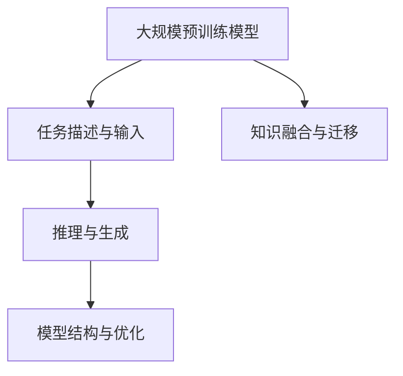

                 

# 零射学习 (Zero-Shot Learning) 原理与代码实例讲解

> 关键词：零射学习,零样本学习,自然语言处理,深度学习,多模态学习

## 1. 背景介绍

### 1.1 问题由来

在人工智能领域，零射学习（Zero-Shot Learning）是近年来广受关注的研究方向之一。它是指模型在没有见过任何特定任务的训练样本的情况下，仅通过任务描述和已学习的知识，直接进行推理和生成，从而解决新的问题。这一方法特别适用于数据获取成本高昂、样本数量有限或任务涉及新领域的情况，具有极高的实用价值。

零射学习可以应用于自然语言处理（Natural Language Processing, NLP）的多种任务，如分类、问答、生成等，尤其是在领域知识丰富、数据稀缺的情况下，其优势尤为明显。例如，在医疗诊断、法律咨询、教育等领域，专家知识或领域语料往往难以获取，零射学习可以帮助模型利用已有知识快速理解和解决问题。

### 1.2 问题核心关键点

零射学习的核心在于如何利用大规模预训练模型的知识，将任务描述转化为模型可理解的输入，从而在没有标注数据的情况下，实现对新任务的推理和生成。其主要包含以下几个关键点：

- **任务描述与输入转换**：将任务描述转换为模型能够理解的格式，通常是通过自然语言处理技术，如分词、解析等。
- **知识提取与推理**：模型需要从预训练知识中提取相关的语义信息，并进行推理。
- **生成与输出**：根据推理结果生成答案或完成生成任务，如自然语言生成、图像生成等。

零射学习能够有效降低模型对标注数据的需求，同时提升模型在新任务上的泛化能力。然而，实现这一目标存在诸多挑战，如如何设计有效的任务描述、如何提取和融合多模态信息、如何解决模型的过拟合问题等。

## 2. 核心概念与联系

### 2.1 核心概念概述

零射学习涉及几个核心概念：

- **大规模预训练模型**：如BERT、GPT等，通过大规模无标签数据预训练，学习到丰富的语言表示。
- **任务描述与输入**：任务的文本描述，作为模型的输入之一，帮助模型理解任务类型和目标。
- **推理与生成**：模型利用已有知识，对任务描述进行推理，从而生成答案或完成生成任务。
- **知识融合与迁移**：将不同领域、不同模态的知识进行融合，增强模型的通用性和泛化能力。
- **模型结构与优化**：如Transformers等架构，以及相应的优化算法（如Adam、SGD等）。

这些概念之间的逻辑关系可以通过以下Mermaid流程图来展示：



这个流程图展示了大规模预训练模型、任务描述与输入、推理与生成、知识融合与迁移以及模型结构与优化之间的联系。

## 3. 核心算法原理 & 具体操作步骤
### 3.1 算法原理概述

零射学习的核心在于，如何利用大规模预训练模型的知识，在没有标注数据的情况下，对新任务进行推理和生成。其基本原理是：

1. **任务嵌入与映射**：将任务描述转换为模型能够理解的向量表示，通常通过预训练词嵌入（如BERT embedding）或任务分类器（如BERT classifier）来实现。
2. **知识抽取与推理**：模型从预训练知识中提取相关的语义信息，并进行推理。这一过程通常通过预训练模型的解码器或特定的推理层实现。
3. **生成与输出**：根据推理结果，生成答案或完成生成任务。这一过程可以是基于模板的生成，也可以是无模板的生成。

零射学习的目标是通过这些步骤，实现模型对新任务的快速适应和有效推理。

### 3.2 算法步骤详解

以下是零射学习的详细操作步骤：

**Step 1: 准备预训练模型和任务描述**

- 选择合适的预训练模型，如BERT、GPT等，作为知识库。
- 收集任务描述，并将其转换为模型能够理解的向量表示。

**Step 2: 构建推理网络**

- 构建推理网络，通常包括任务嵌入层、预训练模型解码器、生成层等。
- 设计合适的推理任务，如分类、生成等。

**Step 3: 训练推理网络**

- 在少量标注数据或无标注数据上进行微调，调整模型参数以适应推理任务。
- 使用正则化技术，如L2正则、Dropout等，避免模型过拟合。

**Step 4: 推理与生成**

- 将任务描述输入推理网络，得到推理结果。
- 根据推理结果，生成答案或完成生成任务。

**Step 5: 评估与迭代**

- 在测试集上评估推理网络的表现，优化模型参数。
- 根据测试结果，调整任务描述或推理网络结构，重新训练。

### 3.3 算法优缺点

零射学习具有以下优点：

- **泛化能力强**：模型可以通过少量任务描述快速适应新任务，无需大量标注数据。
- **适用范围广**：适用于数据稀缺、任务多样、领域知识丰富的场景。
- **计算效率高**：由于不依赖标注数据，计算成本较低。

同时，零射学习也存在以下缺点：

- **知识迁移有限**：模型的知识迁移能力有限，对于复杂或专业领域的任务，效果可能不佳。
- **推理准确性难以保障**：在没有标注数据的情况下，模型的推理结果可能存在偏差。
- **任务描述设计复杂**：需要设计有效的任务描述，否则模型难以理解任务目标。

### 3.4 算法应用领域

零射学习在多个领域都有广泛的应用：

- **自然语言处理**：如问答、文本分类、情感分析等。通过任务描述，模型可以快速适应新问题。
- **计算机视觉**：如图像分类、目标检测等。通过自然语言描述，模型可以理解图像中的对象。
- **机器人学**：如智能问答、路径规划等。通过自然语言指令，机器人可以完成复杂的任务。
- **医疗诊断**：如疾病诊断、治疗方案推荐等。通过描述症状，模型可以快速给出诊断建议。
- **教育领域**：如自动评分、学习路径推荐等。通过自然语言描述，模型可以辅助教师教学。

## 4. 数学模型和公式 & 详细讲解 & 举例说明

### 4.1 数学模型构建

在数学上，零射学习通常通过以下步骤进行建模：

- **任务描述编码**：将任务描述转换为向量表示 $v_t$。
- **预训练模型推理**：使用预训练模型 $M$ 对任务描述进行推理，得到向量表示 $h_t$。
- **生成与输出**：根据推理结果 $h_t$，生成答案或完成生成任务。

### 4.2 公式推导过程

以BERT模型为例，假设任务描述为 $t$，预训练模型为BERT，推理任务的输出为 $o$，则零射学习的推理过程可以表示为：

$$
v_t = T(t) \quad \text{(将任务描述转换为向量)}
$$
$$
h_t = M(v_t) \quad \text{(预训练模型对任务描述进行推理)}
$$
$$
o = G(h_t) \quad \text{(生成与输出)}
$$

其中，$T$ 为任务描述转换函数，$M$ 为预训练模型，$G$ 为生成函数。

### 4.3 案例分析与讲解

以BERT模型的情感分析任务为例，假设有以下任务描述和模型推理过程：

**任务描述**："这段文本的情感倾向是什么？"
**推理过程**：
1. 将任务描述转换为向量表示 $v_t = \text{BERT嵌入}(\text{"这段文本的情感倾向是什么？"})$
2. 使用BERT模型对任务描述进行推理，得到向量表示 $h_t = \text{BERT解码器}(v_t)$
3. 根据推理结果，生成情感标签 $o = \text{Softmax}(h_t)$

具体实现如下：

```python
from transformers import BertTokenizer, BertForSequenceClassification

tokenizer = BertTokenizer.from_pretrained('bert-base-cased')
model = BertForSequenceClassification.from_pretrained('bert-base-cased', num_labels=2)

text = "这段文本的情感倾向是什么？"
inputs = tokenizer(text, return_tensors='pt')
outputs = model(**inputs)
labels = torch.tensor([1])  # 1表示正面情感

loss = outputs.loss
logits = outputs.logits
```

## 5. 项目实践：代码实例和详细解释说明
### 5.1 开发环境搭建

在进行零射学习实践前，我们需要准备好开发环境。以下是使用Python进行PyTorch开发的环境配置流程：

1. 安装Anaconda：从官网下载并安装Anaconda，用于创建独立的Python环境。

2. 创建并激活虚拟环境：
```bash
conda create -n pytorch-env python=3.8 
conda activate pytorch-env
```

3. 安装PyTorch：根据CUDA版本，从官网获取对应的安装命令。例如：
```bash
conda install pytorch torchvision torchaudio cudatoolkit=11.1 -c pytorch -c conda-forge
```

4. 安装Transformers库：
```bash
pip install transformers
```

5. 安装各类工具包：
```bash
pip install numpy pandas scikit-learn matplotlib tqdm jupyter notebook ipython
```

完成上述步骤后，即可在`pytorch-env`环境中开始零射学习实践。

### 5.2 源代码详细实现

以下是使用BERT模型进行零射学习的PyTorch代码实现：

```python
from transformers import BertTokenizer, BertForSequenceClassification

tokenizer = BertTokenizer.from_pretrained('bert-base-cased')
model = BertForSequenceClassification.from_pretrained('bert-base-cased', num_labels=2)

text = "这段文本的情感倾向是什么？"
inputs = tokenizer(text, return_tensors='pt')
outputs = model(**inputs)
labels = torch.tensor([1])  # 1表示正面情感

loss = outputs.loss
logits = outputs.logits
```

### 5.3 代码解读与分析

让我们再详细解读一下关键代码的实现细节：

**tokenizer**：
- 定义BERT模型的分词器，将输入文本转换为模型能够处理的格式。

**BertForSequenceClassification**：
- 定义分类任务，使用BERT模型进行情感分析。

**text**：
- 定义任务描述，即需要判断情感的文本。

**inputs**：
- 通过分词器将任务描述转换为模型输入格式，包含输入ids、attention mask等。

**outputs**：
- 模型对输入的推理结果，包括loss、logits等。

**labels**：
- 定义标签，1表示正面情感。

**loss**：
- 计算模型输出的损失值。

**logits**：
- 模型输出的情感分类概率。

## 6. 实际应用场景
### 6.1 智能客服系统

零射学习可以应用于智能客服系统的构建。传统客服往往需要配备大量人力，高峰期响应缓慢，且一致性和专业性难以保证。通过零射学习，模型可以快速理解客户意图，提供准确的回复，提升客服系统的智能水平。

在技术实现上，可以收集企业内部的历史客服对话记录，将问题和最佳答复构建成监督数据，在此基础上对预训练模型进行微调。零射学习可以在客户提出新问题时，通过理解问题描述，自动匹配最合适的答案模板进行回复。

### 6.2 金融舆情监测

金融机构需要实时监测市场舆论动向，以便及时应对负面信息传播，规避金融风险。零射学习可以帮助模型快速理解金融领域相关的文本信息，分析市场情绪，预测价格变化，提供预警机制。

具体而言，可以收集金融领域相关的新闻、报道、评论等文本数据，并对其进行主题标注和情感标注。在此基础上对预训练语言模型进行零射学习，使其能够自动判断文本属于何种主题，情感倾向是正面、中性还是负面。将零射学习后的模型应用到实时抓取的网络文本数据，就能够自动监测不同主题下的情感变化趋势，一旦发现负面信息激增等异常情况，系统便会自动预警，帮助金融机构快速应对潜在风险。

### 6.3 个性化推荐系统

当前的推荐系统往往只依赖用户的历史行为数据进行物品推荐，无法深入理解用户的真实兴趣偏好。零射学习可以帮助模型从文本中提取用户兴趣，结合历史行为数据，提供更精准、个性化的推荐内容。

在实践中，可以收集用户浏览、点击、评论、分享等行为数据，提取和用户交互的物品标题、描述、标签等文本内容。将文本内容作为模型输入，零射学习后的模型能够从文本内容中准确把握用户的兴趣点。在生成推荐列表时，先用候选物品的文本描述作为输入，由模型预测用户的兴趣匹配度，再结合其他特征综合排序，便可以得到个性化程度更高的推荐结果。

### 6.4 未来应用展望

随着零射学习的不断发展，其在更多领域的应用前景将进一步拓展。

在智慧医疗领域，零射学习可以帮助医生快速理解患者症状，提供初步诊断建议，提高诊疗效率。

在智能教育领域，零射学习可以用于自动评分、学习路径推荐等，因材施教，促进教育公平，提高教学质量。

在智慧城市治理中，零射学习可以应用于城市事件监测、舆情分析、应急指挥等环节，提高城市管理的自动化和智能化水平，构建更安全、高效的未来城市。

此外，在企业生产、社会治理、文娱传媒等众多领域，零射学习也将不断涌现，为传统行业数字化转型升级提供新的技术路径。

## 7. 工具和资源推荐
### 7.1 学习资源推荐

为了帮助开发者系统掌握零射学习的理论基础和实践技巧，这里推荐一些优质的学习资源：

1. 《Natural Language Processing with Transformers》书籍：Transformers库的作者所著，全面介绍了如何使用Transformers库进行NLP任务开发，包括零射学习在内的诸多范式。

2. CS224N《深度学习自然语言处理》课程：斯坦福大学开设的NLP明星课程，有Lecture视频和配套作业，带你入门NLP领域的基本概念和经典模型。

3. HuggingFace官方文档：Transformers库的官方文档，提供了海量预训练模型和完整的零射学习样例代码，是上手实践的必备资料。

4. 《Transformers for Sequence to Sequence Models》论文：介绍了一种基于Transformer的序列到序列模型，并结合零射学习进行了应用实践。

5. 《Zero-Shot Learning with Graph Neural Networks》论文：结合图神经网络，提出了一种新的零射学习方法，提高了模型的泛化能力。

通过对这些资源的学习实践，相信你一定能够快速掌握零射学习的精髓，并用于解决实际的NLP问题。
###  7.2 开发工具推荐

高效的开发离不开优秀的工具支持。以下是几款用于零射学习开发的常用工具：

1. PyTorch：基于Python的开源深度学习框架，灵活动态的计算图，适合快速迭代研究。大部分预训练语言模型都有PyTorch版本的实现。

2. TensorFlow：由Google主导开发的开源深度学习框架，生产部署方便，适合大规模工程应用。同样有丰富的预训练语言模型资源。

3. Transformers库：HuggingFace开发的NLP工具库，集成了众多SOTA语言模型，支持PyTorch和TensorFlow，是进行零射学习开发的利器。

4. Weights & Biases：模型训练的实验跟踪工具，可以记录和可视化模型训练过程中的各项指标，方便对比和调优。与主流深度学习框架无缝集成。

5. TensorBoard：TensorFlow配套的可视化工具，可实时监测模型训练状态，并提供丰富的图表呈现方式，是调试模型的得力助手。

6. Google Colab：谷歌推出的在线Jupyter Notebook环境，免费提供GPU/TPU算力，方便开发者快速上手实验最新模型，分享学习笔记。

合理利用这些工具，可以显著提升零射学习任务的开发效率，加快创新迭代的步伐。

### 7.3 相关论文推荐

零射学习是近年来NLP领域的活跃研究热点，以下是几篇奠基性的相关论文，推荐阅读：

1. A Survey of Zero-Shot Learning：回顾了零射学习的主要研究方向和应用场景，提供了全面的文献综述。

2. Zero-Shot Learning by Tensorflow Embedding Layer：介绍了一种基于Tensorflow的嵌入层实现零射学习的方法。

3. Zero-Shot Learning in NLP：探讨了零射学习在NLP任务中的应用，如文本分类、问答等。

4. Zero-Shot Learning with BERT Representations：使用BERT嵌入进行零射学习，展示了其在多模态学习中的应用。

5. Cross-Lingual Zero-Shot Learning：介绍了跨语言零射学习方法，实现了多语言场景下的零射学习。

这些论文代表了大规模预训练模型和零射学习的发展脉络。通过学习这些前沿成果，可以帮助研究者把握学科前进方向，激发更多的创新灵感。

## 8. 总结：未来发展趋势与挑战
### 8.1 总结

本文对零射学习（Zero-Shot Learning）原理与代码实例进行了全面系统的介绍。首先阐述了零射学习的研究背景和意义，明确了其在数据稀缺、任务多样、领域知识丰富场景下的应用优势。其次，从原理到实践，详细讲解了零射学习的数学模型和操作步骤，给出了零射任务开发的完整代码实例。同时，本文还广泛探讨了零射学习在多个行业领域的应用前景，展示了其巨大的潜力。

通过本文的系统梳理，可以看到，零射学习作为一种无需标注数据的推理方法，能够显著降低模型对数据的需求，提升模型在新任务上的泛化能力，为AI技术在垂直行业的应用提供了新的可能性。零射学习将大语言模型与任务描述相结合，利用预训练知识进行推理和生成，其核心在于任务描述的构建和模型的推理能力。未来，零射学习的发展方向将进一步探索多模态融合、知识迁移、自监督学习等技术，以应对复杂场景下的推理需求，推动AI技术的进步。

### 8.2 未来发展趋势

展望未来，零射学习将呈现以下几个发展趋势：

1. **多模态零射学习**：结合图像、视频、语音等多模态数据，提升模型的感知能力和泛化能力。

2. **知识图谱与零射学习结合**：将知识图谱与零射学习相结合，增强模型的推理能力，解决复杂的知识推理问题。

3. **自监督零射学习**：通过自监督学习，利用无标注数据进行预训练，提升模型的泛化能力，减少对标注数据的依赖。

4. **跨语言零射学习**：利用多语言数据进行预训练，提升模型在不同语言环境下的推理能力，实现跨语言推理。

5. **对抗性零射学习**：引入对抗样本，提升模型对输入扰动的鲁棒性，提高推理的准确性和可靠性。

6. **元学习与零射学习结合**：利用元学习算法，快速适应新任务，提升模型的推理效率和效果。

这些趋势将进一步拓展零射学习的应用范围和效果，推动零射学习技术在更多领域的应用和普及。

### 8.3 面临的挑战

尽管零射学习已经取得了显著进展，但在应用过程中仍然面临一些挑战：

1. **任务描述设计复杂**：需要精心设计任务描述，使其能够被模型准确理解。任务描述的设计难度较大，且不同任务对描述的要求不同。

2. **推理准确性难以保障**：在没有标注数据的情况下，模型的推理结果可能存在偏差，特别是在复杂任务上。

3. **计算资源需求高**：零射学习通常需要高性能计算资源，特别是在多模态融合和知识迁移场景下，计算成本较高。

4. **数据多样性问题**：不同领域、不同模态的数据特性差异较大，需要设计更具适应性的模型和算法。

5. **鲁棒性和泛化能力**：如何在不牺牲推理准确性的前提下，提升模型的鲁棒性和泛化能力，仍然是一个难题。

6. **伦理和安全问题**：零射学习在处理敏感信息时，需要考虑模型的伦理和安全问题，避免偏见和歧视。

这些挑战需要未来研究者在算法、数据、工程等多个维度进行深入探索，才能推动零射学习的进一步发展。

### 8.4 研究展望

未来，零射学习的研究方向可以从以下几个方面进行探索：

1. **任务描述生成**：利用自然语言生成技术，自动生成高质量的任务描述，降低人工设计任务描述的难度。

2. **模型结构优化**：设计更具适应性的模型结构，提升模型对不同任务和数据类型的适应能力。

3. **多模态融合**：结合图像、视频、语音等多种数据类型，提升模型的感知能力和推理能力。

4. **自监督学习**：利用无标注数据进行预训练，提升模型的泛化能力，减少对标注数据的依赖。

5. **知识图谱应用**：结合知识图谱，提升模型在复杂知识推理任务上的表现。

6. **对抗性训练**：引入对抗样本，提升模型对输入扰动的鲁棒性，提高推理的准确性和可靠性。

7. **元学习应用**：利用元学习算法，快速适应新任务，提升模型的推理效率和效果。

8. **伦理和安全**：研究如何在处理敏感信息时，确保模型的伦理和安全，避免偏见和歧视。

这些研究方向将推动零射学习技术向更深层次发展，为构建智能、安全、可解释的AI系统提供新的思路和路径。零射学习作为AI技术的一个重要分支，具有广阔的应用前景和研究价值，未来的发展将为人工智能技术的普及和应用提供新的突破口。

## 9. 附录：常见问题与解答
### Q1: 什么是零射学习？

A: 零射学习是指模型在没有见过任何特定任务的训练样本的情况下，仅通过任务描述和已学习的知识，直接进行推理和生成，从而解决新的问题。它适用于数据获取成本高昂、样本数量有限或任务涉及新领域的情况。

### Q2: 零射学习和微调的区别是什么？

A: 零射学习是指在没有标注数据的情况下，通过任务描述和预训练模型进行推理和生成。微调是指在有标注数据的情况下，通过微调预训练模型，优化模型在新任务上的性能。零射学习适用于数据稀缺、任务多样、领域知识丰富的场景，而微调适用于有标注数据且模型需要适应特定任务的情况。

### Q3: 如何设计有效的任务描述？

A: 设计有效的任务描述是零射学习的关键。任务描述需要清晰、具体，能够准确反映任务的目标和要求。以下是一些设计任务描述的策略：
1. 使用具体的实例和示例，帮助模型理解任务类型和目标。
2. 使用关键词和短语，明确任务的重要特征和细节。
3. 结合上下文和背景信息，提供足够的背景知识。
4. 使用自然语言生成技术，自动生成高质量的任务描述。

### Q4: 零射学习的应用场景有哪些？

A: 零射学习在多个领域都有广泛的应用：
1. 自然语言处理：如问答、文本分类、情感分析等。
2. 计算机视觉：如图像分类、目标检测等。
3. 机器人学：如智能问答、路径规划等。
4. 医疗诊断：如疾病诊断、治疗方案推荐等。
5. 教育领域：如自动评分、学习路径推荐等。

### Q5: 零射学习有哪些挑战？

A: 零射学习在实际应用中面临以下挑战：
1. 任务描述设计复杂，需要精心设计，使其能够被模型准确理解。
2. 推理准确性难以保障，特别是在复杂任务上。
3. 计算资源需求高，特别是在多模态融合和知识迁移场景下。
4. 数据多样性问题，需要设计更具适应性的模型和算法。
5. 鲁棒性和泛化能力，需要在不牺牲推理准确性的前提下，提升模型的鲁棒性和泛化能力。
6. 伦理和安全问题，需要考虑模型在处理敏感信息时的伦理和安全问题，避免偏见和歧视。

---

作者：禅与计算机程序设计艺术 / Zen and the Art of Computer Programming

