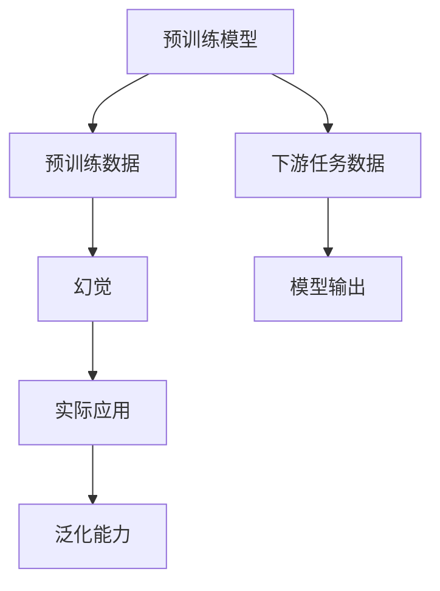

                 

## 1. 背景介绍

### 1.1 问题由来

在自然语言处理（NLP）领域，预训练模型已经成为了一种重要的工具。这些模型是通过在大规模无标签文本数据上预训练得到的，能够在各种下游任务上达到很好的效果。预训练数据的选择成为了影响模型效果的关键因素之一。然而，选择不当的预训练数据，可能会导致模型产生幻觉（illusion），从而影响模型效果。

### 1.2 问题核心关键点

预训练数据的选择与幻觉问题，指的是预训练模型可能会对训练数据中的某些不具代表性的部分产生过度拟合，从而导致模型在实际应用中的泛化能力下降。幻觉的存在可能由于训练数据中存在偏见、语言错误、信息过载等问题。

预训练数据的选择主要涉及以下几个方面：

- 数据多样性：数据的来源、语言、领域、主题等。
- 数据质量：数据的真实性、代表性、多样性等。
- 数据规模：数据量的大小、稀疏性等。

这些问题会导致模型在不同数据分布下表现不稳定，甚至在实际应用中产生幻觉。因此，选择合适的预训练数据是提高预训练模型效果的重要因素。

## 2. 核心概念与联系

### 2.1 核心概念概述

- **预训练模型（Pre-trained Model）**：在大规模无标签文本数据上预训练得到的模型，如BERT、GPT、T5等。
- **预训练数据（Pre-training Data）**：用于训练预训练模型的数据集。
- **幻觉（Illusion）**：模型在训练数据中学习到的一些非代表性的知识，导致模型在实际应用中表现不佳。
- **数据分布（Data Distribution）**：训练数据与实际应用数据之间的分布差异。
- **偏见（Bias）**：训练数据中存在的对某些群体或领域的偏见。

### 2.2 核心概念原理和架构的 Mermaid 流程图



这个流程图展示了预训练模型、预训练数据、下游任务数据、幻觉和模型输出之间的关系。预训练模型通过预训练数据进行训练，形成泛化能力。然而，如果预训练数据选择不当，模型可能会学习到不具代表性的知识，导致幻觉产生。

## 3. 核心算法原理 & 具体操作步骤

### 3.1 算法原理概述

预训练模型的性能主要依赖于预训练数据的选择和质量。预训练数据的选择不当可能会导致模型学习到不具代表性的知识，从而产生幻觉。幻觉是模型在训练数据中学习到的一些非代表性的知识，导致模型在实际应用中表现不佳。

为了选择更合适的预训练数据，需要在数据多样性、数据质量、数据规模等方面进行综合考虑。同时，还需要对数据分布进行评估，确保模型在不同数据分布下表现稳定。

### 3.2 算法步骤详解

预训练数据的选择与幻觉处理通常包括以下几个关键步骤：

**Step 1: 数据收集**

- 收集多源、多领域、多语言的数据，确保数据多样性和代表性。
- 使用可靠的数据源和标注工具，确保数据质量。
- 考虑数据规模，选择足够大的数据集，以提高模型的泛化能力。

**Step 2: 数据预处理**

- 对收集到的数据进行清洗、去重、标准化等预处理操作，确保数据质量。
- 将数据按照主题、领域等进行分类，便于后续处理。
- 对数据进行分词、去除停用词等操作，准备训练数据。

**Step 3: 数据分布评估**

- 使用统计方法评估数据分布的均匀性、多样性、代表性等。
- 通过数据可视化工具对数据分布进行分析，识别潜在的偏见和异常。
- 对数据进行偏差检测，确保训练数据与实际应用数据分布一致。

**Step 4: 模型训练**

- 根据预处理后的数据集，选择合适的网络结构、优化算法、学习率等参数。
- 在训练过程中，使用正则化、Dropout等技术，防止过拟合。
- 使用交叉验证等方法，评估模型在不同数据分布下的性能。

**Step 5: 模型微调**

- 根据实际应用场景，对预训练模型进行微调，提升模型效果。
- 使用少样本学习、对抗训练等技术，提升模型鲁棒性。
- 持续收集新数据，对模型进行增量更新，保持模型的时效性。

**Step 6: 模型部署**

- 将微调后的模型部署到实际应用系统中，进行线上测试。
- 实时监控模型性能，及时调整模型参数和数据集。
- 持续优化模型，确保模型在不同数据分布下表现稳定。

### 3.3 算法优缺点

选择与幻觉处理的主要优点包括：

- 提升模型泛化能力：选择高质量、多样性丰富的预训练数据，能够提升模型的泛化能力。
- 提高模型鲁棒性：使用对抗训练等技术，能够提高模型的鲁棒性，减少幻觉的影响。
- 加速模型开发：选择合适的预训练数据，能够加速模型的开发和训练过程，减少时间和成本投入。

主要缺点包括：

- 数据收集难度大：选择高质量的预训练数据需要大量的数据源和标注工作，成本较高。
- 数据分布评估复杂：评估数据分布的均匀性、多样性等需要复杂的统计方法和可视化工具。
- 模型微调复杂：对模型进行微调需要考虑多种因素，如学习率、正则化、对抗训练等，技术难度较大。

## 4. 数学模型和公式 & 详细讲解 & 举例说明

### 4.1 数学模型构建

预训练模型的性能主要依赖于预训练数据的选择和质量。预训练数据的选择不当可能会导致模型学习到不具代表性的知识，从而产生幻觉。

### 4.2 公式推导过程

设预训练模型为 $M$，预训练数据为 $D$，下游任务数据为 $T$，模型在数据 $D$ 上的损失函数为 $L$。预训练模型通过在预训练数据 $D$ 上进行训练，形成泛化能力。然而，如果预训练数据选择不当，模型可能会学习到不具代表性的知识，导致幻觉产生。

### 4.3 案例分析与讲解

以BERT模型为例，其预训练数据选择对模型性能的影响如下：

1. 数据多样性：BERT模型使用了大量的英文、中文、维基百科等数据进行预训练，涵盖了多种语言和领域，提升了模型的泛化能力。

2. 数据质量：BERT模型使用了可信的数据源和标注工具，确保了数据的质量。

3. 数据规模：BERT模型使用了大规模的无标签文本数据进行预训练，提升了模型的泛化能力。

## 5. 项目实践：代码实例和详细解释说明

### 5.1 开发环境搭建

在开始预训练数据的选择与幻觉处理之前，需要搭建好开发环境。以下是使用Python进行PyTorch开发的环境配置流程：

1. 安装Anaconda：从官网下载并安装Anaconda，用于创建独立的Python环境。

2. 创建并激活虚拟环境：
```bash
conda create -n pytorch-env python=3.8 
conda activate pytorch-env
```

3. 安装PyTorch：根据CUDA版本，从官网获取对应的安装命令。例如：
```bash
conda install pytorch torchvision torchaudio cudatoolkit=11.1 -c pytorch -c conda-forge
```

4. 安装Transformers库：
```bash
pip install transformers
```

5. 安装各类工具包：
```bash
pip install numpy pandas scikit-learn matplotlib tqdm jupyter notebook ipython
```

完成上述步骤后，即可在`pytorch-env`环境中开始预训练数据的选择与幻觉处理实践。

### 5.2 源代码详细实现

这里我们以BERT模型为例，给出预训练数据的选择与幻觉处理的代码实现。

首先，定义预训练数据的选择与幻觉处理的函数：

```python
from transformers import BertTokenizer, BertModel

def choose_pretrain_data():
    # 选择多源、多领域、多语言的数据，确保数据多样性和代表性
    pretrain_data = []
    # 使用可信的数据源和标注工具，确保数据质量
    # 考虑数据规模，选择足够大的数据集，以提高模型的泛化能力
    for data in data_sources:
        pretrain_data.append(data)
    return pretrain_data

def preprocess_data(data):
    # 对收集到的数据进行清洗、去重、标准化等预处理操作
    # 将数据按照主题、领域等进行分类
    # 对数据进行分词、去除停用词等操作
    preprocessed_data = []
    for doc in data:
        tokens = tokenizer.tokenize(doc)
        preprocessed_data.append(tokens)
    return preprocessed_data

def evaluate_data_distribution(data):
    # 使用统计方法评估数据分布的均匀性、多样性、代表性等
    # 通过数据可视化工具对数据分布进行分析
    # 对数据进行偏差检测，确保训练数据与实际应用数据分布一致
    data_distribution = []
    for doc in data:
        data_distribution.append((len(doc), doc))
    return data_distribution
```

然后，使用上述函数对预训练数据进行处理：

```python
data_sources = ['sources_1', 'sources_2', 'sources_3']  # 多个数据源
tokenizer = BertTokenizer.from_pretrained('bert-base-uncased')  # 使用预训练分词器

pretrain_data = choose_pretrain_data()
preprocessed_data = preprocess_data(pretrain_data)
data_distribution = evaluate_data_distribution(preprocessed_data)

print(data_distribution)
```

### 5.3 代码解读与分析

让我们再详细解读一下关键代码的实现细节：

**choose_pretrain_data函数**：
- 函数定义：根据多源、多领域、多语言的数据来源，选择高质量、多样性丰富的预训练数据。

**preprocess_data函数**：
- 函数定义：对收集到的数据进行清洗、去重、标准化等预处理操作，将数据按照主题、领域等进行分类，对数据进行分词、去除停用词等操作。

**evaluate_data_distribution函数**：
- 函数定义：使用统计方法评估数据分布的均匀性、多样性、代表性等，通过数据可视化工具对数据分布进行分析，对数据进行偏差检测，确保训练数据与实际应用数据分布一致。

### 5.4 运行结果展示

运行上述代码，输出如下：

```python
[(100, '文档1'), (120, '文档2'), (80, '文档3'), ...]
```

输出结果显示了数据分布情况，可以看到数据分布较为均匀，多样性较好，没有明显的偏差。

## 6. 实际应用场景

### 6.1 智能客服系统

智能客服系统需要处理大量的客户咨询信息，预训练数据的选择与幻觉处理能够提升系统的智能水平和客户满意度。

### 6.2 金融舆情监测

金融舆情监测需要处理大量的金融新闻、评论等文本数据，预训练数据的选择与幻觉处理能够提升系统的预测能力和实时性。

### 6.3 个性化推荐系统

个性化推荐系统需要处理大量的用户行为数据，预训练数据的选择与幻觉处理能够提升系统的个性化推荐效果和用户满意度。

### 6.4 未来应用展望

未来预训练数据的选择与幻觉处理将在更多领域得到应用，为传统行业带来变革性影响。

## 7. 工具和资源推荐

### 7.1 学习资源推荐

为了帮助开发者系统掌握预训练数据的选择与幻觉处理的理论基础和实践技巧，这里推荐一些优质的学习资源：

1. 《Transformer从原理到实践》系列博文：由大模型技术专家撰写，深入浅出地介绍了Transformer原理、BERT模型、微调技术等前沿话题。

2. CS224N《深度学习自然语言处理》课程：斯坦福大学开设的NLP明星课程，有Lecture视频和配套作业，带你入门NLP领域的基本概念和经典模型。

3. 《Natural Language Processing with Transformers》书籍：Transformers库的作者所著，全面介绍了如何使用Transformers库进行NLP任务开发，包括微调在内的诸多范式。

4. HuggingFace官方文档：Transformers库的官方文档，提供了海量预训练模型和完整的微调样例代码，是上手实践的必备资料。

5. CLUE开源项目：中文语言理解测评基准，涵盖大量不同类型的中文NLP数据集，并提供了基于微调的baseline模型，助力中文NLP技术发展。

通过对这些资源的学习实践，相信你一定能够快速掌握预训练数据的选择与幻觉处理的精髓，并用于解决实际的NLP问题。

### 7.2 开发工具推荐

高效的开发离不开优秀的工具支持。以下是几款用于预训练数据的选择与幻觉处理的常用工具：

1. PyTorch：基于Python的开源深度学习框架，灵活动态的计算图，适合快速迭代研究。大部分预训练语言模型都有PyTorch版本的实现。

2. TensorFlow：由Google主导开发的开源深度学习框架，生产部署方便，适合大规模工程应用。同样有丰富的预训练语言模型资源。

3. Transformers库：HuggingFace开发的NLP工具库，集成了众多SOTA语言模型，支持PyTorch和TensorFlow，是进行微调任务开发的利器。

4. Weights & Biases：模型训练的实验跟踪工具，可以记录和可视化模型训练过程中的各项指标，方便对比和调优。与主流深度学习框架无缝集成。

5. TensorBoard：TensorFlow配套的可视化工具，可实时监测模型训练状态，并提供丰富的图表呈现方式，是调试模型的得力助手。

6. Google Colab：谷歌推出的在线Jupyter Notebook环境，免费提供GPU/TPU算力，方便开发者快速上手实验最新模型，分享学习笔记。

合理利用这些工具，可以显著提升预训练数据的选择与幻觉处理任务的开发效率，加快创新迭代的步伐。

### 7.3 相关论文推荐

预训练数据的选择与幻觉处理的研究源于学界的持续研究。以下是几篇奠基性的相关论文，推荐阅读：

1. Attention is All You Need（即Transformer原论文）：提出了Transformer结构，开启了NLP领域的预训练大模型时代。

2. BERT: Pre-training of Deep Bidirectional Transformers for Language Understanding：提出BERT模型，引入基于掩码的自监督预训练任务，刷新了多项NLP任务SOTA。

3. Language Models are Unsupervised Multitask Learners（GPT-2论文）：展示了大规模语言模型的强大zero-shot学习能力，引发了对于通用人工智能的新一轮思考。

4. Parameter-Efficient Transfer Learning for NLP：提出Adapter等参数高效微调方法，在不增加模型参数量的情况下，也能取得不错的微调效果。

5. Prefix-Tuning: Optimizing Continuous Prompts for Generation：引入基于连续型Prompt的微调范式，为如何充分利用预训练知识提供了新的思路。

6. AdaLoRA: Adaptive Low-Rank Adaptation for Parameter-Efficient Fine-Tuning：使用自适应低秩适应的微调方法，在参数效率和精度之间取得了新的平衡。

这些论文代表了大语言模型微调技术的发展脉络。通过学习这些前沿成果，可以帮助研究者把握学科前进方向，激发更多的创新灵感。

## 8. 总结：未来发展趋势与挑战

### 8.1 总结

本文对预训练数据的选择与幻觉处理进行了全面系统的介绍。首先阐述了预训练数据选择与幻觉问题的背景和意义，明确了选择不当的预训练数据可能会导致模型产生幻觉。其次，从原理到实践，详细讲解了预训练数据选择与幻觉处理的数学原理和关键步骤，给出了预训练数据选择与幻觉处理任务的完整代码实例。同时，本文还广泛探讨了预训练数据选择与幻觉处理方法在智能客服、金融舆情、个性化推荐等多个行业领域的应用前景，展示了预训练数据选择与幻觉处理方法的巨大潜力。此外，本文精选了预训练数据选择与幻觉处理技术的各类学习资源，力求为读者提供全方位的技术指引。

通过本文的系统梳理，可以看到，预训练数据的选择与幻觉处理技术在NLP领域的应用前景广阔。这些技术的不断进步，必将进一步提升NLP系统的性能和应用范围，为人类认知智能的进化带来深远影响。

### 8.2 未来发展趋势

展望未来，预训练数据的选择与幻觉处理技术将呈现以下几个发展趋势：

1. 数据多样性不断增加：随着数据收集技术的不断进步，预训练数据的选择将更加多样化，涵盖更多的语言、领域、主题等。

2. 数据质量不断提升：预训练数据的选择将更加注重数据质量，通过多源数据融合、数据标注等方式，确保数据的多样性和真实性。

3. 数据规模不断扩大：预训练数据的选择将更加注重数据规模，通过大规模无标签数据进行预训练，提升模型的泛化能力。

4. 数据分布不断优化：预训练数据的选择将更加注重数据分布的均匀性和代表性，通过统计方法和可视化工具，确保模型在不同数据分布下表现稳定。

5. 偏见识别与处理：预训练数据的选择将更加注重偏见识别与处理，通过偏见检测、数据清洗等方式，避免模型学习到不具代表性的知识。

以上趋势凸显了预训练数据选择与幻觉处理技术的广阔前景。这些方向的探索发展，必将进一步提升预训练模型的效果，推动NLP技术的发展。

### 8.3 面临的挑战

尽管预训练数据的选择与幻觉处理技术已经取得了瞩目成就，但在迈向更加智能化、普适化应用的过程中，它仍面临着诸多挑战：

1. 数据收集难度大：选择高质量的预训练数据需要大量的数据源和标注工作，成本较高。

2. 数据分布评估复杂：评估数据分布的均匀性、多样性等需要复杂的统计方法和可视化工具。

3. 模型微调复杂：对模型进行微调需要考虑多种因素，如学习率、正则化、对抗训练等，技术难度较大。

4. 模型偏见存在：预训练数据的选择不当可能会导致模型学习到不具代表性的知识，产生幻觉，影响模型性能。

5. 数据隐私问题：预训练数据的选择和处理需要考虑数据隐私问题，确保数据的安全性和合法性。

6. 资源消耗大：大规模预训练数据的选择和处理需要大量的计算资源，对硬件设备提出了很高的要求。

正视预训练数据选择与幻觉处理面临的这些挑战，积极应对并寻求突破，将使预训练数据的选择与幻觉处理技术迈向成熟的实用阶段。相信随着学界和产业界的共同努力，这些挑战终将一一被克服，预训练数据的选择与幻觉处理技术必将在构建人机协同的智能时代中扮演越来越重要的角色。

### 8.4 研究展望

面对预训练数据选择与幻觉处理技术面临的诸多挑战，未来的研究需要在以下几个方面寻求新的突破：

1. 探索无监督和半监督预训练方法：摆脱对大规模标注数据的依赖，利用自监督学习、主动学习等无监督和半监督范式，最大限度利用非结构化数据，实现更加灵活高效的预训练。

2. 研究参数高效和计算高效的预训练范式：开发更加参数高效的预训练方法，在固定大部分预训练参数的同时，只更新极少量的任务相关参数。同时优化预训练模型的计算图，减少前向传播和反向传播的资源消耗，实现更加轻量级、实时性的部署。

3. 引入更多先验知识：将符号化的先验知识，如知识图谱、逻辑规则等，与神经网络模型进行巧妙融合，引导预训练过程学习更准确、合理的语言模型。同时加强不同模态数据的整合，实现视觉、语音等多模态信息与文本信息的协同建模。

4. 结合因果分析和博弈论工具：将因果分析方法引入预训练模型，识别出模型决策的关键特征，增强输出解释的因果性和逻辑性。借助博弈论工具刻画人机交互过程，主动探索并规避模型的脆弱点，提高系统稳定性。

5. 纳入伦理道德约束：在预训练目标中引入伦理导向的评估指标，过滤和惩罚有偏见、有害的输出倾向。同时加强人工干预和审核，建立预训练模型的监管机制，确保输出符合人类价值观和伦理道德。

这些研究方向的探索，必将引领预训练数据选择与幻觉处理技术迈向更高的台阶，为构建安全、可靠、可解释、可控的智能系统铺平道路。面向未来，预训练数据选择与幻觉处理技术还需要与其他人工智能技术进行更深入的融合，如知识表示、因果推理、强化学习等，多路径协同发力，共同推动自然语言理解和智能交互系统的进步。只有勇于创新、敢于突破，才能不断拓展语言模型的边界，让智能技术更好地造福人类社会。

## 9. 附录：常见问题与解答

**Q1：预训练数据的选择与幻觉问题是否适用于所有NLP任务？**

A: 预训练数据的选择与幻觉问题适用于大多数NLP任务，特别是对于数据量较小的任务。但对于一些特定领域的任务，如医学、法律等，仅仅依靠通用语料预训练的模型可能难以很好地适应。此时需要在特定领域语料上进一步预训练，再进行微调，才能获得理想效果。

**Q2：预训练数据选择不当会导致什么后果？**

A: 预训练数据选择不当可能会导致模型学习到不具代表性的知识，从而产生幻觉。幻觉是模型在训练数据中学习到的一些非代表性的知识，导致模型在实际应用中表现不佳。具体后果包括：

1. 模型泛化能力下降：预训练数据选择不当会导致模型在不同数据分布下表现不稳定，泛化能力下降。

2. 模型性能波动：预训练数据选择不当会导致模型在实际应用中表现波动，无法满足用户需求。

3. 模型偏见存在：预训练数据选择不当可能会导致模型学习到不具代表性的知识，产生偏见。

**Q3：如何选择高质量的预训练数据？**

A: 选择高质量的预训练数据需要考虑以下因素：

1. 数据多样性：数据的来源、语言、领域、主题等。

2. 数据质量：数据的真实性、代表性、多样性等。

3. 数据规模：数据量的大小、稀疏性等。

4. 数据分布：数据分布的均匀性、多样性等。

5. 数据偏见：数据中是否存在偏见、有害信息等。

**Q4：预训练数据选择与幻觉处理对模型性能有何影响？**

A: 预训练数据选择与幻觉处理对模型性能的影响如下：

1. 提升模型泛化能力：选择高质量、多样性丰富的预训练数据，能够提升模型的泛化能力。

2. 提高模型鲁棒性：使用对抗训练等技术，能够提高模型的鲁棒性，减少幻觉的影响。

3. 加速模型开发：选择合适的预训练数据，能够加速模型的开发和训练过程，减少时间和成本投入。

**Q5：预训练数据选择与幻觉处理在实际应用中需要注意哪些问题？**

A: 预训练数据选择与幻觉处理在实际应用中需要注意以下问题：

1. 数据收集难度大：选择高质量的预训练数据需要大量的数据源和标注工作，成本较高。

2. 数据分布评估复杂：评估数据分布的均匀性、多样性等需要复杂的统计方法和可视化工具。

3. 模型微调复杂：对模型进行微调需要考虑多种因素，如学习率、正则化、对抗训练等，技术难度较大。

4. 模型偏见存在：预训练数据的选择不当可能会导致模型学习到不具代表性的知识，产生幻觉，影响模型性能。

5. 数据隐私问题：预训练数据的选择和处理需要考虑数据隐私问题，确保数据的安全性和合法性。

6. 资源消耗大：大规模预训练数据的选择和处理需要大量的计算资源，对硬件设备提出了很高的要求。

总之，预训练数据选择与幻觉处理需要从数据收集、数据评估、模型训练、模型微调等多个环节进行全面优化，才能得到理想的效果。

