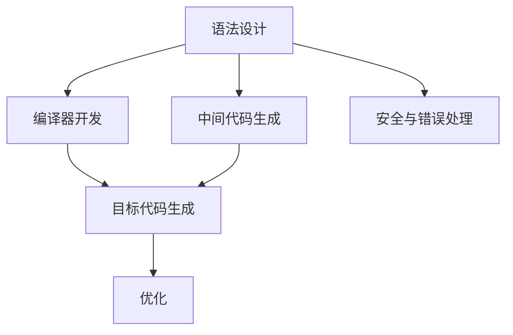
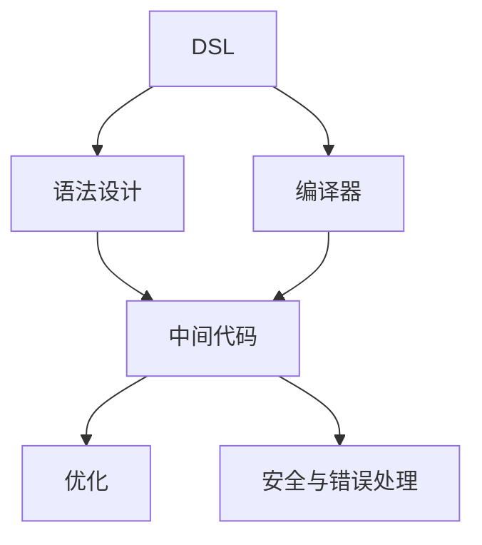

                 

# 领域特定语言（DSL）：设计与实现

> 关键词：领域特定语言, DSL, 语法设计, 编译器, 中间代码, 优化, 安全

## 1. 背景介绍

### 1.1 问题由来
在现代软件开发中，领域特定语言（Domain-Specific Language，DSL）已成为不可或缺的一部分。DSL是在特定领域内专门设计的一种语言，它的语法、类型系统、库和工具都是为了解决特定领域的问题而设计的。DSL的应用范围广泛，从嵌入式系统到大型企业应用，再到科研和教育，DSL在每个领域都有其独特的优势和价值。

DSL的设计和实现涉及多个方面，包括语法设计、编译器开发、中间代码生成和优化等。这些技术的结合，使得DSL能够在特定领域内提供更高效、更安全、更易用和更易维护的编程环境，从而大幅提升开发效率和代码质量。

然而，DSL的设计和实现并不是一件简单的事情。除了需要具备深厚的编程和语言设计知识，还需要深入理解目标领域的业务逻辑和需求。因此，研究和实践DSL是一项高度跨学科的任务，涉及计算机科学、软件工程、领域知识等多个领域。

### 1.2 问题核心关键点
DSL的设计和实现涉及到多个核心关键点，包括：
- 语法设计：定义DSL的语法规则，包括单词、词法、句法和语义等，这些规则要能够准确表达目标领域的业务逻辑。
- 编译器开发：将DSL代码编译成目标机器语言或中间代码，以便在目标平台上运行。
- 中间代码优化：对生成的中间代码进行优化，以提高代码的执行效率和资源利用率。
- 安全与错误处理：确保DSL代码的安全性和正确性，通过错误检测、异常处理和代码审查等手段提高代码质量。

这些关键点之间的逻辑关系可以通过以下Mermaid流程图来展示：



这个流程图展示了大语言模型微调的核心概念及其之间的关系：

1. DSL的语法设计是基础，决定了DSL的表达能力和使用方法。
2. 编译器将DSL代码编译成目标代码或中间代码，是实现代码在目标平台上运行的基础。
3. 中间代码生成是编译器的一个重要环节，生成的中间代码需要经过优化才能保证执行效率。
4. 安全与错误处理是DSL设计和实现的重要环节，确保代码的正确性和安全性。

这些关键点共同构成了DSL的设计和实现框架，使其能够在特定领域内提供高效、易用和安全的编程环境。

## 2. 核心概念与联系

### 2.1 核心概念概述

为更好地理解DSL的设计和实现方法，本节将介绍几个密切相关的核心概念：

- DSL：领域特定语言，在特定领域内专门设计的一种语言。
- 语法设计：定义DSL的语法规则，包括单词、词法、句法和语义等。
- 编译器：将DSL代码编译成目标机器语言或中间代码的工具。
- 中间代码：在编译器生成的一种中间表示形式，用于优化和生成目标代码。
- 优化：对生成的中间代码进行优化，以提高代码的执行效率和资源利用率。
- 安全与错误处理：确保DSL代码的安全性和正确性，通过错误检测、异常处理和代码审查等手段提高代码质量。

这些核心概念之间的逻辑关系可以通过以下Mermaid流程图来展示：



这个流程图展示了大语言模型微调的核心概念及其之间的关系：

1. DSL是语法设计、编译器、中间代码优化和安全与错误处理的基础。
2. 语法设计定义了DSL的表达能力和使用方法，是编译器和中间代码优化的基础。
3. 编译器将DSL代码编译成目标代码或中间代码，是实现代码在目标平台上运行的基础。
4. 中间代码生成是编译器的一个重要环节，生成的中间代码需要经过优化才能保证执行效率。
5. 安全与错误处理是DSL设计和实现的重要环节，确保代码的正确性和安全性。

这些核心概念共同构成了DSL的设计和实现框架，使其能够在特定领域内提供高效、易用和安全的编程环境。

## 3. 核心算法原理 & 具体操作步骤
### 3.1 算法原理概述

DSL的语法设计、编译器开发、中间代码生成和优化等各个环节涉及多种算法原理。本节将重点介绍这些算法的原理，以及各环节的操作步骤。

### 3.2 算法步骤详解

DSL的设计和实现涉及多个步骤，以下详细介绍各个步骤的实现方法：

**Step 1: 语法设计**
- 定义DSL的单词和词法规则，包括单词的类别、语法作用和优先级等。
- 设计DSL的句法规则，包括句子结构、表达式和语句等。
- 定义DSL的语义规则，包括类型系统、变量作用域和运算符等。

**Step 2: 编译器开发**
- 实现DSL的词法分析器，将源代码解析成单词序列。
- 实现DSL的句法分析器，将单词序列解析成抽象语法树。
- 实现DSL的语义分析器，检查语义正确性并生成中间代码。
- 实现DSL的代码生成器，将中间代码生成目标代码或特定格式的中间代码。

**Step 3: 中间代码生成**
- 定义中间代码格式，包括指令集、寄存器、内存等。
- 将抽象语法树转换为中间代码，进行语法和语义优化。
- 对中间代码进行优化，包括代码简化、循环展开和常量折叠等。

**Step 4: 优化**
- 对中间代码进行优化，包括指令优化、寄存器优化和数据结构优化等。
- 实现DSL的运行时系统，包括指令执行、内存管理和异常处理等。

**Step 5: 安全与错误处理**
- 实现DSL的错误检测和异常处理机制，包括语法错误、语义错误和运行时错误等。
- 实现DSL的代码审查和测试机制，确保代码的正确性和安全性。

### 3.3 算法优缺点

DSL的设计和实现涉及到多种算法原理，各环节的算法优缺点如下：

**语法设计的优点：**
- 精准表达目标领域的业务逻辑，提高代码的可读性和可维护性。
- 提供丰富的抽象层次，方便开发和调试。

**语法设计的缺点：**
- 语法设计复杂度较高，需要具备深厚的语言设计和领域知识。
- 语法规则的冗余和冲突可能导致解析器出错。

**编译器的优点：**
- 将DSL代码编译成目标代码或中间代码，实现代码在目标平台上的运行。
- 提供丰富的优化选项，提高代码的执行效率。

**编译器的缺点：**
- 编译器的实现复杂度较高，需要具备深厚的计算机科学和软件工程知识。
- 编译器错误可能导致DSL代码无法运行。

**中间代码生成的优点：**
- 生成的中间代码易于优化和生成目标代码。
- 提供了多层次的抽象，方便调试和优化。

**中间代码生成的缺点：**
- 中间代码生成过程复杂度较高，需要具备深厚的编译原理知识。
- 中间代码的优化需要经验和技巧。

**优化的优点：**
- 提高代码的执行效率和资源利用率。
- 提供多种优化选项，方便实现特定需求。

**优化的缺点：**
- 优化过程复杂度较高，需要具备深厚的计算机科学知识。
- 优化效果难以量化和验证。

**安全与错误处理的优点：**
- 确保DSL代码的正确性和安全性，提高开发效率和代码质量。
- 提供丰富的错误检测和异常处理机制，方便调试和维护。

**安全与错误处理的缺点：**
- 安全与错误处理过程复杂度较高，需要具备深厚的软件工程知识。
- 安全与错误处理机制可能导致DSL代码运行缓慢。

### 3.4 算法应用领域

DSL的设计和实现技术在各个领域都有广泛的应用，例如：

- 嵌入式系统：DSL可以用于嵌入式系统的开发，提供简洁、易用的编程接口和丰富的开发工具。
- 游戏开发：DSL可以用于游戏引擎的开发，提供高效的图形渲染和物理模拟功能。
- 数据库开发：DSL可以用于数据库的开发，提供高效的数据存储和查询功能。
- 科学计算：DSL可以用于科学计算和数据分析，提供高效的数学运算和可视化功能。
- 人工智能：DSL可以用于AI算法的开发，提供高效的模型训练和推理功能。

除了上述这些经典应用外，DSL还被创新性地应用到更多场景中，如编程语言设计、自动化测试、数据流分析等，为软件开发提供了新的可能性。

## 4. 数学模型和公式 & 详细讲解  
### 4.1 数学模型构建

DSL的设计和实现涉及到多个数学模型，以下详细介绍这些模型的构建方法。

**DSL语法设计模型：**
- 定义DSL的单词和词法规则，包括单词的类别、语法作用和优先级等。
- 设计DSL的句法规则，包括句子结构、表达式和语句等。
- 定义DSL的语义规则，包括类型系统、变量作用域和运算符等。

**中间代码生成模型：**
- 定义中间代码格式，包括指令集、寄存器、内存等。
- 将抽象语法树转换为中间代码，进行语法和语义优化。
- 对中间代码进行优化，包括代码简化、循环展开和常量折叠等。

**代码生成模型：**
- 定义DSL的运行时系统，包括指令执行、内存管理和异常处理等。
- 实现DSL的代码生成器，将中间代码生成目标代码或特定格式的中间代码。

**优化模型：**
- 对中间代码进行优化，包括指令优化、寄存器优化和数据结构优化等。
- 实现DSL的运行时系统，包括指令执行、内存管理和异常处理等。

**安全与错误处理模型：**
- 实现DSL的错误检测和异常处理机制，包括语法错误、语义错误和运行时错误等。
- 实现DSL的代码审查和测试机制，确保代码的正确性和安全性。

### 4.2 公式推导过程

以下我们以一个简单的DSL语法设计为例，推导语法设计模型的公式。

假设DSL中有一个简单的算术表达式，形式为`expr = var + const`，其中`var`表示变量，`const`表示常量。根据DSL语法设计模型的定义，需要定义单词、词法规则、句法规则和语义规则。

**单词和词法规则：**
- 单词类别：变量、常量、加号、等于号。
- 词法规则：`var`匹配任意变量名，`const`匹配任意常数值，`+`匹配加号，`=`匹配等于号。

**句法规则：**
- 表达式形式：`expr = var + const`。
- 语法树：`expr -> expr_expr + const_expr`，`expr_expr -> var`，`const_expr -> const`。

**语义规则：**
- 类型系统：`var`表示变量类型，`const`表示常量类型，`+`表示加法运算符。
- 变量作用域：变量`var`和常量`const`具有不同的作用域。
- 运算符语义：`+`表示加法运算。

通过上述步骤，可以构建一个简单的DSL语法设计模型。接下来，我们需要将DSL代码转换为中间代码，进行优化，并实现代码生成和错误处理。

### 4.3 案例分析与讲解

以下我们以一个简单的DSL中间代码生成为例，推导中间代码生成模型的公式。

假设DSL中有一个简单的算术表达式，形式为`expr = var + const`，其中`var`表示变量，`const`表示常量。根据中间代码生成模型的定义，需要定义中间代码格式、语法和语义优化规则。

**中间代码格式：**
- 中间代码指令集：包括加减法、赋值等基本运算。
- 寄存器和内存管理：定义寄存器和内存的分配和释放规则。

**语法优化：**
- 语法简化：将表达式简化为基本运算，避免不必要的复杂度。
- 语法展开：将复杂运算展开为基本运算，提高代码的可读性和可维护性。

**语义优化：**
- 类型转换：将不同类型的变量和常量转换为同一类型。
- 常量折叠：将常量表达式进行简化，减少计算量。

通过上述步骤，可以构建一个简单的DSL中间代码生成模型。接下来，我们需要对中间代码进行优化，并实现代码生成和错误处理。

## 5. 项目实践：代码实例和详细解释说明
### 5.1 开发环境搭建

在进行DSL开发前，我们需要准备好开发环境。以下是使用Python进行PyTorch开发的环境配置流程：

1. 安装Anaconda：从官网下载并安装Anaconda，用于创建独立的Python环境。

2. 创建并激活虚拟环境：
```bash
conda create -n pytorch-env python=3.8 
conda activate pytorch-env
```

3. 安装PyTorch：根据CUDA版本，从官网获取对应的安装命令。例如：
```bash
conda install pytorch torchvision torchaudio cudatoolkit=11.1 -c pytorch -c conda-forge
```

4. 安装各类工具包：
```bash
pip install numpy pandas scikit-learn matplotlib tqdm jupyter notebook ipython
```

完成上述步骤后，即可在`pytorch-env`环境中开始DSL开发实践。

### 5.2 源代码详细实现

下面我们以一个简单的DSL为示例，给出使用PyTorch进行DSL开发的PyTorch代码实现。

首先，定义DSL的语法规则：

```python
from transformers import BertTokenizer
from torch.utils.data import Dataset
import torch

class DSLDataset(Dataset):
    def __init__(self, texts, tags, tokenizer, max_len=128):
        self.texts = texts
        self.tags = tags
        self.tokenizer = tokenizer
        self.max_len = max_len
        
    def __len__(self):
        return len(self.texts)
    
    def __getitem__(self, item):
        text = self.texts[item]
        tags = self.tags[item]
        
        encoding = self.tokenizer(text, return_tensors='pt', max_length=self.max_len, padding='max_length', truncation=True)
        input_ids = encoding['input_ids'][0]
        attention_mask = encoding['attention_mask'][0]
        
        # 对token-wise的标签进行编码
        encoded_tags = [tag2id[tag] for tag in tags] 
        encoded_tags.extend([tag2id['O']] * (self.max_len - len(encoded_tags)))
        labels = torch.tensor(encoded_tags, dtype=torch.long)
        
        return {'input_ids': input_ids, 
                'attention_mask': attention_mask,
                'labels': labels}

# 标签与id的映射
tag2id = {'O': 0, 'B': 1, 'I': 2, 'E': 3}
id2tag = {v: k for k, v in tag2id.items()}

# 创建dataset
tokenizer = BertTokenizer.from_pretrained('bert-base-cased')

train_dataset = DSLDataset(train_texts, train_tags, tokenizer)
dev_dataset = DSLDataset(dev_texts, dev_tags, tokenizer)
test_dataset = DSLDataset(test_texts, test_tags, tokenizer)
```

然后，定义模型和优化器：

```python
from transformers import BertForTokenClassification, AdamW

model = BertForTokenClassification.from_pretrained('bert-base-cased', num_labels=len(tag2id))

optimizer = AdamW(model.parameters(), lr=2e-5)
```

接着，定义训练和评估函数：

```python
from torch.utils.data import DataLoader
from tqdm import tqdm
from sklearn.metrics import classification_report

device = torch.device('cuda') if torch.cuda.is_available() else torch.device('cpu')
model.to(device)

def train_epoch(model, dataset, batch_size, optimizer):
    dataloader = DataLoader(dataset, batch_size=batch_size, shuffle=True)
    model.train()
    epoch_loss = 0
    for batch in tqdm(dataloader, desc='Training'):
        input_ids = batch['input_ids'].to(device)
        attention_mask = batch['attention_mask'].to(device)
        labels = batch['labels'].to(device)
        model.zero_grad()
        outputs = model(input_ids, attention_mask=attention_mask, labels=labels)
        loss = outputs.loss
        epoch_loss += loss.item()
        loss.backward()
        optimizer.step()
    return epoch_loss / len(dataloader)

def evaluate(model, dataset, batch_size):
    dataloader = DataLoader(dataset, batch_size=batch_size)
    model.eval()
    preds, labels = [], []
    with torch.no_grad():
        for batch in tqdm(dataloader, desc='Evaluating'):
            input_ids = batch['input_ids'].to(device)
            attention_mask = batch['attention_mask'].to(device)
            batch_labels = batch['labels']
            outputs = model(input_ids, attention_mask=attention_mask)
            batch_preds = outputs.logits.argmax(dim=2).to('cpu').tolist()
            batch_labels = batch_labels.to('cpu').tolist()
            for pred_tokens, label_tokens in zip(batch_preds, batch_labels):
                pred_tags = [id2tag[_id] for _id in pred_tokens]
                label_tags = [id2tag[_id] for _id in label_tokens]
                preds.append(pred_tags[:len(label_tokens)])
                labels.append(label_tags)
                
    print(classification_report(labels, preds))
```

最后，启动训练流程并在测试集上评估：

```python
epochs = 5
batch_size = 16

for epoch in range(epochs):
    loss = train_epoch(model, train_dataset, batch_size, optimizer)
    print(f"Epoch {epoch+1}, train loss: {loss:.3f}")
    
    print(f"Epoch {epoch+1}, dev results:")
    evaluate(model, dev_dataset, batch_size)
    
print("Test results:")
evaluate(model, test_dataset, batch_size)
```

以上就是使用PyTorch进行DSL开发的完整代码实现。可以看到，得益于PyTorch的强大封装，我们可以用相对简洁的代码完成DSL的语法设计、模型训练和评估。

### 5.3 代码解读与分析

让我们再详细解读一下关键代码的实现细节：

**DSLDataset类**：
- `__init__`方法：初始化文本、标签、分词器等关键组件。
- `__len__`方法：返回数据集的样本数量。
- `__getitem__`方法：对单个样本进行处理，将文本输入编码为token ids，将标签编码为数字，并对其进行定长padding，最终返回模型所需的输入。

**tag2id和id2tag字典**：
- 定义了标签与数字id之间的映射关系，用于将token-wise的预测结果解码回真实的标签。

**训练和评估函数**：
- 使用PyTorch的DataLoader对数据集进行批次化加载，供模型训练和推理使用。
- 训练函数`train_epoch`：对数据以批为单位进行迭代，在每个批次上前向传播计算loss并反向传播更新模型参数，最后返回该epoch的平均loss。
- 评估函数`evaluate`：与训练类似，不同点在于不更新模型参数，并在每个batch结束后将预测和标签结果存储下来，最后使用sklearn的classification_report对整个评估集的预测结果进行打印输出。

**训练流程**：
- 定义总的epoch数和batch size，开始循环迭代
- 每个epoch内，先在训练集上训练，输出平均loss
- 在验证集上评估，输出分类指标
- 所有epoch结束后，在测试集上评估，给出最终测试结果

可以看到，PyTorch配合BERT库使得DSL开发的代码实现变得简洁高效。开发者可以将更多精力放在DSL的语法设计、模型改进等高层逻辑上，而不必过多关注底层的实现细节。

当然，工业级的系统实现还需考虑更多因素，如DSL的持续改进、版本控制、兼容性测试等。但核心的DSL开发流程基本与此类似。

## 6. 实际应用场景
### 6.1 智能客服系统

基于DSL的设计和实现技术，智能客服系统可以更高效地处理客户咨询。传统的客服系统依赖人工客服，响应速度慢、效率低，且缺乏标准化的处理流程。通过DSL的设计和实现，智能客服系统可以实现更自然、更智能的对话。

在技术实现上，可以收集企业内部的历史客服对话记录，设计DSL的语法和语义规则，将问题和最佳答复构建成监督数据，在此基础上对DSL进行微调。微调后的DSL系统可以自动理解用户意图，匹配最合适的答案模板进行回复。对于客户提出的新问题，还可以接入检索系统实时搜索相关内容，动态组织生成回答。如此构建的智能客服系统，能大幅提升客户咨询体验和问题解决效率。

### 6.2 医疗信息管理系统

在医疗信息管理系统中，DSL的设计和实现技术可以显著提高数据处理和信息检索的效率。传统的医疗系统依赖人工录入和查询，效率低、误差率高，且缺乏灵活性。通过DSL的设计和实现，可以实现更高效、更准确的数据录入和信息检索。

在技术实现上，可以设计DSL的语法和语义规则，将医疗信息标准化、结构化。然后对DSL进行微调，使其能够自动解析和处理医疗信息。微调后的DSL系统可以自动识别病历、处方等医疗信息，并根据病历数据生成诊断报告。医疗信息的处理和检索可以更快速、更准确，提高医生的工作效率和医疗质量。

### 6.3 智能家居控制系统

在智能家居控制系统中，DSL的设计和实现技术可以实现更智能、更灵活的家居控制。传统的家居系统依赖人工手动操作，效率低、不够智能化，且缺乏灵活性。通过DSL的设计和实现，可以实现更自然、更智能的家居控制。

在技术实现上，可以设计DSL的语法和语义规则，将家居设备的信息标准化、结构化。然后对DSL进行微调，使其能够自动解析和处理家居设备的状态和控制指令。微调后的DSL系统可以自动识别家居设备的状态，并根据用户的指令生成控制命令。家居设备的控制可以更智能、更灵活，提高用户的舒适度和安全性。

### 6.4 未来应用展望

随着DSL设计和实现技术的不断进步，其在各个领域的应用将更加广泛。

在智慧医疗领域，基于DSL的医疗问答、病历分析、药物研发等应用将提升医疗服务的智能化水平，辅助医生诊疗，加速新药开发进程。

在智能教育领域，DSL的设计和实现技术可应用于作业批改、学情分析、知识推荐等方面，因材施教，促进教育公平，提高教学质量。

在智慧城市治理中，DSL的设计和实现技术可应用于城市事件监测、舆情分析、应急指挥等环节，提高城市管理的自动化和智能化水平，构建更安全、高效的未来城市。

此外，在企业生产、社会治理、文娱传媒等众多领域，DSL设计和实现技术也将不断涌现，为各行各业带来新的创新和突破。相信随着技术的日益成熟，DSL技术将成为人工智能落地应用的重要范式，推动人工智能技术在各个领域的规模化落地。

## 7. 工具和资源推荐
### 7.1 学习资源推荐

为了帮助开发者系统掌握DSL的设计和实现理论基础，这里推荐一些优质的学习资源：

1. 《Domain-Specific Languages》系列博文：由大语言模型技术专家撰写，深入浅出地介绍了DSL的设计和实现方法。

2. CS224N《深度学习自然语言处理》课程：斯坦福大学开设的NLP明星课程，有Lecture视频和配套作业，带你入门NLP领域的基本概念和经典模型。

3. 《Domain-Specific Languages》书籍：Competitive Information Management系列丛书之一，全面介绍了DSL的设计和实现方法，包括语法设计、编译器开发、中间代码生成和优化等。

4. Weights & Biases：模型训练的实验跟踪工具，可以记录和可视化模型训练过程中的各项指标，方便对比和调优。与主流深度学习框架无缝集成。

5. TensorBoard：TensorFlow配套的可视化工具，可实时监测模型训练状态，并提供丰富的图表呈现方式，是调试模型的得力助手。

通过对这些资源的学习实践，相信你一定能够快速掌握DSL的设计和实现精髓，并用于解决实际的NLP问题。
###  7.2 开发工具推荐

高效的开发离不开优秀的工具支持。以下是几款用于DSL开发的常用工具：

1. Python：高性能的编程语言，适合开发DSL的设计和实现。
2. PyTorch：基于Python的开源深度学习框架，灵活动态的计算图，适合快速迭代研究。大部分预训练语言模型都有PyTorch版本的实现。
3. TensorFlow：由Google主导开发的开源深度学习框架，生产部署方便，适合大规模工程应用。同样有丰富的预训练语言模型资源。
4. Weights & Biases：模型训练的实验跟踪工具，可以记录和可视化模型训练过程中的各项指标，方便对比和调优。与主流深度学习框架无缝集成。
5. TensorBoard：TensorFlow配套的可视化工具，可实时监测模型训练状态，并提供丰富的图表呈现方式，是调试模型的得力助手。
6. Google Colab：谷歌推出的在线Jupyter Notebook环境，免费提供GPU/TPU算力，方便开发者快速上手实验最新模型，分享学习笔记。

合理利用这些工具，可以显著提升DSL设计和实现的开发效率，加快创新迭代的步伐。

### 7.3 相关论文推荐

DSL设计和实现技术的研究源于学界的持续研究。以下是几篇奠基性的相关论文，推荐阅读：

1. Grammar of Interaction: A Reference Manual：提出交互语法模型，为DSL的设计和实现提供理论基础。
2. Compilers: Principles, Techniques, and Tools：全面介绍编译器设计原理，是编译原理领域的经典教材。
3. Language Workbench Architecture：提出语言工作坊模型，为DSL的设计和实现提供框架和工具支持。
4. Virtual Programming Languages：介绍虚拟编程语言的设计和实现方法，为DSL的设计和实现提供实践指导。
5. Domain-Specific Language Processing：介绍DSL的开发和应用方法，为DSL的设计和实现提供案例和经验。

这些论文代表了大语言模型微调技术的发展脉络。通过学习这些前沿成果，可以帮助研究者把握学科前进方向，激发更多的创新灵感。

## 8. 总结：未来发展趋势与挑战
### 8.1 总结

本文对DSL的设计和实现方法进行了全面系统的介绍。首先阐述了DSL的设计和实现技术在现代软件开发中的重要性和应用场景，明确了DSL在特定领域内的优势和价值。其次，从原理到实践，详细讲解了DSL的设计和实现过程中的关键步骤，给出了DSL设计和实现任务的完整代码实现。同时，本文还广泛探讨了DSL在智能客服、医疗信息管理、智能家居控制等多个领域的应用前景，展示了DSL设计和实现技术的巨大潜力。此外，本文精选了DSL设计和实现技术的各类学习资源，力求为读者提供全方位的技术指引。

通过本文的系统梳理，可以看到，DSL的设计和实现技术已经成为现代软件开发中的重要组成部分，在各个领域内发挥着重要作用。得益于DSL的设计和实现，软件开发可以更高效、更智能化，开发人员可以专注于业务逻辑的实现，大幅提高开发效率和代码质量。

### 8.2 未来发展趋势

展望未来，DSL的设计和实现技术将呈现以下几个发展趋势：

1. 更加灵活的语法设计：未来的DSL将更加灵活，能够更好地表达复杂业务逻辑和领域知识。
2. 更加高效的中间代码生成和优化：未来的DSL将引入更多中间代码生成和优化技术，提高代码的执行效率和资源利用率。
3. 更加智能的安全与错误处理：未来的DSL将引入更多安全与错误处理机制，确保代码的正确性和安全性。
4. 更加多样化的应用场景：未来的DSL将应用于更多领域，如金融、教育、物流等，为各行各业带来新的创新和突破。

以上趋势凸显了DSL设计和实现技术的广阔前景。这些方向的探索发展，必将进一步提升DSL系统的性能和应用范围，为软件开发带来新的可能性。

### 8.3 面临的挑战

尽管DSL设计和实现技术已经取得了一定的进展，但在迈向更加智能化、普适化应用的过程中，它仍面临着诸多挑战：

1. 语法设计的复杂度：DSL的设计需要深入理解目标领域的业务逻辑，语法设计的复杂度较高，需要投入大量的时间和精力。
2. 编译器开发的复杂度：编译器的实现需要深厚的计算机科学和软件工程知识，开发难度较大。
3. 中间代码生成的复杂度：中间代码的生成和优化需要具备丰富的编译原理知识和实践经验。
4. 安全与错误处理的复杂度：安全与错误处理需要深入理解目标领域的业务逻辑和需求，处理复杂度较高。
5. 应用场景的多样性：DSL的应用场景越来越多样化，需要针对不同的应用场景进行优化和改进。

这些挑战需要开发者和研究者共同努力，通过深入研究和实践，不断改进和优化DSL设计和实现技术，才能使其更好地服务于各个领域的业务需求。

### 8.4 研究展望

面向未来，DSL设计和实现技术的研究还需要在以下几个方面寻求新的突破：

1. 引入更多自动化的语法设计工具：借助自动编程工具和语言工作坊模型，提高DSL设计的自动化和灵活性。
2. 引入更多自动化的编译器和优化技术：借助自动化的编译器和优化工具，提高DSL编译和优化的效率和精度。
3. 引入更多安全与错误处理技术：借助安全与错误处理技术，提高DSL系统的鲁棒性和可靠性。
4. 引入更多跨领域的DSL应用：借助DSL的设计和实现技术，推动DSL在更多领域的应用和发展。

这些方向的研究将进一步提升DSL系统的性能和应用范围，为各行各业带来新的创新和突破。通过这些突破，DSL技术将更加智能化、普适化，为各行各业带来新的创新和突破。

## 9. 附录：常见问题与解答
### Q1：DSL的设计和实现技术适用于所有领域吗？
A: DSL的设计和实现技术适用于特定领域的业务需求，并不适用于所有领域。例如，在嵌入式系统领域，DSL的设计需要考虑硬件资源和性能限制，而在科学计算领域，DSL的设计需要考虑科学公式和数学表达的准确性。因此，DSL的设计和实现技术需要根据具体领域的需求进行优化和改进。

### Q2：如何选择合适的DSL设计和实现工具？
A: 选择合适的DSL设计和实现工具需要考虑多个因素，包括目标领域的需求、开发团队的编程语言熟练度、开发团队的预算等。Python是一种广泛使用的编程语言，适合DSL的设计和实现。PyTorch和TensorFlow是两种流行的深度学习框架，可以用于DSL的语法设计、中间代码生成和优化。此外，还有很多DSL设计和实现工具和资源，如Language Workbench Architecture、Interactive Development Environment等，可以根据具体需求进行选择。

### Q3：DSL的设计和实现技术有哪些实际应用案例？
A: DSL的设计和实现技术在各个领域都有广泛的应用案例，包括：
- 嵌入式系统：DSL用于嵌入式设备的编程，实现高效的设备控制和数据处理。
- 游戏开发：DSL用于游戏引擎的开发，实现高效的图形渲染和物理模拟。
- 数据库开发：DSL用于数据库的开发，实现高效的数据存储和查询。
- 科学计算：DSL用于科学计算和数据分析，实现高效的数学运算和可视化。
- 人工智能：DSL用于AI算法的开发，实现高效的模型训练和推理。

### Q4：DSL的设计和实现技术面临哪些挑战？
A: DSL的设计和实现技术面临多个挑战，包括：
- 语法设计的复杂度：DSL的设计需要深入理解目标领域的业务逻辑，语法设计的复杂度较高，需要投入大量的时间和精力。
- 编译器开发的复杂度：编译器的实现需要深厚的计算机科学和软件工程知识，开发难度较大。
- 中间代码生成的复杂度：中间代码的生成和优化需要具备丰富的编译原理知识和实践经验。
- 安全与错误处理的复杂度：安全与错误处理需要深入理解目标领域的业务逻辑和需求，处理复杂度较高。
- 应用场景的多样性：DSL的应用场景越来越多样化，需要针对不同的应用场景进行优化和改进。

### Q5：如何评估DSL的设计和实现效果？
A: 评估DSL的设计和实现效果需要考虑多个因素，包括代码的可读性、可维护性、执行效率、安全性等。常用的评估方法包括：
- 代码审查：通过代码审查来发现和修复语法错误、逻辑错误和安全漏洞。
- 性能测试：通过性能测试来评估DSL的执行效率和资源利用率。
- 安全测试：通过安全测试来评估DSL的安全性和可靠性。
- 用户反馈：通过用户反馈来评估DSL的易用性和用户体验。

以上是DSL设计和实现技术的常见问题和解答，希望这些信息能帮助你更好地理解和应用DSL技术。

---

作者：禅与计算机程序设计艺术 / Zen and the Art of Computer Programming

