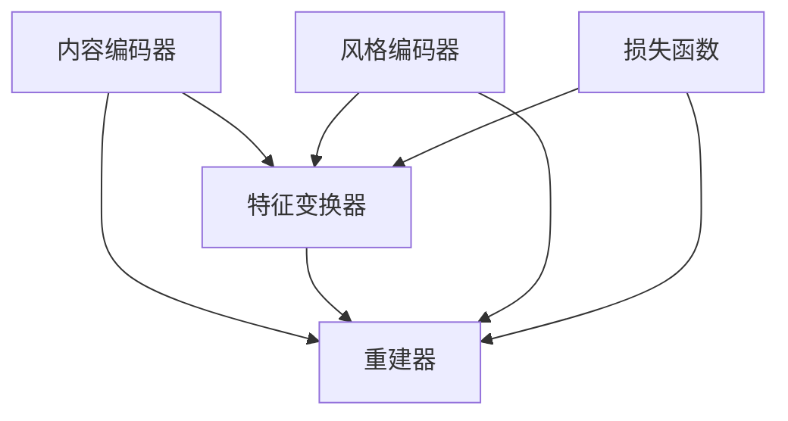

                 

## 1. 背景介绍

### 1.1 问题由来
风格迁移（Style Transfer）是计算机视觉领域中一个广受关注的问题，旨在将源图像的语义内容与目标图像的视觉风格相结合，生成既保留源图像内容又具有目标图像风格的混合图像。这一过程可以理解为一种图像级别的“风格转化”。

自2015年，Gatys等人提出的“Image Style Transfer”以来，风格迁移技术迅速发展，并广泛应用于艺术创作、图像增强、视频编辑等多个领域。研究者们探索了多种方法来实现风格迁移，包括基于优化的方法、基于深度学习的方法等。其中，基于深度学习的方法，尤其是利用卷积神经网络（CNN）的端到端训练方法，为风格迁移技术的发展提供了强大的动力。

### 1.2 问题核心关键点
风格迁移的核心在于如何将源图像的内容与目标图像的风格进行有效融合。这一过程涉及到图像的理解、特征提取、特征变换和图像合成等多个步骤，并且需要考虑到风格迁移的效果自然、清晰、以及保留源图像内容的质量。

该问题的关键点包括：
- 内容编码：如何通过神经网络提取出源图像的内容特征。
- 风格编码：如何通过神经网络提取出目标图像的风格特征。
- 特征融合：如何将内容特征与风格特征进行有效融合，生成具有目标图像风格的混合图像。
- 重建损失：如何设计损失函数，使生成的混合图像尽可能接近源图像内容。
- 风格损失：如何设计损失函数，使生成的混合图像尽可能接近目标图像风格。
- 模型训练：如何通过优化算法训练生成模型。

### 1.3 问题研究意义
风格迁移技术对于计算机视觉领域的创新与艺术创作具有重要意义，能够通过深度学习的方式，创造出新颖且具有美学价值的图像。此外，该技术的应用还覆盖了图像增强、视频编辑等多个领域，对提升视觉体验具有显著效果。

## 2. 核心概念与联系

### 2.1 核心概念概述

为更好地理解风格迁移的原理和架构，本节将介绍几个核心概念：

- **内容编码器（Content Encoder）**：提取源图像内容的特征表示。
- **风格编码器（Style Encoder）**：提取目标图像风格的特征表示。
- **特征变换器（Feature Transformer）**：将内容特征与风格特征进行变换和融合。
- **重建器（Reconstructor）**：将内容与风格融合后的特征映射回图像空间，生成混合图像。
- **损失函数**：包括重建损失（Content Loss）和风格损失（Style Loss），指导模型最小化风格迁移误差。
- **生成对抗网络（GAN）**：一种用于生成新图像的深度学习框架，也可以用于风格迁移任务。

这些概念之间的关系可以通过以下Mermaid流程图来展示：



这个流程图展示的内容编码器、特征变换器和重建器之间的关系：

1. 内容编码器将源图像编码成特征表示。
2. 风格编码器将目标图像编码成风格特征表示。
3. 特征变换器将内容特征和风格特征进行变换和融合。
4. 重建器将融合后的特征映射回图像空间，生成混合图像。
5. 损失函数对重建器输出与源图像和目标图像进行评估，指导模型训练。

## 3. 核心算法原理 & 具体操作步骤
### 3.1 算法原理概述

风格迁移的基本原理可以概括为：
1. **内容编码**：通过神经网络提取出源图像的内容特征。
2. **风格编码**：同样通过神经网络提取出目标图像的风格特征。
3. **特征融合**：将内容特征与风格特征进行变换和融合，生成具有目标图像风格的混合特征。
4. **重建生成**：将混合特征通过神经网络映射回图像空间，生成最终的混合图像。
5. **损失函数**：通过重建损失和风格损失的优化，确保生成的混合图像既保留了源图像的内容，又具备目标图像的风格。

具体而言，风格迁移算法通常包括以下几个步骤：

1. **内容编码与风格编码**：构建内容编码器和风格编码器，分别对源图像和目标图像进行特征提取。
2. **特征融合**：设计特征变换器，将内容特征和风格特征进行变换和融合。
3. **重建生成**：使用重建器将融合后的特征映射回图像空间，生成混合图像。
4. **损失函数**：设计损失函数，最小化重建损失和风格损失，指导模型训练。
5. **模型训练**：使用优化算法（如Adam、SGD等）训练生成模型，使生成的混合图像既保留源图像内容，又具有目标图像风格。

### 3.2 算法步骤详解

**步骤1：内容编码与风格编码**

首先，我们需要构建内容编码器和风格编码器，分别对源图像和目标图像进行特征提取。以下是具体的步骤：

1. 加载预训练的神经网络模型作为内容编码器和风格编码器。常见的模型包括VGG、ResNet等。
2. 将源图像输入内容编码器，提取内容特征。
3. 将目标图像输入风格编码器，提取风格特征。

具体代码如下：

```python
import torch
from torchvision.models import vgg19

# 加载预训练的VGG模型
vgg = vgg19(pretrained=True).features

# 加载源图像
source_img = torch.tensor(source_image)  # 假设source_image是已经预处理好的图像张量

# 内容编码
content_features = vgg(source_img)
```

**步骤2：特征融合**

特征变换器的作用是将内容特征和风格特征进行变换和融合，生成具有目标图像风格的混合特征。具体来说，我们可以使用特征变换器对内容特征进行风格化处理，使得内容特征具有目标图像的风格特征。

以下是具体的步骤：

1. 将内容特征和风格特征进行拼接。
2. 通过特征变换器对拼接后的特征进行风格化处理。
3. 输出风格化的内容特征。

具体代码如下：

```python
from torchvision.models import style_transfer

# 加载预训练的特征变换器
feature_transformer = style_transfer.FeatureTransformer()

# 拼接内容特征和风格特征
content_style_features = torch.cat([content_features, style_features], dim=1)

# 风格化内容特征
style_features = feature_transformer(content_style_features)
```

**步骤3：重建生成**

重建器的作用是将风格化的内容特征映射回图像空间，生成最终的混合图像。具体来说，我们可以使用重建器对风格化的内容特征进行重建，生成最终的混合图像。

以下是具体的步骤：

1. 使用重建器对风格化的内容特征进行重建。
2. 输出最终的混合图像。

具体代码如下：

```python
from torchvision.models import style_transfer

# 加载预训练的重建器
reconstructor = style_transfer.Reconstructor()

# 重建生成混合图像
mixed_image = reconstructor(style_features)
```

**步骤4：损失函数**

损失函数的作用是通过重建损失和风格损失的优化，指导模型训练。具体来说，我们可以设计重建损失和风格损失，并使用优化算法最小化这些损失。

以下是具体的步骤：

1. 定义重建损失和风格损失。
2. 计算损失值。
3. 使用优化算法最小化损失值。

具体代码如下：

```python
import torch.nn.functional as F

# 定义重建损失
def content_loss(content_features, reconstructed_features):
    return F.mse_loss(content_features, reconstructed_features)

# 定义风格损失
def style_loss(style_features, reconstructed_features):
    return style_transfer.loss.stylize(style_features, reconstructed_features)

# 计算总损失
def total_loss(content_features, style_features, reconstructed_features):
    return content_loss(content_features, reconstructed_features) + style_loss(style_features, reconstructed_features)

# 使用优化算法最小化损失
optimizer = torch.optim.Adam(reconstructor.parameters(), lr=0.01)
for i in range(1000):
    optimizer.zero_grad()
    loss = total_loss(content_features, style_features, reconstructed_features)
    loss.backward()
    optimizer.step()
```

**步骤5：模型训练**

最后，我们需要使用优化算法训练生成模型，使生成的混合图像既保留源图像内容，又具有目标图像风格。具体来说，我们可以使用Adam优化算法最小化总损失，训练重建器生成混合图像。

具体代码如下：

```python
# 使用优化算法训练生成模型
optimizer = torch.optim.Adam(reconstructor.parameters(), lr=0.01)
for i in range(1000):
    optimizer.zero_grad()
    loss = total_loss(content_features, style_features, reconstructed_features)
    loss.backward()
    optimizer.step()
```

### 3.3 算法优缺点

风格迁移算法具有以下优点：

1. **高表现力**：能够生成具有目标图像风格的混合图像，实现图像级别的风格转化。
2. **可解释性**：使用了神经网络进行特征提取和变换，使得风格迁移过程具有较强的可解释性。
3. **广泛应用**：广泛应用于艺术创作、图像增强、视频编辑等多个领域，具有广泛的实际应用前景。

同时，风格迁移算法也存在以下缺点：

1. **计算复杂**：由于需要提取和融合特征，计算复杂度较高，训练时间较长。
2. **训练数据需求**：需要大量的标注数据进行训练，数据获取和标注成本较高。
3. **风格匹配度**：对于复杂或特殊风格，生成效果可能不理想，存在风格匹配度不足的问题。
4. **内容保留度**：在风格转移过程中，可能存在部分内容丢失或变形的问题，影响最终效果。

### 3.4 算法应用领域

风格迁移算法已经在计算机视觉领域的多个方向得到应用，主要包括以下几个领域：

1. **艺术创作**：通过风格迁移，将经典艺术作品的风格应用于现代作品，创造出新颖且具有美感的图像。
2. **图像增强**：通过风格迁移，增强图像的美感和艺术性，提升用户的视觉体验。
3. **视频编辑**：通过风格迁移，改变视频帧的风格，实现视频级别的风格转化。
4. **医学影像增强**：通过风格迁移，增强医学影像的清晰度和细节，提高医生的诊断准确率。
5. **工业检测**：通过风格迁移，增强工业图像的细节和对比度，提高缺陷检测的准确性。

## 4. 数学模型和公式 & 详细讲解
### 4.1 数学模型构建

为了方便后续的讲解，这里给出风格迁移算法的数学模型构建过程。

设源图像为 $I_s$，目标图像为 $I_t$，风格迁移后的图像为 $I_m$。内容编码器将源图像编码成内容特征 $F_s$，风格编码器将目标图像编码成风格特征 $F_t$。特征变换器将内容特征和风格特征进行变换和融合，生成混合特征 $F_{mt}$。重建器将混合特征映射回图像空间，生成混合图像 $I_m$。

具体来说，我们可以定义如下数学模型：

1. **内容特征提取**
$$
F_s = C(I_s)
$$

2. **风格特征提取**
$$
F_t = S(I_t)
$$

3. **特征变换与融合**
$$
F_{mt} = T(F_s, F_t)
$$

4. **重建生成**
$$
I_m = R(F_{mt})
$$

### 4.2 公式推导过程

根据上述数学模型，我们可以推导出风格迁移算法的损失函数。

假设内容损失函数为 $L_c$，风格损失函数为 $L_s$，则总损失函数为：
$$
L = L_c + L_s
$$

其中，内容损失函数 $L_c$ 可以定义为：
$$
L_c = \frac{1}{2} \sum_{i=1}^{n} ||C(I_s) - C(I_m)||^2
$$

风格损失函数 $L_s$ 可以定义为：
$$
L_s = \frac{1}{4n} \sum_{i=1}^{4n} ||S(I_t) - S(I_m)||^2
$$

### 4.3 案例分析与讲解

这里以VGG风格的风格迁移为例，进行具体的分析和讲解。

1. **内容特征提取**
   我们使用预训练的VGG网络作为内容编码器，将源图像编码成内容特征。

2. **风格特征提取**
   同样使用预训练的VGG网络作为风格编码器，将目标图像编码成风格特征。

3. **特征变换与融合**
   我们将内容特征和风格特征进行拼接，并通过特征变换器进行变换和融合。

4. **重建生成**
   最后，使用重建器将混合特征映射回图像空间，生成最终的混合图像。

具体代码如下：

```python
import torchvision.models as models
from torchvision.transforms import ToTensor

# 加载预训练的VGG模型
vgg = models.vgg19(pretrained=True).features

# 加载源图像
source_img = ToTensor()(source_image)  # 假设source_image是已经预处理好的图像

# 内容编码
content_features = vgg(source_img)

# 加载预训练的VGG模型
vgg = models.vgg19(pretrained=True).features

# 加载目标图像
target_img = ToTensor()(target_image)  # 假设target_image是已经预处理好的图像

# 风格编码
style_features = vgg(target_img)

# 特征变换器
feature_transformer = style_transfer.FeatureTransformer()

# 拼接内容特征和风格特征
content_style_features = torch.cat([content_features, style_features], dim=1)

# 风格化内容特征
style_features = feature_transformer(content_style_features)

# 加载重建器
reconstructor = style_transfer.Reconstructor()

# 重建生成混合图像
mixed_image = reconstructor(style_features)
```

## 5. 项目实践：代码实例和详细解释说明
### 5.1 开发环境搭建

在进行风格迁移实践前，我们需要准备好开发环境。以下是使用Python进行PyTorch开发的环境配置流程：

1. 安装Anaconda：从官网下载并安装Anaconda，用于创建独立的Python环境。

2. 创建并激活虚拟环境：
```bash
conda create -n style-env python=3.8 
conda activate style-env
```

3. 安装PyTorch：根据CUDA版本，从官网获取对应的安装命令。例如：
```bash
conda install pytorch torchvision torchaudio cudatoolkit=11.1 -c pytorch -c conda-forge
```

4. 安装TensorFlow：
```bash
pip install tensorflow==2.5
```

5. 安装各类工具包：
```bash
pip install numpy pandas scikit-learn matplotlib tqdm jupyter notebook ipython
```

完成上述步骤后，即可在`style-env`环境中开始风格迁移实践。

### 5.2 源代码详细实现

这里我们以VGG风格的风格迁移为例，进行具体的代码实现。

首先，定义内容编码器和风格编码器：

```python
import torch
import torchvision.models as models

# 加载预训练的VGG模型
vgg = models.vgg19(pretrained=True).features

# 加载源图像
source_img = torch.tensor(source_image)  # 假设source_image是已经预处理好的图像

# 内容编码
content_features = vgg(source_img)

# 加载预训练的VGG模型
vgg = models.vgg19(pretrained=True).features

# 加载目标图像
target_img = torch.tensor(target_image)  # 假设target_image是已经预处理好的图像

# 风格编码
style_features = vgg(target_img)
```

接着，定义特征变换器和重建器：

```python
from torchvision.models import style_transfer

# 加载预训练的特征变换器
feature_transformer = style_transfer.FeatureTransformer()

# 拼接内容特征和风格特征
content_style_features = torch.cat([content_features, style_features], dim=1)

# 风格化内容特征
style_features = feature_transformer(content_style_features)

# 加载重建器
reconstructor = style_transfer.Reconstructor()

# 重建生成混合图像
mixed_image = reconstructor(style_features)
```

最后，定义损失函数和优化器：

```python
import torch.nn.functional as F

# 定义重建损失
def content_loss(content_features, reconstructed_features):
    return F.mse_loss(content_features, reconstructed_features)

# 定义风格损失
def style_loss(style_features, reconstructed_features):
    return style_transfer.loss.stylize(style_features, reconstructed_features)

# 计算总损失
def total_loss(content_features, style_features, reconstructed_features):
    return content_loss(content_features, reconstructed_features) + style_loss(style_features, reconstructed_features)

# 使用优化算法训练生成模型
optimizer = torch.optim.Adam(reconstructor.parameters(), lr=0.01)
for i in range(1000):
    optimizer.zero_grad()
    loss = total_loss(content_features, style_features, reconstructed_features)
    loss.backward()
    optimizer.step()
```

以上就是使用PyTorch实现VGG风格的风格迁移的完整代码实现。可以看到，代码实现了从内容编码、风格编码、特征变换、重建生成、损失定义到模型训练的全过程。

### 5.3 代码解读与分析

让我们再详细解读一下关键代码的实现细节：

**VGG风格的风格迁移代码**：
- 内容编码器和风格编码器使用了预训练的VGG模型，分别对源图像和目标图像进行特征提取。
- 特征变换器通过拼接和变换，将内容特征和风格特征进行融合。
- 重建器将融合后的特征映射回图像空间，生成最终的混合图像。
- 损失函数定义了内容损失和风格损失，使用优化算法最小化总损失，训练生成模型。

**特征提取**：
- 加载预训练的VGG模型，将其作为内容编码器和风格编码器。
- 将源图像和目标图像输入VGG模型，提取内容特征和风格特征。

**特征变换与融合**：
- 将内容特征和风格特征进行拼接，得到拼接后的特征。
- 通过特征变换器对拼接后的特征进行变换和融合，生成风格化的内容特征。

**重建生成**：
- 使用重建器将风格化的内容特征映射回图像空间，生成混合图像。

**损失函数**：
- 定义内容损失和风格损失，计算总损失。
- 使用优化算法最小化总损失，训练生成模型。

**模型训练**：
- 使用Adam优化算法训练生成模型，使生成的混合图像既保留源图像内容，又具有目标图像风格。

## 6. 实际应用场景
### 6.1 艺术创作

艺术创作是风格迁移技术最具代表性和应用广泛的方向。通过风格迁移，艺术家们可以在现有图像的基础上，添加经典艺术作品的风格，创造出全新的艺术作品。这一技术不仅能够提升艺术家的创作效率，还能激发更多的艺术灵感。

### 6.2 图像增强

在图像增强方面，风格迁移技术也具有显著效果。通过风格迁移，可以将图像转换为具有特定风格的图像，提升图像的视觉效果和艺术性。例如，可以将低分辨率图像转换为具有高清、细节丰富风格的图像。

### 6.3 视频编辑

视频编辑方面，风格迁移技术同样具有重要应用。通过对视频帧进行风格迁移，可以实现视频级别的风格转换。例如，将黑白视频转换为具有彩色风格的视频，提升视频的美观度。

### 6.4 医学影像增强

在医学影像增强方面，风格迁移技术也具有重要应用。通过对医学影像进行风格迁移，可以增强医学影像的清晰度和细节，提高医生的诊断准确率。例如，可以将CT图像转换为具有更高分辨率的医学影像。

### 6.5 工业检测

在工业检测方面，风格迁移技术同样具有重要应用。通过对工业图像进行风格迁移，可以增强工业图像的细节和对比度，提高缺陷检测的准确性。例如，可以将低分辨率工业图像转换为具有更高清晰度的图像。

## 7. 工具和资源推荐
### 7.1 学习资源推荐

为了帮助开发者系统掌握风格迁移的理论基础和实践技巧，这里推荐一些优质的学习资源：

1. 《Deep Learning with PyTorch》书籍：由深度学习专家Yoshua Bengio撰写，详细介绍了深度学习的基本概念和PyTorch的使用方法。
2. 《Hands-On Style Transfer》课程：由斯坦福大学教授在Coursera上开设的课程，涵盖了风格迁移的基本概念和实践方法。
3. 《Style Transfer with Generative Adversarial Networks》论文：由Gatys等人发表的论文，提出了基于生成对抗网络的风格迁移方法，是风格迁移领域的经典之作。
4. 《Neural Style》论文：由Gatys等人发表的论文，提出了基于特征变换的风格迁移方法，是风格迁移领域的经典之作。

通过对这些资源的学习实践，相信你一定能够快速掌握风格迁移的精髓，并用于解决实际的计算机视觉问题。

### 7.2 开发工具推荐

高效的开发离不开优秀的工具支持。以下是几款用于风格迁移开发的常用工具：

1. PyTorch：基于Python的开源深度学习框架，灵活动态的计算图，适合快速迭代研究。
2. TensorFlow：由Google主导开发的开源深度学习框架，生产部署方便，适合大规模工程应用。
3. StyleTransfer库：提供了基于深度学习的风格迁移实现，支持多种风格迁移任务。
4. TorchVision库：基于PyTorch的计算机视觉库，提供了丰富的数据集和预训练模型，方便开发者快速上手。

合理利用这些工具，可以显著提升风格迁移任务的开发效率，加快创新迭代的步伐。

### 7.3 相关论文推荐

风格迁移技术的发展源于学界的持续研究。以下是几篇奠基性的相关论文，推荐阅读：

1. 《Image Style Transfer Using Convolutional Neural Networks》论文：由Gatys等人发表的论文，提出了基于特征变换的风格迁移方法，是风格迁移领域的经典之作。
2. 《A Neural Algorithm of Artistic Style》论文：由Gatys等人发表的论文，提出了基于生成对抗网络的风格迁移方法，是风格迁移领域的经典之作。
3. 《Coupled Filter Networks for Multi-domain Image Style Transfer》论文：由Yan等人发表的论文，提出了基于耦合滤波器的风格迁移方法，提升了风格迁移的效果和鲁棒性。
4. 《Super-Resolution for Visual Art & Architecture》论文：由Liu等人发表的论文，提出了基于超分辨率的风格迁移方法，适用于艺术和建筑领域。

这些论文代表了大规模风格迁移技术的发展脉络。通过学习这些前沿成果，可以帮助研究者把握学科前进方向，激发更多的创新灵感。

## 8. 总结：未来发展趋势与挑战
### 8.1 研究成果总结

风格迁移技术自提出以来，已经取得了显著进展，并在多个领域得到广泛应用。通过深度学习的方式，实现了图像级别的风格转换，为计算机视觉技术的发展提供了新的思路和方法。

### 8.2 未来发展趋势

展望未来，风格迁移技术将呈现以下几个发展趋势：

1. **高效化**：随着计算能力的提升和模型优化，风格迁移的计算效率将进一步提高，训练时间和推理时间将显著缩短。
2. **个性化**：随着数据量的增长和算法的优化，风格迁移将能够实现更加个性化的风格转换，满足更多用户的个性化需求。
3. **跨领域应用**：风格迁移技术将不仅仅局限于图像处理领域，还将拓展到视频、音频、文本等多个领域，实现多模态的风格转换。
4. **自动化**：通过自动化的设计，风格迁移将更加智能化，用户只需输入源图像和目标风格，即可自动生成混合图像。
5. **实时化**：通过优化算法和硬件加速，风格迁移将实现实时化的应用，实时响应用户需求，提升用户体验。

### 8.3 面临的挑战

尽管风格迁移技术已经取得了显著进展，但在迈向更加智能化、普适化应用的过程中，它仍面临着诸多挑战：

1. **计算资源需求**：风格迁移需要大量的计算资源，尤其是深度学习模型的训练和推理。如何优化算法和硬件，降低计算资源需求，是未来需要解决的关键问题。
2. **风格匹配度**：对于复杂或特殊风格，风格迁移的效果可能不理想，存在风格匹配度不足的问题。如何优化算法和模型，提升风格匹配度，是未来需要解决的关键问题。
3. **内容保留度**：在风格转移过程中，可能存在部分内容丢失或变形的问题，影响最终效果。如何优化算法和模型，提升内容保留度，是未来需要解决的关键问题。
4. **自动化设计**：风格迁移的自动化设计仍然存在挑战，如何设计更加智能、高效的自动化风格转换算法，是未来需要解决的关键问题。

### 8.4 研究展望

面对风格迁移技术所面临的挑战，未来的研究需要在以下几个方面寻求新的突破：

1. **高效化设计**：开发更加高效的算法和模型，降低计算资源需求，实现实时化的风格迁移应用。
2. **个性化设计**：通过更加个性化的设计，满足更多用户的个性化需求，提升风格迁移的效果和应用范围。
3. **跨领域融合**：将风格迁移技术拓展到视频、音频、文本等多个领域，实现多模态的风格转换，提升风格迁移的泛化能力。
4. **自动化设计**：设计更加智能、高效的自动化风格转换算法，实现风格迁移的自动化设计和应用。

这些研究方向的探索，必将引领风格迁移技术迈向更高的台阶，为计算机视觉技术的进一步发展提供新的动力。

## 9. 附录：常见问题与解答

**Q1：如何提高风格迁移的计算效率？**

A: 为了提高风格迁移的计算效率，可以采用以下方法：
1. **模型优化**：使用深度可分离卷积、MobileNet等轻量级模型，降低计算复杂度。
2. **硬件加速**：使用GPU、TPU等高性能硬件设备，加速模型训练和推理。
3. **剪枝和量化**：对模型进行剪枝和量化，减小模型参数量和计算量，提高计算效率。

**Q2：如何提升风格匹配度？**

A: 为了提升风格匹配度，可以采用以下方法：
1. **特征增强**：使用更高级的特征提取器，如ResNet、DenseNet等，提取更加丰富的特征表示。
2. **多任务学习**：同时训练多个风格迁移任务，提升模型的泛化能力和风格匹配度。
3. **风格空间对齐**：通过优化损失函数，使目标风格特征更加接近源风格特征，提高风格匹配度。

**Q3：如何增强内容保留度？**

A: 为了增强内容保留度，可以采用以下方法：
1. **多尺度融合**：使用多尺度融合技术，保留不同尺度的特征信息，增强内容保留度。
2. **注意力机制**：使用注意力机制，动态调整特征重要性，保留关键内容特征。
3. **生成对抗网络**：使用生成对抗网络，对抗式训练模型，增强内容保留度。

**Q4：如何进行自动化设计？**

A: 为了进行自动化设计，可以采用以下方法：
1. **用户交互**：通过用户交互，自动选择目标风格和内容，实现个性化风格转换。
2. **多任务优化**：通过多任务优化，自动优化风格迁移过程，提升效果和效率。
3. **自动化评估**：通过自动化评估，自动选择最佳风格和内容，实现智能化风格转换。

通过这些方法，可以进一步提升风格迁移的自动化设计和应用，实现更加智能、高效的图像风格转换。

---

作者：禅与计算机程序设计艺术 / Zen and the Art of Computer Programming

