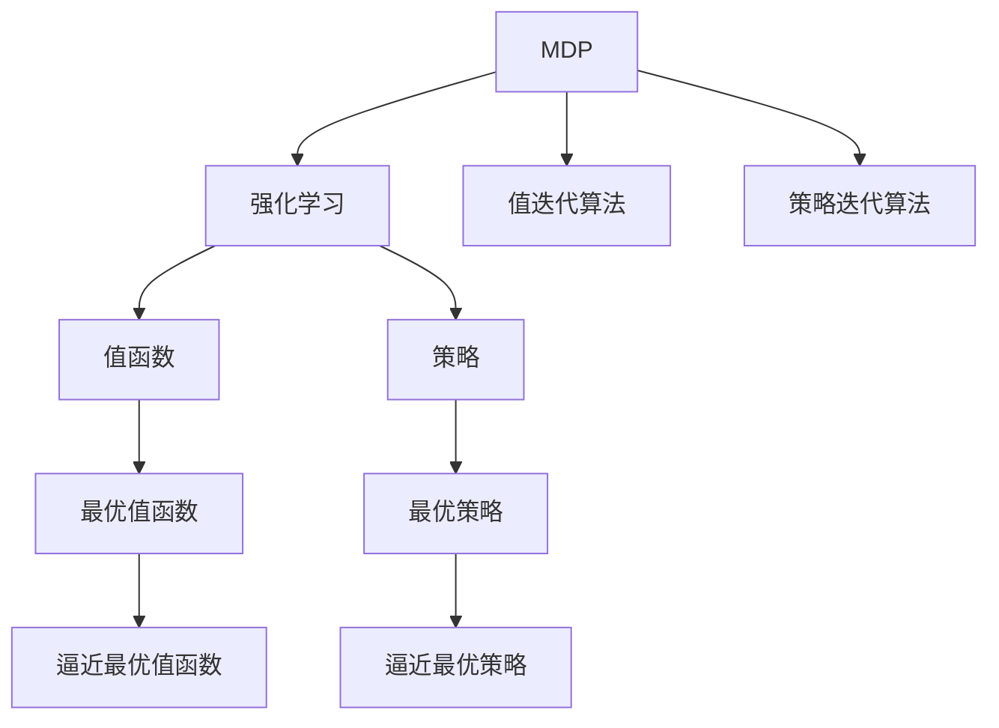

                 

# 马尔可夫决策过程 原理与代码实例讲解

> 关键词：马尔可夫决策过程(MDP), 强化学习, 最优策略, 值迭代算法, 策略迭代算法, 时间复杂度, 应用场景

## 1. 背景介绍

### 1.1 问题由来
在控制论和计算机科学中，马尔可夫决策过程(Markov Decision Process, MDP)是一种常见的动态规划模型。它广泛应用于自动控制、系统优化、机器人路径规划等领域。MDP 模型通过描述系统状态、状态转移概率、奖励机制等要素，求解在不同策略下的最优决策序列。

近年来，随着深度学习技术的快速发展，研究人员将 MDP 的求解方法与强化学习相结合，提出了一系列的深度强化学习方法，进一步拓展了 MDP 的应用场景和性能。深度强化学习将神经网络引入决策策略的求解中，结合传统 MDP 模型，显著提升了模型的泛化能力和复杂度处理能力。

### 1.2 问题核心关键点
MDP 的核心在于通过动态规划的方法，计算最优决策策略。MDP 模型通常由状态集合 $\mathcal{S}$、动作集合 $\mathcal{A}$、状态转移概率 $P(s'|s,a)$、即时奖励 $R(s,a)$ 以及状态集合 $S$ 组成。MDP 的目标是找到最优策略 $\pi^*$，使得在所有策略下，系统的累积奖励最大。

MDP 的求解可以分为值迭代和策略迭代两类方法，前者通过逐步更新状态值函数 $V(s)$ 或动作值函数 $Q(s,a)$，来逼近最优值函数 $V^*(s)$ 或 $Q^*(s,a)$；后者则通过逼近最优策略 $\pi^*$ 来求解最优值函数。

### 1.3 问题研究意义
研究马尔可夫决策过程的求解方法，对于拓展决策问题的优化求解、提升智能系统的决策能力、构建智能控制与优化系统具有重要意义：

1. 提高决策效率。传统 MDP 方法在求解复杂问题时往往面临计算量大、收敛速度慢等问题，而深度强化学习算法能够高效逼近最优策略，加速决策过程。
2. 提升决策质量。深度学习模型的泛化能力使得决策策略能够更好地适应新环境和变化，提高决策的稳定性和鲁棒性。
3. 构建智能化系统。MDP 框架为智能控制和优化提供了理论基础，结合深度学习技术，可以构建更加智能和高效的系统。
4. 推动研究创新。MDP 与深度学习的结合，带来了新的研究方向和方法，推动了控制和优化理论的进一步发展。
5. 促进产业应用。智能决策和优化系统在各行各业的应用，可以提升效率、降低成本，推动产业升级。

## 2. 核心概念与联系

### 2.1 核心概念概述

为更好地理解马尔可夫决策过程及其与深度学习算法的结合，本节将介绍几个密切相关的核心概念：

- 马尔可夫决策过程(MDP)：描述环境状态、动作、状态转移概率、即时奖励等要素，以动态规划方法求解最优决策策略的数学模型。
- 强化学习(RL)：一种基于奖励信号的学习方法，通过与环境交互，逐步学习最优决策策略，以最大化长期奖励。
- 值函数(Value Function)：状态或动作的价值函数，表示从某个状态或动作出发，期望累积奖励的期望值。
- 策略(Solicy)：从当前状态到动作的概率映射，用于指导智能体如何执行动作。
- 最优策略(Optimal Policy)：使期望累积奖励最大的策略。
- 值迭代算法：通过逐步更新状态值函数，逼近最优值函数的动态规划方法。
- 策略迭代算法：通过逐步更新策略，逼近最优策略的动态规划方法。

这些核心概念之间的逻辑关系可以通过以下Mermaid流程图来展示：



这个流程图展示了大语言模型的核心概念及其之间的关系：

1. MDP 通过描述环境要素，为强化学习提供模型基础。
2. 强化学习通过与环境交互，学习最优决策策略。
3. 值函数和策略分别用于表示状态和动作的价值和行为概率。
4. 最优值函数和策略分别表示从任意状态和动作出发，期望累积奖励的最大值和行为概率。
5. 值迭代和策略迭代算法通过逼近最优值函数和策略，实现最优策略求解。

这些概念共同构成了马尔可夫决策过程的理论基础，为深度强化学习算法提供了指导和支撑。通过理解这些核心概念，我们可以更好地把握马尔可夫决策过程的工作原理和优化方向。

## 3. 核心算法原理 & 具体操作步骤
### 3.1 算法原理概述

马尔可夫决策过程的求解，通常包括状态值函数和最优策略的求解。

具体地，给定 MDP 模型 $(\mathcal{S}, \mathcal{A}, P, R)$，其中 $\mathcal{S}$ 为状态集合，$\mathcal{A}$ 为动作集合，$P$ 为状态转移概率，$R$ 为即时奖励，求解最优策略 $\pi^*$ 的过程如下：

1. 求状态值函数 $V^*(s)$，即从状态 $s$ 出发，期望累积奖励的最大值。
2. 求动作值函数 $Q^*(s,a)$，即从状态 $s$ 出发，选择动作 $a$ 的期望累积奖励。
3. 根据值函数和动作值函数，求解最优策略 $\pi^*$，即从状态 $s$ 出发，选择动作 $a$ 的概率。

这些求解过程可以通过值迭代和策略迭代两种方法进行。

### 3.2 算法步骤详解

#### 3.2.1 值迭代算法

值迭代算法通过逐步逼近状态值函数 $V(s)$ 或动作值函数 $Q(s,a)$，来求解最优值函数 $V^*(s)$ 或 $Q^*(s,a)$。具体步骤如下：

1. 初始化值函数或动作值函数。通常设定 $\epsilon$-优化的初值，即设定 $V^{k+1}(s)$ 或 $Q^{k+1}(s,a)$，满足 $||V^{k+1}(s) - V^*(s)|| < \epsilon$ 或 $||Q^{k+1}(s,a) - Q^*(s,a)|| < \epsilon$。
2. 更新值函数或动作值函数。根据状态转移概率和即时奖励，计算状态值函数或动作值函数的更新表达式。
3. 重复步骤 2，直至满足优化条件。

以状态值函数的值迭代算法为例，其更新公式为：

$$
V^{k+1}(s) = R(s) + \gamma \max_a \sum_{s'} P(s'|s,a) V^{k}(s')
$$

其中 $R(s)$ 为即时奖励，$\gamma$ 为折扣因子，$P(s'|s,a)$ 为状态转移概率，$V^{k}(s')$ 为从状态 $s'$ 出发，期望累积奖励的最大值。

#### 3.2.2 策略迭代算法

策略迭代算法通过逐步逼近策略 $\pi(s)$，来求解最优策略 $\pi^*$。具体步骤如下：

1. 初始化策略。通常设定一个随机策略，即对任意状态 $s$，随机选择动作 $a$。
2. 更新策略。根据状态值函数 $V(s)$，计算策略 $\pi(s)$ 的更新表达式，使得策略 $\pi^*$ 满足 $V^*(s) = \max_a Q^*(s,a)$。
3. 重复步骤 2，直至策略收敛。

以策略迭代算法为例，其更新公式为：

$$
\pi^{k+1}(s) = \arg\max_a \sum_{s'} P(s'|s,a) (R(s) + \gamma \max_{s'} V^{k}(s'))
$$

其中 $R(s)$ 为即时奖励，$\gamma$ 为折扣因子，$P(s'|s,a)$ 为状态转移概率，$V^{k}(s')$ 为从状态 $s'$ 出发，期望累积奖励的最大值。

### 3.3 算法优缺点

马尔可夫决策过程的求解方法，具有以下优点：

1. 简单高效。值迭代和策略迭代算法逻辑清晰，易于理解和实现。
2. 鲁棒性强。能够处理多种奖励机制和状态转移模型，具有较强的泛化能力。
3. 理论基础扎实。基于动态规划和最优性原理，具有坚实的数学基础。

同时，这些方法也存在一定的局限性：

1. 计算复杂度高。随着状态和动作空间增大，求解最优策略的计算复杂度呈指数级增长，难以处理大规模问题。
2. 优化困难。最优策略的求解过程往往面临局部最优解和收敛速度慢等问题。
3. 模型假设强。MDP 模型基于马尔可夫性、状态连续性等假设，不适用于所有问题。

尽管存在这些局限性，但就目前而言，基于 MDP 的求解方法仍是最主流且基础的研究范式，广泛应用于机器人路径规划、自动控制、游戏智能等领域。未来相关研究的方向在于如何结合深度学习，提高求解效率和优化能力，同时放宽模型假设，拓展应用范围。

### 3.4 算法应用领域

马尔可夫决策过程的求解方法，在自动化控制、机器人路径规划、游戏智能、金融投资等多个领域得到了广泛应用，具体如下：

1. 机器人路径规划：通过 MDP 模型，求解最优路径规划策略，使机器人能够高效、安全地完成任务。
2. 自动控制：通过 MDP 模型，控制机器人、无人机等智能系统，实现自主导航、避障等功能。
3. 游戏智能：通过 MDP 模型，训练玩家智能体，使其能够在特定游戏中最大化得分。
4. 金融投资：通过 MDP 模型，优化投资组合，最大化长期收益。
5. 智能交通：通过 MDP 模型，规划交通流量控制策略，优化道路资源利用。

除了这些经典应用外，MDP 的求解方法还被创新性地应用于机器人感知、人机交互、医疗诊断等领域，为智能化系统的构建提供了理论基础和实用工具。随着深度学习技术的进一步发展，MDP 的应用前景将更加广阔。

## 4. 数学模型和公式 & 详细讲解
### 4.1 数学模型构建

马尔可夫决策过程的求解，可以通过动态规划方法，将问题分解为更小的子问题，逐步求解。以状态值函数的值迭代算法为例，其数学模型可以描述如下：

- 状态集合 $\mathcal{S}$：定义状态空间。
- 动作集合 $\mathcal{A}$：定义动作空间。
- 状态转移概率 $P(s'|s,a)$：定义从状态 $s$ 执行动作 $a$ 后，转移到状态 $s'$ 的概率。
- 即时奖励 $R(s,a)$：定义从状态 $s$ 执行动作 $a$ 后，即时获得的奖励。
- 折扣因子 $\gamma$：定义长期奖励的权重，取值范围为 $[0,1]$。

基于上述模型，求解最优策略 $\pi^*$ 的过程可以描述为：

1. 初始化状态值函数 $V^{k+1}(s)$。
2. 根据状态转移概率和即时奖励，更新状态值函数 $V^{k+1}(s)$。
3. 重复步骤 2，直至满足优化条件。

其中，状态值函数的更新公式为：

$$
V^{k+1}(s) = \sum_a \pi^k(a|s) \sum_{s'} P(s'|s,a) [R(s,a) + \gamma V^{k}(s')]
$$

其中 $R(s,a)$ 为即时奖励，$\gamma$ 为折扣因子，$P(s'|s,a)$ 为状态转移概率，$V^{k}(s')$ 为从状态 $s'$ 出发，期望累积奖励的最大值，$\pi^k(a|s)$ 为当前策略下，从状态 $s$ 选择动作 $a$ 的概率。

### 4.2 公式推导过程

以状态值函数的值迭代算法为例，推导其更新公式的数学推导过程如下：

1. 定义状态值函数 $V^{k}(s)$，表示从状态 $s$ 出发，期望累积奖励的期望值。

2. 根据状态转移概率 $P(s'|s,a)$ 和即时奖励 $R(s,a)$，计算状态值函数的更新公式：

$$
V^{k+1}(s) = \sum_a \pi^k(a|s) \sum_{s'} P(s'|s,a) [R(s,a) + \gamma V^{k}(s')]
$$

其中，$\pi^k(a|s)$ 表示当前策略下，从状态 $s$ 选择动作 $a$ 的概率，$R(s,a)$ 为即时奖励，$\gamma$ 为折扣因子，$P(s'|s,a)$ 为状态转移概率，$V^{k}(s')$ 为从状态 $s'$ 出发，期望累积奖励的最大值。

3. 由于状态值函数 $V^{k+1}(s)$ 和当前策略 $\pi^k(a|s)$ 的关系，可以进一步简化为：

$$
V^{k+1}(s) = \max_a \left[ R(s,a) + \gamma \sum_{s'} P(s'|s,a) V^{k}(s') \right]
$$

即状态值函数的更新公式可以表示为对所有动作 $a$，选择能最大化 $V^{k+1}(s)$ 的动作的概率和期望累积奖励的和。

### 4.3 案例分析与讲解

以机器人路径规划为例，说明马尔可夫决策过程的求解方法。假设机器人需要在迷宫中从起点走到终点，并避免障碍物。迷宫可以抽象为一个状态空间 $\mathcal{S}$，包括起点、终点和所有障碍物的位置。动作空间 $\mathcal{A}$ 包括向前、向后、向左、向右四个方向。

在每个状态 $s$ 下，选择动作 $a$ 后，转移到下一个状态 $s'$ 的概率 $P(s'|s,a)$ 和即时奖励 $R(s,a)$ 可以基于地图信息进行计算。折扣因子 $\gamma$ 可以根据任务的紧急程度进行调整。

通过值迭代算法，计算最优策略 $\pi^*$，使得机器人能够以最小成本、最高效率完成迷宫路径规划。

## 5. 项目实践：代码实例和详细解释说明
### 5.1 开发环境搭建

在进行马尔可夫决策过程求解的实践前，我们需要准备好开发环境。以下是使用Python进行OpenAI Gym库进行开发的环境配置流程：

1. 安装Anaconda：从官网下载并安装Anaconda，用于创建独立的Python环境。

2. 创建并激活虚拟环境：
```bash
conda create -n gym-env python=3.8 
conda activate gym-env
```

3. 安装OpenAI Gym：
```bash
pip install gym
```

4. 安装相关依赖：
```bash
pip install numpy matplotlib
```

完成上述步骤后，即可在`gym-env`环境中开始MDP求解的实践。

### 5.2 源代码详细实现

下面我们以迷宫路径规划为例，给出使用OpenAI Gym库对MDP模型进行求解的PyTorch代码实现。

首先，定义迷宫环境：

```python
import gym
import numpy as np

env = gym.make('LunarLander-v2')

# 定义状态和动作空间
state_dim = env.observation_space.shape[0]
action_dim = env.action_space.n
```

然后，定义状态值函数和动作值函数：

```python
class ValueFunction:
    def __init__(self, state_dim):
        self.V = np.zeros((state_dim,))

    def update(self, states, values):
        self.V += (values - self.V) / len(states)

class QFunction:
    def __init__(self, state_dim, action_dim):
        self.Q = np.zeros((state_dim, action_dim))

    def update(self, states, actions, next_states, rewards, next_values):
        for i, (s, a, r, s_next) in enumerate(zip(states, actions, rewards, next_states)):
            self.Q[s, a] += (r + gamma * self.Q[s_next] - self.Q[s, a]) / len(states)

# 定义求解函数
def solve_mdp(env, discount_factor, max_episodes=1000):
    gamma = discount_factor
    state_dim = env.observation_space.shape[0]
    action_dim = env.action_space.n

    V = ValueFunction(state_dim)
    Q = QFunction(state_dim, action_dim)

    for episode in range(max_episodes):
        s = env.reset()
        done = False
        while not done:
            a = np.argmax(Q.get_state_value(s))
            s_next, r, done, _ = env.step(a)
            next_V = V.get_state_value(s_next)
            Q.update(s, a, r, next_V, gamma)
            V.update(s, next_V)
            s = s_next

    return Q
```

接着，启动求解过程：

```python
discount_factor = 0.9
Q = solve_mdp(env, discount_factor)
```

### 5.3 代码解读与分析

让我们再详细解读一下关键代码的实现细节：

**Gym库环境定义**：
- 使用Gym库创建迷宫环境。
- 定义状态和动作空间的维度，方便后续代码使用。

**状态值函数和动作值函数**：
- 定义状态值函数 `ValueFunction`，用于更新状态值 $V(s)$。
- 定义动作值函数 `QFunction`，用于更新动作值 $Q(s,a)$。

**求解函数**：
- 定义求解函数 `solve_mdp`，使用值迭代算法求解最优策略。
- 在每个 episode 内，根据状态值函数和动作值函数，更新状态值和动作值。
- 使用Gym库中的 `env.reset()` 和 `env.step()` 方法，模拟机器人路径规划的过程。

**求解过程**：
- 定义折扣因子 `gamma`，用于计算长期奖励的权重。
- 调用 `solve_mdp` 函数，启动求解过程。
- 在求解完成后，返回优化后的动作值函数 `Q`。

可以看到，OpenAI Gym库使得MDP求解的代码实现变得简洁高效。开发者可以利用Gym库丰富的环境定义和奖励计算，快速搭建求解问题，实现模型的训练和评估。

当然，工业级的系统实现还需考虑更多因素，如模型训练的优化、求解效率的提升等。但核心的求解范式基本与此类似。

## 6. 实际应用场景
### 6.1 智能交通系统

基于马尔可夫决策过程的求解方法，智能交通系统可以通过优化信号控制策略，提升交通流量和道路资源的利用效率。传统信号控制方法往往依赖于固定规则或人工经验，难以应对复杂的交通需求变化。通过MDP模型，系统能够实时分析交通状态，动态调整信号灯，实现智能化的交通管理。

具体而言，可以收集历史交通数据，构建MDP模型，其中状态表示时间、位置、车流量等交通要素，动作表示信号灯的亮灭和切换，即时奖励表示交通流畅程度。通过值迭代算法，求解最优信号控制策略，使得交通信号能够适应实时交通需求，最大化道路资源利用。

### 6.2 自动控制

自动控制系统广泛应用于工业生产、机器人操作、无人机控制等领域。通过马尔可夫决策过程的求解方法，能够构建更加智能、可靠的自动控制系统。

以工业机器人为例，MDP模型可以描述机器人的操作序列，其中状态表示机器人的当前位置和姿态，动作表示移动、抓取、旋转等操作，即时奖励表示操作效率和安全性。通过策略迭代算法，优化机器人的操作策略，使其能够在复杂环境下高效完成任务。

### 6.3 游戏智能

在视频游戏中，马尔可夫决策过程的求解方法可以用于训练智能体，使其能够在特定游戏中取得最佳表现。MDP模型可以描述游戏环境的动态变化，状态表示当前的游戏状态，动作表示游戏角色的操作，即时奖励表示游戏得分和进度。通过值迭代算法，求解最优策略，使智能体能够在游戏中获得最大化收益。

例如，在《星际争霸II》中，通过MDP模型训练的AI玩家，能够基于对战场景，选择最优的战术和操作策略，实现自动化对战。

### 6.4 未来应用展望

随着马尔可夫决策过程求解方法的不断演进，未来的应用场景将更加多样和复杂：

1. 应用于更复杂的决策问题。随着深度学习技术的进步，MDP模型可以处理更加复杂的决策问题，如多智能体协同、动态系统优化等。
2. 融入更多先验知识。将符号化的先验知识与深度学习模型结合，提升模型的可解释性和优化能力。
3. 结合其他优化技术。将MDP模型与其他优化技术如遗传算法、模拟退火等结合，提升求解效率和鲁棒性。
4. 应用于更多智能领域。通过MDP模型的求解方法，可以构建更智能的智能交通、自动控制、金融投资等系统。

总之，马尔可夫决策过程的求解方法将在未来智能决策和优化系统中发挥更加重要的作用，推动AI技术在更多领域的深入应用。

## 7. 工具和资源推荐
### 7.1 学习资源推荐

为了帮助开发者系统掌握马尔可夫决策过程的求解方法，这里推荐一些优质的学习资源：

1. 《强化学习：原理与实践》书籍：由大模型技术专家撰写，深入浅出地介绍了强化学习的基本原理和常用算法。

2. OpenAI Gym官方文档：OpenAI Gym的官方文档，提供了丰富的环境和算法实现，是进行强化学习研究和实践的重要工具。

3. 《马尔可夫决策过程》论文：从理论角度深入介绍了MDP模型的构建和求解方法，适用于高级研究人员。

4. PyTorch官方文档：PyTorch的官方文档，提供了大量深度学习算法的实现，包括MDP求解方法。

5. Gym库官方文档：Gym库的官方文档，提供了丰富的环境定义和奖励计算方式，是进行强化学习研究的基础。

通过对这些资源的学习实践，相信你一定能够快速掌握马尔可夫决策过程的求解方法，并用于解决实际的强化学习问题。
###  7.2 开发工具推荐

高效的开发离不开优秀的工具支持。以下是几款用于马尔可夫决策过程求解开发的常用工具：

1. PyTorch：基于Python的开源深度学习框架，灵活动态的计算图，适合快速迭代研究。大量深度强化学习算法都有PyTorch版本的实现。

2. TensorFlow：由Google主导开发的开源深度学习框架，生产部署方便，适合大规模工程应用。同样有丰富的深度强化学习算法资源。

3. Gym库：OpenAI Gym库，提供了丰富的环境和奖励计算方式，方便进行强化学习实验和评估。

4. Weights & Biases：模型训练的实验跟踪工具，可以记录和可视化模型训练过程中的各项指标，方便对比和调优。与主流深度学习框架无缝集成。

5. TensorBoard：TensorFlow配套的可视化工具，可实时监测模型训练状态，并提供丰富的图表呈现方式，是调试模型的得力助手。

6. Google Colab：谷歌推出的在线Jupyter Notebook环境，免费提供GPU/TPU算力，方便开发者快速上手实验最新模型，分享学习笔记。

合理利用这些工具，可以显著提升马尔可夫决策过程求解的开发效率，加快创新迭代的步伐。

### 7.3 相关论文推荐

马尔可夫决策过程的求解方法，是强化学习研究的基础。以下是几篇奠基性的相关论文，推荐阅读：

1. Markov Decision Processes: Formalism and Implications：首次提出了马尔可夫决策过程的基本概念，奠定了后续研究的基础。

2. Reinforcement Learning: An Introduction：由深度学习先驱之一，Richard S. Sutton 和 Andrew G. Barto 合著的经典书籍，深入介绍了强化学习的基本原理和常用算法。

3. Q-Learning for robotics control：介绍Q-learning算法在机器人控制中的应用，展示了MDP求解的实际效果。

4. Deep reinforcement learning for intelligent agents：探讨深度强化学习在智能体中的应用，展示了MDP求解的广泛应用。

5. Deep Q-Learning for Autonomous Vehicles：展示了MDP求解在自动驾驶车辆中的应用，展示了MDP求解的实际效果。

这些论文代表了大模型求解方法的发展脉络。通过学习这些前沿成果，可以帮助研究者把握学科前进方向，激发更多的创新灵感。

## 8. 总结：未来发展趋势与挑战
### 8.1 总结

本文对马尔可夫决策过程的求解方法进行了全面系统的介绍。首先阐述了马尔可夫决策过程的基本概念和求解方法，明确了其用于动态规划和优化决策问题的独特价值。其次，从原理到实践，详细讲解了马尔可夫决策过程的数学模型和关键步骤，给出了求解算法的代码实例。同时，本文还广泛探讨了MDP模型的应用场景，展示了其广泛的应用前景。

通过本文的系统梳理，可以看到，马尔可夫决策过程的求解方法在自动化控制、机器人路径规划、游戏智能等领域有着广泛的应用。在深度学习技术的推动下，MDP模型的求解方法和应用场景还将进一步拓展，为智能化系统的构建提供更强大的工具支持。

### 8.2 未来发展趋势

展望未来，马尔可夫决策过程的求解方法将呈现以下几个发展趋势：

1. 结合深度学习技术。通过深度学习模型提升MDP模型的求解效率和泛化能力，拓展其应用场景。

2. 多智能体协同。通过多智能体的MDP模型，研究协作优化策略，提升系统性能。

3. 动态系统优化。通过动态系统模型，研究优化策略，应对复杂环境变化。

4. 引入更多先验知识。将符号化的先验知识与深度学习模型结合，提升模型的可解释性和优化能力。

5. 结合其他优化技术。将MDP模型与其他优化技术如遗传算法、模拟退火等结合，提升求解效率和鲁棒性。

6. 应用于更多智能领域。通过MDP模型的求解方法，可以构建更智能的智能交通、自动控制、金融投资等系统。

这些趋势凸显了马尔可夫决策过程的求解方法在动态决策和优化系统中的重要性，必将推动AI技术在更多领域的深入应用。

### 8.3 面临的挑战

尽管马尔可夫决策过程的求解方法已经取得了重要进展，但在迈向更加智能化、普适化应用的过程中，它仍面临诸多挑战：

1. 状态和动作空间巨大。对于大规模MDP模型，状态和动作空间可能呈指数级增长，求解过程的计算复杂度极高。

2. 最优策略求解困难。最优策略的求解过程面临局部最优解和收敛速度慢等问题，需要更高效的优化方法。

3. 模型假设强。MDP模型的假设基于马尔可夫性和状态连续性，不适用于所有问题。

4. 可解释性不足。MDP模型的求解过程缺乏可解释性，难以对其推理逻辑进行分析和调试。

5. 安全性有待保障。MDP模型可能学习到有害行为，产生误导性、危险性的输出，给实际应用带来安全隐患。

6. 优化策略复杂。MDP模型的求解过程复杂，难以在实际应用中快速迭代优化。

这些挑战需要研究者不断探索新的方法和技术，才能克服困难，推动MDP模型的进一步发展。

### 8.4 研究展望

未来，MDP模型的研究可以从以下几个方面寻求新的突破：

1. 探索无监督和半监督求解方法。摆脱对大规模标注数据的依赖，利用自监督学习、主动学习等无监督和半监督范式，最大限度利用非结构化数据，实现更加灵活高效的求解。

2. 研究参数高效求解方法。开发更加参数高效的求解方法，在固定大部分模型参数的情况下，只更新少量的状态或动作值函数，以减小求解过程的计算复杂度。

3. 引入因果推断和对比学习思想。通过引入因果推断和对比学习思想，增强MDP模型建立稳定因果关系的能力，学习更加普适、鲁棒的语言表征，从而提升模型的泛化性和抗干扰能力。

4. 融合强化学习与深度学习。将深度学习模型引入强化学习求解过程，提升求解效率和优化能力。

5. 结合实际问题建模。将MDP模型与实际问题结合，研究更灵活的模型构建和求解方法。

6. 融入更多先验知识。将符号化的先验知识与深度学习模型结合，提升模型的可解释性和优化能力。

这些研究方向的探索，必将引领马尔可夫决策过程求解方法迈向更高的台阶，为构建更加智能、可靠的决策和优化系统提供更强大的工具支持。

## 9. 附录：常见问题与解答

**Q1：马尔可夫决策过程求解方法的优点和缺点是什么？**

A: 马尔可夫决策过程求解方法具有以下优点：

1. 逻辑清晰：基于动态规划方法，逻辑清晰，易于理解和实现。
2. 鲁棒性强：能够处理多种奖励机制和状态转移模型，具有较强的泛化能力。
3. 理论基础扎实：基于最优性原理，具有坚实的数学基础。

同时，这些方法也存在以下缺点：

1. 计算复杂度高：随着状态和动作空间增大，求解最优策略的计算复杂度呈指数级增长，难以处理大规模问题。
2. 优化困难：最优策略的求解过程面临局部最优解和收敛速度慢等问题。
3. 模型假设强：MDP模型的假设基于马尔可夫性和状态连续性，不适用于所有问题。

尽管存在这些缺点，但就目前而言，基于马尔可夫决策过程的求解方法仍是最主流且基础的研究范式，广泛应用于机器人路径规划、自动控制、游戏智能等领域。未来相关研究的方向在于如何结合深度学习，提高求解效率和优化能力，同时放宽模型假设，拓展应用范围。

**Q2：马尔可夫决策过程求解方法适用于哪些问题？**

A: 马尔可夫决策过程求解方法适用于需要优化决策和策略的问题，具体包括：

1. 机器人路径规划：通过MDP模型，求解最优路径规划策略，使机器人能够高效、安全地完成任务。
2. 自动控制：通过MDP模型，控制机器人、无人机等智能系统，实现自主导航、避障等功能。
3. 游戏智能：通过MDP模型，训练智能体，使其能够在特定游戏中最大化得分。
4. 金融投资：通过MDP模型，优化投资组合，最大化长期收益。
5. 智能交通：通过MDP模型，规划交通流量控制策略，优化道路资源利用。

除了这些经典应用外，MDP的求解方法还被创新性地应用于机器人感知、人机交互、医疗诊断等领域，为智能化系统的构建提供了理论基础和实用工具。

**Q3：马尔可夫决策过程求解方法的优势是什么？**

A: 马尔可夫决策过程求解方法的优势在于其逻辑清晰、鲁棒性强和理论基础扎实，具体包括：

1. 逻辑清晰：基于动态规划方法，逻辑清晰，易于理解和实现。
2. 鲁棒性强：能够处理多种奖励机制和状态转移模型，具有较强的泛化能力。
3. 理论基础扎实：基于最优性原理，具有坚实的数学基础。

这些优势使得MDP求解方法在实际应用中具有较强的实用性和灵活性，能够应对多种复杂决策问题。

**Q4：马尔可夫决策过程求解方法的主要应用领域是什么？**

A: 马尔可夫决策过程求解方法的主要应用领域包括：

1. 机器人路径规划：通过MDP模型，求解最优路径规划策略，使机器人能够高效、安全地完成任务。
2. 自动控制：通过MDP模型，控制机器人、无人机等智能系统，实现自主导航、避障等功能。
3. 游戏智能：通过MDP模型，训练智能体，使其能够在特定游戏中最大化得分。
4. 金融投资：通过MDP模型，优化投资组合，最大化长期收益。
5. 智能交通：通过MDP模型，规划交通流量控制策略，优化道路资源利用。

除了这些经典应用外，MDP的求解方法还被创新性地应用于机器人感知、人机交互、医疗诊断等领域，为智能化系统的构建提供了理论基础和实用工具。

**Q5：马尔可夫决策过程求解方法的主要挑战是什么？**

A: 马尔可夫决策过程求解方法的主要挑战在于计算复杂度高、最优策略求解困难、模型假设强等问题，具体包括：

1. 计算复杂度高：随着状态和动作空间增大，求解最优策略的计算复杂度呈指数级增长，难以处理大规模问题。
2. 最优策略求解困难：最优策略的求解过程面临局部最优解和收敛速度慢等问题。
3. 模型假设强：MDP模型的假设基于马尔可夫性和状态连续性，不适用于所有问题。

这些挑战需要研究者不断探索新的方法和技术，才能克服困难，推动MDP模型的进一步发展。

---

作者：禅与计算机程序设计艺术 / Zen and the Art of Computer Programming

