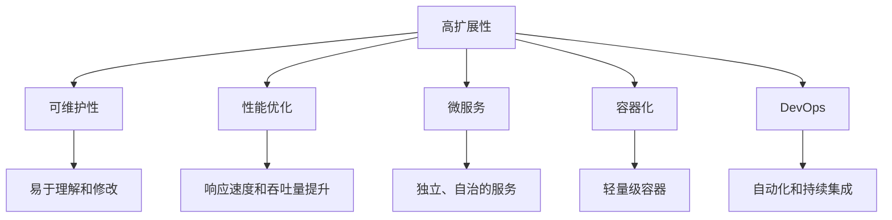
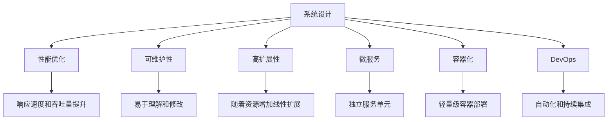

                 

# 高扩展性系统设计的关键要素

> 关键词：高扩展性,系统设计,性能优化,可维护性,微服务,容器化,DevOps

## 1. 背景介绍

在现代软件开发中，系统的高扩展性是一个永恒的主题。无论是互联网应用、大数据系统、云计算平台，还是物联网设备，高扩展性都是其成功与否的关键要素之一。高扩展性不仅关系到系统能否在用户量急剧增加时依然保持稳定运行，还关系到系统能否快速响应业务变化，持续提供高质量的服务。本文将从系统设计的角度，探讨高扩展性系统的关键要素，希望能为读者提供有价值的参考。

## 2. 核心概念与联系

### 2.1 核心概念概述

在讨论高扩展性系统的关键要素之前，首先需要明确几个核心概念：

- **高扩展性 (Scalability)**：指系统能够随着用户量的增加，线性或近似线性地增加资源（如服务器、内存、带宽等），以保持性能的稳定。
- **可维护性 (Maintainability)**：指系统容易理解和修改，新功能的开发和错误修复不需要太多成本。
- **性能优化 (Performance Optimization)**：指通过优化代码、算法和系统架构，提升系统的响应速度和吞吐量。
- **微服务 (Microservices)**：指将系统拆分成一组独立、自治的服务单元，每个服务单元围绕特定业务功能开发，并通过轻量级的通信机制（如HTTP或gRPC）进行交互。
- **容器化 (Containerization)**：指将应用及其依赖打包到轻量级的容器中，通过容器编排系统（如Kubernetes）进行部署和管理。
- **DevOps (Development Operations)**：指通过自动化、持续集成和持续交付等实践，提升软件交付速度和质量，降低运维成本。

这些概念之间相互关联，共同构成了高扩展性系统的设计基础。下面将通过一个Mermaid流程图展示这些概念之间的联系：



### 2.2 核心概念原理和架构的 Mermaid 流程图

以下是一个简化版的Mermaid流程图，展示了高扩展性系统设计中各个概念之间的相互关系：



该流程图展示了从系统设计到高扩展性的整体过程。设计时注重性能优化和可维护性，通过微服务架构和容器化部署提升系统的扩展性和灵活性，最终通过DevOps实践确保系统的高质量交付和高效运维。

## 3. 核心算法原理 & 具体操作步骤

### 3.1 算法原理概述

高扩展性系统设计的核心算法原理包括负载均衡、分布式架构、容错机制等。这些原理不仅适用于大规模互联网应用，也适用于数据密集型系统和分布式计算环境。

- **负载均衡 (Load Balancing)**：指将请求均匀分配到多个服务器上，以充分利用资源，提高系统吞吐量。
- **分布式架构 (Distributed Architecture)**：指将系统拆分成多个自治的服务单元，每个单元负责特定的业务功能，通过网络通信协同工作。
- **容错机制 (Fault Tolerance)**：指在系统某个组件发生故障时，能够自动切换到备用组件，保证系统持续可用。

### 3.2 算法步骤详解

高扩展性系统设计通常包括以下几个关键步骤：

**Step 1: 系统需求分析**
- 分析系统的业务需求，明确系统需要支持的用户量和并发请求量。
- 确定系统的功能模块和数据结构，确保设计能够满足业务需求。

**Step 2: 设计性能指标**
- 定义系统的响应时间、吞吐量、并发用户数等性能指标。
- 通过压力测试评估系统在不同负载下的表现，调整设计以满足性能指标。

**Step 3: 选择架构模式**
- 根据系统需求，选择合适的架构模式，如单体架构、微服务架构、微内核架构等。
- 确定系统的数据存储方式，如关系型数据库、NoSQL数据库、分布式文件系统等。

**Step 4: 实现负载均衡**
- 设计负载均衡算法，如轮询、加权轮询、随机等，均匀分配请求到多个服务器上。
- 使用负载均衡器，如Nginx、HAProxy等，实现动态调整服务器负载。

**Step 5: 实现分布式架构**
- 将系统拆分成多个独立的服务单元，每个单元负责特定业务功能。
- 使用轻量级通信协议，如HTTP/REST、gRPC等，实现服务之间的通信和数据交换。
- 使用容器编排系统，如Kubernetes，实现服务的自动化部署和调度。

**Step 6: 实现容错机制**
- 设计故障转移机制，确保某个服务单元故障时能够自动切换到备用单元。
- 使用冗余设计，如主备架构、多副本架构等，提高系统的可靠性。
- 实现数据一致性和事务处理，确保系统的数据完整性。

**Step 7: 优化性能**
- 使用缓存技术，如Redis、Memcached等，减少数据库的访问压力。
- 使用异步处理、批量处理等技术，提升系统处理能力。
- 优化代码和算法，减少不必要的计算和资源消耗。

**Step 8: 实现可维护性**
- 使用模块化设计，将系统划分为多个模块，每个模块独立开发和维护。
- 编写清晰、规范的代码，便于理解和修改。
- 使用版本控制工具，如Git，记录代码的变更历史，便于团队协作。

### 3.3 算法优缺点

高扩展性系统设计的算法有其独特的优点和缺点：

**优点**：
- 能够应对大规模用户量的增加，保持系统性能稳定。
- 通过分布式架构，能够提高系统的可扩展性和灵活性。
- 通过容错机制，能够提高系统的可靠性和可用性。

**缺点**：
- 系统设计复杂，需要多学科知识和经验。
- 实现和维护成本较高，需要团队协作和持续改进。
- 系统扩展时可能会面临网络延迟、数据一致性等问题。

### 3.4 算法应用领域

高扩展性系统设计的算法广泛应用于互联网应用、大数据系统、云计算平台等领域。例如：

- 互联网应用：如电商平台、社交网络、在线教育平台等。
- 大数据系统：如Hadoop、Spark、Flink等。
- 云计算平台：如AWS、Azure、阿里云等。

## 4. 数学模型和公式 & 详细讲解 & 举例说明

### 4.1 数学模型构建

高扩展性系统设计的数学模型通常基于负载均衡和分布式架构的设计。假设系统有$N$个服务器，每个服务器的处理能力为$C$，系统总处理能力为$N \times C$。假设每个请求的处理时间为$t$，则系统的吞吐量为$\frac{1}{t}$。假设系统负载均衡器将请求均匀分配到所有服务器上，则每个服务器的请求数为$\frac{R}{N}$，其中$R$为总请求数。则每个服务器的吞吐量为$\frac{1}{t} \times \frac{R}{N}$，系统的总吞吐量为$N \times \frac{1}{t} \times \frac{R}{N} = \frac{R}{tN}$。

### 4.2 公式推导过程

通过上述模型，可以得出系统的总吞吐量与请求数、服务器数和每个服务器的处理能力成正比，与请求的处理时间成反比。因此，通过增加服务器数或每个服务器的处理能力，可以线性或近似线性地提升系统的吞吐量。

### 4.3 案例分析与讲解

以一个典型的电商平台为例，分析其高扩展性设计。

假设该电商平台每天处理10万个订单，每个订单的处理时间约为1秒。使用单体架构，假设系统仅由一个服务器处理所有订单，则系统的最大吞吐量为10万个订单/秒。如果将系统拆分为10个服务器，每个服务器独立处理订单，每个订单的处理时间保持不变，则系统的总吞吐量可以线性增加到100万个订单/秒。

## 5. 项目实践：代码实例和详细解释说明

### 5.1 开发环境搭建

在实际开发高扩展性系统时，需要搭建一个包含多台服务器的环境。以下是一个简单的搭建流程：

1. 选择合适的服务器硬件，确保足够的计算能力和内存。
2. 安装操作系统和必需的软件，如Nginx、HAProxy、Kubernetes等。
3. 配置网络环境，确保不同服务器之间的通信畅通。
4. 设置负载均衡器，实现请求的动态分配。

### 5.2 源代码详细实现

以下是一个基于微服务架构的电商平台订单处理系统的代码实现：

```python
class OrderService:
    def __init__(self, config):
        self.config = config
        self.server = None
        self.load_balancer = None

    def start(self):
        # 初始化服务器和负载均衡器
        self.server = Server(self.config)
        self.load_balancer = LoadBalancer(self.config)

    def process_order(self, order):
        # 将订单请求分配到负载均衡器
        self.load_balancer.distribute(order)
        # 处理订单请求
        return self.server.process(order)

class Server:
    def __init__(self, config):
        self.config = config

    def process(self, order):
        # 处理订单请求
        return order

class LoadBalancer:
    def __init__(self, config):
        self.config = config
        self.servers = []

    def distribute(self, order):
        # 根据负载均衡策略分配请求到服务器
        server = self.choose_server()
        server.process_order(order)

    def choose_server(self):
        # 随机选择一个服务器
        return random.choice(self.servers)
```

### 5.3 代码解读与分析

以上代码实现了一个基于负载均衡的电商平台订单处理系统。其中，`OrderService`类负责初始化服务器和负载均衡器，并处理订单请求。`Server`类代表一个独立的订单处理服务器，负责处理具体的订单请求。`LoadBalancer`类则负责将订单请求均匀分配到不同的服务器上。

### 5.4 运行结果展示

通过上述代码，可以构建一个高扩展性的电商平台订单处理系统。以下是一个简单的运行结果：

```python
# 假设共有10个订单需要处理
orders = []
for i in range(10):
    order = {'id': i, 'product': 'item'}
    orders.append(order)

# 启动订单服务
order_service = OrderService(config)
order_service.start()

# 处理订单请求
for order in orders:
    result = order_service.process_order(order)
    print(f"Order {result['id']} processed successfully.")
```

## 6. 实际应用场景

### 6.1 电商平台的扩展性

电商平台是一个典型的高扩展性系统。随着用户数量的增加，电商平台的订单处理、库存管理、物流跟踪等业务需要线性或近似线性地增加计算资源，才能保持系统性能的稳定。

### 6.2 金融系统的扩展性

金融系统需要处理大量的交易数据和用户请求，高扩展性设计可以有效应对高峰期的高并发请求，确保系统稳定运行。

### 6.3 医疗系统的扩展性

医疗系统需要处理大量的患者数据和医生请求，高扩展性设计可以确保系统能够应对突发性的高峰期，提供高质量的医疗服务。

### 6.4 未来应用展望

随着技术的不断进步，高扩展性系统设计将面临更多的挑战和机遇：

- 边缘计算：通过在靠近数据源的边缘设备上进行数据处理，减少延迟，提升系统的实时性。
- 混合云架构：将系统部署在多个云平台，利用不同云平台的优势，提升系统的可扩展性和可用性。
- 区块链技术：利用区块链的分布式账本技术，提升系统的透明性和安全性。
- 自动化运维：通过DevOps实践，实现自动化部署、监控和运维，提高系统的稳定性和效率。

## 7. 工具和资源推荐

### 7.1 学习资源推荐

1. 《高扩展性系统设计》一书：详细介绍了高扩展性系统设计的原理和实践，涵盖负载均衡、分布式架构、容错机制等关键技术。
2. 《微服务架构设计》一书：探讨了微服务架构的设计原则和实践方法，适用于高扩展性系统的设计和开发。
3. Kubernetes官方文档：Kubernetes的官方文档，提供了丰富的实例和案例，帮助开发者深入理解容器编排系统。
4. Docker官方文档：Docker的官方文档，提供了容器化的实现方法和最佳实践，适用于高扩展性系统的容器化部署。
5. Ansible官方文档：Ansible的官方文档，提供了自动化运维的实现方法和最佳实践，适用于高扩展性系统的自动化部署和运维。

### 7.2 开发工具推荐

1. Git：版本控制工具，用于记录代码的变更历史，便于团队协作和版本管理。
2. Jenkins：持续集成和持续交付工具，用于自动化构建、测试和部署。
3. Ansible：自动化运维工具，用于自动化部署和管理多台服务器。
4. Prometheus：监控工具，用于实时监控系统的性能和资源使用情况。
5. Grafana：可视化工具，用于展示监控数据，提供直观的性能分析。

### 7.3 相关论文推荐

1. Scalability and Availability in Internet Applications by Christian Lopez（1999）：介绍了互联网应用的高扩展性和可用性设计，具有经典性和参考价值。
2. Microservices: A Service-Oriented Architecture and Composition with Friends, Not Strangers by Martin Fowler（2014）：探讨了微服务架构的设计原则和实践方法，适用于高扩展性系统的设计和开发。
3. Cloud-Native Applications: Build, Ship, Run by Matt Wade（2018）：介绍了云原生技术在高扩展性系统中的应用，涵盖容器化、服务网格、自动化运维等。
4. Kubernetes: Upcoming and Enhanced Features by Kubernetes Community（2020）：介绍了Kubernetes的新特性和增强功能，适用于高扩展性系统的容器编排和运维。
5. DevOps: The Journey and Transformation by Gene Kim, Patrick Debois, and John Willis（2014）：介绍了DevOps的实践方法和持续交付的实现，适用于高扩展性系统的自动化运维和部署。

## 8. 总结：未来发展趋势与挑战

### 8.1 研究成果总结

本文详细介绍了高扩展性系统设计的关键要素，包括性能优化、可维护性、微服务、容器化、DevOps等。通过实例分析，展示了高扩展性系统设计在电商平台、金融系统、医疗系统等场景中的应用。

### 8.2 未来发展趋势

未来高扩展性系统设计将继续向着自动化、智能化和混合云方向发展：

1. 自动化：通过DevOps实践，实现自动化构建、测试、部署和运维，提升系统的交付速度和效率。
2. 智能化：通过人工智能和大数据技术，实现系统的自适应和自优化，提升系统的性能和灵活性。
3. 混合云：通过混合云架构，利用不同云平台的优势，提升系统的可用性和扩展性。

### 8.3 面临的挑战

尽管高扩展性系统设计在技术上已取得了不少进展，但仍面临一些挑战：

1. 复杂性：高扩展性系统的设计涉及多个学科知识和实践经验，需要跨团队协作。
2. 安全性：高扩展性系统需要应对分布式环境下的安全威胁，如数据泄露、DDoS攻击等。
3. 可维护性：高扩展性系统的代码和架构设计需要考虑到可维护性，以便于未来的升级和维护。

### 8.4 研究展望

未来高扩展性系统设计的研究方向包括：

1. 边缘计算：通过在边缘设备上进行数据处理，减少延迟，提升系统的实时性。
2. 区块链技术：利用区块链的分布式账本技术，提升系统的透明性和安全性。
3. 自动化运维：通过DevOps实践，实现自动化部署、监控和运维，提高系统的稳定性和效率。
4. 混合云架构：将系统部署在多个云平台，利用不同云平台的优势，提升系统的可扩展性和可用性。

## 9. 附录：常见问题与解答

**Q1：高扩展性系统设计是否适用于所有应用场景？**

A: 高扩展性系统设计适用于需要应对大规模用户量和高峰期需求的应用场景，如电商、金融、医疗等。对于低负载场景，可能无需进行高扩展性设计。

**Q2：如何选择合适的负载均衡算法？**

A: 选择合适的负载均衡算法需要考虑系统的业务特性和数据分布。常见的负载均衡算法包括轮询、加权轮询、随机等。对于数据负载不均衡的场景，可以使用加权轮询算法。

**Q3：高扩展性系统设计中的容错机制如何实现？**

A: 高扩展性系统设计中的容错机制可以通过主备架构、多副本架构等实现。主备架构中，主要服务器故障时自动切换到备用服务器。多副本架构中，多个服务器同时处理相同请求，当一个服务器故障时，其他服务器可以继续处理请求，保证系统的高可用性。

**Q4：如何优化高扩展性系统的性能？**

A: 高扩展性系统的性能优化可以通过缓存技术、异步处理、批量处理等技术实现。使用缓存技术可以减少数据库的访问压力，提升系统的响应速度。异步处理和批量处理则可以提高系统的处理能力，提升吞吐量。

**Q5：高扩展性系统设计中的安全性如何保障？**

A: 高扩展性系统设计中的安全性可以通过数据加密、访问控制、DDoS防护等技术实现。数据加密可以保护数据传输和存储的安全性，访问控制可以限制访问权限，防止未授权访问。DDoS防护可以防止恶意流量攻击，确保系统的高可用性。

---

作者：禅与计算机程序设计艺术 / Zen and the Art of Computer Programming

