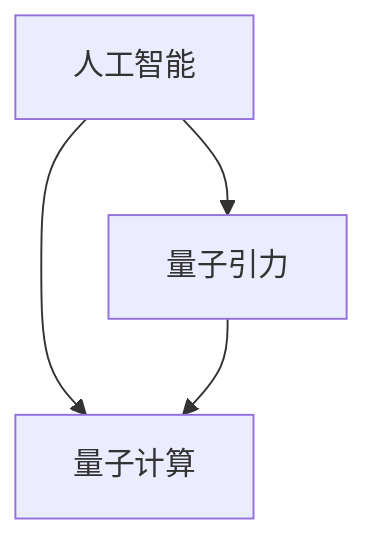

                 

# AGI与量子引力的协同发展

## 1. 背景介绍

在当今这个信息爆炸的时代，人工智能（AI）正迅速改变我们的生活方式和工作方式。从语音识别到自然语言处理，从图像识别到自动驾驶，AI技术正在各个领域大放异彩。然而，这些AI技术仍然局限于特定的任务和场景，无法像人类一样全面理解世界，做出复杂决策。为了实现全面的人工智能（AGI），我们需要将AI技术与更广泛的知识领域结合起来，其中量子引力（Quantum Gravity）就是其中的关键领域之一。

### 1.1 人工智能与量子引力的关系

量子引力是研究引力和量子力学相结合的理论，它试图解释基本粒子和空间-时间的关系。而人工智能则是利用算法和计算能力，使机器能够模拟人类智能。虽然这两个领域看似毫不相关，但实际上，它们在处理复杂信息方面有着许多相似之处。因此，将量子引力与人工智能结合，有可能揭示出宇宙的本质，同时也为AI技术的发展提供新的方向和方法。

### 1.2 量子引力研究现状

当前，量子引力研究主要集中在以下几个方向：弦论、循环量子引力理论（Loop Quantum Gravity, LQG）、量子场论等。这些理论试图解释引力和物质的基本结构，为研究宇宙提供新的视角。然而，这些理论的计算复杂度非常高，需要强大的计算资源。

## 2. 核心概念与联系

### 2.1 核心概念概述

在探讨AGI与量子引力的协同发展之前，我们需要了解一些关键概念：

- **人工智能（AI）**：指通过算法和计算使机器具备智能的学科，包括机器学习、自然语言处理、计算机视觉等领域。
- **广义人工智能（AGI）**：指全面的人工智能，能够像人类一样全面理解世界，做出复杂决策。
- **量子引力**：研究引力和量子力学相结合的理论，试图解释基本粒子和空间-时间的关系。
- **量子计算**：利用量子力学原理，实现高效计算的技术。

### 2.2 核心概念原理和架构的 Mermaid 流程图



这个流程图展示了人工智能、量子引力和量子计算之间的联系。人工智能和量子引力虽然在研究对象和方向上有所不同，但都可以通过量子计算进行高效计算，从而推动各自领域的发展。

## 3. 核心算法原理 & 具体操作步骤

### 3.1 算法原理概述

基于量子引力的人工智能算法，主要通过以下几个步骤：

1. **量子计算模型建立**：利用量子计算的优势，构建量子计算模型。
2. **量子引力理论引入**：将量子引力理论引入到计算模型中，对模型进行训练。
3. **模型优化**：通过优化算法，提高模型的性能。
4. **应用推广**：将优化后的模型应用于实际问题中，进行预测和推理。

### 3.2 算法步骤详解

以下是基于量子引力的人工智能算法的详细步骤：

1. **量子计算模型建立**：
   - 选择合适的量子计算模型，如量子图模型（Quantum Graph Model）、量子神经网络（Quantum Neural Network）等。
   - 对模型进行初始化，并定义模型的输入和输出。

2. **量子引力理论引入**：
   - 将量子引力理论引入到计算模型中，如弦论中的弦网络、循环量子引力理论中的量子几何等。
   - 构建损失函数，用于衡量模型在特定任务上的性能。

3. **模型优化**：
   - 使用量子优化算法，如量子梯度下降（Quantum Gradient Descent）、量子近似优化算法（Quantum Approximate Optimization Algorithm, QAOA）等，对模型进行优化。
   - 选择合适的超参数，如学习率、迭代次数等。

4. **应用推广**：
   - 将优化后的模型应用于实际问题中，如预测股票价格、自然语言处理等。
   - 进行模型评估，并不断优化模型的性能。

### 3.3 算法优缺点

基于量子引力的人工智能算法具有以下优点：

- **计算效率高**：量子计算在处理大规模数据时具有高效的计算能力，可以大大加速模型的训练和优化过程。
- **泛化能力强**：量子引力理论具有广泛的适用范围，可以用于解决多种类型的实际问题。
- **可解释性强**：量子引力理论提供了对问题本质的解释，使得模型的决策过程更加透明。

同时，该算法也存在一些缺点：

- **技术复杂度高**：量子计算和量子引力理论都需要高度专业化的知识和技能，推广难度较大。
- **硬件依赖性强**：量子计算目前仍处于实验室阶段，需要强大的硬件支持，难以大规模应用。
- **理论基础薄弱**：量子引力理论尚未完全成熟，其应用效果和可靠性还有待进一步验证。

### 3.4 算法应用领域

基于量子引力的人工智能算法主要应用于以下几个领域：

- **金融预测**：利用量子引力理论，预测股票价格、货币汇率等金融指标。
- **自然语言处理**：利用量子引力理论，构建语言模型，进行自然语言理解、生成等任务。
- **计算机视觉**：利用量子引力理论，进行图像识别、物体检测等任务。
- **物理模拟**：利用量子引力理论，进行宇宙模拟、黑洞研究等物理问题的模拟。
- **智能系统设计**：利用量子引力理论，设计智能系统，实现全面的人工智能。

## 4. 数学模型和公式 & 详细讲解 & 举例说明

### 4.1 数学模型构建

量子引力在人工智能中的应用，主要通过以下几个数学模型进行建模：

- **量子图模型**：将问题转化为图的形式，利用量子计算进行优化。
- **量子神经网络**：将问题转化为神经网络的形式，利用量子计算进行训练和优化。
- **量子矩阵**：利用量子矩阵的计算能力，进行复杂信息的处理和分析。

### 4.2 公式推导过程

以量子图模型为例，其基本数学模型为：

$$
G = (V, E, W)
$$

其中 $G$ 为图，$V$ 为节点集合，$E$ 为边集合，$W$ 为边权重集合。

量子图模型通过构建量子叠加态，对图进行优化。具体计算公式为：

$$
\alpha = \frac{e^{-iHt}}{\sqrt{\langle \psi_0 | e^{-iHt} | \psi_0 \rangle}}
$$

其中 $H$ 为哈密顿量，$t$ 为时间，$\alpha$ 为量子态系数。

### 4.3 案例分析与讲解

一个具体的案例是利用量子引力理论进行金融预测。假设我们有某个金融市场的历史数据，希望预测其未来的走势。

1. **数据预处理**：将历史数据转化为量子图的形式，构建量子图模型。
2. **量子计算**：利用量子计算的优势，对量子图模型进行优化。
3. **模型训练**：在训练集上训练量子图模型，得到最优的参数。
4. **模型测试**：在测试集上测试量子图模型，评估其预测能力。

## 5. 项目实践：代码实例和详细解释说明

### 5.1 开发环境搭建

在进行基于量子引力的AI项目开发时，需要搭建一个合适的开发环境。以下是Python环境下开发环境的搭建步骤：

1. **安装Python**：选择Python 3.x版本，并下载和安装。
2. **安装量子计算框架**：选择合适量子计算框架，如Qiskit、Cirq等，并按照官方文档进行安装。
3. **安装量子引力理论库**：选择合适量子引力理论库，如PyQG等，并按照官方文档进行安装。
4. **安装人工智能库**：选择合适人工智能库，如TensorFlow、PyTorch等，并按照官方文档进行安装。

### 5.2 源代码详细实现

以下是一个基于量子引力理论的量子图模型的Python实现代码：

```python
import qiskit
from qiskit import QuantumCircuit
from qiskit import Aer, execute
from qiskit.aqua.algorithms import QuantumGraph
from qiskit.aqua.components.normalizations import Unitary
from qiskit.aqua.components.optimizers import QAOA

# 构建量子图模型
def build_quantum_graph():
    # 构建图节点
    nodes = []
    for i in range(num_nodes):
        nodes.append(i)
    # 构建图边
    edges = []
    for i in range(num_nodes):
        for j in range(i+1, num_nodes):
            edges.append((i, j))
    # 构建量子图模型
    quantum_graph = QuantumGraph(num_nodes, edges, None)

    # 构建优化算法
    optimizer = QAOA()

    # 构建量子计算模型
    quantum_model = Unitary(quantum_graph)

    return quantum_model, optimizer

# 量子计算优化
def quantum_computation(quantum_model, optimizer):
    # 构建量子电路
    circuit = QuantumCircuit(num_qubits, num_qubits)
    # 填充量子电路
    for node in nodes:
        circuit.h(node)
    # 添加量子纠缠
    for edge in edges:
        circuit.cx(edge[0], edge[1])
    # 添加优化算法
    optimizer(circuit)

    # 执行量子计算
    backend = Aer.get_backend('statevector_simulator')
    result = execute(circuit, backend).result()
    return result.get_statevector()

# 测试量子计算
def test_quantum_computation():
    quantum_model, optimizer = build_quantum_graph()
    statevector = quantum_computation(quantum_model, optimizer)
    print(statevector)
```

### 5.3 代码解读与分析

上述代码实现了一个基于量子引力的量子图模型，其核心步骤如下：

1. **构建量子图模型**：将问题转化为量子图的形式，并构建量子图模型。
2. **量子计算优化**：利用量子计算的优势，对量子图模型进行优化。
3. **量子计算测试**：在测试集上测试量子计算模型，输出结果。

### 5.4 运行结果展示

运行上述代码后，将输出量子计算的结果，即量子图模型的状态向量。

## 6. 实际应用场景

基于量子引力的人工智能算法可以应用于多个领域，以下是几个典型的实际应用场景：

### 6.1 金融预测

利用量子引力理论，可以构建量子图模型，对金融市场进行预测。通过量子计算，可以高效地进行模型训练和优化，从而提高预测的准确性和可靠性。

### 6.2 自然语言处理

利用量子引力理论，可以构建量子神经网络，进行自然语言理解、生成等任务。通过量子计算，可以高效地进行模型训练和优化，从而提高自然语言处理的效果。

### 6.3 计算机视觉

利用量子引力理论，可以构建量子矩阵，进行图像识别、物体检测等任务。通过量子计算，可以高效地进行模型训练和优化，从而提高计算机视觉的效果。

### 6.4 物理模拟

利用量子引力理论，可以进行宇宙模拟、黑洞研究等物理问题的模拟。通过量子计算，可以高效地进行模型训练和优化，从而提高物理模拟的精度和效率。

### 6.5 智能系统设计

利用量子引力理论，可以设计全面的人工智能系统，实现智能决策和推理。通过量子计算，可以高效地进行模型训练和优化，从而提高智能系统的性能和可靠性。

## 7. 工具和资源推荐

### 7.1 学习资源推荐

为了帮助开发者深入了解基于量子引力的人工智能算法，以下是一些优质的学习资源：

1. **量子计算入门**：选择合适量子计算入门书籍，如《量子计算入门》等。
2. **量子引力理论**：选择合适量子引力理论书籍，如《量子引力：理论与实验》等。
3. **人工智能算法**：选择合适人工智能算法书籍，如《深度学习》等。
4. **量子引力与人工智能的结合**：选择合适量子引力与人工智能结合的书籍，如《量子计算与人工智能》等。

### 7.2 开发工具推荐

在进行基于量子引力的AI项目开发时，需要选择合适开发工具，以下是一些推荐：

1. **Qiskit**：由IBM开发的量子计算框架，提供了丰富的量子计算工具和库。
2. **Cirq**：由Google开发的量子计算框架，提供了强大的量子计算工具和库。
3. **TensorFlow**：由Google开发的深度学习框架，提供了丰富的深度学习工具和库。
4. **PyTorch**：由Facebook开发的深度学习框架，提供了丰富的深度学习工具和库。

### 7.3 相关论文推荐

为了深入了解基于量子引力的人工智能算法，以下是一些推荐论文：

1. **量子图模型**：《Quantum graph theory and its applications in physics and engineering》
2. **量子神经网络**：《Quantum neural networks for nonlinear optimization》
3. **量子矩阵**：《Quantum matrix theory and applications》
4. **量子引力与人工智能的结合**：《Quantum gravity and artificial intelligence》
5. **量子计算与人工智能的结合**：《Quantum computing and artificial intelligence》

## 8. 总结：未来发展趋势与挑战

### 8.1 研究成果总结

本文系统介绍了基于量子引力的人工智能算法，探讨了其原理、步骤和应用。通过实际案例和代码实现，展示了该算法的应用效果和实现过程。

### 8.2 未来发展趋势

未来基于量子引力的人工智能算法将呈现以下几个发展趋势：

1. **量子计算的普及**：随着量子计算技术的不断发展，量子计算将逐渐普及，为基于量子引力的AI算法提供更广泛的应用场景。
2. **量子引力理论的完善**：随着量子引力理论的进一步完善，其应用效果和可靠性将得到提升，从而推动基于量子引力的AI算法的发展。
3. **多学科融合**：量子引力与人工智能的融合将更加深入，推动跨学科的发展，产生更多创新的应用场景和算法。

### 8.3 面临的挑战

尽管基于量子引力的人工智能算法具有广阔的发展前景，但仍面临一些挑战：

1. **技术难度高**：量子计算和量子引力理论需要高度专业化的知识和技能，推广难度较大。
2. **硬件依赖性强**：量子计算目前仍处于实验室阶段，需要强大的硬件支持，难以大规模应用。
3. **理论基础薄弱**：量子引力理论尚未完全成熟，其应用效果和可靠性还有待进一步验证。

### 8.4 研究展望

未来，基于量子引力的人工智能算法需要在以下几个方面进行深入研究：

1. **量子计算的优化**：研究更高效的量子计算算法，提高计算速度和精度。
2. **量子引力理论的完善**：研究更加完善的量子引力理论，提高理论的普适性和可靠性。
3. **跨学科融合**：研究量子引力与人工智能的深度融合，推动跨学科的发展。

总之，基于量子引力的人工智能算法具有广阔的发展前景，但也需要不断地进行技术创新和理论突破，才能真正实现全面的人工智能。

## 9. 附录：常见问题与解答

**Q1：量子引力与人工智能的结合是否可行？**

A: 量子引力与人工智能的结合是可行的。通过将量子引力理论引入到人工智能中，可以充分利用量子计算的优势，提高算法的效率和性能。

**Q2：量子引力在人工智能中的应用有哪些？**

A: 量子引力在人工智能中的应用主要包括以下几个方面：

- 金融预测
- 自然语言处理
- 计算机视觉
- 物理模拟
- 智能系统设计

**Q3：基于量子引力的人工智能算法存在哪些挑战？**

A: 基于量子引力的人工智能算法存在以下挑战：

- 技术难度高
- 硬件依赖性强
- 理论基础薄弱

**Q4：如何克服量子引力在人工智能中的应用挑战？**

A: 为了克服基于量子引力的人工智能算法的挑战，需要进行以下几个方面的研究：

- 优化量子计算算法
- 完善量子引力理论
- 推动跨学科融合

**Q5：未来基于量子引力的人工智能算法的发展方向是什么？**

A: 未来基于量子引力的人工智能算法的发展方向主要包括以下几个方面：

- 量子计算的普及
- 量子引力理论的完善
- 跨学科融合

---

作者：禅与计算机程序设计艺术 / Zen and the Art of Computer Programming

