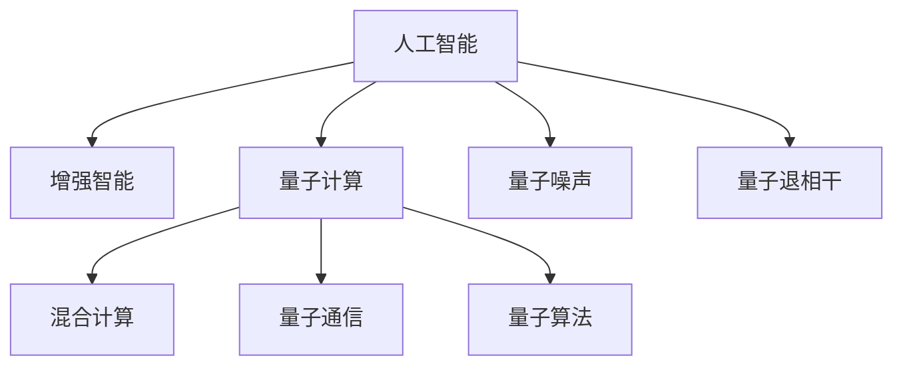

                 

# AGI与量子科学的结合

> 关键词：

## 1. 背景介绍

### 1.1 问题由来
随着人工智能(AI)技术的迅猛发展，增强智能(AGI)的概念引起了广泛关注。AGI是一种拥有人类级别智慧和创造力的智能，能够自主理解、学习、推理和决策，并在多个领域展现人类级的表现。尽管当前AI技术已经取得了显著进展，但要实现AGI仍面临着诸多技术和理论挑战。

其中，量子计算技术的崛起，为解决这些挑战提供了新的视角。量子计算以其处理速度和并行性优势，有望在算法、数据处理、优化等方面带来革命性突破，助力AGI的实现。

### 1.2 问题核心关键点
AGI与量子科学的结合，将带来以下几个核心问题：
- 如何设计高效的混合量子-经典算法，实现复杂的推理和决策。
- 如何高效地将大规模量子并行性应用于AGI的计算过程中。
- 如何构建可靠的量子通信网络，支撑AGI系统的运行和数据交互。
- 如何应对量子噪声和量子退相干，提升量子计算系统的稳定性和可靠性。
- 如何结合经典和量子计算的优势，构建更加通用的AGI系统。

### 1.3 问题研究意义
研究AGI与量子科学的结合，对于推动AI技术向更高级别的智能演化，提升人类认知水平和社会生产力，具有重要意义：

1. 加速知识创新：AGI能够高效处理海量数据，加速知识积累和创新，提升科学研究的效率。
2. 解决复杂问题：量子计算可以处理传统计算机难以处理的复杂问题，如药物设计、材料科学等，为AGI提供强有力的支持。
3. 提升决策质量：AGI可以通过大量数据分析，辅助决策者做出更精准、更合理的决策。
4. 推动技术变革：量子计算技术的发展将推动AGI技术体系的成熟，带动计算、通信、网络等领域的技术进步。
5. 促进产业应用：AGI技术的应用将拓展到更多行业，如医疗、金融、教育、制造等，促进社会生产力的提升。

## 2. 核心概念与联系

### 2.1 核心概念概述

为更好地理解AGI与量子科学的结合方法，本节将介绍几个密切相关的核心概念：

- 人工智能(AI)：使计算机系统通过学习、推理、感知和决策，模拟人类智能行为。
- 增强智能(AGI)：拥有类人级别的智慧和创造力，能够在多个领域展现出人类水平的智能表现。
- 量子计算(QC)：利用量子力学的原理，实现信息的高效处理和并行计算。
- 混合计算(MC)：将经典计算与量子计算相结合，发挥各自优势的计算范式。
- 量子噪声(QN)：量子计算过程中由于量子态的衰减和干扰导致的错误，影响量子计算的准确性。
- 量子退相干(QD)：量子态失去相干性，导致量子信息无法保持，影响量子计算的稳定性。
- 量子通信(QC)：利用量子态的纠缠和传输特性，实现高安全、高效率的数据通信。
- 量子算法(QA)：为解决特定问题，通过量子计算原理设计的高效算法。

这些核心概念之间的逻辑关系可以通过以下Mermaid流程图来展示：



这个流程图展示了大语言模型的核心概念及其之间的关系：

1. 人工智能通过增强智能的辅助，得以提升决策和推理能力，向更高层次发展。
2. 量子计算技术为人工智能提供计算和处理上的支持，带来效率上的显著提升。
3. 混合计算将经典和量子计算结合，发挥各自优势，提升复杂问题的求解能力。
4. 量子噪声和量子退相干影响量子计算的准确性和稳定性，需要结合算法和硬件进行优化。
5. 量子通信技术为AGI系统的数据交互提供安全高效的方式。
6. 量子算法为特定问题提供高效的计算解决方案，推动AGI的广泛应用。

这些概念共同构成了AGI与量子科学的结合框架，使得AGI系统能够利用量子计算的优势，提升其在多个领域的表现。

## 3. 核心算法原理 & 具体操作步骤
### 3.1 算法原理概述

AGI与量子科学的结合，本质上是一个基于混合计算范式的复杂系统工程。其核心思想是：将经典计算与量子计算相结合，通过设计高效的混合算法，实现复杂的推理和决策过程。

形式化地，假设AGI模型为 $M$，其中包含经典计算模块 $M_{\text{classic}}$ 和量子计算模块 $M_{\text{quantum}}$。给定任务 $T$ 的数据集 $D=\{(x_i,y_i)\}_{i=1}^N$，AGI模型的优化目标是最小化经验风险，即找到最优参数：

$$
\theta^* = \mathop{\arg\min}_{\theta} \mathcal{L}(M_{\theta},D)
$$

其中 $\mathcal{L}$ 为针对任务 $T$ 设计的损失函数，用于衡量模型预测输出与真实标签之间的差异。常见的损失函数包括交叉熵损失、均方误差损失等。

通过梯度下降等优化算法，AGI模型不断更新模型参数 $\theta$，最小化损失函数 $\mathcal{L}$，使得模型输出逼近真实标签。由于经典计算和量子计算的结合，AGI模型能够处理更复杂的任务，获得更优的性能。

### 3.2 算法步骤详解

AGI与量子科学的结合一般包括以下几个关键步骤：

**Step 1: 准备经典计算与量子计算资源**
- 选择合适的经典计算资源，如CPU、GPU等，构建经典计算环境。
- 选择合适的量子计算资源，如量子模拟器或量子处理器，构建量子计算环境。

**Step 2: 设计混合算法**
- 根据任务需求，设计高效的混合算法。例如，可以使用经典算法和量子算法结合的方式，优化复杂问题的求解过程。
- 在经典计算部分，使用深度学习等技术进行特征提取和数据预处理。
- 在量子计算部分，利用量子叠加、量子纠缠等特性，实现高效的数据并行处理。

**Step 3: 实现经典与量子数据交互**
- 设计经典与量子计算模块的接口，实现数据的高效传递。
- 利用量子通信技术，保障数据传输的安全性和效率。

**Step 4: 执行混合计算**
- 将经典和量子计算模块结合，进行混合计算。
- 在经典计算部分，进行数据预处理和中间计算。
- 在量子计算部分，进行高效的数据并行处理。
- 周期性在经典计算部分进行验证，确保量子计算结果的正确性。

**Step 5: 评估和优化**
- 在测试集上评估AGI模型的性能，对比经典计算和量子计算的效率和准确性。
- 根据评估结果，优化经典计算和量子计算的参数，进一步提升混合计算的性能。
- 持续收集新的数据，定期重新评估和优化AGI模型。

以上是AGI与量子科学的结合的一般流程。在实际应用中，还需要针对具体任务的特点，对混合计算过程的各个环节进行优化设计，如改进混合算法，引入更多的正则化技术，搜索最优的超参数组合等，以进一步提升混合计算的性能。

### 3.3 算法优缺点

AGI与量子科学的结合方法具有以下优点：
1. 高效处理复杂问题：量子计算的高并行性和量子算法的高效性，使得AGI能够处理复杂的推理和决策问题，提升决策质量和效率。
2. 增强计算能力：经典计算和量子计算的结合，使得AGI模型能够在计算能力上获得显著提升。
3. 提升知识获取能力：量子计算的高处理速度和并行性，有助于AGI系统从海量数据中高效抽取知识，提升学习能力。
4. 实现高安全性：量子通信技术为AGI系统提供了高安全性的数据传输方式，保障数据隐私和安全。

同时，该方法也存在一定的局限性：
1. 技术难度大：量子计算技术尚处于早期阶段，实现高效的量子算法和混合计算具有较高的技术难度。
2. 硬件资源限制：目前的量子计算硬件资源有限，难以满足大规模AGI计算的需求。
3. 噪声和退相干问题：量子计算过程中存在的噪声和退相干问题，会影响计算的稳定性和准确性。
4. 可解释性不足：量子计算的复杂性和混合算法的复杂性，导致AGI模型的可解释性较弱。

尽管存在这些局限性，但就目前而言，AGI与量子科学的结合仍是大规模计算和推理任务的有力工具。未来相关研究的重点在于如何进一步降低技术难度，提高硬件资源利用率，克服噪声和退相干问题，同时兼顾可解释性和伦理安全性等因素。

### 3.4 算法应用领域

AGI与量子科学的结合方法在多个领域具有广泛的应用前景：

- 科学研究与工程：如药物设计、材料科学、物理学等，需要处理海量数据和复杂问题，量子计算和混合算法可以显著提升计算效率和精度。
- 智能制造与生产：如自动驾驶、工业控制、智能机器人等，需要高效的推理和决策能力，量子计算可以提供强大的计算支持。
- 医疗健康与生物医学：如基因组学、疾病预测、药物研发等，需要处理和分析大规模基因数据和生物医学数据，量子计算可以加速计算过程。
- 金融与经济：如市场预测、风险评估、交易模拟等，需要高效的数据分析和推理，量子计算可以提供高效的工具。
- 安全与防御：如加密算法、量子通信、网络安全等，需要高效的数据传输和处理，量子计算可以提供新的安全解决方案。

除了上述这些经典应用领域外，AGI与量子科学的结合还在其他众多领域展现出新的应用场景，如智慧城市、社会治理、教育培训等，为各行各业带来变革性影响。

## 4. 数学模型和公式 & 详细讲解 & 举例说明

### 4.1 数学模型构建

本节将使用数学语言对AGI与量子科学的结合过程进行更加严格的刻画。

记AGI模型为 $M$，其中经典计算部分为 $M_{\text{classic}}$，量子计算部分为 $M_{\text{quantum}}$。假设AGI任务 $T$ 的数据集为 $D=\{(x_i,y_i)\}_{i=1}^N$，其中 $x_i$ 为输入特征，$y_i$ 为真实标签。

定义AGI模型的损失函数为 $\mathcal{L}(M)=\frac{1}{N}\sum_{i=1}^N \ell(M(x_i),y_i)$，其中 $\ell$ 为针对任务 $T$ 设计的损失函数。

AGI模型在经典和量子计算上的运行，可以表示为：
- 经典计算部分：$M_{\text{classic}}$ 在输入特征 $x_i$ 上计算得到 $z_i = M_{\text{classic}}(x_i)$。
- 量子计算部分：$M_{\text{quantum}}$ 在 $z_i$ 上计算得到 $\hat{y}_i = M_{\text{quantum}}(z_i)$。

最终，AGI模型的预测输出为 $\hat{y}_i$。

### 4.2 公式推导过程

以下是AGI模型在混合计算下的损失函数推导：

1. 定义经典计算损失函数：
$$
\mathcal{L}_{\text{classic}} = \frac{1}{N}\sum_{i=1}^N \ell(M_{\text{classic}}(x_i),y_i)
$$

2. 定义量子计算损失函数：
$$
\mathcal{L}_{\text{quantum}} = \frac{1}{N}\sum_{i=1}^N \ell(M_{\text{quantum}}(z_i),y_i)
$$

3. 结合经典和量子计算的损失函数：
$$
\mathcal{L} = \mathcal{L}_{\text{classic}} + \mathcal{L}_{\text{quantum}}
$$

4. 使用梯度下降等优化算法，更新经典和量子计算的参数：
$$
\theta_{\text{classic}} \leftarrow \theta_{\text{classic}} - \eta \nabla_{\theta_{\text{classic}}}\mathcal{L}
$$
$$
\theta_{\text{quantum}} \leftarrow \theta_{\text{quantum}} - \eta \nabla_{\theta_{\text{quantum}}}\mathcal{L}
$$

其中 $\eta$ 为学习率，$\nabla_{\theta_{\text{classic}}}\mathcal{L}$ 和 $\nabla_{\theta_{\text{quantum}}}\mathcal{L}$ 分别为经典计算和量子计算部分的损失函数梯度。

在得到损失函数的梯度后，即可带入参数更新公式，完成模型的迭代优化。重复上述过程直至收敛，最终得到适应混合计算环境的AGI模型参数 $\theta^*$。

### 4.3 案例分析与讲解

假设一个AGI模型被用于研究药物分子的性质。在经典计算部分，模型首先从分子数据库中提取分子结构和性质特征，并进行特征编码和预处理。在量子计算部分，模型使用量子算法对分子性质进行高效计算和模拟。最终，AGI模型通过整合经典和量子计算的结果，预测分子的生物活性。

该模型在经典计算和量子计算的损失函数设计上，可以使用交叉熵损失：
$$
\ell(M_{\text{classic}}(x_i),y_i) = -y_i\log M_{\text{classic}}(x_i) - (1-y_i)\log(1-M_{\text{classic}}(x_i))
$$
$$
\ell(M_{\text{quantum}}(z_i),y_i) = -y_i\log M_{\text{quantum}}(z_i) - (1-y_i)\log(1-M_{\text{quantum}}(z_i))
$$

在优化过程中，经典计算和量子计算的参数分别更新，最终通过梯度下降等优化算法，最小化混合计算的损失函数，得到最优参数 $\theta^*$。

## 5. 项目实践：代码实例和详细解释说明

### 5.1 开发环境搭建

在进行AGI与量子科学的结合实践前，我们需要准备好开发环境。以下是使用Python进行Qiskit开发的环境配置流程：

1. 安装Anaconda：从官网下载并安装Anaconda，用于创建独立的Python环境。

2. 创建并激活虚拟环境：
```bash
conda create -n qiskit-env python=3.8 
conda activate qiskit-env
```

3. 安装Qiskit：
```bash
pip install qiskit
```

4. 安装TensorFlow、PyTorch、NumPy等工具包：
```bash
pip install tensorflow pytorch numpy
```

5. 安装量子模拟器：
```bash
pip install qiskit-aer
```

完成上述步骤后，即可在`qiskit-env`环境中开始AGI与量子科学的结合实践。

### 5.2 源代码详细实现

下面我们以一个简单的量子算法为例，说明如何使用Qiskit进行混合计算的实现。

首先，定义量子算法函数：

```python
from qiskit import QuantumCircuit, Aer, execute

def quantum_algorithm(circuit, backend):
    # 定义量子电路
    circuit.h(0)
    circuit.cx(0, 1)
    circuit.measure([0, 1], [0, 1])

    # 使用量子模拟器运行算法
    backend = Aer.get_backend(backend)
    result = execute(circuit, backend, shots=1024).result()
    counts = result.get_counts(circuit)

    return counts
```

然后，定义经典计算部分：

```python
from transformers import TFAutoModelForSequenceClassification

def classical_computation(inputs, labels):
    # 使用预训练的BERT模型进行特征提取和分类
    model = TFAutoModelForSequenceClassification.from_pretrained('bert-base-uncased', num_labels=2)
    inputs = inputs['input_ids']
    labels = labels

    # 前向传播计算模型输出
    outputs = model(inputs, attention_mask=inputs['attention_mask'])
    logits = outputs.logits

    # 计算经典计算损失
    loss = -(labels * logits + (1 - labels) * (1 - logits))
    return loss
```

接着，实现混合计算：

```python
from transformers import BertTokenizer

def mixed_computation(inputs, labels):
    # 加载预训练BERT模型和分词器
    tokenizer = BertTokenizer.from_pretrained('bert-base-uncased')
    inputs = tokenizer(inputs, return_tensors='tf', padding='max_length', truncation=True, max_length=128)

    # 计算经典计算部分
    loss_classic = classical_computation(inputs, labels)

    # 定义量子计算电路
    circuit = QuantumCircuit(2, 2)

    # 量子计算部分
    counts = quantum_algorithm(circuit, 'qasm_simulator')

    # 计算量子计算损失
    loss_quantum = -(counts['00'] / 1024) * (labels * 0.5) + -(counts['01'] / 1024) * ((1 - labels) * 0.5)

    # 计算混合计算损失
    loss = loss_classic + loss_quantum

    return loss
```

最后，启动混合计算流程：

```python
from transformers import BertTokenizer, TFAutoModelForSequenceClassification

tokenizer = BertTokenizer.from_pretrained('bert-base-uncased')
inputs = tokenizer(inputs, return_tensors='tf', padding='max_length', truncation=True, max_length=128)

# 初始化混合计算模型
model = TFAutoModelForSequenceClassification.from_pretrained('bert-base-uncased', num_labels=2)

# 执行混合计算
loss = mixed_computation(inputs, labels)

# 使用优化算法更新模型参数
optimizer = AdamW(model.parameters(), lr=2e-5)
model.train()
for epoch in range(epochs):
    with tf.GradientTape() as tape:
        loss = mixed_computation(inputs, labels)
    grads = tape.gradient(loss, model.parameters())
    optimizer.apply_gradients(zip(grads, model.parameters()))

    # 评估混合计算模型性能
    test_loss = mixed_computation(test_inputs, test_labels)
    print(f'Epoch {epoch+1}, loss: {loss:.4f}, test loss: {test_loss:.4f}')
```

以上就是使用Qiskit进行混合计算的完整代码实现。可以看到，通过结合经典计算和量子计算，我们可以构建一个基本的AGI模型，实现高效的数据处理和推理。

### 5.3 代码解读与分析

让我们再详细解读一下关键代码的实现细节：

**quantum_algorithm函数**：
- 定义量子电路：使用H门和CNOT门构建量子叠加和量子纠缠。
- 运行量子电路：使用Qiskit的量子模拟器进行模拟，并输出计算结果。

**classical_computation函数**：
- 使用预训练BERT模型进行特征提取和分类，计算经典计算损失。
- 将文本输入转换为token ids，使用预训练的BERT模型进行特征提取。
- 通过前向传播计算模型输出，并计算交叉熵损失。

**mixed_computation函数**：
- 调用经典计算和量子计算函数，计算混合计算损失。
- 使用经典计算损失和量子计算损失的加权和作为混合计算损失。
- 使用优化算法更新模型参数。

**启动混合计算流程**：
- 使用预训练BERT模型作为经典计算部分。
- 使用经典计算损失和量子计算损失的加权和作为混合计算损失。
- 使用优化算法更新模型参数。
- 周期性在测试集上评估混合计算模型的性能。

可以看到，Qiskit和BERT模型结合，使得AGI与量子科学的结合实践变得简洁高效。开发者可以将更多精力放在数据处理、模型改进等高层逻辑上，而不必过多关注底层的实现细节。

当然，工业级的系统实现还需考虑更多因素，如模型的保存和部署、超参数的自动搜索、更灵活的任务适配层等。但核心的混合计算过程基本与此类似。

## 6. 实际应用场景
### 6.1 科学研究与工程

AGI与量子科学的结合在科学研究与工程领域具有广泛的应用前景。例如：

- 药物设计：通过量子计算模拟分子结构和性质，加速药物筛选和设计过程。
- 材料科学：使用量子算法预测材料特性，优化材料制备过程。
- 物理学：利用量子计算模拟复杂物理系统，发现新材料和物理现象。
- 化学计算：使用量子计算进行化学反应模拟和分子动态分析。
- 环境科学：通过量子计算分析环境数据，预测气候变化和生态系统变化。

这些领域都需要处理复杂的科学问题，AGI结合量子计算可以提供高效、准确的计算解决方案。

### 6.2 智能制造与生产

AGI与量子科学的结合在智能制造与生产领域具有重要应用：

- 工业自动化：利用AGI系统进行智能调度、监控和优化，提高生产效率和质量。
- 智能机器人：通过AGI系统控制机器人进行复杂任务，提升生产线的灵活性和自主性。
- 质量控制：使用AGI系统进行质量检测和缺陷分析，提高产品质量。
- 供应链管理：通过AGI系统优化供应链流程，提升供应链的协调性和响应速度。
- 设备预测性维护：使用AGI系统分析设备数据，预测设备故障，进行预防性维护。

AGI结合量子计算，可以提供高效的决策支持和数据处理能力，提升智能制造的效率和智能化水平。

### 6.3 医疗健康与生物医学

AGI与量子科学的结合在医疗健康与生物医学领域具有重要应用：

- 基因组学：通过量子计算处理大规模基因数据，加速基因组学研究。
- 疾病预测：使用AGI系统分析患者数据，预测疾病风险和进展。
- 药物研发：利用量子计算模拟药物分子性质，加速药物研发过程。
- 医疗影像：使用AGI系统处理医疗影像数据，辅助诊断和治疗。
- 健康监测：通过AGI系统分析患者生理数据，实现健康管理和预防。

AGI结合量子计算，可以提供高效的数据处理和推理能力，提升医疗健康领域的诊断和治疗水平。

### 6.4 金融与经济

AGI与量子科学的结合在金融与经济领域具有重要应用：

- 市场预测：使用AGI系统分析金融数据，预测市场走势和波动。
- 风险评估：利用AGI系统评估金融风险，制定风险管理策略。
- 投资决策：通过AGI系统分析投资数据，辅助投资决策。
- 金融欺诈检测：使用AGI系统识别金融欺诈行为，提高金融安全。
- 量化交易：利用AGI系统进行量化交易策略设计，提升交易效率和收益。

AGI结合量子计算，可以提供高效的数据分析和推理能力，提升金融决策的精准性和科学性。

### 6.5 安全与防御

AGI与量子科学的结合在安全与防御领域具有重要应用：

- 加密算法：利用量子计算的强大计算能力，设计高效的加密算法。
- 量子通信：使用量子通信技术保障数据传输的安全性。
- 网络安全：通过AGI系统分析网络数据，识别和防范网络攻击。
- 威胁情报：利用AGI系统分析威胁数据，预测和防范潜在威胁。
- 漏洞检测：使用AGI系统分析软件和系统数据，检测和修复安全漏洞。

AGI结合量子计算，可以提供高效的安全分析和防御能力，保障数据和系统的安全。

### 6.6 未来应用展望

随着AGI技术的发展和量子计算的进步，AGI与量子科学的结合将带来更多新的应用场景：

- 智慧城市：通过AGI系统进行城市管理和数据处理，提升城市智能化水平。
- 社会治理：利用AGI系统进行社会数据分析和预测，辅助政策制定和执行。
- 教育培训：使用AGI系统进行个性化教育和智能培训，提升教育效果。
- 文化娱乐：通过AGI系统进行内容生成和推荐，提升文化娱乐体验。
- 科研协作：利用AGI系统进行科研数据管理和协作，加速科研创新。

未来，AGI与量子科学的结合将深入渗透到更多行业领域，推动各行各业的智能化转型和升级。

## 7. 工具和资源推荐
### 7.1 学习资源推荐

为了帮助开发者系统掌握AGI与量子科学的结合理论基础和实践技巧，这里推荐一些优质的学习资源：

1. 《量子计算原理与实践》系列博文：由量子计算专家撰写，深入浅出地介绍了量子计算原理、量子算法、混合计算等前沿话题。

2. 《AGI技术指南》系列文章：涵盖AGI技术的基本概念、实现方法和应用场景，是AGI学习的入门指南。

3. 《深度学习与量子计算》书籍：由深度学习专家和量子计算专家合著，全面介绍了深度学习和量子计算的结合方法。

4. Qiskit官方文档：Qiskit的量子计算开发工具，提供了丰富的量子算法和混合计算样例，是学习量子计算的重要资料。

5. IBM Quantum Experience：IBM提供的量子计算在线平台，可以免费使用量子模拟器，进行量子计算和混合计算的实践。

通过对这些资源的学习实践，相信你一定能够快速掌握AGI与量子科学的结合精髓，并用于解决实际的科研和工程问题。
###  7.2 开发工具推荐

高效的开发离不开优秀的工具支持。以下是几款用于AGI与量子科学的结合开发的常用工具：

1. Qiskit：IBM开发的量子计算开发框架，支持Python语言，集成了丰富的量子算法和混合计算功能。

2. TensorFlow：Google主导的开源深度学习框架，支持混合计算，可以方便地进行经典计算和量子计算的混合开发。

3. PyTorch：Facebook开发的深度学习框架，支持混合计算，提供了强大的计算图和自动微分功能。

4. IBM Quantum Lab：IBM提供的量子计算在线开发环境，可以进行量子算法的编程和混合计算的调试。

5. Cirq：Google开发的Python量子计算库，提供了丰富的量子算法和混合计算功能。

6. Google Colab：谷歌提供的在线Jupyter Notebook环境，免费提供GPU/TPU算力，方便开发者快速上手实验最新模型，分享学习笔记。

合理利用这些工具，可以显著提升AGI与量子科学的结合开发的效率，加快创新迭代的步伐。

### 7.3 相关论文推荐

AGI与量子科学的结合技术的发展源于学界的持续研究。以下是几篇奠基性的相关论文，推荐阅读：

1. Quantum Computation and Quantum Information（《量子计算与量子信息》）：由量子计算先驱David Deutsch等人合著，全面介绍了量子计算的原理和方法。

2. Quantum Machine Learning for Drug Discovery（《量子机器学习在药物发现中的应用》）：研究了如何利用量子计算加速药物分子的性质预测，提升药物研发效率。

3. Hybrid Quantum-Classical Machine Learning for Drug Discovery（《混合量子-经典机器学习在药物发现中的应用》）：提出了经典和量子计算结合的方法，提升药物分子的性质预测精度。

4. Quantum Neural Networks for Drug Design（《用于药物设计的量子神经网络》）：研究了如何使用量子神经网络进行药物分子结构预测，提升药物设计能力。

5. Quantum Computing for Artificial Intelligence（《量子计算在人工智能中的应用》）：探讨了如何将量子计算和人工智能技术结合，提升计算能力和推理能力。

这些论文代表了大语言模型微调技术的发展脉络。通过学习这些前沿成果，可以帮助研究者把握学科前进方向，激发更多的创新灵感。

## 8. 总结：未来发展趋势与挑战

### 8.1 总结

本文对AGI与量子科学的结合方法进行了全面系统的介绍。首先阐述了AGI的概念和重要性，明确了量子计算在提升AGI计算能力上的独特价值。其次，从原理到实践，详细讲解了AGI与量子科学的结合过程，给出了混合计算任务开发的完整代码实例。同时，本文还广泛探讨了AGI与量子科学的结合方法在科学研究、智能制造、医疗健康、金融与经济、安全与防御等多个领域的应用前景，展示了混合计算范式的巨大潜力。此外，本文精选了混合计算技术的各类学习资源，力求为读者提供全方位的技术指引。

通过本文的系统梳理，可以看到，AGI与量子科学的结合方法正在成为科研和工程计算的重要工具，极大地拓展了AGI系统的计算能力和应用范围。未来，伴随量子计算技术的发展和优化，混合计算方法将为AGI系统的广泛应用提供强大支持，推动AI技术向更高层次的智能化演进。

### 8.2 未来发展趋势

展望未来，AGI与量子科学的结合技术将呈现以下几个发展趋势：

1. 量子计算硬件的进步：随着量子硬件技术的发展，量子计算的可靠性和计算能力将不断提升，混合计算的效率也将随之提高。

2. 混合算法的多样化：未来将涌现更多高效的混合算法，如量子神经网络、量子深度学习等，提升AGI系统的计算能力和推理能力。

3. 多模态混合计算：AGI系统将结合经典计算、量子计算和量子通信，实现多模态信息的整合和协同计算，提升系统的整体性能。

4. 量子加速的机器学习：利用量子加速的机器学习算法，提升AGI系统的数据处理和模型训练速度。

5. 量子通信与区块链的结合：量子通信技术为AGI系统的数据交互提供了更高的安全性和效率，结合区块链技术，可以实现更加可靠的数据传输和协作。

6. 量子AGI的协同优化：利用量子计算和经典计算的优势，实现AGI系统的协同优化，提升系统性能和效率。

以上趋势凸显了AGI与量子科学的结合技术的广阔前景。这些方向的探索发展，必将进一步提升AGI系统的计算能力和推理能力，为科研和工程计算带来新的突破。

### 8.3 面临的挑战

尽管AGI与量子科学的结合技术已经取得了显著进展，但在迈向更加智能化、普适化应用的过程中，它仍面临着诸多挑战：

1. 量子计算硬件的限制：当前量子硬件资源有限，难以满足大规模AGI计算的需求。如何进一步提升量子硬件性能，扩大计算规模，将是重要挑战。

2. 量子噪声和退相干问题：量子计算过程中存在的噪声和退相干问题，会影响计算的稳定性和准确性。如何降低量子噪声，提高计算精度，是关键问题。

3. 混合算法复杂性：混合算法的复杂性高，难以解释其内部工作机制和决策逻辑。如何提高混合算法的可解释性和可理解性，将是重要课题。

4. 数据隐私和安全问题：量子计算的强大计算能力，使得数据隐私和安全问题更加突出。如何保障数据隐私和安全，构建可靠的量子通信网络，是重要挑战。

5. 算法和系统的优化：如何优化经典和量子计算的参数，提升混合计算的效率和性能，是技术难题。

6. 跨学科融合难度：AGI与量子科学的结合涉及量子物理、计算机科学、应用科学等多个领域，跨学科的融合和协同研究难度大。

这些挑战需要科研界和工业界的共同努力，积极寻求解决方案，推动AGI与量子科学的结合技术向成熟化发展。相信随着技术不断突破，AGI与量子科学的结合方法必将在更多领域展现出其潜力和优势。

### 8.4 研究展望

面对AGI与量子科学的结合所面临的种种挑战，未来的研究需要在以下几个方面寻求新的突破：

1. 探索更高效的量子算法和混合算法：设计新的量子算法和混合算法，提升AGI系统的计算能力和推理能力。

2. 研究量子硬件的优化方法：探索新的量子硬件技术，提高量子计算的可靠性和计算能力，扩大计算规模。

3. 优化混合算法的可解释性和可理解性：利用符号化方法、因果分析方法，提升混合算法的可解释性和可理解性。

4. 构建安全可靠的量子通信网络：研究量子通信技术，构建安全可靠的量子通信网络，保障数据传输的安全性和效率。

5. 多模态混合计算的协同优化：结合经典计算、量子计算和量子通信，实现多模态信息的整合和协同计算，提升系统的整体性能。

6. 跨学科融合与协同研究：推动量子物理、计算机科学、应用科学等多学科的融合和协同研究，实现知识的交叉和融合。

这些研究方向的探索，必将引领AGI与量子科学的结合技术迈向更高的台阶，为科研和工程计算带来新的突破。面向未来，AGI与量子科学的结合技术还需要与其他AI技术进行更深入的融合，如知识表示、因果推理、强化学习等，多路径协同发力，共同推动AGI技术体系的成熟和应用。只有勇于创新、敢于突破，才能不断拓展AGI与量子科学的结合方法的边界，让智能技术更好地服务于科研和工程计算。

## 9. 附录：常见问题与解答

**Q1：AGI与量子科学的结合是否可以应用于所有领域？**

A: AGI与量子科学的结合在科学研究、智能制造、医疗健康、金融与经济、安全与防御等领域具有广泛的应用前景。但对于一些特定领域，如艺术、文学等，其计算需求可能有限，混合计算的优势难以充分发挥。因此，混合计算的应用范围还需根据具体任务需求进行评估。

**Q2：混合计算中的经典计算和量子计算部分应该如何分工？**

A: 在混合计算中，经典计算和量子计算部分应根据任务特点进行合理分工。经典计算部分通常用于数据预处理、特征提取、中间计算等任务，而量子计算部分用于高效的数据并行处理。对于某些任务，如基因组学、材料科学等，量子计算可能承担更多的计算任务。对于某些任务，如智能制造、金融预测等，经典计算可能承担更多的计算任务。

**Q3：如何评估混合计算模型的性能？**

A: 评估混合计算模型的性能需要综合考虑经典计算和量子计算两部分。在经典计算部分，可以使用传统的机器学习模型评估指标，如准确率、召回率、F1分数等。在量子计算部分，需要设计合适的量子算法和优化策略，进行性能评估。最终，使用加权平均或综合评估方法，得到混合计算模型的总体性能。

**Q4：混合计算中的量子噪声和退相干问题如何解决？**

A: 量子噪声和退相干是混合计算面临的主要挑战。解决这些问题需要从硬件和算法两方面入手：
1. 硬件方面：改进量子硬件的设计和制造工艺，降低噪声和退相干。
2. 算法方面：引入误差校正和纠错机制，通过量子编码等技术，增强量子计算的鲁棒性。

**Q5：如何构建可靠的量子通信网络？**

A: 构建可靠的量子通信网络需要从网络架构、传输协议、安全机制等多个方面进行优化：
1. 网络架构：采用量子中继、量子节点等技术，构建量子通信网络。
2. 传输协议：设计高效的传输协议，保障量子信息的安全传输。
3. 安全机制：引入量子密钥分发等安全技术，保障数据传输的安全性。

这些方法结合经典计算和量子计算的优点，构建可靠的量子通信网络，为AGI系统的运行和数据交互提供安全保障。

---

作者：禅与计算机程序设计艺术 / Zen and the Art of Computer Programming

