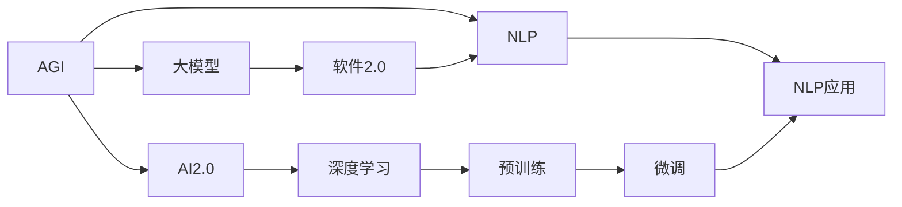
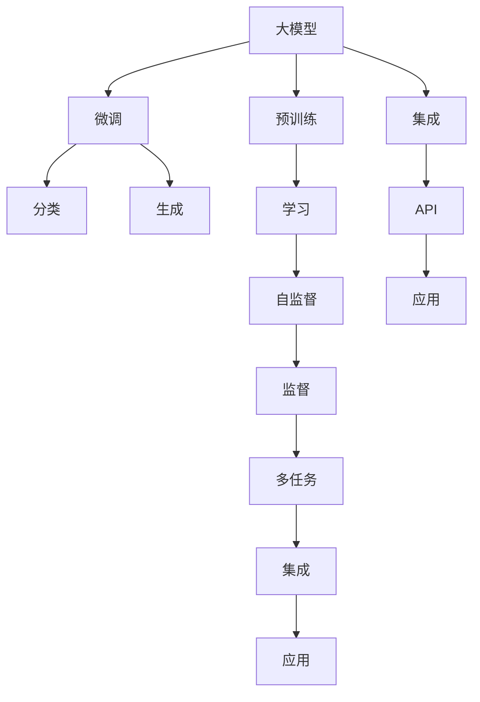

                 

# AGI的实现肯定离不开软件2.0

## 1. 背景介绍

人工智能(AI)自上世纪50年代诞生以来，已经经历了数次浪潮。从最初的逻辑推理、专家系统，到统计学习、机器视觉、自然语言处理(NLP)、语音识别，再到当前炙手可热的深度学习与大模型，AI技术在不断突破，逐渐从理论上走向应用。

AI的发展，从某种意义上说，是一场软件工程(2.0)的变革。在AI演进的不同阶段，技术范式和工程实践都在不断演变。今天，AI2.0的兴起标志着AI技术的全面应用，软件2.0的崛起将AI与工程紧密融合，推动AI从实验室走向实际应用。

AI2.0以深度学习、大模型为核心，突破了传统机器学习的瓶颈，赋予了计算机学习理解、感知、生成人类语言的能力。大模型如GPT-3、BERT等，不仅在语义理解上取得了巨大进展，还能自动生成符合语义规范的自然语言。随着深度学习模型的不断演进，AI2.0已经具备了强大的学习能力和广泛的应用潜力。

## 2. 核心概念与联系

### 2.1 核心概念概述

要想实现AI2.0与软件2.0的深度融合，首先需要理解几个关键概念：

- **AGI(通用人工智能)**：指能够在多个领域和任务上执行复杂认知功能的人工智能系统，具备人类级别的智能。
- **NLP(自然语言处理)**：指计算机理解、处理、生成自然语言的技术，包括文本分类、情感分析、机器翻译、问答系统等。
- **大模型**：以深度学习为基础，具有大规模参数量的模型，如GPT-3、BERT等，通过大规模预训练和微调获得丰富的语言知识。
- **软件2.0**：以AI和软件工程紧密结合为特征的新一代软件，借助自动化工具、机器学习算法等，实现智能化、自适应和自学习能力。

这些概念之间的联系可以构建如下Mermaid流程图：



这个流程图展示了AGI、NLP、大模型、软件2.0之间的联系。

### 2.2 核心概念原理和架构的 Mermaid 流程图



此图展示了大模型的训练流程：

- **大模型**通过**预训练**获得广泛的通用知识，可以应用于多种任务。
- **预训练**基于**自监督**方法，即利用大规模无标签数据进行学习。
- **微调**基于**监督学习**，将大模型应用于特定任务，通过**分类**和**生成**等任务适配，增强其针对具体问题的能力。
- **集成**则将预训练和微调结果结合，通过**API**和**应用**接口，实现模型在实际场景中的应用。

## 3. 核心算法原理 & 具体操作步骤

### 3.1 算法原理概述

实现AGI的核心在于大模型的预训练和微调。其核心算法包括：

- **自监督学习(SSL)**：通过大规模无标签数据训练大模型，学习语言的基本规律和结构。
- **迁移学习(ML)**：将自监督学习得到的知识迁移到特定任务上，通过微调优化模型在该任务上的性能。
- **深度学习(DL)**：基于神经网络进行端到端的训练，赋予模型强大的学习能力。
- **强化学习(RL)**：通过交互式训练和反馈机制，优化模型的决策能力。

这些算法相互关联，共同构成了AI2.0和大模型的基础。通过预训练和微调，大模型能够在特定领域内快速适应和提升性能。

### 3.2 算法步骤详解

大模型预训练和微调通常分为以下几个步骤：

1. **数据准备**：收集大量的无标签文本数据进行预训练。
2. **自监督训练**：使用自监督学习方法，如语言模型预测、掩码语言模型等，训练大模型。
3. **微调准备**：收集目标任务的标注数据集，进行预处理和归一化。
4. **任务适配层设计**：根据任务类型，设计合适的输出层和损失函数。
5. **微调训练**：在特定任务上进行微调，通过优化算法更新模型参数。
6. **评估测试**：在测试集上评估模型性能，确保模型具备任务能力。

### 3.3 算法优缺点

大模型的预训练和微调算法具有以下优点：

- **通用性强**：通过预训练，大模型能够在多个领域和任务上应用。
- **适应性高**：通过微调，模型能够快速适应特定任务的需求。
- **性能提升快**：小样本学习和大模型知识迁移显著提高了模型性能。

但其缺点也不容忽视：

- **数据依赖强**：依赖大规模标注数据，获取高质量数据成本较高。
- **计算资源消耗大**：大模型参数量大，训练和推理计算资源消耗较大。
- **模型可解释性差**：大模型作为黑盒，难以解释其内部工作机制。
- **模型鲁棒性不足**：面对新领域数据，模型泛化能力有待提高。

### 3.4 算法应用领域

大模型的预训练和微调算法广泛应用于以下几个领域：

- **自然语言处理**：如文本分类、情感分析、机器翻译、问答系统等。
- **语音识别**：通过大模型进行语音识别和转录。
- **计算机视觉**：图像分类、目标检测、图像生成等。
- **推荐系统**：用户行为预测和商品推荐。
- **自动驾驶**：传感器数据处理和决策制定。
- **智能客服**：自然语言理解和客户对话管理。

## 4. 数学模型和公式 & 详细讲解

### 4.1 数学模型构建

大模型的预训练和微调过程涉及大量数学模型和公式。以BERT模型为例，其数学模型构建如下：

1. **自监督目标**：
   $$
   \mathcal{L}_{SSL} = \frac{1}{2N}\sum_{i=1}^N (\sum_{k=1}^T (\mathcal{L}(\hat{y}_k^i, y_k^i) + \mathcal{L}(\hat{y}_k^{(i-1)}, y_k^{(i-1)}))
   $$

2. **掩码语言模型目标**：
   $$
   \mathcal{L}_{MLM} = \frac{1}{2N}\sum_{i=1}^N (-\sum_{k=1}^T (\log \hat{y}_k^i + \log(1-\hat{y}_k^i))
   $$

3. **微调任务目标**：
   $$
   \mathcal{L}_{FT} = \frac{1}{N}\sum_{i=1}^N \mathcal{L}(M_{\theta}(x_i), y_i)
   $$

其中，$\mathcal{L}$表示损失函数，$x_i$和$y_i$表示输入和标签，$M_{\theta}$表示预训练模型，$\hat{y}_k$表示模型预测。

### 4.2 公式推导过程

BERT模型是典型的自监督预训练模型，通过两个目标函数进行训练：掩码语言模型(MLM)和下一句预测任务(NSP)。

- **掩码语言模型**：在训练时，将输入文本随机掩码部分，预测被掩码单词。
- **下一句预测任务**：预测两个句子是否是相邻的。

通过这些目标函数的训练，BERT模型学习了大量的语言知识和上下文信息。微调时，只需要添加任务适配层和损失函数，就可以适应特定任务。

### 4.3 案例分析与讲解

以情感分析任务为例，假设预训练模型为BERT，微调过程如下：

1. **数据准备**：收集标注情感分析数据集。
2. **预处理**：将数据集划分训练集、验证集和测试集，进行数据增强和标准化处理。
3. **任务适配层设计**：设计输出层和损失函数，如使用softmax分类器。
4. **微调训练**：在训练集上进行微调，每批次前向传播和反向传播，更新模型参数。
5. **评估测试**：在验证集上评估模型性能，调整超参数，直到收敛。
6. **测试部署**：在测试集上测试模型效果，集成到应用系统中。

## 5. 项目实践：代码实例和详细解释说明

### 5.1 开发环境搭建

开发环境搭建如下：

1. **安装Python**：安装最新版本的Python，建议使用Anaconda或Pyenv。
2. **安装Pip和虚拟环境**：使用pip安装虚拟环境管理工具，如virtualenv或conda。
3. **安装依赖库**：安装必要的依赖库，如TensorFlow、Keras、Pandas、NumPy等。
4. **配置GPU**：确保你的开发环境能够访问GPU资源，可以通过nvidia-smi命令检查状态。

### 5.2 源代码详细实现

```python
# 导入必要的库
import tensorflow as tf
from tensorflow.keras import layers, models
from tensorflow.keras.preprocessing.text import Tokenizer
from tensorflow.keras.preprocessing.sequence import pad_sequences

# 定义模型
class Model(models.Model):
    def __init__(self, num_classes, embedding_dim=128):
        super(Model, self).__init__()
        self.embedding = layers.Embedding(input_dim=vocab_size, output_dim=embedding_dim)
        self.lstm = layers.LSTM(64)
        self.dense = layers.Dense(num_classes, activation='softmax')
    
    def call(self, x):
        x = self.embedding(x)
        x = self.lstm(x)
        x = self.dense(x)
        return x

# 准备数据
tokenizer = Tokenizer()
tokenizer.fit_on_texts(texts)
sequences = tokenizer.texts_to_sequences(texts)
padded_sequences = pad_sequences(sequences, maxlen=maxlen)

# 定义模型，设置超参数
model = Model(num_classes=num_classes)
model.compile(optimizer='adam', loss='categorical_crossentropy', metrics=['accuracy'])
model.summary()

# 训练模型
history = model.fit(padded_sequences, labels, epochs=10, batch_size=32, validation_data=(val_padded_sequences, val_labels))

# 评估模型
test_loss, test_acc = model.evaluate(test_padded_sequences, test_labels)
print('Test accuracy:', test_acc)
```

### 5.3 代码解读与分析

上述代码实现了情感分析任务的微调模型。具体解读如下：

1. **模型定义**：定义了包含嵌入层、LSTM和密集层的模型结构。嵌入层将文本转换为向量，LSTM处理序列信息，最后通过密集层进行分类。
2. **数据准备**：使用`Tokenizer`将文本转化为序列，并使用`pad_sequences`进行填充，确保序列长度一致。
3. **模型训练**：使用Keras定义模型，编译设置优化器和损失函数，并进行训练，输出训练历史。
4. **模型评估**：在测试集上评估模型性能，输出测试准确率。

## 6. 实际应用场景

### 6.1 智能客服系统

智能客服系统是大模型预训练和微调的重要应用场景。通过微调，大模型可以理解用户意图，自动生成回复，提升客户服务体验。例如，使用GPT-3进行自然语言理解和生成，构建智能客服系统，可以大幅提升响应速度和准确性。

### 6.2 金融舆情监测

金融领域需要实时监测舆情，及时响应市场变化。通过微调，大模型可以学习金融领域的语言知识和情感倾向，自动化分析新闻和社交媒体内容，实时预警风险。

### 6.3 个性化推荐系统

个性化推荐系统是电商、娱乐等领域的重要应用。通过微调，大模型可以学习用户行为和偏好，自动推荐商品和内容，提升用户体验。例如，使用BERT进行用户行为分析，构建推荐系统，可以实现精准推荐。

### 6.4 未来应用展望

未来，大模型的预训练和微调技术将进一步发展，迎来更多的应用场景：

- **医疗**：利用大模型进行病历分析和诊断，提升医疗服务的智能化水平。
- **教育**：通过微调，大模型可以辅助学生学习，提供个性化的教学建议。
- **物流**：智能调度和配送优化，提升物流效率和准确性。
- **智能家居**：智能语音交互和环境感知，提升生活便利性和舒适性。
- **智能城市**：交通管理、能源优化等，提升城市管理水平。

## 7. 工具和资源推荐

### 7.1 学习资源推荐

- **深度学习课程**：如Andrew Ng的Coursera课程《Deep Learning Specialization》，系统学习深度学习基础。
- **自然语言处理课程**：如Coursera的《Natural Language Processing with TensorFlow》，掌握NLP技术。
- **大模型文档**：如TensorFlow的BERT文档，学习大模型的应用和微调方法。

### 7.2 开发工具推荐

- **Jupyter Notebook**：免费、易用的数据科学开发环境，适合快速迭代实验。
- **TensorBoard**：可视化工具，监控模型训练过程和性能指标。
- **Weights & Biases**：实验跟踪工具，记录和分析模型训练细节。

### 7.3 相关论文推荐

- **BERT: Pre-training of Deep Bidirectional Transformers for Language Understanding**：介绍BERT模型和自监督预训练方法。
- **Attention is All You Need**：介绍Transformer结构和自注意力机制。
- **GPT-3: Language Models are Unsupervised Multitask Learners**：展示GPT-3的零样本学习能力。

## 8. 总结：未来发展趋势与挑战

### 8.1 研究成果总结

大模型的预训练和微调技术，通过自监督学习和迁移学习，已经在多个领域和任务上取得了突破性进展。预训练模型能够学习到广泛的通用知识，微调模型能够适应特定任务，提升了AI的通用性和可扩展性。

### 8.2 未来发展趋势

未来，预训练和微调技术将继续发展和演进，呈现以下几个趋势：

1. **模型规模扩大**：随着算力提升和数据积累，预训练模型参数量将持续增加，提升模型的知识表示能力。
2. **多模态融合**：将视觉、语音、文本等多种模态信息融合，提升模型的综合感知能力。
3. **深度学习与强化学习的结合**：通过强化学习进行行为优化，增强模型的自主决策能力。
4. **知识图谱与语言模型的结合**：将知识图谱与语言模型结合，提升模型的常识推理能力。
5. **自动化模型优化**：借助自动化工具和机器学习算法，实现模型的自动化优化和部署。

### 8.3 面临的挑战

尽管大模型预训练和微调技术已经取得显著进展，但仍面临一些挑战：

1. **数据标注成本高**：获取高质量标注数据成本较高，特别是在小数据领域。
2. **模型复杂度高**：大模型参数量大，计算资源消耗大，推理速度慢。
3. **模型可解释性差**：大模型作为黑盒，难以解释其内部工作机制。
4. **模型鲁棒性不足**：面对新领域数据，模型泛化能力有待提高。

### 8.4 研究展望

未来，预训练和微调技术需要在以下几个方面进行突破：

1. **低资源环境优化**：开发适合低资源环境的预训练和微调方法，降低对计算资源的需求。
2. **可解释性增强**：增强模型的可解释性，使其具备更好的透明性和可审计性。
3. **知识整合能力提升**：提升模型对知识图谱和先验知识的整合能力，增强模型的常识推理能力。
4. **鲁棒性优化**：通过对抗训练和数据增强等方法，提升模型的鲁棒性和泛化能力。
5. **跨领域知识迁移**：通过跨领域迁移学习，提升模型的通用性和适应性。

## 9. 附录：常见问题与解答

### Q1: 如何设计任务适配层？

A: 任务适配层需要根据具体任务设计。以情感分析为例，可以使用softmax分类器作为输出层，交叉熵损失函数作为损失函数。

### Q2: 如何降低标注成本？

A: 可以使用数据增强技术，如近义替换、同义词替换等，扩充训练集，降低标注数据的需求。

### Q3: 如何提高模型推理效率？

A: 可以采用模型剪枝和量化加速技术，减少模型参数量和计算复杂度。

### Q4: 如何增强模型可解释性？

A: 可以使用可解释性技术，如特征可视化、部分依赖图等，理解模型的决策过程。

### Q5: 如何提升模型鲁棒性？

A: 可以采用对抗训练和数据增强技术，提高模型的泛化能力和鲁棒性。

总之，大模型的预训练和微调技术，通过自监督学习和迁移学习，已经在多个领域和任务上取得了突破性进展。未来，伴随技术的进一步发展和演进，预训练和微调技术将迎来更广阔的应用场景，推动AI技术向更智能化、普适化方向发展。

