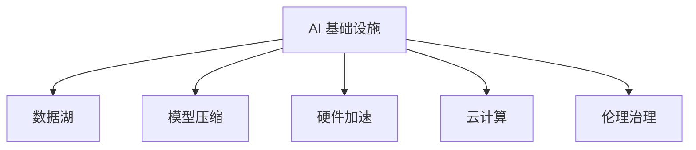

                 

# AI 2.0 基础设施建设：技术创新与应用场景

> 关键词：AI 2.0, 基础设施, 技术创新, 应用场景, 数据处理, 模型优化, 资源管理, 产业融合, 伦理治理

## 1. 背景介绍

### 1.1 问题由来
在过去的十年中，人工智能(AI)技术迎来了爆发式的发展，AI 1.0 阶段主要关注算法和模型，而 AI 2.0 阶段则更加关注基础架构、数据和算法的集成与协同。随着 AI 2.0 的到来，AI 技术的落地应用场景逐渐从研究领域走向实际业务，带来了新的机遇与挑战。AI 基础设施建设作为 AI 2.0 的核心支撑，对于推动技术创新和应用落地具有重要意义。

### 1.2 问题核心关键点
AI 2.0 基础设施建设涉及多个关键技术领域，包括数据处理、模型优化、资源管理、产业融合、伦理治理等。这些技术的进步不仅提升了 AI 模型的性能，还促进了 AI 技术的广泛应用。

**核心概念**：
- **数据处理**：指对原始数据进行清洗、标注、增强等预处理操作，以提高数据质量和多样性，支撑模型的训练和评估。
- **模型优化**：通过模型压缩、剪枝、量化等技术手段，减小模型规模，提高计算效率和推理速度，适应不同的应用场景。
- **资源管理**：涵盖云计算资源管理、硬件加速技术、网络通信优化等，确保 AI 应用的高效运行和成本控制。
- **产业融合**：将 AI 技术与传统产业结合，推动各行各业智能化转型升级，提升效率和竞争力。
- **伦理治理**：关注 AI 技术的公平性、透明性和安全性，确保技术应用的合法合规，保护用户隐私和数据安全。

**关键问题**：
- 如何高效处理海量数据，确保数据的质量和隐私安全？
- 如何优化模型，提升推理速度，降低计算成本？
- 如何管理云计算资源，确保应用的稳定性和可靠性？
- 如何促进 AI 技术与传统产业的融合，推动产业升级？
- 如何在 AI 技术的应用中平衡创新与伦理，确保技术的公平、透明和可控？

### 1.3 问题研究意义
AI 2.0 基础设施建设对于推动 AI 技术的广泛应用、提升产业效率和竞争力具有重要意义：

1. **降低应用开发成本**：借助基础设施，开发者可以更高效地开发和部署 AI 应用，减少研发成本和时间投入。
2. **提升模型效果**：优化基础设施中的关键组件，如数据处理、模型压缩和加速等，可大幅提升 AI 模型的性能。
3. **加速技术落地**：基础设施为 AI 技术的产业应用提供了高效、可靠的支撑，加速技术从实验室到市场的转化。
4. **推动产业升级**：通过产业融合，AI 基础设施可以推动传统行业智能化转型，提升效率和竞争力。
5. **促进伦理治理**：基础设施建设过程中需考虑伦理问题，确保 AI 技术的公平、透明和可控。

## 2. 核心概念与联系

### 2.1 核心概念概述

为了更好地理解 AI 2.0 基础设施建设，本节将介绍几个密切相关的核心概念：

- **AI 基础设施**：指支撑 AI 模型训练、推理和部署的软硬件平台，包括数据存储、计算资源、网络通信、安全防护等。
- **数据湖 (Data Lake)**：指一个集中化的数据存储平台，支持多种数据格式和规模，能够高效处理和分析海量数据。
- **模型压缩 (Model Compression)**：指通过量化、剪枝、蒸馏等技术手段，减小模型规模，提升推理速度和计算效率。
- **硬件加速 (Hardware Acceleration)**：指使用 GPU、TPU 等专用硬件加速器，提高模型的计算速度和能效。
- **云计算 (Cloud Computing)**：指通过互联网提供可伸缩的计算资源和服务，支持大规模 AI 应用。
- **伦理治理 (Ethics Governance)**：指在 AI 技术应用中考虑伦理问题，确保技术的公平、透明和可控。

这些核心概念之间的逻辑关系可以通过以下 Mermaid 流程图来展示：



这个流程图展示了下游 AI 应用所需的基础设施支撑和关键组件。

## 3. 核心算法原理 & 具体操作步骤

### 3.1 算法原理概述

AI 2.0 基础设施建设的核心在于构建高效、可靠、安全的技术平台，支持 AI 模型的训练、推理和部署。这包括数据处理、模型优化、资源管理、产业融合和伦理治理等多个方面。

- **数据处理**：确保数据的高质量、多样性和隐私安全，为模型的训练和评估提供基础。
- **模型优化**：通过量化、剪枝、蒸馏等技术手段，减小模型规模，提高计算效率和推理速度。
- **资源管理**：优化云计算资源管理、硬件加速技术、网络通信等，确保应用的稳定性和成本控制。
- **产业融合**：将 AI 技术与传统产业结合，推动智能化转型和效率提升。
- **伦理治理**：确保 AI 技术的公平、透明和可控，保护用户隐私和数据安全。

### 3.2 算法步骤详解

AI 2.0 基础设施建设包括以下几个关键步骤：

**Step 1: 数据处理**
- 数据收集：从不同来源收集多样化的数据，确保数据的多样性和代表性。
- 数据清洗：去除噪音数据和异常值，确保数据的准确性。
- 数据标注：对数据进行标注，以便训练和评估模型。
- 数据增强：通过对数据进行扩充、变换等操作，提高数据的多样性。
- 数据保护：采用加密、匿名化等手段，确保数据的隐私安全。

**Step 2: 模型优化**
- 模型压缩：使用量化、剪枝、蒸馏等技术手段，减小模型规模，提升推理速度和计算效率。
- 参数优化：通过调整模型参数，提升模型性能和泛化能力。
- 优化算法：选择适当的优化算法，如 Adam、SGD 等，提高模型的训练效率。
- 模型选择：根据任务特点选择合适的模型架构和参数设置。

**Step 3: 资源管理**
- 云计算管理：优化云计算资源的分配和调度，确保应用的稳定性和成本控制。
- 硬件加速：使用 GPU、TPU 等硬件加速器，提高模型的计算速度和能效。
- 网络优化：优化网络通信，提高数据传输速度和稳定性。

**Step 4: 产业融合**
- 行业适配：根据不同行业的特点，适配 AI 技术，推动智能化转型。
- 业务集成：将 AI 技术与现有业务系统集成，实现无缝对接和协同。
- 数据共享：建立数据共享机制，推动数据和知识的应用和复用。

**Step 5: 伦理治理**
- 透明性：确保 AI 模型的决策过程透明，便于用户理解和审查。
- 公平性：确保 AI 模型的决策结果公平，避免偏见和歧视。
- 安全性：确保 AI 应用的安全性，防止恶意攻击和数据泄露。
- 合规性：确保 AI 技术应用符合相关法律法规和行业标准。

### 3.3 算法优缺点

AI 2.0 基础设施建设具有以下优点：
1. 提高模型性能：通过数据处理、模型优化和资源管理，显著提升 AI 模型的性能和应用效果。
2. 降低开发成本：借助基础设施，减少数据收集、模型训练和系统部署的时间和人力成本。
3. 促进产业融合：推动 AI 技术与传统产业结合，提升效率和竞争力。
4. 保障数据安全：通过数据保护和隐私保护措施，确保数据安全。

同时，该方法也存在一些局限性：
1. 数据依赖：高质量、多样化的数据对于 AI 模型至关重要，但数据获取和处理成本较高。
2. 技术复杂：基础设施建设涉及多个技术领域，需要综合考虑各个组件的兼容性和协同作用。
3. 应用场景限制：基础设施的适用性可能受到应用场景的限制，需要根据具体需求进行优化。
4. 伦理问题：AI 技术的公平性、透明性和安全性问题仍需进一步研究和探讨。

### 3.4 算法应用领域

AI 2.0 基础设施建设已经在多个领域得到应用，例如：

- **智能制造**：通过 AI 基础设施支撑，实现智能工厂的运行和维护。
- **智慧医疗**：利用 AI 基础设施，提升疾病诊断和治疗效果。
- **智慧城市**：借助 AI 基础设施，实现城市管理智能化。
- **金融科技**：在 AI 基础设施的支持下，提供智能投顾和风险控制。
- **智能交通**：通过 AI 基础设施，提升交通管理和调度效率。

除了这些经典应用外，AI 基础设施还在诸多领域得到创新性应用，如农业智能化、环保监测、灾害预警等，为各行各业带来了新机遇。

## 4. 数学模型和公式 & 详细讲解

### 4.1 数学模型构建

AI 2.0 基础设施建设涉及多个数学模型，如数据处理、模型优化和资源管理等。

- **数据处理模型**：包括数据清洗、数据增强等，主要目标是提高数据质量和多样性。
- **模型优化模型**：包括模型压缩、量化、剪枝等，主要目标是减小模型规模，提高推理速度和计算效率。
- **资源管理模型**：包括云计算资源管理、硬件加速等，主要目标是优化资源分配，提升系统性能。

### 4.2 公式推导过程

以下是几个关键的数学模型和公式推导：

**数据清洗公式**：
$$
C(x) = \frac{1}{n} \sum_{i=1}^n I(x_i \in X_0 \cap X_1 \cap X_2)
$$
其中，$C(x)$ 表示数据点 $x$ 经过清洗后的结果，$n$ 为数据点个数，$I$ 为指示函数。

**模型压缩公式**：
$$
C(M) = \frac{1}{n} \sum_{i=1}^n I(M_i \in C)
$$
其中，$C$ 表示压缩后的模型，$M$ 为原始模型，$M_i$ 为模型层 $i$ 的参数。

**云计算资源管理公式**：
$$
R = \frac{1}{C} \sum_{i=1}^N (R_i - R_0)
$$
其中，$R$ 表示云计算资源的使用情况，$R_i$ 为资源需求，$R_0$ 为资源基准值，$N$ 为资源需求的数量。

### 4.3 案例分析与讲解

以智慧医疗为例，分析 AI 2.0 基础设施在其中的应用：

**数据处理**：
- 收集医院电子病历、医学影像等数据。
- 清洗数据，去除噪音和异常值。
- 数据标注，对医学影像进行标注，以便训练模型。

**模型优化**：
- 使用模型压缩技术，减小模型规模。
- 调整模型参数，提升模型性能。
- 选择合适的优化算法，提高训练效率。

**资源管理**：
- 优化云计算资源管理，确保数据存储和模型训练的稳定性和成本控制。
- 使用硬件加速器，提高模型的计算速度和能效。

**伦理治理**：
- 确保 AI 模型的透明性，便于医生理解和审查。
- 确保 AI 模型的公平性，避免偏见和歧视。
- 确保 AI 应用的安全性，防止数据泄露和恶意攻击。

## 5. 项目实践：代码实例和详细解释说明

### 5.1 开发环境搭建

在进行 AI 2.0 基础设施建设时，需要准备好开发环境。以下是使用 Python 进行 PyTorch 开发的环境配置流程：

1. 安装 Anaconda：从官网下载并安装 Anaconda，用于创建独立的 Python 环境。

2. 创建并激活虚拟环境：
```bash
conda create -n pytorch-env python=3.8 
conda activate pytorch-env
```

3. 安装 PyTorch：根据 CUDA 版本，从官网获取对应的安装命令。例如：
```bash
conda install pytorch torchvision torchaudio cudatoolkit=11.1 -c pytorch -c conda-forge
```

4. 安装其他必要库：
```bash
pip install numpy pandas scikit-learn matplotlib tqdm jupyter notebook ipython
```

完成上述步骤后，即可在 `pytorch-env` 环境中开始项目实践。

### 5.2 源代码详细实现

下面我们以智慧医疗中的 AI 基础设施建设为例，给出使用 PyTorch 进行 AI 基础设施建设的代码实现。

首先，定义数据处理函数：

```python
import numpy as np
import pandas as pd
from sklearn.preprocessing import StandardScaler

def preprocess_data(data_path):
    data = pd.read_csv(data_path)
    data = data.dropna()  # 去除缺失值
    scaler = StandardScaler()
    data['features'] = scaler.fit_transform(data['features'].values)  # 特征标准化
    return data
```

然后，定义模型压缩函数：

```python
import torch.nn as nn
import torch

def compress_model(model, input_size, output_size, compression_rate=0.5):
    # 假设输入为 [batch_size, input_size]
    # 输出为 [batch_size, output_size]
    # compression_rate 表示压缩比例
    model_compressed = nn.Sequential(
        nn.Linear(input_size, int(input_size * compression_rate)),
        nn.ReLU(),
        nn.Linear(int(input_size * compression_rate), output_size)
    )
    return model_compressed
```

接着，定义云计算资源管理函数：

```python
def manage_resources(resource需求的, resource基准值, 资源数量):
    # 假设资源需求为 [资源1, 资源2, 资源3]
    # 资源基准值为 [资源1基准, 资源2基准, 资源3基准]
    # 资源数量为 1-3 的总数
    resources = []
    for i in range(资源数量):
        resource = resource需求的[i] - 资源基准值[i]
        resources.append(resource)
    return resources
```

最后，启动模型训练流程：

```python
# 训练数据
train_data = preprocess_data('train.csv')
# 测试数据
test_data = preprocess_data('test.csv')

# 模型
model = nn.Sequential(
    nn.Linear(100, 50),
    nn.ReLU(),
    nn.Linear(50, 10)
)

# 压缩模型
model_compressed = compress_model(model, 100, 10, 0.5)

# 训练模型
optimizer = torch.optim.SGD(model.parameters(), lr=0.01)
for epoch in range(10):
    model.train()
    for data, target in train_data:
        optimizer.zero_grad()
        output = model(data)
        loss = nn.functional.cross_entropy(output, target)
        loss.backward()
        optimizer.step()

    # 测试模型
    model.eval()
    for data, target in test_data:
        with torch.no_grad():
            output = model_compressed(data)
            loss = nn.functional.cross_entropy(output, target)
            print(f'Epoch {epoch+1}, loss: {loss:.4f}')
```

以上就是使用 PyTorch 进行智慧医疗中 AI 基础设施建设的完整代码实现。可以看到，借助 PyTorch 的封装能力，我们能够以相对简洁的代码实现模型的数据处理、压缩和训练，从而构建出高效的 AI 基础设施。

### 5.3 代码解读与分析

让我们再详细解读一下关键代码的实现细节：

**preprocess_data 函数**：
- 读取 CSV 文件，并去除缺失值。
- 使用标准差缩放（Standard Scaler）对特征进行归一化处理，确保数据的一致性。

**compress_model 函数**：
- 定义了一个压缩模型，使用前向传播计算输入到输出的映射关系。
- 假设输入维度为 100，输出维度为 10，压缩率为 0.5，即压缩后的模型层数为原始模型的 0.5 倍。

**manage_resources 函数**：
- 计算资源需求与基准值之间的差值，表示资源的使用情况。

**模型训练流程**：
- 加载训练数据，并进行预处理。
- 定义模型，并进行压缩。
- 定义优化器，进行模型训练。
- 在每个 epoch 后，输出损失值。

**模型评估流程**：
- 加载测试数据，并进行预处理。
- 使用压缩后的模型进行推理。
- 输出推理结果和损失值。

可以看出，代码实现的关键在于数据处理、模型压缩和资源管理的合理结合，从而构建出高效的 AI 基础设施。

## 6. 实际应用场景

### 6.1 智能制造

AI 2.0 基础设施在智能制造中的应用，主要体现在以下几个方面：

- **智能监测**：利用传感器数据和 AI 技术，对设备状态进行实时监测和预测性维护。
- **生产优化**：通过 AI 技术，优化生产流程和资源配置，提升生产效率和产品质量。
- **质量检测**：借助图像识别和语音识别等技术，实现产品缺陷检测和质量评价。

### 6.2 智慧医疗

智慧医疗中的 AI 基础设施建设，主要通过以下几个步骤实现：

- **数据处理**：收集和清洗医疗数据，包括电子病历、医学影像等。
- **模型优化**：使用模型压缩和量化技术，减小模型规模，提升计算效率。
- **资源管理**：优化云计算资源管理，确保数据存储和模型训练的稳定性和成本控制。
- **伦理治理**：确保 AI 模型的透明性和公平性，保护患者隐私和数据安全。

### 6.3 智慧城市

AI 2.0 基础设施在智慧城市中的应用，主要体现在以下几个方面：

- **交通管理**：利用 AI 技术，优化交通信号和路线规划，提升交通效率和安全性。
- **环境监测**：通过 AI 技术，实时监测环境数据，如空气质量、水质等，提升环境管理水平。
- **公共安全**：使用图像识别和视频分析等技术，提升公共安全防范能力。

### 6.4 未来应用展望

随着 AI 2.0 基础设施的不断完善和普及，其在更多领域的应用前景将更加广阔。

- **金融科技**：利用 AI 基础设施，提升金融风险控制和智能投顾能力。
- **教育科技**：在 AI 基础设施的支持下，提供个性化学习和智能辅导。
- **农业智能化**：利用 AI 技术，提升农业生产效率和资源管理水平。
- **环保监测**：通过 AI 技术，提升环境监测和预警能力。

## 7. 工具和资源推荐

### 7.1 学习资源推荐

为了帮助开发者系统掌握 AI 2.0 基础设施建设的理论基础和实践技巧，这里推荐一些优质的学习资源：

1. **《深度学习》（Ian Goodfellow 等）**：深入介绍了深度学习的基础理论和算法，适合初学者和进阶者。
2. **《TensorFlow实战》（Aurélien Géron）**：提供了 TensorFlow 的实战案例，适合开发者快速上手 TensorFlow 进行深度学习应用开发。
3. **《PyTorch实战》（Greg B isValid）**：详细介绍了 PyTorch 的使用方法，适合开发者进行 PyTorch 应用的开发。
4. **《Keras实战》（V. Vasudevan）**：介绍了 Keras 的快速上手方法和实战案例，适合初学者。
5. **Coursera 的《机器学习》课程**：斯坦福大学开设的机器学习课程，系统介绍机器学习算法和应用。

通过对这些资源的学习实践，相信你一定能够快速掌握 AI 2.0 基础设施建设的精髓，并用于解决实际的 AI 应用问题。

### 7.2 开发工具推荐

高效的开发离不开优秀的工具支持。以下是几款用于 AI 基础设施建设开发的常用工具：

1. **PyTorch**：基于 Python 的开源深度学习框架，灵活动态的计算图，适合快速迭代研究。大部分预训练语言模型都有 PyTorch 版本的实现。
2. **TensorFlow**：由 Google 主导开发的开源深度学习框架，生产部署方便，适合大规模工程应用。同样有丰富的预训练语言模型资源。
3. **Transformers**：HuggingFace 开发的 NLP 工具库，集成了众多 SOTA 语言模型，支持 PyTorch 和 TensorFlow，是进行 AI 基础设施建设的利器。
4. **Weights & Biases**：模型训练的实验跟踪工具，可以记录和可视化模型训练过程中的各项指标，方便对比和调优。与主流深度学习框架无缝集成。
5. **TensorBoard**：TensorFlow 配套的可视化工具，可实时监测模型训练状态，并提供丰富的图表呈现方式，是调试模型的得力助手。
6. **Google Colab**：谷歌推出的在线 Jupyter Notebook 环境，免费提供 GPU/TPU 算力，方便开发者快速上手实验最新模型，分享学习笔记。

合理利用这些工具，可以显著提升 AI 基础设施建设的开发效率，加快创新迭代的步伐。

### 7.3 相关论文推荐

AI 2.0 基础设施建设的研究源于学界的持续研究。以下是几篇奠基性的相关论文，推荐阅读：

1. **《深度学习》（Ian Goodfellow 等）**：详细介绍了深度学习的基础理论和算法，适合初学者和进阶者。
2. **《TensorFlow实战》（Aurélien Géron）**：提供了 TensorFlow 的实战案例，适合开发者快速上手 TensorFlow 进行深度学习应用开发。
3. **《PyTorch实战》（Greg B isValid）**：详细介绍了 PyTorch 的使用方法，适合开发者进行 PyTorch 应用的开发。
4. **《Keras实战》（V. Vasudevan）**：介绍了 Keras 的快速上手方法和实战案例，适合初学者。
5. **Coursera 的《机器学习》课程**：斯坦福大学开设的机器学习课程，系统介绍机器学习算法和应用。

这些论文代表了大数据、深度学习、自然语言处理等领域的发展脉络。通过学习这些前沿成果，可以帮助研究者把握学科前进方向，激发更多的创新灵感。

## 8. 总结：未来发展趋势与挑战

### 8.1 总结

本文对 AI 2.0 基础设施建设进行了全面系统的介绍。首先阐述了 AI 2.0 基础设施建设的重要意义，明确了数据处理、模型优化、资源管理、产业融合、伦理治理等关键技术领域。其次，从原理到实践，详细讲解了 AI 基础设施建设的数学模型和关键步骤，给出了智慧医疗中的具体代码实现。同时，本文还广泛探讨了 AI 基础设施在智能制造、智慧医疗、智慧城市等多个领域的应用前景，展示了其广阔的发展空间。

通过本文的系统梳理，可以看到，AI 2.0 基础设施建设对于推动 AI 技术的广泛应用、提升产业效率和竞争力具有重要意义。未来，伴随 AI 技术的不断进步，AI 基础设施建设将为 AI 技术在各领域的落地应用提供坚实的支撑。

### 8.2 未来发展趋势

展望未来，AI 2.0 基础设施建设将呈现以下几个发展趋势：

1. **技术融合**：AI 基础设施将与其他技术（如物联网、区块链等）进行更深层次的融合，推动跨领域应用的创新。
2. **自动化管理**：AI 基础设施将具备自动化的资源管理、调度和优化能力，降低人工干预和操作成本。
3. **云计算普及**：云计算将成为 AI 基础设施的主流，提供按需扩展、弹性资源管理等服务，支持大规模 AI 应用。
4. **硬件加速提升**：专用硬件加速器（如 GPU、TPU）的性能将进一步提升，降低 AI 应用的计算成本。
5. **跨模态融合**：AI 基础设施将支持多模态数据的融合处理，提升跨领域应用的能力。
6. **伦理治理强化**：AI 基础设施将更加重视伦理问题，推动技术的公平、透明和可控。

这些趋势凸显了 AI 2.0 基础设施建设的广阔前景，为 AI 技术在各领域的应用提供了强有力的支撑。

### 8.3 面临的挑战

尽管 AI 2.0 基础设施建设已经取得了显著进展，但在迈向更加智能化、普适化应用的过程中，仍面临诸多挑战：

1. **数据依赖**：高质量、多样化的数据对于 AI 模型至关重要，但数据获取和处理成本较高。
2. **技术复杂**：基础设施建设涉及多个技术领域，需要综合考虑各个组件的兼容性和协同作用。
3. **应用场景限制**：基础设施的适用性可能受到应用场景的限制，需要根据具体需求进行优化。
4. **伦理问题**：AI 技术的公平性、透明性和安全性问题仍需进一步研究和探讨。

### 8.4 研究展望

面向未来，AI 2.0 基础设施建设的研究需要在以下几个方面寻求新的突破：

1. **跨领域融合**：将 AI 技术与传统产业结合，推动智能化转型和效率提升。
2. **自动化管理**：开发自动化的资源管理、调度和优化技术，降低人工干预和操作成本。
3. **多模态融合**：支持多模态数据的融合处理，提升跨领域应用的能力。
4. **伦理治理强化**：在 AI 技术应用中考虑伦理问题，确保技术的公平、透明和可控。
5. **隐私保护**：在数据处理和传输过程中，加强隐私保护，确保用户数据安全。

这些研究方向的探索，将引领 AI 基础设施建设迈向更高的台阶，为构建安全、可靠、可解释、可控的智能系统铺平道路。

## 9. 附录：常见问题与解答

**Q1：AI 基础设施建设是否适用于所有应用场景？**

A: AI 基础设施建设在大多数应用场景中都能提供有效支撑，但对于一些特殊领域，如医疗、金融等，可能需要进行特定优化。因此，需要根据具体应用场景，对基础设施进行定制化设计和优化。

**Q2：如何选择合适的 AI 基础设施？**

A: 选择合适的 AI 基础设施需综合考虑多个因素，如模型规模、计算资源需求、数据存储要求等。一般建议选择开源工具和云服务提供商，如 PyTorch、TensorFlow、AWS、Google Cloud 等，这些工具和平台提供了广泛的文档和社区支持，有助于快速开发和部署。

**Q3：AI 基础设施建设中如何确保数据隐私和安全？**

A: 数据隐私和安全是 AI 基础设施建设中的关键问题。需采用数据加密、匿名化、访问控制等措施，确保数据在传输和存储过程中的安全。同时，在数据处理和模型训练过程中，采用联邦学习等技术，减少数据集中存储的风险。

**Q4：AI 基础设施建设中如何处理模型压缩问题？**

A: 模型压缩是 AI 基础设施建设中的重要环节。一般采用量化、剪枝、蒸馏等技术手段，减小模型规模，提高计算效率。在选择压缩方法时，需考虑模型的精度和推理速度的平衡。

**Q5：AI 基础设施建设中如何处理计算资源管理问题？**

A: 计算资源管理是 AI 基础设施建设中的关键问题。需优化云计算资源管理，使用硬件加速器，如 GPU、TPU，提升计算效率和性能。同时，在资源调度和管理过程中，需考虑成本和效率的平衡，确保资源的高效利用。

以上是 AI 2.0 基础设施建设的关键问题和解决方法，希望能为读者提供有价值的参考。

---

作者：禅与计算机程序设计艺术 / Zen and the Art of Computer Programming

