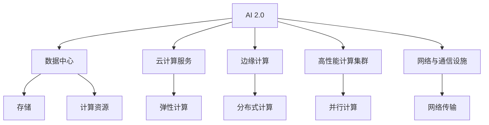

                 

# AI 2.0 时代：基础设施建设的机遇与挑战

> 关键词：AI 2.0, 基础设施, 数据中心, 云服务, 边缘计算, 深度学习, 高性能计算, 可靠性, 安全, 标准化, 可持续发展

## 1. 背景介绍

### 1.1 问题由来

随着人工智能(AI)技术的飞速发展，尤其是近年来AI 2.0时代的到来，其在商业、科研、教育等领域的广泛应用已经逐步改变了人们的工作和生活方式。AI 2.0以深度学习、自然语言处理、计算机视觉等高级技术为代表，显著提高了自动化决策和智能交互的能力。但这些技术的实现离不开强大的基础设施支持，而基础设施的建设和运营正面临着巨大的机遇和挑战。

### 1.2 问题核心关键点

基础设施在大规模AI应用中扮演了至关重要的角色，包括但不限于数据中心、云计算服务、边缘计算设施、高性能计算集群等。其核心关键点包括：

- **数据中心**：存储和处理海量数据的核心硬件设施，承担着AI模型训练和推理的任务。
- **云计算服务**：通过网络提供按需计算资源，支持AI模型的部署和应用。
- **边缘计算**：靠近数据源处理计算任务，减少延迟，提升响应速度。
- **高性能计算集群**：提供高速并行计算能力，支持大规模模型训练和复杂任务处理。
- **网络与通信设施**：确保数据和模型的高效传输，支撑AI应用的全球互联互通。

这些基础设施组件协同工作，共同支撑了AI应用从实验室走向实际应用的全过程。但随着AI应用的快速扩展，基础设施的建设、运营和管理面临诸多挑战，需要我们在技术、经济、社会等各个维度进行深入探讨。

### 1.3 问题研究意义

研究AI 2.0时代基础设施的建设，对于推动AI技术的普及和应用、提升经济效率、改善社会福祉具有重要意义：

1. **技术创新**：基础设施的不断优化和升级，能够显著提升AI技术的处理效率和应用效果，推动AI领域的持续创新。
2. **经济效益**：高效、可靠的基础设施能够降低AI应用成本，提升企业的竞争力和市场份额。
3. **社会福祉**：通过AI基础设施，可以实现医疗、教育、交通等领域的智能化服务，改善人民的生活质量。
4. **可持续发展**：发展绿色、环保的基础设施，有助于实现AI技术的可持续发展，避免资源浪费和环境污染。
5. **安全与合规**：强化基础设施的安全性和合规性，保障AI应用的安全性，维护用户的隐私和权益。

## 2. 核心概念与联系

### 2.1 核心概念概述

为更好地理解AI 2.0时代基础设施的建设，本节将介绍几个关键概念：

- **AI 2.0**：指基于深度学习等先进算法的高级AI应用，涵盖了自然语言处理、计算机视觉、语音识别、机器人等领域。
- **基础设施**：包括数据中心、云计算服务、边缘计算、高性能计算集群等物理和虚拟设施，支撑AI应用的运行和扩展。
- **数据中心**：存储和处理海量数据的硬件设施，承载AI模型的训练和推理任务。
- **云计算服务**：通过网络提供计算资源，支持AI模型的部署和应用。
- **边缘计算**：靠近数据源处理计算任务，提升响应速度。
- **高性能计算集群**：提供高速并行计算能力，支持大规模模型训练。
- **网络与通信设施**：确保数据和模型的高效传输，支撑AI应用的全球互联互通。

这些概念之间的逻辑关系可以通过以下Mermaid流程图来展示：



这个流程图展示了大规模AI应用中基础设施的核心组件及其相互作用：

1. AI 2.0依赖于数据中心、云计算服务、边缘计算等基础设施。
2. 数据中心提供存储和计算资源。
3. 云计算服务通过网络提供弹性计算资源。
4. 边缘计算靠近数据源，减少延迟。
5. 高性能计算集群支持大规模模型训练。
6. 网络与通信设施保障数据传输高效。

## 3. 核心算法原理 & 具体操作步骤
### 3.1 算法原理概述

AI 2.0时代基础设施的建设，涉及大规模数据处理、高效计算资源分配、网络通信优化等多个方面。其核心算法原理主要包括以下几个方面：

1. **数据中心设计**：包括存储容量、计算能力、网络带宽的规划和优化。
2. **云计算服务模型**：包括IaaS、PaaS、SaaS等，支持弹性、按需计算资源的管理。
3. **边缘计算策略**：根据数据分布和应用需求，选择适当的边缘计算节点。
4. **高性能计算集群构建**：选择适合的硬件设备，设计高效的并行计算算法。
5. **网络与通信优化**：设计高效的数据传输协议，优化网络拓扑结构。

### 3.2 算法步骤详解

AI 2.0时代基础设施的建设步骤如下：

**Step 1: 需求分析**
- 确定AI应用的具体需求，包括数据存储需求、计算资源需求、网络带宽需求等。
- 分析数据中心、云计算服务、边缘计算等基础设施的规格要求。

**Step 2: 基础设施设计**
- 根据需求分析结果，设计数据中心的存储容量、计算能力、网络带宽。
- 选择合适的云计算服务模型，设计计算资源池。
- 根据数据分布和应用需求，选择适当的边缘计算节点。
- 选择高性能计算集群所需的硬件设备，设计并行计算算法。

**Step 3: 基础设施部署**
- 根据设计方案，采购和部署所需的硬件设备。
- 搭建数据中心，配置存储和计算资源。
- 配置云计算服务，实现计算资源的按需分配。
- 部署边缘计算节点，优化网络拓扑结构。
- 搭建高性能计算集群，实现高速并行计算。

**Step 4: 测试与优化**
- 对基础设施进行全面测试，确保各项指标符合设计要求。
- 根据测试结果，对基础设施进行优化调整。
- 持续监控基础设施运行状态，及时处理异常情况。

**Step 5: 运维与升级**
- 建立基础设施运维体系，确保设施稳定运行。
- 定期进行基础设施升级，提升性能和可靠性。
- 优化网络与通信设施，保障数据传输效率。

### 3.3 算法优缺点

AI 2.0时代基础设施建设的优势包括：

1. **高效性**：通过云计算和边缘计算，可以灵活调配计算资源，提升处理效率。
2. **可扩展性**：通过弹性计算和分布式计算，可以动态扩展基础设施，适应业务增长。
3. **可靠性**：通过冗余设计和容错机制，可以保障基础设施的高可靠性。
4. **安全性**：通过数据加密和安全协议，可以保护数据和模型的安全。
5. **灵活性**：通过混合云和私有云，可以根据业务需求灵活选择基础设施。

但同时也存在以下缺点：

1. **高投入**：大规模基础设施的建设需要高昂的硬件和网络投资。
2. **复杂性**：基础设施的部署和管理涉及多个环节，复杂性较高。
3. **能耗问题**：大规模数据中心和计算集群耗能巨大，对环境影响较大。
4. **标准化不足**：不同供应商的基础设施差异较大，标准化程度有待提升。
5. **安全性风险**：基础设施的安全漏洞可能导致数据泄露和模型被攻击。

### 3.4 算法应用领域

AI 2.0时代基础设施的应用领域非常广泛，涵盖多个行业和领域：

- **医疗**：通过云服务和边缘计算，支持远程医疗和精准医疗。
- **金融**：通过高性能计算集群，支持高频交易和风险管理。
- **教育**：通过云计算服务，支持在线教育平台和智能教学系统。
- **自动驾驶**：通过边缘计算和网络通信设施，支持实时车辆控制和数据传输。
- **物联网**：通过云计算和边缘计算，支持大规模物联网设备的连接和管理。
- **智慧城市**：通过基础设施的集成和优化，实现城市管理的智能化。
- **科学研究**：通过高性能计算集群，支持复杂的科学计算和模拟。

## 4. 数学模型和公式 & 详细讲解 & 举例说明

### 4.1 数学模型构建

本节将使用数学语言对AI 2.0时代基础设施建设的数学模型进行描述。

**数据中心设计模型**：

假设数据中心需要存储$D$个TB的数据，计算能力为$C$个计算核心，网络带宽为$B$个Gbps。则数据中心的资源需求模型为：

$$
\text{Resource Demand} = D + C + B
$$

其中，$D$表示数据存储需求，$C$表示计算能力需求，$B$表示网络带宽需求。

**云计算服务模型**：

假设云计算服务提供弹性计算资源，最大计算资源为$M$个计算核心，每个计算核心的价格为$P$元/小时。则云计算服务的成本模型为：

$$
\text{Cloud Cost} = P \times M \times T
$$

其中，$M$表示最大计算资源，$T$表示计算资源的使用时间。

**边缘计算策略**：

假设需要部署$N$个边缘计算节点，每个节点的计算能力为$E$个核心，网络带宽为$e$个Gbps。则边缘计算的成本和效率模型为：

$$
\text{Edge Cost} = P \times N \times E \times T
$$
$$
\text{Edge Efficiency} = \frac{N \times E \times T}{D}
$$

其中，$N$表示边缘计算节点数量，$E$表示每个节点的计算能力，$T$表示计算资源的使用时间。

**高性能计算集群构建**：

假设使用$G$个GPU进行并行计算，每个GPU的计算能力为$G_{\text{core}}$个核心。则高性能计算集群的性能模型为：

$$
\text{Cluster Performance} = G \times G_{\text{core}}
$$

其中，$G$表示GPU数量，$G_{\text{core}}$表示每个GPU的计算能力。

**网络与通信优化**：

假设网络传输速度为$S$个Gbps，通信协议效率为$E_{\text{protocol}}$。则网络与通信的传输速度模型为：

$$
\text{Network Speed} = S \times E_{\text{protocol}}
$$

其中，$S$表示网络传输速度，$E_{\text{protocol}}$表示通信协议效率。

### 4.2 公式推导过程

以云计算服务模型为例，推导其成本模型的具体形式：

1. 假设云计算服务提供弹性计算资源，最大计算资源为$M$个计算核心，每个计算核心的价格为$P$元/小时。
2. 设计算资源的使用时间为$T$小时，则总的计算资源消耗量为$M \times T$个计算核心。
3. 计算资源的成本为$P \times M \times T$元。

因此，云计算服务的成本模型为：

$$
\text{Cloud Cost} = P \times M \times T
$$

### 4.3 案例分析与讲解

假设某科技公司需要在一个月内处理大规模数据，存储需求为10TB，计算能力需求为100个计算核心，网络带宽需求为10Gbps。根据数据中心设计模型，计算所需资源总量为：

$$
\text{Resource Demand} = 10\text{TB} + 100 + 10\text{Gbps} = 120
$$

公司决定使用公有云服务，最大计算资源为200个计算核心，每个计算核心的价格为0.2元/小时。则云计算服务的成本模型为：

$$
\text{Cloud Cost} = 0.2 \times 200 \times 24 \times 30 = 14400\text{元}
$$

公司进一步决定在本地部署边缘计算节点，每个节点的计算能力为2个核心，网络带宽为1Gbps。则边缘计算的成本模型为：

$$
\text{Edge Cost} = 0.2 \times 20 \times 2 \times 24 \times 30 = 28800\text{元}
$$

公司最后决定使用高性能计算集群，选择10个GPU，每个GPU的计算能力为16个核心。则高性能计算集群的性能模型为：

$$
\text{Cluster Performance} = 10 \times 16 = 160
$$

通过优化网络与通信设施，网络传输速度达到20Gbps，通信协议效率为1.2。则网络与通信的传输速度模型为：

$$
\text{Network Speed} = 20 \times 1.2 = 24\text{Gbps}
$$

综上所述，公司根据实际需求，设计并部署了合适的基础设施，达到了高效的资源利用和成本控制。

## 5. 项目实践：代码实例和详细解释说明
### 5.1 开发环境搭建

在进行AI 2.0时代基础设施建设的实践前，我们需要准备好开发环境。以下是使用Python进行PyTorch开发的环境配置流程：

1. 安装Anaconda：从官网下载并安装Anaconda，用于创建独立的Python环境。

2. 创建并激活虚拟环境：
```bash
conda create -n pytorch-env python=3.8 
conda activate pytorch-env
```

3. 安装PyTorch：根据CUDA版本，从官网获取对应的安装命令。例如：
```bash
conda install pytorch torchvision torchaudio cudatoolkit=11.1 -c pytorch -c conda-forge
```

4. 安装TensorFlow：由Google主导开发的开源深度学习框架，生产部署方便，适合大规模工程应用。同样有丰富的预训练语言模型资源。

5. 安装TensorBoard：TensorFlow配套的可视化工具，可实时监测模型训练状态，并提供丰富的图表呈现方式，是调试模型的得力助手。

6. 安装NVIDIA CUDA Toolkit：用于支持GPU加速计算，安装和配置GPU驱动程序。

### 5.2 源代码详细实现

下面我们以云计算服务模型为例，给出使用Python实现的具体代码。

```python
import numpy as np

class CloudService:
    def __init__(self, m, p, t):
        self.m = m  # 最大计算资源
        self.p = p  # 每个计算核心的价格
        self.t = t  # 计算资源的使用时间
    
    def cost(self):
        return self.p * self.m * self.t
```

接着，我们可以使用该类计算云计算服务的成本：

```python
# 假设云计算服务提供弹性计算资源，最大计算资源为200个计算核心，每个计算核心的价格为0.2元/小时。
cloud_service = CloudService(200, 0.2, 24*30)

# 计算一个月的云计算服务成本
cost = cloud_service.cost()
print("Cloud Cost: ", cost)
```

### 5.3 代码解读与分析

让我们再详细解读一下关键代码的实现细节：

**CloudService类**：
- `__init__`方法：初始化云计算服务的最大计算资源、每个计算核心的价格、计算资源的使用时间。
- `cost`方法：计算云计算服务的成本，返回结果。

**成本计算公式**：
- 云计算服务成本计算公式为：$P \times M \times T$。其中$P$表示每个计算核心的价格，$M$表示最大计算资源，$T$表示计算资源的使用时间。

通过上述代码和公式，我们可以快速计算出云计算服务的成本，并进行优化调整。在实际应用中，还需要根据具体情况，调整计算资源配置，平衡成本和性能。

## 6. 实际应用场景
### 6.1 智能医疗

在智能医疗领域，AI 2.0时代基础设施的建设尤为重要。通过部署高性能计算集群和大规模数据中心，可以实现复杂的医疗数据分析和模拟，提升医疗服务的智能化水平。

具体应用包括：

- **远程医疗**：通过云服务和边缘计算，支持远程诊断和实时监测。
- **精准医疗**：利用大规模数据存储和计算能力，支持个性化医疗方案的制定。
- **医疗影像分析**：通过高性能计算集群，实现实时影像数据处理和分析。

### 6.2 智慧金融

在智慧金融领域，AI 2.0时代基础设施的建设可以显著提升金融服务的智能化水平，支持高频交易、风险管理等高实时性任务。

具体应用包括：

- **高频交易**：通过云计算服务和边缘计算，支持大规模订单处理和高性能计算。
- **风险管理**：利用数据中心和大规模数据存储，支持复杂的风险评估和模拟。
- **智能投顾**：通过高性能计算集群，实现实时市场分析和投资建议。

### 6.3 智能教育

在智能教育领域，AI 2.0时代基础设施的建设可以实现在线教育平台和智能教学系统的构建，提升教育服务的智能化水平。

具体应用包括：

- **在线课程**：通过云计算服务，支持大规模视频流传输和互动教学。
- **智能作业批改**：利用高性能计算集群，实现自动批改和反馈生成。
- **个性化学习**：通过大数据分析和机器学习，实现个性化推荐和智能辅助。

### 6.4 未来应用展望

随着AI 2.0技术的不断演进，AI 2.0时代基础设施的应用领域将不断扩展，带来更多创新和机遇：

- **物联网**：通过云计算和边缘计算，支持大规模物联网设备的连接和管理。
- **自动驾驶**：通过边缘计算和网络通信设施，支持实时车辆控制和数据传输。
- **智慧城市**：通过基础设施的集成和优化，实现城市管理的智能化。
- **科学研究**：通过高性能计算集群，支持复杂的科学计算和模拟。

## 7. 工具和资源推荐
### 7.1 学习资源推荐

为了帮助开发者系统掌握AI 2.0时代基础设施的理论基础和实践技巧，这里推荐一些优质的学习资源：

1. **《人工智能基础设施》系列书籍**：系统介绍了数据中心、云计算、边缘计算等基础设施的理论和实践，适合初学者和高级开发者参考。
2. **Coursera《云计算基础》课程**：由Google和微软联合开设的云计算入门课程，涵盖云计算的基本概念和实践。
3. **《深度学习与人工智能基础设施》期刊**：涵盖AI 2.0时代基础设施的最新研究进展和应用实践，适合研究人员和开发者参考。

### 7.2 开发工具推荐

高效的开发离不开优秀的工具支持。以下是几款用于AI 2.0时代基础设施开发的常用工具：

1. **NVIDIA CUDA Toolkit**：用于支持GPU加速计算，安装和配置GPU驱动程序。
2. **TensorFlow**：由Google主导开发的开源深度学习框架，生产部署方便，适合大规模工程应用。
3. **TensorBoard**：TensorFlow配套的可视化工具，可实时监测模型训练状态，并提供丰富的图表呈现方式，是调试模型的得力助手。
4. **Hadoop和Spark**：支持大规模数据处理和分布式计算，适合大数据应用场景。
5. **Ansible和Terraform**：自动化基础设施管理工具，支持快速部署和配置基础设施。

### 7.3 相关论文推荐

AI 2.0时代基础设施的发展源于学界的持续研究。以下是几篇奠基性的相关论文，推荐阅读：

1. **《数据中心基础设施优化》**：研究数据中心的能效管理和资源调度策略。
2. **《云计算资源管理》**：探讨云计算资源的分配和调度，提高资源利用效率。
3. **《边缘计算架构与实现》**：提出边缘计算架构和关键技术，支持分布式计算和实时处理。
4. **《高性能计算集群设计》**：研究高性能计算集群的硬件选择和算法设计，支持大规模模型训练。
5. **《网络与通信优化》**：提出网络传输协议和拓扑优化方法，提升数据传输效率。

这些论文代表了大规模AI应用基础设施的研究进展，通过学习这些前沿成果，可以帮助研究者把握学科前进方向，激发更多的创新灵感。

## 8. 总结：未来发展趋势与挑战
### 8.1 研究成果总结

本文对AI 2.0时代基础设施建设的理论基础和实践技巧进行了全面系统的介绍。首先阐述了基础设施在大规模AI应用中的重要性，明确了云计算服务、边缘计算、高性能计算集群等核心组件的作用。其次，从原理到实践，详细讲解了基础设施建设的数学模型和关键步骤，给出了云计算服务成本计算的具体代码实现。同时，本文还探讨了基础设施在医疗、金融、教育等多个领域的应用场景，展示了AI 2.0时代基础设施的广泛应用潜力。此外，本文精选了基础设施建设的相关学习资源和工具，力求为开发者提供全方位的技术指引。

通过本文的系统梳理，可以看到，AI 2.0时代基础设施建设涉及多个技术环节，从数据存储、计算资源管理到网络通信优化，每个环节都需要精心设计和管理。AI 2.0技术的普及和发展，离不开基础设施的强大支持。未来，基础设施的建设将进一步推动AI技术的落地应用，带来更多的商业和社会价值。

### 8.2 未来发展趋势

展望未来，AI 2.0时代基础设施的发展趋势将呈现以下几个方向：

1. **绿色环保**：构建绿色数据中心和边缘计算设施，减少碳排放，实现可持续发展。
2. **弹性计算**：通过云计算服务，实现资源的按需分配和弹性扩展，提升资源利用效率。
3. **边缘计算普及**：扩展边缘计算的应用场景，支持更多的实时计算任务，提升响应速度。
4. **高性能计算升级**：开发新一代高性能计算集群，提升模型训练和推理速度，支持更复杂的计算任务。
5. **数据安全**：强化基础设施的安全性，保障数据和模型的安全，防范网络攻击和数据泄露。
6. **标准化**：推动基础设施的标准化，提高设备互操作性和系统兼容性，减少重复投资。

以上趋势凸显了AI 2.0时代基础设施发展的方向和重点，这些方向的探索和实践，将进一步提升AI技术的处理效率和应用效果，推动AI领域的持续创新。

### 8.3 面临的挑战

尽管AI 2.0时代基础设施建设取得了显著进展，但仍面临诸多挑战：

1. **能耗问题**：大规模数据中心和计算集群耗能巨大，对环境影响较大。
2. **标准化不足**：不同供应商的基础设施差异较大，标准化程度有待提升。
3. **安全性风险**：基础设施的安全漏洞可能导致数据泄露和模型被攻击。
4. **成本问题**：大规模基础设施的建设需要高昂的硬件和网络投资。
5. **复杂性**：基础设施的部署和管理涉及多个环节，复杂性较高。

这些挑战需要我们在技术、经济、社会等各个维度进行深入探讨和解决。只有通过多方面的协同努力，才能实现AI 2.0时代基础设施的全面优化和升级。

### 8.4 研究展望

面对AI 2.0时代基础设施面临的挑战，未来的研究需要在以下几个方面寻求新的突破：

1. **绿色能源**：研究和使用绿色能源，如太阳能、风能，减少基础设施的碳排放。
2. **资源共享**：推动基础设施的共享和互操作性，减少重复建设和资源浪费。
3. **安全防护**：加强基础设施的安全防护，保障数据和模型的安全，防范网络攻击和数据泄露。
4. **标准化**：推动基础设施的标准化，提高设备互操作性和系统兼容性，减少重复投资。
5. **自动化管理**：引入自动化管理技术，提升基础设施的运维效率和管理水平。

这些研究方向和突破，将进一步推动AI 2.0时代基础设施的优化和升级，为AI技术的普及和应用提供更加坚实的保障。面向未来，基础设施的建设需要更多的跨学科合作和技术创新，才能实现更加智能化、普适化的AI应用。

## 9. 附录：常见问题与解答

**Q1: AI 2.0时代基础设施的建设为什么重要？**

A: AI 2.0时代基础设施的建设对于AI技术的普及和应用具有重要意义。基础设施的建设可以提供大规模数据存储和高效计算能力，支撑AI模型的训练和推理。通过云计算、边缘计算等技术，可以实现资源的按需分配和弹性扩展，提升资源利用效率。基础设施的建设和优化，是AI技术从实验室走向实际应用的重要保障。

**Q2: AI 2.0时代基础设施的建设难点在哪里？**

A: AI 2.0时代基础设施的建设难点主要在于以下几个方面：

1. 能耗问题：大规模数据中心和计算集群耗能巨大，对环境影响较大。
2. 标准化不足：不同供应商的基础设施差异较大，标准化程度有待提升。
3. 安全性风险：基础设施的安全漏洞可能导致数据泄露和模型被攻击。
4. 成本问题：大规模基础设施的建设需要高昂的硬件和网络投资。
5. 复杂性：基础设施的部署和管理涉及多个环节，复杂性较高。

**Q3: 如何构建绿色能源的数据中心？**

A: 构建绿色能源的数据中心，主要从以下几个方面进行：

1. 使用可再生能源：如太阳能、风能，减少基础设施的碳排放。
2. 优化能源利用效率：如数据中心的温度控制、冷却系统优化，减少能源浪费。
3. 引入能源存储技术：如电池储能系统，提高能源利用率。

**Q4: 如何提升AI 2.0时代基础设施的运维效率？**

A: 提升AI 2.0时代基础设施的运维效率，主要从以下几个方面进行：

1. 引入自动化管理工具：如Ansible、Terraform，自动化部署和配置基础设施。
2. 建立运维监控体系：实时监测基础设施运行状态，及时处理异常情况。
3. 引入DevOps文化：优化开发、测试、部署流程，提升系统稳定性和可靠性。

通过上述措施，可以显著提升AI 2.0时代基础设施的运维效率和管理水平。

**Q5: AI 2.0时代基础设施的未来展望是什么？**

A: AI 2.0时代基础设施的未来展望主要包括以下几个方向：

1. 绿色环保：构建绿色数据中心和边缘计算设施，减少碳排放，实现可持续发展。
2. 弹性计算：通过云计算服务，实现资源的按需分配和弹性扩展，提升资源利用效率。
3. 边缘计算普及：扩展边缘计算的应用场景，支持更多的实时计算任务，提升响应速度。
4. 高性能计算升级：开发新一代高性能计算集群，提升模型训练和推理速度，支持更复杂的计算任务。
5. 数据安全：强化基础设施的安全性，保障数据和模型的安全，防范网络攻击和数据泄露。
6. 标准化：推动基础设施的标准化，提高设备互操作性和系统兼容性，减少重复投资。

通过这些方向的探索和实践，AI 2.0时代基础设施将实现全面优化和升级，为AI技术的普及和应用提供更加坚实的保障。

---

作者：禅与计算机程序设计艺术 / Zen and the Art of Computer Programming

