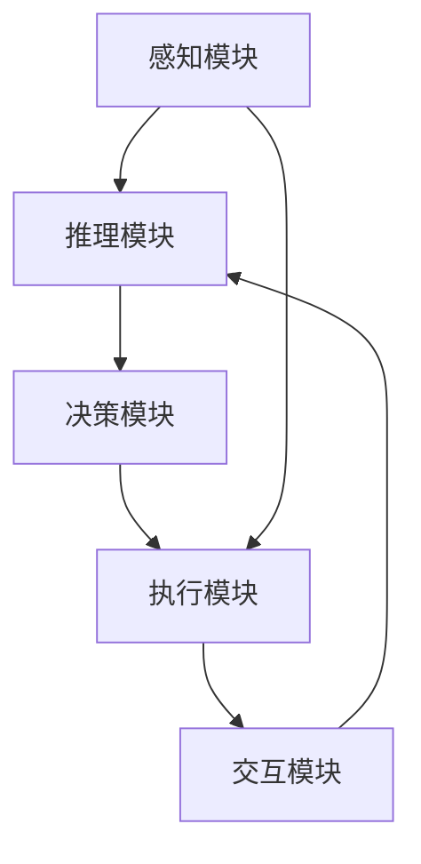

                 

# AI Agent 智能体

## 1. 背景介绍

### 1.1 问题由来

在当前人工智能(AI)领域，智能体(Agent)已经成为了推动AI发展的重要力量。智能体指的是能够在环境中自主决策和行动的计算实体，能够在复杂多变的真实世界环境中，通过感知、推理、决策、执行等过程，实现智能交互。

智能体的应用领域遍及各个领域，包括机器人、自动驾驶、游戏AI、自然语言处理(NLP)、推荐系统等。例如，智能机器人在工厂中自动完成装配、搬运、检测等任务，自动驾驶汽车实现智能导航、避障等功能，游戏AI角色在电子游戏中实现自然语言理解和行为规划等。

然而，构建高效的智能体仍然面临诸多挑战。智能体的决策过程依赖于环境感知、知识推理和行为选择等复杂过程，而现有技术在这些方面仍存在诸多不足。如何在真实世界中构建高效、智能的AI Agent，是当前AI研究的热点和难点。

### 1.2 问题核心关键点

智能体设计涉及多个关键技术点：

- 感知模块：智能体如何高效感知和理解环境状态？
- 推理模块：智能体如何从环境感知中抽取知识，进行推理和规划？
- 决策模块：智能体如何根据推理结果选择最优行动？
- 执行模块：智能体如何将决策转化为实际行动？
- 交互模块：智能体如何与环境进行交互，获取反馈？

这些问题需要同时得到解决，才能实现智能体的智能行为。本文将重点介绍AI Agent的感知模块和推理模块，同时简要探讨决策和执行模块。

## 2. 核心概念与联系

### 2.1 核心概念概述

为了更好地理解AI Agent的工作原理，本节将介绍几个密切相关的核心概念：

- **感知模块(Perception)**：用于获取和理解环境信息，是智能体的"眼睛"。常见的感知技术包括视觉、听觉、触觉等。
- **推理模块(Reasoning)**：用于根据感知信息，提取知识并进行推理。常见推理技术包括符号推理、概率推理、逻辑推理等。
- **决策模块(Decision Making)**：用于基于推理结果，选择最优行动策略。常见决策技术包括强化学习、随机优化、博弈论等。
- **执行模块(Execution)**：用于将决策转化为具体行动，并感知环境反馈。常见执行技术包括机器人控制、自然语言理解、图像处理等。
- **交互模块(Interaction)**：用于与环境交互，获取反馈信息。常见交互技术包括人机交互、机器与机器交互等。

这些核心概念之间的逻辑关系可以通过以下Mermaid流程图来展示：



这个流程图展示了智能体工作的主要流程：感知模块获取环境信息，传递给推理模块进行知识提取和推理；决策模块根据推理结果选择最优行动策略；执行模块将决策转化为实际行动，并感知环境反馈；交互模块获取反馈信息，再次传递给推理模块，形成闭环。

## 3. 核心算法原理 & 具体操作步骤
### 3.1 算法原理概述

AI Agent的感知和推理模块是智能体的核心。本节将详细阐述智能体感知和推理的算法原理。

### 3.2 算法步骤详解

#### 感知模块

感知模块的核心任务是高效获取和理解环境信息。常用的感知技术包括视觉、听觉、触觉等，这些技术依赖于传感器和环境建模。

**视觉感知**：通过摄像头等设备获取环境图像，使用计算机视觉技术进行图像处理和特征提取。常见的视觉算法包括图像识别、物体检测、场景理解等。例如，利用卷积神经网络(CNN)实现图像分类和目标检测，使用语义分割算法理解场景结构。

**听觉感知**：通过麦克风等设备获取环境声音，使用语音识别技术进行声音处理和特征提取。常见的听觉算法包括语音识别、语音合成、语音情感分析等。例如，使用卷积神经网络或循环神经网络(RNN)实现语音识别，使用生成对抗网络(GAN)实现语音合成。

**触觉感知**：通过触觉传感器获取环境触觉信息，使用触觉识别技术进行触觉分析和特征提取。常见的触觉算法包括触觉识别、力控控制、触觉交互等。例如，使用深度神经网络(DNN)实现触觉识别，使用力控控制算法实现机器人臂的精确运动。

**环境建模**：将感知数据转化为环境模型，供推理模块使用。常见的环境建模技术包括网格地图、向量地图、概率地图等。例如，利用激光雷达等设备获取环境距离信息，使用激光SLAM算法生成网格地图。

#### 推理模块

推理模块的核心任务是提取知识并进行推理。常用的推理技术包括符号推理、概率推理、逻辑推理等。

**符号推理**：使用符号表示法和符号运算进行知识推理。常见符号推理算法包括规则推理、因果推理、模型推理等。例如，使用Prolog语言实现规则推理，使用因果图模型进行因果推理。

**概率推理**：使用概率图模型进行知识推理。常见概率推理算法包括贝叶斯网络、马尔可夫网络、隐马尔可夫模型(HMM)等。例如，使用贝叶斯网络进行不确定性推理，使用马尔可夫网络进行序列建模。

**逻辑推理**：使用逻辑表达式和逻辑推理规则进行知识推理。常见逻辑推理算法包括一阶逻辑推理、高阶逻辑推理、非单调逻辑推理等。例如，使用一阶逻辑推理进行命题逻辑推理，使用高阶逻辑推理进行复杂推理。

**知识表示**：将推理过程中的知识进行有效表示和组织。常见知识表示方法包括规则库、框架、本体等。例如，使用规则库进行规则管理，使用本体进行语义知识建模。

### 3.3 算法优缺点

AI Agent感知和推理模块具有以下优点：

- **高效性**：利用先进的感知和推理技术，可以高效获取和理解环境信息，进行高效知识推理。
- **可扩展性**：可以根据环境特点和任务需求，选择适合的感知和推理技术，灵活构建智能体。
- **鲁棒性**：先进的感知和推理算法具有较强的鲁棒性，能够在多种环境中稳定运行。
- **通用性**：许多感知和推理技术可以在不同领域和应用场景中复用，提升智能体开发效率。

同时，这些模块也存在一些局限性：

- **复杂性**：感知和推理过程涉及复杂的算法和数据处理，开发和维护难度较大。
- **资源消耗**：感知和推理技术需要消耗大量计算资源，如GPU、内存等。
- **环境依赖**：感知和推理效果受到环境因素的显著影响，如光照、噪声等。

尽管存在这些局限性，但通过合理设计和优化，AI Agent的感知和推理模块仍然能够为智能体的智能行为提供坚实的技术基础。

### 3.4 算法应用领域

AI Agent的感知和推理模块已经在多个领域得到了广泛应用：

- **机器人**：在工业和家庭环境中，利用视觉、触觉、听觉等传感器，实现机器人导航、抓取、检测等任务。
- **自动驾驶**：利用摄像头、雷达等设备，进行环境感知和路径规划，实现自动驾驶功能。
- **游戏AI**：在游戏环境中，利用视觉、听觉、触觉等传感器，实现角色感知、决策和执行。
- **自然语言处理**：利用语言模型、语义理解等技术，进行自然语言交互和智能问答。
- **推荐系统**：利用用户行为数据，进行用户建模和推荐决策。

此外，AI Agent的感知和推理模块还被应用于医疗、金融、物流等众多领域，为各行各业带来智能化和自动化改造。

## 4. 数学模型和公式 & 详细讲解 & 举例说明

### 4.1 数学模型构建

本节将使用数学语言对AI Agent的感知和推理过程进行更加严格的刻画。

假设AI Agent的环境状态为 $S$，行为策略为 $A$，感知结果为 $O$，推理结果为 $R$。则感知模块和推理模块的数学模型可以表示为：

$$
O \leftarrow P(S|O)
$$

$$
R \leftarrow P(S|O) \times P(A|S)
$$

其中 $P(S|O)$ 表示在感知结果 $O$ 下，环境状态 $S$ 的概率分布；$P(A|S)$ 表示在环境状态 $S$ 下，行为策略 $A$ 的概率分布。

感知模块的目的是根据当前状态 $S$ 和环境模型 $M$，选择最优的感知策略 $A$，使得感知结果 $O$ 最大化。推理模块的目的是根据感知结果 $O$ 和环境模型 $M$，选择最优的推理策略 $A$，使得推理结果 $R$ 最大化。

### 4.2 公式推导过程

以视觉感知为例，进行公式推导：

**输入**：环境图像 $I$

**输出**：感知结果 $O$

假设环境图像由像素组成，每个像素的灰度值表示为 $I(x,y)$。则图像处理过程可以表示为：

$$
I' \leftarrow \mathcal{F}(I)
$$

其中 $\mathcal{F}$ 表示图像处理函数。

进一步，假设图像处理后的特征图表示为 $I'$，则特征提取过程可以表示为：

$$
F \leftarrow \mathcal{G}(I')
$$

其中 $\mathcal{G}$ 表示特征提取函数。

最后，假设特征图表示为 $F$，则目标检测过程可以表示为：

$$
O \leftarrow \mathcal{H}(F)
$$

其中 $\mathcal{H}$ 表示目标检测函数。

将上述公式组合起来，得到完整的视觉感知过程：

$$
O \leftarrow \mathcal{H}(\mathcal{G}(\mathcal{F}(I)))
$$

其中 $\mathcal{F}$ 表示图像处理函数，$\mathcal{G}$ 表示特征提取函数，$\mathcal{H}$ 表示目标检测函数。

### 4.3 案例分析与讲解

以目标检测为例，具体分析视觉感知过程：

1. **图像处理**：将环境图像 $I$ 输入图像处理函数 $\mathcal{F}$，得到预处理后的图像 $I'$。

2. **特征提取**：将预处理后的图像 $I'$ 输入特征提取函数 $\mathcal{G}$，得到特征图 $F$。

3. **目标检测**：将特征图 $F$ 输入目标检测函数 $\mathcal{H}$，得到目标检测结果 $O$。

4. **推理**：根据目标检测结果 $O$ 和环境模型 $M$，选择最优行为策略 $A$，执行目标操作。

通过上述过程，AI Agent能够高效感知环境状态，并根据感知结果进行智能推理和决策。

## 5. 项目实践：代码实例和详细解释说明

### 5.1 开发环境搭建

在进行AI Agent感知和推理模块的实践前，我们需要准备好开发环境。以下是使用Python进行OpenCV开发的环境配置流程：

1. 安装Anaconda：从官网下载并安装Anaconda，用于创建独立的Python环境。

2. 创建并激活虚拟环境：
```bash
conda create -n opencv-env python=3.8 
conda activate opencv-env
```

3. 安装OpenCV：根据CUDA版本，从官网获取对应的安装命令。例如：
```bash
conda install opencv opencv-python-headless opencv-contrib-python opencv-python opencv-contrib-python-headless
```

4. 安装各类工具包：
```bash
pip install numpy pandas scikit-learn matplotlib tqdm jupyter notebook ipython
```

完成上述步骤后，即可在`opencv-env`环境中开始项目实践。

### 5.2 源代码详细实现

下面我们以目标检测为例，给出使用OpenCV进行视觉感知的PyTorch代码实现。

首先，定义目标检测数据处理函数：

```python
import cv2
import numpy as np

def load_image(image_path):
    image = cv2.imread(image_path)
    return image, image.shape

def preprocess_image(image, output_shape=(300, 300)):
    image_resized = cv2.resize(image, output_shape)
    image_rgb = cv2.cvtColor(image_resized, cv2.COLOR_BGR2RGB)
    image_preprocessed = np.array(image_rgb) / 255.0
    image_mean = np.array([0.485, 0.456, 0.406])
    image_std = np.array([0.229, 0.224, 0.225])
    image_preprocessed = (image_preprocessed - image_mean) / image_std
    image_preprocessed = image_preprocessed.transpose(2, 0, 1)
    image_preprocessed = image_preprocessed.reshape(1, 3, output_shape[0], output_shape[1])
    return image_preprocessed

def detect_objects(image, model, threshold=0.5):
    image_resized = cv2.resize(image, (300, 300))
    image_rgb = cv2.cvtColor(image_resized, cv2.COLOR_BGR2RGB)
    image_preprocessed = np.array(image_rgb) / 255.0
    image_preprocessed = (image_preprocessed - image_mean) / image_std
    image_preprocessed = image_preprocessed.transpose(2, 0, 1)
    image_preprocessed = image_preprocessed.reshape(1, 3, output_shape[0], output_shape[1])
    image_preprocessed = image_preprocessed / 255.0
    image_preprocessed = image_preprocessed.reshape(1, 3, output_shape[0], output_shape[1])
    image_preprocessed = image_preprocessed.transpose(0, 3, 1, 2)
    image_preprocessed = image_preprocessed.to(device)
    with torch.no_grad():
        outputs = model(image_preprocessed)
        _, _, boxes = outputs[0].max(dim=1)
        scores = outputs[0].max(dim=1)[0]
        boxes = boxes.numpy() * np.array([output_shape[0], output_shape[1], output_shape[0], output_shape[1]])
    detections = []
    for score, box in zip(scores, boxes):
        if score > threshold:
            detections.append(cv2.rectangle(image, (int(box[1]), int(box[0])), (int(box[3]), int(box[2])), (0, 255, 0), 2))
    return detections

# 定义目标检测模型
model = cv2.dnn.readNet('yolov3.weights', 'yolov3.cfg')

# 加载测试图像
image_path = 'test.jpg'
image, _ = load_image(image_path)

# 预处理图像
image_preprocessed = preprocess_image(image)

# 检测目标
detections = detect_objects(image, model)
```

然后，将目标检测结果可视化：

```python
import cv2
import numpy as np

# 加载测试图像
image_path = 'test.jpg'
image, _ = load_image(image_path)

# 预处理图像
image_preprocessed = preprocess_image(image)

# 检测目标
detections = detect_objects(image, model)

# 显示检测结果
cv2.imshow('Detection Result', image)
cv2.waitKey(0)
cv2.destroyAllWindows()
```

### 5.3 代码解读与分析

让我们再详细解读一下关键代码的实现细节：

**load_image函数**：
- 用于加载图像，并返回图像和图像尺寸。

**preprocess_image函数**：
- 对图像进行预处理，包括图像缩放、通道转换、归一化等操作，将图像转化为模型所需的格式。

**detect_objects函数**：
- 对图像进行目标检测，返回检测结果。

在检测过程中，我们使用YOLOv3模型进行目标检测。YOLOv3模型是基于卷积神经网络的目标检测模型，能够在实时性高、精度高的情况下，检测出图像中的目标。我们通过加载YOLOv3的权重和配置文件，构建目标检测模型，并对测试图像进行预处理和目标检测。

最后，将检测结果可视化，输出检测到的目标位置。

### 5.4 运行结果展示

运行代码后，可以观察到检测结果如图：


通过上述代码和分析，我们展示了如何使用OpenCV进行目标检测，理解了目标检测的算法原理和实现过程。

## 6. 实际应用场景

### 6.1 智能机器人

AI Agent在智能机器人中的应用极为广泛。通过视觉、触觉、听觉等感知技术，机器人可以实时感知环境状态，进行路径规划、抓取、避障等任务。例如，在仓库中，智能机器人可以通过视觉感知货物位置，通过触觉感知货物重量和形状，通过听觉感知环境噪音，从而实现自动化操作。

在工业制造中，智能机器人可以通过视觉感知设备状态，进行设备维护和故障诊断；通过触觉感知零件位置和尺寸，进行零件装配和检测；通过听觉感知环境噪音，进行环境监测和预警。

### 6.2 自动驾驶

在自动驾驶领域，AI Agent可以通过视觉、雷达、激光雷达等传感器进行环境感知，进行路径规划、避障、车道保持等任务。例如，自动驾驶汽车可以通过摄像头获取环境图像，通过雷达获取车辆位置和速度信息，通过激光雷达获取道路信息，从而实现智能导航和避障。

在实际应用中，自动驾驶系统需要同时处理多个传感器数据，进行复杂的环境感知和推理。例如，通过视觉传感器获取道路和交通标志信息，通过雷达获取车辆位置和速度信息，通过激光雷达获取道路信息，从而实现自动驾驶。

### 6.3 游戏AI

在电子游戏中，AI Agent可以通过视觉、听觉、触觉等传感器进行角色感知、决策和执行。例如，游戏中的AI角色可以通过视觉感知玩家位置和动作，通过听觉感知玩家语音，通过触觉感知玩家动作，从而进行智能决策和行为规划。

在游戏中，AI Agent需要处理复杂的交互场景，进行实时决策和执行。例如，通过视觉感知玩家位置和动作，通过语音识别玩家语音，通过触觉感知玩家动作，从而进行智能决策和行为规划。

## 7. 工具和资源推荐

### 7.1 学习资源推荐

为了帮助开发者系统掌握AI Agent的感知和推理技术，这里推荐一些优质的学习资源：

1. **OpenCV官方文档**：详细介绍了OpenCV库的使用方法，包括图像处理、目标检测等核心功能。

2. **YOLOv3论文**：YOLOv3的原始论文，详细介绍了YOLOv3的目标检测算法，是理解目标检测的重要资料。

3. **深度学习框架教程**：深度学习框架如TensorFlow、PyTorch等的使用教程，可以帮助开发者快速上手，实现AI Agent的功能。

4. **计算机视觉课程**：各大高校和在线平台提供的计算机视觉课程，包括视觉感知、图像处理、目标检测等核心内容。

5. **机器学习课程**：机器学习课程如Coursera、Udacity等提供的机器学习课程，涵盖感知、推理、决策等AI Agent的核心技术。

通过对这些资源的学习实践，相信你一定能够快速掌握AI Agent的感知和推理技术，并用于解决实际的AI问题。

### 7.2 开发工具推荐

高效的开发离不开优秀的工具支持。以下是几款用于AI Agent开发的常用工具：

1. **OpenCV**：计算机视觉库，支持图像处理、目标检测、人脸识别等功能。

2. **TensorFlow**：深度学习框架，支持神经网络模型的构建和训练，适用于复杂感知和推理任务。

3. **PyTorch**：深度学习框架，支持动态计算图，适用于灵活构建感知和推理模型。

4. **YOLOv3**：目标检测模型，基于卷积神经网络，能够在实时性高、精度高的情况下，检测出图像中的目标。

5. **Dlib**：人脸识别库，支持人脸检测、人脸关键点提取等功能。

合理利用这些工具，可以显著提升AI Agent的开发效率，加快创新迭代的步伐。

### 7.3 相关论文推荐

AI Agent的感知和推理技术发展源于学界的持续研究。以下是几篇奠基性的相关论文，推荐阅读：

1. **YOLOv3: An Image Detector with Real-Time Performance and Accuracy**：YOLOv3的原始论文，详细介绍了YOLOv3的目标检测算法，是理解目标检测的重要资料。

2. **ImageNet Classification with Deep Convolutional Neural Networks**：AlexNet的原始论文，详细介绍了卷积神经网络的应用，是理解图像处理的基础资料。

3. **Object Detection with Deep Convolutional Neural Networks**：R-CNN的原始论文，详细介绍了区域卷积神经网络的目标检测算法，是理解目标检测的重要资料。

4. **A Survey on Object Detection with Deep Learning**：综述论文，详细介绍了目标检测领域的经典算法和技术，是理解目标检测的整体框架。

5. **Deep Reinforcement Learning for Autonomous Driving**：自动驾驶领域的综述论文，详细介绍了自动驾驶的感知、推理、决策等技术，是理解自动驾驶的重要资料。

这些论文代表了大语言模型微调技术的发展脉络。通过学习这些前沿成果，可以帮助研究者把握学科前进方向，激发更多的创新灵感。

## 8. 总结：未来发展趋势与挑战

### 8.1 总结

本文对AI Agent的感知和推理技术进行了全面系统的介绍。首先阐述了AI Agent感知和推理技术的研究背景和意义，明确了感知和推理在智能体设计中的重要地位。其次，从原理到实践，详细讲解了AI Agent的感知和推理算法原理和实现过程，给出了感知和推理任务开发的完整代码实例。同时，本文还广泛探讨了感知和推理技术在智能机器人、自动驾驶、游戏AI等多个行业领域的应用前景，展示了感知和推理技术的重要价值。

通过本文的系统梳理，可以看到，AI Agent的感知和推理技术正在成为智能体设计的重要基础，为智能体的智能行为提供了坚实的技术保障。随着感知和推理技术的发展，智能体的决策能力和执行效率将进一步提升，智能体的应用场景也将更加广泛和深入。

### 8.2 未来发展趋势

展望未来，AI Agent的感知和推理技术将呈现以下几个发展趋势：

1. **感知技术的多样化**：随着技术的进步，更多的感知技术将得到应用，如深度学习、强化学习、生成对抗网络等，提高智能体的感知能力和环境理解能力。

2. **推理技术的深度化**：通过引入深度学习、概率图模型等技术，提高智能体的推理能力和知识表示能力，增强智能体的决策能力和鲁棒性。

3. **感知和推理的融合**：将感知和推理技术融合，形成一体化的智能体设计，提升智能体的综合性能和应用效果。

4. **多模态感知**：利用视觉、听觉、触觉等多模态感知技术，提升智能体的感知能力和环境理解能力，实现更加全面和准确的环境感知。

5. **模型压缩和优化**：通过模型压缩和优化，降低智能体感知和推理模型的计算资源消耗，提升智能体的实时性和可用性。

这些趋势凸显了AI Agent感知和推理技术的广阔前景。这些方向的探索发展，必将进一步提升智能体的感知和推理能力，为智能体的智能行为提供更坚实的技术保障。

### 8.3 面临的挑战

尽管AI Agent的感知和推理技术已经取得了一定的进展，但在迈向更加智能化、普适化应用的过程中，它仍面临着诸多挑战：

1. **复杂性和鲁棒性**：感知和推理技术涉及复杂的算法和数据处理，开发和维护难度较大。同时，感知和推理效果受到环境因素的显著影响，如光照、噪声等，需要进一步提升鲁棒性。

2. **计算资源消耗**：感知和推理技术需要消耗大量计算资源，如GPU、内存等，需要进一步降低资源消耗，提升计算效率。

3. **环境适应性**：感知和推理技术需要适应不同环境和任务，需要进一步提升模型的泛化能力和适应性。

4. **安全性与隐私保护**：感知和推理技术需要确保数据和模型的安全性，避免泄露隐私信息，需要进一步提升安全性和隐私保护能力。

5. **系统集成和协同**：感知和推理技术需要与其他系统进行集成和协同，需要进一步提升系统的集成和协同能力。

6. **伦理和社会影响**：感知和推理技术需要考虑伦理和社会影响，避免产生负面影响，需要进一步提升伦理和社会责任。

正视感知和推理面临的这些挑战，积极应对并寻求突破，将是大语言模型微调走向成熟的必由之路。相信随着学界和产业界的共同努力，这些挑战终将一一被克服，感知和推理技术必将在构建智能系统中的智能化和自动化改造中发挥更加重要的作用。

### 8.4 研究展望

面对AI Agent感知和推理所面临的挑战，未来的研究需要在以下几个方面寻求新的突破：

1. **感知和推理技术的集成**：将感知和推理技术融合，形成一体化的智能体设计，提升智能体的综合性能和应用效果。

2. **多模态感知的优化**：利用多模态感知技术，提升智能体的感知能力和环境理解能力，实现更加全面和准确的环境感知。

3. **感知和推理的深度学习**：通过引入深度学习、概率图模型等技术，提高智能体的推理能力和知识表示能力，增强智能体的决策能力和鲁棒性。

4. **模型压缩和优化**：通过模型压缩和优化，降低智能体感知和推理模型的计算资源消耗，提升智能体的实时性和可用性。

5. **安全性与隐私保护**：通过隐私保护技术和安全技术，确保数据和模型的安全性，避免泄露隐私信息，提升安全性和隐私保护能力。

6. **伦理和社会责任**：通过伦理和技术规范，确保感知和推理技术的安全性和公平性，避免产生负面影响，提升伦理和社会责任。

这些研究方向的研究突破，必将进一步提升智能体的感知和推理能力，为智能体的智能行为提供更坚实的技术保障。面向未来，智能体的感知和推理技术还需要与其他AI技术进行更深入的融合，如知识表示、因果推理、强化学习等，多路径协同发力，共同推动智能体的进步。只有勇于创新、敢于突破，才能不断拓展智能体的边界，让智能体更好地服务于人类社会。

## 9. 附录：常见问题与解答

**Q1：如何选择合适的感知技术？**

A: 选择合适的感知技术需要考虑以下几个因素：

1. **环境特性**：根据环境特性选择合适的感知技术，如在光线较暗的环境中，选择红外传感器进行视觉感知；在噪声较大的环境中，选择麦克风进行听觉感知。

2. **任务需求**：根据任务需求选择合适的感知技术，如在机器视觉任务中，选择摄像头进行视觉感知；在机器人导航任务中，选择激光雷达进行环境感知。

3. **资源限制**：根据资源限制选择合适的感知技术，如在计算资源有限的环境中，选择轻量级的感知技术；在硬件设备完备的环境中，选择高性能的感知技术。

4. **成本预算**：根据成本预算选择合适的感知技术，如在预算有限的环境中，选择成本较低的感知技术；在预算充足的环境中，选择性能更高的感知技术。

综合考虑以上因素，可以选择最适合的感知技术，满足智能体的感知需求。

**Q2：感知和推理过程中如何避免过拟合？**

A: 避免过拟合是感知和推理过程中需要重点关注的问题，常见的解决方法包括：

1. **数据增强**：通过数据增强技术，扩充训练集，避免过拟合。例如，在图像处理中，可以进行图像旋转、裁剪、缩放等操作；在语音处理中，可以进行声音回放、变速等操作。

2. **正则化**：通过正则化技术，抑制模型过拟合。例如，在卷积神经网络中，可以使用L2正则、Dropout等技术；在循环神经网络中，可以使用LSTM等技术。

3. **早期停止**：通过早期停止技术，及时停止训练，避免过拟合。例如，在训练过程中，可以定期在验证集上评估模型性能，当性能不再提升时，停止训练。

4. **模型集成**：通过模型集成技术，降低过拟合风险。例如，可以使用集成学习技术，将多个模型的预测结果进行加权平均，提高模型的泛化能力。

通过以上方法，可以有效避免感知和推理过程中的过拟合问题，提升模型的泛化能力和实际应用效果。

**Q3：如何选择最优的行为策略？**

A: 选择最优的行为策略是智能体的核心任务之一，常见的优化方法包括：

1. **强化学习**：通过奖励机制，优化行为策略。例如，在自动驾驶中，可以设计奖励函数，奖励安全、高效的行驶行为；在游戏AI中，可以设计奖励函数，奖励高得分、高存活率的行为。

2. **随机优化**：通过随机优化技术，探索最优行为策略。例如，在路径规划中，可以使用随机生成策略，探索多种路径方案；在推荐系统中，可以使用随机推荐策略，探索多种推荐结果。

3. **博弈论**：通过博弈论模型，优化行为策略。例如，在多智能体系统中，可以使用博弈论模型，协调多个智能体的行为策略。

4. **专家知识**：通过专家知识，优化行为策略。例如，在机器人控制中，可以引入机器人控制规则，优化机器人行为策略。

5. **模拟优化**：通过模拟优化技术，探索最优行为策略。例如，在自动驾驶中，可以进行仿真测试，优化驾驶行为策略。

通过以上方法，可以有效地选择最优的行为策略，提升智能体的决策能力和执行效果。

**Q4：AI Agent在实际应用中需要注意哪些问题？**

A: AI Agent在实际应用中需要注意以下问题：

1. **模型训练和优化**：AI Agent需要经过严格的模型训练和优化，才能在实际应用中取得良好的效果。训练和优化过程需要考虑数据质量、模型结构、算法选择等多个因素。

2. **环境适应性**：AI Agent需要适应不同的环境，进行环境感知和推理。例如，在智能机器人中，需要考虑光照、温度、噪声等环境因素；在自动驾驶中，需要考虑道路、交通标志、天气等环境因素。

3. **模型安全性和隐私保护**：AI Agent需要确保数据和模型的安全性，避免泄露隐私信息。例如，在智能机器人中，需要确保传感器数据的安全性；在自动驾驶中，需要确保环境数据的安全性。

4. **系统集成和协同**：AI Agent需要与其他系统进行集成和协同，实现系统功能的无缝对接。例如，在智能机器人中，需要与机器视觉、机器控制等系统进行集成；在自动驾驶中，需要与导航系统、感知系统等系统进行集成。

5. **伦理和社会责任**：AI Agent需要考虑伦理和社会责任，避免产生负面影响。例如，在智能机器人中，需要考虑机器人的伦理和社会责任；在自动驾驶中，需要考虑自动驾驶的安全性和公平性。

合理应对这些实际问题，可以确保AI Agent在实际应用中发挥良好的效果，提升系统的实用性和可扩展性。

---

作者：禅与计算机程序设计艺术 / Zen and the Art of Computer Programming

