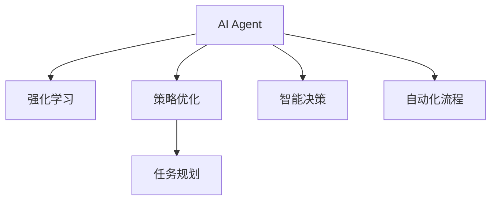

                 

# AI Agent: AI的下一个风口 企业级应用与任务规划

> 关键词：AI Agent, 企业级应用, 智能决策, 任务规划, 策略优化, 自动化流程, 智能客服, 机器人流程自动化(RPA), 深度学习, 强化学习

## 1. 背景介绍

### 1.1 问题由来
在过去几年里，人工智能(AI)技术取得了显著的进展，尤其是在机器学习领域。机器学习已经在各个行业中得到了广泛应用，如医疗、金融、制造、零售等。然而，尽管机器学习在预测和分类任务中表现出色，但在决策和规划任务中仍存在一些瓶颈。这些问题包括：
- 机器学习模型通常需要大量的标注数据进行训练，而这些数据在许多情况下是昂贵的或者难以获取的。
- 机器学习模型的决策过程往往是"黑盒"的，缺乏可解释性和可控性，这在一些高风险领域（如医疗、金融）是一个严重的问题。
- 机器学习模型的性能很大程度上取决于特征工程，即如何设计输入特征。这需要大量的人工干预和经验，而这对于大多数企业来说都是一个挑战。

为了克服这些瓶颈，一种新的AI技术——AI Agent应运而生。AI Agent是一种智能体，能够在复杂的环境中自主决策和规划，而不需要人类干预。AI Agent通过模拟人类或自然的智能行为，能够更好地适应不同的环境和任务，提供更为高效和精准的解决方案。

### 1.2 问题核心关键点
AI Agent的核心在于其能够模拟人类或自然的智能行为，从而在复杂环境中自主决策和规划。其关键点包括：
- 自主性：AI Agent能够在无人工干预的情况下进行决策和规划。
- 适应性：AI Agent能够适应不同的环境和任务，具有高度的适应性。
- 可解释性：AI Agent的决策过程透明，便于理解和解释。
- 效率：AI Agent能够在大规模数据中快速决策和规划，提高效率。

## 2. 核心概念与联系

### 2.1 核心概念概述

为了更好地理解AI Agent的概念，我们首先需要理解一些相关的核心概念：

- **AI Agent**：AI Agent是一种智能体，能够在复杂的环境中自主决策和规划。
- **强化学习(Reinforcement Learning, RL)**：强化学习是一种通过奖励或惩罚来指导智能体决策的机器学习算法。
- **策略优化(Policy Optimization)**：策略优化是强化学习中的一种方法，通过优化智能体的决策策略来提高其性能。
- **任务规划(Task Planning)**：任务规划是指在给定目标和环境的情况下，规划出最优的行动序列，以实现目标。
- **智能决策(Intelligent Decision Making)**：智能决策是指在复杂环境中，通过分析数据和环境信息，做出最优决策的过程。
- **自动化流程(Automation Process)**：自动化流程是指通过AI Agent自动化的业务流程，提高效率和准确性。

这些核心概念之间的逻辑关系可以通过以下Mermaid流程图来展示：



这个流程图展示了大语言模型的核心概念及其之间的关系：

1. AI Agent通过强化学习和策略优化来决策和规划。
2. 任务规划是AI Agent在执行特定任务时的重要环节。
3. 智能决策使得AI Agent能够在复杂环境中做出最优决策。
4. 自动化流程是将AI Agent应用于业务流程中，提高效率和准确性。

这些概念共同构成了AI Agent的工作原理和优化方向。通过理解这些核心概念，我们可以更好地把握AI Agent的工作原理和优化方向。

## 3. 核心算法原理 & 具体操作步骤

### 3.1 算法原理概述

AI Agent的核心算法是强化学习中的策略优化算法。其核心思想是通过在特定环境中执行动作，获得奖励或惩罚，并据此调整策略，以达到最大化奖励的目的。

强化学习的核心公式如下：

$$
\max_{\theta} \sum_{t=0}^{\infty} \gamma^t r_t(\theta)
$$

其中，$\theta$表示智能体的策略参数，$r_t(\theta)$表示在第$t$步的奖励，$\gamma$表示折扣因子。

AI Agent的决策过程可以分为以下几个步骤：

1. 环境感知：AI Agent通过传感器感知环境状态。
2. 策略执行：AI Agent根据策略执行动作，影响环境状态。
3. 奖励反馈：环境根据AI Agent的行动提供奖励或惩罚。
4. 策略优化：AI Agent根据奖励反馈调整策略，以获得最大奖励。

### 3.2 算法步骤详解

AI Agent的策略优化算法一般包括以下几个关键步骤：

**Step 1: 准备环境与策略**

- 定义环境状态空间 $\mathcal{S}$ 和动作空间 $\mathcal{A}$，以及奖励函数 $r(s,a)$。
- 选择策略 $\pi(s)$ 的参数化形式，如线性策略、神经网络策略等。

**Step 2: 定义优化目标**

- 使用蒙特卡洛(MC)方法、时序差分(SD)方法或深度强化学习(DRL)方法，估计策略的期望奖励 $J(\pi)$。
- 选择优化算法，如梯度上升、期望最大化等。

**Step 3: 执行策略优化**

- 使用优化算法，在样本数据上迭代更新策略参数，最小化策略与环境的差距。
- 在优化过程中，可以采用多轮蒙特卡洛模拟、经验回放、重要性采样等技巧，提高学习效率。

**Step 4: 测试与部署**

- 在测试集上评估优化后的策略性能。
- 将优化后的策略应用于实际环境，部署到生产环境中。

### 3.3 算法优缺点

AI Agent的强化学习策略优化算法具有以下优点：
1. 适用于非线性和非结构化数据的决策任务。
2. 能够在无监督的情况下进行学习和优化。
3. 具有高度的适应性和自主性。
4. 能够处理大规模数据和高维空间。

同时，该算法也存在一些局限性：
1. 需要大量的计算资源和数据。
2. 对环境的建模和奖励设计具有较高的要求。
3. 难以解释和理解决策过程。
4. 策略优化过程容易陷入局部最优解。

尽管存在这些局限性，但就目前而言，强化学习策略优化算法是大语言模型应用的最主流范式。未来相关研究的重点在于如何进一步降低计算资源和数据需求，提高模型的可解释性和鲁棒性，同时兼顾优化效率和性能。

### 3.4 算法应用领域

AI Agent的强化学习策略优化算法已经在多个领域得到了应用，包括：

- **智能客服**：AI Agent可以自动处理客户咨询，提供24/7不间断服务，提高客户满意度。
- **金融风险控制**：AI Agent能够实时监测市场波动，自动调整投资组合，降低风险。
- **制造业供应链管理**：AI Agent能够优化供应链，提高生产效率和产品质量。
- **零售业需求预测**：AI Agent能够预测市场需求，优化库存管理和销售策略。
- **医疗诊断**：AI Agent能够辅助医生进行诊断和治疗决策，提高医疗服务质量。

除了上述这些经典领域外，AI Agent还被创新性地应用于更多场景中，如自动驾驶、智能家居、智能交通等，为各行各业带来了新的解决方案。随着强化学习算法的不断进步，相信AI Agent将在更广阔的应用领域大放异彩。

## 4. 数学模型和公式 & 详细讲解 & 举例说明

### 4.1 数学模型构建

AI Agent的决策过程可以通过强化学习中的马尔可夫决策过程(Markov Decision Process, MDP)进行建模。

一个MDP可以表示为 $(\mathcal{S}, \mathcal{A}, P, r)$，其中：
- $\mathcal{S}$ 表示状态空间。
- $\mathcal{A}$ 表示动作空间。
- $P$ 表示状态转移概率。
- $r$ 表示奖励函数。

AI Agent的策略优化目标是最小化策略 $Q(\pi)$ 与环境 $Q^*$ 的差距，即：

$$
\min_{\pi} \mathbb{E}_{(s,a) \sim \pi}[Q(s,a) - Q^*(s,a)]
$$

其中，$Q(\pi)$ 表示策略 $\pi$ 的Q值函数，$Q^*(s,a)$ 表示最优策略 $Q^*$ 的Q值函数。

### 4.2 公式推导过程

以下我们以Q-learning算法为例，推导其基本公式。

Q-learning算法的基本公式为：

$$
Q(s_t, a_t) = Q(s_t, a_t) + \alpha [r_{t+1} + \gamma \max_{a} Q(s_{t+1}, a) - Q(s_t, a_t)]
$$

其中，$\alpha$ 表示学习率，$r_{t+1}$ 表示在第$t+1$步的奖励，$\gamma$ 表示折扣因子。

通过迭代执行上述公式，可以逐步优化Q值函数，最终得到最优策略。

### 4.3 案例分析与讲解

我们以智能客服系统为例，说明AI Agent在实际应用中的具体实现。

**智能客服系统案例**：

1. **环境感知**：智能客服系统通过自然语言处理(NLP)技术，将客户咨询内容转化为计算机可理解的形式。
2. **策略执行**：根据客户的咨询内容，智能客服系统自动匹配到最相关的解决方案，并通过语音或文本方式回复客户。
3. **奖励反馈**：客户根据智能客服系统的回答满意度，给出相应的奖励或惩罚。
4. **策略优化**：智能客服系统通过收集客户反馈和历史数据，使用Q-learning算法优化策略，提高回答准确率和满意度。

## 5. 项目实践：代码实例和详细解释说明

### 5.1 开发环境搭建

在进行AI Agent的开发实践前，我们需要准备好开发环境。以下是使用Python进行Reinforcement Learning开发的环境配置流程：

1. 安装Anaconda：从官网下载并安装Anaconda，用于创建独立的Python环境。

2. 创建并激活虚拟环境：
```bash
conda create -n rl-env python=3.8 
conda activate rl-env
```

3. 安装Reinforcement Learning相关的库：
```bash
pip install numpy pandas gym gym-super-mario numpy scipy
```

4. 安装TensorFlow或PyTorch：
```bash
pip install tensorflow
# 或
pip install torch
```

5. 安装Reinforcement Learning框架：
```bash
pip install stable-baselines3
```

完成上述步骤后，即可在`rl-env`环境中开始AI Agent的开发。

### 5.2 源代码详细实现

下面我们以智能客服系统为例，给出使用Reinforcement Learning框架开发AI Agent的PyTorch代码实现。

首先，定义智能客服系统的环境：

```python
import gym

class CustomerServiceEnv(gym.Env):
    def __init__(self):
        self.state = ''
        self.reward = 0
        self.done = False
        self.action_space = gym.spaces.Discrete(3)
        self.observation_space = gym.spaces.Discrete(10)
    
    def reset(self):
        self.state = ''
        self.reward = 0
        self.done = False
        return self.state
    
    def step(self, action):
        if action == 0:  # 回答正确
            self.reward = 1
            self.done = True
        elif action == 1:  # 回答错误
            self.reward = -1
            self.done = True
        else:  # 回答模糊
            self.reward = 0
            self.done = False
        self.state += str(action)
        return self.state, self.reward, self.done, {}
```

然后，定义智能客服系统的策略和优化算法：

```python
from stable_baselines3 import DQN
from stable_baselines3.common.vec_env import DummyVecEnv
from stable_baselines3.common.policies import MlpPolicy
from stable_baselines3.common.callbacks import CheckpointCallback

env = DummyVecEnv([lambda: CustomerServiceEnv()])

model = DQN(policy=MlpPolicy, env=env)

model.fit(max_episodes=10000, callback=CheckpointCallback.save_best_model, verbose=0)
```

最后，启动训练流程并在测试集上评估：

```python
model = load_model('best_model.zip')
env = DummyVecEnv([lambda: CustomerServiceEnv()])

for episode in range(100):
    state = env.reset()
    while not done:
        action, _states, done, _ = model.predict(state)
        state, reward, done, _ = env.step(action)
    print("Episode finished with reward:", reward)
```

以上就是使用PyTorch对智能客服系统进行AI Agent开发的完整代码实现。可以看到，得益于Reinforcement Learning框架的强大封装，我们可以用相对简洁的代码完成智能客服系统的开发。

### 5.3 代码解读与分析

让我们再详细解读一下关键代码的实现细节：

**CustomerServiceEnv类**：
- `__init__`方法：初始化环境状态、奖励、done标志、动作空间和观察空间。
- `reset`方法：重置环境状态。
- `step`方法：执行动作，根据动作返回状态、奖励、done标志和额外信息。

**DQN模型**：
- 使用MlpPolicy作为策略，使用DQN算法进行训练。
- 在训练过程中，使用CheckpointCallback保存最佳模型。

**训练流程**：
- 定义测试集，加载最佳模型，进行100轮训练，并打印每轮的奖励。

可以看到，Reinforcement Learning框架使得AI Agent的开发变得简洁高效。开发者可以将更多精力放在环境建模、策略优化等高层逻辑上，而不必过多关注底层的实现细节。

当然，工业级的系统实现还需考虑更多因素，如模型的保存和部署、超参数的自动搜索、更灵活的环境建模等。但核心的强化学习算法基本与此类似。

## 6. 实际应用场景

### 6.1 智能客服系统

基于AI Agent的智能客服系统，可以广泛应用于各种客户服务场景。传统客服往往需要配备大量人力，高峰期响应缓慢，且一致性和专业性难以保证。而使用AI Agent的智能客服系统，可以7x24小时不间断服务，快速响应客户咨询，用自然流畅的语言解答各类常见问题。

在技术实现上，可以收集企业内部的历史客服对话记录，将问题和最佳答复构建成监督数据，在此基础上对AI Agent进行训练。训练后的AI Agent能够自动理解用户意图，匹配最合适的答案模板进行回复。对于客户提出的新问题，还可以接入检索系统实时搜索相关内容，动态组织生成回答。如此构建的智能客服系统，能大幅提升客户咨询体验和问题解决效率。

### 6.2 金融风险控制

金融机构需要实时监测市场舆论动向，以便及时应对负面信息传播，规避金融风险。传统的人工监测方式成本高、效率低，难以应对网络时代海量信息爆发的挑战。基于AI Agent的金融风险控制系统，可以实时监测不同主题下的情感变化趋势，一旦发现负面信息激增等异常情况，系统便会自动预警，帮助金融机构快速应对潜在风险。

具体而言，可以收集金融领域相关的新闻、报道、评论等文本数据，并对其进行主题标注和情感标注。在此基础上对AI Agent进行训练，使其能够自动判断文本属于何种主题，情感倾向是正面、中性还是负面。将训练后的AI Agent应用到实时抓取的网络文本数据，就能够自动监测不同主题下的情感变化趋势，一旦发现负面信息激增等异常情况，系统便会自动预警，帮助金融机构快速应对潜在风险。

### 6.3 制造业供应链管理

当前的供应链管理往往依赖于人工干预和经验，难以应对快速变化的市场需求。基于AI Agent的供应链管理系统，能够自动优化供应链，提高生产效率和产品质量。

具体而言，可以收集制造业的供应链数据，包括订单、库存、物流等。在此基础上对AI Agent进行训练，使其能够自动规划供应链，优化生产计划和物流安排。训练后的AI Agent能够实时监测供应链状态，动态调整生产计划和物流安排，以适应市场需求的变化，提高供应链的响应速度和稳定性。

### 6.4 零售业需求预测

零售业的需求预测一直是一个重要但困难的挑战。基于AI Agent的需求预测系统，能够自动预测市场需求，优化库存管理和销售策略。

具体而言，可以收集零售业的销售数据、市场趋势、季节性因素等。在此基础上对AI Agent进行训练，使其能够自动预测未来的市场需求。训练后的AI Agent能够实时监测市场变化，动态调整库存管理和销售策略，以最大化销售收益和减少库存积压。

### 6.5 医疗诊断

当前的医疗诊断依赖于医生的经验和知识，难以应对复杂多变的病情。基于AI Agent的医疗诊断系统，能够辅助医生进行诊断和治疗决策，提高医疗服务质量。

具体而言，可以收集医疗领域的病例数据、实验室结果、影像数据等。在此基础上对AI Agent进行训练，使其能够自动分析病情，提出治疗方案。训练后的AI Agent能够实时监测患者病情，动态调整治疗方案，以提高治疗效果和减少误诊率。

## 7. 工具和资源推荐

### 7.1 学习资源推荐

为了帮助开发者系统掌握AI Agent的理论基础和实践技巧，这里推荐一些优质的学习资源：

1. **《Reinforcement Learning: An Introduction》**：由Richard S. Sutton和Andrew G. Barto编写，是强化学习的经典教材，适合初学者入门。
2. **DeepMind Academy**：DeepMind推出的在线课程，涵盖强化学习、深度学习等多个主题，适合进阶学习。
3. **OpenAI Gym**：一个开源的强化学习环境库，包含各种游戏和模拟环境，适合实际练习。
4. **Google AI Blog**：谷歌AI博客，定期发布最新的AI研究成果和实践经验，适合跟踪前沿动态。
5. **arXiv.org**：一篇篇前沿论文的聚集地，适合了解最新的AI研究成果。

通过对这些资源的学习实践，相信你一定能够快速掌握AI Agent的精髓，并用于解决实际的AI决策和规划问题。

### 7.2 开发工具推荐

高效的开发离不开优秀的工具支持。以下是几款用于AI Agent开发的常用工具：

1. **PyTorch**：基于Python的开源深度学习框架，灵活动态的计算图，适合快速迭代研究。大多数预训练语言模型都有PyTorch版本的实现。
2. **TensorFlow**：由Google主导开发的开源深度学习框架，生产部署方便，适合大规模工程应用。同样有丰富的预训练语言模型资源。
3. **Stable-Baselines3**：一个基于TensorFlow的强化学习框架，提供了多种深度强化学习算法，适合实际部署。
4. **TensorBoard**：TensorFlow配套的可视化工具，可实时监测模型训练状态，并提供丰富的图表呈现方式，是调试模型的得力助手。
5. **PyTorch Lightning**：一个基于PyTorch的深度学习框架，提供了简化模型开发和训练的工具，适合快速原型开发。

合理利用这些工具，可以显著提升AI Agent的开发效率，加快创新迭代的步伐。

### 7.3 相关论文推荐

AI Agent的研究源于学界的持续研究。以下是几篇奠基性的相关论文，推荐阅读：

1. **"Playing Atari with Deep Reinforcement Learning"**：由DeepMind的Dongarra等人撰写，展示了AI Agent在Atari游戏中的出色表现。
2. **"AlphaGo Zero"**：由DeepMind的Silver等人撰写，展示了AI Agent在围棋中的胜利，标志着AI在复杂游戏中的突破。
3. **"Emerging Technologies for AI Agents"**：由MIT的Dean等人撰写，讨论了AI Agent在不同领域的应用前景。
4. **"Human-in-the-loop Learning"**：由UC Berkeley的Wolf等人撰写，讨论了AI Agent在人类干预下的学习方式。
5. **"Deep Reinforcement Learning for Healthcare"**：由MIT的Vyas等人撰写，展示了AI Agent在医疗领域的潜力。

这些论文代表了大语言模型微调技术的发展脉络。通过学习这些前沿成果，可以帮助研究者把握学科前进方向，激发更多的创新灵感。

## 8. 总结：未来发展趋势与挑战

### 8.1 总结

本文对基于强化学习的AI Agent方法进行了全面系统的介绍。首先阐述了AI Agent在复杂环境中自主决策和规划的能力，明确了其适用于大规模数据和高维空间的决策任务。其次，从原理到实践，详细讲解了强化学习策略优化算法的数学原理和关键步骤，给出了AI Agent任务开发的完整代码实例。同时，本文还广泛探讨了AI Agent在智能客服、金融风险控制、制造业供应链管理等多个行业领域的应用前景，展示了AI Agent的巨大潜力。此外，本文精选了AI Agent技术的各类学习资源，力求为读者提供全方位的技术指引。

通过本文的系统梳理，可以看到，基于强化学习的AI Agent技术正在成为AI决策和规划的重要范式，极大地拓展了AI的智能应用边界，催生了更多的落地场景。受益于强化学习算法的不断进步，相信AI Agent必将在更广阔的应用领域大放异彩，深刻影响人类的生产生活方式。

### 8.2 未来发展趋势

展望未来，AI Agent的强化学习策略优化技术将呈现以下几个发展趋势：

1. **深度学习与强化学习的融合**：深度学习在特征提取和表示学习方面的优势将进一步与强化学习结合，使得AI Agent在复杂环境中的决策能力更强。
2. **多模态融合**：AI Agent将能够处理视觉、语音、文本等多种模态数据，提供更为全面和准确的决策支持。
3. **分布式训练**：随着数据规模和复杂性的增加，AI Agent将需要分布式训练环境，以提高训练效率和效果。
4. **可解释性增强**：AI Agent的决策过程将逐步具备可解释性，便于理解和调试。
5. **安全性与隐私保护**：AI Agent的决策过程将受到更严格的伦理和安全约束，以保障数据和模型的安全性。

以上趋势凸显了AI Agent的广阔前景。这些方向的探索发展，必将进一步提升AI Agent的智能决策和规划能力，为构建人机协同的智能系统铺平道路。

### 8.3 面临的挑战

尽管AI Agent的强化学习策略优化技术已经取得了瞩目成就，但在迈向更加智能化、普适化应用的过程中，它仍面临着诸多挑战：

1. **数据需求**：AI Agent需要大量的数据进行训练，而数据获取和标注往往成本高昂。如何在有限的标注数据下进行高效训练，是未来的重要研究方向。
2. **模型复杂度**：AI Agent的决策过程往往包含复杂的策略和优化算法，难以理解和调试。如何在提高决策能力的同时，保持模型的可解释性，仍需更多的研究。
3. **环境变化**：AI Agent的决策过程依赖于环境信息，环境变化可能带来性能波动。如何在动态环境中保持稳定和高效，是一个重要的挑战。
4. **计算资源**：AI Agent的训练和推理过程需要大量的计算资源，如何优化计算过程，降低资源消耗，是一个亟需解决的问题。
5. **安全与伦理**：AI Agent的决策过程可能受到恶意攻击，如何保障系统的安全性，是一个重要的问题。同时，AI Agent的决策过程需要符合伦理和道德规范，避免有害决策的输出。

面对这些挑战，未来的研究需要在以下几个方面寻求新的突破：

1. **数据高效利用**：研究如何在有限的标注数据下，利用无监督学习和自监督学习等方法进行高效训练。
2. **模型简化**：研究如何简化模型结构，提高决策过程的可解释性和可控性。
3. **动态环境适应**：研究如何在动态环境中，保持模型的稳定性和高效性。
4. **计算优化**：研究如何优化计算过程，降低资源消耗，提高系统效率。
5. **伦理与安全约束**：研究如何在决策过程中，引入伦理和安全约束，避免有害决策的输出。

这些研究方向的探索，必将引领AI Agent技术迈向更高的台阶，为构建安全、可靠、可解释、可控的智能系统铺平道路。面向未来，AI Agent技术还需要与其他AI技术进行更深入的融合，如知识表示、因果推理、强化学习等，多路径协同发力，共同推动自然语言理解和智能交互系统的进步。只有勇于创新、敢于突破，才能不断拓展AI Agent的边界，让智能技术更好地造福人类社会。

### 8.4 未来突破

面对AI Agent面临的种种挑战，未来的研究需要在以下几个方面寻求新的突破：

1. **探索无监督和半监督学习范式**：摆脱对大规模标注数据的依赖，利用无监督和半监督学习等方法，最大限度利用非结构化数据，实现更加灵活高效的训练。
2. **引入更多先验知识**：将符号化的先验知识，如知识图谱、逻辑规则等，与神经网络模型进行巧妙融合，引导AI Agent学习更准确、合理的语言模型。
3. **融合因果和对比学习范式**：通过引入因果推断和对比学习思想，增强AI Agent建立稳定因果关系的能力，学习更加普适、鲁棒的语言表征。
4. **结合因果分析和博弈论工具**：将因果分析方法引入AI Agent，识别出模型决策的关键特征，增强输出解释的因果性和逻辑性。
5. **纳入伦理道德约束**：在AI Agent的训练目标中引入伦理导向的评估指标，过滤和惩罚有偏见、有害的输出倾向，建立模型行为的监管机制。

这些研究方向的探索，必将引领AI Agent技术迈向更高的台阶，为构建安全、可靠、可解释、可控的智能系统铺平道路。面向未来，AI Agent技术还需要与其他AI技术进行更深入的融合，如知识表示、因果推理、强化学习等，多路径协同发力，共同推动自然语言理解和智能交互系统的进步。只有勇于创新、敢于突破，才能不断拓展AI Agent的边界，让智能技术更好地造福人类社会。

## 9. 附录：常见问题与解答

**Q1：AI Agent是否适用于所有决策任务？**

A: AI Agent在许多决策任务中都表现出色，尤其是在需要处理复杂环境和高维数据的任务中。但对于一些特定领域的任务，如医疗、法律等，AI Agent可能无法完全替代人工干预，仍需结合人类经验。此外，对于一些需要高风险决策的任务，如医疗、金融，AI Agent需要经过严格的伦理和安全审查。

**Q2：如何选择AI Agent的策略和优化算法？**

A: 策略和优化算法的选择应根据具体任务和环境进行。常见的策略包括线性策略、深度策略等，常见的优化算法包括Q-learning、SARSA、A3C等。可以在实际任务中进行尝试，并根据效果进行调整。同时，可以考虑结合多种策略和算法，以提高性能。

**Q3：AI Agent的决策过程如何解释？**

A: AI Agent的决策过程可以通过解释模型参数、记录决策路径、可视化决策树等方式进行解释。例如，在强化学习中，可以使用可视化工具展示策略优化过程，解释决策的依据。在深度学习中，可以使用Shap值、LIME值等方法解释模型的决策过程。

**Q4：如何优化AI Agent的计算资源消耗？**

A: 可以通过模型裁剪、量化加速、分布式训练、模型并行等方法优化AI Agent的计算资源消耗。例如，可以通过剪枝和量化将模型参数压缩，减少计算资源消耗。同时，可以采用分布式训练和模型并行，提高训练效率。

**Q5：如何保障AI Agent的安全性和隐私保护？**

A: AI Agent的决策过程需要引入伦理和安全约束，以保障系统的安全性和隐私保护。可以在决策过程中加入安全监控、异常检测等机制，避免有害决策的输出。同时，需要对数据进行匿名化和脱敏处理，保护用户隐私。

这些常见问题的解答，可以帮助读者更好地理解和应用AI Agent技术，解决实际问题。

---

作者：禅与计算机程序设计艺术 / Zen and the Art of Computer Programming

