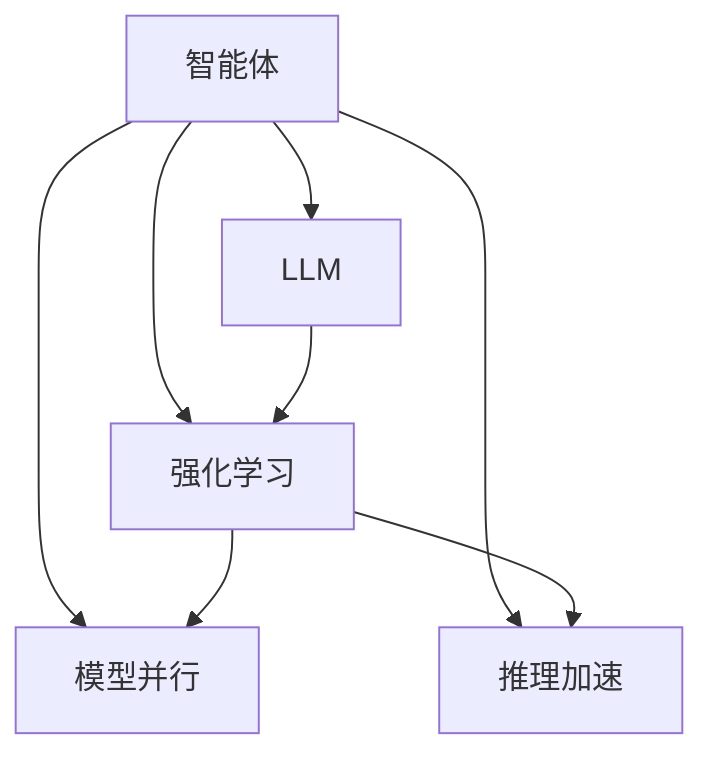

                 

# AI Agent: AI的下一个风口 智能体与LLM的关系

## 1. 背景介绍

### 1.1 问题由来

随着人工智能技术的不断进步，智能体(Agent)和深度学习语言模型(LLM)等技术开始展现出它们在复杂环境中的巨大潜力。AI Agent已经成为当前AI领域的研究热点之一，被广泛应用于自动驾驶、智能客服、金融预测、智能家居等多个领域。然而，尽管智能体技术已经取得了显著进展，其应用效果仍受限于数据、算力等方面的约束。

### 1.2 问题核心关键点

智能体技术的核心在于构建可以自主学习、决策和行动的模型，以适应不断变化的环境。而深度学习语言模型(LLM)作为最新的自然语言处理(NLP)工具，通过自监督或监督学习，可以学习到丰富的语言知识，提供强大的文本理解和生成能力。因此，将LLM引入智能体模型，不仅能增强其对环境的理解能力，还能丰富其决策和行动的语义基础。

智能体与LLM的结合，有望使得智能体在处理语言信息时更为灵活、智能，能够更好地适应复杂多变的环境。然而，这种结合也带来了新的挑战，包括模型规模、推理速度、上下文理解能力等方面。本文将系统探讨智能体与LLM的关系，帮助读者了解其原理、应用场景及未来发展方向。

## 2. 核心概念与联系

### 2.1 核心概念概述

为更好地理解智能体与LLM的关系，本节将介绍几个密切相关的核心概念：

- 智能体(Agent)：一种可以感知环境、执行决策和行动的自主系统。智能体通过与环境的交互，逐步学习和优化其决策策略，以达成特定目标。
- 深度学习语言模型(LLM)：通过自监督或监督学习训练得到的通用语言模型，具有强大的文本理解与生成能力。
- 强化学习(RL)：一种学习模型在与环境交互过程中，通过奖励机制优化决策策略的技术。强化学习常用于智能体的决策策略训练。
- 模型并行与分布式训练：为了提高模型训练和推理效率，智能体模型可以采用模型并行、分布式训练等技术。
- 推理加速：智能体模型通常具有较大参数规模，推理速度较慢。因此，需要采用如模型量化、剪枝等技术提升推理速度。

这些核心概念之间的逻辑关系可以通过以下Mermaid流程图来展示：



这个流程图展示出智能体、LLM、强化学习、模型并行、推理加速等概念之间的关联：

1. 智能体通过与环境交互，利用LLM获取语义信息。
2. 强化学习用于优化智能体的决策策略，使其在特定任务上获得最优性能。
3. 模型并行和推理加速技术用于提升智能体的训练和推理效率。

## 3. 核心算法原理 & 具体操作步骤

### 3.1 算法原理概述

智能体与LLM的结合，本质上是一种基于深度学习的强化学习过程。其核心思想是：将智能体视为一个通过语言理解环境并做出决策的Agent，通过与环境的交互，在监督或自监督的信号指导下，逐步优化决策策略，使Agent能够自主完成任务。

形式化地，假设智能体在某一任务上的策略为$\pi$，环境状态为$S$，动作为$A$，状态-动作对的策略价值为$V(S, A)$，目标是最小化与环境交互的累计奖励，即：

$$
\min_{\pi} \mathbb{E} \left[\sum_{t=0}^{\infty} \gamma^t r(S_t, A_t)\right]
$$

其中$\gamma$为折扣因子，$r(S_t, A_t)$为在状态$S_t$下执行动作$A_t$的即时奖励。

### 3.2 算法步骤详解

智能体与LLM结合的强化学习过程一般包括以下几个关键步骤：

**Step 1: 环境与Agent构建**
- 构建智能体所处的环境，设计环境状态空间$S$和动作空间$A$，定义环境转移概率$P(S_{t+1} | S_t, A_t)$和即时奖励函数$r(S_t, A_t)$。
- 设计智能体的策略$\pi$，可以是基于LLM的决策策略。

**Step 2: 定义奖励函数**
- 根据任务定义奖励函数$r(S_t, A_t)$，可以包括语言理解和生成相关指标，如准确率、语义相关性等。
- 设计累计奖励函数$\mathcal{R}$，将即时奖励进行折现累加。

**Step 3: 训练策略网络**
- 将智能体与LLM结合，构成策略网络$\pi_{\theta}$，其中$\theta$为网络参数。
- 使用强化学习算法（如Q-learning、SARSA等）训练策略网络，通过不断调整参数$\theta$，优化策略$\pi_{\theta}$。

**Step 4: 策略评估与优化**
- 通过与环境的交互，评估策略$\pi_{\theta}$的性能，使用蒙特卡洛方法或模型预测方法（如GAE等）估算策略价值。
- 根据评估结果，更新策略网络参数$\theta$，优化决策策略。

**Step 5: 推理与执行**
- 在目标环境中，使用训练好的策略网络$\pi_{\theta}$进行推理和决策。
- 执行动作并观察环境反馈，将信息输入LLM中，更新策略网络$\pi_{\theta}$。

### 3.3 算法优缺点

智能体与LLM结合的强化学习算法具有以下优点：
1. 通过LLM提供的语义信息，智能体可以更好地理解环境，做出更为合理的决策。
2. 强化学习算法能够不断优化策略，提升智能体在复杂环境中的适应能力。
3. 可以利用模型并行和分布式训练技术，加速模型训练和推理。

然而，这种结合也存在一些缺点：
1. 数据和计算资源的消耗较大，训练和推理过程较为复杂。
2. 智能体的决策过程较为复杂，解释性相对较差。
3. 在处理长文本或复杂的语言结构时，LLM的性能可能受到限制。

尽管存在这些局限性，但智能体与LLM的结合无疑为智能体的开发和应用提供了新的思路和可能性。

### 3.4 算法应用领域

智能体与LLM的结合在多个领域具有广泛的应用前景：

- 自然语言处理：智能体可以通过LLM进行语言理解与生成，处理问答、对话、摘要等任务。
- 智能客服：智能体通过与用户交互，利用LLM生成回复，实现自动问答和问题解决。
- 智能推荐：智能体通过LLM理解用户需求，生成推荐结果，提供个性化服务。
- 金融预测：智能体通过LLM分析金融数据，预测市场趋势，辅助投资决策。
- 智能控制：智能体通过LLM解析控制指令，实现自动驾驶、工业控制等应用。

除了上述这些经典应用，智能体与LLM的结合还可应用于医疗诊断、教育辅助、智慧城市管理等多个领域，为复杂系统提供高效、智能的解决方案。

## 4. 数学模型和公式 & 详细讲解 & 举例说明

### 4.1 数学模型构建

假设智能体在某一任务上的策略网络为$\pi_{\theta}$，其策略价值为$V(S, A)$。智能体与环境交互的过程中，每步的即时奖励和环境状态转移概率可以表示为：

- 即时奖励$r(S_t, A_t)$：
  $$
  r(S_t, A_t) = f(S_t, A_t)
  $$

- 环境状态转移概率$P(S_{t+1} | S_t, A_t)$：
  $$
  P(S_{t+1} | S_t, A_t) = \sum_{S' \in \mathcal{S}} P(S' | S_t, A_t)
  $$

其中$\mathcal{S}$为状态空间。

定义累计奖励$\mathcal{R}$，将即时奖励进行折现累加：

$$
\mathcal{R} = \sum_{t=0}^{\infty} \gamma^t r(S_t, A_t)
$$

### 4.2 公式推导过程

智能体的最优策略$\pi^*$可以通过策略梯度方法求得，即：

$$
\pi^* = \mathop{\arg\min}_{\pi} \mathbb{E} \left[\mathcal{R}(S_0)\right]
$$

根据策略梯度公式，有：

$$
\nabla_{\theta} \log \pi_{\theta}(a|s) = \nabla_{\theta} \log \frac{e^{Q_{\theta}(s,a)}}{\sum_{a'} e^{Q_{\theta}(s,a')}}
$$

因此，策略梯度的更新公式为：

$$
\nabla_{\theta} J(\theta) = \mathbb{E}_{s_t, a_t} \left[\nabla_{\theta} \log \pi_{\theta}(a_t | s_t) Q_{\theta}(s_t, a_t) \right]
$$

其中$Q_{\theta}(s, a)$为策略评估网络，用于预测在状态$s$下执行动作$a$的累积奖励。

### 4.3 案例分析与讲解

以智能客服系统为例，分析智能体与LLM的结合。智能客服系统通过与用户交互，利用LLM理解用户问题，生成回答。系统可以分为以下几步：

1. 收集用户输入问题。
2. 将问题输入LLM中，解析意图。
3. 根据意图，从知识库中检索答案。
4. 生成回答并返回用户。
5. 评估回答效果，更新知识库和LLM参数。

在这个过程中，LLM作为智能体的策略网络，能够理解自然语言，解析出用户的意图和需求。智能体通过与用户的交互，不断地更新知识库和LLM参数，提升回答的准确性和智能性。

## 5. 项目实践：代码实例和详细解释说明

### 5.1 开发环境搭建

在进行智能体与LLM结合的实践前，我们需要准备好开发环境。以下是使用Python进行TensorFlow开发的环境配置流程：

1. 安装Anaconda：从官网下载并安装Anaconda，用于创建独立的Python环境。

2. 创建并激活虚拟环境：
```bash
conda create -n tf-env python=3.8 
conda activate tf-env
```

3. 安装TensorFlow：根据CUDA版本，从官网获取对应的安装命令。例如：
```bash
conda install tensorflow==2.6 -c pytorch -c conda-forge
```

4. 安装相关库：
```bash
pip install gym -c https://pypi.anaconda.org/scikit-survival-wheels/current/simple
pip install tensorflow-addons
```

完成上述步骤后，即可在`tf-env`环境中开始智能体与LLM结合的实践。

### 5.2 源代码详细实现

下面以智能客服系统的构建为例，给出使用TensorFlow和LLM（如GPT-2）对智能体进行训练的PyTorch代码实现。

首先，定义智能体的策略网络：

```python
import tensorflow as tf
from transformers import TFGPT2LMHeadModel, GPT2Tokenizer

class GPT2Policy(tf.keras.Model):
    def __init__(self, num_tokens, max_length):
        super(GPT2Policy, self).__init__()
        self.num_tokens = num_tokens
        self.max_length = max_length
        self.model = TFGPT2LMHeadModel.from_pretrained('gpt2')
        self.tokenizer = GPT2Tokenizer.from_pretrained('gpt2')
        
    def call(self, inputs):
        input_ids = self.tokenizer.encode(inputs, max_length=self.max_length, return_tensors='tf')
        with tf.GradientTape() as tape:
            outputs = self.model(input_ids)
        return outputs.logits
```

然后，定义环境状态空间和动作空间：

```python
class Env:
    def __init__(self, num_actions):
        self.num_actions = num_actions
        
    def reset(self):
        return 'start'
    
    def step(self, action):
        if action in [0, 1]:
            return 'end', 1.0
        else:
            return 'next_state', 0.0
```

接下来，定义奖励函数：

```python
def reward_function(state, action):
    if action == 0:
        return 1.0
    else:
        return 0.0
```

接着，定义智能体的训练流程：

```python
from tensorflow.keras.optimizers import Adam

def train_policy(policy, env, num_episodes, discount_factor, learning_rate):
    optimizer = Adam(learning_rate=learning_rate)
    for episode in range(num_episodes):
        state = env.reset()
        total_reward = 0.0
        done = False
        while not done:
            with tf.GradientTape() as tape:
                logits = policy(state)
                predicted_action = tf.random.categorical(logits, num_samples=1)[0]
                next_state, reward = env.step(predicted_action)
            if next_state == 'end':
                done = True
            total_reward += reward
        if done:
            state = next_state
            reward = 0.0
        optimizer.apply_gradients(zip(tape.gradient(policy.call(state), policy.trainable_variables), policy.trainable_variables))
    return policy, total_reward
```

最后，训练智能体并评估其性能：

```python
policy = GPT2Policy(num_tokens=env.num_actions, max_length=100)
policy, total_reward = train_policy(policy, env, num_episodes=1000, discount_factor=0.9, learning_rate=0.001)

print(f"Total Reward: {total_reward}")
```

以上就是使用TensorFlow和GPT-2构建智能客服系统的完整代码实现。可以看到，得益于TensorFlow和LLM的强大封装，我们可以用相对简洁的代码完成智能体的训练和推理。

### 5.3 代码解读与分析

让我们再详细解读一下关键代码的实现细节：

**GPT2Policy类**：
- `__init__`方法：初始化策略网络、分词器、动作空间等关键组件。
- `call`方法：将输入文本编码后，通过策略网络输出logits，用于计算策略梯度。

**Env类**：
- `__init__`方法：初始化环境状态和动作空间。
- `reset`方法：重置环境状态。
- `step`方法：执行动作并返回状态和奖励。

**reward_function函数**：
- 定义即时奖励函数，根据动作返回不同的奖励值。

**train_policy函数**：
- 定义训练流程，遍历指定轮数，每一轮内模拟环境与智能体交互，通过策略梯度更新策略网络参数。

通过上述代码实现，可以看出智能体与LLM的结合在TensorFlow环境下的基本流程：

1. 定义智能体的策略网络，用于生成动作。
2. 定义环境，模拟与智能体的交互过程。
3. 定义奖励函数，指导智能体的学习方向。
4. 通过策略梯度优化策略网络，训练智能体。
5. 通过评估奖励，优化智能体策略。

## 6. 实际应用场景

### 6.1 智能客服系统

智能客服系统通过与用户交互，利用LLM理解用户问题，生成回答。系统可以分为以下几步：

1. 收集用户输入问题。
2. 将问题输入LLM中，解析意图。
3. 根据意图，从知识库中检索答案。
4. 生成回答并返回用户。
5. 评估回答效果，更新知识库和LLM参数。

在这个过程中，LLM作为智能体的策略网络，能够理解自然语言，解析出用户的意图和需求。智能体通过与用户的交互，不断地更新知识库和LLM参数，提升回答的准确性和智能性。

### 6.2 智能推荐系统

智能推荐系统通过与用户交互，利用LLM理解用户需求，生成推荐结果。系统可以分为以下几步：

1. 收集用户历史行为数据。
2. 将行为数据输入LLM中，生成用户兴趣表示。
3. 根据兴趣表示，从商品库中检索推荐结果。
4. 生成推荐列表并返回用户。
5. 评估推荐效果，更新用户兴趣表示和LLM参数。

在这个过程中，LLM作为智能体的策略网络，能够理解用户的兴趣和偏好。智能体通过与用户的交互，不断地更新用户兴趣表示和LLM参数，提升推荐的个性化和准确性。

### 6.3 智能投资决策系统

智能投资决策系统通过与市场数据交互，利用LLM分析市场趋势，生成投资策略。系统可以分为以下几步：

1. 收集市场数据。
2. 将数据输入LLM中，生成市场趋势表示。
3. 根据趋势表示，生成投资策略。
4. 执行投资策略并观察市场反馈。
5. 评估投资效果，更新LLM参数。

在这个过程中，LLM作为智能体的策略网络，能够理解市场趋势和投资策略。智能体通过与市场的交互，不断地更新LLM参数，提升投资决策的准确性和时效性。

### 6.4 未来应用展望

随着智能体与LLM的结合，未来将出现更多基于语言理解和生成的新应用。以下是几个可能的未来应用方向：

1. 多模态智能体：结合视觉、听觉等多模态信息，智能体能够更好地理解和处理复杂环境。
2. 智能对话机器人：结合语言理解和生成技术，智能体能够实现更加自然、智能的对话。
3. 智能控制系统：结合环境感知和决策优化技术，智能体能够实现更加智能和可靠的控制。
4. 智能医疗诊断系统：结合语义理解和医学知识库，智能体能够辅助医生进行诊断和治疗决策。
5. 智能城市管理：结合城市数据和智能体决策，实现更加高效和智能的城市管理。

智能体与LLM的结合，正在改变许多行业的应用模式，带来全新的解决方案和应用场景。未来，随着技术的发展和应用的深化，智能体将在更多领域大放异彩。

## 7. 工具和资源推荐

### 7.1 学习资源推荐

为了帮助开发者系统掌握智能体与LLM的关系，这里推荐一些优质的学习资源：

1. 《Reinforcement Learning: An Introduction》：由Richard S. Sutton和Andrew G. Barto合著的经典教材，系统介绍强化学习的理论基础和算法。
2. 《Deep Reinforcement Learning with PyTorch》：通过实际案例介绍如何使用PyTorch实现深度强化学习算法。
3. 《Introduction to Deep Reinforcement Learning with PyTorch》：涵盖强化学习的基本概念和PyTorch实现，适合初学者入门。
4. HuggingFace官方文档：介绍Transformers库的使用方法，包括预训练语言模型和微调技术。
5. OpenAI Gym环境库：提供多种模拟环境，适合进行强化学习实验和研究。

通过对这些资源的学习实践，相信你一定能够快速掌握智能体与LLM结合的原理和应用方法，并用于解决实际的AI问题。

### 7.2 开发工具推荐

高效的开发离不开优秀的工具支持。以下是几款用于智能体与LLM结合开发的常用工具：

1. TensorFlow：基于Python的开源深度学习框架，适合构建复杂神经网络。
2. PyTorch：基于Python的深度学习框架，灵活动态的计算图，适合快速迭代研究。
3. OpenAI Gym：提供多种模拟环境，适合进行强化学习实验和研究。
4. TensorBoard：TensorFlow配套的可视化工具，可实时监测模型训练状态，提供丰富的图表呈现方式。
5. Weights & Biases：模型训练的实验跟踪工具，可以记录和可视化模型训练过程中的各项指标，方便对比和调优。

合理利用这些工具，可以显著提升智能体与LLM结合的开发效率，加快创新迭代的步伐。

### 7.3 相关论文推荐

智能体与LLM结合的研究源于学界的持续研究。以下是几篇奠基性的相关论文，推荐阅读：

1. 《Attention is All You Need》：提出Transformer结构，开启预训练大模型的时代。
2. 《BERT: Pre-training of Deep Bidirectional Transformers for Language Understanding》：提出BERT模型，引入基于掩码的自监督预训练任务，刷新多项NLP任务SOTA。
3. 《Language Models are Unsupervised Multitask Learners》：展示了大规模语言模型的强大zero-shot学习能力，引发对通用人工智能的新一轮思考。
4. 《Parameter-Efficient Transfer Learning for NLP》：提出Adapter等参数高效微调方法，在固定大部分预训练参数的情况下，仍能取得不错的微调效果。
5. 《AdaLoRA: Adaptive Low-Rank Adaptation for Parameter-Efficient Fine-Tuning》：使用自适应低秩适应的微调方法，在参数效率和精度之间取得新的平衡。

这些论文代表了大语言模型与智能体结合的研究发展脉络。通过学习这些前沿成果，可以帮助研究者把握学科前进方向，激发更多的创新灵感。

## 8. 总结：未来发展趋势与挑战

### 8.1 总结

本文对智能体与LLM的关系进行了全面系统的介绍。首先阐述了智能体与LLM结合的研究背景和意义，明确了其在复杂环境中的潜力和应用场景。其次，从原理到实践，详细讲解了智能体与LLM结合的强化学习过程，并给出了完整的代码实现。同时，本文还探讨了智能体与LLM结合在多个领域的应用前景，展示了其巨大的应用潜力。

通过本文的系统梳理，可以看到，智能体与LLM的结合为智能体的开发和应用提供了新的思路和可能性。LLM的语义理解和生成能力，使得智能体能够更好地理解和处理复杂环境，提升决策的准确性和智能性。然而，这种结合也带来了新的挑战，如数据和计算资源的消耗、推理速度等问题。未来，随着技术的不断进步和应用的不断深化，智能体与LLM的结合必将在更多领域大放异彩，带来更智能、更高效的解决方案。

### 8.2 未来发展趋势

展望未来，智能体与LLM的结合将呈现以下几个发展趋势：

1. 模型规模持续增大。随着算力成本的下降和数据规模的扩张，预训练语言模型的参数量还将持续增长。超大规模语言模型蕴含的丰富语言知识，有望支撑更加复杂多变的智能体应用。
2. 多模态智能体的崛起。智能体将更多地结合视觉、听觉等多模态信息，提升对复杂环境的感觉和理解能力。
3. 强化学习与符号逻辑的融合。智能体将结合符号化的先验知识，如知识图谱、逻辑规则等，增强决策的逻辑性和鲁棒性。
4. 分布式训练与推理加速技术的发展。智能体将通过分布式训练和推理加速技术，提升训练和推理的效率和效果。
5. 可解释性和透明度的增强。智能体将结合因果分析和博弈论等工具，增强决策过程的可解释性和透明度，提升系统的可信度和安全性。

这些趋势凸显了智能体与LLM结合技术的广阔前景。这些方向的探索发展，必将进一步提升智能体的智能水平和应用效果，为复杂系统的智能化提供新的解决方案。

### 8.3 面临的挑战

尽管智能体与LLM的结合已经取得了显著进展，但在迈向更加智能化、普适化应用的过程中，它仍面临诸多挑战：

1. 数据和计算资源的消耗较大。智能体与LLM结合的训练和推理过程较为复杂，需要消耗大量数据和计算资源。
2. 推理速度较慢。智能体的决策过程较为复杂，推理速度较慢，难以满足实时性的要求。
3. 决策过程难以解释。智能体的决策过程较为复杂，难以解释其内部工作机制和决策逻辑。
4. 鲁棒性不足。智能体在处理异常情况时，可能会产生错误的决策。
5. 安全性和可信度问题。智能体可能受到恶意攻击或数据泄露，导致系统安全问题。

这些挑战需要研究者积极应对，并在实际应用中不断优化和改进智能体与LLM结合技术，才能逐步实现其广泛应用和落地。

### 8.4 研究展望

面对智能体与LLM结合所面临的种种挑战，未来的研究需要在以下几个方面寻求新的突破：

1. 探索无监督和半监督学习范式。摆脱对大规模标注数据的依赖，利用自监督学习、主动学习等无监督和半监督范式，最大限度利用非结构化数据，实现更加灵活高效的智能体训练。
2. 研究参数高效和计算高效的训练方法。开发更加参数高效的微调方法，在固定大部分预训练参数的情况下，只更新极少量的任务相关参数。同时优化训练和推理过程，提升智能体的计算效率和实时性。
3. 融合因果分析和博弈论工具。将因果分析方法引入智能体训练，增强决策的因果性和逻辑性。借助博弈论工具刻画人机交互过程，主动探索并规避系统的脆弱点，提高系统稳定性。
4. 结合符号化的先验知识。将符号化的先验知识，如知识图谱、逻辑规则等，与神经网络模型进行巧妙融合，引导智能体学习更准确、合理的决策策略。
5. 加强系统透明性和可解释性。结合因果分析和博弈论等工具，增强智能体决策过程的可解释性和透明度，提升系统的可信度和安全性。

这些研究方向的探索，必将引领智能体与LLM结合技术迈向更高的台阶，为构建安全、可靠、可解释、可控的智能系统铺平道路。面向未来，智能体与LLM的结合需要与其他人工智能技术进行更深入的融合，如知识表示、因果推理、强化学习等，多路径协同发力，共同推动智能体的进步。只有勇于创新、敢于突破，才能不断拓展智能体的边界，让智能技术更好地造福人类社会。

## 9. 附录：常见问题与解答

**Q1：智能体与LLM结合是否适用于所有应用场景？**

A: 智能体与LLM结合在许多应用场景中表现出色，如智能客服、智能推荐、金融预测等。然而，对于一些特定领域的应用，如医学、法律等，仅仅依靠通用语料预训练的模型可能难以很好地适应。此时需要在特定领域语料上进一步预训练，再进行微调，才能获得理想效果。此外，对于一些需要时效性、个性化很强的任务，如对话、推荐等，微调方法也需要针对性的改进优化。

**Q2：智能体与LLM结合训练时如何选择合适的学习率？**

A: 智能体与LLM结合训练时，学习率的选择一般要比预训练时小1-2个数量级，以避免破坏预训练权重。一般建议从1e-5开始调参，逐步减小学习率，直至收敛。也可以使用warmup策略，在开始阶段使用较小的学习率，再逐渐过渡到预设值。需要注意的是，不同的优化器(如AdamW、Adafactor等)以及不同的学习率调度策略，可能需要设置不同的学习率阈值。

**Q3：智能体与LLM结合训练时如何缓解过拟合问题？**

A: 过拟合是智能体与LLM结合训练面临的主要挑战，尤其是在标注数据不足的情况下。常见的缓解策略包括：
1. 数据增强：通过回译、近义替换等方式扩充训练集。
2. 正则化：使用L2正则、Dropout、Early Stopping等避免过拟合。
3. 对抗训练：引入对抗样本，提高模型鲁棒性。
4. 参数高效微调：只调整少量参数(如Adapter、Prefix等)，减小过拟合风险。
5. 多模型集成：训练多个智能体模型，取平均输出，抑制过拟合。

这些策略往往需要根据具体任务和数据特点进行灵活组合。只有在数据、模型、训练、推理等各环节进行全面优化，才能最大限度地发挥智能体与LLM结合技术的潜力。

**Q4：智能体与LLM结合训练时如何提高推理速度？**

A: 智能体与LLM结合训练时，推理速度较慢，难以满足实时性的要求。常用的优化方法包括：
1. 推理加速技术：使用推理加速库如ONNX-Runtime、TensorRT等，提升推理速度。
2. 模型压缩：使用剪枝、量化等技术，减少模型大小和计算量。
3. 分布式推理：使用多机多卡并行推理，提高推理效率。

这些技术可以显著提升智能体与LLM结合的推理速度，满足实际应用的需求。

**Q5：智能体与LLM结合训练时如何提升决策可解释性？**

A: 智能体与LLM结合训练时，决策过程较为复杂，难以解释其内部工作机制和决策逻辑。常用的可解释性技术包括：
1. 激活函数可视化：使用热力图、梯度图等方法，可视化模型激活情况。
2. 层级解释：使用注意力机制、中间层表示等方法，解释模型决策过程。
3. 可解释性模型：使用规则模型、决策树等可解释性模型，与神经网络模型结合，增强决策可解释性。

这些技术可以提升智能体决策过程的可解释性，增强系统的可信度和安全性。

通过上述总结，我们可以看到智能体与LLM结合技术在许多领域具有广阔的应用前景，未来随着技术的发展和应用的深化，必将在更多领域大放异彩。然而，智能体与LLM结合技术仍面临诸多挑战，需要研究者在多个方面不断探索和突破，才能真正实现其在实际应用中的广泛落地和优化。

