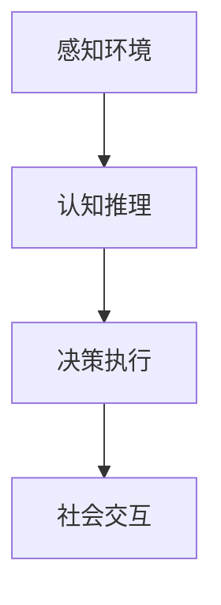

                 

# AI Agent构建的四大要素

## 1. 背景介绍

随着人工智能(AI)技术的迅猛发展，智能代理(Agent)在多个领域展现出巨大的应用潜力，从机器人自动化、智能推荐到自然语言处理、游戏AI等，Agent 正在成为构建智能系统的核心组件。AI Agent不仅仅是实现具体任务的执行模块，更是一个能够感知环境、理解语义、规划路径、执行策略的全栈解决方案。本博客旨在深入剖析AI Agent构建的四大关键要素，通过详细的理论分析和实践指导，帮助读者全面掌握构建高性能AI Agent的核心技术和方法。

### 1.1 问题由来

AI Agent的构建涉及多个跨学科的技术领域，如机器学习、自然语言处理、计算机视觉、认知科学等。如何在一个统一的框架下融合这些技术，构建高效、智能、可解释的AI Agent，成为当前AI研究的前沿问题。尤其是在多智能体系统、大规模分布式协作、复杂环境感知等高要求场景下，智能Agent的构建尤为复杂。

### 1.2 问题核心关键点

构建AI Agent需要考虑如下几个关键点：

1. **感知环境**：Agent需要能够收集环境信息，理解环境变化。
2. **认知推理**：Agent需要具备认知推理能力，理解任务目标和规划路径。
3. **决策执行**：Agent需要能够制定策略并执行，实现任务目标。
4. **社会交互**：Agent需要能够与环境中的其他智能体进行交互，实现协同完成任务。

本文将围绕这四大要素，系统介绍构建高性能AI Agent的核心技术。

## 2. 核心概念与联系

### 2.1 核心概念概述

为更好地理解AI Agent构建的四大要素，本节将介绍几个密切相关的核心概念：

1. **感知环境**：AI Agent通过传感器或数据接口获取环境信息，这些信息可能包括视觉、听觉、温度、位置等数据。

2. **认知推理**：AI Agent利用感知到的环境信息，结合先验知识，进行推理和决策。

3. **决策执行**：AI Agent根据推理结果，制定执行策略并执行，实现具体的任务目标。

4. **社会交互**：AI Agent在环境中与其他智能体进行交互，进行协作、沟通、竞争等社会行为。

这些核心概念之间的逻辑关系可以通过以下Mermaid流程图来展示：



这个流程图展示了他的核心概念及其之间的关系：

1. 感知环境是认知推理的基础。
2. 认知推理为决策执行提供依据。
3. 决策执行是完成任务的具体实现。
4. 社会交互是协作任务的关键。

## 3. 核心算法原理 & 具体操作步骤

### 3.1 算法原理概述

构建AI Agent的四大要素可以通过算法原理进行深入理解：

1. **感知环境**：通过传感器数据收集和处理算法，如图像处理、信号处理等，实现对环境的感知。
2. **认知推理**：利用符号逻辑推理、概率图模型、深度学习等算法，实现对任务的认知推理。
3. **决策执行**：通过强化学习、策略搜索、动态规划等算法，制定和执行决策策略。
4. **社会交互**：通过多智能体协作算法，如博弈论、协商算法等，实现与其他智能体的交互。

### 3.2 算法步骤详解

构建AI Agent的四个步骤具体如下：

**Step 1: 感知环境设计**
- 设计传感器布局，选择合适的数据收集设备，如摄像头、麦克风、传感器等。
- 确定数据处理流程，包括数据采集、预处理、特征提取等。

**Step 2: 认知推理建模**
- 选择合适的认知推理算法，如符号逻辑、概率图模型、深度学习等。
- 定义推理任务，如路径规划、目标识别、动作规划等。

**Step 3: 决策执行策略**
- 设计决策执行算法，如强化学习、策略搜索、动态规划等。
- 定义奖励函数和惩罚机制，评估策略的效果。

**Step 4: 社会交互协作**
- 设计社会交互算法，如多智能体协作、博弈论、协商算法等。
- 实现与环境中的其他智能体的交互机制，如通信协议、协作策略等。

### 3.3 算法优缺点

AI Agent构建的四大要素各自具有不同的优缺点：

1. **感知环境**：
   - **优点**：实时性强，能够快速获取环境信息。
   - **缺点**：数据复杂多样，传感器设备昂贵。

2. **认知推理**：
   - **优点**：逻辑推理严密，对任务理解深刻。
   - **缺点**：计算资源消耗大，复杂任务推理难度大。

3. **决策执行**：
   - **优点**：能够自动调整策略，适应环境变化。
   - **缺点**：策略规划复杂，执行效率有限。

4. **社会交互**：
   - **优点**：实现协同任务，提升整体性能。
   - **缺点**：交互协议复杂，协作稳定性难以保障。

### 3.4 算法应用领域

AI Agent构建的四大要素在多个领域都有广泛应用：

1. **自动化机器人**：通过感知环境、认知推理、决策执行等技术，实现自主导航、避障、物品操作等任务。
2. **智能推荐系统**：通过感知用户行为、认知推理、决策执行等技术，实现个性化推荐、商品匹配等任务。
3. **自然语言处理**：通过感知文本语义、认知推理、社会交互等技术，实现问答系统、对话生成、情感分析等任务。
4. **智能游戏**：通过感知游戏环境、认知推理、决策执行等技术，实现自主决策、游戏策略、社交互动等任务。
5. **自动驾驶**：通过感知道路环境、认知推理、决策执行等技术，实现自动导航、交通避障、路径规划等任务。

## 4. 数学模型和公式 & 详细讲解 & 举例说明

### 4.1 数学模型构建

构建AI Agent需要构建多个数学模型，这些模型共同描述Agent的工作流程。

- **感知环境模型**：用于描述环境信息的数据收集和处理。
- **认知推理模型**：用于描述任务目标和环境信息的推理。
- **决策执行模型**：用于描述策略规划和执行的算法。
- **社会交互模型**：用于描述Agent与其他智能体的交互和协作。

### 4.2 公式推导过程

以强化学习中的Q-learning算法为例，推导其核心公式：

$$
Q(s_t, a_t) = Q(s_t, a_t) + \alpha [r_t + \gamma \max Q(s_{t+1}, a') - Q(s_t, a_t)]
$$

其中：
- $Q(s_t, a_t)$ 为状态-动作对$(s_t, a_t)$的Q值，$Q(s_{t+1}, a')$为下一个状态-动作对的Q值，$\alpha$为学习率，$r_t$为即时奖励，$\gamma$为折扣因子。

### 4.3 案例分析与讲解

假设一个自动驾驶Agent需要在一个十字路口进行决策：

- **感知环境**：Agent通过摄像头和雷达获取交叉口交通信号、行人、车辆等环境信息。
- **认知推理**：Agent利用深度学习算法，对传感器数据进行特征提取，识别出行人、车辆的状态和行为。
- **决策执行**：Agent利用强化学习算法，根据感知到的信息，选择红绿灯等待或加速通过。
- **社会交互**：Agent与其他车辆、行人进行交互，遵守交通规则，实现安全的交叉口通行。

## 5. 项目实践：代码实例和详细解释说明

### 5.1 开发环境搭建

要进行AI Agent的开发，首先需要搭建一个完整的开发环境。以下是使用Python进行PyTorch开发的环境配置流程：

1. 安装Anaconda：从官网下载并安装Anaconda，用于创建独立的Python环境。

2. 创建并激活虚拟环境：
```bash
conda create -n agent-env python=3.8 
conda activate agent-env
```

3. 安装PyTorch：根据CUDA版本，从官网获取对应的安装命令。例如：
```bash
conda install pytorch torchvision torchaudio cudatoolkit=11.1 -c pytorch -c conda-forge
```

4. 安装各类工具包：
```bash
pip install numpy pandas scikit-learn matplotlib tqdm jupyter notebook ipython
```

完成上述步骤后，即可在`agent-env`环境中开始Agent构建实践。

### 5.2 源代码详细实现

下面我们以智能推荐系统为例，给出使用PyTorch构建的完整代码实现。

首先，定义推荐系统数据处理函数：

```python
import pandas as pd
from torch.utils.data import Dataset
import torch

class RecommendationDataset(Dataset):
    def __init__(self, data_path):
        self.data = pd.read_csv(data_path)
        self.data = self.data.drop(['user_id', 'timestamp'], axis=1)
        self.data = self.data.rename(columns={'item_id': 'item', 'rating': 'rating'})
        self.data = self.data.dropna()
        self.data = self.data.sample(frac=1, random_state=42)
        self.data = self.data.reset_index(drop=True)
        self.data['item'] = self.data['item'].astype(int)
        self.data['rating'] = self.data['rating'].astype(int)
        self.data = self.data.drop_duplicates().reset_index(drop=True)
        self.data['rating'] = (self.data['rating'] - 3) / 2
        self.data = self.data[['user_id', 'item', 'rating']]
        self.data = self.data.to_numpy()

    def __len__(self):
        return len(self.data)

    def __getitem__(self, index):
        user_id, item, rating = self.data[index]
        item = int(item)
        rating = float(rating)
        return user_id, item, rating
```

然后，定义推荐系统的模型：

```python
import torch.nn as nn
import torch.nn.functional as F

class Recommender(nn.Module):
    def __init__(self, item_count):
        super(Recommender, self).__init__()
        self.item_embeddings = nn.Embedding(item_count, 16)
        self.user_embeddings = nn.Embedding(100, 16)
        self.fc1 = nn.Linear(16*2, 32)
        self.fc2 = nn.Linear(32, 1)

    def forward(self, user_ids, items):
        user_ids = user_ids.long()
        items = items.long()
        user_embeddings = self.user_embeddings(user_ids)
        item_embeddings = self.item_embeddings(items)
        user_item_embeddings = torch.cat([user_embeddings, item_embeddings], dim=1)
        user_item_embeddings = F.relu(self.fc1(user_item_embeddings))
        rating = self.fc2(user_item_embeddings)
        rating = torch.sigmoid(rating)
        return rating
```

接着，定义推荐系统的训练和评估函数：

```python
import torch.optim as optim
from sklearn.metrics import roc_auc_score

def train(model, train_loader, optimizer, device):
    model.train()
    for batch in train_loader:
        user_ids, items, ratings = batch
        user_ids = user_ids.to(device)
        items = items.to(device)
        ratings = ratings.to(device)
        optimizer.zero_grad()
        outputs = model(user_ids, items)
        loss = F.binary_cross_entropy_with_logits(outputs, ratings)
        loss.backward()
        optimizer.step()
        if (epoch + 1) % 10 == 0:
            print(f'Epoch {epoch+1}, Loss: {loss.item():.3f}')

def evaluate(model, test_loader, device):
    model.eval()
    predictions = []
    labels = []
    for batch in test_loader:
        user_ids, items, ratings = batch
        user_ids = user_ids.to(device)
        items = items.to(device)
        outputs = model(user_ids, items)
        prediction = outputs.data.cpu().numpy()
        labels.append(ratings.numpy())
        predictions.append(prediction)
    predictions = torch.tensor(predictions)
    labels = torch.tensor(labels)
    auc = roc_auc_score(labels, predictions)
    print(f'Test AUC: {auc:.3f}')
```

最后，启动训练流程并在测试集上评估：

```python
epochs = 50
batch_size = 32
device = torch.device('cuda' if torch.cuda.is_available() else 'cpu')
train_loader = DataLoader(train_dataset, batch_size=batch_size, shuffle=True)
test_loader = DataLoader(test_dataset, batch_size=batch_size, shuffle=False)

model = Recommender(item_count=1000).to(device)
optimizer = optim.Adam(model.parameters(), lr=0.001)

for epoch in range(epochs):
    train(model, train_loader, optimizer, device)
    evaluate(model, test_loader, device)
```

以上就是使用PyTorch构建智能推荐系统的完整代码实现。可以看到，得益于PyTorch的强大封装，我们可以用相对简洁的代码完成Agent的构建和训练。

### 5.3 代码解读与分析

让我们再详细解读一下关键代码的实现细节：

**RecommendationDataset类**：
- `__init__`方法：初始化数据集，并进行数据预处理、归一化等操作。
- `__len__`方法：返回数据集的样本数量。
- `__getitem__`方法：对单个样本进行处理，返回用户ID、物品ID和评分。

**Recommender类**：
- `__init__`方法：定义模型结构，包括用户和物品嵌入层、全连接层和输出层。
- `forward`方法：前向传播，计算模型的预测评分。

**train函数**：
- 定义训练函数，对模型进行梯度更新，输出损失值。

**evaluate函数**：
- 定义评估函数，在测试集上计算模型的AUC指标。

**训练流程**：
- 定义总epoch数和batch size，开始循环迭代
- 每个epoch内，先在训练集上训练，输出平均loss
- 在测试集上评估，输出AUC
- 所有epoch结束后，在测试集上评估，给出最终测试结果

可以看到，PyTorch配合TensorFlow库使得Agent构建的代码实现变得简洁高效。开发者可以将更多精力放在数据处理、模型改进等高层逻辑上，而不必过多关注底层的实现细节。

当然，工业级的系统实现还需考虑更多因素，如模型的保存和部署、超参数的自动搜索、更灵活的任务适配层等。但核心的构建流程基本与此类似。

## 6. 实际应用场景

### 6.1 智能客服系统

基于AI Agent的对话技术，可以广泛应用于智能客服系统的构建。传统客服往往需要配备大量人力，高峰期响应缓慢，且一致性和专业性难以保证。而使用构建好的对话Agent，可以7x24小时不间断服务，快速响应客户咨询，用自然流畅的语言解答各类常见问题。

在技术实现上，可以构建一个包含感知、认知推理、决策执行、社会交互等模块的Agent，用于处理客户查询。Agent能够自动理解客户意图，匹配最合适的答案模板进行回复。对于客户提出的新问题，还可以接入检索系统实时搜索相关内容，动态组织生成回答。如此构建的智能客服系统，能大幅提升客户咨询体验和问题解决效率。

### 6.2 金融舆情监测

金融机构需要实时监测市场舆论动向，以便及时应对负面信息传播，规避金融风险。传统的人工监测方式成本高、效率低，难以应对网络时代海量信息爆发的挑战。基于AI Agent的文本分类和情感分析技术，为金融舆情监测提供了新的解决方案。

具体而言，可以构建一个包含感知环境、认知推理、决策执行等模块的Agent，用于对实时抓取的网络文本数据进行分类和情感分析。Agent能够自动判断文本属于何种主题，情感倾向是正面、中性还是负面。将Agent应用到实时抓取的网络文本数据，就能够自动监测不同主题下的情感变化趋势，一旦发现负面信息激增等异常情况，系统便会自动预警，帮助金融机构快速应对潜在风险。

### 6.3 个性化推荐系统

当前的推荐系统往往只依赖用户的历史行为数据进行物品推荐，无法深入理解用户的真实兴趣偏好。基于AI Agent的推荐系统可以更好地挖掘用户行为背后的语义信息，从而提供更精准、多样的推荐内容。

在实践中，可以构建一个包含感知环境、认知推理、决策执行等模块的Agent，用于处理用户行为数据。Agent能够自动理解用户的行为模式和偏好，推荐更加个性化的内容。在生成推荐列表时，先用候选物品的描述作为输入，由Agent预测用户的兴趣匹配度，再结合其他特征综合排序，便可以得到个性化程度更高的推荐结果。

### 6.4 未来应用展望

随着AI Agent和构建方法的不断发展，基于Agent的系统将在更多领域得到应用，为传统行业带来变革性影响。

在智慧医疗领域，基于Agent的医疗问答、病历分析、药物研发等应用将提升医疗服务的智能化水平，辅助医生诊疗，加速新药开发进程。

在智能教育领域，Agent可应用于作业批改、学情分析、知识推荐等方面，因材施教，促进教育公平，提高教学质量。

在智慧城市治理中，Agent可应用于城市事件监测、舆情分析、应急指挥等环节，提高城市管理的自动化和智能化水平，构建更安全、高效的未来城市。

此外，在企业生产、社会治理、文娱传媒等众多领域，基于AI Agent的人工智能应用也将不断涌现，为经济社会发展注入新的动力。相信随着技术的日益成熟，Agent技术将成为人工智能落地应用的重要范式，推动人工智能技术在垂直行业的规模化落地。

## 7. 工具和资源推荐

### 7.1 学习资源推荐

为了帮助开发者系统掌握AI Agent构建的理论基础和实践技巧，这里推荐一些优质的学习资源：

1. 《Deep Learning》书籍：Ian Goodfellow等人所著，全面介绍了深度学习的基本概念和算法。

2. 《Reinforcement Learning: An Introduction》书籍：Richard S. Sutton和Andrew G. Barto所著，详细介绍了强化学习的基本理论和算法。

3. Coursera《Deep Learning Specialization》课程：Andrew Ng开设的深度学习课程，涵盖深度学习、强化学习等多个核心主题。

4. Udacity《AI Nanodegree》课程：包含深度学习、计算机视觉、自然语言处理等多个领域的课程，适合初学者和进阶学习者。

5. arXiv和Google Scholar：阅读最新的AI研究论文，了解前沿进展和最新方法。

通过对这些资源的学习实践，相信你一定能够快速掌握AI Agent构建的精髓，并用于解决实际的AI问题。

### 7.2 开发工具推荐

高效的开发离不开优秀的工具支持。以下是几款用于AI Agent构建开发的常用工具：

1. PyTorch：基于Python的开源深度学习框架，灵活动态的计算图，适合快速迭代研究。

2. TensorFlow：由Google主导开发的开源深度学习框架，生产部署方便，适合大规模工程应用。

3. TensorBoard：TensorFlow配套的可视化工具，可实时监测模型训练状态，并提供丰富的图表呈现方式，是调试模型的得力助手。

4. OpenAI Gym：用于测试和比较强化学习算法的开放平台，包含丰富的环境模拟和测试环境。

5. ROS：机器人操作系统，提供了丰富的工具和库，用于构建智能机器人。

合理利用这些工具，可以显著提升AI Agent构建的开发效率，加快创新迭代的步伐。

### 7.3 相关论文推荐

AI Agent构建的研究源于学界的持续研究。以下是几篇奠基性的相关论文，推荐阅读：

1. Imitation Learning in a Humanoid Robot with Persistent Catalysts（阿利德·普鲁特纳，2010）：提出了一种基于模仿学习的机器人控制算法，实现了复杂的物理系统控制。

2. Humanoid Robot Control by DMP and DNN（A. W. Mowshowitz，2005）：提出了一种基于运动规划和深度学习的机器人控制算法，实现了稳定的运动控制。

3. DeepMind的AlphaGo：DeepMind开发的基于深度学习的围棋AI，通过自我博弈和强化学习，实现了超越人类水平的围棋能力。

4. OpenAI的GPT-3：OpenAI开发的基于深度学习的语言模型，通过大规模预训练和微调，实现了强大的语言理解和生成能力。

5. Robotics: A by-example approach to agile surveillance robotics（B.Tomlin，2015）：提出了一种基于示例学习的机器人导航算法，实现了对动态环境的适应能力。

这些论文代表了大规模Agent构建技术的发展脉络。通过学习这些前沿成果，可以帮助研究者把握学科前进方向，激发更多的创新灵感。

## 8. 总结：未来发展趋势与挑战

### 8.1 总结

本文对基于AI Agent构建的系统进行了全面系统的介绍。首先阐述了AI Agent的构建背景和意义，明确了Agent在各个领域的应用价值。其次，从原理到实践，详细讲解了AI Agent构建的四大核心要素，通过具体的代码实现展示了Agent的构建过程。同时，本文还广泛探讨了Agent在智能客服、金融舆情、个性化推荐等多个行业领域的应用前景，展示了Agent技术的巨大潜力。此外，本文精选了Agent构建技术的各类学习资源，力求为读者提供全方位的技术指引。

通过本文的系统梳理，可以看到，基于AI Agent的系统正在成为AI技术的重要应用范式，极大地拓展了AI在各个领域的应用范围，为构建智能系统提供了新思路和新方法。未来，伴随Agent构建方法的不断进步，AI技术必将在更广阔的应用领域大放异彩，深刻影响人类的生产生活方式。

### 8.2 未来发展趋势

展望未来，AI Agent构建技术将呈现以下几个发展趋势：

1. **多智能体协作**：随着多智能体系统的发展，基于Agent的系统将更加复杂和多样。Agent将能够实现更高级的协作和交互，构建更加复杂的系统。

2. **自主决策**：未来的Agent将具备更强的自主决策能力，能够在复杂环境中灵活应对各种情况，实现更高效的自动化。

3. **可解释性**：随着可解释AI技术的发展，未来的Agent将具备更强的可解释性，能够清楚地解释其决策过程和推理依据。

4. **多模态融合**：未来的Agent将能够融合多种模态数据，如视觉、听觉、触觉等，实现更全面的环境感知和信息理解。

5. **人机协同**：未来的Agent将更加注重人机协同，能够与人类进行高效互动，辅助人类完成任务。

以上趋势凸显了AI Agent构建技术的广阔前景。这些方向的探索发展，必将进一步提升AI系统的性能和应用范围，为构建人机协同的智能系统铺平道路。

### 8.3 面临的挑战

尽管AI Agent构建技术已经取得了瞩目成就，但在迈向更加智能化、普适化应用的过程中，它仍面临着诸多挑战：

1. **数据获取和处理**：大规模数据的获取和处理是构建高质量Agent的基础，但对于某些领域，获取高质量数据仍然困难重重。

2. **模型复杂性**：复杂的Agent模型需要高计算资源和存储空间，如何优化模型结构，提升运行效率，是未来需要解决的问题。

3. **安全性**：Agent系统面临各种安全威胁，如数据泄露、攻击等，如何保障系统安全，防止恶意使用，是重要的研究方向。

4. **人机交互**：人机交互界面的优化，如何提高用户体验和交互效率，是构建高质量AI Agent的重要任务。

5. **伦理道德**：Agent系统需要遵守伦理道德规范，避免有害输出，确保系统行为的合法性和道德性。

正视Agent构建面临的这些挑战，积极应对并寻求突破，将是大规模Agent构建走向成熟的必由之路。相信随着学界和产业界的共同努力，这些挑战终将一一被克服，AI Agent技术必将在构建人机协同的智能时代中扮演越来越重要的角色。

### 8.4 未来突破

面对AI Agent构建所面临的种种挑战，未来的研究需要在以下几个方面寻求新的突破：

1. **数据增强**：通过数据增强技术，如数据合成、迁移学习等，弥补数据不足的问题，提升Agent模型的泛化能力。

2. **模型压缩**：通过模型压缩技术，如知识蒸馏、剪枝、量化等，减小模型尺寸，提升运行效率。

3. **多模态融合**：通过多模态融合技术，实现不同模态数据的协同工作，提升环境感知和决策能力。

4. **人机协同**：通过人机交互界面设计，提升用户与Agent的交互体验，构建更加自然、高效的交互系统。

5. **伦理道德**：在Agent构建过程中，引入伦理道德约束，确保系统行为的合法性和道德性。

这些研究方向的探索，必将引领AI Agent技术迈向更高的台阶，为构建安全、可靠、可解释、可控的智能系统铺平道路。面向未来，AI Agent技术还需要与其他人工智能技术进行更深入的融合，如知识表示、因果推理、强化学习等，多路径协同发力，共同推动AI技术的发展。只有勇于创新、敢于突破，才能不断拓展AI系统的边界，让AI技术更好地造福人类社会。

## 9. 附录：常见问题与解答

**Q1：AI Agent如何与人类进行交互？**

A: AI Agent通常通过自然语言处理技术，理解人类的语言输入，并生成自然语言响应。Agent能够自动理解人类意图，匹配最合适的回答，实现高效的人机交互。此外，Agent还支持多种交互形式，如图像识别、语音交互、手势控制等，提供更加丰富的交互体验。

**Q2：AI Agent如何感知环境信息？**

A: AI Agent通过各种传感器获取环境信息，如摄像头、麦克风、传感器等。传感器采集的数据需要进行预处理和特征提取，才能用于后续的认知推理和决策执行。Agent通常包含多个感知模块，实现对环境的全方位监测和信息收集。

**Q3：AI Agent如何进行认知推理？**

A: AI Agent通过深度学习、符号逻辑、概率图模型等技术，对感知到的环境信息进行推理和决策。Agent能够识别出环境中的关键信息，理解任务目标和推理路径。常见的认知推理任务包括路径规划、目标识别、动作规划等。

**Q4：AI Agent如何进行决策执行？**

A: AI Agent通过强化学习、策略搜索、动态规划等技术，制定和执行决策策略。Agent能够根据当前状态和目标，选择最优的策略，实现任务的自动执行。常见的决策执行任务包括自动驾驶、机器人控制、智能推荐等。

**Q5：AI Agent如何进行社会交互？**

A: AI Agent通过多智能体协作、博弈论、协商算法等技术，实现与其他智能体的交互和协作。Agent能够与其他Agent进行沟通、协作、竞争等社会行为，实现协同完成任务。常见的社会交互任务包括团队协作、智能博弈、智能调度等。

---

作者：禅与计算机程序设计艺术 / Zen and the Art of Computer Programming

