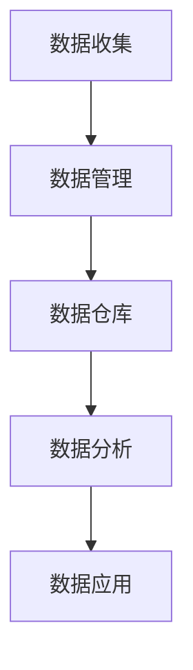

                 

# AI DMP 数据基建：从数据到洞察，再到行动

## 1. 背景介绍

### 1.1 问题由来

在大数据时代，随着互联网、社交媒体等数字平台的发展，消费者数据愈发丰富和多样化。这些数据包括了搜索历史、浏览记录、购买行为、社交互动等多种形式，为数字营销人员提供了丰富的洞察机会。然而，如何高效地利用这些数据，生成有价值的商业洞察，并转化为具体的行动策略，成为了数字营销的关键问题。

在这种情况下，数据管理系统(Data Management Platform, DMP)应运而生。DMP 是数据中台的重要组成部分，旨在整合和利用海量消费者数据，为数字营销决策提供强有力的支持。通过 DMP，企业可以从原始数据中提取出有价值的信息，生成深入的洞察，并根据这些洞察制定有效的营销策略。

### 1.2 问题核心关键点

DMP 的核心目标是实现数据的整合、存储、分析和应用，从而支撑数字营销活动。它主要包括数据收集、数据管理、数据分析和数据应用四个阶段。

- **数据收集**：从多个数据源（如网站、社交媒体、移动应用等）收集消费者的数据。
- **数据管理**：整合和存储数据，通过标签化处理（Tagging）和数据治理（Data Governance），提高数据质量。
- **数据分析**：利用统计分析、机器学习等技术，从数据中提取洞察（Insights）。
- **数据应用**：将洞察转化为具体的营销策略，并执行这些策略。

DMP 的整个流程涉及到复杂的数据处理和分析技术，需要系统性的规划和实施。

## 2. 核心概念与联系

### 2.1 核心概念概述

为了更好地理解 AI DMP 数据基建，本节将介绍几个关键概念：

- **数据管理系统（DMP）**：整合和利用消费者数据，支持数字营销决策的技术平台。
- **数据治理（Data Governance）**：通过标准化、合规化、自动化等措施，保障数据的质量和安全。
- **数据仓库（Data Warehouse）**：集中存储大量结构化数据，支持大规模数据分析。
- **标签化处理（Tagging）**：对数据进行分类和标注，使其具备明确的业务含义。
- **统计分析（Statistical Analysis）**：使用数学方法对数据进行量化分析。
- **机器学习（Machine Learning）**：通过训练模型，从数据中自动提取规律和洞察。

这些核心概念之间的逻辑关系可以通过以下 Mermaid 流程图来展示：



这个流程图展示了大数据从收集、管理、分析到应用的全流程，以及 DMP 在其中扮演的角色。

## 3. 核心算法原理 & 具体操作步骤

### 3.1 算法原理概述

AI DMP 数据基建的核心理论是数据整合、存储、分析和应用的技术流程。其核心算法原理主要体现在以下几个方面：

- **数据清洗和预处理**：通过去除噪声、填补缺失值、标准化数据格式等手段，提高数据质量。
- **标签化处理**：将原始数据转化为有业务含义的标签，方便后续分析。
- **统计分析和机器学习**：使用统计方法进行描述性分析，使用机器学习进行预测性分析，提取业务洞察。
- **数据可视化**：将分析结果以图表等形式展示，帮助决策者理解数据背后的含义。

### 3.2 算法步骤详解

#### 3.2.1 数据收集

数据收集是 DMP 数据基建的基础环节。具体步骤如下：

1. **确定数据源**：根据业务需求，确定需要收集的数据来源，如网站、社交媒体、移动应用等。
2. **数据采集**：使用爬虫、API 调用等方式，从数据源获取原始数据。
3. **数据清洗**：对采集到的数据进行清洗，去除无效和重复数据，处理缺失值和异常值。

#### 3.2.2 数据管理

数据管理是 DMP 数据基建的中间环节，主要负责数据的整合、存储和治理。具体步骤如下：

1. **数据整合**：将不同数据源的数据进行集成，构建统一的数据视图。
2. **标签化处理**：对整合后的数据进行分类和标注，使其具备明确的业务含义。
3. **数据治理**：通过标准化、合规化、自动化等措施，保障数据的质量和安全。

#### 3.2.3 数据分析

数据分析是 DMP 数据基建的高级环节，主要利用统计分析和机器学习技术，从数据中提取业务洞察。具体步骤如下：

1. **统计分析**：使用描述性统计方法，如平均值、方差、中位数等，对数据进行量化分析。
2. **特征工程**：选择和构造对业务洞察有贡献的特征，构建特征集合。
3. **机器学习**：使用监督学习或无监督学习算法，训练模型，提取业务洞察。

#### 3.2.4 数据应用

数据应用是 DMP 数据基建的最终环节，主要将分析结果转化为具体的营销策略。具体步骤如下：

1. **策略制定**：根据分析结果，制定具体的营销策略，如定向广告、个性化推荐等。
2. **策略执行**：使用自动化工具执行营销策略，如自动化广告投放、个性化推荐引擎等。
3. **效果评估**：对执行结果进行评估，优化和调整策略。

### 3.3 算法优缺点

AI DMP 数据基建具有以下优点：

- **提升数据利用率**：通过整合和分析数据，提高数据利用率，挖掘数据背后的业务洞察。
- **自动化分析**：使用机器学习技术，自动提取业务洞察，减少人工工作量。
- **增强决策支持**：通过可视化的数据分析结果，帮助决策者理解数据背后的含义，做出更加科学的决策。

同时，该方法也存在一些缺点：

- **技术门槛高**：需要掌握数据清洗、预处理、统计分析、机器学习等多项技术，技术门槛较高。
- **数据隐私问题**：在数据收集和处理过程中，需要遵守隐私保护法律法规，处理不当可能引发法律风险。
- **成本高昂**：建设和管理 DMP 需要投入大量的资金和资源，特别是在数据收集和存储环节。

### 3.4 算法应用领域

AI DMP 数据基建在多个领域中都有广泛的应用，例如：

- **数字营销**：通过整合和分析消费者数据，生成深入的洞察，支持广告投放、个性化推荐等营销策略。
- **客户关系管理（CRM）**：整合和分析客户数据，提升客户满意度，增加客户忠诚度。
- **市场研究**：利用数据分析结果，预测市场趋势，制定市场策略。
- **智能推荐系统**：基于用户行为数据，生成个性化的推荐结果，提升用户体验。
- **风险管理**：通过数据分析，预测和控制风险，提升风险管理能力。

## 4. 数学模型和公式 & 详细讲解

### 4.1 数学模型构建

为了更好地理解 AI DMP 数据基建的数学原理，本节将介绍几个常用的数学模型：

- **线性回归模型**：用于描述变量之间的线性关系，建模形式为 $y = w_0 + w_1x_1 + w_2x_2 + ... + w_nx_n + \epsilon$，其中 $y$ 为因变量，$x_i$ 为自变量，$w_i$ 为回归系数，$\epsilon$ 为误差项。
- **逻辑回归模型**：用于分类问题，建模形式为 $P(y=1) = \sigma(w_0 + w_1x_1 + w_2x_2 + ... + w_nx_n)$，其中 $\sigma$ 为 sigmoid 函数。
- **聚类算法**：用于无监督学习，常见的算法有 K-Means、DBSCAN 等。
- **关联规则挖掘**：用于发现数据集中的关联规则，常见的算法有 Apriori、FP-Growth 等。

### 4.2 公式推导过程

以线性回归模型为例，推导其最小二乘法估计公式：

设样本数据集为 $(x_i, y_i)$，其中 $x_i = [1, x_{i1}, x_{i2}, ..., x_{in}]^T$，$y_i$ 为因变量，回归系数为 $w = [w_0, w_1, w_2, ..., w_n]^T$。

线性回归模型的目标是最小化误差平方和 $SSE = \sum_{i=1}^N (y_i - \hat{y}_i)^2$，其中 $\hat{y}_i = w^T x_i$。

对 $w$ 求偏导数并令其等于0，得到：

$$
\frac{\partial SSE}{\partial w} = 2\sum_{i=1}^N (y_i - \hat{y}_i)x_i = 0
$$

化简得：

$$
w = (X^TX)^{-1}X^Ty
$$

其中 $X = [x_1, x_2, ..., x_N]^T$，$y = [y_1, y_2, ..., y_N]^T$。

### 4.3 案例分析与讲解

以线性回归模型为例，分析其应用场景和实际案例：

- **应用场景**：
  - 预测房价：给定房屋的面积、位置等特征，预测房屋价格。
  - 股票价格预测：根据历史股价数据，预测未来股价走势。
  - 客户流失预测：分析客户行为数据，预测客户流失概率。

- **实际案例**：
  - 某电商网站通过分析用户购买历史、浏览记录等数据，使用线性回归模型预测用户未来的购买意愿，从而进行精准营销。
  - 某保险公司利用客户健康数据，建立线性回归模型，预测客户患病风险，制定保险策略。

## 5. 项目实践：代码实例和详细解释说明

### 5.1 开发环境搭建

在进行 AI DMP 数据基建项目开发前，我们需要准备好开发环境。以下是使用 Python 进行数据处理和分析的环境配置流程：

1. 安装 Anaconda：从官网下载并安装 Anaconda，用于创建独立的 Python 环境。

2. 创建并激活虚拟环境：
```bash
conda create -n data-platform python=3.8 
conda activate data-platform
```

3. 安装 Python 相关工具：
```bash
pip install pandas numpy matplotlib scikit-learn seaborn
```

4. 安装 R 语言：
```bash
sudo apt-get install r
```

5. 安装 R 相关工具包：
```bash
install.packages(c("tidyverse", "ggplot2", "dplyr", "caret"))
```

完成上述步骤后，即可在 `data-platform` 环境中开始项目开发。

### 5.2 源代码详细实现

下面我们以线性回归模型为例，给出使用 Python 和 R 语言进行数据处理和分析的代码实现。

#### Python 代码实现：

```python
import pandas as pd
import numpy as np
from sklearn.linear_model import LinearRegression
import matplotlib.pyplot as plt

# 读取数据集
data = pd.read_csv('data.csv')

# 划分训练集和测试集
X_train = data[['x1', 'x2', 'x3']]
y_train = data['y']
X_test = data[['x1', 'x2', 'x3']]
y_test = data['y']

# 构建线性回归模型
model = LinearRegression()
model.fit(X_train, y_train)

# 预测测试集结果
y_pred = model.predict(X_test)

# 绘制回归线
plt.scatter(X_test, y_test, color='blue')
plt.plot(X_test, y_pred, color='red')
plt.show()
```

#### R 代码实现：

```R
# 读取数据集
data <- read.csv('data.csv')

# 划分训练集和测试集
train_data <- data[1:800,]
test_data <- data[801:1000,]
train_X <- as.matrix(train_data[, c('x1', 'x2', 'x3')])
train_y <- train_data$y
test_X <- as.matrix(test_data[, c('x1', 'x2', 'x3')])
test_y <- test_data$y

# 构建线性回归模型
model <- lm(y ~ x1 + x2 + x3, data=train_data)

# 预测测试集结果
y_pred <- predict(model, newdata=test_X)

# 绘制回归线
plot(test_X, y_test, col='blue', pch=19)
abline(model, col='red')
```

### 5.3 代码解读与分析

让我们再详细解读一下关键代码的实现细节：

**Python 代码解析**：
- `pandas` 库用于读取和处理数据集。
- `numpy` 库用于数值计算。
- `matplotlib` 库用于绘制图形。
- `sklearn` 库用于构建和训练线性回归模型。
- `LinearRegression` 类用于训练线性回归模型。
- `predict` 方法用于预测测试集结果。
- `plot` 函数用于绘制回归线。

**R 代码解析**：
- `read.csv` 函数用于读取数据集。
- `matrix` 函数用于将数据转换为矩阵格式。
- `lm` 函数用于构建线性回归模型。
- `predict` 函数用于预测测试集结果。
- `plot` 函数用于绘制回归线。

## 6. 实际应用场景

### 6.1 智能推荐系统

AI DMP 数据基建在智能推荐系统中有着广泛的应用。智能推荐系统通过分析用户的历史行为数据，生成个性化的推荐结果，提升用户体验和满意度。

在技术实现上，可以收集用户浏览、点击、购买等行为数据，提取和用户交互的物品标题、描述、标签等文本内容。将文本内容作为模型输入，用户的后续行为（如是否点击、购买等）作为监督信号，在此基础上微调预训练语言模型。微调后的模型能够从文本内容中准确把握用户的兴趣点。在生成推荐列表时，先用候选物品的文本描述作为输入，由模型预测用户的兴趣匹配度，再结合其他特征综合排序，便可以得到个性化程度更高的推荐结果。

### 6.2 客户关系管理（CRM）

AI DMP 数据基建在 CRM 系统中也有着重要的应用。CRM 系统通过整合和分析客户数据，提升客户满意度，增加客户忠诚度。

在技术实现上，可以收集客户的历史行为数据、基本信息等，使用标签化处理技术对数据进行分类和标注。利用统计分析和机器学习技术，分析客户的行为模式、购买偏好等，生成客户画像。根据客户画像，制定个性化的营销策略，如定向广告、优惠活动等。同时，利用数据可视化工具，将分析结果以图表等形式展示，帮助决策者理解客户行为和需求，制定更加科学的营销策略。

### 6.3 市场研究

AI DMP 数据基建在市场研究中也发挥着重要作用。市场研究通过分析市场数据，预测市场趋势，制定市场策略。

在技术实现上，可以收集市场数据，如销售额、市场份额、竞争情况等，使用统计分析方法对数据进行量化分析。利用聚类算法对市场数据进行分组，发现不同市场细分中的趋势和规律。根据分析结果，制定市场策略，如产品定价、渠道选择等。同时，利用数据可视化工具，将分析结果以图表等形式展示，帮助决策者理解市场动态和变化趋势，制定更加科学的市场策略。

### 6.4 未来应用展望

随着 AI DMP 数据基建的不断演进，其在更多领域中的应用前景也将越来越广泛。

在智慧城市治理中，AI DMP 数据基建可以应用于城市事件监测、舆情分析、应急指挥等环节，提高城市管理的自动化和智能化水平，构建更安全、高效的未来城市。

在智能制造中，AI DMP 数据基建可以应用于设备维护、质量控制、供应链管理等环节，提升生产效率和产品质量。

在智慧农业中，AI DMP 数据基建可以应用于作物生长监测、病虫害预警、气象预测等环节，提高农业生产的管理水平。

## 7. 工具和资源推荐

### 7.1 学习资源推荐

为了帮助开发者系统掌握 AI DMP 数据基建的原理和实践技巧，这里推荐一些优质的学习资源：

1. **《Python数据科学手册》**：一本全面介绍 Python 数据科学工具的书籍，包括 pandas、numpy、scikit-learn 等库的使用方法。
2. **Coursera 《数据科学导论》**：由斯坦福大学开设的入门课程，涵盖了数据清洗、统计分析、机器学习等基本概念和技巧。
3. **Kaggle**：一个数据科学竞赛平台，提供了大量的数据集和挑战题，帮助开发者实践和提升技能。
4. **Google Analytics**：一款强大的数据分析工具，帮助企业收集和分析客户数据，生成商业洞察。
5. **Tableau**：一款优秀的数据可视化工具，可以将分析结果以图表等形式展示，帮助决策者理解数据背后的含义。

通过对这些资源的学习实践，相信你一定能够快速掌握 AI DMP 数据基建的精髓，并用于解决实际的业务问题。

### 7.2 开发工具推荐

高效的开发离不开优秀的工具支持。以下是几款用于 AI DMP 数据基建开发的常用工具：

1. **Jupyter Notebook**：一款强大的交互式编程环境，支持 Python、R 等多种语言，便于快速迭代和实验。
2. **PyCharm**：一款功能强大的 Python IDE，支持代码调试、版本控制、项目协作等。
3. **RStudio**：一款强大的 R 语言开发环境，支持数据处理、可视化、编程等。
4. **Tableau Public**：一款免费的数据可视化工具，支持将分析结果以图表等形式展示，便于分享和协作。
5. **Knime**：一款开源的数据分析和机器学习平台，支持数据流式处理和可视化。

合理利用这些工具，可以显著提升 AI DMP 数据基建的开发效率，加快创新迭代的步伐。

### 7.3 相关论文推荐

AI DMP 数据基建的不断发展源于学界的持续研究。以下是几篇奠基性的相关论文，推荐阅读：

1. **《数据挖掘：概念与技术》**：由 J.R. Gibson 等编写，全面介绍了数据挖掘的基本概念和技术，涵盖了数据预处理、分类、聚类等。
2. **《机器学习：模型、算法与应用》**：由 Tom Mitchell 编写，介绍了机器学习的基本模型和算法，包括线性回归、逻辑回归、决策树等。
3. **《The Elements of Statistical Learning》**：由 Trevor Hastie 等编写，介绍了统计学习的核心概念和方法，包括线性回归、聚类、关联规则等。

这些论文代表了大数据技术的发展脉络。通过学习这些前沿成果，可以帮助研究者把握学科前进方向，激发更多的创新灵感。

## 8. 总结：未来发展趋势与挑战

### 8.1 总结

本文对 AI DMP 数据基建的原理和应用进行了全面系统的介绍。首先阐述了 AI DMP 数据基建的背景和意义，明确了其在数据整合、存储、分析和应用等方面的核心功能。其次，从原理到实践，详细讲解了 AI DMP 数据基建的数学模型和操作步骤，给出了代码实例和详细解释。同时，本文还探讨了 AI DMP 数据基建的实际应用场景，展示了其在智能推荐、客户关系管理、市场研究等领域的广泛应用前景。此外，本文精选了 AI DMP 数据基建的各类学习资源，力求为读者提供全方位的技术指引。

通过本文的系统梳理，可以看到，AI DMP 数据基建在大数据时代具有重要的应用价值，能够从数据中提取有价值的商业洞察，支持数字营销决策。未来，伴随大数据技术和 AI 技术的不断演进，AI DMP 数据基建必将在更多领域大放异彩，为数字经济的发展注入新的动力。

### 8.2 未来发展趋势

展望未来，AI DMP 数据基建将呈现以下几个发展趋势：

1. **技术智能化**：利用 AI 技术，自动进行数据清洗、特征工程、模型训练等环节，提高数据处理效率和分析精度。
2. **模型多样化**：结合多种机器学习模型，如深度学习、强化学习等，构建更加复杂和灵活的模型体系。
3. **应用场景多样化**：除了数字营销、客户关系管理等传统场景外，还将扩展到智慧城市、智能制造、智慧农业等更多垂直行业。
4. **数据安全化**：加强数据隐私保护，遵守相关法律法规，确保数据安全和合规。
5. **实时化**：实现数据的实时采集、分析和应用，提高数据的时效性和响应速度。

这些趋势凸显了 AI DMP 数据基建的广阔前景。随着技术的不断进步和应用的不断扩展，AI DMP 数据基建必将在更多领域发挥重要的作用，为数字经济的发展提供强有力的支持。

### 8.3 面临的挑战

尽管 AI DMP 数据基建已经取得了一定的成就，但在迈向更加智能化、普适化应用的过程中，它仍面临诸多挑战：

1. **技术复杂性**：AI DMP 数据基建涉及数据收集、清洗、预处理、分析等多个环节，技术复杂性较高。
2. **数据隐私**：在数据收集和处理过程中，需要遵守隐私保护法律法规，处理不当可能引发法律风险。
3. **成本高昂**：建设和管理 AI DMP 数据基建需要投入大量的资金和资源，特别是在数据收集和存储环节。
4. **数据质量**：数据质量是 AI DMP 数据基建的核心，需要投入大量的人力物力进行数据清洗和预处理。
5. **模型解释性**：AI 模型的决策过程通常缺乏可解释性，难以对其推理逻辑进行分析和调试。

### 8.4 研究展望

面对 AI DMP 数据基建所面临的挑战，未来的研究需要在以下几个方面寻求新的突破：

1. **自动化技术**：利用自动化技术，降低技术复杂性和人力成本，提高数据处理效率和分析精度。
2. **数据隐私保护**：开发隐私保护技术，确保数据安全和合规，降低法律风险。
3. **模型解释性**：研究可解释性 AI 模型，增强模型的可解释性和可理解性。
4. **数据质量提升**：提高数据质量，降低数据清洗和预处理的工作量，提升数据利用率。
5. **模型优化**：结合多种机器学习模型，构建更加复杂和灵活的模型体系，提升模型的精度和泛化能力。

这些研究方向将引领 AI DMP 数据基建技术的发展方向，为构建智能化、普适化的数据平台提供技术支持。

## 9. 附录：常见问题与解答

**Q1：AI DMP 数据基建是否适用于所有业务场景？**

A: AI DMP 数据基建适用于大多数业务场景，特别是那些需要从大量数据中提取有价值洞察的场景。但对于一些特殊场景，如高风险金融领域，可能需要额外的数据安全和合规措施。

**Q2：如何评估 AI DMP 数据基建的性能？**

A: 评估 AI DMP 数据基建的性能需要从多个维度进行考量，如数据质量、分析精度、模型解释性、数据安全等。可以通过定性和定量的方法进行评估，如 A/B 测试、效果评估、用户满意度调查等。

**Q3：AI DMP 数据基建需要哪些技术支持？**

A: AI DMP 数据基建需要掌握多种技术，包括数据清洗、预处理、统计分析、机器学习、数据可视化等。开发者需要具备一定的技术背景和经验，才能顺利实施和维护数据平台。

**Q4：AI DMP 数据基建在落地应用时需要注意哪些问题？**

A: AI DMP 数据基建在落地应用时需要注意以下问题：

- 数据质量和隐私保护：确保数据的准确性和完整性，遵守隐私保护法律法规。
- 模型解释性和应用安全性：提高模型的可解释性，确保模型的应用安全性，避免误导性输出。
- 数据采集和存储：合理设计数据采集和存储方案，避免数据冗余和存储成本过高。
- 模型优化和迭代：根据实际应用情况，不断优化和迭代模型，提升模型的精度和泛化能力。

通过在应用过程中不断优化和调整，AI DMP 数据基建才能充分发挥其潜力，为业务决策提供强有力的支持。

**Q5：AI DMP 数据基建在企业中的应用前景如何？**

A: AI DMP 数据基建在企业中的应用前景非常广阔，可以应用于客户关系管理、市场研究、智能推荐系统等多个方面。通过整合和分析客户数据，生成有价值的商业洞察，提升企业的决策能力和竞争力。

总之，AI DMP 数据基建是大数据时代的重要技术手段，能够从数据中提取有价值的商业洞察，支持数字营销决策。未来，随着技术的不断进步和应用的不断扩展，AI DMP 数据基建必将在更多领域发挥重要的作用，为数字经济的发展提供强有力的支持。

---

作者：禅与计算机程序设计艺术 / Zen and the Art of Computer Programming

