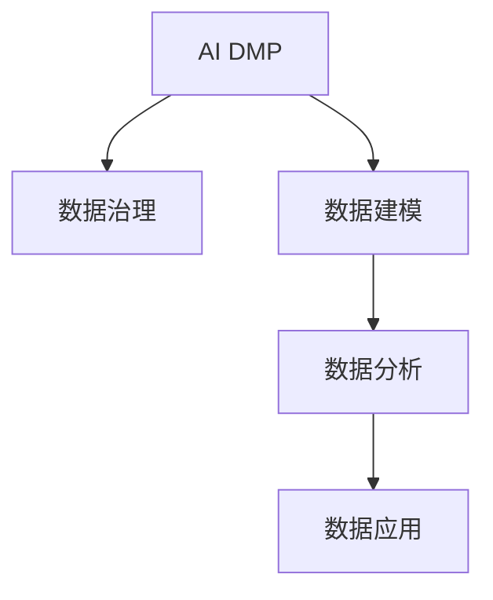

                 

# AI DMP 数据基建：数据分析与洞察

> 关键词：AI DMP, 数据基建, 数据分析, 数据洞察

## 1. 背景介绍

### 1.1 问题由来
随着大数据和人工智能技术的快速发展，客户数据管理平台（Customer Data Platform, DMP）的应用日益广泛。DMP作为连接线上线下数据的桥梁，通过收集、整合、分析和应用用户数据，为企业提供了全面的客户画像、行为分析、营销推荐等服务。然而，传统的DMP系统普遍存在数据集成难、数据质量差、分析精度低等问题，难以满足日益增长的用户需求和业务目标。

AI DMP作为新一代的客户数据管理平台，通过引入人工智能算法，实现了数据自动化采集、智能化分析、精准化推荐的飞跃，成为数据驱动营销的重要工具。AI DMP的核心价值在于利用AI技术，全面提升数据质量和分析精度，从而为企业提供更加全面、深入、智能化的客户洞察和服务。

### 1.2 问题核心关键点
AI DMP的核心技术包括数据采集、数据治理、数据建模、数据分析和数据应用等多个方面。本文章将重点介绍AI DMP中的数据治理和数据分析技术，探讨如何通过AI技术实现数据的高效管理与精准分析。

## 2. 核心概念与联系

### 2.1 核心概念概述

为更好地理解AI DMP的数据治理和分析技术，本节将介绍几个密切相关的核心概念：

- AI DMP: 基于人工智能技术，自动化采集、治理、分析和管理客户数据的平台。
- 数据治理: 通过数据标准、数据质量、数据安全等手段，确保数据的一致性、可靠性和安全性。
- 数据建模: 利用机器学习、深度学习等技术，构建预测模型，发现数据中的潜在模式和关系。
- 数据分析: 通过统计分析、机器学习等手段，提取有价值的信息，支持业务决策和运营优化。
- 数据应用: 将分析结果应用到实际的营销、广告、推荐等场景中，提升业务效果。

这些核心概念之间的逻辑关系可以通过以下Mermaid流程图来展示：



这个流程图展示了他核心的概念及其之间的关系：

1. AI DMP通过数据治理、数据建模和数据分析技术，实现了数据的自动化采集、智能化分析和精准化推荐。
2. 数据治理确保了数据的质量和安全性，为数据建模和分析提供了可靠的基础。
3. 数据建模利用机器学习等技术，发现数据中的潜在模式和关系，提升分析的深度和广度。
4. 数据分析提取有价值的信息，支持业务决策和运营优化，为数据应用提供支持。
5. 数据应用将分析结果应用到实际的营销、广告、推荐等场景中，提升业务效果。

## 3. 核心算法原理 & 具体操作步骤
### 3.1 算法原理概述

AI DMP中的数据治理和分析技术，主要基于监督学习和无监督学习两种机器学习范式。

- 监督学习：利用标记过的数据集，训练机器学习模型进行预测和分类，典型应用包括用户分群、行为预测等。
- 无监督学习：从未标记的数据中，自动发现数据中的潜在模式和结构，典型应用包括聚类分析、异常检测等。

数据治理的主要目标是提升数据质量和一致性，主要采用数据清洗、数据标注、数据融合等技术手段。数据分析则更多关注于从数据中提取有价值的信息，支持业务决策和运营优化。

### 3.2 算法步骤详解

#### 数据治理

1. **数据采集**：收集线上线下的用户行为数据，包括浏览记录、购买记录、社交媒体互动等。

2. **数据清洗**：处理缺失值、异常值、重复数据等，保证数据质量。

3. **数据标注**：利用人工或自动标注工具，为数据添加标签，便于后续分析。

4. **数据融合**：将来自不同渠道的数据进行整合，消除数据不一致性，形成统一的客户画像。

5. **数据可视化**：通过可视化工具，展示数据结构和分析结果，便于业务人员理解和决策。

#### 数据分析

1. **数据预处理**：包括数据归一化、特征选择、特征工程等，为后续分析做准备。

2. **建模与训练**：选择合适的机器学习算法（如线性回归、决策树、神经网络等），使用训练数据集进行模型训练。

3. **模型评估**：利用验证集或测试集对模型进行评估，选择最优模型。

4. **特征提取**：提取模型中的关键特征，为后续应用做准备。

5. **应用与反馈**：将模型应用到实际的业务场景中，并根据结果不断调整优化模型。

### 3.3 算法优缺点

AI DMP中的数据治理和分析技术具有以下优点：

- 提升数据质量：通过数据清洗、数据标注等手段，提升数据一致性和可靠性。
- 自动化分析：利用AI技术，实现数据自动化采集、智能化分析和精准化推荐。
- 支持复杂分析：支持聚类分析、异常检测等复杂分析，发现数据中的潜在模式和关系。
- 提升决策支持：通过分析结果，支持业务决策和运营优化，提升业务效果。

同时，该技术也存在以下局限性：

- 数据依赖性强：对数据质量和标注数据依赖性强，数据采集成本较高。
- 模型复杂度高：构建复杂模型需要较高的计算资源和技术门槛。
- 结果可解释性差：部分AI模型结果难以解释，影响业务理解和决策。
- 模型过拟合风险：复杂模型容易出现过拟合，影响模型泛化能力。

尽管存在这些局限性，AI DMP中的数据治理和分析技术仍是大数据应用的重要手段，通过合理设计和优化，可以充分发挥其优势，提升业务价值。

### 3.4 算法应用领域

AI DMP中的数据治理和分析技术，已经在诸多领域得到广泛应用，如：

- 市场营销：通过分析客户行为数据，进行精准营销和广告投放。
- 产品推荐：利用用户画像和行为数据，推荐个性化商品和内容。
- 客户服务：利用客户反馈数据，进行客户分群和需求分析。
- 风险管理：通过数据分析，预测和防范欺诈、流失等风险。
- 金融风控：利用用户行为数据，进行信用评估和风险控制。

## 4. 数学模型和公式 & 详细讲解  
### 4.1 数学模型构建

本节将使用数学语言对AI DMP中的数据治理和分析技术进行更加严格的刻画。

设训练数据集为 $D=\{(x_i,y_i)\}_{i=1}^N, x_i \in \mathbb{R}^d, y_i \in \{0,1\}$，其中 $x_i$ 为输入特征向量，$y_i$ 为标记标签。

数据治理的目标是提升数据质量，即消除噪声、填补缺失值、校正数据异常等。可以采用以下方法：

- 数据清洗：通过数据去重、去噪、填补缺失值等方法，提升数据质量。
- 数据标注：利用人工或自动标注工具，为数据添加标签，便于后续分析。
- 数据融合：通过数据合并、匹配等方法，消除数据不一致性，形成统一的客户画像。

数据建模的目标是发现数据中的潜在模式和关系，可以采用以下方法：

- 聚类分析：使用K-means、GMM等算法，将数据分成若干簇。
- 关联规则：使用Apriori、FP-Growth等算法，发现数据中的频繁模式和关联关系。
- 异常检测：使用孤立森林、LOF等算法，检测数据中的异常点。

数据分析的目标是从数据中提取有价值的信息，支持业务决策和运营优化，可以采用以下方法：

- 特征选择：使用PCA、LASSO等算法，选择最优特征。
- 回归分析：使用线性回归、决策树等算法，预测数值型变量。
- 分类分析：使用逻辑回归、SVM等算法，进行分类预测。
- 时间序列分析：使用ARIMA、LSTM等算法，进行时间序列预测。

### 4.2 公式推导过程

以下我们以聚类分析和回归分析为例，推导其中的关键数学公式。

**聚类分析（K-means算法）**：

设 $x_i \in \mathbb{R}^d$ 为输入数据，$k$ 为簇的数量，$z_i$ 为数据点的簇分配，$W_i$ 为簇的中心点。

目标函数为：

$$
\min_{z_i} \sum_{i=1}^N \sum_{j=1}^k (x_i - W_j)^2 z_{ij}
$$

其中 $z_{ij}$ 为 $x_i$ 分配到第 $j$ 簇的概率，满足 $\sum_{j=1}^k z_{ij} = 1$。

求解目标函数，得到最优解为：

$$
z_{ij} = 
\begin{cases} 
1 & \text{如果 } x_i \text{ 属于第 } j \text{ 簇} \\
0 & \text{否则}
\end{cases}
$$

**回归分析（线性回归）**：

设 $x_i \in \mathbb{R}^d$ 为输入数据，$y_i \in \mathbb{R}$ 为输出标签，$\beta$ 为模型参数。

目标函数为：

$$
\min_{\beta} \sum_{i=1}^N (y_i - \beta^T x_i)^2
$$

求解目标函数，得到最优解为：

$$
\beta = (\sum_{i=1}^N x_i x_i^T)^{-1} \sum_{i=1}^N x_i y_i
$$

### 4.3 案例分析与讲解

**案例一：聚类分析**：

假设某电商网站希望将用户分为不同的购买群体，以实现精准营销。通过分析用户购买行为数据，构建用户画像，使用K-means算法进行聚类分析，得到如下结果：

| 簇编号 | 簇中心 | 簇内数据点数 |
| --- | --- | --- |
| 1 | [100, 200] | 1000 |
| 2 | [50, 100] | 800 |
| 3 | [150, 250] | 600 |
| 4 | [30, 80] | 400 |

通过分析各簇的用户特征，进行针对性营销，可以显著提升营销效果。

**案例二：回归分析**：

假设某保险公司希望预测用户的信用评分，以进行风险控制。通过分析用户年龄、收入、职业等数据，构建数据集 $D$，使用线性回归算法进行预测，得到如下结果：

| 用户年龄 | 用户收入 | 用户职业 | 预测信用评分 |
| --- | --- | --- | --- |
| 25 | 50,000 | 工程师 | 0.8 |
| 30 | 60,000 | 教师 | 0.9 |
| 35 | 70,000 | 医生 | 0.7 |

通过模型预测用户的信用评分，可以更加精准地进行风险评估和控制。

## 5. 项目实践：代码实例和详细解释说明
### 5.1 开发环境搭建

在进行AI DMP的数据治理和分析实践前，我们需要准备好开发环境。以下是使用Python进行Scikit-learn开发的Scikit-learn环境配置流程：

1. 安装Anaconda：从官网下载并安装Anaconda，用于创建独立的Python环境。

2. 创建并激活虚拟环境：
```bash
conda create -n sklearn-env python=3.8 
conda activate sklearn-env
```

3. 安装Scikit-learn：
```bash
conda install scikit-learn
```

4. 安装各类工具包：
```bash
pip install numpy pandas scikit-learn matplotlib tqdm jupyter notebook ipython
```

完成上述步骤后，即可在`sklearn-env`环境中开始数据治理和分析实践。

### 5.2 源代码详细实现

这里我们以聚类分析和回归分析为例，给出使用Scikit-learn对数据进行聚类和回归的Python代码实现。

**聚类分析（K-means算法）**：

```python
from sklearn.cluster import KMeans
from sklearn.datasets import make_blobs
import matplotlib.pyplot as plt

# 生成模拟数据
X, y = make_blobs(n_samples=1000, centers=4, random_state=42)

# 定义模型
kmeans = KMeans(n_clusters=4, random_state=42)

# 训练模型
kmeans.fit(X)

# 可视化结果
plt.scatter(X[:, 0], X[:, 1], c=kmeans.labels_)
plt.show()
```

**回归分析（线性回归）**：

```python
from sklearn.linear_model import LinearRegression
from sklearn.datasets import make_regression
import matplotlib.pyplot as plt

# 生成模拟数据
X, y = make_regression(n_samples=1000, n_features=1, n_informative=1, noise=0.1, random_state=42)

# 定义模型
reg = LinearRegression()

# 训练模型
reg.fit(X, y)

# 可视化结果
plt.scatter(X[:, 0], y, color='blue')
plt.plot(X[:, 0], reg.predict(X[:, 0]), color='red')
plt.show()
```

以上就是使用Scikit-learn对数据进行聚类分析和回归分析的完整代码实现。可以看到，Scikit-learn提供了简单易用的接口，使得数据治理和分析任务的实现变得非常简单。

### 5.3 代码解读与分析

让我们再详细解读一下关键代码的实现细节：

**K-means算法**：
- `make_blobs`函数生成模拟数据，用于聚类分析。
- `KMeans`类定义K-means模型，`n_clusters`参数指定簇的数量。
- `fit`方法训练模型，`labels_`属性获取聚类结果。
- `scatter`方法可视化聚类结果。

**线性回归**：
- `make_regression`函数生成模拟数据，用于回归分析。
- `LinearRegression`类定义线性回归模型。
- `fit`方法训练模型，`predict`方法预测结果。
- `scatter`方法可视化回归结果。

这些代码展示了Scikit-learn的简单高效性，使得数据分析任务更加便捷。当然，实际应用中还需要考虑数据预处理、模型评估、结果应用等环节，但核心的治理和分析方法与上述示例类似。

## 6. 实际应用场景
### 6.1 智能客服系统

AI DMP中的数据分析和建模技术，可以广泛应用于智能客服系统的构建。传统客服系统往往依赖人工，难以应对高峰期的服务压力，且服务质量和个性化程度难以保证。AI DMP中的数据分析技术可以自动分析用户历史行为数据，构建用户画像，优化客服策略，实现智能客服。

具体而言，通过数据分析，可以发现用户在客服系统的常见问题、常见对话流程，设计智能问答系统，自动化回答常见问题。同时，通过聚类分析，将用户分为不同的需求群体，设计不同的服务策略，提升服务效果。

### 6.2 金融风险管理

AI DMP中的数据分析和建模技术，在金融风险管理中具有广泛的应用。通过数据分析，可以预测用户信用评分，评估用户风险等级，帮助金融机构进行风险控制。同时，通过异常检测算法，检测用户行为中的异常行为，及时发现潜在的欺诈风险，提升风控效果。

具体而言，利用线性回归等回归模型，可以构建用户信用评分预测模型，评估用户风险等级。利用孤立森林等异常检测算法，可以检测用户交易行为中的异常行为，及时发现潜在欺诈风险。

### 6.3 智能推荐系统

AI DMP中的数据分析和建模技术，可以广泛应用于智能推荐系统。通过数据分析，可以发现用户行为模式，构建用户画像，推荐个性化商品和服务。同时，通过聚类分析和关联规则等算法，发现用户行为中的潜在关联关系，提升推荐效果。

具体而言，利用K-means等聚类算法，可以将用户分为不同的需求群体，设计不同的推荐策略。利用关联规则算法，可以发现用户行为中的潜在关联关系，提升推荐效果。

## 7. 工具和资源推荐
### 7.1 学习资源推荐

为了帮助开发者系统掌握AI DMP的数据治理和分析技术，这里推荐一些优质的学习资源：

1. 《Python数据科学手册》：全面介绍了Python在数据科学中的应用，包括数据采集、数据清洗、数据建模等。

2. 《数据科学入门》课程：由Coursera提供的入门级数据科学课程，涵盖数据治理、数据分析、数据可视化等核心内容。

3. 《机器学习实战》书籍：通过实际案例，深入浅出地介绍了机器学习算法及其应用。

4. Kaggle：机器学习竞赛平台，提供丰富的数据集和竞赛题目，适合实战练习。

5. Scikit-learn官方文档：详细介绍了Scikit-learn库的使用方法和API，是数据治理和分析实践的必备资料。

通过对这些资源的学习实践，相信你一定能够快速掌握AI DMP的数据治理和分析技术，并用于解决实际的业务问题。

### 7.2 开发工具推荐

高效的开发离不开优秀的工具支持。以下是几款用于AI DMP数据治理和分析开发的常用工具：

1. Jupyter Notebook：提供交互式编程环境，便于数据处理和算法实现。

2. Pandas：提供了高效的数据处理工具，支持数据清洗、数据融合等操作。

3. Scikit-learn：提供了丰富的机器学习算法库，支持聚类分析、回归分析等操作。

4. TensorFlow：提供了高效的深度学习框架，支持复杂模型的构建和训练。

5. Matplotlib：提供了丰富的数据可视化工具，支持各类图表的绘制。

合理利用这些工具，可以显著提升AI DMP数据治理和分析任务的开发效率，加快创新迭代的步伐。

### 7.3 相关论文推荐

AI DMP中的数据治理和分析技术的发展源于学界的持续研究。以下是几篇奠基性的相关论文，推荐阅读：

1. K-means: Algorithms for Vector Quantization （K-means算法）：提出了经典的K-means算法，广泛应用于聚类分析中。

2. Linear Regression: A Tutorial （线性回归）：介绍了线性回归算法的基本原理和实现方法。

3. Anomaly Detection in Large Datasets with the Isolation Forest （孤立森林）：提出了孤立森林算法，用于异常检测。

4. Associative Rule Mining Techniques: A Survey （关联规则算法）：综述了关联规则算法的实现方法和应用场景。

这些论文代表了大数据治理和分析技术的发展脉络。通过学习这些前沿成果，可以帮助研究者把握学科前进方向，激发更多的创新灵感。

## 8. 总结：未来发展趋势与挑战
### 8.1 总结

本文对AI DMP中的数据治理和分析技术进行了全面系统的介绍。首先阐述了AI DMP的核心技术及其在数据管理和分析中的应用价值。其次，从原理到实践，详细讲解了数据治理和分析技术的数学模型和算法步骤，给出了数据治理和分析任务开发的完整代码实例。同时，本文还广泛探讨了数据治理和分析技术在智能客服、金融风险管理、智能推荐等多个行业领域的应用前景，展示了数据治理和分析技术的巨大潜力。此外，本文精选了数据治理和分析技术的各类学习资源，力求为读者提供全方位的技术指引。

通过本文的系统梳理，可以看到，AI DMP中的数据治理和分析技术正在成为大数据应用的重要手段，通过AI技术全面提升数据质量和分析精度，从而为企业提供更加全面、深入、智能化的客户洞察和服务。未来，伴随大数据和人工智能技术的不断演进，数据治理和分析技术必将实现更高效的自动化、智能化应用，助力企业数据驱动决策，提升业务价值。

### 8.2 未来发展趋势

展望未来，AI DMP中的数据治理和分析技术将呈现以下几个发展趋势：

1. 数据质量自动化：通过自动化数据治理技术，实现数据质量的实时监测和自动修复。

2. 实时数据分析：利用流式计算和大数据技术，实现实时数据分析，满足业务对实时性的需求。

3. 多模态数据分析：融合视觉、语音、文本等多模态数据，提升数据分析的深度和广度。

4. 模型可解释性：引入可解释性模型和工具，提升AI模型的透明性和可信度。

5. 隐私保护技术：引入隐私保护技术，如差分隐私、联邦学习等，保护用户隐私和数据安全。

6. 数据融合与共享：通过数据联邦和边缘计算技术，实现数据融合与共享，提升数据治理的效率和效果。

以上趋势凸显了AI DMP数据治理和分析技术的广阔前景。这些方向的探索发展，必将进一步提升数据治理和分析的自动化、智能化水平，推动大数据驱动决策的发展。

### 8.3 面临的挑战

尽管AI DMP中的数据治理和分析技术已经取得了瞩目成就，但在迈向更加智能化、普适化应用的过程中，仍面临诸多挑战：

1. 数据质量难以保证：数据采集和清洗的难度较大，数据质量难以完全保证。如何实现数据质量的实时监测和自动修复，将是未来的一个重要课题。

2. 模型复杂度提升：复杂的模型结构和算法需要较高的计算资源和技术门槛，如何实现高效、易用的数据治理和分析工具，将是未来的一个重要研究方向。

3. 数据隐私保护：大数据分析带来了数据隐私和安全问题，如何保护用户隐私和数据安全，将是未来的一个重要课题。

4. 算法可解释性：复杂模型难以解释，影响业务理解和决策。如何提升算法的透明性和可信度，将是未来的一个重要研究方向。

5. 跨模态数据融合：不同模态的数据融合难度较大，如何实现高效、准确的数据融合，将是未来的一个重要研究方向。

6. 实时数据分析：实时数据分析需要高效、可靠的基础设施和算法，如何实现高效、可靠的实时数据分析，将是未来的一个重要研究方向。

### 8.4 研究展望

面对AI DMP数据治理和分析技术所面临的种种挑战，未来的研究需要在以下几个方面寻求新的突破：

1. 数据治理的自动化：通过自动化数据清洗和标注工具，提升数据治理的效率和效果。

2. 数据质量监测的实时化：通过实时监测和自动修复工具，保证数据质量。

3. 数据治理的智能化：利用AI技术，实现数据治理的智能化，提升数据治理的效果。

4. 模型可解释性的提升：引入可解释性模型和工具，提升AI模型的透明性和可信度。

5. 多模态数据分析的融合：引入多模态数据分析技术，提升数据分析的深度和广度。

6. 隐私保护技术的引入：引入隐私保护技术，保护用户隐私和数据安全。

这些研究方向的探索，必将引领AI DMP数据治理和分析技术迈向更高的台阶，为大数据驱动决策提供更强大的技术支持。面向未来，数据治理和分析技术还需要与其他人工智能技术进行更深入的融合，如知识表示、因果推理、强化学习等，多路径协同发力，共同推动大数据驱动决策的发展。

## 9. 附录：常见问题与解答

**Q1：AI DMP的数据治理和分析是否适用于所有大数据场景？**

A: AI DMP的数据治理和分析技术主要应用于数据驱动的决策场景，适用于对数据质量和分析精度有较高要求的应用。但对于数据量较小、数据分布均匀的场景，传统的数据治理和分析方法也能达到良好的效果。

**Q2：如何进行高效的数据治理？**

A: 数据治理的效率可以通过自动化数据清洗、标注和融合工具实现。常用的工具包括ETL工具（如Apache Nifi）、数据标注工具（如Labelbox）、数据融合工具（如Trifacta）。这些工具可以通过配置脚本，实现自动化数据治理，提高效率。

**Q3：如何在保证数据隐私的前提下进行数据分析？**

A: 数据隐私保护可以通过差分隐私、联邦学习等技术实现。差分隐私通过添加噪声，保护用户隐私；联邦学习通过分布式计算，保护数据隐私。同时，数据脱敏和加密技术也可以用于保护数据隐私。

**Q4：如何提升AI模型的透明性和可信度？**

A: 提升AI模型的透明性和可信度可以通过可解释性模型和工具实现。常用的工具包括LIME、SHAP等，可以对模型的决策过程进行可视化，帮助理解模型的输出。同时，模型透明性和可信度的提升，也可以通过引入规则和知识图谱等先验知识，提升模型的可解释性。

**Q5：如何实现高效的数据融合？**

A: 高效的数据融合可以通过数据联邦和边缘计算技术实现。数据联邦通过分布式计算，实现不同数据源的数据融合；边缘计算通过在数据源端进行数据预处理，提升数据融合的效率和效果。同时，数据标准和数据共享协议，也可以提升数据融合的效率。

以上是AI DMP数据治理和分析技术的详细介绍和未来展望。希望通过本文的学习，你能够更好地理解AI DMP的核心技术，并在实际应用中发挥其价值。

---

作者：禅与计算机程序设计艺术 / Zen and the Art of Computer Programming

