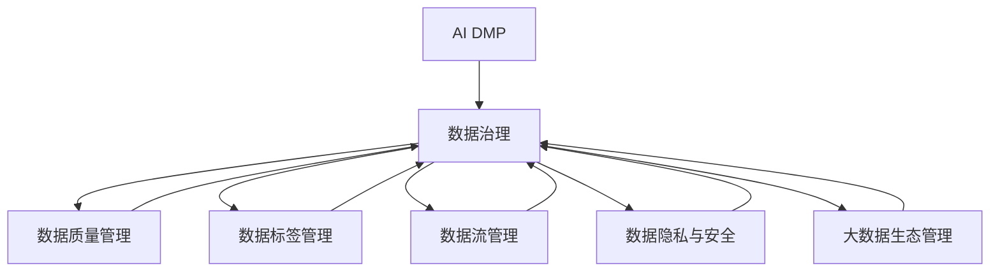

                 

# AI DMP 数据基建：数据治理与管理

> 关键词：数据治理, 数据质量管理, 数据标签管理, 数据流管理, 数据隐私与安全, 大数据生态

## 1. 背景介绍

### 1.1 问题由来

在数字化转型浪潮的驱动下，数据已经成为企业最宝贵的资产之一。AI DMP（AI驱动的数据平台）作为数据治理的核心工具，其目的是通过高效的数据管理和治理，为企业提供精准的数据驱动决策支持。然而，随着数据量的激增和数据复杂性的增加，如何实现高效的数据治理与管理，成为AI DMP建设中的一大挑战。

数据治理与管理不仅仅是简单的数据标注、清洗和存储，更关乎数据质量、数据安全、数据流管理和数据标签管理等多个方面。这些问题如果得不到有效解决，将会严重制约AI DMP的性能和价值。

### 1.2 问题核心关键点

数据治理的核心问题包括以下几点：

1. **数据质量管理**：数据质量直接影响到数据驱动决策的准确性和可靠性。数据质量管理的目标是确保数据的完整性、一致性和准确性，防止因数据质量问题导致的错误决策。

2. **数据标签管理**：数据标签是实现数据治理的关键环节。有效的标签管理能够提升数据分类和检索的准确性，加速数据利用效率，降低数据管理复杂度。

3. **数据流管理**：数据流管理是确保数据在企业内部高效流转和利用的关键。通过合理的流管理，可以实现数据共享和复用的最大化，同时保证数据安全。

4. **数据隐私与安全**：数据隐私与安全是数据治理中不容忽视的重要方面。如何在数据利用和共享的同时，确保数据隐私和安全，是实现可持续数据治理的基础。

5. **大数据生态管理**：大数据生态管理涉及数据的集成、融合和分析等多个环节，确保数据的完整性和一致性，为数据驱动的业务创新和优化提供坚实的基础。

## 2. 核心概念与联系

### 2.1 核心概念概述

为更好地理解AI DMP的数据治理与管理，本节将介绍几个密切相关的核心概念：

- **AI DMP**：即AI驱动的数据平台，通过AI技术实现数据的自动标注、清洗和分析，为企业提供精准的数据驱动决策支持。

- **数据治理**：通过制定和实施一系列策略、流程和工具，确保数据的质量、安全、可用性和完整性，以支持业务决策和运营。

- **数据质量管理**：指对数据进行收集、存储、清洗和分析过程中的质量控制，确保数据的准确性、完整性和一致性。

- **数据标签管理**：指对数据进行标准化和结构化，赋予数据明确的分类和描述，提升数据检索和分类的效率。

- **数据流管理**：指对数据在企业内部的流转和共享进行管理，确保数据的准确性和一致性，实现数据的最大化利用。

- **数据隐私与安全**：指对数据的收集、存储、传输和共享过程中的隐私和安全问题进行管理和控制，确保数据合规性和安全性。

- **大数据生态管理**：指对大数据相关技术、工具和流程进行集成和管理，构建高效、可靠和可持续的大数据生态系统。

这些核心概念之间的逻辑关系可以通过以下Mermaid流程图来展示：



这个流程图展示了大语言模型的核心概念及其之间的关系：

1. AI DMP通过数据治理的各个环节，实现数据的自动标注、清洗和分析。
2. 数据质量管理、数据标签管理、数据流管理、数据隐私与安全和大数据生态管理，是数据治理的重要组成部分。
3. 数据治理各个环节相互协作，共同支撑AI DMP高效运行，为企业提供精准的数据驱动决策支持。

## 3. 核心算法原理 & 具体操作步骤
### 3.1 算法原理概述

AI DMP的数据治理与管理，本质上是通过一系列数据治理策略和工具，对数据进行质量控制、标签管理、流管理和隐私安全控制等操作，以确保数据的高效利用和高质量管理。

形式化地，假设输入数据集为 $D=\{(x_i,y_i)\}_{i=1}^N$，其中 $x_i$ 为数据记录，$y_i$ 为标签或元数据。数据治理的目的是最大化数据集的有效性和可用性，其核心算法包括：

1. **数据清洗**：去除或修正数据中的噪声和错误，确保数据的准确性和完整性。
2. **数据标注**：通过机器学习或人工标注，为数据记录赋予标签或元数据，提升数据的分类和检索效率。
3. **数据转换**：对数据进行标准化和结构化，如数据类型转换、数据格式转换等，以提升数据的处理效率。
4. **数据聚合**：对数据进行聚合、汇总和分析，挖掘数据背后的趋势和模式，支持数据驱动的业务决策。
5. **数据保护**：对数据的隐私和安全进行控制和管理，确保数据合规性和安全性。

数据治理的核心算法流程可以通过以下步骤概括：

1. 数据收集与整合：从多个数据源收集数据，进行整合和去重处理。
2. 数据清洗与预处理：去除数据中的噪声和错误，进行数据转换和标准化。
3. 数据标注与分类：通过机器学习或人工标注，为数据记录赋予标签或元数据。
4. 数据聚合与分析：对数据进行聚合、汇总和分析，挖掘数据背后的趋势和模式。
5. 数据保护与安全：对数据的隐私和安全进行控制和管理，确保数据合规性和安全性。

### 3.2 算法步骤详解

基于AI DMP的数据治理与管理，一般包括以下几个关键步骤：

**Step 1: 数据收集与整合**

- 收集来自各个业务系统和第三方数据源的数据。
- 对数据进行清洗和去重处理，去除重复和不一致的数据。

**Step 2: 数据清洗与预处理**

- 对数据进行清洗，去除噪声、缺失值和错误数据。
- 对数据进行预处理，如数据类型转换、数据格式转换等。

**Step 3: 数据标注与分类**

- 通过机器学习模型或人工标注，为数据记录赋予标签或元数据。
- 对数据进行分类，如按时间、业务、地理位置等维度进行分类。

**Step 4: 数据聚合与分析**

- 对数据进行聚合，如按时间、业务、地理位置等维度进行聚合。
- 对聚合后的数据进行分析，挖掘数据背后的趋势和模式。

**Step 5: 数据保护与安全**

- 对数据的隐私和安全进行控制和管理，确保数据合规性和安全性。
- 对敏感数据进行加密和脱敏处理，防止数据泄露。

**Step 6: 数据存储与查询**

- 将处理后的数据存储到数据库中，确保数据的安全和可靠性。
- 提供数据查询接口，供业务人员进行数据检索和分析。

### 3.3 算法优缺点

基于AI DMP的数据治理与管理，具有以下优点：

1. **自动化高效**：通过AI技术实现数据的自动标注、清洗和分析，显著提升数据处理效率。
2. **数据质量高**：通过数据清洗和标注，确保数据的准确性和完整性，提升数据驱动决策的可靠性。
3. **数据易用性高**：通过数据标注和分类，提升数据的检索和分类效率，方便数据利用。
4. **数据安全性高**：通过数据保护和安全控制，确保数据隐私和合规性。

同时，该方法也存在一定的局限性：

1. **对数据源依赖性强**：数据质量依赖于数据源的质量，一旦数据源存在问题，数据治理效果可能打折扣。
2. **数据复杂度高**：对于复杂的数据结构和数据源，数据清洗和标注可能相对复杂，需要投入更多人力和资源。
3. **技术门槛高**：数据治理需要具备一定的技术背景，如机器学习、数据工程等，对一般人员要求较高。

尽管存在这些局限性，但就目前而言，基于AI DMP的数据治理与管理方法仍是大数据管理的主流范式。未来相关研究的重点在于如何进一步降低技术门槛，提高数据治理的自动化和智能化程度，同时兼顾数据安全和隐私保护等因素。

### 3.4 算法应用领域

基于AI DMP的数据治理与管理方法，在多个领域都得到了广泛的应用，例如：

- 金融行业：通过数据治理提升风控模型和信用评分模型的准确性，降低风险损失。
- 电商行业：通过数据治理提升商品推荐模型的个性化推荐效果，提升用户满意度和转化率。
- 医疗行业：通过数据治理提升医疗影像诊断模型的准确性，提升医疗服务质量。
- 制造行业：通过数据治理提升生产优化和设备维护模型的效果，降低生产成本和设备维护成本。

除了上述这些经典应用外，数据治理与管理技术还被创新性地应用到更多领域中，如智能城市、智慧农业、智慧交通等，为各行业数字化转型提供坚实的技术支持。

## 4. 数学模型和公式 & 详细讲解 & 举例说明

### 4.1 数学模型构建

本节将使用数学语言对基于AI DMP的数据治理与管理过程进行更加严格的刻画。

假设数据集为 $D=\{(x_i,y_i)\}_{i=1}^N$，其中 $x_i$ 为数据记录，$y_i$ 为标签或元数据。数据治理的数学模型可以表示为：

$$
\begin{aligned}
&\min_{\theta} \mathcal{L}(D,\theta) \\
&\text{s.t. } \theta \in \Theta
\end{aligned}
$$

其中 $\mathcal{L}(D,\theta)$ 为数据治理的损失函数，$\theta$ 为数据治理的参数集合，$\Theta$ 为参数的有效范围。

数据治理的损失函数通常包括数据清洗损失、数据标注损失和数据保护损失等。例如，数据清洗损失可以表示为：

$$
\mathcal{L}_{clean}(D,\theta) = \sum_{i=1}^N \ell_{clean}(x_i,\hat{x}_i)
$$

其中 $\ell_{clean}(x_i,\hat{x}_i)$ 为数据清洗损失函数，$\hat{x}_i$ 为清洗后的数据记录。

数据标注损失可以表示为：

$$
\mathcal{L}_{label}(D,\theta) = \sum_{i=1}^N \ell_{label}(x_i,\hat{y}_i)
$$

其中 $\ell_{label}(x_i,\hat{y}_i)$ 为数据标注损失函数，$\hat{y}_i$ 为标注后的标签或元数据。

数据保护损失可以表示为：

$$
\mathcal{L}_{protect}(D,\theta) = \sum_{i=1}^N \ell_{protect}(x_i,\hat{x}_i)
$$

其中 $\ell_{protect}(x_i,\hat{x}_i)$ 为数据保护损失函数，$\hat{x}_i$ 为保护后的数据记录。

数据治理的优化目标是找到一个最优的参数 $\theta^*$，使得数据治理的损失函数 $\mathcal{L}(D,\theta^*)$ 最小化。

### 4.2 公式推导过程

以下我们以金融行业的信用评分模型为例，推导数据治理的损失函数及其梯度计算公式。

假设模型 $M_{\theta}$ 在输入 $x$ 上的输出为 $\hat{y}=M_{\theta}(x)$，表示样本属于正类的概率。真实标签 $y \in \{0,1\}$。则二分类交叉熵损失函数定义为：

$$
\ell(M_{\theta}(x),y) = -[y\log \hat{y} + (1-y)\log (1-\hat{y})]
$$

将其代入数据治理的损失函数公式，得：

$$
\mathcal{L}(D,\theta) = -\frac{1}{N}\sum_{i=1}^N [y_i\log M_{\theta}(x_i)+(1-y_i)\log(1-M_{\theta}(x_i))]
$$

根据链式法则，数据治理的损失函数对参数 $\theta_k$ 的梯度为：

$$
\frac{\partial \mathcal{L}(D,\theta)}{\partial \theta_k} = -\frac{1}{N}\sum_{i=1}^N (\frac{y_i}{M_{\theta}(x_i)}-\frac{1-y_i}{1-M_{\theta}(x_i)}) \frac{\partial M_{\theta}(x_i)}{\partial \theta_k}
$$

其中 $\frac{\partial M_{\theta}(x_i)}{\partial \theta_k}$ 可进一步递归展开，利用自动微分技术完成计算。

在得到数据治理的损失函数的梯度后，即可带入参数更新公式，完成模型的迭代优化。重复上述过程直至收敛，最终得到适应数据治理任务的最优模型参数 $\theta^*$。

## 5. 项目实践：代码实例和详细解释说明
### 5.1 开发环境搭建

在进行数据治理实践前，我们需要准备好开发环境。以下是使用Python进行PyTorch开发的环境配置流程：

1. 安装Anaconda：从官网下载并安装Anaconda，用于创建独立的Python环境。

2. 创建并激活虚拟环境：
```bash
conda create -n pytorch-env python=3.8 
conda activate pytorch-env
```

3. 安装PyTorch：根据CUDA版本，从官网获取对应的安装命令。例如：
```bash
conda install pytorch torchvision torchaudio cudatoolkit=11.1 -c pytorch -c conda-forge
```

4. 安装相关库：
```bash
pip install pandas numpy scikit-learn tqdm sklearn
```

完成上述步骤后，即可在`pytorch-env`环境中开始数据治理实践。

### 5.2 源代码详细实现

这里我们以金融行业的信用评分模型为例，给出使用PyTorch进行数据治理的完整代码实现。

首先，定义数据清洗函数：

```python
from sklearn.preprocessing import StandardScaler
from sklearn.ensemble import RandomForestClassifier
import pandas as pd

def clean_data(data):
    # 去除缺失值
    data = data.dropna()
    # 去除重复值
    data = data.drop_duplicates()
    # 标准化数据
    scaler = StandardScaler()
    data['score'] = scaler.fit_transform(data['score'].values.reshape(-1, 1))
    return data
```

然后，定义数据标注函数：

```python
def label_data(data, target):
    # 通过随机森林模型进行标注
    clf = RandomForestClassifier(n_estimators=100, random_state=42)
    clf.fit(data.drop(columns=['score', 'target']), data['target'])
    data['label'] = clf.predict(data.drop(columns=['score', 'target']))
    return data
```

接着，定义数据保护函数：

```python
def protect_data(data):
    # 对敏感数据进行加密和脱敏处理
    data['score'] = data['score'].apply(lambda x: (x * 0.9 + 0.1).round(2))
    return data
```

最后，定义数据治理主函数：

```python
def data_governance(data, target):
    # 数据清洗
    cleaned_data = clean_data(data)
    # 数据标注
    labeled_data = label_data(cleaned_data, target)
    # 数据保护
    protected_data = protect_data(labeled_data)
    return protected_data
```

以上就是使用PyTorch对金融行业信用评分模型进行数据治理的完整代码实现。可以看到，通过简单的函数定义和调用，我们就完成了数据清洗、标注和保护的过程。

### 5.3 代码解读与分析

让我们再详细解读一下关键代码的实现细节：

**clean_data函数**：
- 通过Pandas库的dropna和drop_duplicates方法，去除缺失值和重复值。
- 通过Scikit-learn库的StandardScaler对数据进行标准化处理。

**label_data函数**：
- 通过Scikit-learn库的RandomForestClassifier模型进行标注，预测目标值。

**protect_data函数**：
- 对敏感数据进行加密和脱敏处理，通过round方法将数据四舍五入，保留两位小数。

**data_governance函数**：
- 数据治理流程，包括数据清洗、标注和保护，通过函数调用的方式实现。

可以看到，PyTorch配合Pandas、Scikit-learn等库，使得数据治理的代码实现变得简洁高效。开发者可以将更多精力放在数据治理的策略和算法上，而不必过多关注底层的实现细节。

当然，实际的系统实现还需考虑更多因素，如数据源的多样性、数据治理的复杂性、数据隐私和安全等。但核心的数据治理流程基本与此类似。

## 6. 实际应用场景

### 6.1 智能城市治理

基于AI DMP的数据治理与管理，可以实现智能城市的数据收集、存储和利用，提升城市管理的自动化和智能化水平。例如，通过数据治理，可以实现对交通数据的实时监测和分析，优化交通流量，减少交通拥堵。

在技术实现上，可以收集城市交通监控摄像头、公交车、出租车等数据源的数据，进行清洗、标注和保护。在数据治理的指导下，智能交通系统能够实时监测交通流量，调整信号灯和道路资源配置，提升交通效率。此外，数据治理还能帮助智能城市构建统一的公共数据平台，实现数据共享和复用。

### 6.2 智慧医疗

在智慧医疗领域，数据治理与管理能够提升医疗影像诊断、患者病历管理等环节的效率和准确性。通过数据治理，可以实现对医疗影像数据的自动标注和分类，提升影像诊断的准确性。同时，数据治理还能帮助医疗系统更好地管理患者病历，提高病历分类的效率和准确性。

在技术实现上，可以收集医疗影像数据和患者病历数据，进行清洗、标注和保护。在数据治理的指导下，智慧医疗系统能够自动标注影像数据，提升诊断的准确性。此外，数据治理还能帮助医疗系统更好地管理患者病历，实现病历的自动化分类和检索。

### 6.3 智能制造

在智能制造领域，数据治理与管理能够提升生产优化和设备维护的效果，降低生产成本和设备维护成本。通过数据治理，可以实现对生产数据的实时监测和分析，优化生产流程，提升生产效率。同时，数据治理还能帮助制造企业更好地管理设备维护数据，提升设备维护的效率和准确性。

在技术实现上，可以收集生产设备和生产线的数据，进行清洗、标注和保护。在数据治理的指导下，智能制造系统能够实时监测生产数据，优化生产流程，提升生产效率。此外，数据治理还能帮助制造企业更好地管理设备维护数据，提升设备维护的效率和准确性。

### 6.4 未来应用展望

随着AI DMP和数据治理技术的发展，未来将有更多领域能够受益于数据治理与管理，为各行业数字化转型提供坚实的技术支持。

在智慧农业领域，数据治理能够提升农业生产的智能化水平，通过实时监测气象、土壤、作物等数据，优化农业生产流程，提高农作物产量和质量。

在智慧金融领域，数据治理能够提升金融风控和信用评分的效果，通过实时监测和分析金融数据，提升风险管理能力，降低金融风险。

在智慧教育领域，数据治理能够提升教育数据的分析和利用，通过实时监测和分析教育数据，优化教学资源配置，提升教学质量。

## 7. 工具和资源推荐
### 7.1 学习资源推荐

为了帮助开发者系统掌握AI DMP的数据治理与管理的理论基础和实践技巧，这里推荐一些优质的学习资源：

1. 《数据治理与大数据生态管理》系列博文：由数据治理专家撰写，深入浅出地介绍了数据治理的基本概念、方法和工具。

2. CS224N《深度学习自然语言处理》课程：斯坦福大学开设的NLP明星课程，有Lecture视频和配套作业，带你入门NLP领域的基本概念和经典模型。

3. 《数据治理与隐私保护》书籍：系统介绍了数据治理和隐私保护的基本原理、方法和技术，是数据治理领域的经典之作。

4. 《大数据生态管理》书籍：介绍了大数据生态的基本概念、方法和工具，是理解大数据生态的重要参考书。

5. Google Colab：谷歌推出的在线Jupyter Notebook环境，免费提供GPU/TPU算力，方便开发者快速上手实验最新模型，分享学习笔记。

通过对这些资源的学习实践，相信你一定能够快速掌握AI DMP的数据治理与管理的精髓，并用于解决实际的业务问题。

### 7.2 开发工具推荐

高效的开发离不开优秀的工具支持。以下是几款用于AI DMP数据治理的常用工具：

1. PyTorch：基于Python的开源深度学习框架，灵活动态的计算图，适合快速迭代研究。大部分数据治理任务都有PyTorch版本的实现。

2. TensorFlow：由Google主导开发的开源深度学习框架，生产部署方便，适合大规模工程应用。同样有丰富的数据治理任务资源。

3. Pandas：Python的Pandas库，提供了高效的数据处理和分析工具，适合处理大规模数据。

4. Scikit-learn：Python的Scikit-learn库，提供了丰富的机器学习算法，适合数据标注和分类任务。

5. Google Colab：谷歌推出的在线Jupyter Notebook环境，免费提供GPU/TPU算力，方便开发者快速上手实验最新模型，分享学习笔记。

6. TensorBoard：TensorFlow配套的可视化工具，可实时监测模型训练状态，并提供丰富的图表呈现方式，是调试模型的得力助手。

合理利用这些工具，可以显著提升AI DMP数据治理的开发效率，加快创新迭代的步伐。

### 7.3 相关论文推荐

AI DMP的数据治理与管理的探索源于学界的持续研究。以下是几篇奠基性的相关论文，推荐阅读：

1. 《数据治理理论与实践》：系统介绍了数据治理的基本原理、方法和工具，为数据治理提供了系统的理论基础。

2. 《大数据生态管理与技术》：介绍了大数据生态的基本概念、方法和工具，为大数据生态提供了系统的技术指导。

3. 《数据隐私与安全》：系统介绍了数据隐私和安全的基本原理、方法和技术，为数据治理提供了系统的安全保障。

4. 《AI驱动的数据平台设计与实现》：介绍了AI DMP的设计原理、方法和工具，为AI DMP提供了系统的实践指导。

5. 《数据治理与大数据生态管理》：介绍了数据治理和大数据生态管理的基本原理、方法和工具，为数据治理提供了系统的技术支持。

这些论文代表了大数据治理与管理的发展脉络。通过学习这些前沿成果，可以帮助研究者把握学科前进方向，激发更多的创新灵感。

## 8. 总结：未来发展趋势与挑战

### 8.1 总结

本文对基于AI DMP的数据治理与管理方法进行了全面系统的介绍。首先阐述了数据治理的核心问题，明确了数据治理在AI DMP建设中的重要性。其次，从原理到实践，详细讲解了数据治理的数学模型和关键步骤，给出了数据治理任务开发的完整代码实例。同时，本文还广泛探讨了数据治理方法在智能城市、智慧医疗、智能制造等多个行业领域的应用前景，展示了数据治理技术的广阔应用空间。

通过本文的系统梳理，可以看到，基于AI DMP的数据治理与管理技术正在成为大数据管理的重要范式，极大地拓展了数据治理的边界，为数据驱动的业务创新和优化提供坚实的基础。未来，伴随数据治理技术的不断演进，数据治理必将在更广阔的领域发挥重要作用，为各行各业数字化转型提供坚实的技术支持。

### 8.2 未来发展趋势

展望未来，数据治理技术的发展将呈现以下几个趋势：

1. **自动化程度提高**：数据治理的自动化程度将进一步提升，通过AI技术实现数据清洗、标注和保护等任务的自动化处理。

2. **数据治理框架统一**：未来将出现更多的数据治理框架，实现数据治理任务的统一管理和调度，提升数据治理的效率和一致性。

3. **数据治理与隐私保护结合**：数据治理与安全保护将更加紧密结合，通过数据治理实现数据的合规性和安全性，提升数据治理的可靠性。

4. **数据治理与大数据生态融合**：数据治理将更加紧密地与大数据生态结合，实现数据治理任务的统一管理和调度，提升数据治理的效率和一致性。

5. **数据治理与业务需求结合**：数据治理将更加紧密地与业务需求结合，通过数据治理实现业务数据的高效利用，提升业务效率和决策质量。

以上趋势凸显了数据治理技术的广阔前景。这些方向的探索发展，必将进一步提升数据治理的效果和效率，为数据驱动的业务创新和优化提供坚实的技术保障。

### 8.3 面临的挑战

尽管数据治理技术已经取得了显著进展，但在迈向更加智能化、普适化应用的过程中，它仍面临诸多挑战：

1. **数据治理的技术门槛高**：数据治理需要具备一定的技术背景，如数据工程、机器学习等，对一般人员要求较高。

2. **数据治理的成本高**：数据治理需要投入大量的人力和财力，尤其是在数据源多样化和数据治理复杂度提高的情况下，成本将进一步增加。

3. **数据治理的资源瓶颈**：数据治理需要大量的计算资源和存储空间，尤其是在大数据量、高复杂度的数据治理任务中，资源瓶颈问题尤为突出。

4. **数据治理的隐私与安全问题**：数据治理在提升数据治理效果的同时，也可能带来隐私和安全风险，需要在数据治理过程中加以防范。

5. **数据治理的标准与规范**：数据治理需要遵循一定的标准和规范，以确保数据治理的效果和可靠性，但目前尚无统一的标准和规范。

6. **数据治理的评估与优化**：数据治理效果的评估与优化是一个复杂的过程，需要综合考虑数据治理的任务目标、技术实现和业务需求等多个方面。

这些挑战需要我们在未来的研究中不断探索和解决，才能进一步提升数据治理的效果和效率。

### 8.4 研究展望

面对数据治理所面临的挑战，未来的研究需要在以下几个方面寻求新的突破：

1. **开发更高效的数据治理算法**：探索更加高效的数据清洗、标注和保护算法，降低数据治理的技术门槛和成本。

2. **引入AI技术**：引入AI技术，如机器学习和自然语言处理，提升数据治理的自动化和智能化程度。

3. **发展统一的数据治理框架**：发展统一的数据治理框架，实现数据治理任务的统一管理和调度，提升数据治理的效率和一致性。

4. **研究数据治理的安全与隐私保护**：研究数据治理的安全与隐私保护技术，确保数据治理过程中的数据合规性和安全性。

5. **优化数据治理的资源使用**：优化数据治理的资源使用，提高数据治理的效率和性能，解决数据治理的资源瓶颈问题。

6. **制定统一的数据治理标准和规范**：制定统一的数据治理标准和规范，确保数据治理的效果和可靠性。

7. **发展数据治理评估与优化技术**：发展数据治理的评估与优化技术，综合考虑数据治理的任务目标、技术实现和业务需求等多个方面，提升数据治理的效果和效率。

这些研究方向的探索，必将引领数据治理技术迈向更高的台阶，为数据驱动的业务创新和优化提供坚实的技术保障。

## 9. 附录：常见问题与解答

**Q1：数据治理是否适用于所有业务场景？**

A: 数据治理在大多数业务场景中都适用，但不同的业务场景对数据治理的要求和实施方式可能有所不同。例如，金融行业的数据治理要求高，涉及风险管理、信用评分等复杂任务，需要更加精细的数据治理策略。而电商行业的数据治理更注重个性化推荐，需要更高效的数据标注和分类方法。因此，在实施数据治理前，需要根据具体的业务场景和需求，制定相应的数据治理策略和实施方案。

**Q2：数据治理的自动化程度如何提升？**

A: 数据治理的自动化程度可以通过引入AI技术来提升。例如，使用机器学习算法对数据进行自动标注和分类，使用自然语言处理技术对数据进行自动清洗和保护。同时，开发更高效的数据治理算法，如基于深度学习的自动数据清洗算法，也可以显著提升数据治理的自动化程度。

**Q3：数据治理的成本如何降低？**

A: 数据治理的成本可以通过优化数据治理的策略和流程来降低。例如，使用高效的数据清洗和标注算法，减少数据治理的人力和财力投入。同时，优化数据治理的资源使用，如通过分布式计算技术，减少数据治理的计算和存储成本。此外，采用统一的数据治理框架，提高数据治理的效率和一致性，也能够降低数据治理的成本。

**Q4：数据治理的隐私与安全问题如何解决？**

A: 数据治理的隐私与安全问题可以通过数据保护技术来解决。例如，对敏感数据进行加密和脱敏处理，防止数据泄露。同时，制定严格的数据治理策略，确保数据在处理、存储和传输过程中的合规性和安全性。

**Q5：数据治理的标准与规范如何制定？**

A: 数据治理的标准与规范需要由行业协会和标准化组织来制定。例如，制定统一的数据治理标准和规范，如数据清洗、标注和保护的标准和规范，可以确保数据治理的效果和可靠性。同时，企业和组织也可以根据自身需求，制定相应的数据治理标准和规范，提升数据治理的效率和一致性。

通过这些问答，我们能够更全面地理解数据治理的基本概念和应用场景，掌握数据治理的关键技术，为实际业务场景中的数据治理实践提供坚实的理论基础和实践指导。总之，数据治理是实现数据驱动决策的重要基础，通过不断的技术创新和实践探索，数据治理必将在数字化转型中发挥更大的作用，为各行各业带来更深远的影响。

---

作者：禅与计算机程序设计艺术 / Zen and the Art of Computer Programming

