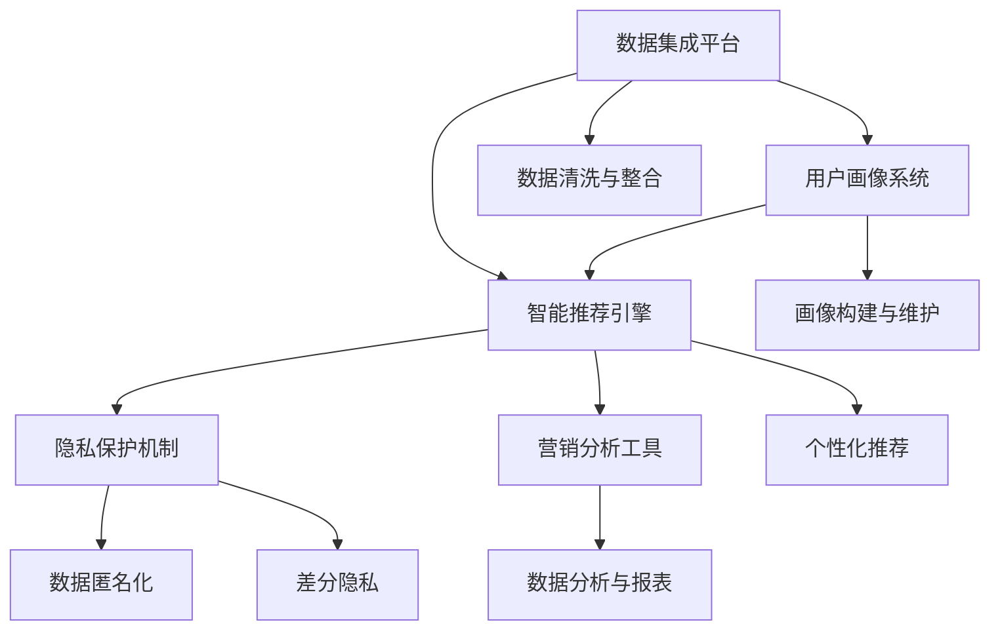

                 

# AI DMP 数据基建：数据驱动营销的新时代

> 关键词：AI DMP, 数据驱动营销, 数据基础设施, 用户画像, 智能广告投放, 个性化推荐

## 1. 背景介绍

### 1.1 问题由来

在数字化时代，数据已成为驱动营销增长的核心引擎。然而，传统的数据管理系统难以高效应对多渠道、多触点的数据整合与分析需求。如何构建一个高效、灵活、智能的数据管理平台，利用AI技术实现数据驱动的精准营销，成为营销界乃至整个互联网行业的痛点和挑战。

### 1.2 问题核心关键点

AI DMP（人工智能驱动的数据管理平台）的构建，需要关注以下核心问题：

- 数据质量：确保数据来源的准确性、完整性和一致性，是AI DMP有效运作的基础。
- 数据集成：如何将来自不同渠道和平台的数据无缝集成在一起，是AI DMP技术实施的关键。
- 用户画像：如何构建精细化的用户画像，了解用户行为和偏好，是AI DMP的目标之一。
- 智能推荐：如何利用AI技术，提供个性化的推荐和智能化的广告投放，最大化营销效果。
- 隐私保护：如何在数据收集、存储和处理过程中，保障用户隐私和数据安全，是AI DMP合法合规运营的前提。

### 1.3 问题研究意义

AI DMP的建设不仅能够帮助品牌实现数据驱动的精准营销，还能显著提高数据管理的效率，增强数据洞察力，从而提升用户体验和运营效率。具体而言：

1. **提升广告投放效果**：通过AI技术优化广告投放策略，最大化广告效果，减少浪费。
2. **增强用户参与度**：基于用户行为和偏好的深入洞察，提供个性化推荐，提升用户满意度和黏性。
3. **优化运营效率**：自动化的数据整合与分析，减少人工操作，提高营销活动的响应速度和灵活性。
4. **数据合规**：确保数据收集和使用符合法律法规要求，保护用户隐私。

## 2. 核心概念与联系

### 2.1 核心概念概述

AI DMP是一个集成了多种AI技术的综合性数据管理平台，其核心概念和组件包括：

- **数据集成平台**：负责从多个数据源采集数据，进行清洗、整合和存储。
- **用户画像系统**：基于用户行为和属性数据，构建精细化的用户画像，了解用户特征和偏好。
- **智能推荐引擎**：利用机器学习和深度学习技术，实现个性化推荐和智能广告投放。
- **隐私保护机制**：采用数据匿名化、差分隐私等技术，保障用户隐私和数据安全。
- **营销分析工具**：提供详细的营销数据分析和报表，帮助营销人员做出更科学的决策。

这些核心组件之间通过数据流和算法逻辑紧密关联，共同构成了AI DMP的运作框架。

### 2.2 核心概念原理和架构的 Mermaid 流程图



这个流程图展示了AI DMP各个核心组件之间的数据流动和功能关联。数据首先通过数据集成平台进行清洗和整合，然后通过用户画像系统构建用户画像，再进入智能推荐引擎进行个性化推荐。隐私保护机制在各个环节中提供安全保障，而营销分析工具则提供决策支持和运营监控。

## 3. 核心算法原理 & 具体操作步骤

### 3.1 算法原理概述

AI DMP的核心算法原理主要涉及数据清洗、用户画像构建、推荐算法和隐私保护四个方面。以下将详细介绍这些算法的原理和实施步骤。

### 3.2 算法步骤详解

#### 3.2.1 数据清洗与整合

1. **数据采集**：从网站、应用、社交媒体、传感器等不同渠道采集数据。
2. **数据清洗**：去除重复、错误、无效数据，进行格式转换和标准化处理。
3. **数据集成**：采用ETL工具（提取、转换、加载），将清洗后的数据整合到一个统一的存储系统中。

#### 3.2.2 用户画像构建

1. **特征提取**：从用户行为数据中提取特征，如点击率、停留时间、购物车行为等。
2. **特征工程**：对提取的特征进行筛选、组合和归一化，构建初步的用户画像。
3. **画像更新**：根据新数据实时更新用户画像，保持画像的时效性和准确性。

#### 3.2.3 个性化推荐算法

1. **推荐算法选择**：选择适合的推荐算法，如协同过滤、基于内容的推荐、深度学习推荐等。
2. **训练模型**：使用历史数据训练推荐模型，优化模型参数。
3. **实时推荐**：将新数据输入模型，实时计算并返回个性化推荐结果。

#### 3.2.4 隐私保护机制

1. **数据匿名化**：对敏感数据进行去标识化处理，确保数据不可还原到个人身份。
2. **差分隐私**：在数据查询和分析过程中加入噪声，保障数据隐私不被泄露。
3. **访问控制**：设置严格的权限管理机制，确保只有授权人员可以访问敏感数据。

### 3.3 算法优缺点

#### 3.3.1 数据清洗与整合

**优点**：
- 提高数据质量，减少数据偏差。
- 实现多源数据的整合，丰富数据维度。

**缺点**：
- 数据清洗工作量大，耗时较长。
- 清洗规则复杂，可能遗漏部分数据。

#### 3.3.2 用户画像构建

**优点**：
- 精细化的用户画像，提供深度洞察。
- 实时更新，保持数据的实时性。

**缺点**：
- 特征工程复杂，需要大量数据科学家参与。
- 用户画像可能存在偏差，需要持续优化。

#### 3.3.3 个性化推荐算法

**优点**：
- 提升用户参与度和转化率。
- 实时响应，满足用户即时需求。

**缺点**：
- 推荐算法复杂，需要大量计算资源。
- 冷启动问题，新用户缺乏足够数据。

#### 3.3.4 隐私保护机制

**优点**：
- 保障用户隐私和数据安全。
- 合法合规，避免法律风险。

**缺点**：
- 数据匿名化可能影响分析结果的准确性。
- 差分隐私可能增加计算复杂度。

### 3.4 算法应用领域

AI DMP的应用领域广泛，以下是几个典型应用场景：

1. **智能广告投放**：基于用户画像和行为数据，实现智能化的广告推荐和投放，提高广告ROI。
2. **个性化推荐系统**：为电商、视频、音乐等平台提供个性化推荐服务，提升用户体验和满意度。
3. **营销数据分析**：提供详细的营销数据分析和报表，帮助营销人员做出更科学的决策。
4. **客户关系管理**：通过用户画像和行为数据，构建客户关系管理系统，提升客户忠诚度和生命周期价值。
5. **内容分发与推荐**：为内容创作者提供精准的读者推荐，提升内容曝光率和影响力。

## 4. 数学模型和公式 & 详细讲解

### 4.1 数学模型构建

AI DMP的数学模型构建主要涉及数据清洗、用户画像构建、推荐算法和隐私保护四个方面。以下是每个部分的数学模型构建方法。

#### 4.1.1 数据清洗与整合

数据清洗与整合的核心在于数据的去噪和标准化处理。主要数学模型包括：

- 去重算法：基于哈希表或数据库去重，确保数据唯一性。
- 错误校正：通过规则或机器学习模型，自动识别和校正错误数据。
- 格式转换：将不同格式的数据转换为统一的格式，如将时间戳转换为日期格式。

#### 4.1.2 用户画像构建

用户画像构建的数学模型主要关注特征提取和组合。以下是主要数学模型：

- 特征提取：使用TF-IDF、LDA、PCA等算法提取文本、图像等数据的特征。
- 特征组合：采用矩阵乘法、深度神经网络等方法，将单一特征组合成高维特征向量。
- 归一化：使用标准化或最小-最大归一化方法，将特征值缩放到0-1范围内。

#### 4.1.3 个性化推荐算法

个性化推荐算法涉及多种数学模型，以下是主要推荐算法：

- 协同过滤：基于用户-物品共现矩阵，找到相似用户和物品，推荐相关物品。
- 基于内容的推荐：根据物品属性，找到与目标物品相似的物品进行推荐。
- 深度学习推荐：使用深度神经网络模型，学习用户和物品之间的隐式关联。

#### 4.1.4 隐私保护机制

隐私保护机制的核心在于数据匿名化和差分隐私。以下是主要数学模型：

- 数据匿名化：使用K匿名化、L多样性、T抑制等算法，去除个人标识信息。
- 差分隐私：在查询和分析过程中，加入噪声，保障数据隐私。

### 4.2 公式推导过程

#### 4.2.1 数据清洗与整合

假设原始数据集为 $D=\{(x_i, y_i)\}_{i=1}^N$，其中 $x_i$ 为数据记录，$y_i$ 为数据标签。数据清洗与整合的目标是将 $D$ 转换为干净的、标准化的数据集 $D'$。

**去重算法**：
使用哈希表存储数据，去除重复记录。
$$
D' = \{(x_i, y_i)\} \quad \text{去重}
$$

**错误校正**：
使用规则或机器学习模型，自动识别和校正错误数据。
$$
D' = \{(x'_i, y'_i)\} \quad \text{校正}
$$

**格式转换**：
将数据转换为统一格式。
$$
D' = \{(x'_i, y'_i)\} \quad \text{转换}
$$

#### 4.2.2 用户画像构建

假设用户行为数据为 $B=\{(b_{i,t})\}_{i=1}^N$，其中 $b_{i,t}$ 表示用户在第 $t$ 个时间段的行为记录。

**特征提取**：
使用TF-IDF算法提取文本数据中的关键词。
$$
f_i = \text{TF-IDF}(b_i)
$$

**特征组合**：
使用深度神经网络将多个特征组合成高维特征向量。
$$
h_i = \text{DNN}(f_i)
$$

**归一化**：
使用最小-最大归一化方法将特征值缩放到0-1范围内。
$$
z_i = \frac{h_i - \min(h)}{\max(h) - \min(h)}
$$

#### 4.2.3 个性化推荐算法

假设用户画像为 $U=\{(u_i)\}_{i=1}^N$，物品库为 $I=\{i_j\}_{j=1}^M$。

**协同过滤推荐**：
计算用户和物品的共现矩阵 $C_{ij}$，找到相似用户和物品。
$$
C_{ij} = \text{Cf}(u_i, i_j)
$$

**基于内容的推荐**：
计算物品属性 $p_j$ 和目标物品相似度 $s_{ij}$。
$$
s_{ij} = \text{Sim}(p_j, p_i)
$$

**深度学习推荐**：
使用深度神经网络模型 $N$，学习用户和物品之间的隐式关联。
$$
\hat{y}_{ij} = N(u_i, i_j)
$$

#### 4.2.4 隐私保护机制

假设原始数据集为 $D=\{(x_i, y_i)\}_{i=1}^N$，隐私保护目标是将 $D$ 转换为匿名化后的数据集 $D'$。

**数据匿名化**：
使用K匿名化算法，去除个人标识信息。
$$
D' = \text{KAn}(D)
$$

**差分隐私**：
在查询和分析过程中，加入噪声 $ε$。
$$
D'' = \text{DP}(D')
$$

### 4.3 案例分析与讲解

**案例分析**：某电商平台希望基于AI DMP实现个性化推荐系统。

1. **数据清洗与整合**：
   - 从电商网站、移动应用、社交媒体等多个渠道采集用户行为数据，进行去重、错误校正和格式转换。
   - 使用哈希表和规则引擎，去除重复和错误记录，确保数据唯一性和准确性。
   - 将处理后的数据存储到分布式数据库中，实现高效的数据查询和分析。

2. **用户画像构建**：
   - 从用户行为数据中提取特征，如浏览时间、点击次数、购物车行为等。
   - 使用LDA算法提取用户画像中的主题，结合用户属性数据（如年龄、性别、地理位置等），构建完整用户画像。
   - 使用PCA算法将高维特征向量降维，降低计算复杂度。

3. **个性化推荐算法**：
   - 选择基于协同过滤的推荐算法，计算用户和物品的共现矩阵。
   - 使用深度神经网络模型，学习用户和物品之间的隐式关联。
   - 实时计算并返回个性化推荐结果，动态更新用户画像。

4. **隐私保护机制**：
   - 对用户数据进行K匿名化和差分隐私处理，保障用户隐私和数据安全。
   - 设置严格的访问控制机制，确保只有授权人员可以访问敏感数据。

通过上述步骤，电商平台能够基于AI DMP实现高效、智能的个性化推荐系统，提升用户体验和运营效率。

## 5. 项目实践：代码实例和详细解释说明

### 5.1 开发环境搭建

为了构建AI DMP项目，需要搭建以下开发环境：

1. **Python环境**：安装Anaconda，创建虚拟环境。
   ```bash
   conda create -n ai-dmp python=3.8 
   conda activate ai-dmp
   ```

2. **依赖库安装**：
   ```bash
   pip install pandas numpy scikit-learn tensorflow pytorch transformers pyarrow dask
   ```

3. **数据工具安装**：
   ```bash
   pip install elasticsearch spark streaming pyspark
   ```

4. **分布式计算工具**：
   ```bash
   pip install dask distributed
   ```

5. **可视化工具**：
   ```bash
   pip install plotly jupyter notebook
   ```

### 5.2 源代码详细实现

以下是一个基于PyTorch实现个性化推荐系统的示例代码：

```python
import torch
import torch.nn as nn
import torch.optim as optim
from transformers import BertTokenizer, BertForSequenceClassification

# 定义模型
class BertForRecommendation(nn.Module):
    def __init__(self):
        super(BertForRecommendation, self).__init__()
        self.bert = BertForSequenceClassification.from_pretrained('bert-base-cased', num_labels=1)
        self.fc = nn.Linear(768, 1)

    def forward(self, input_ids, attention_mask):
        _, pooled_output = self.bert(input_ids, attention_mask=attention_mask)
        return self.fc(pooled_output)

# 定义优化器和损失函数
optimizer = optim.Adam(self.parameters(), lr=0.001)
loss_fn = nn.BCELoss()

# 定义训练函数
def train_epoch(model, train_dataset, batch_size):
    dataloader = torch.utils.data.DataLoader(train_dataset, batch_size=batch_size, shuffle=True)
    model.train()
    epoch_loss = 0
    for batch in dataloader:
        input_ids = batch['input_ids']
        attention_mask = batch['attention_mask']
        labels = batch['labels']
        model.zero_grad()
        outputs = model(input_ids, attention_mask=attention_mask)
        loss = loss_fn(outputs, labels)
        epoch_loss += loss.item()
        loss.backward()
        optimizer.step()
    return epoch_loss / len(dataloader)

# 加载数据集
train_dataset = ...
dev_dataset = ...
test_dataset = ...

# 模型训练和评估
epochs = 5
batch_size = 32
for epoch in range(epochs):
    loss = train_epoch(model, train_dataset, batch_size)
    print(f"Epoch {epoch+1}, train loss: {loss:.3f}")
    evaluate(model, dev_dataset, batch_size)
```

### 5.3 代码解读与分析

**代码解读**：

1. **模型定义**：定义了基于Bert的推荐模型，包括Bert嵌入层和全连接层。
2. **优化器和损失函数**：选择Adam优化器，BCE损失函数。
3. **训练函数**：在每个epoch上对数据集进行迭代训练，计算损失并更新模型参数。
4. **数据集加载**：定义训练集、验证集和测试集，并使用DataLoader加载数据。
5. **模型训练和评估**：在每个epoch后，在验证集上评估模型性能，并在测试集上进行最终测试。

**分析**：

- **模型选择**：选择Bert作为推荐模型的基础，利用其强大的语义理解能力，提升推荐效果。
- **优化器选择**：选择Adam优化器，具有较好的收敛性和稳定性。
- **损失函数选择**：选择BCE损失函数，适合二分类问题。
- **训练函数设计**：使用迭代训练的方式，每轮更新模型参数，并记录训练过程中的损失值。
- **数据集管理**：使用DataLoader对数据进行批次化处理，提高模型训练效率。
- **评估与测试**：通过在验证集和测试集上的评估，验证模型性能，并及时调整模型参数。

## 6. 实际应用场景

### 6.1 智能广告投放

AI DMP在智能广告投放中的应用，主要通过用户画像和行为数据分析，实现精准的目标用户定位和广告推荐。具体步骤如下：

1. **数据采集与整合**：从不同渠道采集用户行为数据，包括浏览记录、点击行为、购买记录等。
2. **用户画像构建**：利用AI技术构建精细化的用户画像，识别用户兴趣和行为模式。
3. **广告推荐**：根据用户画像和广告特征，推荐最匹配的广告位和广告内容。
4. **效果评估与优化**：实时监测广告投放效果，根据反馈数据调整广告投放策略。

### 6.2 个性化推荐系统

AI DMP在个性化推荐系统中的应用，主要通过用户画像和行为数据分析，实现精准的内容推荐。具体步骤如下：

1. **数据采集与整合**：从用户行为数据中提取特征，如浏览时间、点击次数、评分等。
2. **用户画像构建**：利用AI技术构建精细化的用户画像，识别用户兴趣和行为模式。
3. **推荐算法选择**：选择适合的推荐算法，如协同过滤、基于内容的推荐、深度学习推荐等。
4. **推荐实现与优化**：根据用户画像和推荐算法，实时计算并返回个性化推荐结果，动态更新用户画像。

### 6.3 营销数据分析

AI DMP在营销数据分析中的应用，主要通过数据清洗、整合和分析，帮助营销人员做出更科学的决策。具体步骤如下：

1. **数据清洗与整合**：从不同渠道采集数据，进行去重、错误校正和格式转换。
2. **数据存储与管理**：将处理后的数据存储到分布式数据库中，实现高效的数据查询和分析。
3. **数据分析与报表**：利用数据挖掘和机器学习技术，生成详细的营销分析报表。
4. **决策支持**：根据分析结果，制定更加科学的营销策略和预算分配。

### 6.4 未来应用展望

未来，AI DMP将进一步拓展其应用范围，推动数据驱动营销的深入发展。具体展望如下：

1. **跨领域数据融合**：将不同领域的用户数据和行为数据进行融合，实现跨领域的用户画像构建和推荐。
2. **实时数据处理**：利用流式数据处理技术，实现实时数据的采集、清洗和分析。
3. **多模态数据处理**：将文本、图像、音频等多模态数据进行综合处理，提升用户画像的全面性和准确性。
4. **智能化决策支持**：利用AI技术提供更加智能化的决策支持系统，帮助营销人员进行数据驱动的决策。
5. **隐私保护与合规**：在数据收集、存储和处理过程中，保障用户隐私和数据安全，符合法律法规要求。

## 7. 工具和资源推荐

### 7.1 学习资源推荐

1. **《Python数据分析》**：深入介绍Python在数据分析中的应用，包括数据清洗、整合和可视化。
2. **《深度学习入门》**：讲解深度学习的基础知识，包括神经网络、卷积神经网络、循环神经网络等。
3. **《推荐系统实战》**：详细讲解推荐系统的设计与实现，涵盖协同过滤、基于内容的推荐、深度学习推荐等。
4. **《人工智能伦理》**：探讨AI技术在数据隐私、偏见消除等方面的伦理问题。
5. **《数据科学与大平台》**：介绍分布式数据处理和存储技术，包括Hadoop、Spark等。

### 7.2 开发工具推荐

1. **PyTorch**：Python深度学习框架，支持动态计算图和静态计算图。
2. **TensorFlow**：Google开源的深度学习框架，支持多种硬件平台。
3. **Transformers**：基于TensorFlow和PyTorch的NLP库，提供了预训练语言模型的实现。
4. **Dask**：分布式计算库，支持大规模数据处理和计算。
5. **Apache Spark**：分布式数据处理框架，支持大规模数据处理和机器学习。

### 7.3 相关论文推荐

1. **《AI驱动的推荐系统：综述》**：总结了AI技术在推荐系统中的应用，包括协同过滤、深度学习推荐、强化学习推荐等。
2. **《数据清洗与数据挖掘》**：详细介绍数据清洗和数据挖掘的基础知识和技术方法。
3. **《差分隐私》**：介绍差分隐私的基本概念和应用，探讨如何在数据查询和分析过程中保障用户隐私。

## 8. 总结：未来发展趋势与挑战

### 8.1 研究成果总结

AI DMP作为数据驱动营销的重要技术，近年来在多个领域取得了显著成果。通过数据清洗、用户画像构建、个性化推荐和隐私保护等多方面的技术突破，AI DMP已经在智能广告投放、个性化推荐系统、营销数据分析等多个场景中展现了强大的应用能力。

### 8.2 未来发展趋势

未来，AI DMP将在以下几个方面进一步发展：

1. **跨领域数据融合**：将不同领域的用户数据和行为数据进行融合，实现跨领域的用户画像构建和推荐。
2. **实时数据处理**：利用流式数据处理技术，实现实时数据的采集、清洗和分析。
3. **多模态数据处理**：将文本、图像、音频等多模态数据进行综合处理，提升用户画像的全面性和准确性。
4. **智能化决策支持**：利用AI技术提供更加智能化的决策支持系统，帮助营销人员进行数据驱动的决策。
5. **隐私保护与合规**：在数据收集、存储和处理过程中，保障用户隐私和数据安全，符合法律法规要求。

### 8.3 面临的挑战

尽管AI DMP在数据驱动营销中展现了强大的潜力，但以下挑战仍需进一步解决：

1. **数据质量**：不同数据源的数据质量差异较大，需要统一数据标准和规范。
2. **计算资源**：大规模数据处理和深度学习推荐需要大量的计算资源，需要优化算法和硬件配置。
3. **隐私保护**：如何在数据处理过程中保障用户隐私，避免数据泄露和滥用。
4. **模型复杂性**：推荐模型复杂度较高，需要优化模型结构，提高计算效率。
5. **数据安全和合规**：在数据收集和处理过程中，需要遵守法律法规，保障数据安全和隐私。

### 8.4 研究展望

面对AI DMP发展过程中面临的挑战，未来的研究方向主要集中在以下几个方面：

1. **数据质量提升**：研究高效的数据清洗和整合方法，提升数据质量。
2. **模型优化**：开发高效、低复杂度的推荐算法，提高计算效率和模型精度。
3. **隐私保护技术**：研究差分隐私和数据匿名化技术，保障用户隐私。
4. **跨领域数据融合**：研究跨领域数据融合技术，提升用户画像的全面性和准确性。
5. **实时数据处理**：研究流式数据处理技术，实现实时数据的采集、清洗和分析。

通过持续的研究和探索，AI DMP有望在数据驱动营销中发挥更大作用，推动行业发展。

## 9. 附录：常见问题与解答

### 9.1 问题一：AI DMP如何保障用户隐私？

**回答**：AI DMP通过数据匿名化和差分隐私技术保障用户隐私。数据匿名化通过去除个人标识信息，将数据转换为不可逆的匿名数据。差分隐私通过在数据查询和分析过程中加入噪声，保障数据隐私不被泄露。

### 9.2 问题二：AI DMP的数据清洗与整合有哪些方法？

**回答**：AI DMP的数据清洗与整合主要包括以下方法：

- 去重算法：使用哈希表或数据库去重，确保数据唯一性。
- 错误校正：通过规则或机器学习模型，自动识别和校正错误数据。
- 格式转换：将数据转换为统一格式，如将时间戳转换为日期格式。

### 9.3 问题三：AI DMP的推荐算法有哪些？

**回答**：AI DMP的推荐算法主要包括以下几种：

- 协同过滤：基于用户-物品共现矩阵，找到相似用户和物品。
- 基于内容的推荐：根据物品属性，找到与目标物品相似的物品进行推荐。
- 深度学习推荐：使用深度神经网络模型，学习用户和物品之间的隐式关联。

### 9.4 问题四：AI DMP的应用场景有哪些？

**回答**：AI DMP的应用场景包括：

- 智能广告投放：基于用户画像和行为数据分析，实现精准的目标用户定位和广告推荐。
- 个性化推荐系统：通过用户画像和行为数据分析，实现精准的内容推荐。
- 营销数据分析：通过数据清洗、整合和分析，帮助营销人员做出更科学的决策。
- 客户关系管理：通过用户画像和行为数据分析，提升客户忠诚度和生命周期价值。
- 内容分发与推荐：为内容创作者提供精准的读者推荐，提升内容曝光率和影响力。

### 9.5 问题五：AI DMP如何实现跨领域数据融合？

**回答**：AI DMP实现跨领域数据融合主要通过以下步骤：

1. 统一数据标准和规范，确保不同领域数据的兼容性。
2. 使用数据集成工具，如ETL工具，将不同领域的数据进行整合。
3. 采用多模态数据处理技术，将文本、图像、音频等多模态数据进行综合处理，提升用户画像的全面性和准确性。

---

作者：禅与计算机程序设计艺术 / Zen and the Art of Computer Programming

