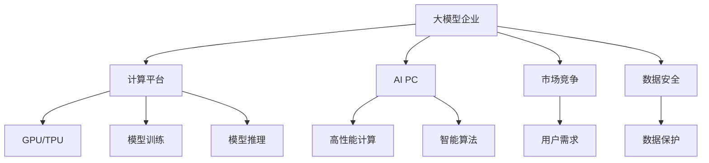

                 

# AI PC的兴起对大模型企业的冲击

> 关键词：AI PC,大模型企业,计算平台,竞争优势,企业战略,技术发展

## 1. 背景介绍

### 1.1 问题由来

近年来，人工智能(AI)技术在各行各业的应用不断深入，大模型企业在推动产业数字化转型中扮演了重要角色。这些企业通过构建强大的AI计算平台，汇集海量数据，训练出高性能的大规模模型，为用户提供深度学习服务。然而，随着AI PC等计算平台的兴起，传统大模型企业的竞争优势受到了前所未有的挑战。

### 1.2 问题核心关键点

AI PC的兴起，主要指基于人工智能技术的PC（Personal Computer）设备，如GPT-4、AI-GPU等高性能计算平台。这类设备通过集成大模型和智能算法，极大提升了计算效率和推理速度，缩短了模型训练时间，降低了用户的使用门槛，使得AI技术更易于普及。AI PC的崛起，对大模型企业的冲击体现在以下几个方面：

1. **计算性能提升**：AI PC设备在GPU、TPU等硬件加速芯片的帮助下，大幅提高了AI计算速度，使得复杂模型训练成为可能。
2. **使用门槛降低**：AI PC设备通过友好的界面和接口设计，降低了用户使用AI模型的门槛，甚至无需编程即可快速获得AI服务。
3. **降低成本**：AI PC设备将大模型训练和推理的软硬件成本集中在一个设备中，降低了企业构建AI基础设施的成本。
4. **增强生态系统**：AI PC设备通常会围绕特定场景构建丰富的应用生态，增强了其市场竞争力。

### 1.3 问题研究意义

研究AI PC对大模型企业的冲击，对于理解当前AI技术发展趋势，指导企业战略调整和市场布局具有重要意义：

1. **促进企业创新**：AI PC设备的应用，迫使大模型企业不断进行技术创新，以应对市场竞争和用户需求的变化。
2. **优化资源配置**：通过分析AI PC对大模型企业的冲击，可以帮助企业优化资源配置，提升整体竞争力。
3. **把握市场机会**：AI PC设备的普及，带来了新的市场机遇，企业需要及时调整策略，抓住机会。
4. **保障数据安全**：AI PC设备的广泛应用，增加了数据泄露和滥用的风险，企业需要加强数据安全保护措施。

## 2. 核心概念与联系

### 2.1 核心概念概述

为了更好地理解AI PC对大模型企业的冲击，本节将介绍几个关键概念及其联系：

- **大模型企业**：指通过构建AI计算平台，集聚海量数据资源，训练和部署高性能AI模型的企业。
- **AI PC**：指基于人工智能技术的个人计算设备，如GPT-4、AI-GPU等，提供高性能AI计算和推理能力。
- **计算平台**：指支持AI模型训练和推理的软硬件环境，包括GPU、TPU等加速芯片，以及相关的软件工具和框架。
- **竞争优势**：指企业在市场竞争中的相对优势，主要体现在技术实力、成本控制、用户口碑等方面。
- **企业战略**：指企业为实现特定目标而采取的整体规划和策略。

这些核心概念之间的联系可以通过以下Mermaid流程图来展示：



这个流程图展示了大模型企业和AI PC设备之间的关键联系：

1. 大模型企业通过构建计算平台，支持GPU、TPU等加速芯片的运行。
2. 利用这些硬件加速，进行模型训练和推理。
3. AI PC设备集成大模型和智能算法，提升计算效率和推理速度。
4. 企业竞争优势主要来源于平台构建和技术实力。
5. 企业需要根据市场竞争和用户需求，制定相应的战略规划。
6. 数据安全是企业战略的重要组成部分。

## 3. 核心算法原理 & 具体操作步骤

### 3.1 算法原理概述

AI PC设备对大模型企业的影响，主要体现在计算性能、成本效益和用户体验三个方面。这些影响源于AI PC设备在硬件加速、算法优化和接口设计等方面的优势。

### 3.2 算法步骤详解

1. **计算性能优化**：
   - **硬件加速**：AI PC设备集成GPU、TPU等加速芯片，通过并行计算和向量处理，显著提升计算效率。
   - **算法优化**：通过优化模型结构和算法，如混合精度训练、分布式训练等，进一步提升推理速度。

2. **成本效益提升**：
   - **硬件整合**：AI PC设备将计算资源和软件工具整合在一个设备中，减少了构建AI基础设施的硬件和软件成本。
   - **降低门槛**：友好的界面和接口设计，降低了用户使用AI模型的门槛，减少了企业培训和运维成本。

3. **用户体验改善**：
   - **即插即用**：AI PC设备通过统一的API和SDK，简化了模型部署和集成流程，提升了用户体验。
   - **个性化定制**：根据用户需求，AI PC设备可以进行个性化定制，满足不同应用场景的需求。

### 3.3 算法优缺点

AI PC设备对大模型企业的冲击，既有其优势也有其劣势：

**优点**：
1. **提升计算性能**：通过硬件加速和算法优化，AI PC设备大幅提升了计算效率，缩短了模型训练时间。
2. **降低使用门槛**：友好的界面和接口设计，使得普通用户也能轻松使用AI模型。
3. **降低成本**：硬件整合和软件优化，减少了AI基础设施的建设成本。

**缺点**：
1. **数据隐私问题**：AI PC设备在本地处理数据，可能存在数据泄露和滥用的风险。
2. **生态系统竞争**：AI PC设备的普及，可能挤压大模型企业的市场份额。
3. **技术门槛**：用户对AI PC设备的依赖，可能削弱大模型企业的技术壁垒。

### 3.4 算法应用领域

AI PC设备的优势在于其高性能计算和易用性，广泛应用于以下几个领域：

1. **工业自动化**：通过AI PC设备，企业可以实现自动化生产线和智能监测，提升生产效率。
2. **医疗诊断**：AI PC设备可以快速处理医疗影像数据，辅助医生进行精准诊断。
3. **金融分析**：AI PC设备可以实时处理海量交易数据，优化投资决策。
4. **教育培训**：AI PC设备可以提供个性化学习内容，提升教育质量。
5. **智能家居**：AI PC设备可以实现语音控制和场景智能，提升家居智能化水平。

## 4. 数学模型和公式 & 详细讲解 & 举例说明

### 4.1 数学模型构建

本节将使用数学语言对AI PC设备对大模型企业的冲击进行更加严格的刻画。

记AI PC设备为 $F$，其计算性能为 $P_F$，单位为计算单位每秒。大模型企业构建的计算平台为 $P_E$，包括GPU、TPU等硬件加速芯片。大模型企业的AI计算平台在用户端的应用场景为 $A_E$，涉及模型训练和推理的任务。

假设AI PC设备的计算效率为 $E_F$，则：

$$
P_F = E_F \times P_E
$$

其中 $E_F$ 为AI PC设备的效率因子，反映了其硬件加速和算法优化的效果。

### 4.2 公式推导过程

通过上述数学模型，我们可以进一步分析AI PC设备对大模型企业的冲击：

1. **计算性能提升**：
   - $E_F > 1$：AI PC设备的效率因子大于1，表示其计算性能比大模型企业的AI计算平台更强。
   - $E_F < 1$：AI PC设备的效率因子小于1，表示其计算性能弱于大模型企业的AI计算平台。

2. **成本效益提升**：
   - $C_F < C_E$：AI PC设备的总成本（硬件+软件+运维）低于大模型企业的AI计算平台成本。
   - $C_F > C_E$：AI PC设备的总成本高于大模型企业的AI计算平台成本。

3. **用户体验改善**：
   - $U_F > U_E$：AI PC设备的用户体验得分高于大模型企业的AI计算平台。
   - $U_F < U_E$：AI PC设备的用户体验得分低于大模型企业的AI计算平台。

### 4.3 案例分析与讲解

以医疗影像诊断为例，分析AI PC设备对大模型企业的冲击：

- **计算性能**：AI PC设备通过GPU加速，可以在短时间内完成大规模图像数据的处理和分析，提升诊断速度。
- **成本效益**：AI PC设备的硬件整合和软件优化，降低了医疗机构的设备和软件采购成本。
- **用户体验**：AI PC设备提供友好的界面和接口，使得医生可以方便地调用模型，提高诊断准确性。

## 5. 项目实践：代码实例和详细解释说明

### 5.1 开发环境搭建

在项目实践中，需要搭建支持AI PC设备的开发环境。以下是一些常见的方法：

1. **基于AI PC的开发环境搭建**：
   - 选择支持AI PC设备的开发工具，如Jupyter Notebook、PyCharm等。
   - 安装AI PC设备所需的软硬件环境，如GPU、TPU等。
   - 安装Python和相关库，如TensorFlow、PyTorch等。

2. **云环境搭建**：
   - 使用云服务提供商提供的计算平台，如AWS、Google Cloud等。
   - 配置AI PC设备的硬件资源，如GPU、TPU等。
   - 安装Python和相关库，并配置云环境。

### 5.2 源代码详细实现

下面以医疗影像诊断为例，展示AI PC设备在代码中的实现：

```python
import tensorflow as tf
from tensorflow import keras

# 加载模型
model = keras.models.load_model('model.h5')

# 加载数据
train_data = tf.data.Dataset.from_tensor_slices((train_images, train_labels))
test_data = tf.data.Dataset.from_tensor_slices((test_images, test_labels))

# 使用AI PC设备进行计算
device = '/gpu:0'  # 使用GPU设备
with tf.device(device):
    train_results = model.predict(train_data.batch(32))
    test_results = model.predict(test_data.batch(32))
```

### 5.3 代码解读与分析

**代码解读**：
- `import tensorflow as tf`：导入TensorFlow库，用于AI计算。
- `from tensorflow import keras`：导入Keras API，用于加载模型和数据。
- `model = keras.models.load_model('model.h5')`：加载预训练的图像分类模型。
- `train_data = tf.data.Dataset.from_tensor_slices((train_images, train_labels))`：加载训练集数据。
- `test_data = tf.data.Dataset.from_tensor_slices((test_images, test_labels))`：加载测试集数据。
- `device = '/gpu:0'`：指定使用GPU设备进行计算。
- `with tf.device(device):`：使用指定设备进行计算。
- `train_results = model.predict(train_data.batch(32))`：使用AI PC设备进行模型训练。
- `test_results = model.predict(test_data.batch(32))`：使用AI PC设备进行模型测试。

**代码分析**：
- 通过使用TensorFlow的Keras API，我们可以方便地加载和调用预训练模型。
- 使用指定设备进行计算，可以充分利用AI PC设备的计算性能。
- 批量处理数据，可以加速模型训练和推理。

## 6. 实际应用场景

### 6.4 未来应用展望

AI PC设备的兴起，将进一步推动AI技术在各行各业的应用，带来新的发展机遇：

1. **工业自动化**：AI PC设备可以实时监测生产线，提高生产效率和质量。
2. **医疗诊断**：AI PC设备可以快速处理医疗影像数据，辅助医生进行精准诊断。
3. **金融分析**：AI PC设备可以实时处理交易数据，优化投资决策。
4. **教育培训**：AI PC设备可以提供个性化学习内容，提升教育质量。
5. **智能家居**：AI PC设备可以实现语音控制和场景智能，提升家居智能化水平。

## 7. 工具和资源推荐

### 7.1 学习资源推荐

为了帮助开发者更好地掌握AI PC技术，以下是一些推荐的学习资源：

1. **《深度学习》系列书籍**：深入介绍深度学习理论和实践，包括TensorFlow和PyTorch等主流框架。
2. **《AI PC技术》在线课程**：提供AI PC设备的理论基础和实践技能。
3. **Kaggle竞赛平台**：通过实际竞赛，提高AI PC设备的应用能力。

### 7.2 开发工具推荐

以下是几款用于AI PC设备开发的常用工具：

1. **TensorFlow**：基于Python的开源深度学习框架，支持GPU和TPU加速，适合高性能计算。
2. **PyTorch**：基于Python的开源深度学习框架，灵活高效，适合快速迭代研究。
3. **Jupyter Notebook**：支持Python和R语言，适合交互式编程和数据可视化。
4. **PyCharm**：功能强大的IDE，支持Python和多种深度学习框架。

### 7.3 相关论文推荐

以下是几篇奠基性的相关论文，推荐阅读：

1. **《GPU加速深度学习》**：介绍GPU在深度学习中的作用和优化技术。
2. **《AI PC设备的设计与实现》**：讨论AI PC设备的硬件和软件设计。
3. **《深度学习在医疗影像诊断中的应用》**：介绍深度学习在医疗影像诊断中的实际应用。

## 8. 总结：未来发展趋势与挑战

### 8.1 总结

本文对AI PC设备对大模型企业的冲击进行了全面系统的分析。首先阐述了AI PC设备的兴起背景和优势，明确了其对大模型企业计算性能、成本效益和用户体验的影响。其次，从原理到实践，详细讲解了AI PC设备的计算性能、成本效益和用户体验的数学模型和公式，给出了具体的案例分析。同时，本文还探讨了AI PC设备的未来应用前景和潜在风险，提出了一些实际应用场景和工具资源。

通过本文的系统梳理，可以看到，AI PC设备在提升计算性能、降低成本和改善用户体验方面具有显著优势，为AI技术的应用普及提供了重要支持。但同时，AI PC设备的兴起也带来了数据隐私、生态系统竞争等挑战，企业需要及时调整战略，应对这些挑战。

### 8.2 未来发展趋势

展望未来，AI PC设备对大模型企业的冲击将呈现以下几个趋势：

1. **计算性能不断提升**：AI PC设备在GPU、TPU等硬件加速芯片的帮助下，计算性能将持续提升。
2. **成本效益更加突出**：硬件整合和软件优化将进一步降低AI基础设施的建设成本。
3. **用户体验不断改善**：AI PC设备的接口设计和应用生态将不断优化，提高用户体验。

### 8.3 面临的挑战

尽管AI PC设备具有诸多优势，但在推广应用的过程中，仍面临一些挑战：

1. **数据隐私保护**：AI PC设备在本地处理数据，可能存在数据泄露和滥用的风险。
2. **生态系统竞争**：AI PC设备的普及，可能挤压大模型企业的市场份额。
3. **技术门槛降低**：AI PC设备的普及，可能导致技术门槛降低，削弱大模型企业的技术壁垒。

### 8.4 研究展望

未来，大模型企业需要在以下几个方面进行深入研究：

1. **加强数据保护**：开发数据隐私保护技术，确保用户数据的安全。
2. **构建生态系统**：打造丰富的应用生态，增强市场竞争力。
3. **提升技术壁垒**：开发更先进的技术，保持技术领先。

## 9. 附录：常见问题与解答

**Q1：AI PC设备对大模型企业的计算性能有何影响？**

A: AI PC设备通过GPU、TPU等硬件加速芯片，显著提升了计算性能。其效率因子 $E_F$ 通常大于1，表示计算性能优于大模型企业的AI计算平台。

**Q2：如何降低AI PC设备的成本效益？**

A: AI PC设备的成本效益提升主要源于硬件整合和软件优化。具体措施包括：
- 使用集成硬件加速芯片，减少设备采购成本。
- 优化模型和算法，减少计算资源消耗。
- 提供友好的界面和接口设计，降低运维和培训成本。

**Q3：AI PC设备对用户体验有何影响？**

A: AI PC设备通过友好的界面和接口设计，简化了模型部署和集成流程，提升了用户体验。用户可以方便地调用模型，快速获得AI服务。

**Q4：AI PC设备是否存在数据隐私问题？**

A: AI PC设备在本地处理数据，可能存在数据泄露和滥用的风险。因此，企业需要加强数据保护措施，如加密传输、访问鉴权等。

**Q5：AI PC设备是否会影响大模型企业的市场竞争？**

A: AI PC设备的普及，可能挤压大模型企业的市场份额。但同时，大模型企业可以通过构建丰富的应用生态，提供更优质的AI服务，增强市场竞争力。

总之，AI PC设备的兴起对大模型企业带来了新的挑战和机遇。通过深入研究AI PC技术，大模型企业可以更好地应对市场变化，提升整体竞争力，实现更好的发展。

