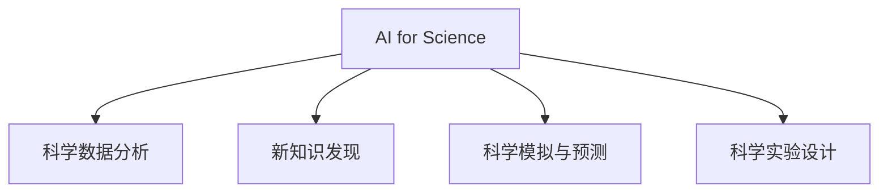

                 

# AI for Science的综合视角

## 1. 背景介绍

### 1.1 问题由来

人工智能（AI）技术在科学研究中的应用日益广泛，AI for Science已成为推动科学发现的重要工具。从生物医学到天文学，从物理化学到社会科学，AI技术正在全方位、多角度地革新传统科研模式。然而，AI在科学中的应用仍面临诸多挑战，如何有效结合科研需求与AI技术，成为学界和业界共同关注的焦点。

### 1.2 问题核心关键点

本文聚焦于AI for Science的核心问题，包括AI在科学数据分析、新知识发现、科学模拟与预测、科学实验设计等领域的应用，探讨其在推动科学研究和技术进步中的潜力与挑战。

## 2. 核心概念与联系

### 2.1 核心概念概述

为更好地理解AI在科学研究中的应用，本节将介绍几个关键概念：

- AI for Science：人工智能在科学研究中的应用，旨在通过AI技术优化科研过程，加速科学发现和创新。

- 科学数据分析：利用AI技术对科学实验数据和观测数据进行高效分析和可视化，挖掘数据中隐藏的科学模式和规律。

- 新知识发现：通过机器学习、深度学习等技术，发现传统方法难以触及的科学新现象和规律。

- 科学模拟与预测：使用AI技术构建科学模型，进行高性能科学模拟和未来预测，辅助科学家进行科学假设的验证和探索。

- 科学实验设计：基于AI技术对科学实验进行优化设计，如自动设计实验流程、优化实验参数、预测实验结果等。

这些概念之间的关系可以通过以下Mermaid流程图来展示：



这个流程图展示了一个AI for Science的宏观框架，各个概念之间相互支撑，共同推动科学研究的进步。

## 3. 核心算法原理 & 具体操作步骤
### 3.1 算法原理概述

AI for Science的核心算法原理主要集中在以下几个方面：

- 数据驱动的模型构建：利用大数据分析技术，从观测数据中提取知识，构建科学模型。

- 特征工程与特征选择：通过AI技术识别和提取关键特征，优化模型性能。

- 机器学习与深度学习：应用机器学习与深度学习算法，进行模式识别、聚类分析、异常检测等。

- 强化学习：通过模拟和实验，优化科学实验设计，预测实验结果。

### 3.2 算法步骤详解

基于AI for Science的核心算法原理，我们接下来详细讲解具体的步骤：

1. **数据收集与预处理**：
   - 收集科学数据，并进行清洗、标准化、归一化等预处理操作，为后续分析提供高质量数据。
   - 利用数据可视化技术，对数据进行初步探索，确定分析方向和关键变量。

2. **特征工程与特征选择**：
   - 利用统计学、机器学习等方法，对数据进行特征提取和选择，识别对问题有重要影响的特征。
   - 通过特征降维、特征组合等方法，优化模型输入，提高模型泛化能力。

3. **模型构建与训练**：
   - 选择合适的模型框架，如回归模型、分类模型、聚类模型等，并根据任务需求进行模型构建。
   - 使用机器学习与深度学习算法，训练模型参数，优化模型性能。

4. **模型评估与验证**：
   - 使用交叉验证等方法，评估模型在训练集和测试集上的表现，确保模型具有较高的泛化能力。
   - 对模型进行敏感性分析，确定模型中关键参数对预测结果的影响。

5. **结果解释与解释性**：
   - 应用特征重要性分析、部分依赖图等方法，解释模型的预测结果，揭示模型背后的科学机理。
   - 将模型结果转化为可视化图表，辅助科学家理解科学现象和规律。

6. **应用与优化**：
   - 将模型应用于科学研究中，验证模型的预测能力。
   - 根据实际应用情况，对模型进行优化和调整，提高模型的实用性和可靠性。

### 3.3 算法优缺点

AI for Science的算法具有以下优点：

- 数据驱动：能够处理大规模数据，提取知识，辅助科学决策。
- 高泛化能力：适用于多领域、多学科的科学研究，具备良好的应用前景。
- 快速迭代：算法模型训练时间较短，可以快速迭代优化，加速科研进程。
- 自动化：自动化数据处理、模型训练和结果解释，减轻科学家负担。

然而，该方法也存在一些缺点：

- 数据质量要求高：数据预处理和特征工程需要高质量的数据，对数据的收集和处理提出了较高要求。
- 模型复杂度高：深度学习等模型复杂度高，训练和优化过程中需要大量计算资源。
- 结果解释性不足：某些模型（如黑箱模型）难以解释其决策过程，缺乏可解释性。
- 适用范围有限：对某些特定领域的科学问题，传统的分析方法可能更有效。

### 3.4 算法应用领域

AI for Science在多个领域已经展现出其强大的应用潜力，包括但不限于：

- 生物医学：基因组学、药物研发、疾病预测与诊断等。
- 天文学：天体物理学、星体运动预测、宇宙观测等。
- 物理化学：化学反应模拟、材料科学、纳米技术等。
- 社会科学：经济预测、社会网络分析、公共卫生等。

这些领域内的AI应用，不仅推动了科学研究的进步，也显著提升了研究效率和质量。

## 4. 数学模型和公式 & 详细讲解 & 举例说明

### 4.1 数学模型构建

基于AI for Science的算法原理，我们可以建立一系列的数学模型，用于科学数据分析和知识发现。以下以机器学习中的回归模型为例：

设训练数据集为 $\{(x_i, y_i)\}_{i=1}^N$，其中 $x_i \in \mathbb{R}^d$ 为输入向量，$y_i$ 为输出向量。回归模型的目标是最小化预测值 $\hat{y}_i = \mathbf{w} \cdot x_i + b$ 与真实值 $y_i$ 之间的误差。常见回归模型包括线性回归、多项式回归、核回归等。

### 4.2 公式推导过程

以线性回归为例，回归模型的损失函数定义为：

$$
L(\mathbf{w}, b) = \frac{1}{2N} \sum_{i=1}^N (y_i - \mathbf{w} \cdot x_i - b)^2
$$

模型的最小化目标为：

$$
\min_{\mathbf{w}, b} L(\mathbf{w}, b)
$$

利用梯度下降等优化算法，对 $\mathbf{w}$ 和 $b$ 进行迭代更新，直到收敛：

$$
\mathbf{w} \leftarrow \mathbf{w} - \eta \frac{1}{N} \sum_{i=1}^N (y_i - \mathbf{w} \cdot x_i - b)x_i
$$

$$
b \leftarrow b - \eta \frac{1}{N} \sum_{i=1}^N (y_i - \mathbf{w} \cdot x_i - b)
$$

其中 $\eta$ 为学习率，$x_i$ 为输入向量。

### 4.3 案例分析与讲解

以天文学中的星体运动预测为例，利用机器学习算法，我们可以基于天文观测数据，构建模型预测星体未来的运动轨迹。该问题可转化为时间序列预测问题，利用时间序列回归模型进行建模。具体步骤如下：

1. **数据准备**：收集星体位置、速度、加速度等观测数据，构建时间序列。
2. **特征工程**：将观测数据进行标准化处理，提取时间、位置、速度等特征，进行特征组合。
3. **模型训练**：使用线性回归、神经网络等模型，训练预测模型。
4. **结果验证**：在验证集上评估模型预测效果，进行模型调优。
5. **结果应用**：将模型应用于新观测数据，预测星体未来运动轨迹。

## 5. 项目实践：代码实例和详细解释说明

### 5.1 开发环境搭建

在进行AI for Science的实践前，我们需要准备好开发环境。以下是使用Python进行PyTorch开发的环境配置流程：

1. 安装Anaconda：从官网下载并安装Anaconda，用于创建独立的Python环境。

2. 创建并激活虚拟环境：
```bash
conda create -n pytorch-env python=3.8 
conda activate pytorch-env
```

3. 安装PyTorch：根据CUDA版本，从官网获取对应的安装命令。例如：
```bash
conda install pytorch torchvision torchaudio cudatoolkit=11.1 -c pytorch -c conda-forge
```

4. 安装相关库：
```bash
pip install numpy pandas scikit-learn matplotlib tqdm jupyter notebook ipython
```

完成上述步骤后，即可在`pytorch-env`环境中开始实践。

### 5.2 源代码详细实现

这里我们以机器学习模型训练为例，给出使用PyTorch进行回归模型训练的完整代码实现。

首先，定义训练数据集：

```python
import numpy as np
from sklearn.model_selection import train_test_split

# 生成模拟数据
x = np.linspace(0, 10, 100)
y = 2*x + np.random.normal(0, 1, 100)
X, y = np.array(x).reshape(-1, 1), np.array(y)

# 划分训练集和测试集
X_train, X_test, y_train, y_test = train_test_split(X, y, test_size=0.2, random_state=42)
```

然后，定义回归模型：

```python
from torch import nn, optim
import torch.nn.functional as F

# 定义模型
class LinearRegression(nn.Module):
    def __init__(self, input_dim):
        super(LinearRegression, self).__init__()
        self.linear = nn.Linear(input_dim, 1)

    def forward(self, x):
        return self.linear(x)

# 初始化模型
model = LinearRegression(input_dim=1)
```

接着，定义损失函数和优化器：

```python
# 定义损失函数
criterion = nn.MSELoss()

# 定义优化器
optimizer = optim.SGD(model.parameters(), lr=0.01)
```

最后，训练模型并在测试集上评估：

```python
epochs = 1000

for epoch in range(epochs):
    # 前向传播
    y_pred = model(X_train)
    # 计算损失
    loss = criterion(y_pred, y_train)

    # 反向传播
    optimizer.zero_grad()
    loss.backward()
    optimizer.step()

    if epoch % 100 == 0:
        print(f"Epoch {epoch+1}, loss: {loss:.4f}")
        
# 在测试集上评估
with torch.no_grad():
    y_pred = model(X_test)
    print(f"Test MSE: {criterion(y_pred, y_test):.4f}")
```

以上就是使用PyTorch进行回归模型训练的完整代码实现。可以看到，通过简单的代码，即可构建、训练并评估回归模型，验证AI for Science在科学数据分析中的应用。

### 5.3 代码解读与分析

让我们再详细解读一下关键代码的实现细节：

**数据生成**：
- 使用NumPy生成一个包含100个样本的时间序列数据，每个样本由一个时间 $x_i$ 和一个对应的输出 $y_i$ 组成。

**模型定义**：
- 定义一个线性回归模型，包含一个线性变换层。
- 模型在训练时，输入一个时间 $x_i$，输出一个预测值 $\hat{y}_i = \mathbf{w} \cdot x_i + b$。

**损失函数和优化器**：
- 使用均方误差损失函数，计算模型预测值与真实值之间的误差。
- 使用随机梯度下降（SGD）优化器，更新模型参数。

**训练与评估**：
- 在每个epoch中，进行前向传播计算预测值，计算损失函数值。
- 反向传播更新模型参数，并通过梯度下降迭代优化模型。
- 在每个epoch结束时，输出损失值，并在测试集上评估模型性能。

以上代码展示了AI for Science在科学数据分析中的基本流程，通过简单的线性回归模型，即可实现对科学数据的分析与预测。

## 6. 实际应用场景

### 6.1 生物医学

AI for Science在生物医学领域的应用广泛而深远。例如，利用机器学习算法，可以从基因组学数据中发现与疾病相关的基因，辅助疾病诊断和预测。此外，AI技术还可以用于药物设计、蛋白质结构预测等关键问题，推动生命科学的快速发展。

### 6.2 天文学

天文学是大数据和高性能计算的典型应用场景，AI for Science在该领域展现出巨大的潜力。通过构建天体运动模型，AI可以预测星体轨迹，辅助天文学家进行观测和研究。此外，利用深度学习算法，AI还可以从天文图像中提取特征，识别星系、黑洞等天体，推动天文学的探索进程。

### 6.3 物理学

在物理学领域，AI for Science的应用同样具有重要意义。例如，利用机器学习算法，可以从实验数据中提取物理规律，预测新物理现象。此外，AI还可以用于材料科学，通过模拟材料结构，预测材料的物理性质和化学性质，加速新材料的发现和应用。

### 6.4 未来应用展望

随着AI for Science的不断发展，其应用前景将更加广阔。未来，AI for Science将与其他前沿技术深度融合，如量子计算、纳米技术、生物工程等，推动科学研究的进一步突破。以下是一些未来应用趋势：

- **量子计算与AI的结合**：利用AI技术优化量子计算算法，提高量子计算的效率和准确性。
- **AI在纳米技术中的应用**：利用AI技术设计新材料、优化纳米结构，加速纳米技术的发展。
- **AI在生物工程中的应用**：利用AI技术优化基因编辑和蛋白质工程，推动生物工程的进步。

AI for Science将在更多领域展现出其独特优势，为科学研究和技术创新提供强大的支持。

## 7. 工具和资源推荐

### 7.1 学习资源推荐

为了帮助开发者系统掌握AI for Science的理论基础和实践技巧，这里推荐一些优质的学习资源：

1. **《Deep Learning for Physical Scientists》**：由MIT出版社出版的深度学习教材，涵盖了深度学习在物理、化学、生物等领域的应用。

2. **Coursera的《Machine Learning for Scientists》课程**：由斯坦福大学开设，介绍了机器学习在科学研究中的应用。

3. **Kaggle数据科学竞赛平台**：提供大量科学数据分析和预测的竞赛项目，是实践AI for Science的好平台。

4. **Nature Machine Intelligence**：自然语言界的顶级期刊，定期发布AI for Science的最新研究成果。

通过学习这些资源，相信你一定能够快速掌握AI for Science的核心方法和应用场景。

### 7.2 开发工具推荐

高效的开发离不开优秀的工具支持。以下是几款用于AI for Science开发的常用工具：

1. **PyTorch**：基于Python的开源深度学习框架，灵活动态的计算图，适合快速迭代研究。

2. **TensorFlow**：由Google主导开发的开源深度学习框架，生产部署方便，适合大规模工程应用。

3. **Jupyter Notebook**：交互式的Python开发环境，便于实验和分享学习笔记。

4. **Weights & Biases**：模型训练的实验跟踪工具，可以记录和可视化模型训练过程中的各项指标。

5. **TensorBoard**：TensorFlow配套的可视化工具，可实时监测模型训练状态，并提供丰富的图表呈现方式。

6. **Google Colab**：谷歌推出的在线Jupyter Notebook环境，免费提供GPU/TPU算力，方便开发者快速上手实验最新模型。

合理利用这些工具，可以显著提升AI for Science的开发效率，加快创新迭代的步伐。

### 7.3 相关论文推荐

AI for Science的发展源于学界的持续研究。以下是几篇奠基性的相关论文，推荐阅读：

1. **《Deep Learning for Self-Driving Cars》**：深度学习在自动驾驶中的经典应用案例，展示了AI技术在实际场景中的强大能力。

2. **《Graph Neural Networks: A Review of Methods and Applications》**：介绍图神经网络在科学数据分析中的应用，为科学研究的特征工程提供新思路。

3. **《Scalable Deep Learning: A Tutorial》**：从机器学习到深度学习的演变过程，介绍大规模数据和计算资源下的AI for Science实践。

4. **《Machine Learning Yearning》**：深度学习专家Andrew Ng的实践指南，涵盖机器学习在科学研究中的应用。

通过学习这些前沿成果，可以帮助研究者把握学科前进方向，激发更多的创新灵感。

## 8. 总结：未来发展趋势与挑战

### 8.1 研究成果总结

本文对AI for Science的核心算法原理和操作步骤进行了全面系统的介绍，重点讨论了其在科学数据分析、新知识发现、科学模拟与预测、科学实验设计等领域的应用。通过系统梳理AI for Science的理论基础和实践方法，本文希望为研究人员提供全面的技术指引。

### 8.2 未来发展趋势

展望未来，AI for Science将呈现以下几个发展趋势：

1. **数据驱动的科学发现**：随着大数据技术的不断进步，科学研究的各个环节都将变得更加数据驱动，AI for Science将扮演更加重要的角色。

2. **多学科交叉融合**：AI for Science将与其他前沿技术深度融合，如量子计算、纳米技术、生物工程等，推动科学研究的进一步突破。

3. **科学模拟与预测的提升**：AI for Science在科学模拟与预测中的应用将更加广泛，预测精度和模型复杂度将不断提升。

4. **科学实验设计的优化**：AI技术将广泛应用于科学实验设计，自动优化实验流程，提高实验效率和结果可靠性。

### 8.3 面临的挑战

尽管AI for Science在多个领域展示了巨大的应用潜力，但在推进科学研究和技术进步的过程中，仍面临诸多挑战：

1. **数据质量问题**：高质量科学数据的获取和处理仍是一个重要挑战，数据的噪声和偏差可能会影响AI模型的效果。

2. **模型可解释性**：许多AI模型（如深度学习模型）缺乏可解释性，难以解释其内部工作机制和决策逻辑，影响科学研究的可信度。

3. **计算资源需求**：AI for Science通常需要大量的计算资源，高性能计算设备和算法优化仍是挑战。

4. **模型泛化能力**：AI模型在科学数据上的泛化能力仍然需要进一步提升，避免模型过拟合训练数据。

5. **跨学科沟通**：不同学科的科学家对AI的理解和接受程度不同，跨学科沟通和合作仍是一个重要挑战。

### 8.4 研究展望

面对AI for Science面临的挑战，未来的研究需要在以下几个方面寻求新的突破：

1. **数据质量提升**：探索更多高质量科学数据的获取和处理技术，减少数据噪声和偏差。

2. **模型可解释性增强**：开发更多可解释性强的AI模型，增强科学研究的可信度和可靠性。

3. **计算资源优化**：探索更高效的数据处理和模型训练方法，提高计算资源的利用率。

4. **跨学科合作**：加强不同学科之间的沟通和合作，推动AI for Science的广泛应用。

5. **模型泛化能力提升**：探索更有效的泛化方法，增强AI模型在科学数据上的泛化能力。

通过这些研究的突破，AI for Science必将在科学研究和技术创新中发挥更大的作用，为人类认知智能的进步贡献力量。

## 9. 附录：常见问题与解答

**Q1：AI for Science适用于所有科学研究领域吗？**

A: AI for Science适用于绝大多数科学研究领域，但某些特定领域（如数学、哲学等）可能并不适合直接应用AI技术。需要根据具体科学问题选择合适的AI应用方法。

**Q2：如何选择合适的AI模型？**

A: 选择AI模型需要考虑多个因素，如数据类型、问题类型、计算资源等。对于结构化数据，传统机器学习模型（如线性回归、决策树等）可能更合适。对于非结构化数据，深度学习模型（如卷积神经网络、循环神经网络等）可能更有效。

**Q3：AI for Science在科学研究中的优势是什么？**

A: AI for Science的优势在于其强大的数据处理能力、高效的模型训练和预测、灵活的模型优化方法等。通过AI技术，科学家可以更高效地处理大数据，发现新规律，优化实验设计，提高研究效率。

**Q4：AI for Science在科学实验设计中的应用前景如何？**

A: AI for Science在科学实验设计中的应用前景非常广阔。通过AI技术，科学家可以自动优化实验流程、参数设计，提高实验效率和结果可靠性。同时，AI还可以预测实验结果，辅助实验设计。

**Q5：未来AI for Science的主要研究方向是什么？**

A: 未来AI for Science的主要研究方向包括：数据驱动的科学发现、多学科交叉融合、科学模拟与预测、科学实验设计等。此外，随着量子计算、纳米技术等前沿技术的发展，AI for Science将在更多领域展现出其独特优势。

以上是关于AI for Science的综合视角的系统介绍，通过本文的学习，相信你一定能够对AI在科学研究中的应用有更深入的理解和认识。通过不断探索和实践，AI for Science必将在更多领域展现出其独特优势，推动科学研究和技术创新的不断发展。

