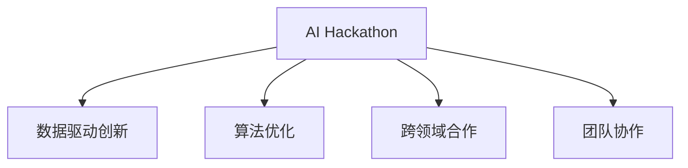

                 

## 1. 背景介绍

### 1.1 问题由来

人工智能黑客松（AI Hackathon）通常由公司或研究机构组织，旨在激发创新思维，解决实际问题，展示AI技术的应用潜力。AI Hackathon将人工智能领域的前沿技术，如深度学习、自然语言处理、计算机视觉、强化学习等，与具体的应用场景相结合，提供了一个展示和验证这些技术创新性应用的绝佳平台。

### 1.2 问题核心关键点

AI Hackathon是人工智能技术应用创新的重要舞台，涉及到多个核心关键点：

- **技术融合**：如何将最新的人工智能技术融合到具体的应用场景中，解决实际问题。
- **跨领域合作**：不同领域的专家如何协同工作，提升创新项目的质量和创意性。
- **团队协作**：高效的团队协作和项目管理是完成高质量项目的必要条件。
- **算法和模型优化**：针对具体问题，如何优化算法和模型结构，提升性能。
- **数据和资源利用**：如何高效利用可用数据资源，推动项目进展。

### 1.3 问题研究意义

通过AI Hackathon，我们可以从以下几个方面获取显著价值：

- **推动技术创新**：快速验证新算法的可行性和实用性，推动技术边界拓展。
- **加速应用落地**：针对具体行业需求，推动AI技术的快速应用和产业化。
- **培养人才团队**：培养跨学科技术人才和项目管理者，提升团队协作能力。
- **增强企业竞争力**：积累技术储备，提升企业在AI领域的市场竞争力。
- **社会价值**：解决实际问题，提升社会福祉，推动可持续发展。

## 2. 核心概念与联系

### 2.1 核心概念概述

为更好地理解AI Hackathon的创新与创造力，本节将介绍几个密切相关的核心概念：

- **AI Hackathon**：由公司、组织或研究机构举办的创新性技术竞赛，旨在解决实际问题，展示人工智能技术的应用潜力。
- **数据驱动创新**：通过收集、分析和利用大规模数据，驱动人工智能技术的应用创新。
- **算法优化**：针对具体应用场景，优化算法模型结构，提升性能和效率。
- **跨领域合作**：不同领域专家协同工作，实现技术和应用的跨界融合。
- **团队协作**：高效的项目管理和团队协作，是高质量创新项目的关键。

这些核心概念之间的逻辑关系可以通过以下Mermaid流程图来展示：



这个流程图展示了大语言模型的核心概念及其之间的关系：

1. AI Hackathon是创新的起点，通过具体应用场景推动数据驱动创新。
2. 数据驱动创新需要算法的优化，以及跨领域的合作支持。
3. 团队协作是实现高质量创新项目的基础。

这些概念共同构成了AI Hackathon创新实践的框架，使其能够高效地展示人工智能技术的价值和潜力。

## 3. 核心算法原理 & 具体操作步骤

### 3.1 算法原理概述

AI Hackathon的核心原理是数据驱动创新和算法优化。具体而言，该过程包括以下几个关键步骤：

- **问题定义**：明确要解决的问题及其背景，收集相关数据。
- **数据准备**：清洗、转换、标注数据，并选择合适的模型训练集和验证集。
- **模型选择**：根据问题特性选择合适的深度学习模型或算法。
- **算法优化**：通过超参数调优、模型结构改进等手段，优化算法性能。
- **模型评估**：使用验证集评估模型性能，必要时调整算法。
- **模型应用**：在实际应用中测试模型效果，提出改进方案。

### 3.2 算法步骤详解

以下是AI Hackathon中数据驱动创新和算法优化的详细步骤：

**Step 1: 问题定义和数据准备**
- 明确问题并收集相关数据，确保数据质量。
- 进行数据清洗、转换、标注，保证数据的可用性。
- 将数据划分为训练集和验证集，确保模型训练和评估的准确性。

**Step 2: 模型选择和设计**
- 根据问题特性选择合适的模型，如CNN、RNN、Transformer等。
- 设计合适的模型结构，添加必要的层和模块。
- 选择合适的损失函数和优化算法，如交叉熵、AdamW等。

**Step 3: 算法优化和超参数调优**
- 使用网格搜索或随机搜索进行超参数调优，寻找最优参数组合。
- 对模型进行结构改进，如引入注意力机制、激活函数等。
- 结合模型压缩技术，减少计算资源消耗。

**Step 4: 模型评估和调整**
- 使用验证集对模型进行评估，计算各项指标如准确率、召回率等。
- 根据评估结果调整模型结构或超参数，提升模型性能。
- 进行多次迭代，直至模型达到最佳状态。

**Step 5: 模型应用和测试**
- 将优化后的模型应用于实际场景中，测试模型效果。
- 根据实际反馈，提出改进方案，进一步优化模型。
- 部署模型并持续监控，确保模型稳定性。

### 3.3 算法优缺点

AI Hackathon中的数据驱动创新和算法优化方法具有以下优点：

1. **高效性**：通过数据驱动，能够快速定位问题本质，设计出高效的解决方案。
2. **可重复性**：算法优化过程具有可重复性，便于进一步改进和推广。
3. **灵活性**：根据实际反馈，可以灵活调整模型结构和参数，提升性能。
4. **普适性**：方法适用于各类人工智能竞赛和实际应用场景。

但同时也存在一些局限性：

1. **数据依赖**：模型的性能高度依赖数据质量，数据收集和处理难度较大。
2. **计算资源**：大规模模型训练需要大量的计算资源，成本较高。
3. **模型泛化能力**：过度拟合训练数据可能导致模型泛化能力不足。
4. **算法复杂度**：优化算法复杂度较高，需要丰富的经验和技巧。

## 4. 数学模型和公式 & 详细讲解 & 举例说明

### 4.1 数学模型构建

在AI Hackathon中，常见的数学模型包括卷积神经网络（CNN）、循环神经网络（RNN）、注意力机制（Attention）、Transformer等。这里以Transformer为例，介绍其基本原理和构建方法。

Transformer模型由编码器和解码器两部分组成。编码器由多个自注意力层和前馈神经网络层堆叠而成，用于提取输入数据的语义表示。解码器也由自注意力层和前馈神经网络层组成，用于生成输出序列。其结构如下图所示：


### 4.2 公式推导过程

Transformer的核心在于自注意力机制。自注意力机制通过计算输入序列中每个词与所有其他词的相似度，得到每个词的加权表示。

设输入序列为 $x_1, x_2, ..., x_n$，自注意力层的输出表示为 $y_1, y_2, ..., y_n$，则自注意力层的计算公式为：

$$
y_i = \sum_{j=1}^{n} \alpha_{i,j} x_j
$$

其中 $\alpha_{i,j}$ 为注意力权重，通过计算 $x_i$ 和 $x_j$ 之间的相似度得到：

$$
\alpha_{i,j} = \frac{e^{\mathbf{u}^T \cdot [Q(x_i); K(x_j); V(x_j)]}}{\sum_{k=1}^{n} e^{\mathbf{u}^T \cdot [Q(x_k); K(x_j); V(x_j)]}}
$$

其中 $Q, K, V$ 为投影矩阵，$\mathbf{u}$ 为缩放因子。

### 4.3 案例分析与讲解

以机器翻译为例，分析Transformer在AI Hackathon中的创新应用。

1. **问题定义**：机器翻译需要将一种语言翻译成另一种语言。数据驱动创新中，需要收集并清洗双语对照数据。
2. **数据准备**：对数据进行分词、编码，并标注源语言和目标语言。
3. **模型选择**：选择合适的Transformer模型，设置自注意力机制和编码器-解码器结构。
4. **算法优化**：优化模型的超参数，如学习率、批大小等，引入dropout机制避免过拟合。
5. **模型评估**：在验证集上评估模型性能，使用BLEU、ROUGE等指标衡量翻译质量。
6. **模型应用**：在实际翻译场景中测试模型效果，根据反馈进一步优化。

## 5. 项目实践：代码实例和详细解释说明

### 5.1 开发环境搭建

在进行AI Hackathon的项目实践前，我们需要准备好开发环境。以下是使用Python进行TensorFlow开发的环境配置流程：

1. 安装Anaconda：从官网下载并安装Anaconda，用于创建独立的Python环境。

2. 创建并激活虚拟环境：
```bash
conda create -n tf-env python=3.8 
conda activate tf-env
```

3. 安装TensorFlow：根据CUDA版本，从官网获取对应的安装命令。例如：
```bash
conda install tensorflow -c tensorflow -c conda-forge
```

4. 安装各类工具包：
```bash
pip install numpy pandas scikit-learn matplotlib tqdm jupyter notebook ipython
```

完成上述步骤后，即可在`tf-env`环境中开始AI Hackathon的项目实践。

### 5.2 源代码详细实现

这里以一个简单的图像分类任务为例，展示TensorFlow进行AI Hackathon项目的实现。

```python
import tensorflow as tf
from tensorflow.keras import datasets, layers, models

# 加载数据集
(train_images, train_labels), (test_images, test_labels) = datasets.cifar10.load_data()

# 归一化数据
train_images, test_images = train_images / 255.0, test_images / 255.0

# 构建模型
model = models.Sequential([
    layers.Conv2D(32, (3, 3), activation='relu', input_shape=(32, 32, 3)),
    layers.MaxPooling2D((2, 2)),
    layers.Conv2D(64, (3, 3), activation='relu'),
    layers.MaxPooling2D((2, 2)),
    layers.Conv2D(64, (3, 3), activation='relu'),
    layers.Flatten(),
    layers.Dense(64, activation='relu'),
    layers.Dense(10)
])

# 编译模型
model.compile(optimizer='adam',
              loss=tf.keras.losses.SparseCategoricalCrossentropy(from_logits=True),
              metrics=['accuracy'])

# 训练模型
history = model.fit(train_images, train_labels, epochs=10, 
                    validation_data=(test_images, test_labels))

# 评估模型
test_loss, test_acc = model.evaluate(test_images,  test_labels, verbose=2)
print('Test accuracy:', test_acc)
```

以上代码展示了使用TensorFlow构建一个简单的卷积神经网络，对CIFAR-10数据集进行图像分类任务。可以看到，TensorFlow提供了方便的API，帮助开发者快速构建和训练模型。

### 5.3 代码解读与分析

让我们再详细解读一下关键代码的实现细节：

**数据加载和预处理**：
- 使用`datasets.cifar10.load_data()`函数加载CIFAR-10数据集。
- 对图像数据进行归一化，将像素值缩放到0到1之间，以加快模型收敛。

**模型构建**：
- 使用`Sequential`模型，添加卷积层、池化层和全连接层，构建一个简单的卷积神经网络。
- 设置合适的激活函数和优化器，如ReLU和AdamW。

**模型编译和训练**：
- 使用`model.compile()`函数，设置损失函数和评估指标。
- 使用`model.fit()`函数，对模型进行训练，并使用验证集进行评估。

**模型评估和测试**：
- 使用`model.evaluate()`函数，对测试集进行评估，输出模型准确率。

可以看到，TensorFlow的API设计非常简洁，开发者能够快速实现数据加载、模型构建、训练和评估等核心功能。

## 6. 实际应用场景

### 6.1 智慧医疗

AI Hackathon在智慧医疗领域有广阔的应用前景。例如，可以使用图像分类技术自动识别X光片中的异常情况，如肿瘤、骨折等。具体步骤如下：

1. **问题定义**：自动识别X光片中的异常情况。
2. **数据准备**：收集并标注大量X光片数据。
3. **模型选择**：选择适合的卷积神经网络模型，如ResNet、Inception等。
4. **算法优化**：优化模型超参数，引入数据增强技术，提升模型鲁棒性。
5. **模型评估**：在验证集上评估模型性能，调整模型结构。
6. **模型应用**：在实际医疗影像中测试模型效果，进一步优化。

### 6.2 智能客服

智能客服是AI Hackathon的另一重要应用场景。例如，可以使用自然语言处理技术构建智能客服系统，自动解答用户咨询。具体步骤如下：

1. **问题定义**：自动解答用户咨询。
2. **数据准备**：收集并标注用户咨询和回复数据。
3. **模型选择**：选择适合的序列模型，如RNN、Transformer等。
4. **算法优化**：优化模型超参数，引入预训练技术，提升模型性能。
5. **模型评估**：在验证集上评估模型性能，调整模型结构。
6. **模型应用**：在实际客服系统中测试模型效果，进一步优化。

### 6.3 金融风控

金融风控是AI Hackathon的重要应用领域。例如，可以使用异常检测技术识别异常交易，减少金融风险。具体步骤如下：

1. **问题定义**：识别异常交易。
2. **数据准备**：收集并标注大量交易数据。
3. **模型选择**：选择适合的异常检测模型，如CNN、RNN等。
4. **算法优化**：优化模型超参数，引入多模态数据融合技术，提升模型鲁棒性。
5. **模型评估**：在验证集上评估模型性能，调整模型结构。
6. **模型应用**：在实际金融交易中测试模型效果，进一步优化。

### 6.4 未来应用展望

随着AI Hackathon的不断推进，未来在以下几个方向将有更大的突破：

1. **多模态融合**：将图像、视频、音频等多模态数据与文本数据结合，提升模型的泛化能力和应用范围。
2. **增强学习**：引入增强学习技术，提升模型的自适应能力和学习效率。
3. **联邦学习**：在分布式环境中，利用联邦学习技术进行模型训练，保护数据隐私和安全。
4. **自监督学习**：利用自监督学习技术，在少量标注数据下提升模型的性能和泛化能力。
5. **生成对抗网络（GAN）**：引入GAN技术，生成高质量的合成数据，进一步提升模型的鲁棒性和泛化能力。

这些方向的发展，将进一步推动AI Hackathon中的技术创新，拓展人工智能技术的应用边界。

## 7. 工具和资源推荐

### 7.1 学习资源推荐

为了帮助开发者系统掌握AI Hackathon的理论基础和实践技巧，这里推荐一些优质的学习资源：

1. **TensorFlow官方文档**：提供详细的TensorFlow教程和API文档，帮助开发者快速上手。
2. **Kaggle竞赛**：提供丰富的数据集和竞赛项目，锻炼开发者的实战能力。
3. **DeepLearning.AI课程**：提供系统性的深度学习课程，涵盖机器学习、深度学习等多个方向。
4. **GitHub代码库**：提供丰富的开源项目代码，帮助开发者学习借鉴。
5. **AI论文集**：涵盖大量前沿论文，了解AI技术的最新进展。

通过对这些资源的学习实践，相信你一定能够快速掌握AI Hackathon的技术框架和应用技巧，并用于解决实际的NLP问题。

### 7.2 开发工具推荐

高效的开发离不开优秀的工具支持。以下是几款用于AI Hackathon开发的常用工具：

1. **TensorFlow**：基于Python的开源深度学习框架，提供灵活的计算图和API支持，适合快速迭代研究。
2. **Jupyter Notebook**：提供交互式的编程环境，方便开发者进行代码实验和演示。
3. **Git**：版本控制系统，方便开发者协作和管理代码。
4. **Docker**：容器化技术，方便开发者部署和迁移模型。
5. **Kubeflow**：Kubernetes集成AI工作流平台，提供分布式模型训练和部署支持。

合理利用这些工具，可以显著提升AI Hackathon任务的开发效率，加快创新迭代的步伐。

### 7.3 相关论文推荐

AI Hackathon中的技术创新涉及多个前沿方向，以下是几篇奠基性的相关论文，推荐阅读：

1. **Attention is All You Need**：提出了Transformer结构，开启了NLP领域的预训练大模型时代。
2. **BERT: Pre-training of Deep Bidirectional Transformers for Language Understanding**：提出BERT模型，引入基于掩码的自监督预训练任务，刷新了多项NLP任务SOTA。
3. **Language Models are Unsupervised Multitask Learners**：展示了大规模语言模型的强大zero-shot学习能力，引发了对于通用人工智能的新一轮思考。
4. **Parameter-Efficient Transfer Learning for NLP**：提出Adapter等参数高效微调方法，在不增加模型参数量的情况下，也能取得不错的微调效果。
5. **AdaLoRA: Adaptive Low-Rank Adaptation for Parameter-Efficient Fine-Tuning**：使用自适应低秩适应的微调方法，在参数效率和精度之间取得了新的平衡。

这些论文代表了大语言模型微调技术的发展脉络。通过学习这些前沿成果，可以帮助研究者把握学科前进方向，激发更多的创新灵感。

## 8. 总结：未来发展趋势与挑战

### 8.1 总结

本文对AI Hackathon中的创新与创造力进行了全面系统的介绍。首先阐述了AI Hackathon的研究背景和意义，明确了数据驱动创新和算法优化的重要价值。其次，从原理到实践，详细讲解了AI Hackathon的核心步骤和方法，给出了项目实践的完整代码实现。同时，本文还探讨了AI Hackathon在智慧医疗、智能客服、金融风控等多个领域的应用前景，展示了其广阔的应用空间。最后，精选了学习资源、开发工具和相关论文，力求为读者提供全方位的技术指引。

通过本文的系统梳理，可以看到，AI Hackathon是人工智能技术创新和应用的重要平台，通过实际应用驱动技术进步和产业发展。未来，伴随AI技术的不断发展，AI Hackathon必将在推动人工智能技术创新和应用方面发挥更大作用。

### 8.2 未来发展趋势

展望未来，AI Hackathon将呈现以下几个发展趋势：

1. **技术融合**：将多种AI技术进行融合，提升应用效果。
2. **跨领域合作**：不同领域的专家进行深度合作，提升创新项目的质量。
3. **团队协作**：高效的团队协作和项目管理是高质量创新项目的关键。
4. **算法优化**：算法优化的复杂度和精度将进一步提升。
5. **数据驱动**：数据驱动创新将变得更加重要，数据质量和应用场景的多样性将进一步提升。
6. **人机协同**：人机协同技术的应用将更加广泛，提升创新项目的实际价值。

这些趋势凸显了AI Hackathon的潜力，未来将为更多行业提供更加高效、灵活的创新解决方案。

### 8.3 面临的挑战

尽管AI Hackathon中技术创新取得显著成效，但仍面临诸多挑战：

1. **数据依赖**：高质量数据集的获取和标注难度较大，限制了创新项目的推进。
2. **计算资源**：大规模模型训练需要大量的计算资源，成本较高。
3. **模型泛化**：模型泛化能力不足，难以应对实际应用中的多样化数据。
4. **算法复杂性**：算法优化的复杂度较高，需要丰富的经验和技巧。
5. **应用落地**：将AI技术转化为实际应用，需要解决技术、工程和业务等多方面的问题。

只有积极应对这些挑战，才能实现AI Hackathon的长足发展和应用落地。

### 8.4 研究展望

未来，AI Hackathon的研究方向将更加多元化，涵盖以下方向：

1. **自监督学习**：利用无标签数据进行预训练，减少对标注数据的依赖。
2. **联邦学习**：在分布式环境中进行模型训练，保护数据隐私。
3. **增强学习**：利用增强学习技术提升模型的自适应能力。
4. **多模态融合**：将图像、视频、音频等多模态数据与文本数据结合，提升模型的泛化能力和应用范围。
5. **模型压缩**：通过模型压缩技术，提升模型的推理速度和资源利用率。

这些方向的研究，将进一步推动AI Hackathon中的技术创新和应用落地，拓展人工智能技术的应用边界。

## 9. 附录：常见问题与解答

**Q1：AI Hackathon中如何选择合适的算法模型？**

A: 在AI Hackathon中，选择合适的算法模型需要考虑以下几个因素：
1. **问题特性**：根据问题特性选择适合的模型，如图像分类、文本分类、序列生成等。
2. **数据规模**：根据数据规模选择合适的模型，如小规模数据集可以选择轻量级模型，大规模数据集可以选择深度模型。
3. **性能要求**：根据性能要求选择适合的模型，如高精度需要选择复杂度高的模型，高效率需要选择轻量级模型。

**Q2：AI Hackathon中如何进行高效的模型训练？**

A: 高效的模型训练需要考虑以下几个方面：
1. **数据增强**：通过数据增强技术，扩充训练集，提升模型泛化能力。
2. **超参数调优**：通过网格搜索或随机搜索进行超参数调优，找到最优参数组合。
3. **模型压缩**：通过模型压缩技术，减少计算资源消耗。
4. **分布式训练**：利用分布式训练技术，提高训练效率。

**Q3：AI Hackathon中如何提升模型的泛化能力？**

A: 提升模型的泛化能力需要考虑以下几个方面：
1. **数据集扩充**：扩充训练集，增加数据多样性。
2. **正则化**：使用正则化技术，如L2正则、Dropout等，防止过拟合。
3. **对抗训练**：引入对抗样本，提高模型鲁棒性。
4. **迁移学习**：利用迁移学习技术，在少量标注数据下提升模型性能。

**Q4：AI Hackathon中如何进行团队协作？**

A: 高效的团队协作需要考虑以下几个方面：
1. **角色分工**：明确团队成员的角色分工，避免重复劳动。
2. **沟通机制**：建立有效的沟通机制，及时解决问题。
3. **进度跟踪**：跟踪项目进度，及时调整计划。
4. **代码管理**：使用版本控制系统，方便代码管理和协作。

**Q5：AI Hackathon中如何进行模型部署和监控？**

A: 模型部署和监控需要考虑以下几个方面：
1. **模型压缩**：通过模型压缩技术，减少计算资源消耗。
2. **服务化封装**：将模型封装为标准化服务接口，便于集成调用。
3. **持续监控**：实时采集系统指标，设置异常告警阈值，确保系统稳定性。

通过以上方法和技术，可以高效地实现AI Hackathon项目，推动人工智能技术的应用落地。

---

作者：禅与计算机程序设计艺术 / Zen and the Art of Computer Programming

