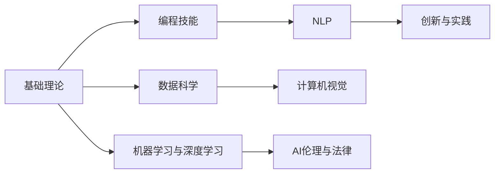

                 

# AI 人才培养计划：培养高素质 AI 人才

> 关键词：人工智能,人才培养,素质提升,创新能力,编程技能,跨学科融合,案例分析

## 1. 背景介绍

### 1.1 问题由来

近年来，人工智能(AI)技术的快速发展在各行各业产生了深远影响，为经济社会的发展注入了新的活力。然而，随着AI技术的深入应用，也面临着人才短缺、技能断层等挑战。高素质AI人才的培养，不仅需要掌握扎实的理论知识，还需要具备创新能力和跨学科融合能力。因此，制定系统的AI人才培养计划，培养既懂算法又懂应用的高素质AI人才，显得尤为重要。

### 1.2 问题核心关键点

AI人才培养的核心目标在于培养具备以下几方面能力的人才：

- **理论知识**：掌握计算机科学和AI算法的基础理论和知识体系。
- **编程技能**：熟练使用Python、C++等编程语言进行算法实现。
- **跨学科融合**：具备数据科学、自然语言处理、计算机视觉等多领域的知识，能够进行跨学科的创新和应用。
- **创新能力**：具备发现问题、解决问题和创造新算法的能力。
- **项目实践**：具备将理论知识转化为实际应用项目的能力。
- **科研能力**：具备开展科研、论文撰写、项目跟进等学术研究的能力。

这些关键能力构成了AI人才培养的核心框架，旨在培养出既具备深厚的理论基础，又具备解决实际问题能力的复合型人才。

### 1.3 问题研究意义

AI人才培养的实际意义体现在以下几个方面：

1. **推动技术发展**：高质量的AI人才是推动AI技术进步的关键力量，能够不断突破技术瓶颈，推动行业创新。
2. **促进产业升级**：AI人才能够将先进技术应用到传统行业，提升产业的智能化水平，加速产业转型升级。
3. **应对市场需求**：随着AI应用的普及，企业对AI人才的需求日益增加，培养高素质AI人才能够满足市场需求。
4. **提升教育质量**：AI人才培养计划有助于提升高校和教育机构的教学质量，培养出更多具备创新和实践能力的学生。
5. **推动社会进步**：AI人才在社会治理、公共服务、医疗健康等领域的应用，能够提升社会治理效率，改善人民生活质量。

因此，培养高素质AI人才不仅是技术发展的需要，也是社会进步的必然选择。

## 2. 核心概念与联系

### 2.1 核心概念概述

AI人才培养计划涉及多个核心概念，包括：

- **基础理论**：计算机科学、数据结构、算法设计等基础理论知识。
- **编程技能**：Python、C++、Java等编程语言的使用。
- **数据科学**：数据处理、数据清洗、数据分析等数据科学方法。
- **机器学习与深度学习**：监督学习、非监督学习、深度学习等机器学习技术。
- **自然语言处理(NLP)**：文本处理、语言模型、语义理解等NLP技术。
- **计算机视觉**：图像处理、目标检测、图像生成等计算机视觉技术。
- **AI伦理与法律**：AI伦理、数据隐私、法律合规等AI伦理和法律问题。
- **创新与实践**：项目开发、算法优化、科研论文等创新和实践能力。

这些概念相互联系，共同构成AI人才培养的完整框架。

### 2.2 核心概念原理和架构的 Mermaid 流程图



这个流程图展示了各个核心概念之间的联系。从基础理论到编程技能，再到数据科学、机器学习、NLP、计算机视觉等具体技术，最后形成创新与实践能力，构成了一个系统的AI人才培养框架。

## 3. 核心算法原理 & 具体操作步骤

### 3.1 算法原理概述

AI人才培养的算法原理主要涉及以下几个方面：

- **监督学习与非监督学习**：通过监督学习算法(如回归、分类)和非监督学习算法(如聚类、降维)训练模型，掌握数据处理和分析的能力。
- **深度学习框架**：掌握TensorFlow、PyTorch等深度学习框架的使用，实现复杂深度学习模型的训练和推理。
- **强化学习**：了解强化学习算法(如Q-learning、Policy Gradient)，掌握其在机器人控制、游戏AI等中的应用。
- **迁移学习**：了解迁移学习算法(如Fine-tuning)，掌握在已有预训练模型上微调的能力。
- **跨学科融合**：掌握跨领域的知识应用，如将NLP和计算机视觉结合，实现图像描述生成等任务。

### 3.2 算法步骤详解

AI人才培养的具体操作步骤包括以下几个关键步骤：

**Step 1: 基础理论学习**
- 通过学习计算机科学和数学基础理论，掌握算法设计、数据结构等核心知识。
- 参加在线课程、参加讲座、阅读经典书籍等方式，系统学习相关理论。

**Step 2: 编程技能训练**
- 通过编写和调试代码，掌握Python、C++等编程语言的基本语法和常用库。
- 参与开源项目，贡献代码，提升编程实践能力。

**Step 3: 数据科学与机器学习**
- 学习数据清洗、数据处理、特征工程等数据科学技能。
- 学习监督学习、非监督学习、深度学习等机器学习算法。
- 使用TensorFlow、PyTorch等框架实现和调试模型。

**Step 4: 自然语言处理**
- 学习文本预处理、词嵌入、语言模型等NLP技术。
- 完成NLP项目，如情感分析、文本分类等。

**Step 5: 计算机视觉**
- 学习图像处理、目标检测、图像生成等计算机视觉技术。
- 完成计算机视觉项目，如人脸识别、图像描述生成等。

**Step 6: AI伦理与法律**
- 学习AI伦理、数据隐私、法律合规等知识。
- 参与相关项目，提升伦理和法律意识。

**Step 7: 创新与实践**
- 参与实际项目，解决实际问题，提升创新能力。
- 撰写科研论文，参与学术交流，提升科研能力。

### 3.3 算法优缺点

AI人才培养的算法有以下优缺点：

**优点**：

- **系统性**：涵盖基础理论、编程技能、跨学科融合等多个方面，形成完整的知识体系。
- **实践性**：通过项目实践，提升学生的动手能力和创新能力。
- **跨学科融合**：培养学生的跨学科思维和应用能力，有助于解决复杂实际问题。

**缺点**：

- **学习难度大**：涉及多个领域的知识，学生需要投入大量时间和精力。
- **资源要求高**：需要高质量的教材、实验室、科研平台等资源支持。
- **个性化需求难以满足**：不同学生的兴趣和能力差异较大，难以实现完全个性化的培养。

### 3.4 算法应用领域

AI人才培养的算法广泛应用于多个领域，包括：

- **自然语言处理**：文本处理、机器翻译、情感分析、问答系统等。
- **计算机视觉**：图像识别、目标检测、图像生成、图像描述等。
- **智能机器人**：机器人控制、人机交互、自然语言理解等。
- **自动驾驶**：图像识别、轨迹规划、智能决策等。
- **医疗健康**：医学图像分析、疾病预测、智能问诊等。
- **金融科技**：信用评估、风险控制、金融市场预测等。
- **制造业**：智能制造、质量检测、供应链优化等。

## 4. 数学模型和公式 & 详细讲解 & 举例说明

### 4.1 数学模型构建

AI人才培养的数学模型主要涉及以下几个方面：

- **线性代数**：矩阵运算、特征值分解等基本运算。
- **概率论与统计**：概率分布、统计推断、假设检验等基本方法。
- **优化算法**：梯度下降、牛顿法、共轭梯度法等优化算法。
- **随机过程**：马尔可夫链、马尔可夫决策过程、强化学习算法等。

### 4.2 公式推导过程

以下以梯度下降算法为例，介绍其推导过程。

梯度下降算法的基本思想是：对于任意函数$f(x)$，选取初始点$x_0$，通过迭代的方式不断更新点$x_n$，使得$f(x_n)$的值不断减小，直到收敛。其公式如下：

$$
x_{n+1} = x_n - \eta \nabla f(x_n)
$$

其中，$\eta$为学习率，$\nabla f(x_n)$为函数$f(x)$在点$x_n$的梯度。

以线性回归为例，假设训练集为$(x_i, y_i)$，模型为$f(x) = w^T x + b$，目标是最小化均方误差损失：

$$
\mathcal{L}(w, b) = \frac{1}{N}\sum_{i=1}^N (y_i - f(x_i))^2
$$

则梯度下降算法的更新公式为：

$$
w \leftarrow w - \eta \frac{1}{N}\sum_{i=1}^N 2(x_i - \bar{x})\delta_y
$$

$$
b \leftarrow b - \eta \frac{1}{N}\sum_{i=1}^N \delta_y
$$

其中，$\bar{x}$为样本均值，$\delta_y$为样本标签与模型输出的误差。

### 4.3 案例分析与讲解

以神经网络中的反向传播算法为例，介绍其数学原理和实现。

神经网络中的反向传播算法通过梯度下降法更新模型参数。假设神经网络的结构为：输入层、隐藏层和输出层。隐藏层神经元数为$h$，输出层神经元数为$k$。则前向传播的计算公式为：

$$
a_1 = w_1 x + b_1
$$

$$
z_1 = g(a_1)
$$

$$
a_2 = w_2 z_1 + b_2
$$

$$
z_2 = g(a_2)
$$

$$
\hat{y} = w_3 z_2 + b_3
$$

其中，$g(x)$为激活函数，如sigmoid函数。

则目标函数为均方误差损失：

$$
\mathcal{L}(\theta) = \frac{1}{N}\sum_{i=1}^N (\hat{y}_i - y_i)^2
$$

其中，$\theta = \{w_1, w_2, w_3, b_1, b_2, b_3\}$为模型参数。

反向传播算法通过链式法则计算每个参数的梯度，更新参数。其公式如下：

$$
\frac{\partial \mathcal{L}}{\partial w_3} = \frac{1}{N}\sum_{i=1}^N (2(\hat{y}_i - y_i)\frac{\partial \hat{y}_i}{\partial z_2}\frac{\partial z_2}{\partial a_2}\frac{\partial a_2}{\partial z_1}\frac{\partial z_1}{\partial a_1}\frac{\partial a_1}{\partial w_1} + \frac{\partial \mathcal{L}}{\partial b_3} + \frac{\partial \mathcal{L}}{\partial w_2} + \frac{\partial \mathcal{L}}{\partial b_2} + \frac{\partial \mathcal{L}}{\partial w_1} + \frac{\partial \mathcal{L}}{\partial b_1}
$$

其中，$\frac{\partial \mathcal{L}}{\partial w_1}$为参数$w_1$的梯度。

## 5. 项目实践：代码实例和详细解释说明

### 5.1 开发环境搭建

AI人才培养的开发环境搭建主要涉及以下几个方面：

1. 安装Python开发环境：使用Anaconda、Miniconda等工具安装Python，并配置虚拟环境。
2. 安装相关库：安装NumPy、Pandas、Scikit-learn、TensorFlow、PyTorch等常用库。
3. 配置开发工具：安装IDE、编辑器、版本控制工具等开发工具。
4. 配置科研平台：配置高性能计算集群、数据存储系统、科研平台等。

### 5.2 源代码详细实现

以下以TensorFlow为例，介绍如何使用TensorFlow实现线性回归模型的训练和预测。

```python
import tensorflow as tf
import numpy as np

# 定义训练数据
x_train = np.array([[1], [2], [3], [4]])
y_train = np.array([2, 4, 6, 8])

# 定义模型参数
w = tf.Variable(tf.zeros([1]))
b = tf.Variable(tf.zeros([1]))

# 定义优化器
optimizer = tf.optimizers.SGD(learning_rate=0.01)

# 定义损失函数
def loss_function(x, y):
    y_pred = tf.matmul(x, w) + b
    return tf.reduce_mean(tf.square(y_pred - y))

# 定义训练步骤
@tf.function
def train_step(x, y):
    with tf.GradientTape() as tape:
        y_pred = tf.matmul(x, w) + b
        loss = loss_function(x, y)
    grads = tape.gradient(loss, [w, b])
    optimizer.apply_gradients(zip(grads, [w, b]))

# 训练模型
for i in range(1000):
    train_step(x_train, y_train)

# 预测数据
x_test = np.array([[5], [6]])
y_pred = tf.matmul(x_test, w) + b
print(y_pred.numpy())
```

### 5.3 代码解读与分析

在上述代码中，我们使用了TensorFlow框架实现线性回归模型的训练和预测。具体步骤如下：

1. 定义训练数据：`x_train`为输入数据，`y_train`为标签。
2. 定义模型参数：`w`为权重，`b`为偏置。
3. 定义优化器：使用随机梯度下降优化器`SGD`。
4. 定义损失函数：使用均方误差损失函数。
5. 定义训练步骤：通过`tf.GradientTape`计算梯度，使用`optimizer.apply_gradients`更新参数。
6. 训练模型：通过循环训练步骤，更新参数。
7. 预测数据：通过前向传播，输出预测结果。

## 6. 实际应用场景

### 6.1 智能客服系统

智能客服系统通过自然语言处理技术，实现自动解答客户咨询，提升客服效率和客户满意度。AI人才培养的AI伦理与法律知识，确保系统的合法性和安全性，同时通过自然语言处理技术，提高系统的智能水平和用户体验。

### 6.2 金融科技

金融科技应用AI技术，实现风险评估、信用评估、智能投顾等功能。AI人才培养的机器学习与深度学习知识，提升系统的预测能力和决策能力，同时通过AI伦理与法律知识，确保系统的公平性和透明度。

### 6.3 医疗健康

医疗健康领域应用AI技术，实现疾病预测、智能问诊、影像分析等功能。AI人才培养的计算机视觉与数据科学知识，提升系统的诊断能力和分析能力，同时通过AI伦理与法律知识，确保系统的合规性和伦理性。

### 6.4 未来应用展望

未来AI人才培养的应用展望主要体现在以下几个方面：

1. **多模态融合**：将AI技术与其他模态技术结合，如语音、图像、传感器等，提升系统的感知能力和应用范围。
2. **联邦学习**：通过分布式计算，保护数据隐私，提升系统的可扩展性和安全性。
3. **边缘计算**：在边缘设备上部署AI模型，提升系统的响应速度和计算效率。
4. **自动驾驶**：应用AI技术，实现无人驾驶、智能交通等功能，提升交通效率和安全性。
5. **智能家居**：应用AI技术，实现智能控制、环境感知等功能，提升家居生活品质。

## 7. 工具和资源推荐

### 7.1 学习资源推荐

为了帮助学生系统掌握AI知识，以下是几本推荐的学习资源：

1. 《深度学习》（Ian Goodfellow）：经典深度学习教材，深入浅出地介绍了深度学习的基本概念和原理。
2. 《统计学习方法》（李航）：统计学习方法的入门书籍，介绍了机器学习的基本算法和应用。
3. 《Python机器学习基础教程》（Andreas C. Müller）：Python机器学习的实战教程，涵盖机器学习、数据科学和深度学习等内容。
4. 《计算机视觉：算法与应用》（Richard Szeliski）：计算机视觉的全面教材，介绍了图像处理、特征提取、目标检测等基本算法。
5. 《人工智能：一个现代方法》（Stuart Russell）：人工智能的入门教材，介绍了AI的原理、算法和应用。

### 7.2 开发工具推荐

AI人才培养的开发工具推荐如下：

1. PyTorch：Python深度学习框架，易于使用且灵活。
2. TensorFlow：Google开发的深度学习框架，支持大规模分布式计算。
3. Jupyter Notebook：交互式Python开发环境，支持代码块、图表和文本的混合编辑。
4. Visual Studio Code：跨平台的IDE，支持Python、Java、C++等多种语言。
5. Git：版本控制工具，方便代码的协作和共享。

### 7.3 相关论文推荐

AI人才培养的相关论文推荐如下：

1. "Deep Learning" by Ian Goodfellow, Yoshua Bengio, and Aaron Courville：深度学习的经典教材，涵盖了深度学习的基本概念和应用。
2. "Pattern Recognition and Machine Learning" by Christopher Bishop：模式识别和机器学习教材，介绍了机器学习的基本算法和应用。
3. "Hands-On Machine Learning with Scikit-Learn, Keras, and TensorFlow" by Aurélien Géron：机器学习的实战教程，介绍了Scikit-Learn、Keras和TensorFlow的使用。
4. "Computer Vision: Algorithms and Applications" by Richard Szeliski：计算机视觉教材，介绍了图像处理、特征提取和目标检测等基本算法。
5. "Artificial Intelligence: A Modern Approach" by Stuart Russell and Peter Norvig：人工智能的入门教材，介绍了AI的原理、算法和应用。

## 8. 总结：未来发展趋势与挑战

### 8.1 研究成果总结

AI人才培养计划的研究成果主要体现在以下几个方面：

1. 系统化人才培养框架：构建了涵盖基础理论、编程技能、数据科学、机器学习、NLP、计算机视觉、AI伦理与法律等多个领域的知识体系。
2. 丰富的项目实践经验：通过多个实际项目，提升了学生的动手能力和创新能力。
3. 科学合理的教学方法：通过系统化、实践化的教学方法，帮助学生掌握知识，提高科研能力。
4. 完善的科研平台：为学生提供了高性能计算集群、数据存储系统、科研平台等资源，支持学生的科研工作。

### 8.2 未来发展趋势

未来AI人才培养的发展趋势主要体现在以下几个方面：

1. **跨学科融合**：将AI与其他学科结合，提升系统的综合能力和应用范围。
2. **多模态融合**：将AI技术与多模态数据结合，提升系统的感知能力和应用范围。
3. **联邦学习**：通过分布式计算，保护数据隐私，提升系统的可扩展性和安全性。
4. **边缘计算**：在边缘设备上部署AI模型，提升系统的响应速度和计算效率。
5. **自动驾驶**：应用AI技术，实现无人驾驶、智能交通等功能，提升交通效率和安全性。
6. **智能家居**：应用AI技术，实现智能控制、环境感知等功能，提升家居生活品质。

### 8.3 面临的挑战

AI人才培养计划面临的挑战主要体现在以下几个方面：

1. **资源限制**：高质量的教学资源、实验室和科研平台等资源有限，难以满足所有学生的需要。
2. **个性化需求**：不同学生的兴趣和能力差异较大，难以实现完全个性化的培养。
3. **教学方法**：传统的教学方法难以满足学生的多样化需求，需要不断创新教学方法。
4. **科研压力**：学生需要投入大量时间和精力进行科研工作，需要科学合理的科研规划。
5. **应用实践**：将理论知识转化为实际应用需要大量实践经验，需要提供更多的实际项目。

### 8.4 研究展望

未来AI人才培养的研究展望主要体现在以下几个方面：

1. **多模态融合技术**：将AI技术与多模态数据结合，提升系统的感知能力和应用范围。
2. **联邦学习算法**：研究分布式计算和数据隐私保护技术，提升系统的可扩展性和安全性。
3. **边缘计算技术**：研究边缘计算技术，提升系统的响应速度和计算效率。
4. **自动驾驶技术**：研究无人驾驶技术，提升交通效率和安全性。
5. **智能家居技术**：研究智能家居技术，提升家居生活品质。

总之，AI人才培养计划需要不断创新教学方法，提供丰富的实际项目，提供高质量的教学资源和科研平台，才能培养出具备高素质、创新能力和实践能力的高端AI人才。

## 9. 附录：常见问题与解答

### Q1: AI人才培养计划的实施难点是什么？

A: 实施AI人才培养计划的难点主要体现在以下几个方面：

1. **资源限制**：高质量的教学资源、实验室和科研平台等资源有限，难以满足所有学生的需要。
2. **个性化需求**：不同学生的兴趣和能力差异较大，难以实现完全个性化的培养。
3. **教学方法**：传统的教学方法难以满足学生的多样化需求，需要不断创新教学方法。
4. **科研压力**：学生需要投入大量时间和精力进行科研工作，需要科学合理的科研规划。
5. **应用实践**：将理论知识转化为实际应用需要大量实践经验，需要提供更多的实际项目。

### Q2: 如何应对AI人才培养计划中的资源限制？

A: 应对AI人才培养计划中的资源限制，可以采取以下几个措施：

1. 利用在线资源：利用MOOC、Kaggle等在线平台，提供高质量的教学资源和学习机会。
2. 合作共建：与企业、研究机构合作共建实验室和科研平台，提供更多的实验和科研机会。
3. 开源项目：鼓励学生参与开源项目，提升实践能力和项目经验。
4. 跨学科融合：鼓励学生跨学科学习，提升综合能力和应用范围。
5. 科研资助：提供科研资助和奖学金，激励学生积极参与科研工作。

### Q3: 如何提升AI人才培养计划中的教学质量？

A: 提升AI人才培养计划中的教学质量，可以采取以下几个措施：

1. 系统化教学：构建系统化的教学体系，涵盖基础理论、编程技能、数据科学、机器学习、NLP、计算机视觉、AI伦理与法律等多个领域。
2. 实践化教学：通过多个实际项目，提升学生的动手能力和创新能力。
3. 个性化教学：根据学生的需求和兴趣，提供个性化的教学方法和学习路径。
4. 科研化教学：鼓励学生参与科研工作，提升科研能力和学术水平。
5. 创新化教学：引入前沿技术和新理念，提升教学质量和学生兴趣。

总之，AI人才培养计划需要不断创新教学方法，提供丰富的实际项目，提供高质量的教学资源和科研平台，才能培养出具备高素质、创新能力和实践能力的高端AI人才。

---

作者：禅与计算机程序设计艺术 / Zen and the Art of Computer Programming

