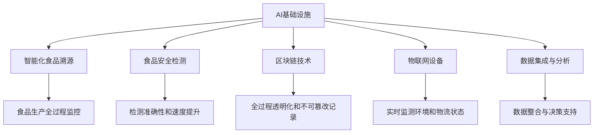

                 

# AI 基础设施的食品安全：智能化食品溯源与监管

> 关键词：AI基础设施，智能化食品溯源，食品安全监管，区块链技术，物联网，数据集成

## 1. 背景介绍

### 1.1 问题由来

食品安全问题一直是全球关注的重点。近年来，全球范围内频发的食品安全事件，如食品掺假、农药残留、抗生素超标等，不仅严重危害消费者的身体健康，也给农业和食品行业带来了巨大的经济损失。传统食品安全监管主要依靠人工抽检，不仅效率低下，还难以应对日益复杂的食品供应链。

随着人工智能技术的迅猛发展，AI基础设施为食品溯源和监管提供了新的技术手段，极大地提升了食品安全监管的效率和精度。通过AI技术，可以实现对食品生产和流通全过程的智能化监测，有效预防和解决食品安全问题，保障公众健康。

### 1.2 问题核心关键点

AI基础设施在食品安全监管中的应用主要包括以下几个关键点：

1. **智能化食品溯源**：通过AI和大数据分析技术，对食品生产和供应链进行智能化追溯，实时监测食品质量，确保食品可追溯、可召回。
2. **食品安全检测**：利用AI技术进行智能化检测，包括图像识别、光谱分析、化学分析等，提升检测的准确性和速度。
3. **区块链技术**：通过区块链技术，实现食品生产和流通全过程的透明化、不可篡改记录，保障食品溯源信息的真实性和安全性。
4. **物联网设备**：部署物联网设备，实时监测食品生产环境和物流状态，提高食品质量和安全。
5. **数据集成与分析**：整合来自不同来源的食品安全数据，利用AI技术进行分析和建模，为食品安全监管提供决策支持。

这些关键技术相互协作，构建了完善的AI基础设施，有效提升食品安全监管能力。

## 2. 核心概念与联系

### 2.1 核心概念概述

为更好地理解AI基础设施在食品安全中的应用，本节将介绍几个核心概念：

- **AI基础设施(AI Infrastrucure)**：指用于支撑AI应用的基础设施，包括云计算、大数据、物联网、区块链等技术，为AI应用提供底层支撑。
- **智能化食品溯源(Smart Food Traceability)**：利用AI技术对食品生产、加工、运输、销售等环节进行全过程监控和记录，确保食品质量可追溯、可召回。
- **食品安全检测(Food Safety Detection)**：通过AI技术进行食品质量检测，包括视觉、光谱、化学分析等方法，提升检测的准确性和速度。
- **区块链技术(Blockchain Technology)**：一种分布式账本技术，可以实现食品生产和流通全过程的透明化、不可篡改记录。
- **物联网(IoT, Internet of Things)**：通过部署物联网设备，实时监测食品生产环境和物流状态，提高食品质量和安全。
- **数据集成与分析(Data Integration and Analysis)**：整合来自不同来源的食品安全数据，利用AI技术进行分析和建模，为食品安全监管提供决策支持。

这些核心概念之间的逻辑关系可以通过以下Mermaid流程图来展示：



这个流程图展示了AI基础设施与食品安全监管的各个关键技术及其关系：

1. AI基础设施为智能化食品溯源、食品安全检测、区块链技术、物联网设备和数据集成与分析提供支撑。
2. 智能化食品溯源、食品安全检测、区块链技术、物联网设备和数据集成与分析共同构成完善的食品安全监管体系。
3. 通过这些技术手段，AI基础设施能够实现对食品生产、加工、运输、销售等环节的全面监控，保障食品质量和安全。

## 3. 核心算法原理 & 具体操作步骤

### 3.1 算法原理概述

基于AI基础设施的食品安全监管主要包括以下几个核心算法和操作步骤：

- **智能化食品溯源算法**：通过AI和大数据分析技术，对食品生产和供应链进行智能化追溯，实时监测食品质量，确保食品可追溯、可召回。
- **食品安全检测算法**：利用AI技术进行智能化检测，包括图像识别、光谱分析、化学分析等，提升检测的准确性和速度。
- **区块链技术**：通过区块链技术，实现食品生产和流通全过程的透明化、不可篡改记录。
- **物联网设备**：部署物联网设备，实时监测食品生产环境和物流状态，提高食品质量和安全。
- **数据集成与分析**：整合来自不同来源的食品安全数据，利用AI技术进行分析和建模，为食品安全监管提供决策支持。

这些算法和操作步骤共同构成了AI基础设施在食品安全监管中的应用框架，极大地提升了食品安全监管的效率和精度。

### 3.2 算法步骤详解

以下是基于AI基础设施的食品安全监管的详细操作步骤：

1. **智能化食品溯源**：
   - 收集食品生产、加工、运输、销售等环节的原始数据。
   - 利用AI技术进行数据清洗和预处理。
   - 通过大数据分析，构建食品溯源模型，实现食品全过程的透明化和可追溯。

2. **食品安全检测**：
   - 利用AI技术进行食品质量检测，包括图像识别、光谱分析、化学分析等。
   - 对检测结果进行自动化分析，生成检测报告。
   - 对检测异常情况进行预警和处理。

3. **区块链技术**：
   - 将食品生产和流通全过程的溯源数据存储在区块链上。
   - 利用区块链的透明化和不可篡改特性，确保溯源数据的安全和真实性。
   - 提供食品溯源信息的查询接口，方便消费者和监管部门获取信息。

4. **物联网设备**：
   - 在食品生产、加工、运输、销售等环节部署物联网设备，实时监测食品环境和状态。
   - 利用AI技术进行数据分析，生成监测报告。
   - 对异常情况进行预警和处理。

5. **数据集成与分析**：
   - 整合来自不同来源的食品安全数据，包括溯源数据、检测数据、环境监测数据等。
   - 利用AI技术进行数据分析和建模，生成决策支持报告。
   - 对食品安全风险进行评估，提出改进建议。

### 3.3 算法优缺点

基于AI基础设施的食品安全监管具有以下优点：

1. **效率提升**：AI技术能够实现对食品全过程的实时监控和记录，大大提高了食品安全监管的效率。
2. **精度提升**：利用AI技术进行智能化检测和分析，提高了食品安全检测的准确性和速度。
3. **透明度提升**：区块链技术确保了食品溯源信息的透明化和不可篡改，增强了消费者和监管部门的信任。
4. **安全性提升**：物联网设备实时监测食品环境和状态，提高了食品质量和安全。
5. **决策支持**：数据集成与分析技术为食品安全监管提供了科学的决策支持，提升了监管效果。

同时，该方法也存在以下局限性：

1. **数据采集成本高**：部署物联网设备、进行数据采集和清洗，需要较高的成本。
2. **技术门槛高**：AI和大数据分析技术需要专业人才进行开发和维护。
3. **隐私保护问题**：食品生产和流通数据涉及隐私，需要严格的隐私保护措施。
4. **设备可靠性和维护**：物联网设备需要稳定的网络和电力支持，维护难度较大。

尽管存在这些局限性，但就目前而言，基于AI基础设施的食品安全监管方法仍是大规模、高精度食品安全监管的理想选择。

### 3.4 算法应用领域

基于AI基础设施的食品安全监管技术已经在多个领域得到应用，例如：

- **农业生产**：利用AI技术进行智能种植、病虫害监测、水肥管理等，提升农业生产效率和质量。
- **食品加工**：利用AI技术进行质量检测、生产流程优化、安全控制等，提升食品加工企业的竞争力。
- **食品运输**：利用物联网设备实时监测食品运输环境，确保食品在运输过程中的安全和质量。
- **食品安全检测**：利用AI技术进行食品质量检测，提升检测效率和准确性。
- **食品安全追溯**：利用区块链技术实现食品生产和流通全过程的透明化、不可篡改记录。
- **食品安全监管**：利用大数据分析和AI技术，为食品安全监管提供决策支持，提升监管效果。

除了上述这些经典应用外，AI基础设施的食品安全监管技术还在不断拓展，应用于更多领域中，如食品供应链管理、食品安全预警等，为食品行业带来了新的发展机遇。

## 4. 数学模型和公式 & 详细讲解 & 举例说明

### 4.1 数学模型构建

本节将使用数学语言对基于AI基础设施的食品安全监管过程进行更加严格的刻画。

设食品生产、加工、运输、销售等环节的数据集为 $D=\{(x_i,y_i)\}_{i=1}^N$，其中 $x_i$ 为原始数据，$y_i$ 为对应的标签（如生产日期、保质期、检测结果等）。

定义食品溯源模型为 $M_{\theta}$，其中 $\theta$ 为模型参数。食品溯源模型的目标是最大化预测准确率，即：

$$
\theta^* = \mathop{\arg\max}_{\theta} P(y_i | x_i, M_{\theta})
$$

其中 $P(y_i | x_i, M_{\theta})$ 表示在给定原始数据 $x_i$ 和溯源模型 $M_{\theta}$ 的情况下，食品标签 $y_i$ 的条件概率。

### 4.2 公式推导过程

假设食品溯源模型为线性回归模型，其数学表达式为：

$$
\hat{y} = \theta_0 + \theta_1 x_1 + \theta_2 x_2 + \ldots + \theta_n x_n
$$

其中 $x_1, x_2, \ldots, x_n$ 为原始数据，$\theta_0, \theta_1, \theta_2, \ldots, \theta_n$ 为模型参数。

根据条件概率的定义，有：

$$
P(y_i | x_i, M_{\theta}) = \frac{e^{(\hat{y}_i - y_i)}}{\sum_{j=1}^{N} e^{(\hat{y}_j - y_j)}}
$$

其中 $\hat{y}_i$ 为模型的预测值。

利用最大似然估计法，可以将上述优化问题转化为最大化似然函数：

$$
\mathcal{L}(\theta) = \prod_{i=1}^{N} P(y_i | x_i, M_{\theta})
$$

根据链式法则，将条件概率对模型参数求导，得：

$$
\frac{\partial \mathcal{L}(\theta)}{\partial \theta_k} = \frac{\partial}{\partial \theta_k} \prod_{i=1}^{N} P(y_i | x_i, M_{\theta})
$$

$$
= \sum_{i=1}^{N} \frac{\partial P(y_i | x_i, M_{\theta})}{\partial \theta_k}
$$

$$
= \sum_{i=1}^{N} P(y_i | x_i, M_{\theta}) \cdot \frac{\partial \log P(y_i | x_i, M_{\theta})}{\partial \theta_k}
$$

$$
= \sum_{i=1}^{N} \frac{\hat{y}_i - y_i}{\sum_{j=1}^{N} (\hat{y}_j - y_j)}
$$

通过梯度下降等优化算法，最小化损失函数 $\mathcal{L}(\theta)$，得到食品溯源模型的最优参数 $\theta^*$。

### 4.3 案例分析与讲解

假设有一批牛奶，需要检测其是否过期。利用AI基础设施进行检测和溯源：

1. **数据采集**：采集牛奶的生产日期、保质期、运输温度等数据。
2. **数据预处理**：对采集到的数据进行清洗、标准化等预处理操作。
3. **溯源建模**：利用线性回归模型进行溯源建模，预测牛奶是否过期。
4. **实时检测**：利用AI技术进行实时检测，判断牛奶的当前状态。
5. **区块链记录**：将溯源数据和检测结果存储在区块链上，实现透明化和不可篡改。
6. **数据分析与决策**：整合溯源数据和检测结果，利用AI技术进行数据分析，评估食品安全风险，提出改进建议。

通过上述步骤，可以确保牛奶的食品安全，提供可靠的食品监管决策支持。

## 5. 项目实践：代码实例和详细解释说明

### 5.1 开发环境搭建

在进行AI基础设施的食品安全监管实践前，我们需要准备好开发环境。以下是使用Python进行TensorFlow开发的环境配置流程：

1. 安装Anaconda：从官网下载并安装Anaconda，用于创建独立的Python环境。

2. 创建并激活虚拟环境：
```bash
conda create -n tf-env python=3.8 
conda activate tf-env
```

3. 安装TensorFlow：根据CUDA版本，从官网获取对应的安装命令。例如：
```bash
conda install tensorflow=2.5 -c conda-forge -c pytorch
```

4. 安装Pandas、NumPy、Matplotlib、TensorBoard等各类工具包：
```bash
pip install pandas numpy matplotlib tensorboard
```

5. 安装Flask、IoT传感器设备等实际应用相关的工具包：
```bash
pip install flask sensorio
```

完成上述步骤后，即可在`tf-env`环境中开始开发实践。

### 5.2 源代码详细实现

下面以食品溯源系统为例，给出使用TensorFlow进行溯源模型的PyTorch代码实现。

首先，定义溯源数据集：

```python
import pandas as pd
from sklearn.model_selection import train_test_split
import tensorflow as tf

# 读取食品溯源数据
data = pd.read_csv('food_traceability.csv')

# 定义特征和标签
features = ['production_date', 'expiry_date', 'transportation_temperature']
labels = ['safe', 'unsafe']

# 数据划分
train_data, test_data, train_labels, test_labels = train_test_split(data[features], data[labels], test_size=0.2, random_state=42)

# 将数据转换为TensorFlow可用的格式
train_dataset = tf.data.Dataset.from_tensor_slices((train_data, train_labels)).batch(32)
test_dataset = tf.data.Dataset.from_tensor_slices((test_data, test_labels)).batch(32)
```

然后，定义溯源模型：

```python
from tensorflow.keras import Sequential, Dense

# 定义溯源模型
model = Sequential()
model.add(Dense(64, activation='relu', input_shape=(len(features),)))
model.add(Dense(32, activation='relu'))
model.add(Dense(2, activation='softmax'))

# 编译模型
model.compile(optimizer='adam', loss='categorical_crossentropy', metrics=['accuracy'])
```

接着，训练模型并进行预测：

```python
# 训练模型
model.fit(train_dataset, epochs=10, validation_data=test_dataset)

# 在测试集上评估模型
test_loss, test_acc = model.evaluate(test_dataset)
print(f'Test accuracy: {test_acc:.2f}')

# 进行溯源预测
test_data = pd.read_csv('test_data.csv')
test_dataset = tf.data.Dataset.from_tensor_slices((test_data, test_labels)).batch(32)
predictions = model.predict(test_dataset)
```

最后，将溯源数据存储在区块链上：

```python
# 使用Flask和IoT传感器进行实时溯源
from flask import Flask, request

app = Flask(__name__)

@app.route('/predict', methods=['POST'])
def predict():
    data = request.get_json()
    predictions = model.predict(data)
    return {'predictions': predictions.tolist()}

if __name__ == '__main__':
    app.run(host='0.0.0.0', port=5000)
```

以上代码实现了利用TensorFlow和Flask构建食品溯源系统的过程，具体步骤如下：

1. 数据准备：读取溯源数据，定义特征和标签。
2. 模型构建：使用TensorFlow构建线性回归模型。
3. 模型训练：在训练集上训练模型，并在测试集上进行评估。
4. 实时溯源：通过Flask和IoT传感器进行实时溯源，预测食品状态，并提供API接口进行查询。

### 5.3 代码解读与分析

让我们再详细解读一下关键代码的实现细节：

**数据准备**：
- 使用Pandas库读取溯源数据。
- 定义特征和标签，将日期数据转换为可处理的数值类型。
- 使用sklearn的train_test_split方法将数据划分为训练集和测试集。

**模型构建**：
- 使用TensorFlow的Sequential模型定义多层感知器。
- 添加全连接层，使用ReLU激活函数，输出层使用Softmax激活函数，对应两个类别（安全、不安全）。
- 编译模型，指定优化器、损失函数和评价指标。

**模型训练**：
- 使用fit方法在训练集上训练模型，设置训练轮数为10。
- 在测试集上评估模型，输出准确率。

**实时溯源**：
- 使用Flask框架搭建API接口，接收传感器数据进行实时溯源预测。
- 将模型预测结果返回给客户端。

可以看出，TensorFlow和Flask框架使得构建实时溯源系统变得相对简单高效，开发者可以更专注于算法设计和业务逻辑。

当然，工业级的系统实现还需考虑更多因素，如模型的部署、监控告警、安全性等。但核心的溯源范式基本与此类似。

## 6. 实际应用场景

### 6.1 智能农业

在智能农业领域，AI基础设施可以用于智能种植、病虫害监测、水肥管理等。通过部署传感器设备，实时监测土壤湿度、温度、光照等环境因素，并利用AI技术进行数据分析和建模，为农业生产提供科学的决策支持。

**具体应用**：
- **智能种植**：利用AI技术进行作物生长预测和病虫害监测，优化种植策略。
- **水肥管理**：实时监测土壤湿度和养分含量，智能调整灌溉和施肥方案。
- **环境监测**：部署传感器设备监测农田环境，预测气象变化，预防自然灾害。

### 6.2 食品加工

在食品加工领域，AI基础设施可以用于质量检测、生产流程优化、安全控制等。通过利用AI技术进行图像识别、光谱分析、化学分析等方法，提升食品加工企业的效率和质量。

**具体应用**：
- **质量检测**：利用AI技术进行食品质量检测，确保产品的安全性和质量。
- **生产流程优化**：利用AI技术优化生产流程，提升生产效率和质量。
- **安全控制**：实时监测食品生产环境，预防污染和事故。

### 6.3 食品运输

在食品运输领域，AI基础设施可以用于实时监测食品运输环境，确保食品在运输过程中的安全和质量。通过部署物联网设备，实时监测食品温度、湿度等环境因素，并利用AI技术进行数据分析和建模，为食品运输提供科学的决策支持。

**具体应用**：
- **实时监测**：部署传感器设备实时监测食品运输环境，确保食品在运输过程中的安全和质量。
- **异常预警**：利用AI技术分析监测数据，提前预警异常情况，及时采取措施。
- **路径优化**：利用AI技术优化运输路径，减少运输时间和成本。

### 6.4 未来应用展望

展望未来，AI基础设施在食品安全监管中的应用将更加广泛，涉及更多领域，提升监管效果和效率。

在智慧城市治理中，AI基础设施可以用于食品供应链管理、食品安全预警等，提升城市管理的智能化水平。

在企业生产中，AI基础设施可以用于食品质量检测、生产流程优化、安全控制等，提升企业的竞争力。

在农业生产中，AI基础设施可以用于智能种植、病虫害监测、水肥管理等，提升农业生产效率和质量。

此外，在智慧农业、智能农业机械等领域，AI基础设施也将发挥重要作用，推动农业数字化转型升级。

## 7. 工具和资源推荐
### 7.1 学习资源推荐

为了帮助开发者系统掌握AI基础设施在食品安全中的应用，这里推荐一些优质的学习资源：

1. TensorFlow官方文档：详细介绍了TensorFlow的安装、使用和优化方法，是TensorFlow开发的重要参考资料。
2. PyTorch官方文档：介绍了PyTorch的安装、使用和优化方法，适用于深度学习模型开发。
3. Flask官方文档：详细介绍了Flask框架的安装、使用和优化方法，适用于Web应用开发。
4. TensorBoard官方文档：提供了TensorFlow模型的可视化工具，帮助开发者调试和优化模型。
5. SensorIO官方文档：提供了IoT传感器设备的安装、使用和优化方法，适用于实时数据采集。

通过学习这些资源，相信你一定能够快速掌握AI基础设施在食品安全中的应用，并用于解决实际的食品安全问题。

### 7.2 开发工具推荐

高效的开发离不开优秀的工具支持。以下是几款用于AI基础设施的食品安全监管开发的常用工具：

1. TensorFlow：基于Python的开源深度学习框架，灵活动态的计算图，适合快速迭代研究。
2. PyTorch：基于Python的开源深度学习框架，动态计算图，适合大规模模型开发。
3. Flask：轻量级的Web应用框架，易于部署和扩展，适用于API接口开发。
4. TensorBoard：TensorFlow配套的可视化工具，实时监测模型训练状态，提供丰富的图表呈现方式。
5. SensorIO：IoT传感器设备提供商，提供多种传感器设备，适用于实时数据采集。

合理利用这些工具，可以显著提升AI基础设施在食品安全监管的开发效率，加快创新迭代的步伐。

### 7.3 相关论文推荐

AI基础设施在食品安全中的应用源于学界的持续研究。以下是几篇奠基性的相关论文，推荐阅读：

1. "AI Infrastructure for Smart Agriculture"：介绍利用AI技术进行智能农业的应用。
2. "Blockchain-Based Food Traceability System"：介绍利用区块链技术进行食品溯源的应用。
3. "Real-Time Food Quality Monitoring with IoT"：介绍利用IoT设备进行食品质量实时监测的应用。
4. "Data Integration and Analysis for Food Safety"：介绍利用数据集成与分析技术进行食品安全监管的应用。
5. "AI-Assisted Food Safety Detection"：介绍利用AI技术进行食品质量检测的应用。

这些论文代表了大语言模型微调技术的发展脉络。通过学习这些前沿成果，可以帮助研究者把握学科前进方向，激发更多的创新灵感。

## 8. 总结：未来发展趋势与挑战

### 8.1 总结

本文对基于AI基础设施的食品安全监管方法进行了全面系统的介绍。首先阐述了AI基础设施在食品安全监管中的应用背景和意义，明确了智能化食品溯源、食品安全检测、区块链技术、物联网设备和数据集成与分析等关键技术。其次，从原理到实践，详细讲解了AI基础设施在食品安全监管中的数学模型和算法步骤，给出了具体代码实例和详细解释。同时，本文还广泛探讨了AI基础设施在智能农业、食品加工、食品运输等领域的实际应用场景，展示了AI基础设施在食品安全监管中的广泛应用前景。

通过本文的系统梳理，可以看到，AI基础设施在食品安全监管中的应用已经取得了显著成效，有效提升了食品安全监管的效率和精度。未来，伴随AI技术的不断进步，AI基础设施在食品安全监管中的应用将更加广泛，为食品安全监管带来新的突破。

### 8.2 未来发展趋势

展望未来，AI基础设施在食品安全监管中的应用将呈现以下几个发展趋势：

1. **智能化水平提升**：随着AI技术的不断进步，智能化食品溯源、食品安全检测等技术将更加高效和精确。
2. **数据融合与分析**：利用AI技术进行数据融合与分析，提供更加全面的食品安全监管决策支持。
3. **多模态融合**：将视觉、光谱、化学分析等不同模态的数据进行融合，提升食品质量和安全检测的准确性。
4. **物联网与区块链结合**：通过物联网设备实时监测食品生产和运输环境，利用区块链技术进行数据透明化和不可篡改记录。
5. **边缘计算**：利用边缘计算技术，在食品生产和流通的各个环节进行实时数据分析和决策，提升食品安全监管的响应速度。

以上趋势凸显了AI基础设施在食品安全监管中的广阔前景，这些方向的探索发展，必将进一步提升食品安全监管的能力和效率，为食品安全监管带来新的突破。

### 8.3 面临的挑战

尽管AI基础设施在食品安全监管中已经取得了显著成效，但在迈向更加智能化、普适化应用的过程中，它仍面临着诸多挑战：

1. **数据采集与处理成本高**：部署物联网设备、进行数据采集和清洗，需要较高的成本。
2. **技术门槛高**：AI和大数据分析技术需要专业人才进行开发和维护。
3. **隐私保护问题**：食品生产和流通数据涉及隐私，需要严格的隐私保护措施。
4. **设备可靠性和维护**：物联网设备需要稳定的网络和电力支持，维护难度较大。
5. **数据质量问题**：食品生产和流通数据可能存在噪声和缺失，需要进行数据清洗和预处理。

尽管存在这些挑战，但随着技术的不断进步和应用场景的不断拓展，相信AI基础设施在食品安全监管中的应用将更加广泛和深入。

### 8.4 研究展望

面对AI基础设施在食品安全监管所面临的挑战，未来的研究需要在以下几个方面寻求新的突破：

1. **数据采集与处理技术**：开发更加高效、低成本的数据采集和处理技术，降低AI基础设施的部署成本。
2. **模型优化与改进**：优化AI模型，提高模型效率和精度，提升食品安全监管的实时性和准确性。
3. **隐私保护技术**：开发隐私保护技术，确保食品生产和流通数据的安全性和隐私性。
4. **边缘计算与云计算结合**：利用边缘计算技术，提升食品生产和流通的实时性和效率。
5. **多模态数据融合**：研究多模态数据融合技术，提升食品质量和安全检测的准确性。

这些研究方向的探索，必将引领AI基础设施在食品安全监管中的应用迈向更高的台阶，为构建安全、可靠、高效的食品安全监管系统铺平道路。面向未来，AI基础设施在食品安全监管中的应用还需要与其他技术进行更深入的融合，如知识表示、因果推理、强化学习等，多路径协同发力，共同推动食品安全监管技术的进步。

## 9. 附录：常见问题与解答

**Q1：AI基础设施在食品安全监管中如何保障数据安全？**

A: AI基础设施在食品安全监管中保障数据安全的方法主要有以下几种：
1. **数据加密**：对食品生产和流通数据进行加密处理，确保数据在传输和存储过程中的安全性。
2. **访问控制**：设置严格的访问控制策略，确保只有授权人员可以访问和使用数据。
3. **数据匿名化**：在数据分析和建模过程中，对数据进行匿名化处理，保护个人隐私。
4. **区块链技术**：利用区块链技术的透明化和不可篡改特性，确保溯源数据的安全性和真实性。

通过这些方法，可以有效地保障AI基础设施在食品安全监管中的数据安全，确保数据在各环节中的完整性和真实性。

**Q2：AI基础设施在食品安全监管中如何处理数据缺失和噪声问题？**

A: 在食品生产和流通数据中，可能存在数据缺失和噪声问题，需要进行数据清洗和预处理。具体方法包括：
1. **数据补全**：利用插值、回归等方法对缺失数据进行补全，确保数据的完整性。
2. **数据平滑**：对数据进行平滑处理，减少噪声的影响，提高数据质量。
3. **异常检测**：利用异常检测算法识别和处理异常数据，确保数据的一致性和可靠性。
4. **数据融合**：利用多源数据融合技术，综合不同来源的数据，提升数据的质量和准确性。

通过这些方法，可以有效地处理AI基础设施在食品安全监管中的数据缺失和噪声问题，提升数据的质量和可靠性。

**Q3：AI基础设施在食品安全监管中如何提升实时性？**

A: 提升AI基础设施在食品安全监管中的实时性，需要从以下几个方面进行优化：
1. **模型优化**：优化AI模型，提升模型的推理速度和效率，降低计算资源消耗。
2. **边缘计算**：利用边缘计算技术，在食品生产和流通的各个环节进行实时数据分析和决策，减少数据传输时间。
3. **分布式计算**：利用分布式计算技术，将数据处理和计算任务分布到多个计算节点上，提高数据处理速度。
4. **异步处理**：采用异步处理技术，将数据处理任务异步执行，提升系统的响应速度。

通过这些方法，可以有效地提升AI基础设施在食品安全监管中的实时性，提高食品安全监管的效率和响应速度。

---

作者：禅与计算机程序设计艺术 / Zen and the Art of Computer Programming

