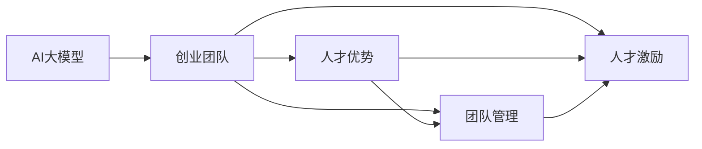
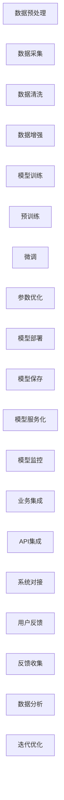

                 

## 1. 背景介绍

随着人工智能技术的快速发展，AI大模型在各个领域的应用不断拓展，从自然语言处理(NLP)、计算机视觉(CV)到自动驾驶、医疗诊断，AI大模型正在成为推动科技进步的重要引擎。然而，AI大模型在技术研发、市场推广、落地应用等各个环节都需要一支强大的跨学科团队。因此，如何利用人才优势，打造一支高效、协作的AI大模型创业团队，成为摆在创业者面前的重要课题。本文将系统介绍AI大模型创业中的人才需求、团队组建、管理和激励等方面的核心概念，并提供详细的实践指南，以帮助创业者高效构建高效的AI大模型创业团队。

## 2. 核心概念与联系

### 2.1 核心概念概述

- **AI大模型**：指以深度学习为基础，具备强大表征能力的人工智能模型。如BERT、GPT-3等，能够通过预训练和微调实现各种NLP任务。
- **创业团队**：指由具有不同专业背景和技能的成员组成，共同推进AI大模型项目从研发到落地的组织。
- **人才优势**：指创业团队中成员具备的杰出技术能力、跨学科知识、创新思维和团队协作能力。
- **团队管理**：指对创业团队进行有效的组织、指挥和协调，以实现团队目标的过程。
- **人才激励**：指通过合理的机制和政策，激发创业团队成员积极性和创造力的活动。

这些核心概念之间的关系如下图所示：



### 2.2 核心概念原理和架构的 Mermaid 流程图



该图展示了AI大模型从数据预处理到模型部署再到业务集成的全流程。数据预处理、模型训练、模型部署、业务集成和用户反馈构成了AI大模型创业的完整流程，而人才优势、团队管理和人才激励则是支撑这一流程高效运转的关键。

## 3. 核心算法原理 & 具体操作步骤

### 3.1 算法原理概述

AI大模型创业的核心算法原理包括以下几个方面：

- **数据预处理**：从原始数据中提取出模型训练所需的形式，并进行预处理，如数据清洗、数据增强等。
- **模型训练**：包括预训练和微调两个步骤。预训练是在大规模无标签数据上进行的，目的是提取通用的语言表示。微调则是在特定任务上的有监督训练，以提高模型在该任务上的性能。
- **模型部署**：将训练好的模型封装成可部署的服务，通过API接口实现调用。
- **业务集成**：将模型服务集成到实际应用系统中，实现端到端的业务流程。

### 3.2 算法步骤详解

#### 3.2.1 数据预处理

- **数据采集**：收集与任务相关的文本数据、图像数据等，确保数据质量。
- **数据清洗**：去除噪音数据、重复数据等，确保数据的一致性和完整性。
- **数据增强**：通过回译、近义替换等方式扩充训练集，提高模型的泛化能力。

#### 3.2.2 模型训练

- **预训练**：使用无标签数据进行预训练，学习通用的语言表示。
- **微调**：使用少量标注数据进行有监督训练，适应特定任务，如命名实体识别、情感分析等。

#### 3.2.3 模型部署

- **模型保存**：将训练好的模型保存到指定的存储路径。
- **模型服务化**：将模型封装成RESTful API，提供稳定的服务接口。
- **模型监控**：实时监测模型的运行状态和性能，确保服务稳定。

#### 3.2.4 业务集成

- **API集成**：将模型服务集成到业务系统中，实现数据交互。
- **系统对接**：确保模型服务与业务系统无缝对接，满足业务需求。

### 3.3 算法优缺点

**优点**：
- **高效性**：预训练和微调可以显著提高模型性能，减少从头训练的时间和成本。
- **通用性**：大模型可以适应多种NLP任务，如文本分类、生成、问答等。
- **可扩展性**：大模型可以通过参数高效的微调方法，保留预训练权重，只更新少部分参数。

**缺点**：
- **数据依赖**：微调性能很大程度上取决于标注数据的质量和数量。
- **过拟合风险**：微调过程中存在过拟合的风险，特别是标注数据不足的情况下。
- **成本高**：需要高性能的计算资源和存储资源，如GPU、TPU等。

### 3.4 算法应用领域

AI大模型创业的应用领域广泛，主要包括：

- **自然语言处理(NLP)**：包括文本分类、命名实体识别、情感分析、机器翻译等。
- **计算机视觉(CV)**：如图像分类、目标检测、图像生成等。
- **自动驾驶**：如环境感知、路径规划、自动驾驶决策等。
- **医疗诊断**：如医学影像分析、病历分析、疾病预测等。

## 4. 数学模型和公式 & 详细讲解 & 举例说明

### 4.1 数学模型构建

AI大模型的训练通常使用深度学习框架，如TensorFlow、PyTorch等。以BERT模型为例，其训练过程可以表示为：

$$
L = -\sum_{i=1}^{N} \sum_{j=1}^{M} y_{ij} \log p(x_{ij})
$$

其中，$L$为损失函数，$N$为样本数量，$M$为每个样本的标签数量，$y_{ij}$为标签向量，$p(x_{ij})$为模型对样本$x_{ij}$的预测概率。

### 4.2 公式推导过程

BERT模型的预训练过程主要通过掩码语言模型和下一句预测任务进行。以掩码语言模型为例，其训练过程可以表示为：

$$
L_{mask} = -\sum_{i=1}^{N} \sum_{j=1}^{M} y_{ij} \log p(x_{ij})
$$

其中，$y_{ij}$为掩码位置的真实标签，$p(x_{ij})$为模型对掩码位置预测的概率。

### 4.3 案例分析与讲解

以BERT在文本分类任务上的微调为例，其微调过程可以表示为：

$$
L_{finetune} = -\sum_{i=1}^{N} \sum_{j=1}^{M} y_{ij} \log p(x_{ij})
$$

其中，$y_{ij}$为分类任务的标注向量，$p(x_{ij})$为微调后的模型对样本$x_{ij}$的预测概率。

## 5. 项目实践：代码实例和详细解释说明

### 5.1 开发环境搭建

#### 5.1.1 数据准备

- **数据采集**：从公开数据集或企业内部数据中采集数据，如新闻、评论等。
- **数据清洗**：去除噪音数据、重复数据，确保数据质量。
- **数据增强**：通过回译、近义替换等方式扩充训练集。

#### 5.1.2 环境配置

- **安装Python**：选择Python 3.x版本，安装必要的依赖包。
- **安装TensorFlow**：使用pip安装TensorFlow，确保版本与模型匹配。
- **安装PyTorch**：使用conda或pip安装PyTorch，确保版本与模型匹配。

### 5.2 源代码详细实现

#### 5.2.1 数据预处理

```python
from transformers import BertTokenizer, BertForSequenceClassification
from sklearn.model_selection import train_test_split
import pandas as pd

# 加载数据
data = pd.read_csv('data.csv')

# 分词和编码
tokenizer = BertTokenizer.from_pretrained('bert-base-uncased')
data['text'] = data['text'].apply(lambda x: tokenizer.encode(x))
data['labels'] = data['label'].apply(lambda x: int(x))

# 划分训练集和测试集
train_texts, test_texts, train_labels, test_labels = train_test_split(data['text'], data['labels'], test_size=0.2, random_state=42)

# 构建数据集
train_dataset = TensorDataset(train_texts, train_labels)
test_dataset = TensorDataset(test_texts, test_labels)
```

#### 5.2.2 模型训练

```python
from transformers import BertForSequenceClassification, AdamW
from transformers import Trainer, TrainingArguments

# 初始化模型
model = BertForSequenceClassification.from_pretrained('bert-base-uncased', num_labels=2)

# 定义优化器和超参数
optimizer = AdamW(model.parameters(), lr=2e-5)
training_args = TrainingArguments(output_dir='./results', evaluation_strategy='epoch')

# 训练过程
trainer = Trainer(
    model=model,
    args=training_args,
    train_dataset=train_dataset,
    eval_dataset=test_dataset
)
trainer.train()
```

#### 5.2.3 模型评估

```python
from transformers import EvalPrediction, EvalOutput, EvalResult, EvalPredictor
import torch

# 评估过程
eval_pred = EvalPrediction(test_dataset, model=model)
eval_result = EvalResult(eval_pred)
eval_output = EvalOutput(eval_result, tokenizer)

# 输出评估结果
print(eval_output.logits)
print(eval_output.predictions)
print(eval_output.eval_result)
```

### 5.3 代码解读与分析

- **数据预处理**：使用BertTokenizer对文本进行分词和编码，同时将标签进行编码。
- **模型训练**：定义优化器和超参数，使用Trainer进行模型训练。
- **模型评估**：使用EvalPredictor进行模型评估，输出评估结果。

## 6. 实际应用场景

### 6.1 智能客服系统

智能客服系统是AI大模型创业的重要应用场景之一。通过微调大模型，可以构建智能客服机器人，实现自动化客服。具体流程如下：

1. **数据收集**：收集企业内部客服对话记录。
2. **数据预处理**：对对话记录进行清洗和增强。
3. **模型训练**：使用预训练模型进行微调，训练客服回答模型。
4. **部署应用**：将微调后的模型部署到线上客服系统中，实现实时对话。

### 6.2 金融舆情监测

金融舆情监测是AI大模型创业的另一重要应用场景。通过微调大模型，可以实时监测市场舆论动向，防范金融风险。具体流程如下：

1. **数据收集**：收集金融领域相关的新闻、报道、评论等文本数据。
2. **数据预处理**：对文本数据进行清洗和增强。
3. **模型训练**：使用预训练模型进行微调，训练舆情监测模型。
4. **部署应用**：将微调后的模型部署到舆情监测系统中，实时监控舆情变化。

### 6.3 个性化推荐系统

个性化推荐系统是AI大模型创业的另一重要应用场景。通过微调大模型，可以实现个性化推荐，提升用户体验。具体流程如下：

1. **数据收集**：收集用户浏览、点击、评论、分享等行为数据。
2. **数据预处理**：对文本数据进行清洗和增强。
3. **模型训练**：使用预训练模型进行微调，训练个性化推荐模型。
4. **部署应用**：将微调后的模型部署到推荐系统中，实现个性化推荐。

## 7. 工具和资源推荐

### 7.1 学习资源推荐

- **深度学习课程**：斯坦福大学《CS231n：卷积神经网络》、《CS224N：深度学习自然语言处理》等。
- **开源框架文档**：TensorFlow、PyTorch等深度学习框架的官方文档。
- **AI大模型论文**：BERT、GPT等大模型的论文，如BERT: Pre-training of Deep Bidirectional Transformers for Language Understanding。

### 7.2 开发工具推荐

- **Python**：选择Python 3.x版本，安装必要的依赖包。
- **TensorFlow**：使用pip安装TensorFlow，确保版本与模型匹配。
- **PyTorch**：使用conda或pip安装PyTorch，确保版本与模型匹配。

### 7.3 相关论文推荐

- **BERT: Pre-training of Deep Bidirectional Transformers for Language Understanding**：BERT模型的原始论文，介绍了BERT模型的预训练和微调方法。
- **Attention is All You Need**：Transformer模型的原始论文，介绍了Transformer模型的原理和应用。
- **Parameter-Efficient Transfer Learning for NLP**：提出了 Adapter等参数高效微调方法，在固定大部分预训练参数的同时，只更新极少量的任务相关参数。

## 8. 总结：未来发展趋势与挑战

### 8.1 研究成果总结

本文对AI大模型创业中的人才需求、团队组建、管理和激励等方面的核心概念进行了系统介绍。主要结论如下：

1. **人才优势**：创业团队中成员具备的杰出技术能力、跨学科知识、创新思维和团队协作能力是创业成功的关键。
2. **团队管理**：高效的团队管理可以提升团队协作效率，确保项目按时交付。
3. **人才激励**：合理的激励机制可以激发团队成员的积极性和创造力，推动项目创新。

### 8.2 未来发展趋势

未来AI大模型创业将呈现以下几个趋势：

1. **数据驱动**：随着数据的不断积累和算力的提升，AI大模型将更加依赖数据驱动的创新。
2. **模型通用化**：大模型将具备更强的通用性，适应更多的应用场景。
3. **跨学科融合**：AI大模型将与其他学科领域深度融合，如医学、金融、教育等。
4. **实时化**：AI大模型将更加注重实时化应用，提升用户体验。
5. **可解释性**：AI大模型将更加注重可解释性，提高用户信任度。

### 8.3 面临的挑战

AI大模型创业面临以下挑战：

1. **数据获取难度大**：高质量数据获取成本高，数据采集难度大。
2. **模型训练成本高**：高性能计算资源和存储资源需求高。
3. **团队管理复杂**：跨学科团队管理难度大，团队协作效率低。
4. **模型鲁棒性不足**：模型泛化性能差，对新数据的适应能力不足。
5. **用户隐私问题**：数据隐私保护和用户隐私保护难度大。

### 8.4 研究展望

未来AI大模型创业需要从以下几个方面进行研究：

1. **数据获取优化**：研究如何高效获取高质量数据，降低数据获取成本。
2. **模型训练优化**：研究如何高效利用算力和存储资源，降低模型训练成本。
3. **团队管理优化**：研究如何提升跨学科团队管理效率，提高团队协作效率。
4. **模型鲁棒性提升**：研究如何提高模型的泛化性能，提升模型鲁棒性。
5. **用户隐私保护**：研究如何保护用户隐私，提升用户信任度。

## 9. 附录：常见问题与解答

**Q1：AI大模型创业需要哪些核心人才？**

A：AI大模型创业需要以下核心人才：

1. **数据科学家**：负责数据采集、清洗、增强等工作。
2. **算法工程师**：负责模型训练、微调、优化等工作。
3. **软件工程师**：负责系统开发、部署、运维等工作。
4. **业务分析师**：负责业务需求分析、场景设计等工作。

**Q2：如何构建高效的AI大模型创业团队？**

A：构建高效的AI大模型创业团队需要以下步骤：

1. **明确团队目标**：制定清晰的项目目标和方向。
2. **选择合适的成员**：根据项目需求选择合适的成员，考虑其技术能力和团队协作能力。
3. **明确职责分工**：明确各成员的职责和任务，避免职责重叠和遗漏。
4. **加强团队协作**：建立有效的沟通机制，促进团队协作和信息共享。
5. **定期评估反馈**：定期评估团队工作，及时发现和解决问题，改进团队绩效。

**Q3：如何激励AI大模型创业团队？**

A：激励AI大模型创业团队需要以下措施：

1. **提供良好的工作环境**：提供舒适的工作环境，减少团队成员的疲劳感。
2. **提供合理的薪酬福利**：提供有竞争力的薪酬和福利，吸引和留住人才。
3. **提供发展机会**：提供职业发展和晋升机会，激发团队成员的积极性。
4. **提供成长空间**：提供学习和培训机会，帮助团队成员不断提升技能。

**Q4：如何应对AI大模型创业的挑战？**

A：应对AI大模型创业的挑战需要以下措施：

1. **加强数据获取**：建立数据采集和处理机制，确保高质量数据供给。
2. **优化模型训练**：优化模型训练流程，提高训练效率，降低成本。
3. **提升团队协作**：加强跨学科团队协作，提高团队效率。
4. **提升模型鲁棒性**：优化模型结构和训练方法，提升模型鲁棒性。
5. **保护用户隐私**：建立隐私保护机制，保护用户隐私和数据安全。

**Q5：AI大模型创业的未来方向是什么？**

A：AI大模型创业的未来方向包括：

1. **数据驱动的创新**：利用大数据和人工智能技术，驱动更多创新。
2. **模型通用化**：构建通用化的AI大模型，适应更多应用场景。
3. **跨学科融合**：与医学、金融、教育等学科深度融合，推动更多应用。
4. **实时化应用**：提升用户体验，实现实时化应用。
5. **可解释性**：提升模型可解释性，提高用户信任度。

总之，AI大模型创业需要在数据、模型、团队管理和激励等多个方面进行全面优化，才能在激烈的市场竞争中脱颖而出。

