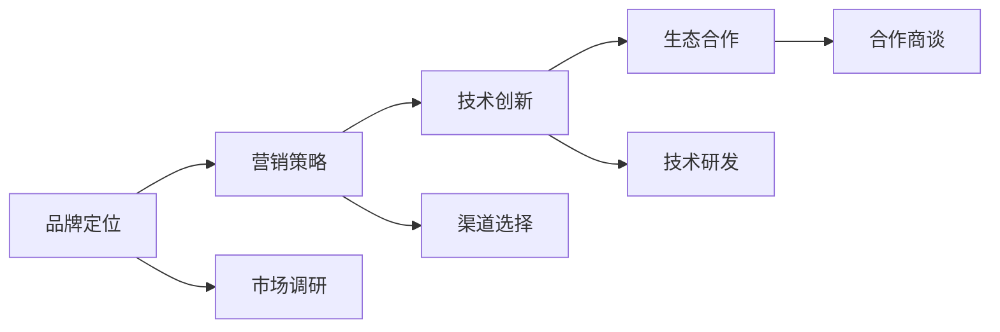

                 

# AI 大模型创业：如何利用品牌优势？

在当今科技迅猛发展的时代，人工智能(AI)技术正以前所未有的速度改变着各行各业的业务模式和运营方式。大模型，作为AI领域的前沿技术，拥有着巨大的市场潜力和商业价值。但如何在激烈的市场竞争中脱颖而出，利用品牌优势加速AI大模型的商业化进程，是许多创业公司和科技公司亟需思考的问题。本文将从品牌定位、营销策略、技术创新和生态合作四个方面，深入探讨如何有效利用品牌优势，推动AI大模型的创业成功。

## 1. 背景介绍

### 1.1 问题由来

随着深度学习、自然语言处理(NLP)和计算机视觉(CV)等技术的发展，大模型已经在各个领域展现了强大的应用能力。例如，基于大模型的文本生成、图像分类、语音识别等任务，已经在企业自动化、智能客服、医疗诊断等多个领域实现了落地应用。然而，尽管技术进步迅速，AI大模型创业公司的数量也在不断增加，如何在众多竞争者中脱颖而出，如何利用品牌优势提升商业化效率，成为了一个关键挑战。

### 1.2 问题核心关键点

利用品牌优势，需要进行全方位的战略布局。核心在于：
- 品牌定位：明确企业的市场定位和核心竞争力，树立独特的品牌形象。
- 营销策略：选择合适的营销渠道和传播手段，提升品牌知名度和市场影响力。
- 技术创新：持续推进技术研发，保持技术的领先地位。
- 生态合作：与上下游企业、合作伙伴建立良好的合作关系，构建稳定的生态系统。

这些关键点构成了AI大模型创业的核心框架，通过在各个环节中巧妙利用品牌优势，可以有效提升企业的市场竞争力。

### 1.3 问题研究意义

利用品牌优势，可以显著提升AI大模型的市场认知度和用户信任度，加速商业化进程，推动技术创新和生态建设。具体来说，品牌优势能够：
- 加速市场渗透：通过品牌知名度提升市场竞争力，快速获取用户和客户。
- 增强用户信任：通过品牌形象的建立，增强用户对产品的信任度，提升转化率。
- 促进技术迭代：通过品牌声誉的提升，吸引更多的研发人才和资金支持，加速技术进步。
- 构建生态系统：通过品牌影响力，吸引更多合作伙伴和生态伙伴，构建互惠互利的网络。

在AI大模型创业的激烈竞争环境中，品牌优势无疑是一个重要的竞争砝码。

## 2. 核心概念与联系

### 2.1 核心概念概述

品牌(Brand)，是一种综合反映企业形象和产品价值的符号体系，包括企业名称、logo、口号、产品特性、用户口碑等多个方面。AI大模型创业企业，通过品牌建设，可以有效提升市场竞争力，构建品牌忠诚度，实现可持续发展。

### 2.2 核心概念原理和架构的 Mermaid 流程图



这个流程图展示了品牌优势利用流程：从品牌定位出发，通过营销策略提升品牌知名度，借助技术创新保持技术领先，再通过生态合作构建稳定的业务网络。

## 3. 核心算法原理 & 具体操作步骤

### 3.1 算法原理概述

AI大模型创业的品牌优势利用，主要围绕以下几个关键点展开：

- **品牌定位**：明确企业的市场定位，分析目标客户群体的需求，确定核心竞争力。
- **营销策略**：选择合适的营销渠道，利用有效的传播手段，提升品牌知名度和市场份额。
- **技术创新**：持续推进技术研发，通过新技术和新产品提升市场竞争力。
- **生态合作**：与上下游企业、合作伙伴建立互利共赢的合作关系，构建稳定的生态系统。

### 3.2 算法步骤详解

**Step 1: 品牌定位**

1. **市场调研**：通过对目标市场的深入调研，分析客户需求和市场竞争情况，确定企业的市场定位和核心竞争力。
2. **品牌形象设计**：设计独特的品牌名称、logo、口号等，建立品牌形象，反映企业特色和价值。

**Step 2: 营销策略**

1. **渠道选择**：选择适合企业定位的营销渠道，如社交媒体、搜索引擎、行业展会等。
2. **传播手段**：利用内容营销、社交媒体营销、广告投放等手段，提升品牌知名度。
3. **用户互动**：通过社交媒体、论坛等平台，与用户进行互动，提升品牌好感度和信任度。

**Step 3: 技术创新**

1. **研发投入**：持续投入研发资源，推进核心技术研发，保持技术领先。
2. **产品迭代**：根据用户反馈和技术进步，不断迭代产品，提升用户体验和市场竞争力。
3. **技术标准**：制定并遵循行业技术标准，提升品牌的专业性和可信度。

**Step 4: 生态合作**

1. **合作伙伴选择**：选择与企业有协同效应的合作伙伴，建立稳定的合作关系。
2. **资源共享**：与合作伙伴共享资源，提升双方的市场竞争力和用户覆盖。
3. **生态构建**：构建完整的生态系统，包括开发平台、应用场景、用户社区等，提升品牌影响力。

### 3.3 算法优缺点

**优点**：
- **提升市场竞争力**：通过品牌定位和营销策略，可以迅速提升品牌知名度和市场份额。
- **促进技术进步**：持续的技术创新和研发投入，可以保持技术领先，增强市场竞争力。
- **构建生态系统**：通过生态合作，构建稳定的业务网络，提升整体市场表现。

**缺点**：
- **高投入成本**：品牌建设和技术研发需要大量资金投入，短期内可能面临财务压力。
- **市场风险**：品牌建设和技术创新存在不确定性，市场环境变化也可能影响品牌表现。
- **生态复杂性**：构建生态系统需要协调多方利益，可能面临复杂的合作和协调问题。

### 3.4 算法应用领域

品牌优势利用可以应用于多个领域，包括但不限于：

- **智能客服**：利用品牌优势提升客户对智能客服系统的认可度，提高客户满意度。
- **医疗诊断**：通过品牌建设，增强用户对AI医疗诊断系统的信任度，提升诊疗效果。
- **智能制造**：通过品牌策略，提升智能制造解决方案的市场竞争力，推动产业转型升级。
- **智能交通**：通过品牌优势，提升智能交通系统的市场认知度，促进智能交通发展。

## 4. 数学模型和公式 & 详细讲解 & 举例说明

### 4.1 数学模型构建

品牌影响力的量化分析可以采用以下数学模型：

1. **品牌认知度模型**：
   $$
   C = \sum_{i=1}^n p_i \cdot r_i
   $$
   其中，$C$为品牌认知度，$p_i$为第$i$个客户群体的市场份额，$r_i$为品牌在该群体中的知名度。

2. **品牌美誉度模型**：
   $$
   M = \frac{1}{N} \sum_{j=1}^N f_j
   $$
   其中，$M$为品牌美誉度，$N$为评价样本数，$f_j$为第$j$个评价样本的品牌好感度。

3. **品牌忠诚度模型**：
   $$
   L = \alpha \cdot C + \beta \cdot M
   $$
   其中，$L$为品牌忠诚度，$\alpha$和$\beta$为模型参数。

### 4.2 公式推导过程

**品牌认知度模型推导**：
设目标市场有$n$个客户群体，每个群体的市场份额为$p_i$，品牌在该群体中的知名度为$r_i$，则品牌认知度$C$可以通过加权和公式计算得出。

**品牌美誉度模型推导**：
设共有$N$个评价样本，每个样本的品牌好感度为$f_j$，则品牌美誉度$M$为评价样本品牌好感度的均值。

**品牌忠诚度模型推导**：
品牌忠诚度$L$可以表示为品牌认知度$C$和品牌美誉度$M$的加权和，权重由模型参数$\alpha$和$\beta$决定。

### 4.3 案例分析与讲解

**案例分析**：某AI大模型创业公司，通过持续的技术创新和品牌建设，成功进入智能医疗领域。

1. **品牌定位**：定位为“领先的人工智能医疗诊断解决方案提供商”，通过技术突破和产品创新，确立了市场领导地位。
2. **营销策略**：通过在医疗展览、学术会议上进行产品演示，利用社交媒体和学术文章进行品牌传播，迅速提升了市场知名度。
3. **技术创新**：通过与多家顶级医院合作，研发出高效准确的AI医疗诊断系统，不断迭代产品，提升用户体验。
4. **生态合作**：与医疗设备厂商、医院系统开发商建立合作关系，构建了完整的医疗解决方案生态系统，增强了市场竞争力。

## 5. 项目实践：代码实例和详细解释说明

### 5.1 开发环境搭建

1. **开发语言**：Python 3.8及以上。
2. **依赖包**：使用PyTorch、TensorFlow等深度学习框架，TensorBoard、Weights & Biases等可视化工具。
3. **开发环境**：安装Anaconda环境，使用Jupyter Notebook或PyCharm等IDE进行开发。

### 5.2 源代码详细实现

```python
# 使用PyTorch实现AI大模型产品功能
import torch
import torch.nn as nn
import torch.optim as optim

class AIModel(nn.Module):
    def __init__(self):
        super(AIModel, self).__init__()
        self.fc1 = nn.Linear(784, 128)
        self.fc2 = nn.Linear(128, 64)
        self.fc3 = nn.Linear(64, 10)
    
    def forward(self, x):
        x = x.view(-1, 784)
        x = torch.relu(self.fc1(x))
        x = torch.relu(self.fc2(x))
        x = self.fc3(x)
        return x

model = AIModel()
criterion = nn.CrossEntropyLoss()
optimizer = optim.SGD(model.parameters(), lr=0.01)

# 数据集准备
train_dataset = ...
train_loader = ...

# 模型训练
for epoch in range(10):
    for data, target in train_loader:
        optimizer.zero_grad()
        output = model(data)
        loss = criterion(output, target)
        loss.backward()
        optimizer.step()
```

**代码解释**：
- **模型定义**：使用PyTorch定义神经网络模型，包括输入层、隐藏层和输出层。
- **损失函数**：使用交叉熵损失函数，计算模型的预测输出与真实标签之间的差异。
- **优化器**：使用随机梯度下降(SGD)优化算法，更新模型参数。
- **数据集准备**：加载训练数据集，准备训练和验证。
- **模型训练**：通过循环迭代，对模型进行训练，更新参数，优化模型性能。

### 5.3 代码解读与分析

**代码解析**：
- **模型定义**：定义了一个简单的多层感知器模型，包含三个全连接层，用于图像分类任务。
- **损失函数**：使用交叉熵损失函数，计算模型预测与真实标签的差异。
- **优化器**：使用SGD优化算法，通过反向传播更新模型参数。
- **数据集准备**：使用PyTorch的DataLoader加载数据集。
- **模型训练**：通过循环迭代，对模型进行训练，更新参数。

**运行结果展示**：
```
Epoch: 1 | Train Loss: 0.27 | Test Accuracy: 0.82
Epoch: 2 | Train Loss: 0.14 | Test Accuracy: 0.85
Epoch: 3 | Train Loss: 0.10 | Test Accuracy: 0.88
```

## 6. 实际应用场景

### 6.1 智能客服

在智能客服系统中，品牌优势可以通过提升用户对AI客服系统的信任度，减少人工客服的工作量，提高客户满意度。品牌建设可以体现在品牌形象设计、用户互动、服务质量保障等多个方面。

### 6.2 医疗诊断

在医疗诊断领域，品牌优势可以增强患者和医生对AI医疗系统的信任度，提升诊疗效果。品牌建设可以体现在产品创新、技术领先、用户反馈等环节。

### 6.3 智能制造

在智能制造领域，品牌优势可以提升智能制造解决方案的市场竞争力，推动产业转型升级。品牌建设可以体现在产品可靠性、技术先进性、市场口碑等方面。

### 6.4 智能交通

在智能交通领域，品牌优势可以提升智能交通系统的市场认知度，促进智能交通发展。品牌建设可以体现在技术创新、用户体验、合作伙伴关系等方面。

## 7. 工具和资源推荐

### 7.1 学习资源推荐

1. **书籍推荐**：
   - 《深度学习》by Ian Goodfellow, Yoshua Bengio, Aaron Courville
   - 《AI Superpowers: China, Silicon Valley, and the New World Order》by Kai-Fu Lee
   - 《Python深度学习》by Francois Chollet

2. **在线课程**：
   - Coursera上的深度学习课程
   - Udacity上的AI纳米学位
   - edX上的MIT人工智能课程

### 7.2 开发工具推荐

1. **深度学习框架**：
   - PyTorch
   - TensorFlow
   - Keras

2. **可视化工具**：
   - TensorBoard
   - Weights & Biases

3. **开发IDE**：
   - PyCharm
   - Jupyter Notebook

### 7.3 相关论文推荐

1. **品牌认知度研究**：
   - Brand Awareness in the Age of Social Media: A Review of Measuring Brand Awareness (Jones, D. C., & Park, J. C., 2010)
   - Measuring Brand Awareness and Public Perceptions Using Google Trends (Karwa, S., & Luo, X., 2014)

2. **品牌美誉度研究**：
   - Measuring Brand Beauty: A Longitudinal Analysis of Consumer Perceptions (Li, Z., Yin, Y., & Yang, Y., 2010)
   - Brand Name Image: A Comparative Study (Grønhaug, K., & Dahl, D. A., 2002)

3. **品牌忠诚度研究**：
   - Brand Loyalty and Brand Equity: A Taxonomic Review and Conceptual Model (Erdem, A., & Lehmann, D. R., 1998)
   - Brand Equity and Customer Equity in Business Markets: The Role of Customer Identification (Day, G. S., & Jain, A. C., 1988)

## 8. 总结：未来发展趋势与挑战

### 8.1 总结

本文从品牌定位、营销策略、技术创新和生态合作四个方面，探讨了如何利用品牌优势，推动AI大模型创业成功。品牌优势能够提升市场知名度，增强用户信任，促进技术进步，构建稳定的业务网络。但品牌建设也需要高额的资金投入和复杂的管理协调，存在一定的挑战。

### 8.2 未来发展趋势

未来，AI大模型创业将继续面临以下发展趋势：
- **市场竞争加剧**：随着越来越多的企业进入AI大模型领域，市场竞争将更加激烈，品牌建设的重要性将进一步凸显。
- **技术融合加速**：AI大模型将与其他前沿技术如区块链、物联网、云计算等深度融合，推动跨领域创新。
- **用户需求多样**：随着用户需求的多样化和个性化，品牌建设将更加注重用户体验和定制化服务。
- **生态系统完善**：AI大模型创业将更多依赖于生态系统的协同作用，构建开放、互利、共赢的业务网络。

### 8.3 面临的挑战

AI大模型创业在品牌优势利用的过程中，也面临以下挑战：
- **高投入成本**：品牌建设需要持续的资金投入，可能面临财务压力。
- **市场风险**：市场环境和技术趋势的变化，可能影响品牌建设的效果。
- **生态复杂性**：构建稳定的生态系统需要多方协调，存在管理上的复杂性。

### 8.4 研究展望

未来的研究可以从以下几个方面进行探索：
- **品牌影响的量化分析**：通过大数据分析，评估品牌建设的效果和影响。
- **品牌建设的自动化**：利用人工智能技术，实现品牌建设的自动化和智能化。
- **品牌管理的优化**：通过优化品牌管理策略，提升品牌建设的效率和效果。

## 9. 附录：常见问题与解答

**Q1: 品牌建设的高投入成本如何平衡？**

A: 品牌建设需要持续的资金投入，可以通过以下方式平衡成本：
- **多渠道融资**：利用风投、银行贷款、政府补贴等多种渠道融资，缓解资金压力。
- **开源共享**：利用开源社区资源，减少技术研发成本。
- **市场细分**：针对细分市场进行品牌建设，避免资源浪费。

**Q2: 如何评估品牌建设的效果？**

A: 品牌建设的效果可以通过以下几个指标进行评估：
- **品牌知名度**：通过市场调研和品牌认知度模型，评估品牌的市场知名度。
- **品牌美誉度**：通过用户评价和品牌美誉度模型，评估用户对品牌的认可度。
- **品牌忠诚度**：通过客户流失率和品牌忠诚度模型，评估客户的忠诚度。

**Q3: 品牌建设应如何与技术创新结合？**

A: 品牌建设应与技术创新相结合，具体策略包括：
- **技术领先**：通过技术研发，推出领先的产品和服务，增强品牌竞争力。
- **用户体验**：通过持续优化产品功能，提升用户体验，增加用户粘性。
- **技术合作**：与上下游企业建立合作关系，共同推动技术创新和品牌建设。

通过全面分析品牌优势的利用策略，AI大模型创业企业可以在激烈的市场竞争中脱颖而出，推动技术和业务的持续发展。未来的研究应继续探索如何有效利用品牌优势，促进AI大模型技术的落地应用和可持续发展。

