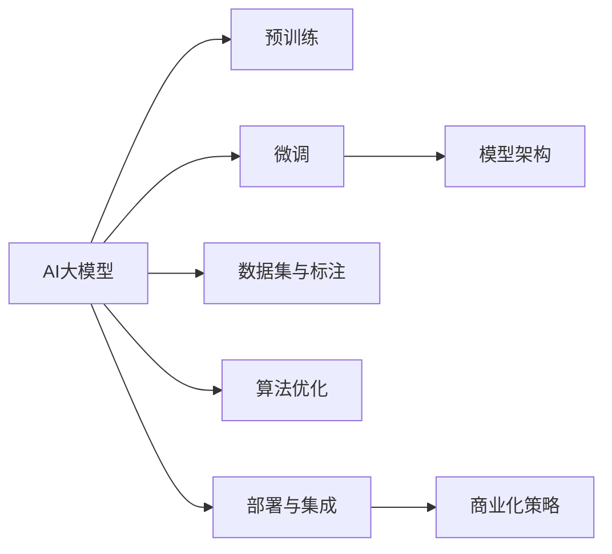

                 

# AI 大模型创业：如何利用市场优势？

在当今的技术浪潮中，人工智能（AI）大模型已成为科技创新的新高地，带来了巨大的市场潜力。然而，尽管这些模型在技术上可能具有显著优势，但其商业模式和市场策略也面临着独特的挑战。本文旨在深入探讨如何通过最大化AI大模型的市场优势，将创新转化为商业成功。

## 1. 背景介绍

### 1.1 市场现状与挑战

近年来，AI大模型在自然语言处理（NLP）、计算机视觉（CV）、推荐系统等领域展现了显著的性能提升。这些模型通常由大规模预训练和微调组成，能够处理复杂任务，并提供高质量的输出。然而，尽管技术上取得了巨大进展，AI大模型在商业化应用中仍然面临诸多挑战：

- **技术理解门槛高**：由于AI大模型涉及深度学习、分布式计算等复杂技术，对创业团队的技术能力提出了高要求。
- **数据获取难度大**：高质量的标注数据和计算资源成本高昂，且获取难度大。
- **市场准入门槛高**：行业巨头如Google、OpenAI等已占据大部分市场份额，新进入者面临激烈竞争。
- **伦理与法律风险**：AI大模型的误用可能导致伦理问题，如偏见、隐私泄露等，带来法律风险。

### 1.2 创业机会与潜力

尽管面临诸多挑战，AI大模型的创业仍充满潜力：

- **应用场景丰富**：AI大模型可应用于医疗、金融、教育等多个行业，带来广泛的商业机会。
- **技术壁垒高**：高技术门槛使得市场竞争相对宽松，易于寻找差异化竞争策略。
- **数据共享潜力大**：数据可共享，通过协作和共享数据，降低创业初期的资源压力。
- **政策支持**：各国政府普遍重视AI发展，提供政策支持与资金激励。

## 2. 核心概念与联系

### 2.1 核心概念概述

为更好地理解AI大模型的创业路径，本节将介绍几个关键概念及其相互关系：

- **AI大模型**：指基于大规模数据预训练和微调获得的通用模型，如BERT、GPT-3等。
- **预训练与微调**：预训练指在大规模无标签数据上进行训练，学习通用的语言表示；微调则是指在特定任务上进一步训练模型，提升其性能。
- **模型架构**：包括Transformer、LSTM、CNN等，是实现特定功能的核心组件。
- **数据集与标注**：高质量的数据集和标注是模型训练的基础。
- **算法优化**：包括梯度下降、Adam等，用于优化模型参数。
- **部署与集成**：将模型部署到实际应用场景，通过API等接口集成到业务系统中。
- **商业化策略**：如何将模型技术转化为市场优势，包括定价、营销、客户服务等。

这些概念通过一个Mermaid流程图进行连接和解释：



该图展示了AI大模型从训练到商业化的全流程，每个环节均需精细设计，以实现商业价值最大化。

## 3. 核心算法原理 & 具体操作步骤

### 3.1 算法原理概述

AI大模型的核心原理在于通过大规模数据预训练获得通用知识表示，再通过微调针对特定任务进行优化。该过程可以概括为以下几个关键步骤：

1. **数据预训练**：在无标签数据上训练模型，学习通用语言表示。
2. **任务微调**：在有标签数据上训练模型，针对特定任务进行优化。
3. **模型架构**：选择合适的神经网络结构，如Transformer、CNN等。
4. **算法优化**：使用梯度下降等算法优化模型参数。
5. **部署与集成**：将模型集成到实际应用中，通过API等接口提供服务。

### 3.2 算法步骤详解

以NLP领域为例，具体步骤包括：

1. **数据预训练**：
   - 收集大规模无标签文本数据。
   - 使用预训练模型（如BERT）进行训练。
   - 保存预训练模型作为后续微调的基础。

2. **任务微调**：
   - 收集特定任务的标注数据集。
   - 选择预训练模型，如BERT。
   - 设计任务适配层和损失函数，如分类任务使用交叉熵损失。
   - 设置超参数，如学习率、批大小等。
   - 在标注数据上进行微调训练。
   - 评估模型性能，调整超参数和模型结构。

3. **模型部署**：
   - 将微调后的模型导出。
   - 开发API接口，使模型服务化。
   - 部署至云平台或本地服务器。
   - 进行性能监控和用户反馈收集。

### 3.3 算法优缺点

AI大模型的优点包括：

- **性能优异**：基于大规模数据训练，能够处理复杂任务。
- **迁移能力强**：能够快速适应新任务，无需从头训练。
- **算法透明**：基于深度学习，可解释性强。
- **可扩展性高**：模型结构灵活，易于扩展和优化。

缺点包括：

- **计算资源需求高**：需要大量计算资源进行训练和推理。
- **数据获取难**：高质量标注数据获取成本高。
- **算法复杂**：深度学习模型训练过程复杂，调试难度大。
- **伦理法律风险**：数据隐私、模型偏见等问题需重点关注。

### 3.4 算法应用领域

AI大模型在多个领域有广泛应用，如：

- **医疗**：利用模型进行疾病预测、基因分析等。
- **金融**：进行情感分析、欺诈检测等。
- **教育**：个性化推荐、智能辅导等。
- **娱乐**：智能推荐、内容生成等。
- **工业**：质量检测、预测维护等。

## 4. 数学模型和公式 & 详细讲解 & 举例说明

### 4.1 数学模型构建

假定使用BERT模型进行情感分析任务微调，其数学模型构建如下：

1. **输入层**：将输入文本通过分词、编码转化为模型可接受的形式。
2. **语言模型层**：使用预训练BERT模型作为基础层，学习语言表示。
3. **任务适配层**：添加分类器，进行情感分类。
4. **损失函数**：使用交叉熵损失，评估模型预测与真实标签的差异。

### 4.2 公式推导过程

具体公式如下：

1. **输入层**：
   \[
   x_{i} = \text{Tokenizer}(x_{i})
   \]
   \[
   x_{i} = [CLS] \text{Embedding}(x_{i}) + [SEP] \text{Embedding}(x_{i})
   \]

2. **语言模型层**：
   \[
   h_{i} = \text{BERT}(x_{i})
   \]

3. **任务适配层**：
   \[
   h_{i} = \text{FC}(h_{i})
   \]

4. **损失函数**：
   \[
   L = -\frac{1}{N} \sum_{i=1}^{N} y_{i} \log \hat{y}_{i}
   \]

### 4.3 案例分析与讲解

假设在一个电商评论分类任务上，模型在训练集和验证集上的准确率分别为85%和88%。则可调整超参数，如批大小和学习率，优化模型性能。例如，可以通过减少批大小和增加学习率，在验证集上进一步提升准确率。

## 5. 项目实践：代码实例和详细解释说明

### 5.1 开发环境搭建

在Python环境下搭建AI大模型开发环境，步骤如下：

1. **安装Python环境**：
   \[
   conda create -n ai-env python=3.7
   conda activate ai-env
   \]

2. **安装依赖包**：
   \[
   pip install torch torchtext transformers
   \]

3. **配置模型训练参数**：
   \[
   batch_size = 32
   learning_rate = 2e-5
   epoch = 10
   \]

### 5.2 源代码详细实现

以BERT模型为例，代码实现如下：

```python
from transformers import BertTokenizer, BertForSequenceClassification
from torchtext import data, datasets

# 加载数据集
train_data, test_data = datasets.load('imdb.re', split=('train', 'test'))

# 分词器
tokenizer = BertTokenizer.from_pretrained('bert-base-uncased')

# 数据预处理
train_iterator, test_iterator = data.BucketIterator(train_data, test_data, batch_size=32, sort_key=lambda x: len(x.text))

# 定义模型
model = BertForSequenceClassification.from_pretrained('bert-base-uncased', num_labels=2)

# 定义损失函数和优化器
loss_fn = torch.nn.CrossEntropyLoss()
opt = torch.optim.Adam(model.parameters(), lr=2e-5)

# 模型训练
for epoch in range(epoch):
    for batch in train_iterator:
        # 前向传播
        outputs = model(batch.text, attention_mask=batch.mask)
        logits = outputs.logits
        loss = loss_fn(logits, batch.label)
        
        # 反向传播和优化
        opt.zero_grad()
        loss.backward()
        opt.step()
        
    # 验证集评估
    acc = evaluate(model, test_iterator)
    print(f'Epoch {epoch+1}, accuracy: {acc:.2f}')
```

### 5.3 代码解读与分析

1. **数据预处理**：
   - 使用torchtext加载IMDB数据集。
   - 使用BertTokenizer进行分词和编码。
   - 构建数据迭代器，方便模型训练。

2. **模型定义**：
   - 使用预训练的BERT模型进行序列分类。
   - 设置损失函数和优化器。

3. **模型训练**：
   - 通过前向传播和反向传播更新模型参数。
   - 在验证集上评估模型性能。

## 6. 实际应用场景

### 6.1 医疗诊断系统

AI大模型在医疗诊断系统中具有重要应用。例如，利用BERT模型进行病历分析，可快速识别疾病类型和风险因素，辅助医生进行诊断。通过微调，模型能够学习病历数据中的病症描述和临床表现，提供更准确的诊断结果。

### 6.2 金融风险评估

在金融领域，AI大模型可应用于风险评估，如信用评分、欺诈检测等。通过微调，模型能够分析用户的消费行为、财务状况等数据，预测风险等级，提供个性化的金融服务。

### 6.3 智能客服系统

AI大模型在智能客服系统中，可实现自然语言理解与生成，提供高效的客户服务。通过微调，模型能够理解客户的咨询意图，自动生成合适的回复，提升客户满意度。

### 6.4 未来应用展望

未来AI大模型将广泛应用于更多领域，如自动驾驶、智能制造、智慧城市等。随着技术进步和市场需求增长，AI大模型的商业应用前景广阔，有望带来更高的商业价值和社会效益。

## 7. 工具和资源推荐

### 7.1 学习资源推荐

1. **课程与书籍**：
   - Coursera上的深度学习课程。
   - 《深度学习》(花书)。
   - 《自然语言处理》。

2. **社区与论坛**：
   - Stack Overflow。
   - GitHub上的深度学习项目。
   - AI大模型开发者社区。

3. **论文与资源**：
   - 《Transformer架构》。
   - 《BERT：预训练的深度双向Transformer》。
   - 《大规模语言模型》。

### 7.2 开发工具推荐

1. **深度学习框架**：
   - TensorFlow。
   - PyTorch。
   - Keras。

2. **数据管理与处理**：
   - Dask。
   - Pandas。
   - Scikit-learn。

3. **模型优化工具**：
   - Horovod。
   - PyTorch Lightning。
   - TensorBoard。

### 7.3 相关论文推荐

1. **预训练模型**：
   - BERT。
   - GPT-3。
   - T5。

2. **微调技术**：
   - 《A Survey on Adaptive Pre-training》。
   - 《Adaptive Pre-training of Parameter-Efficient Transfer Learning》。
   - 《Fine-Tuning BERT for Sequence Labeling》。

## 8. 总结：未来发展趋势与挑战

### 8.1 研究成果总结

AI大模型在多个领域展现了显著的性能优势和广泛的应用潜力。通过预训练和微调，模型能够高效地处理复杂任务，提供高质量的输出。商业化应用领域不断扩展，技术壁垒高，为创业公司提供了丰富的市场机会。

### 8.2 未来发展趋势

未来AI大模型将呈现以下趋势：

1. **模型规模扩大**：预训练数据规模将进一步扩大，模型参数量将大幅增加，性能将显著提升。
2. **算法优化提升**：新算法和优化方法的出现，将提升模型训练和推理效率。
3. **应用场景多样化**：将应用于更多行业，如医疗、金融、制造等，带来更多的商业机会。
4. **数据获取自动化**：通过自动化数据标注和获取技术，降低数据获取成本。
5. **伦理法律合规**：加强模型伦理和法律合规性，确保模型应用的安全性和合法性。

### 8.3 面临的挑战

尽管AI大模型面临诸多市场优势，但也存在以下挑战：

1. **技术门槛高**：需要具备深厚的技术积累和创新能力。
2. **数据资源缺乏**：高质量标注数据获取成本高，且获取难度大。
3. **市场竞争激烈**：行业巨头占据大部分市场份额，创业公司面临激烈竞争。
4. **伦理法律风险**：模型应用需遵守伦理规范，避免偏见和歧视。
5. **商业化难度大**：从技术到市场，创业公司面临复杂的商业化过程。

### 8.4 研究展望

未来需要在以下方面进行突破：

1. **算法优化**：研发新算法和优化方法，提升模型性能和训练效率。
2. **数据获取**：探索自动化数据标注和获取技术，降低获取成本。
3. **伦理法律合规**：建立伦理审查机制，确保模型应用的合法性和安全性。
4. **市场推广**：制定市场推广策略，提升模型的市场覆盖率。
5. **客户服务**：提供优质的客户服务和支持，确保用户满意度。

## 9. 附录：常见问题与解答

**Q1：AI大模型创业的难点是什么？**

A: 创业难点主要包括技术门槛高、数据获取难、市场竞争激烈、伦理法律风险和商业化难度大。

**Q2：如何选择AI大模型架构？**

A: 根据任务类型和数据特性选择合适的架构，如BERT适用于序列分类任务，GPT适用于生成任务。

**Q3：AI大模型的应用前景如何？**

A: 应用前景广泛，涵盖医疗、金融、教育、娱乐等多个行业，未来将带来更多商业机会和社会效益。

**Q4：AI大模型的伦理和法律风险有哪些？**

A: 伦理风险包括数据隐私、模型偏见等，法律风险包括知识产权、合同纠纷等。

**Q5：AI大模型的商业化策略有哪些？**

A: 策略包括市场定位、定价策略、营销推广、客户服务等，需要综合考虑技术、市场、用户等多方面因素。

---

作者：禅与计算机程序设计艺术 / Zen and the Art of Computer Programming

