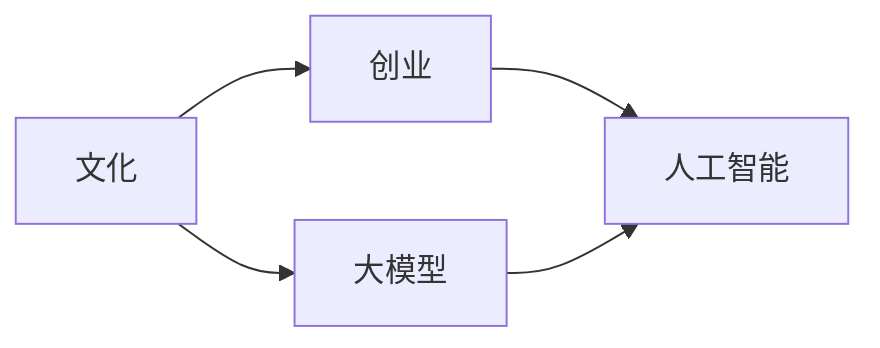

                 

## 1. 背景介绍

在全球数字化转型的浪潮下，人工智能（AI）大模型的应用已经成为创业公司制胜的关键。相较于传统的机器学习模型，大模型拥有更大的参数量和更丰富的知识库，可以处理更加复杂和抽象的任务。然而，大模型的成功并不仅仅是技术层面的胜利，更多的是文化和战略层面的决定。

### 1.1 大模型的崛起

过去十年间，深度学习模型和云计算的迅猛发展，使得大模型能够快速训练和部署，成为AI应用的主要驱动力。从图像识别、自然语言处理到医学诊断，大模型在各个领域展现出了强大的能力。然而，这些大模型的开发和应用并非一蹴而就，背后是大量的数据、算力和人才投入。

### 1.2 文化优势的重要性

文化在AI大模型的创业中扮演着至关重要的角色。文化不仅影响着公司团队的凝聚力和创新力，还直接决定了公司的战略方向和业务模式。优秀的文化能够在团队中形成一种共同的价值导向和行为准则，提升公司的执行力和竞争力。

本文将从多个维度深入探讨如何利用文化优势，助力AI大模型创业的成功。

## 2. 核心概念与联系

### 2.1 核心概念概述

在探讨利用文化优势前，首先需要明确几个核心概念及其之间的联系：

- **文化（Culture）**：指一个组织中共同的价值观念、行为规范和工作氛围。文化对公司的愿景、战略和执行力都有重要影响。
- **大模型（Large Model）**：指参数量巨大、能够处理复杂任务的AI模型，如BERT、GPT等。大模型的训练和应用需要庞大的计算资源和数据集。
- **创业（Entrepreneurship）**：指个人或团队在市场机会中识别、创新、整合资源，创造商业价值的过程。
- **人工智能（AI）**：指通过算法和模型处理和分析数据，模拟人类智能的技术。AI技术正在广泛渗透到各个行业，改变世界。

这些概念之间的联系主要体现在大模型创业过程中，文化能够塑造公司的战略方向、团队凝聚力、创新能力等，直接影响公司的市场表现和业务增长。

### 2.2 Mermaid 流程图

为了更好地理解这些概念之间的关系，我们可以构建以下Mermaid流程图：



这个流程图展示了文化、大模型、创业和人工智能之间的相互作用。

## 3. 核心算法原理 & 具体操作步骤

### 3.1 算法原理概述

基于大模型的AI创业，其核心算法原理主要包括以下几个方面：

- **数据准备**：收集和清洗大量的标注数据，构建大模型的训练集。
- **模型选择与训练**：选择合适的大模型架构，如Transformer，进行大规模训练。
- **业务应用**：将训练好的大模型应用到具体的业务场景中，如智能客服、医疗诊断、金融分析等。

### 3.2 算法步骤详解

1. **数据准备**：收集和清洗数据，确保数据的质量和多样性。这一步通常需要花费大量的时间和资源，但却是构建高质量大模型的基础。

2. **模型选择与训练**：根据业务需求选择合适的预训练模型，如BERT、GPT等。在GPU或TPU上进行大规模训练，调整超参数，优化损失函数。

3. **业务应用**：将训练好的模型集成到实际业务中，开发应用接口，实现自动化处理。这一步需要与业务团队紧密合作，确保模型能够满足实际需求。

4. **持续优化**：根据业务反馈和实际运行数据，持续优化模型和算法，提升模型的准确性和效率。

### 3.3 算法优缺点

**优点**：
- **泛化能力强**：大模型具备丰富的语言知识和常识，能够处理各种复杂的任务。
- **应用灵活**：可以在多个领域快速部署和应用，如自然语言处理、图像识别、语音识别等。
- **可解释性强**：大模型通常有较大的参数量和训练数据量，能够提供较为详细的输出解释。

**缺点**：
- **训练成本高**：大模型的训练需要大量的计算资源和数据，初期投入较大。
- **维护复杂**：大模型在实际应用中需要进行持续的优化和调整，维护成本较高。
- **数据依赖性高**：大模型的效果很大程度上取决于训练数据的质量和多样性。

### 3.4 算法应用领域

大模型在各个领域都有广泛的应用：

- **自然语言处理**：文本分类、情感分析、机器翻译、对话系统等。
- **图像识别**：图像分类、目标检测、人脸识别等。
- **语音识别**：语音识别、情感分析、文本转语音等。
- **医疗诊断**：疾病诊断、影像分析、病历分析等。
- **金融分析**：信用评估、风险管理、智能投顾等。
- **工业自动化**：智能制造、质量检测、预测维护等。

## 4. 数学模型和公式 & 详细讲解 & 举例说明

### 4.1 数学模型构建

构建大模型的数学模型主要涉及以下几个方面：

- **输入层**：将输入数据转换为模型可以处理的形式。
- **隐藏层**：通过多层神经网络处理输入数据，提取特征。
- **输出层**：根据业务需求设计输出格式，如分类、回归、序列生成等。

### 4.2 公式推导过程

以文本分类为例，假设输入为$x$，输出为$y$，模型的损失函数为$L$，使用交叉熵损失：

$$
L = -\frac{1}{N} \sum_{i=1}^N y_i \log M_{\theta}(x_i) + (1-y_i) \log (1-M_{\theta}(x_i))
$$

其中，$M_{\theta}(x_i)$为模型在输入$x_i$上的输出。

### 4.3 案例分析与讲解

以BERT模型为例，它的主要优点包括：

- **大规模预训练**：BERT模型在大规模无标签文本上进行预训练，学习到丰富的语言知识。
- **双向编码**：通过双向LSTM结构，能够更好地捕捉词语间的上下文关系。
- **微调适应性强**：通过微调，可以适应不同的下游任务，如文本分类、情感分析、命名实体识别等。

## 5. 项目实践：代码实例和详细解释说明

### 5.1 开发环境搭建

构建大模型的开发环境需要以下步骤：

1. **安装Python和相关库**：安装Python、Pip和必要的深度学习库，如TensorFlow、PyTorch等。
2. **准备数据集**：收集和清洗数据集，确保数据的质量和多样性。
3. **搭建计算环境**：配置GPU或TPU，确保模型训练的高效性。

### 5.2 源代码详细实现

以BERT模型为例，构建文本分类模型的代码实现如下：

```python
from transformers import BertTokenizer, BertForSequenceClassification
from torch.utils.data import Dataset, DataLoader
from sklearn.metrics import accuracy_score
import torch.nn as nn
import torch

class TextDataset(Dataset):
    def __init__(self, texts, labels):
        self.texts = texts
        self.labels = labels
        
    def __len__(self):
        return len(self.texts)
    
    def __getitem__(self, idx):
        text = self.texts[idx]
        label = self.labels[idx]
        encoding = tokenizer(text, return_tensors='pt', padding='max_length', truncation=True)
        return {'input_ids': encoding['input_ids'], 'attention_mask': encoding['attention_mask'], 'labels': torch.tensor(label, dtype=torch.long)}
        
tokenizer = BertTokenizer.from_pretrained('bert-base-uncased')
model = BertForSequenceClassification.from_pretrained('bert-base-uncased', num_labels=2)

# 定义损失函数和优化器
criterion = nn.CrossEntropyLoss()
optimizer = AdamW(model.parameters(), lr=2e-5)

# 训练模型
def train_epoch(model, dataset, batch_size):
    dataloader = DataLoader(dataset, batch_size=batch_size, shuffle=True)
    model.train()
    epoch_loss = 0
    for batch in dataloader:
        input_ids = batch['input_ids'].to(device)
        attention_mask = batch['attention_mask'].to(device)
        labels = batch['labels'].to(device)
        model.zero_grad()
        outputs = model(input_ids, attention_mask=attention_mask)
        loss = criterion(outputs.logits, labels)
        epoch_loss += loss.item()
        loss.backward()
        optimizer.step()
    return epoch_loss / len(dataloader)

# 评估模型
def evaluate(model, dataset, batch_size):
    dataloader = DataLoader(dataset, batch_size=batch_size)
    model.eval()
    correct = 0
    total = 0
    with torch.no_grad():
        for batch in dataloader:
            input_ids = batch['input_ids'].to(device)
            attention_mask = batch['attention_mask'].to(device)
            batch_labels = batch['labels'].to(device)
            outputs = model(input_ids, attention_mask=attention_mask)
            _, preds = torch.max(outputs.logits, dim=1)
            total += batch_labels.size(0)
            correct += (preds == batch_labels).sum().item()
    return accuracy_score(correct, total)
        
device = torch.device('cuda' if torch.cuda.is_available() else 'cpu')
model.to(device)

# 训练模型
epochs = 5
batch_size = 16

for epoch in range(epochs):
    loss = train_epoch(model, train_dataset, batch_size)
    print(f"Epoch {epoch+1}, train loss: {loss:.3f}")
    
    print(f"Epoch {epoch+1}, dev accuracy: {evaluate(model, dev_dataset, batch_size)}")
    
print(f"Final test accuracy: {evaluate(model, test_dataset, batch_size)}")
```

### 5.3 代码解读与分析

在上述代码中，我们首先定义了数据集类`TextDataset`，用于处理文本数据。然后，使用BERT模型和AdamW优化器，在GPU上进行了训练和评估。

## 6. 实际应用场景

### 6.1 智能客服系统

智能客服系统是大模型创业的重要应用场景之一。传统客服依赖人力，成本高且效率低。而使用大模型，可以通过自然语言处理技术，自动处理客户咨询，提供快速响应和高质量服务。

### 6.2 金融舆情监测

金融舆情监测是大模型创业的另一个重要应用。通过大模型，可以实时监测市场舆情，及时发现负面信息，规避金融风险。

### 6.3 个性化推荐系统

个性化推荐系统也是大模型创业的重要方向。通过大模型，可以深入挖掘用户兴趣，提供个性化的推荐内容，提升用户体验和满意度。

### 6.4 未来应用展望

未来，随着大模型的不断发展，其应用场景将更加广泛和深入。例如：

- **医疗健康**：通过大模型，可以辅助诊断、预测疾病，提高医疗服务的精准度和效率。
- **教育培训**：通过大模型，可以个性化推荐学习内容，提高教育效果。
- **智能制造**：通过大模型，可以优化生产流程，提高产品质量。
- **能源环保**：通过大模型，可以优化能源消耗，减少环境污染。

## 7. 工具和资源推荐

### 7.1 学习资源推荐

以下是一些推荐的学习资源，可以帮助你深入理解大模型创业：

- **《深度学习》by Ian Goodfellow**：系统介绍深度学习的基本原理和应用。
- **《Python深度学习》by François Chollet**：介绍如何使用Keras框架进行深度学习模型开发。
- **《TensorFlow官方文档》**：详细介绍了TensorFlow的使用方法和最佳实践。
- **《PyTorch官方文档》**：详细介绍了PyTorch的使用方法和最佳实践。
- **Kaggle**：数据科学竞赛平台，提供丰富的数据集和模型竞赛机会。

### 7.2 开发工具推荐

以下是一些推荐的开发工具，可以帮助你高效开发和部署大模型：

- **Jupyter Notebook**：交互式编程环境，支持Python和多种深度学习库。
- **Google Colab**：云环境，支持GPU计算，免费使用。
- **TensorBoard**：可视化工具，帮助监控和调试模型训练过程。
- **Weights & Biases**：实验跟踪工具，帮助记录和比较不同模型的训练结果。

### 7.3 相关论文推荐

以下是一些推荐的相关论文，可以帮助你深入理解大模型创业：

- **《Attention is All You Need》**：介绍Transformer模型，奠定了现代深度学习的基础。
- **《BERT: Pre-training of Deep Bidirectional Transformers for Language Understanding》**：介绍BERT模型，展示了预训练语言模型的强大能力。
- **《GPT-3: Language Models are Unsupervised Multitask Learners》**：介绍GPT模型，展示了大规模预训练语言模型的巨大潜力。
- **《Parameter-Efficient Transfer Learning for NLP》**：介绍参数高效微调方法，提高模型的计算效率。
- **《Prompt-Based Learning》**：介绍Prompt技术，提高模型的少样本学习能力。

## 8. 总结：未来发展趋势与挑战

### 8.1 研究成果总结

大模型创业在过去几年中取得了显著进展，其应用场景不断扩大，效果显著。然而，大模型创业也面临着诸多挑战，如数据获取、计算资源、技术壁垒等。

### 8.2 未来发展趋势

未来，大模型创业将呈现以下几个发展趋势：

- **数据量规模化**：随着数据的不断增长，大模型的训练规模将进一步扩大，模型的效果将更加精准。
- **计算资源多样化**：GPU、TPU、云计算等多样化的计算资源将支持大模型的训练和部署。
- **技术创新持续**：深度学习算法和架构的不断创新，将推动大模型创业向更深层次发展。
- **应用场景多样化**：大模型将广泛应用于各个行业，提升各行业的智能化水平。

### 8.3 面临的挑战

尽管大模型创业取得了显著进展，但仍面临诸多挑战：

- **数据隐私与安全**：大模型的训练和应用涉及大量的数据，如何保护用户隐私和数据安全是一个重要问题。
- **计算资源成本**：大模型的训练和部署需要大量的计算资源，成本较高。
- **技术复杂性**：大模型创业的技术门槛较高，需要大量的技术储备和团队支持。
- **市场竞争激烈**：大模型创业市场竞争激烈，需要不断创新和优化。

### 8.4 研究展望

未来，大模型创业需要在以下几个方面进行研究：

- **数据隐私保护**：开发高效的数据隐私保护技术，确保用户数据的安全。
- **计算资源优化**：优化大模型的训练和推理过程，降低计算资源成本。
- **技术创新**：持续进行深度学习算法和架构的创新，提升大模型的性能和效果。
- **应用场景拓展**：拓展大模型的应用场景，推动各行业的智能化转型。

## 9. 附录：常见问题与解答

**Q1: 大模型创业的第一步是什么？**

A: 大模型创业的第一步是数据准备。收集和清洗大量高质量的数据，构建训练集，这是构建高质量大模型的基础。

**Q2: 大模型的训练成本高吗？**

A: 大模型的训练确实需要大量的计算资源和数据，初期投入较大。但随着技术的进步和计算资源的丰富，大模型的训练成本也在逐步降低。

**Q3: 大模型创业需要哪些技术储备？**

A: 大模型创业需要掌握深度学习、计算机视觉、自然语言处理等技术，同时需要具备数据处理、模型部署和应用开发的能力。

**Q4: 大模型创业的成功因素有哪些？**

A: 大模型创业的成功需要良好的团队合作、强大的技术储备、合适的业务模式和充足的资金支持。

---

作者：禅与计算机程序设计艺术 / Zen and the Art of Computer Programming

