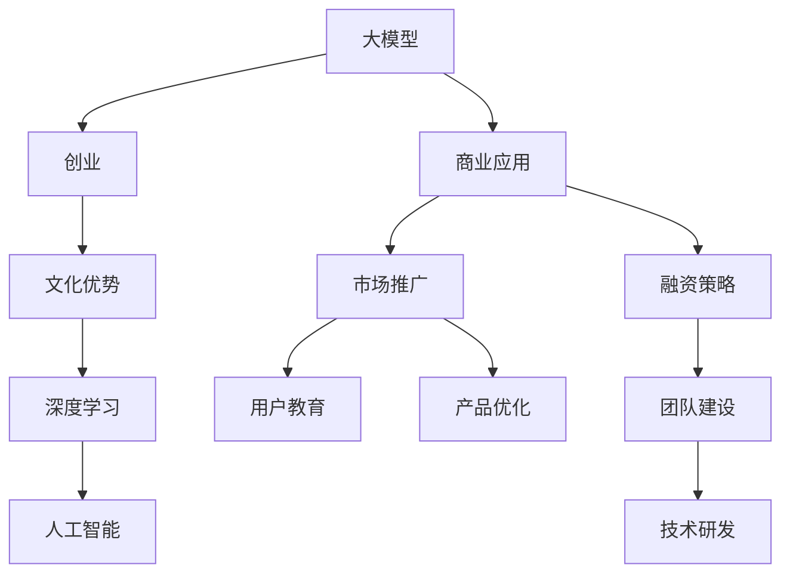

                 

# AI 大模型创业：如何利用文化优势？

> 关键词：大模型,创业,文化优势,深度学习,人工智能,商业应用

## 1. 背景介绍

### 1.1 问题由来

近年来，人工智能（AI）领域，尤其是深度学习和大模型技术的发展，为创业提供了前所未有的机遇。从Google的BERT、OpenAI的GPT-3到百度的ERNIE，各大科技巨头纷纷推出性能强劲、功能丰富的预训练大模型。这些模型在自然语言处理、计算机视觉、语音识别等多个领域展现了强大的能力。

然而，尽管大模型技术在技术层面取得了突破，但在商业化应用过程中，如何充分挖掘其商业价值，将其转化为具体的商业模式，仍是一大挑战。大模型创业企业在面临技术、市场、资金、人才等多重压力下，如何找到并利用自身独特的文化优势，成为决定其成败的关键。

### 1.2 问题核心关键点

大模型创业企业的文化优势，是指在企业文化、团队精神、产品设计、用户体验等方面所具备的独特优势，这些优势能够在市场竞争中形成差异化，增强企业竞争力。本文将从以下几个方面探讨如何利用文化优势：

1. **文化驱动创新**：利用独特的企业文化，促进创新和团队协作，提升产品和技术竞争力。
2. **文化塑造品牌**：通过文化内涵塑造品牌形象，提升用户粘性和品牌认知度。
3. **文化影响市场**：利用文化优势在市场推广和用户教育方面取得先机，提高市场渗透率。

## 2. 核心概念与联系

### 2.1 核心概念概述

- **大模型（Large Models）**：指具有数十亿甚至数百亿参数的深度学习模型，如BERT、GPT-3等，能够在多个领域实现高精度的预测和生成。
- **创业（Entrepreneurship）**：指创立和发展新企业的过程，包括产品开发、市场开拓、资金筹集、团队建设等环节。
- **文化优势（Cultural Advantage）**：指企业文化、团队精神、产品设计、用户体验等方面的独特优势，能够形成差异化竞争优势。
- **深度学习（Deep Learning）**：一种机器学习技术，通过多层次的神经网络结构，实现对复杂数据的高效处理和智能决策。
- **人工智能（AI）**：利用计算机模拟人脑的工作原理，实现智能化的处理和决策。

这些核心概念之间的关系可以通过以下Mermaid流程图来展示：



这个流程图展示了大模型、创业、文化优势、深度学习、人工智能等概念之间的逻辑关系：

1. 大模型是创业企业的重要技术基础。
2. 文化优势是在大模型基础上的延伸和创新。
3. 深度学习是实现大模型的关键技术。
4. 人工智能是大模型应用的广泛领域。
5. 商业应用是大模型技术最终的目标。
6. 市场推广、用户教育和产品优化是大模型应用的重要环节。
7. 融资策略和团队建设是创业企业的关键支持。
8. 技术研发是大模型商业化应用的保障。

## 3. 核心算法原理 & 具体操作步骤
### 3.1 算法原理概述

利用文化优势进行大模型创业，本质上是一个从企业文化到商业应用的全过程。其核心思想是：通过独特的企业文化和团队精神，引导大模型技术向创新和差异化方向发展，最终实现商业化应用。

具体来说，创业企业需要具备以下几个关键点：

1. **创新文化**：鼓励员工大胆创新，敢于尝试新技术和新模式。
2. **协作文化**：强调团队合作，促进跨部门协作，共同攻克技术难题。
3. **用户中心**：以用户需求为导向，设计符合用户需求的产品和服务。
4. **持续改进**：持续优化产品和服务，不断提高用户满意度和市场竞争力。

### 3.2 算法步骤详解

基于文化优势的大模型创业主要包括以下几个关键步骤：

**Step 1: 确定文化定位**

- 确定企业的核心文化价值观，如创新、协作、用户中心、持续改进等。
- 制定详细的文化战略，如文化宣传、员工培训、团队建设等。

**Step 2: 选择大模型技术**

- 根据企业文化和市场需求，选择合适的预训练大模型或自定义模型。
- 对大模型进行定制化改造，添加必要的任务适配层和损失函数。

**Step 3: 设计商业模式**

- 结合企业文化和市场情况，设计合理的商业模式，如SaaS、API、订阅等。
- 制定详细的商业计划书，明确市场目标、竞争策略、盈利模式等。

**Step 4: 产品开发和市场推广**

- 根据市场需求和用户反馈，设计并开发符合用户需求的产品和服务。
- 利用文化优势，在市场推广和用户教育方面取得先机，提升品牌认知度和市场渗透率。

**Step 5: 用户反馈和持续改进**

- 通过用户反馈和市场反馈，不断优化产品和服务，提升用户体验和满意度。
- 利用文化优势，鼓励员工持续创新，推动产品和技术不断进步。

### 3.3 算法优缺点

利用文化优势进行大模型创业的主要优点包括：

1. **差异化竞争**：独特的企业文化和团队精神，能够在市场竞争中形成差异化优势。
2. **快速响应市场**：企业文化中的创新和协作文化，能够迅速响应市场变化，推出符合市场需求的产品和服务。
3. **增强用户粘性**：用户中心和持续改进的文化，能够提升用户体验和满意度，增强用户粘性。

缺点包括：

1. **资源投入大**：需要大量资金和人力资源投入，以维持和推广企业文化。
2. **文化认同度低**：文化认同度低的企业，可能难以形成强大的凝聚力和向心力。
3. **市场风险高**：市场变化快，文化优势的持续性难以保证，存在市场风险。

### 3.4 算法应用领域

基于文化优势的大模型创业，可以广泛应用于以下几个领域：

- **自然语言处理（NLP）**：利用大模型进行文本生成、情感分析、问答系统等应用。
- **计算机视觉（CV）**：利用大模型进行图像识别、物体检测、场景理解等应用。
- **语音识别（ASR）**：利用大模型进行语音识别、语音合成、语音翻译等应用。
- **推荐系统**：利用大模型进行个性化推荐、内容生成等应用。
- **医疗健康**：利用大模型进行疾病诊断、医疗影像分析等应用。
- **金融服务**：利用大模型进行风险评估、客户服务、欺诈检测等应用。

## 4. 数学模型和公式 & 详细讲解 & 举例说明

### 4.1 数学模型构建

大模型创业中的文化优势，可以量化为以下几个指标：

- **创新指数（Innovation Index）**：衡量企业文化中的创新活动和成果。
- **协作指数（Collaboration Index）**：衡量企业文化中的团队协作情况。
- **用户满意度（User Satisfaction）**：衡量用户对产品和服务的满意度。
- **市场渗透率（Market Penetration Rate）**：衡量产品和服务在市场中的接受度和渗透率。

### 4.2 公式推导过程

假设创业企业的创新指数为 $I$，协作指数为 $C$，用户满意度为 $U$，市场渗透率为 $P$，则可以将这些指标进行量化表示：

$$
I = \sum_{i=1}^n a_i r_i, \quad a_i > 0
$$

$$
C = \sum_{i=1}^n b_i s_i, \quad b_i > 0
$$

$$
U = \sum_{i=1}^n c_i d_i, \quad c_i > 0
$$

$$
P = \sum_{i=1}^n e_i q_i, \quad e_i > 0
$$

其中，$r_i$、$s_i$、$d_i$、$q_i$ 为标准化后的指标值。

### 4.3 案例分析与讲解

以Google的BERT为例，其文化优势主要体现在以下几个方面：

- **创新文化**：Google鼓励员工大胆创新，提出新想法。通过内部的“Google Brain”团队，不断推动技术进步。
- **协作文化**：Google强调团队协作，每个项目都有跨部门团队的共同参与。这种协作文化使得BERT项目能够顺利推进。
- **用户中心**：Google的产品始终以用户为中心，注重用户体验。BERT的推出，就是基于用户的实际需求。
- **持续改进**：Google不断优化和更新BERT模型，提升其性能和应用范围。

通过这些文化优势，Google不仅在技术上取得了突破，还成功将其商业化，推动了NLP领域的发展。

## 5. 项目实践：代码实例和详细解释说明
### 5.1 开发环境搭建

进行大模型创业，需要一个高效的开发环境。以下是使用Python进行PyTorch开发的环境配置流程：

1. 安装Anaconda：从官网下载并安装Anaconda，用于创建独立的Python环境。
2. 创建并激活虚拟环境：
```bash
conda create -n pytorch-env python=3.8 
conda activate pytorch-env
```
3. 安装PyTorch：根据CUDA版本，从官网获取对应的安装命令。例如：
```bash
conda install pytorch torchvision torchaudio cudatoolkit=11.1 -c pytorch -c conda-forge
```
4. 安装Transformers库：
```bash
pip install transformers
```
5. 安装各类工具包：
```bash
pip install numpy pandas scikit-learn matplotlib tqdm jupyter notebook ipython
```

完成上述步骤后，即可在`pytorch-env`环境中开始大模型创业的开发实践。

### 5.2 源代码详细实现

下面我们以自然语言处理（NLP）领域的情感分析任务为例，给出使用Transformers库对BERT模型进行微调的PyTorch代码实现。

首先，定义情感分析任务的数据处理函数：

```python
from transformers import BertTokenizer
from torch.utils.data import Dataset
import torch

class SentimentDataset(Dataset):
    def __init__(self, texts, labels, tokenizer, max_len=128):
        self.texts = texts
        self.labels = labels
        self.tokenizer = tokenizer
        self.max_len = max_len
        
    def __len__(self):
        return len(self.texts)
    
    def __getitem__(self, item):
        text = self.texts[item]
        label = self.labels[item]
        
        encoding = self.tokenizer(text, return_tensors='pt', max_length=self.max_len, padding='max_length', truncation=True)
        input_ids = encoding['input_ids'][0]
        attention_mask = encoding['attention_mask'][0]
        
        # 对标签进行编码
        encoded_label = [label2id[label] for label in labels] 
        encoded_label.extend([label2id['O']] * (self.max_len - len(encoded_label)))
        labels = torch.tensor(encoded_label, dtype=torch.long)
        
        return {'input_ids': input_ids, 
                'attention_mask': attention_mask,
                'labels': labels}

# 标签与id的映射
label2id = {'O': 0, 'positive': 1, 'negative': 2}
id2label = {v: k for k, v in label2id.items()}

# 创建dataset
tokenizer = BertTokenizer.from_pretrained('bert-base-cased')

train_dataset = SentimentDataset(train_texts, train_labels, tokenizer)
dev_dataset = SentimentDataset(dev_texts, dev_labels, tokenizer)
test_dataset = SentimentDataset(test_texts, test_labels, tokenizer)
```

然后，定义模型和优化器：

```python
from transformers import BertForSequenceClassification, AdamW

model = BertForSequenceClassification.from_pretrained('bert-base-cased', num_labels=len(label2id))

optimizer = AdamW(model.parameters(), lr=2e-5)
```

接着，定义训练和评估函数：

```python
from torch.utils.data import DataLoader
from tqdm import tqdm
from sklearn.metrics import classification_report

device = torch.device('cuda') if torch.cuda.is_available() else torch.device('cpu')
model.to(device)

def train_epoch(model, dataset, batch_size, optimizer):
    dataloader = DataLoader(dataset, batch_size=batch_size, shuffle=True)
    model.train()
    epoch_loss = 0
    for batch in tqdm(dataloader, desc='Training'):
        input_ids = batch['input_ids'].to(device)
        attention_mask = batch['attention_mask'].to(device)
        labels = batch['labels'].to(device)
        model.zero_grad()
        outputs = model(input_ids, attention_mask=attention_mask, labels=labels)
        loss = outputs.loss
        epoch_loss += loss.item()
        loss.backward()
        optimizer.step()
    return epoch_loss / len(dataloader)

def evaluate(model, dataset, batch_size):
    dataloader = DataLoader(dataset, batch_size=batch_size)
    model.eval()
    preds, labels = [], []
    with torch.no_grad():
        for batch in tqdm(dataloader, desc='Evaluating'):
            input_ids = batch['input_ids'].to(device)
            attention_mask = batch['attention_mask'].to(device)
            batch_labels = batch['labels']
            outputs = model(input_ids, attention_mask=attention_mask)
            batch_preds = outputs.logits.argmax(dim=2).to('cpu').tolist()
            batch_labels = batch_labels.to('cpu').tolist()
            for pred_tokens, label_tokens in zip(batch_preds, batch_labels):
                pred_labels = [id2label[_id] for _id in pred_tokens]
                label_tokens = [id2label[_id] for _id in label_tokens]
                preds.append(pred_labels[:len(label_tokens)])
                labels.append(label_tokens)
                
    print(classification_report(labels, preds))
```

最后，启动训练流程并在测试集上评估：

```python
epochs = 5
batch_size = 16

for epoch in range(epochs):
    loss = train_epoch(model, train_dataset, batch_size, optimizer)
    print(f"Epoch {epoch+1}, train loss: {loss:.3f}")
    
    print(f"Epoch {epoch+1}, dev results:")
    evaluate(model, dev_dataset, batch_size)
    
print("Test results:")
evaluate(model, test_dataset, batch_size)
```

以上就是使用PyTorch对BERT进行情感分析任务微调的完整代码实现。可以看到，得益于Transformers库的强大封装，我们可以用相对简洁的代码完成BERT模型的加载和微调。

### 5.3 代码解读与分析

让我们再详细解读一下关键代码的实现细节：

**SentimentDataset类**：
- `__init__`方法：初始化文本、标签、分词器等关键组件。
- `__len__`方法：返回数据集的样本数量。
- `__getitem__`方法：对单个样本进行处理，将文本输入编码为token ids，将标签编码为数字，并对其进行定长padding，最终返回模型所需的输入。

**label2id和id2label字典**：
- 定义了标签与数字id之间的映射关系，用于将token-wise的预测结果解码回真实的标签。

**训练和评估函数**：
- 使用PyTorch的DataLoader对数据集进行批次化加载，供模型训练和推理使用。
- 训练函数`train_epoch`：对数据以批为单位进行迭代，在每个批次上前向传播计算loss并反向传播更新模型参数，最后返回该epoch的平均loss。
- 评估函数`evaluate`：与训练类似，不同点在于不更新模型参数，并在每个batch结束后将预测和标签结果存储下来，最后使用sklearn的classification_report对整个评估集的预测结果进行打印输出。

**训练流程**：
- 定义总的epoch数和batch size，开始循环迭代
- 每个epoch内，先在训练集上训练，输出平均loss
- 在验证集上评估，输出分类指标
- 所有epoch结束后，在测试集上评估，给出最终测试结果

可以看到，PyTorch配合Transformers库使得BERT微调的代码实现变得简洁高效。开发者可以将更多精力放在数据处理、模型改进等高层逻辑上，而不必过多关注底层的实现细节。

当然，工业级的系统实现还需考虑更多因素，如模型的保存和部署、超参数的自动搜索、更灵活的任务适配层等。但核心的微调范式基本与此类似。

## 6. 实际应用场景
### 6.1 智能客服系统

基于大语言模型微调的对话技术，可以广泛应用于智能客服系统的构建。传统客服往往需要配备大量人力，高峰期响应缓慢，且一致性和专业性难以保证。而使用微调后的对话模型，可以7x24小时不间断服务，快速响应客户咨询，用自然流畅的语言解答各类常见问题。

在技术实现上，可以收集企业内部的历史客服对话记录，将问题和最佳答复构建成监督数据，在此基础上对预训练对话模型进行微调。微调后的对话模型能够自动理解用户意图，匹配最合适的答案模板进行回复。对于客户提出的新问题，还可以接入检索系统实时搜索相关内容，动态组织生成回答。如此构建的智能客服系统，能大幅提升客户咨询体验和问题解决效率。

### 6.2 金融舆情监测

金融机构需要实时监测市场舆论动向，以便及时应对负面信息传播，规避金融风险。传统的人工监测方式成本高、效率低，难以应对网络时代海量信息爆发的挑战。基于大语言模型微调的文本分类和情感分析技术，为金融舆情监测提供了新的解决方案。

具体而言，可以收集金融领域相关的新闻、报道、评论等文本数据，并对其进行主题标注和情感标注。在此基础上对预训练语言模型进行微调，使其能够自动判断文本属于何种主题，情感倾向是正面、中性还是负面。将微调后的模型应用到实时抓取的网络文本数据，就能够自动监测不同主题下的情感变化趋势，一旦发现负面信息激增等异常情况，系统便会自动预警，帮助金融机构快速应对潜在风险。

### 6.3 个性化推荐系统

当前的推荐系统往往只依赖用户的历史行为数据进行物品推荐，无法深入理解用户的真实兴趣偏好。基于大语言模型微调技术，个性化推荐系统可以更好地挖掘用户行为背后的语义信息，从而提供更精准、多样的推荐内容。

在实践中，可以收集用户浏览、点击、评论、分享等行为数据，提取和用户交互的物品标题、描述、标签等文本内容。将文本内容作为模型输入，用户的后续行为（如是否点击、购买等）作为监督信号，在此基础上微调预训练语言模型。微调后的模型能够从文本内容中准确把握用户的兴趣点。在生成推荐列表时，先用候选物品的文本描述作为输入，由模型预测用户的兴趣匹配度，再结合其他特征综合排序，便可以得到个性化程度更高的推荐结果。

### 6.4 未来应用展望

随着大语言模型微调技术的发展，其应用范围将进一步拓展，为各个行业带来变革性影响。

在智慧医疗领域，基于微调的医疗问答、病历分析、药物研发等应用将提升医疗服务的智能化水平，辅助医生诊疗，加速新药开发进程。

在智能教育领域，微调技术可应用于作业批改、学情分析、知识推荐等方面，因材施教，促进教育公平，提高教学质量。

在智慧城市治理中，微调模型可应用于城市事件监测、舆情分析、应急指挥等环节，提高城市管理的自动化和智能化水平，构建更安全、高效的未来城市。

此外，在企业生产、社会治理、文娱传媒等众多领域，基于大模型微调的人工智能应用也将不断涌现，为NLP技术带来全新的突破。随着预训练语言模型和微调方法的不断进步，相信NLP技术将在更广阔的应用领域大放异彩，深刻影响人类的生产生活方式。

## 7. 工具和资源推荐
### 7.1 学习资源推荐

为了帮助开发者系统掌握大模型微调的理论基础和实践技巧，这里推荐一些优质的学习资源：

1. 《Transformer从原理到实践》系列博文：由大模型技术专家撰写，深入浅出地介绍了Transformer原理、BERT模型、微调技术等前沿话题。

2. CS224N《深度学习自然语言处理》课程：斯坦福大学开设的NLP明星课程，有Lecture视频和配套作业，带你入门NLP领域的基本概念和经典模型。

3. 《Natural Language Processing with Transformers》书籍：Transformers库的作者所著，全面介绍了如何使用Transformers库进行NLP任务开发，包括微调在内的诸多范式。

4. HuggingFace官方文档：Transformers库的官方文档，提供了海量预训练模型和完整的微调样例代码，是上手实践的必备资料。

5. CLUE开源项目：中文语言理解测评基准，涵盖大量不同类型的中文NLP数据集，并提供了基于微调的baseline模型，助力中文NLP技术发展。

通过对这些资源的学习实践，相信你一定能够快速掌握大模型微调的精髓，并用于解决实际的NLP问题。
###  7.2 开发工具推荐

高效的开发离不开优秀的工具支持。以下是几款用于大语言模型微调开发的常用工具：

1. PyTorch：基于Python的开源深度学习框架，灵活动态的计算图，适合快速迭代研究。大部分预训练语言模型都有PyTorch版本的实现。

2. TensorFlow：由Google主导开发的开源深度学习框架，生产部署方便，适合大规模工程应用。同样有丰富的预训练语言模型资源。

3. Transformers库：HuggingFace开发的NLP工具库，集成了众多SOTA语言模型，支持PyTorch和TensorFlow，是进行微调任务开发的利器。

4. Weights & Biases：模型训练的实验跟踪工具，可以记录和可视化模型训练过程中的各项指标，方便对比和调优。与主流深度学习框架无缝集成。

5. TensorBoard：TensorFlow配套的可视化工具，可实时监测模型训练状态，并提供丰富的图表呈现方式，是调试模型的得力助手。

6. Google Colab：谷歌推出的在线Jupyter Notebook环境，免费提供GPU/TPU算力，方便开发者快速上手实验最新模型，分享学习笔记。

合理利用这些工具，可以显著提升大语言模型微调任务的开发效率，加快创新迭代的步伐。

### 7.3 相关论文推荐

大语言模型和微调技术的发展源于学界的持续研究。以下是几篇奠基性的相关论文，推荐阅读：

1. Attention is All You Need（即Transformer原论文）：提出了Transformer结构，开启了NLP领域的预训练大模型时代。

2. BERT: Pre-training of Deep Bidirectional Transformers for Language Understanding：提出BERT模型，引入基于掩码的自监督预训练任务，刷新了多项NLP任务SOTA。

3. Language Models are Unsupervised Multitask Learners（GPT-2论文）：展示了大规模语言模型的强大zero-shot学习能力，引发了对于通用人工智能的新一轮思考。

4. Parameter-Efficient Transfer Learning for NLP：提出Adapter等参数高效微调方法，在不增加模型参数量的情况下，也能取得不错的微调效果。

5. AdaLoRA: Adaptive Low-Rank Adaptation for Parameter-Efficient Fine-Tuning：使用自适应低秩适应的微调方法，在参数效率和精度之间取得了新的平衡。

这些论文代表了大语言模型微调技术的发展脉络。通过学习这些前沿成果，可以帮助研究者把握学科前进方向，激发更多的创新灵感。

## 8. 总结：未来发展趋势与挑战
### 8.1 总结

本文对基于文化优势的大语言模型创业方法进行了全面系统的介绍。首先阐述了大语言模型和创业企业的文化优势，明确了两者之间的紧密联系。接着从理论到实践，详细讲解了文化驱动创新、文化塑造品牌、文化影响市场等方面的关键点，提供了大模型创业的完整步骤和具体操作细节。

通过本文的系统梳理，可以看到，利用文化优势进行大模型创业，不仅能够提升产品和技术竞争力，还能在市场推广和用户教育方面取得先机，推动企业快速发展。文化优势是大模型创业中不可或缺的重要因素，帮助企业在激烈的市场竞争中脱颖而出。

### 8.2 未来发展趋势

展望未来，大模型创业企业在利用文化优势方面，将呈现以下几个发展趋势：

1. **文化创新驱动**：未来的企业将更加注重文化创新，鼓励员工大胆尝试新想法，推动技术进步。
2. **协作文化深化**：跨部门协作文化将更加重要，通过团队合作，攻克技术难题，提升企业创新力。
3. **用户中心理念**：以用户为中心的理念将更加深入人心，用户反馈将成为企业决策的重要依据。
4. **持续改进机制**：企业将建立持续改进机制，不断优化产品和服务，提升用户体验和市场竞争力。

### 8.3 面临的挑战

尽管利用文化优势进行大模型创业带来了诸多优势，但仍面临一些挑战：

1. **文化认同度低**：文化认同度低的企业，可能难以形成强大的凝聚力和向心力，影响企业稳定发展。
2. **市场风险高**：市场变化快，文化优势的持续性难以保证，存在市场风险。
3. **资源投入大**：需要大量资金和人力资源投入，以维持和推广企业文化，成本较高。

### 8.4 研究展望

面对利用文化优势进行大模型创业所面临的挑战，未来的研究需要在以下几个方面寻求新的突破：

1. **文化认同度提升**：通过企业文化建设、员工培训等方式，提升团队文化认同度，增强企业的凝聚力和向心力。
2. **市场风险控制**：建立市场监控和风险预警机制，及时应对市场变化，降低市场风险。
3. **资源优化配置**：优化资源配置，提高资源利用效率，降低创业成本。

这些研究方向的探索，将有助于大模型创业企业在利用文化优势的过程中，更好地应对挑战，取得更大的成功。

## 9. 附录：常见问题与解答

**Q1：大模型创业企业的文化优势如何形成？**

A: 大模型创业企业的文化优势主要通过以下几个方面形成：

1. **企业文化建设**：明确企业的核心价值观，如创新、协作、用户中心、持续改进等。通过制度和文化宣传，将这些价值观融入到企业的方方面面。
2. **员工培训**：定期对员工进行企业文化培训，提升员工的文化认同度，增强团队凝聚力。
3. **团队协作**：鼓励跨部门协作，建立开放的沟通渠道，促进信息共享和技术交流。
4. **用户反馈**：重视用户反馈，及时改进产品和服务，提升用户体验和满意度。

**Q2：大模型创业企业如何利用文化优势进行市场推广？**

A: 利用文化优势进行市场推广，可以采取以下策略：

1. **品牌故事**：通过讲述企业创立的文化背景、发展历程、团队精神等，构建具有吸引力的品牌故事，提升品牌认知度和美誉度。
2. **社会责任**：强调企业的社会责任和公益事业，赢得用户的信任和支持。
3. **用户体验**：以用户为中心，提升产品和服务质量，通过用户口碑传播品牌。
4. **社区建设**：建立品牌社区，与用户建立互动和沟通，增强用户粘性。

**Q3：大模型创业企业在融资过程中需要注意哪些问题？**

A: 大模型创业企业在融资过程中，需要注意以下几个问题：

1. **融资目标明确**：明确融资的具体目标，如产品开发、市场推广、技术研发等，避免资金的盲目投入。
2. **风险评估**：对企业的发展前景、市场风险、技术风险进行全面评估，向投资者清晰呈现。
3. **投资者选择**：选择合适的投资者，考察其背景和实力，避免盲目跟风。
4. **股权结构**：合理设计股权结构，确保创始人对企业的控制权和决策权。

**Q4：大模型创业企业如何利用文化优势进行团队建设？**

A: 利用文化优势进行团队建设，可以采取以下策略：

1. **文化认同**：通过企业文化建设，增强员工的文化认同感，提升团队凝聚力。
2. **团队协作**：鼓励跨部门协作，建立开放的沟通渠道，促进信息共享和技术交流。
3. **员工培训**：定期对员工进行企业文化和技能培训，提升员工素质和能力。
4. **激励机制**：建立科学的激励机制，如股权激励、绩效奖金等，激发员工的积极性和创造力。

这些策略将帮助大模型创业企业打造一支有活力、有激情、有能力的团队，推动企业快速发展。

---

作者：禅与计算机程序设计艺术 / Zen and the Art of Computer Programming

