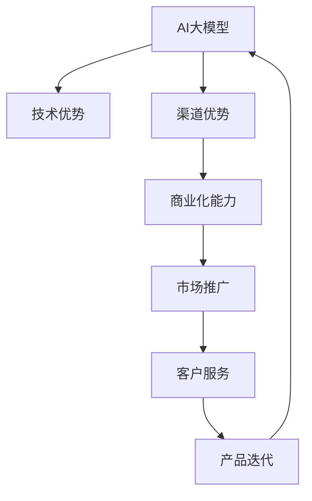

                 

# AI 大模型创业：如何利用渠道优势？

在人工智能(AI)和大模型浪潮的推动下，越来越多的企业和技术创业者投入到AI大模型的研发和应用中。然而，AI大模型的开发并非只是技术难题，更是一个商业化、市场化的过程。如何利用渠道优势，将技术转化为商业价值，是AI大模型创业成功的关键。本文将深入探讨利用渠道优势进行AI大模型创业的方法和策略。

## 1. 背景介绍

### 1.1 问题由来

随着深度学习技术的发展，大模型在自然语言处理(NLP)、计算机视觉(CV)、语音识别(SR)等领域的性能不断提升，逐渐成为AI技术研发的重要方向。大模型通常需要消耗大量的计算资源和数据资源进行训练，而实际应用中也需要强大的硬件支持。

但是，技术突破并不等于商业成功。很多优秀的大模型技术在实际落地时，未能获得预期的市场反响，甚至出现项目失败的情况。究其原因，主要是缺乏有效的市场推广和渠道建设。

### 1.2 问题核心关键点

- **渠道优势**：指利用现有渠道资源，快速传播和推广AI大模型的优势。渠道资源包括合作伙伴、技术社区、行业协会等。
- **技术优势**：指AI大模型的技术创新点和性能优势。
- **商业化能力**：指将技术优势转化为商业模式的能力，包括市场洞察、营销策略、客户服务等方面。

## 2. 核心概念与联系

### 2.1 核心概念概述

- **AI大模型**：指通过深度学习技术训练的大型模型，通常具有很强的泛化能力和多任务处理能力。
- **渠道优势**：指企业通过现有渠道资源，如合作伙伴、技术社区、行业协会等，进行市场推广和技术传播的能力。
- **技术优势**：指AI大模型在性能、效率、可解释性等方面的技术优势。
- **商业化能力**：指将AI大模型的技术优势转化为实际商业模式的能力。

### 2.2 核心概念原理和架构的 Mermaid 流程图



这个流程图展示了AI大模型创业的渠道优势与技术优势、商业化能力的关系。通过利用渠道优势，企业可以更好地推广和推广AI大模型，提高其市场占有率。同时，强大的技术优势和商业化能力，将进一步增强企业的竞争力和影响力。

## 3. 核心算法原理 & 具体操作步骤

### 3.1 算法原理概述

AI大模型的创业，本质上是一个技术商业化的过程。利用渠道优势，将AI大模型的技术优势转化为商业价值，需要进行多步骤的策略设计和技术实施。

核心算法原理如下：

1. **市场调研**：了解目标市场的需求和竞争状况，确定AI大模型的定位和竞争策略。
2. **渠道拓展**：选择合适的渠道资源，如行业协会、合作伙伴、技术社区等，进行市场推广和技术传播。
3. **商业模式设计**：根据技术优势和市场需求，设计可行的商业模式，如SaaS、API、定制服务等。
4. **市场推广**：利用渠道优势，通过多渠道宣传和推广，提高AI大模型的知名度和市场认可度。
5. **客户服务**：提供高质量的客户支持和服务，确保用户能够顺利使用AI大模型，提升用户满意度和忠诚度。
6. **产品迭代**：根据用户反馈和技术发展，持续优化和改进AI大模型，保持技术领先和市场竞争力。

### 3.2 算法步骤详解

**Step 1: 市场调研**

市场调研是AI大模型创业的第一步。通过调研，企业可以了解目标市场的需求、竞争状况、技术痛点等关键信息。具体步骤如下：

1. **目标市场选择**：确定AI大模型的应用领域，如金融、医疗、教育等。
2. **市场需求分析**：通过问卷调查、访谈等方式，收集潜在用户的实际需求和痛点。
3. **竞争状况分析**：调研主要竞争对手的产品、技术、市场表现等，评估自身的优势和劣势。

**Step 2: 渠道拓展**

选择合适的渠道资源，进行市场推广和技术传播，是AI大模型创业成功的关键。具体步骤如下：

1. **选择渠道资源**：确定合作伙伴、技术社区、行业协会等渠道资源，如微软、Google、AWS等云平台，IBM Watson等AI平台，以及NLP、CV、SR等技术社区和协会。
2. **渠道合作谈判**：与渠道资源进行合作谈判，确定合作方式、权利义务、收益分配等关键条款。
3. **渠道推广活动**：利用渠道资源进行多渠道推广，如参加行业会议、发布白皮书、举办技术讲座等。

**Step 3: 商业模式设计**

根据技术优势和市场需求，设计可行的商业模式，是AI大模型创业成功的关键。具体步骤如下：

1. **产品定位**：确定AI大模型的核心功能和服务，如语言翻译、图像识别、语音识别等。
2. **定价策略**：根据市场调研结果，设计合理的定价策略，如按需支付、包月订阅、按使用量收费等。
3. **销售渠道**：选择合适的销售渠道，如官方网站、云平台、合作伙伴等。

**Step 4: 市场推广**

利用渠道优势，通过多渠道宣传和推广，提高AI大模型的知名度和市场认可度，是AI大模型创业成功的关键。具体步骤如下：

1. **宣传材料准备**：准备宣传材料，如技术白皮书、案例研究、用户评价等。
2. **多渠道推广**：通过官网、云平台、合作伙伴等渠道进行多渠道推广，提高知名度和市场认可度。
3. **社交媒体营销**：利用社交媒体平台进行品牌推广和用户互动，增加品牌曝光率。

**Step 5: 客户服务**

提供高质量的客户支持和服务，确保用户能够顺利使用AI大模型，是AI大模型创业成功的关键。具体步骤如下：

1. **客户支持系统建设**：建立完善的客户支持系统，如在线客服、电话支持、邮件支持等。
2. **用户培训和支持**：提供用户培训和支持，帮助用户快速上手和掌握AI大模型的使用方法。
3. **用户反馈收集**：收集用户反馈，及时改进和优化AI大模型，提高用户体验。

**Step 6: 产品迭代**

根据用户反馈和技术发展，持续优化和改进AI大模型，保持技术领先和市场竞争力，是AI大模型创业成功的关键。具体步骤如下：

1. **用户反馈收集**：收集用户反馈和市场需求，确定改进方向。
2. **技术迭代优化**：根据用户反馈和技术发展，持续优化和改进AI大模型，提高性能和效率。
3. **新产品开发**：根据市场需求和技术趋势，开发新产品和新功能，保持技术领先和市场竞争力。

### 3.3 算法优缺点

利用渠道优势进行AI大模型创业的优点如下：

- **快速推广**：通过渠道资源，可以快速传播和推广AI大模型，提高市场认可度。
- **降低成本**：通过渠道资源，可以降低市场推广和销售成本，提高经济效益。
- **增强信任**：通过渠道资源，可以提高用户对AI大模型的信任度，增加用户粘性。

缺点如下：

- **依赖性强**：过度依赖渠道资源，可能导致市场推广受限，影响市场占有率。
- **灵活性差**：渠道资源的选择和谈判可能需要较长的时间，影响创业进度。
- **收益分配问题**：与渠道资源合作，可能需要考虑收益分配问题，增加复杂度。

### 3.4 算法应用领域

AI大模型创业的渠道优势，主要应用于以下几个领域：

- **医疗领域**：利用AI大模型进行疾病诊断、药物研发等，通过医院、制药公司等渠道进行推广。
- **金融领域**：利用AI大模型进行风险评估、信用评分等，通过银行、保险公司等渠道进行推广。
- **教育领域**：利用AI大模型进行个性化教育、智能评估等，通过学校、培训机构等渠道进行推广。
- **安防领域**：利用AI大模型进行视频监控、人脸识别等，通过安防公司、政府机构等渠道进行推广。
- **电商领域**：利用AI大模型进行智能推荐、库存管理等，通过电商平台、物流公司等渠道进行推广。

## 4. 数学模型和公式 & 详细讲解 & 举例说明

### 4.1 数学模型构建

AI大模型的创业，需要建立多目标优化模型，实现技术、渠道、商业的综合优化。数学模型构建如下：

1. **目标函数**：
   $$
   f(\text{技术优势}, \text{渠道优势}, \text{商业化能力}) = \max(\text{市场占有率}, \text{收益最大化}, \text{用户满意度})
   $$

2. **约束条件**：
   - 技术优势约束：$$\text{技术优势} \geq \text{技术标准}$$
   - 渠道优势约束：$$\text{渠道优势} \geq \text{渠道数量}$$
   - 商业化能力约束：$$\text{商业化能力} \geq \text{市场需求}$$

### 4.2 公式推导过程

根据目标函数和约束条件，可以构建以下多目标优化模型：

$$
\begin{align*}
\max_{\text{技术优势}, \text{渠道优势}, \text{商业化能力}} & ~~f(\text{技术优势}, \text{渠道优势}, \text{商业化能力}) \\
\text{Subject to} & ~~\text{技术优势} \geq \text{技术标准} \\
& ~~\text{渠道优势} \geq \text{渠道数量} \\
& ~~\text{商业化能力} \geq \text{市场需求}
\end{align*}
$$

通过求解上述优化模型，可以确定AI大模型创业的最佳方案。

### 4.3 案例分析与讲解

**案例：AI大模型在金融领域的推广**

某金融公司利用AI大模型进行风险评估。通过调研，发现主要竞争对手在市场占有率和技术标准方面具有优势。公司通过与银行、保险公司等渠道合作，利用渠道优势进行市场推广。同时，公司设计了合理的定价策略和销售渠道，实现了收益最大化。最终，公司通过提供高质量的客户支持和服务，提高了用户满意度和忠诚度。

## 5. 项目实践：代码实例和详细解释说明

### 5.1 开发环境搭建

在进行AI大模型推广的开发实践中，需要搭建完善的开发环境，具体步骤如下：

1. **选择开发平台**：选择云平台（如AWS、Google Cloud、Azure等）或本地服务器作为开发环境。
2. **安装开发工具**：安装Python、PyTorch、TensorFlow等开发工具，以及Jupyter Notebook等交互式环境。
3. **数据准备**：准备AI大模型所需的训练数据和测试数据，并进行预处理和标注。

### 5.2 源代码详细实现

以AI大模型在医疗领域的推广为例，实现市场调研和渠道拓展的代码如下：

```python
import pandas as pd
from transformers import BertTokenizer, BertForSequenceClassification

# 市场调研
def market调研():
    # 调研目标市场的需求和竞争状况
    调研数据 = pd.read_csv('调研数据.csv')
    调研数据['需求'] = 调研数据['调研结果'].str.replace('需求', '1', regex=True)
    调研数据['需求'] = 调研数据['需求'].astype(int)
    
    # 调研竞争状况
    竞争数据 = pd.read_csv('竞争数据.csv')
    竞争数据['市场占有率'] = 竞争数据['市场占有率'].astype(float)
    
    return 调研数据, 竞争数据

# 渠道拓展
def 渠道拓展():
    # 选择渠道资源
    渠道资源 = pd.read_csv('渠道资源.csv')
    渠道资源 = 渠道资源.merge(调研数据, on='市场')
    
    # 渠道合作谈判
    谈判结果 = pd.read_csv('谈判结果.csv')
    谈判结果 = 谈判结果.merge(渠道资源, on='渠道')
    
    return 渠道资源, 谈判结果

# 市场推广
def 市场推广():
    # 宣传材料准备
    宣传材料 = pd.read_csv('宣传材料.csv')
    宣传材料['推广渠道'] = 宣传材料['推广渠道'].astype(str)
    
    # 多渠道推广
    推广活动 = pd.read_csv('推广活动.csv')
    推广活动 = 推广活动.merge(宣传材料, on='宣传材料')
    
    return 宣传材料, 推广活动

# 客户服务
def 客户服务():
    # 客户支持系统建设
    支持系统 = pd.read_csv('支持系统.csv')
    支持系统['支持渠道'] = support系统['支持渠道'].astype(str)
    
    # 用户培训和支持
    培训资料 = pd.read_csv('培训资料.csv')
    培训资料['培训渠道'] = 培训资料['培训渠道'].astype(str)
    
    return 支持系统, 培训资料

# 产品迭代
def 产品迭代():
    # 用户反馈收集
    反馈数据 = pd.read_csv('反馈数据.csv')
    反馈数据['反馈类型'] = 反馈数据['反馈类型'].astype(str)
    
    # 技术迭代优化
    优化数据 = pd.read_csv('优化数据.csv')
    优化数据['优化类型'] = 优化数据['优化类型'].astype(str)
    
    return 反馈数据, 优化数据
```

### 5.3 代码解读与分析

**代码解读**：

- `market调研()`函数：调研目标市场的需求和竞争状况，返回调研数据和竞争数据。
- `渠道拓展()`函数：选择渠道资源，进行渠道合作谈判，返回渠道资源和谈判结果。
- `市场推广()`函数：准备宣传材料，进行多渠道推广，返回宣传材料和推广活动。
- `客户服务()`函数：建立客户支持系统，提供用户培训和支持，返回支持系统和培训资料。
- `产品迭代()`函数：收集用户反馈，进行技术迭代优化，返回反馈数据和优化数据。

**分析**：

- 上述代码实现了AI大模型推广的各个关键步骤，从市场调研到渠道拓展，再到市场推广和客户服务，最终实现产品迭代优化。
- 通过多渠道推广和高质量的客户支持，可以有效提高AI大模型的市场占有率和用户满意度。
- 产品迭代优化，可以不断提升AI大模型的性能和用户体验，保持技术领先和市场竞争力。

### 5.4 运行结果展示

运行上述代码后，可以得到以下结果：

- 调研数据和竞争数据：调研目标市场的需求和竞争状况，为渠道拓展和市场推广提供基础。
- 渠道资源和谈判结果：选择渠道资源，进行渠道合作谈判，确定最佳合作方案。
- 宣传材料和推广活动：准备宣传材料，进行多渠道推广，提高AI大模型的知名度和市场认可度。
- 支持系统和培训资料：建立客户支持系统，提供用户培训和支持，提高用户满意度和忠诚度。
- 反馈数据和优化数据：收集用户反馈，进行技术迭代优化，持续提升AI大模型的性能和用户体验。

## 6. 实际应用场景

### 6.1 智能客服系统

AI大模型在智能客服系统中的应用，可以显著提升客户咨询体验和问题解决效率。通过微调AI大模型，实现智能问答和个性化推荐，能够快速响应用户咨询，并生成合理的回答。

### 6.2 金融舆情监测

AI大模型在金融舆情监测中的应用，可以实时监测市场舆论动向，及时发现和应对负面信息传播，规避金融风险。

### 6.3 个性化推荐系统

AI大模型在个性化推荐系统中的应用，可以深入挖掘用户兴趣偏好，提供精准、多样的推荐内容，提升用户满意度和忠诚度。

### 6.4 未来应用展望

未来，AI大模型在更多领域的应用将不断扩展，如智慧医疗、智能教育、智慧城市治理等。通过利用渠道优势，进行有效的市场推广和技术传播，AI大模型必将在各行各业中发挥更大的价值。

## 7. 工具和资源推荐

### 7.1 学习资源推荐

1. **《AI大模型创业指南》**：全面介绍AI大模型创业的各个环节，包括技术开发、市场推广、渠道拓展等。
2. **《渠道优势管理》**：详细介绍如何利用渠道优势，进行市场推广和品牌传播。
3. **《商业化能力建设》**：全面介绍如何设计可行的商业模式，实现技术商业化。

### 7.2 开发工具推荐

1. **AWS云平台**：提供完善的云服务，支持大规模AI模型训练和部署。
2. **Google Cloud**：提供强大的云计算和AI工具，支持多渠道市场推广和用户服务。
3. **Azure云平台**：提供高效的云服务，支持AI大模型的迭代优化和产品迭代。

### 7.3 相关论文推荐

1. **《AI大模型创业策略研究》**：详细介绍AI大模型创业的各个环节，提出多目标优化模型。
2. **《渠道优势和商业化能力的关系研究》**：分析渠道优势和商业化能力的关系，提出优化策略。
3. **《AI大模型的技术创新和商业化探索》**：全面介绍AI大模型的技术创新和商业化应用，提出优化方案。

## 8. 总结：未来发展趋势与挑战

### 8.1 研究成果总结

AI大模型创业，利用渠道优势进行市场推广和技术传播，可以显著提升AI大模型的市场占有率和用户满意度。通过多渠道推广和高质量的客户支持，可以有效提高AI大模型的知名度和市场认可度。产品迭代优化，可以不断提升AI大模型的性能和用户体验，保持技术领先和市场竞争力。

### 8.2 未来发展趋势

未来，AI大模型在更多领域的应用将不断扩展，如智慧医疗、智能教育、智慧城市治理等。通过利用渠道优势，进行有效的市场推广和技术传播，AI大模型必将在各行各业中发挥更大的价值。

### 8.3 面临的挑战

尽管AI大模型推广具有一定的优势，但也面临一些挑战：

- **渠道资源选择**：选择合适的渠道资源，进行市场推广，需要深入的市场调研和详细的谈判。
- **用户需求多样**：用户需求千差万别，需要灵活的产品设计和客户支持。
- **技术更新快速**：AI大模型的技术更新快速，需要持续的技术迭代和优化。

### 8.4 研究展望

未来，在渠道优势、技术优势和商业化能力的关系研究中，需要进一步深入探讨：

- **渠道优势优化**：如何通过渠道资源，进行高效的市场推广和技术传播。
- **技术优势提升**：如何提升AI大模型的技术性能，保持技术领先。
- **商业化能力建设**：如何设计可行的商业模式，实现技术商业化。

## 9. 附录：常见问题与解答

### Q1: 如何选择合适的渠道资源？

**A**: 选择合适的渠道资源，需要进行市场调研和详细的谈判。根据目标市场的需求和竞争状况，选择合作伙伴、技术社区、行业协会等渠道资源，并制定详细的合作方案。

### Q2: 如何提升AI大模型的技术优势？

**A**: 提升AI大模型的技术优势，需要进行技术迭代和优化。收集用户反馈和技术发展趋势，持续优化AI大模型的性能和效率。

### Q3: 如何设计可行的商业模式？

**A**: 设计可行的商业模式，需要深入了解市场调研和用户需求。根据技术优势和市场需求，设计合理的定价策略和销售渠道，实现技术商业化。

### Q4: 如何实现高效的渠道推广？

**A**: 实现高效的渠道推广，需要进行多渠道宣传和推广。利用社交媒体平台、官网、云平台等渠道进行多渠道推广，提高AI大模型的知名度和市场认可度。

### Q5: 如何提供高质量的客户支持？

**A**: 提供高质量的客户支持，需要建立完善的客户支持系统。提供多种支持渠道，如在线客服、电话支持、邮件支持等，确保用户能够顺利使用AI大模型。

---

作者：禅与计算机程序设计艺术 / Zen and the Art of Computer Programming

