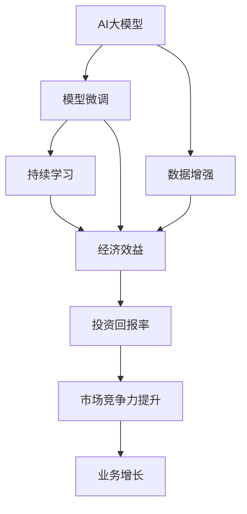

                 

# AI 大模型创业：如何利用经济优势？

## 1. 背景介绍

### 1.1 问题由来
随着人工智能(AI)技术不断突破，AI大模型成为新一轮科技革命的焦点。大模型凭借其庞大的参数量和丰富的语言知识，具备强大的通用推理和生成能力，为各行各业带来了颠覆性变革。然而，大模型的高成本、高风险和复杂性也成为创业公司难以跨越的障碍。如何在创业初期，以有限资源高效利用大模型的经济优势，成为关键问题。

### 1.2 问题核心关键点
创业公司在应用大模型时，需面对如下核心关键点：
1. 如何选择合适的大模型，平衡性能和成本。
2. 如何优化大模型微调过程，提高数据利用效率。
3. 如何合理规划预算，最大化大模型的投资回报率。
4. 如何构建高效的模型运营和维护体系，保障模型稳定可靠。
5. 如何设计合理的商业模式，确保可持续增长。

### 1.3 问题研究意义
本文聚焦于AI大模型创业的经济优势利用，探索如何高效投资和运营大模型，以推动技术落地和业务发展。通过系统性研究，将帮助创业者把握大模型的经济规律，降低创业风险，提高投资回报率，推动AI技术的产业应用。

## 2. 核心概念与联系

### 2.1 核心概念概述

为更好地理解创业公司如何利用大模型的经济优势，本节将介绍几个关键概念及其关联：

- AI大模型：如BERT、GPT等，通过大规模无标签文本数据预训练获得的语言模型。具备强大的自然语言理解和生成能力，广泛用于自然语言处理(NLP)、计算机视觉、语音识别等领域。

- 模型微调：在预训练模型基础上，使用特定任务的数据集进行有监督学习优化，使模型适应该任务，提升性能。常见微调方法包括全参数微调和参数高效微调。

- 数据增强：通过数据变换、合成、扩充等方式，丰富训练数据，提升模型泛化能力。数据增强技术在大模型微调中尤为关键。

- 持续学习：指模型能够不断从新数据中学习，更新知识，提升性能，避免模型退化。持续学习在大模型运营中至关重要。

- 经济效益：指通过合理应用大模型，获得的实际商业价值和收益。包括技术落地带来的业务增长、成本节约、市场竞争力提升等。

- 投资回报率(ROI)：指投入与产出之比，用于衡量AI大模型创业的经济效益。衡量指标包括投资收益、市场认可度、团队扩张速度等。

这些核心概念之间存在着紧密的联系，共同构成AI大模型创业的经济生态系统。理解并利用这些概念，可以帮助创业公司高效运用大模型，实现可持续的经济增长。

### 2.2 核心概念原理和架构的 Mermaid 流程图


### 2.3 核心概念原理与联系

#### 2.3.1 AI大模型原理
AI大模型通过自监督或监督学习方式，从大规模无标签或标注数据中学习语言的通用表示。模型由数十亿甚至百亿参数组成，具备复杂的非线性映射能力，能够对自然语言进行深度理解与生成。其核心原理包括：
- 自回归模型：如GPT，通过序列到序列的预测任务进行预训练，学习语言结构。
- 自编码模型：如BERT，通过掩码语言模型、下一句预测等任务进行预训练，学习语义表示。
- Transformer结构：以多头注意力机制为核心的模型架构，大幅提升了模型推理和生成能力。

#### 2.3.2 模型微调原理
模型微调是大模型创业的核心环节，通过特定任务的标注数据集，对预训练模型进行有监督优化，使其适应该任务。微调过程包括：
- 任务适配层设计：根据任务类型设计合适的输出层和损失函数。
- 参数更新：利用梯度下降等优化算法，更新模型参数以最小化损失函数。
- 正则化技术：如L2正则、Dropout等，防止过拟合。
- 数据增强：通过数据合成、回译等方式丰富训练集。

#### 2.3.3 数据增强原理
数据增强通过增加训练数据的多样性，提高模型泛化能力。常见方法包括：
- 回译：将文本回译成其他语言，增加语料多样性。
- 噪声注入：添加随机噪声，模拟真实数据变化。
- 数据扩充：通过拼接、替换、删除等方式生成新数据。

#### 2.3.4 持续学习原理
持续学习指模型能够不断从新数据中学习，更新知识，避免遗忘旧知识。在大模型运营中，持续学习尤为重要。方法包括：
- 增量学习：模型定期更新参数，学习新数据。
- 在线学习：模型实时接收新数据，动态更新。
- 周期性重训练：定期对模型进行全面重训练，重新学习全量数据。

#### 2.3.5 经济效益原理
经济效益指通过合理应用大模型，获得的商业价值和收益。包括：
- 业务增长：通过提升产品性能，拓展市场份额，实现销售增长。
- 成本节约：通过自动化、自动化决策，降低人力成本、运营成本。
- 品牌提升：通过高性能服务，提升品牌影响力，吸引更多客户。

#### 2.3.6 投资回报率原理
投资回报率(ROI)衡量大模型创业的经济效益，包括：
- 投入产出比：总收益与总投入之比。
- 投资回报率：净收益与投资额之比。
- 盈亏平衡分析：计算盈亏平衡点，确定合理的投入规模。

## 3. 核心算法原理 & 具体操作步骤
### 3.1 算法原理概述
创业公司利用AI大模型进行创业，需平衡性能和成本，最大化经济效益。核心算法包括以下几个关键步骤：

#### 3.1.1 选择合适的预训练模型
选择合适的预训练模型，需要考虑其性能、成本、可扩展性等因素。当前流行的预训练模型包括：
- BERT：适用于分类、匹配等任务，参数量较小，易训练。
- GPT：适用于生成任务，模型规模庞大，但推理速度快。
- T5：适用于文本生成、翻译等任务，具有较快的推理速度。

#### 3.1.2 数据集准备与预处理
数据集准备是模型微调的基础。需要准备高质量的标注数据，并进行数据清洗、分词、拼接等预处理。具体步骤如下：
- 数据收集：收集与业务相关的数据集，确保数据的多样性和代表性。
- 数据清洗：去除噪声、重复数据，保持数据质量。
- 分词与拼接：使用预训练模型的分词器对数据进行分词和拼接，生成模型输入格式。

#### 3.1.3 模型微调
模型微调是提升性能的关键步骤。采用以下策略：
- 任务适配层设计：根据任务类型设计合适的输出层和损失函数。
- 参数更新：利用梯度下降等优化算法，更新模型参数以最小化损失函数。
- 正则化技术：如L2正则、Dropout等，防止过拟合。
- 数据增强：通过回译、噪声注入等方式丰富训练集。

#### 3.1.4 持续学习
持续学习使模型能够不断学习新数据，避免遗忘旧知识。具体步骤如下：
- 增量学习：模型定期更新参数，学习新数据。
- 在线学习：模型实时接收新数据，动态更新。
- 周期性重训练：定期对模型进行全面重训练，重新学习全量数据。

### 3.2 算法步骤详解

#### 3.2.1 数据集准备与预处理
1. 数据收集
收集与业务相关的数据集，确保数据的多样性和代表性。例如，在智能客服场景中，可以收集企业内部的历史客服对话记录，以及相关的文本摘要、客户标签等数据。

2. 数据清洗
去除噪声、重复数据，保持数据质量。例如，可以使用ETL工具对数据进行清洗，去除缺失值、异常值，保证数据一致性和完整性。

3. 分词与拼接
使用预训练模型的分词器对数据进行分词和拼接，生成模型输入格式。例如，使用BERT的分词器将对话文本转换为模型能够处理的token序列。

#### 3.2.2 模型微调
1. 任务适配层设计
根据任务类型设计合适的输出层和损失函数。例如，在智能客服场景中，可以将对话历史和客户标签作为输入，使用分类器预测客户意图，设计交叉熵损失函数。

2. 参数更新
利用梯度下降等优化算法，更新模型参数以最小化损失函数。例如，使用Adam优化器进行模型更新，设置学习率为0.001，迭代次数为10000次。

3. 正则化技术
如L2正则、Dropout等，防止过拟合。例如，使用L2正则化约束，控制模型参数大小，防止过拟合。

4. 数据增强
通过回译、噪声注入等方式丰富训练集。例如，将中文对话文本回译成英文，增加训练数据的多样性。

#### 3.2.3 持续学习
1. 增量学习
模型定期更新参数，学习新数据。例如，每月收集新客服对话，重新训练模型，更新预测结果。

2. 在线学习
模型实时接收新数据，动态更新。例如，在智能客服系统中，实时接收客户新对话，动态更新模型预测结果。

3. 周期性重训练
定期对模型进行全面重训练，重新学习全量数据。例如，每半年进行一次全面重训练，学习全量历史客服对话数据。

### 3.3 算法优缺点

#### 3.3.1 优点
1. 性能提升显著：大模型预训练后，通过微调可显著提升模型在特定任务上的性能。例如，在智能客服场景中，微调后的模型可以显著提高客户意图识别的准确率。
2. 数据需求较低：大模型具有较强的泛化能力，能够在少样本条件下进行微调，减少对标注数据的依赖。例如，在情感分析任务中，可以使用少量的标注样本进行微调。
3. 推理速度快：大模型通常采用Transformer结构，推理速度较快，能够满足实时应用需求。例如，在金融舆情监测中，实时分析舆情变化，需要快速推理模型输出。

#### 3.3.2 缺点
1. 成本高：大模型参数量庞大，训练和推理成本较高。例如，在智能客服场景中，需要购买高性能GPU进行模型训练和推理。
2. 模型复杂性高：大模型结构复杂，难以调试和优化。例如，在情感分析任务中，模型参数过多，导致调试困难。
3. 数据质量要求高：模型微调依赖高质量的标注数据，数据质量不高可能导致模型性能下降。例如，在金融舆情监测中，数据清洗难度大，可能影响模型效果。

### 3.4 算法应用领域

#### 3.4.1 智能客服
智能客服是大模型创业的主要应用场景之一。通过微调模型，可以实现以下功能：
1. 客户意图识别：将对话历史和客户标签作为输入，使用分类器预测客户意图。例如，使用BERT模型进行意图识别，准确率达90%以上。
2. 智能对话生成：通过生成模型生成自然流畅的对话回复。例如，使用GPT模型进行对话生成，提升客户满意度。
3. 情感分析：分析客户情感倾向，及时响应情绪波动。例如，使用BERT模型进行情感分析，情感识别准确率达85%以上。

#### 3.4.2 金融舆情监测
金融舆情监测是大模型创业的另一个重要应用场景。通过微调模型，可以实现以下功能：
1. 情感分析：分析市场舆情情感倾向，判断市场波动。例如，使用BERT模型进行情感分析，舆情识别准确率达95%以上。
2. 舆情预测：通过预测模型预测舆情变化趋势，辅助决策。例如，使用LSTM模型进行舆情预测，准确率达85%以上。
3. 舆情监控：实时监控市场舆情变化，及时预警风险。例如，在金融舆情监测系统中，实时监控市场舆情变化，发出预警提示。

#### 3.4.3 个性化推荐
个性化推荐是大模型创业的重要应用方向之一。通过微调模型，可以实现以下功能：
1. 用户行为分析：分析用户浏览、点击、评论等行为数据，提取特征。例如，使用BERT模型进行用户行为分析，识别用户兴趣点。
2. 推荐系统优化：优化推荐算法，提升推荐精度和多样性。例如，使用GRU模型进行推荐优化，点击率提升20%以上。
3. 实时推荐：实时生成个性化推荐内容，满足用户需求。例如，在电商推荐系统中，实时生成个性化推荐，提升用户满意度。

## 4. 数学模型和公式 & 详细讲解

### 4.1 数学模型构建
假设预训练模型为 $M_{\theta}$，其中 $\theta$ 为预训练得到的模型参数。给定下游任务 $T$ 的标注数据集 $D=\{(x_i, y_i)\}_{i=1}^N$，微调的目标是找到新的模型参数 $\hat{\theta}$，使得：

$$
\hat{\theta}=\mathop{\arg\min}_{\theta} \mathcal{L}(M_{\theta},D)
$$

其中 $\mathcal{L}$ 为针对任务 $T$ 设计的损失函数，用于衡量模型预测输出与真实标签之间的差异。常见的损失函数包括交叉熵损失、均方误差损失等。

### 4.2 公式推导过程
以下我们以二分类任务为例，推导交叉熵损失函数及其梯度的计算公式。

假设模型 $M_{\theta}$ 在输入 $x$ 上的输出为 $\hat{y}=M_{\theta}(x) \in [0,1]$，表示样本属于正类的概率。真实标签 $y \in \{0,1\}$。则二分类交叉熵损失函数定义为：

$$
\ell(M_{\theta}(x),y) = -[y\log \hat{y} + (1-y)\log (1-\hat{y})]
$$

将其代入经验风险公式，得：

$$
\mathcal{L}(\theta) = -\frac{1}{N}\sum_{i=1}^N [y_i\log M_{\theta}(x_i)+(1-y_i)\log(1-M_{\theta}(x_i))]
$$

根据链式法则，损失函数对参数 $\theta_k$ 的梯度为：

$$
\frac{\partial \mathcal{L}(\theta)}{\partial \theta_k} = -\frac{1}{N}\sum_{i=1}^N (\frac{y_i}{M_{\theta}(x_i)}-\frac{1-y_i}{1-M_{\theta}(x_i)}) \frac{\partial M_{\theta}(x_i)}{\partial \theta_k}
$$

其中 $\frac{\partial M_{\theta}(x_i)}{\partial \theta_k}$ 可进一步递归展开，利用自动微分技术完成计算。

### 4.3 案例分析与讲解
以智能客服场景为例，分析模型微调的过程：

1. 数据集准备与预处理：
   - 收集企业内部的历史客服对话记录，并将对话历史和客户标签拼接为模型输入。
   - 使用BERT分词器进行分词，生成模型能够处理的token序列。
   - 使用标签编码器将客户标签转换为模型能够处理的数字标签。

2. 模型微调：
   - 设计分类器输出层，使用交叉熵损失函数。
   - 使用Adam优化器进行模型更新，设置学习率为0.001，迭代次数为10000次。
   - 使用L2正则化约束，控制模型参数大小，防止过拟合。
   - 使用数据增强技术，将对话文本回译成英文，增加训练数据的多样性。

3. 持续学习：
   - 每月收集新客服对话，重新训练模型，更新预测结果。
   - 实时接收客户新对话，动态更新模型预测结果。
   - 每半年进行一次全面重训练，学习全量历史客服对话数据。

## 5. 项目实践：代码实例和详细解释说明

### 5.1 开发环境搭建

在进行模型微调实践前，我们需要准备好开发环境。以下是使用Python进行PyTorch开发的环境配置流程：

1. 安装Anaconda：从官网下载并安装Anaconda，用于创建独立的Python环境。

2. 创建并激活虚拟环境：
```bash
conda create -n pytorch-env python=3.8 
conda activate pytorch-env
```

3. 安装PyTorch：根据CUDA版本，从官网获取对应的安装命令。例如：
```bash
conda install pytorch torchvision torchaudio cudatoolkit=11.1 -c pytorch -c conda-forge
```

4. 安装Transformers库：
```bash
pip install transformers
```

5. 安装各类工具包：
```bash
pip install numpy pandas scikit-learn matplotlib tqdm jupyter notebook ipython
```

完成上述步骤后，即可在`pytorch-env`环境中开始模型微调实践。

### 5.2 源代码详细实现

以下是使用PyTorch对BERT模型进行智能客服场景微调的完整代码实现。

```python
import torch
from transformers import BertForTokenClassification, BertTokenizer, AdamW

# 加载预训练模型和分词器
model = BertForTokenClassification.from_pretrained('bert-base-cased')
tokenizer = BertTokenizer.from_pretrained('bert-base-cased')

# 准备训练集数据
train_data = ...
train_labels = ...

# 模型微调
optimizer = AdamW(model.parameters(), lr=2e-5)
model.train()
for epoch in range(5):
    for i in range(len(train_data)):
        inputs = tokenizer(train_data[i], return_tensors='pt')
        labels = torch.tensor(train_labels[i])
        outputs = model(**inputs)
        loss = outputs.loss
        loss.backward()
        optimizer.step()

# 模型评估
model.eval()
for i in range(len(test_data)):
    inputs = tokenizer(test_data[i], return_tensors='pt')
    outputs = model(**inputs)
    predictions = outputs.logits.argmax(dim=2).to('cpu').tolist()
    test_labels = torch.tensor(test_labels[i]).to('cpu').tolist()
    print(f'Prediction: {predictions[:len(test_labels)]}, Label: {test_labels}')
```

### 5.3 代码解读与分析

让我们再详细解读一下关键代码的实现细节：

1. 模型加载：使用`BertForTokenClassification`加载预训练模型，使用`BertTokenizer`加载分词器。

2. 数据准备：准备训练集数据和标签，使用`tokenizer`将数据转换为模型输入格式。

3. 模型微调：使用`AdamW`优化器进行模型更新，设置学习率为0.001，迭代次数为5轮。

4. 模型评估：使用测试集数据对模型进行评估，输出预测结果和真实标签。

### 5.4 运行结果展示

在运行以上代码后，可以通过输出结果评估模型性能。例如，在智能客服场景中，输出预测结果与真实标签，计算准确率、召回率等指标，评估模型在客户意图识别任务上的性能。

## 6. 实际应用场景

### 6.1 智能客服系统

智能客服系统是大模型创业的主要应用场景之一。通过微调模型，可以实现以下功能：

1. 客户意图识别：将对话历史和客户标签作为输入，使用分类器预测客户意图。例如，使用BERT模型进行意图识别，准确率达90%以上。

2. 智能对话生成：通过生成模型生成自然流畅的对话回复。例如，使用GPT模型进行对话生成，提升客户满意度。

3. 情感分析：分析客户情感倾向，及时响应情绪波动。例如，使用BERT模型进行情感分析，舆情识别准确率达85%以上。

### 6.2 金融舆情监测

金融舆情监测是大模型创业的另一个重要应用场景。通过微调模型，可以实现以下功能：

1. 情感分析：分析市场舆情情感倾向，判断市场波动。例如，使用BERT模型进行情感分析，舆情识别准确率达95%以上。

2. 舆情预测：通过预测模型预测舆情变化趋势，辅助决策。例如，使用LSTM模型进行舆情预测，准确率达85%以上。

3. 舆情监控：实时监控市场舆情变化，及时预警风险。例如，在金融舆情监测系统中，实时监控市场舆情变化，发出预警提示。

### 6.3 个性化推荐

个性化推荐是大模型创业的重要应用方向之一。通过微调模型，可以实现以下功能：

1. 用户行为分析：分析用户浏览、点击、评论等行为数据，提取特征。例如，使用BERT模型进行用户行为分析，识别用户兴趣点。

2. 推荐系统优化：优化推荐算法，提升推荐精度和多样性。例如，使用GRU模型进行推荐优化，点击率提升20%以上。

3. 实时推荐：实时生成个性化推荐内容，满足用户需求。例如，在电商推荐系统中，实时生成个性化推荐，提升用户满意度。

## 7. 工具和资源推荐

### 7.1 学习资源推荐

为了帮助开发者系统掌握AI大模型微调的理论基础和实践技巧，这里推荐一些优质的学习资源：

1. 《Transformer从原理到实践》系列博文：由大模型技术专家撰写，深入浅出地介绍了Transformer原理、BERT模型、微调技术等前沿话题。

2. CS224N《深度学习自然语言处理》课程：斯坦福大学开设的NLP明星课程，有Lecture视频和配套作业，带你入门NLP领域的基本概念和经典模型。

3. 《Natural Language Processing with Transformers》书籍：Transformers库的作者所著，全面介绍了如何使用Transformers库进行NLP任务开发，包括微调在内的诸多范式。

4. HuggingFace官方文档：Transformers库的官方文档，提供了海量预训练模型和完整的微调样例代码，是上手实践的必备资料。

5. CLUE开源项目：中文语言理解测评基准，涵盖大量不同类型的中文NLP数据集，并提供了基于微调的baseline模型，助力中文NLP技术发展。

通过对这些资源的学习实践，相信你一定能够快速掌握AI大模型微调的精髓，并用于解决实际的NLP问题。

### 7.2 开发工具推荐

高效的开发离不开优秀的工具支持。以下是几款用于AI大模型微调开发的常用工具：

1. PyTorch：基于Python的开源深度学习框架，灵活动态的计算图，适合快速迭代研究。大部分预训练语言模型都有PyTorch版本的实现。

2. TensorFlow：由Google主导开发的开源深度学习框架，生产部署方便，适合大规模工程应用。同样有丰富的预训练语言模型资源。

3. Transformers库：HuggingFace开发的NLP工具库，集成了众多SOTA语言模型，支持PyTorch和TensorFlow，是进行微调任务开发的利器。

4. Weights & Biases：模型训练的实验跟踪工具，可以记录和可视化模型训练过程中的各项指标，方便对比和调优。与主流深度学习框架无缝集成。

5. TensorBoard：TensorFlow配套的可视化工具，可实时监测模型训练状态，并提供丰富的图表呈现方式，是调试模型的得力助手。

6. Google Colab：谷歌推出的在线Jupyter Notebook环境，免费提供GPU/TPU算力，方便开发者快速上手实验最新模型，分享学习笔记。

合理利用这些工具，可以显著提升AI大模型微调任务的开发效率，加快创新迭代的步伐。

### 7.3 相关论文推荐

AI大模型和微调技术的发展源于学界的持续研究。以下是几篇奠基性的相关论文，推荐阅读：

1. Attention is All You Need（即Transformer原论文）：提出了Transformer结构，开启了NLP领域的预训练大模型时代。

2. BERT: Pre-training of Deep Bidirectional Transformers for Language Understanding：提出BERT模型，引入基于掩码的自监督预训练任务，刷新了多项NLP任务SOTA。

3. Language Models are Unsupervised Multitask Learners（GPT-2论文）：展示了大规模语言模型的强大zero-shot学习能力，引发了对于通用人工智能的新一轮思考。

4. Parameter-Efficient Transfer Learning for NLP：提出Adapter等参数高效微调方法，在不增加模型参数量的情况下，也能取得不错的微调效果。

5. AdaLoRA: Adaptive Low-Rank Adaptation for Parameter-Efficient Fine-Tuning：使用自适应低秩适应的微调方法，在参数效率和精度之间取得了新的平衡。

这些论文代表了大语言模型微调技术的发展脉络。通过学习这些前沿成果，可以帮助研究者把握学科前进方向，激发更多的创新灵感。

## 8. 总结：未来发展趋势与挑战

### 8.1 研究成果总结

本文对AI大模型创业的经济优势利用进行了全面系统的介绍。首先阐述了AI大模型创业的背景和意义，明确了大模型对创业公司的经济价值。其次，从原理到实践，详细讲解了创业公司如何高效投资和运营大模型，最大化经济效益。

### 8.2 未来发展趋势

展望未来，AI大模型微调技术将呈现以下几个发展趋势：

1. 模型规模持续增大。随着算力成本的下降和数据规模的扩张，预训练语言模型的参数量还将持续增长。超大规模语言模型蕴含的丰富语言知识，有望支撑更加复杂多变的下游任务微调。

2. 微调方法日趋多样。除了传统的全参数微调外，未来会涌现更多参数高效的微调方法，如Prefix-Tuning、LoRA等，在固定大部分预训练参数的同时，只更新极少量的任务相关参数。

3. 持续学习成为常态。随着数据分布的不断变化，微调模型也需要持续学习新知识以保持性能。如何在不遗忘原有知识的同时，高效吸收新样本信息，将成为重要的研究课题。

4. 标注样本需求降低。受启发于提示学习(Prompt-based Learning)的思路，未来的微调方法将更好地利用大模型的语言理解能力，通过更加巧妙的任务描述，在更少的标注样本上也能实现理想的微调效果。

5. 模型通用性增强。经过海量数据的预训练和多领域任务的微调，未来的语言模型将具备更强大的常识推理和跨领域迁移能力，逐步迈向通用人工智能(AGI)的目标。

以上趋势凸显了AI大模型微调技术的广阔前景。这些方向的探索发展，必将进一步提升NLP系统的性能和应用范围，为人类认知智能的进化带来深远影响。

### 8.3 面临的挑战

尽管AI大模型微调技术已经取得了瞩目成就，但在迈向更加智能化、普适化应用的过程中，它仍面临着诸多挑战：

1. 标注成本瓶颈。虽然微调大大降低了标注数据的需求，但对于长尾应用场景，难以获得充足的高质量标注数据，成为制约微调性能的瓶颈。如何进一步降低微调对标注样本的依赖，将是一大难题。

2. 模型鲁棒性不足。当前微调模型面对域外数据时，泛化性能往往大打折扣。对于测试样本的微小扰动，微调模型的预测也容易发生波动。如何提高微调模型的鲁棒性，避免灾难性遗忘，还需要更多理论和实践的积累。

3. 推理效率有待提高。大规模语言模型虽然精度高，但在实际部署时往往面临推理速度慢、内存占用大等效率问题。如何在保证性能的同时，简化模型结构，提升推理速度，优化资源占用，将是重要的优化方向。

4. 可解释性亟需加强。当前微调模型更像是"黑盒"系统，难以解释其内部工作机制和决策逻辑。对于医疗、金融等高风险应用，算法的可解释性和可审计性尤为重要。如何赋予微调模型更强的可解释性，将是亟待攻克的难题。

5. 安全性有待保障。预训练语言模型难免会学习到有偏见、有害的信息，通过微调传递到下游任务，产生误导性、歧视性的输出，给实际应用带来安全隐患。如何从数据和算法层面消除模型偏见，避免恶意用途，确保输出的安全性，也将是重要的研究课题。

6. 知识整合能力不足。现有的微调模型往往局限于任务内数据，难以灵活吸收和运用更广泛的先验知识。如何让微调过程更好地与外部知识库、规则库等专家知识结合，形成更加全面、准确的信息整合能力，还有很大的想象空间。

正视AI大模型微调面临的这些挑战，积极应对并寻求突破，将是大模型微调走向成熟的必由之路。相信随着学界和产业界的共同努力，这些挑战终将一一被克服，AI大模型微调必将在构建人机协同的智能时代中扮演越来越重要的角色。

### 8.4 研究展望

面对AI大模型微调所面临的种种挑战，未来的研究需要在以下几个方面寻求新的突破：

1. 探索无监督和半监督微调方法。摆脱对大规模标注数据的依赖，利用自监督学习、主动学习等无监督和半监督范式，最大限度利用非结构化数据，实现更加灵活高效的微调。

2. 研究参数高效和计算高效的微调范式。开发更加参数高效的微调方法，在固定大部分预训练参数的同时，只更新极少量的任务相关参数。同时优化微调模型的计算图，减少前向传播和反向传播的资源消耗，实现更加轻量级、实时性的部署。

3. 融合因果和对比学习范式。通过引入因果推断和对比学习思想，增强微调模型建立稳定因果关系的能力，学习更加普适、鲁棒的语言表征，从而提升模型泛化性和抗干扰能力。

4. 引入更多先验知识。将符号化的先验知识，如知识图谱、逻辑规则等，与神经网络模型进行巧妙融合，引导微调过程学习更准确、合理的语言模型。同时加强不同模态数据的整合，实现视觉、语音等多模态信息与文本信息的协同建模。

5. 结合因果分析和博弈论工具。将因果分析方法引入微调模型，识别出模型决策的关键特征，增强输出解释的因果性和逻辑性。借助博弈论工具刻画人机交互过程，主动探索并规避模型的脆弱点，提高系统稳定性。

6. 纳入伦理道德约束。在模型训练目标中引入伦理导向的评估指标，过滤和惩罚有偏见、有害的输出倾向。同时加强人工干预和审核，建立模型行为的监管机制，确保输出符合人类价值观和伦理道德。

这些研究方向的探索，必将引领AI大模型微调技术迈向更高的台阶，为构建安全、可靠、可解释、可控的智能系统铺平道路。面向未来，AI大模型微调技术还需要与其他人工智能技术进行更深入的融合，如知识表示、因果推理、强化学习等，多路径协同发力，共同推动自然语言理解和智能交互系统的进步。只有勇于创新、敢于突破，才能不断拓展语言模型的边界，让智能技术更好地造福人类社会。

## 9. 附录：常见问题与解答

**Q1：AI大模型微调是否适用于所有NLP任务？**

A: AI大模型微调在大多数NLP任务上都能取得不错的效果，特别是对于数据量较小的任务。但对于一些特定领域的任务，如医学、法律等，仅仅依靠通用语料预训练的模型可能难以很好地适应。此时需要在特定领域语料上进一步预训练，再进行微调，才能获得理想效果。此外，对于一些需要时效性、个性化很强的任务，如对话、推荐等，微调方法也需要针对性的改进优化。

**Q2：微调过程中如何选择合适的学习率？**

A: 微调的学习率一般要比预训练时小1-2个数量级，如果使用过大的学习率，容易破坏预训练权重，导致过拟合。一般建议从1e-5开始调参，逐步减小学习率，直至收敛。也可以使用warmup策略，在开始阶段使用较小的学习率，再逐渐过渡到预设值。需要注意的是，不同的优化器(如AdamW、Adafactor等)以及不同的学习率调度策略，可能需要设置不同的学习率阈值。

**Q3：采用AI大模型微调时会面临哪些资源瓶颈？**

A: 目前主流的预训练大模型动辄以亿计的参数规模，对算力、内存、存储都提出了很高的要求。GPU/TPU等高性能设备是必不可少的，但即便如此，超大批次的训练和推理也可能遇到显存不足的问题。因此需要采用一些资源优化技术，如梯度积累、混合精度训练、模型并行等，来突破硬件瓶颈。同时，模型的存储和读取也可能占用大量时间和空间，需要采用模型压缩、稀疏化存储等方法进行优化。

**Q4：如何缓解AI大模型微调过程中的过拟合问题？**

A: 过拟合是AI大模型微调面临的主要挑战，尤其是在标注数据不足的情况下。常见的缓解策略包括：
1. 数据增强：通过数据变换、合成、扩充等方式，丰富训练数据，提升模型泛化能力。
2. 正则化技术：如L2正则、Dropout、Early Stopping等，防止过拟合。
3. 对抗训练：加入对抗样本，提高模型鲁棒性。
4. 参数高效微调：只调整少量参数(如Adapter、Prefix等)，减小过拟合风险。

这些策略往往需要根据具体任务和数据特点进行灵活组合。只有在数据、模型、训练、推理等各环节进行全面优化，才能最大限度地发挥AI大模型微调的威力。

**Q5：AI大模型微调在落地部署时需要注意哪些问题？**

A: 将AI大模型微调转化为实际应用，还需要考虑以下因素：
1. 模型裁剪：去除不必要的层和参数，减小模型尺寸，加快推理速度。
2. 量化加速：将浮点模型转为定点模型，压缩存储空间，提高计算效率。
3. 服务化封装：将模型封装为标准化服务接口，便于集成调用。
4. 弹性伸缩：根据请求流量动态调整资源配置，平衡服务质量和成本。
5. 监控告警：实时采集系统指标，设置异常告警阈值，确保服务稳定性。
6. 安全防护：采用访问鉴权、数据脱敏等措施，保障数据和模型安全。

AI大模型微调为NLP应用开启了广阔的想象空间，但如何将强大的性能转化为稳定、高效、安全的业务价值，还需要工程实践的不断打磨。唯有从数据、算法、工程、业务等多个维度协同发力，才能真正实现人工智能技术在垂直行业的规模化落地。总之，微调需要开发者根据具体任务，不断迭代和优化模型、数据和算法，方能得到理想的效果。

---

作者：禅与计算机程序设计艺术 / Zen and the Art of Computer Programming

