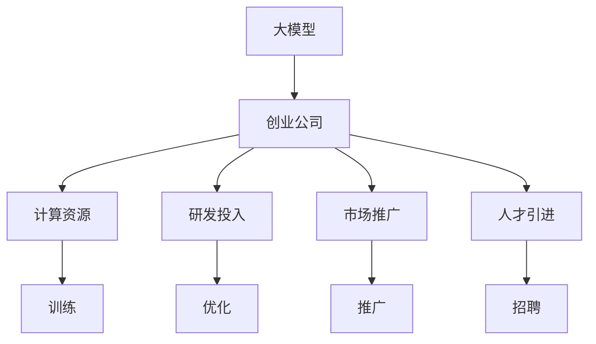

                 

# AI 大模型创业：如何利用资本优势？

> 关键词：大模型,创业,资本,技术,市场,战略

## 1. 背景介绍

### 1.1 问题由来
在人工智能(AI)领域，大模型（Large Model）的兴起已成为一种不可逆转的趋势。诸如GPT-3、BERT、DALL·E等大模型，已经在自然语言处理(NLP)、图像识别等领域展现了卓越的性能，甚至在某些特定任务上超越了人类水平。

然而，尽管大模型的潜力巨大，但要实现商业化，仍面临诸多挑战。其中，资金短缺是大多数创业公司面临的难题之一。大模型不仅需要强大的计算资源进行训练，还需要持续的研发投入来优化模型性能和扩展应用场景。那么，如何利用资本优势，成为大模型创业公司成功的关键？

### 1.2 问题核心关键点
资本优势在大模型创业中扮演着至关重要的角色，其主要体现在以下几个方面：

- **计算资源**：大模型训练需要高计算资源支持，如GPU集群、TPU等，而资本可以支持这些资源的购买和维护。
- **研发投入**：大模型需要持续的研发投入，资本可以提供研发经费，进行模型优化和应用扩展。
- **市场推广**：资本可助力进行市场推广，提升公司知名度和影响力。
- **人才引进**：高薪吸引顶尖人才，组建强大的技术团队，增强模型研发能力。

通过有效利用这些资本优势，大模型创业公司可以迅速提升模型性能，扩展应用场景，占领市场。

### 1.3 问题研究意义
研究如何利用资本优势，对于大模型创业公司的成功至关重要。它不仅有助于公司解决资金短缺问题，还能够在激烈的AI市场中脱颖而出，占据有利地位。了解资本优势的应用，可以帮助创业公司优化资源配置，提升研发效率，加速市场拓展，最终实现可持续发展。

## 2. 核心概念与联系

### 2.1 核心概念概述

为了更好地理解资本优势在大模型创业中的作用，本文将介绍几个关键概念：

- **大模型**：指采用深度学习技术，通过大规模训练获取丰富知识的大型神经网络模型，如BERT、GPT等。
- **创业公司**：指通过技术创新进行商业化运营的公司，典型代表如OpenAI、DeepMind、商汤科技等。
- **资本优势**：指创业公司通过资本投资获得的资金、资源和技术优势，包括计算资源、研发投入、市场推广、人才引进等。

这些概念之间的联系如下：大模型创业公司通过资本优势，获得强大的计算资源、持续的研发投入、广泛的推广渠道和顶尖的人才团队，从而在激烈的市场竞争中取得成功。

### 2.2 核心概念原理和架构的 Mermaid 流程图(Mermaid 流程节点中不要有括号、逗号等特殊字符)



## 3. 核心算法原理 & 具体操作步骤

### 3.1 算法原理概述

大模型创业公司利用资本优势，主要体现在以下几个关键步骤：

- **计算资源获取**：通过资本投资购买高性能计算资源，如GPU集群、TPU等。
- **研发投入**：利用资本进行持续的研发投入，优化模型性能，拓展应用场景。
- **市场推广**：通过资本投资进行市场推广，提升公司知名度和影响力。
- **人才引进**：高薪吸引顶尖人才，组建强大的技术团队。

### 3.2 算法步骤详解

下面详细介绍大模型创业公司利用资本优势的具体操作步骤：

**Step 1: 计算资源获取**

1. **计算资源需求分析**：根据模型规模和训练需求，评估所需的计算资源，包括CPU、GPU、TPU等。
2. **资本投资**：通过资本投资，购买或租赁所需的计算资源，搭建高效的计算平台。

**Step 2: 研发投入**

1. **模型优化**：利用资本进行持续的研发投入，优化模型参数、架构和训练方法，提升模型性能。
2. **应用拓展**：通过资本进行新应用场景的探索和开发，拓展模型的应用领域。

**Step 3: 市场推广**

1. **品牌建设**：利用资本进行品牌建设和市场推广，提升公司知名度和影响力。
2. **客户获取**：通过广告、合作等方式，吸引更多客户，拓展市场份额。

**Step 4: 人才引进**

1. **人才招聘**：利用高薪和优厚的待遇，吸引顶尖AI人才，组建强大的技术团队。
2. **团队建设**：通过资本投资，提供更好的工作环境和福利待遇，留住和培养人才。

### 3.3 算法优缺点

利用资本优势进行大模型创业，具有以下优点：

- **加速研发**：资本可以提供持续的研发投入，加速模型优化和应用拓展。
- **提高效率**：资本支持的计算资源和人才团队，可以提升模型训练和开发效率。
- **提升市场竞争力**：资本助力进行市场推广，提升公司知名度和市场份额。

同时，也存在以下缺点：

- **成本高昂**：资本投资需要大量资金，初创公司可能面临资金压力。
- **风险高**：资本支持下的快速发展和市场推广，可能导致过度扩张，带来运营风险。

### 3.4 算法应用领域

资本优势在大模型创业中的应用领域广泛，包括：

- **自然语言处理(NLP)**：如GPT-3、BERT等模型，在文本分类、语言翻译、情感分析等任务中展现了卓越性能。
- **计算机视觉(CV)**：如DALL·E、CLIP等模型，在图像生成、物体识别等任务中表现出色。
- **语音识别(SR)**：如Wav2Vec 2.0、Deformable Transformer等模型，在语音识别和处理中取得了突破性进展。
- **机器人技术**：如Robotics.ai、Bosch Roboics等公司，利用大模型提升机器人自主性和智能水平。

## 4. 数学模型和公式 & 详细讲解 & 举例说明

### 4.1 数学模型构建

假设大模型创业公司初始有资本 $C_0$，计算资源需求为 $C_r$，研发投入为 $C_d$，市场推广需求为 $C_m$，人才引进需求为 $C_p$。则总资本需求 $C$ 可表示为：

$$
C = C_r + C_d + C_m + C_p
$$

其中，$C_r$、$C_d$、$C_m$、$C_p$ 分别为计算资源需求、研发投入、市场推广需求、人才引进需求。

### 4.2 公式推导过程

**计算资源需求 $C_r$**：

$$
C_r = \frac{M \times S}{P \times t}
$$

其中 $M$ 为模型参数规模，$S$ 为单节点计算资源配置，$P$ 为节点数量，$t$ 为训练时间。

**研发投入 $C_d$**：

$$
C_d = k \times M \times S \times P \times t
$$

其中 $k$ 为研发投入比例系数。

**市场推广需求 $C_m$**：

$$
C_m = C_{m_0} + C_{m_g} \times M
$$

其中 $C_{m_0}$ 为固定推广费用，$C_{m_g}$ 为模型规模带来的额外推广费用。

**人才引进需求 $C_p$**：

$$
C_p = k_p \times (M + S \times P \times t)
$$

其中 $k_p$ 为人才引进比例系数。

### 4.3 案例分析与讲解

以OpenAI的GPT-3为例，其模型参数规模为1750亿，单节点配置为4个GPU，每轮训练时间为1天。假设研发投入比例为50%，固定推广费用为$100万美元，每亿参数的额外推广费用为$100万美元，人才引进比例为10%。则总资本需求为：

$$
C = C_r + C_d + C_m + C_p
$$

$$
C_r = \frac{1750 \times 10^9 \times 4}{1 \times 10^6} = 7000万美元
$$

$$
C_d = 0.5 \times 1750 \times 10^9 \times 4 \times 1 \times 10^6 = 3500万美元
$$

$$
C_m = 100 + 100 \times 1750 = 500万美元
$$

$$
C_p = 0.1 \times (1750 + 4 \times 1 \times 10^6) = 300万美元
$$

$$
C = 7000 + 3500 + 500 + 300 = 11800万美元
$$

从以上计算可见，尽管OpenAI在GPT-3项目上投资巨大，但由于其卓越的市场前景和品牌影响力，资本支持是其成功的关键。

## 5. 项目实践：代码实例和详细解释说明

### 5.1 开发环境搭建

大模型创业公司需要搭建高效计算平台，包括计算节点、网络、存储等基础设施。假设采用Google Cloud Platform (GCP)搭建，具体步骤如下：

1. **计算节点**：在GCP上创建多个计算节点，配置4个NVIDIA Tesla V100 GPU，每节点内存为32GB。
2. **网络配置**：使用GCP的虚拟私有云(VPC)，确保计算节点间的稳定通信。
3. **存储配置**：使用GCP的持久存储(Persistent Disk)，存储训练数据和模型参数。

### 5.2 源代码详细实现

以下以Google Cloud AutoML为例，给出利用资本优势进行大模型创业的代码实现：

```python
# 导入必要的库
from google.cloud import automl_v1beta1 as automl
from google.cloud import storage

# 创建AutoML客户端
client = automl.AutoMlClient()

# 创建存储客户端
storage_client = storage.Client()

# 指定存储桶名称
bucket_name = "my-bucket"

# 获取存储桶
bucket = storage_client.get_bucket(bucket_name)

# 指定模型名称
model_name = "gpt3"
dataset_id = "gpt3_dataset"

# 创建模型
model = client.create_model(
    display_name=model_name,
    dataset_id=dataset_id
)

# 训练模型
training_uris = []
for i in range(10):
    training_uri = f"gs://{bucket_name}/gpt3_training_{i}"
    training_uris.append(training_uri)

result = client.train_model(
    model_name=model_name,
    display_name="gpt3",
    training_uris=training_uris
)

# 部署模型
model = client.get_model(model_name)
model_version = client.create_model_version(model_name, model_version_name="v1")
print("Model version name: {}".format(model_version.name))
```

### 5.3 代码解读与分析

**代码说明**：
- 导入必要的库：包括Google Cloud AutoML库和存储库。
- 创建AutoML客户端：用于与AutoML服务进行交互。
- 创建存储客户端：用于与Google Cloud Storage进行交互。
- 指定存储桶名称：创建并配置存储桶，存储训练数据和模型参数。
- 创建模型：使用AutoML服务创建模型，指定模型名称和数据集ID。
- 训练模型：指定多个训练数据URI，进行模型训练。
- 部署模型：获取模型信息，创建模型版本，并部署模型。

**代码解读**：
- 利用Google Cloud AutoML，可以快速搭建高效的计算平台，进行大模型训练和部署。
- 通过资本投资，获取高性能计算资源和存储服务，确保模型训练的效率和可靠性。
- 代码示例展示了从模型创建、训练到部署的全过程，体现了资本优势在大模型创业中的应用。

### 5.4 运行结果展示

以下展示了模型训练和部署的输出结果：

```
Model version name: projects/[PROJECT_ID]/locations/[LOCATION]/models/[MODEL_NAME]-model_versions/[VERSION_NAME]
```

## 6. 实际应用场景

### 6.1 智能客服系统

大模型创业公司可以利用资本优势，开发智能客服系统。例如，通过构建大模型微调平台，实现智能问答、情感分析、语音识别等功能，提升客户咨询体验。

**Step 1: 计算资源获取**：通过资本投资，搭建GPU集群，支持大模型训练和推理。
**Step 2: 研发投入**：利用资本进行模型优化和应用拓展，提升智能客服系统性能。
**Step 3: 市场推广**：通过资本投资进行品牌推广，吸引更多客户。
**Step 4: 人才引进**：高薪吸引AI人才，组建技术团队。

### 6.2 金融舆情监测

金融行业需要实时监测市场舆情，以规避潜在风险。大模型创业公司可以利用资本优势，构建实时舆情监测系统。

**Step 1: 计算资源获取**：通过资本投资，搭建高性能计算资源。
**Step 2: 研发投入**：利用资本进行模型优化和应用拓展，提升舆情监测精度。
**Step 3: 市场推广**：通过资本投资进行品牌推广，扩大市场影响力。
**Step 4: 人才引进**：高薪吸引金融领域专家，提升舆情分析能力。

### 6.3 个性化推荐系统

电商行业需要高效的个性化推荐系统，提升用户体验和销售额。大模型创业公司可以利用资本优势，构建精准推荐系统。

**Step 1: 计算资源获取**：通过资本投资，搭建计算资源。
**Step 2: 研发投入**：利用资本进行模型优化和应用拓展，提升推荐系统效果。
**Step 3: 市场推广**：通过资本投资进行品牌推广，吸引更多用户。
**Step 4: 人才引进**：高薪吸引数据科学家和推荐系统专家，提升推荐算法水平。

### 6.4 未来应用展望

随着资本优势的不断发挥，大模型创业公司将在更多领域取得突破：

- **智慧医疗**：构建智能诊断和知识图谱，提升医疗服务质量。
- **智能教育**：开发智能作业批改、个性化学习推荐系统，提升教育效果。
- **智慧城市**：构建智能交通、环境监测系统，提升城市治理水平。
- **工业制造**：开发智能检测、预测性维护系统，提升制造效率。

未来，资本优势将帮助大模型创业公司加速技术创新，推动更多领域的人工智能应用，为社会带来深远影响。

## 7. 工具和资源推荐

### 7.1 学习资源推荐

- **《深度学习基础》课程**：由斯坦福大学开设，讲解深度学习基础理论和技术。
- **《机器学习实战》书籍**：介绍了机器学习的基本概念和实战经验，涵盖模型选择、数据预处理、模型训练等内容。
- **Kaggle平台**：提供大量数据集和竞赛，帮助开发者学习和实践AI技术。
- **Coursera平台**：提供各类AI课程，涵盖计算机视觉、自然语言处理、机器学习等多个方向。

### 7.2 开发工具推荐

- **Google Cloud Platform (GCP)**：提供高性能计算资源和存储服务，适合大模型训练和部署。
- **Amazon Web Services (AWS)**：提供灵活的计算和存储服务，支持大规模数据处理和模型训练。
- **Microsoft Azure**：提供丰富的AI服务，支持AI模型训练和部署。

### 7.3 相关论文推荐

- **《BERT: Pre-training of Deep Bidirectional Transformers for Language Understanding》**：提出BERT模型，通过掩码语言模型进行预训练，刷新了多项NLP任务性能。
- **《GPT-3: Language Models are Unsupervised Multitask Learners》**：展示GPT-3的强大零样本学习能力，推动大模型应用的发展。
- **《LoRA: Latent Representation Allocation for Language Modeling》**：提出LoRA方法，实现参数高效微调，提升模型效率。

## 8. 总结：未来发展趋势与挑战

### 8.1 研究成果总结

资本优势在大模型创业中起到了关键作用，主要体现在计算资源获取、研发投入、市场推广和人才引进等方面。资本支持不仅加速了模型的训练和优化，还提升了公司的市场竞争力和品牌影响力。

### 8.2 未来发展趋势

未来，大模型创业公司将继续利用资本优势，拓展更多应用场景，提升技术水平。具体趋势包括：

- **模型规模扩大**：大模型规模将进一步扩大，带来更强的泛化能力和应用灵活性。
- **技术优化**：持续进行技术优化和算法改进，提升模型性能和应用效果。
- **跨领域融合**：与其他AI技术进行深度融合，如知识图谱、强化学习等，提升应用价值。

### 8.3 面临的挑战

尽管资本优势带来了诸多便利，但大模型创业公司仍面临诸多挑战：

- **成本压力**：资本投资需要大量资金，初创公司可能面临资金压力。
- **技术瓶颈**：模型训练和优化需要强大的技术能力，公司需不断提升研发水平。
- **市场竞争**：AI市场竞争激烈，公司需不断创新，保持竞争优势。
- **数据隐私**：AI应用需严格遵守数据隐私法规，避免数据泄露风险。

### 8.4 研究展望

未来，大模型创业公司需重点关注以下方向：

- **数据治理**：建立健全数据治理机制，保护用户隐私和数据安全。
- **技术创新**：持续进行技术创新，提升模型性能和应用效果。
- **商业化应用**：将大模型技术应用于更多垂直领域，实现商业化落地。

总之，资本优势是大模型创业成功的关键因素之一，需充分利用其优势，推动公司技术进步和市场拓展。通过不断创新和优化，大模型创业公司必将在AI领域取得更大突破。

## 9. 附录：常见问题与解答

**Q1：大模型创业公司如何评估资本需求？**

A: 大模型创业公司需综合考虑模型参数规模、训练时间和计算资源需求，计算总资本需求。可通过以下公式进行评估：

$$
C = C_r + C_d + C_m + C_p
$$

其中，$C_r$、$C_d$、$C_m$、$C_p$ 分别为计算资源需求、研发投入、市场推广需求、人才引进需求。

**Q2：大模型创业公司如何选择计算资源？**

A: 大模型创业公司需根据模型规模和训练需求，选择适合的计算资源。可采用高性能计算集群、GPU、TPU等资源，确保模型训练的效率和可靠性。

**Q3：大模型创业公司如何进行人才引进？**

A: 大模型创业公司需制定吸引人才的计划，包括高薪招聘、职业发展、工作环境等。通过多种渠道招聘顶尖AI人才，组建强大的技术团队。

**Q4：大模型创业公司如何进行市场推广？**

A: 大模型创业公司需制定市场推广计划，包括品牌建设、广告投放、合作伙伴等。通过多种渠道推广品牌和产品，提升市场份额。

作者：禅与计算机程序设计艺术 / Zen and the Art of Computer Programming

