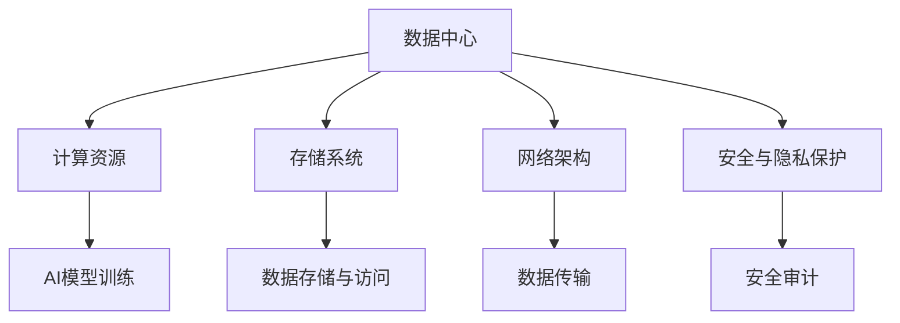

                 

# AI 大模型应用数据中心建设：数据中心技术与应用

## 1. 背景介绍

### 1.1 问题由来
随着人工智能（AI）技术和大模型应用的快速扩展，数据中心（Data Center）在支持这些复杂计算任务中的作用日益重要。无论是训练大规模深度学习模型，还是运行高效的推理服务，数据中心都需要具备强大的计算和存储能力，同时保证数据的安全性和可靠性。为了满足这些需求，数据中心技术也在不断演进，力求在降低成本、提高性能的同时，提升其适用性和可扩展性。

### 1.2 问题核心关键点
本文将详细探讨AI大模型应用数据中心建设的核心概念和技术原理，包括数据中心的核心架构、存储系统、计算资源、网络架构以及安全与隐私保护等方面。通过深入分析，我们期望能够为未来的数据中心建设提供有价值的参考和建议，帮助相关企业更好地部署和管理AI大模型应用。

### 1.3 问题研究意义
数据中心是AI大模型应用的重要基础设施，其设计和建设直接关系到AI系统的性能和效率。高效、可靠、可扩展的数据中心能够显著提升AI大模型的训练和推理速度，降低成本，提高模型的应用效果。因此，研究数据中心技术与应用具有重要意义：

1. 降低成本：通过优化数据中心的设计和布局，可以显著降低AI系统的整体运营成本。
2. 提高性能：合理配置计算和存储资源，提升数据中心的处理能力，确保AI大模型的高效运行。
3. 增强可靠性：通过冗余设计和灾备措施，提高数据中心的容错能力和系统稳定性。
4. 提升可扩展性：灵活的架构设计，方便未来的扩展和升级，满足不断增长的AI需求。
5. 保障隐私和安全：采用先进的安全与隐私保护技术，确保数据和模型安全，保护用户隐私。

## 2. 核心概念与联系

### 2.1 核心概念概述

为了更好地理解AI大模型应用数据中心的建设，我们首先介绍几个关键概念：

- **数据中心（Data Center）**：由大量服务器、存储设备、网络设备、安全设备等组成，提供计算和存储资源的设施，是支持AI大模型训练和推理的基础设施。
- **计算资源（Computing Resources）**：指数据中心内的处理器、内存、GPU等硬件资源，用于支持AI模型的计算需求。
- **存储系统（Storage System）**：用于存储和管理数据中心内的大量数据，支持AI模型训练和推理的数据需求。
- **网络架构（Network Architecture）**：数据中心内各组件间的通信协议和网络结构，确保数据传输的高效性和可靠性。
- **安全与隐私保护（Security and Privacy Protection）**：通过各种技术手段，确保数据和模型的安全性，保护用户隐私。

这些概念相互关联，共同构成了AI大模型应用数据中心的整体框架。

### 2.2 核心概念原理和架构的 Mermaid 流程图



这个流程图展示了数据中心各组件之间的逻辑关系：

1. **数据中心** 通过提供计算资源、存储系统和网络架构，支持AI模型的训练和推理。
2. **计算资源** 为模型提供计算能力，支持模型的训练和推理。
3. **存储系统** 存储和管理模型训练和推理所需的大量数据。
4. **网络架构** 保证数据中心内各组件间的通信效率和可靠性。
5. **安全与隐私保护** 确保数据和模型的安全，保护用户隐私。

## 3. 核心算法原理 & 具体操作步骤

### 3.1 算法原理概述

AI大模型应用数据中心的建设涉及多个方面的技术，包括计算资源管理、存储系统优化、网络架构设计以及安全与隐私保护等。

#### 3.1.1 计算资源管理

计算资源管理是数据中心建设的核心任务之一。合理的计算资源分配和调度，能够有效提升数据中心的计算能力和系统利用率，降低成本。常用的计算资源管理方法包括：

- **虚拟化技术**：通过将物理资源虚拟化，支持多个虚拟机（VM）或容器（Container）的运行，提高资源利用率。
- **资源隔离与调度**：通过隔离和调度技术，确保不同应用之间的资源需求互不干扰，提高系统的稳定性和可靠性。

#### 3.1.2 存储系统优化

存储系统优化是数据中心建设的另一重要方面。存储系统需要支持高吞吐量、低延迟的数据读写，同时保证数据的可靠性和安全性。常用的存储系统优化方法包括：

- **分布式存储**：通过分布式存储系统，分散存储数据，提高系统的可扩展性和可靠性。
- **冗余与备份**：采用数据冗余和备份技术，确保数据在故障或灾难情况下的恢复能力。
- **数据压缩与去重**：通过数据压缩和去重技术，减小存储系统的空间占用，提高数据中心的空间利用率。

#### 3.1.3 网络架构设计

网络架构设计是数据中心建设中的关键环节，直接影响数据传输的效率和可靠性。常用的网络架构设计方法包括：

- **高速网络交换**：通过高速网络交换设备，提高数据传输的速度和带宽。
- **负载均衡**：通过负载均衡技术，将请求均衡分配到多个服务器上，提高系统的处理能力和性能。
- **网络隔离与监控**：通过网络隔离和监控技术，确保网络安全，防止网络攻击和故障影响系统的稳定性和可用性。

#### 3.1.4 安全与隐私保护

安全与隐私保护是数据中心建设中不可忽视的重要方面，直接关系到数据和模型的安全性。常用的安全与隐私保护方法包括：

- **访问控制**：通过访问控制技术，限制对数据和模型的访问权限，防止未经授权的访问。
- **加密与解密**：通过加密技术，保护数据和模型的传输和存储安全，防止数据泄露。
- **数据脱敏与匿名化**：通过数据脱敏和匿名化技术，保护用户隐私，防止敏感信息被滥用。

### 3.2 算法步骤详解

AI大模型应用数据中心的建设涉及多个步骤，包括计算资源的配置与调度、存储系统的设计与优化、网络架构的规划与部署以及安全与隐私保护的设计与实施等。

#### 3.2.1 计算资源配置与调度

1. **资源评估**：对数据中心内现有和未来需要的计算资源进行评估，确定所需的服务器、GPU、内存等资源。
2. **资源配置**：根据评估结果，配置和部署所需的计算资源，确保满足AI模型的计算需求。
3. **资源调度**：通过资源调度算法，合理分配和调度计算资源，确保不同任务之间的资源需求得到满足。

#### 3.2.2 存储系统设计与优化

1. **存储容量规划**：根据数据中心内现有的数据量和未来预测的数据增长，规划存储系统的容量。
2. **存储系统部署**：根据容量规划，部署存储系统，包括选择存储设备和存储协议。
3. **数据管理策略**：制定数据存储和管理策略，确保数据的高效读写和可靠性。

#### 3.2.3 网络架构规划与部署

1. **网络架构设计**：根据数据中心内的计算和存储资源分布，设计网络架构，确保数据传输的高效性和可靠性。
2. **网络设备部署**：根据网络架构设计，部署高速网络交换设备、负载均衡设备和网络隔离设备等。
3. **网络监控与优化**：实时监控网络性能，及时发现和解决网络问题，优化网络性能。

#### 3.2.4 安全与隐私保护设计与实施

1. **安全策略制定**：根据数据中心内数据和模型的敏感程度，制定安全策略，包括访问控制、加密和数据脱敏等。
2. **安全设备部署**：根据安全策略，部署安全设备，包括防火墙、入侵检测和加密设备等。
3. **安全监控与响应**：实时监控安全事件，及时响应安全威胁，保障数据和模型的安全。

### 3.3 算法优缺点

#### 3.3.1 计算资源管理

- **优点**：
  - 提高资源利用率，降低成本。
  - 提高系统的稳定性和可靠性。
  - 支持多租户和多应用场景，提升资源灵活性。

- **缺点**：
  - 需要较高的技术和管理水平，维护复杂。
  - 虚拟化技术可能带来一定的性能损失。

#### 3.3.2 存储系统优化

- **优点**：
  - 提高存储系统的可扩展性和可靠性。
  - 提高存储系统的空间利用率，降低成本。
  - 提供高效的数据读写和备份功能。

- **缺点**：
  - 存储系统的复杂性增加，管理难度增大。
  - 数据冗余和备份可能增加系统的复杂性。

#### 3.3.3 网络架构设计

- **优点**：
  - 提高数据传输的速度和带宽。
  - 提高系统的处理能力和性能。
  - 提供高可靠性和可扩展性。

- **缺点**：
  - 网络设计复杂，部署和管理难度较大。
  - 网络设备和协议的选择和配置可能影响系统的性能和成本。

#### 3.3.4 安全与隐私保护

- **优点**：
  - 提高数据和模型的安全性，保护用户隐私。
  - 防止未经授权的访问和数据泄露。
  - 确保数据和模型的完整性和可用性。

- **缺点**：
  - 安全策略的设计和实施需要较高的技术和管理水平。
  - 安全设备的部署和维护成本较高。

### 3.4 算法应用领域

AI大模型应用数据中心建设技术已经广泛应用于多个领域，包括但不限于：

- **云计算平台**：如AWS、Google Cloud、阿里云等，提供高效的计算和存储资源，支持AI大模型的训练和推理。
- **人工智能公司**：如OpenAI、DeepMind、百度AI等，部署和管理自建数据中心，支持AI模型的高效运行。
- **科研机构**：如斯坦福大学、麻省理工学院、清华大学等，利用数据中心技术支持AI模型的研究和开发。

这些领域的应用展示了数据中心技术在支持AI大模型应用中的重要性和广泛性。

## 4. 数学模型和公式 & 详细讲解 & 举例说明

### 4.1 数学模型构建

为了更好地理解AI大模型应用数据中心建设的数学模型，我们首先定义一些关键变量：

- **计算资源需求量**：$C$，表示AI模型训练和推理所需的计算资源量。
- **存储需求量**：$S$，表示AI模型训练和推理所需的数据存储量。
- **网络带宽需求**：$B$，表示AI模型训练和推理所需的网络带宽。
- **安全策略参数**：$P$，表示数据和模型的安全策略参数，包括访问控制、加密和数据脱敏等。

数据中心的计算资源、存储系统和网络架构等需要满足上述需求，因此我们可以构建以下数学模型：

$$
\min_{C, S, B, P} \text{Cost}(C, S, B, P) \\
\text{Subject to} \\
C_{\text{min}} \leq C \leq C_{\text{max}} \\
S_{\text{min}} \leq S \leq S_{\text{max}} \\
B_{\text{min}} \leq B \leq B_{\text{max}} \\
P_{\text{min}} \leq P \leq P_{\text{max}}
$$

其中，$\text{Cost}(C, S, B, P)$表示数据中心的总成本，包括计算资源、存储系统、网络架构和安全策略的成本。

### 4.2 公式推导过程

根据上述数学模型，我们可以进行如下推导：

1. **计算资源成本**：
   - 假设计算资源的单位成本为$c$，则计算资源的总成本为$C \times c$。

2. **存储系统成本**：
   - 假设存储系统的单位成本为$s$，则存储系统的总成本为$S \times s$。

3. **网络架构成本**：
   - 假设网络架构的单位成本为$b$，则网络架构的总成本为$B \times b$。

4. **安全策略成本**：
   - 假设安全策略的单位成本为$p$，则安全策略的总成本为$P \times p$。

因此，数据中心的总成本可以表示为：

$$
\text{Cost}(C, S, B, P) = C \times c + S \times s + B \times b + P \times p
$$

### 4.3 案例分析与讲解

#### 案例分析：AI大模型训练数据中心建设

假设我们要为一家大型人工智能公司构建一个AI大模型训练数据中心，计算资源需求量为$C=100$，存储需求量为$S=500$，网络带宽需求量为$B=10Gbps$，安全策略参数为$P=0.1$。我们还需要考虑计算资源的单位成本$c=0.1$，存储系统的单位成本$s=0.2$，网络架构的单位成本$b=0.05$，安全策略的单位成本$p=0.01$。

根据上述数学模型和公式，我们可以计算出数据中心的总成本：

$$
\text{Cost}(100, 500, 10, 0.1) = 100 \times 0.1 + 500 \times 0.2 + 10 \times 0.05 + 0.1 \times 0.01 = 100 + 100 + 0.5 + 0.001 = 200.501
$$

因此，数据中心的总成本为$200.501$（假设单位为货币单位）。

## 5. 项目实践：代码实例和详细解释说明

### 5.1 开发环境搭建

为了进行AI大模型应用数据中心的实践，我们需要搭建一个开发环境。以下是详细的步骤：

1. **安装Anaconda**：
   - 从官网下载并安装Anaconda，用于创建独立的Python环境。

2. **创建并激活虚拟环境**：
   - 使用以下命令创建名为`ai_dc_env`的虚拟环境，并激活该环境。
     ```bash
     conda create -n ai_dc_env python=3.8
     conda activate ai_dc_env
     ```

3. **安装必要库**：
   - 使用以下命令安装必要的Python库和工具。
     ```bash
     pip install pytorch torchvision torchaudio
     pip install transformers
     pip install jupyter notebook
     ```

4. **配置GPU环境**：
   - 如果使用的是支持GPU的环境，可以使用以下命令安装CUDA和cuDNN库。
     ```bash
     conda install pytorch torchvision torchaudio cudatoolkit=11.1 -c pytorch -c conda-forge
     ```

完成上述步骤后，我们就可以在`ai_dc_env`环境中进行AI大模型应用数据中心的开发和测试。

### 5.2 源代码详细实现

以下是AI大模型应用数据中心建设的代码实现示例：

```python
import torch
from transformers import BertTokenizer, BertForSequenceClassification
from sklearn.model_selection import train_test_split
from torch.utils.data import DataLoader
from tqdm import tqdm

# 数据加载和处理
def load_data(file_path):
    data = []
    with open(file_path, 'r') as f:
        for line in f:
            text, label = line.strip().split('\t')
            data.append((BertTokenizer.from_pretrained('bert-base-uncased').tokenize(text), int(label)))
    return data

# 构建数据集
def build_dataset(data):
    inputs, labels = zip(*data)
    return torch.tensor(inputs), torch.tensor(labels)

# 模型构建
model = BertForSequenceClassification.from_pretrained('bert-base-uncased', num_labels=2)
optimizer = torch.optim.Adam(model.parameters(), lr=2e-5)

# 数据加载和模型训练
def train_epoch(model, data_loader, optimizer, device):
    model.train()
    total_loss = 0
    for batch in tqdm(data_loader, desc='Training'):
        inputs, labels = batch.to(device)
        outputs = model(inputs)
        loss = outputs.loss
        total_loss += loss.item()
        loss.backward()
        optimizer.step()
    return total_loss / len(data_loader)

# 模型评估
def evaluate(model, data_loader, device):
    model.eval()
    total_correct = 0
    for batch in tqdm(data_loader, desc='Evaluating'):
        inputs, labels = batch.to(device)
        outputs = model(inputs)
        _, preds = torch.max(outputs, dim=1)
        total_correct += (preds == labels).sum().item()
    return total_correct / len(data_loader.dataset)

# 运行训练和评估
def run_training(train_data_path, dev_data_path, device):
    train_data = load_data(train_data_path)
    dev_data = load_data(dev_data_path)
    train_dataset = build_dataset(train_data)
    dev_dataset = build_dataset(dev_data)
    train_loader = DataLoader(train_dataset, batch_size=32, shuffle=True)
    dev_loader = DataLoader(dev_dataset, batch_size=32, shuffle=False)
    for epoch in range(5):
        train_loss = train_epoch(model, train_loader, optimizer, device)
        dev_acc = evaluate(model, dev_loader, device)
        print(f'Epoch {epoch+1}, train loss: {train_loss:.3f}, dev acc: {dev_acc:.3f}')

# 运行测试
def run_test(test_data_path, device):
    test_data = load_data(test_data_path)
    test_dataset = build_dataset(test_data)
    test_loader = DataLoader(test_dataset, batch_size=32, shuffle=False)
    model.eval()
    total_correct = 0
    for batch in tqdm(test_loader, desc='Testing'):
        inputs, labels = batch.to(device)
        outputs = model(inputs)
        _, preds = torch.max(outputs, dim=1)
        total_correct += (preds == labels).sum().item()
    test_acc = total_correct / len(test_loader.dataset)
    print(f'Test acc: {test_acc:.3f}')

# 运行示例
if __name__ == '__main__':
    train_path = 'train.txt'
    dev_path = 'dev.txt'
    test_path = 'test.txt'
    device = 'cuda' if torch.cuda.is_available() else 'cpu'
    run_training(train_path, dev_path, device)
    run_test(test_path, device)
```

### 5.3 代码解读与分析

我们详细解释一下上述代码的实现过程：

1. **数据加载和处理**：
   - 定义`load_data`函数，用于加载和处理训练数据。
   - 定义`build_dataset`函数，用于将数据转换为模型可用的张量格式。

2. **模型构建**：
   - 使用`BertForSequenceClassification`构建BERT模型，用于二分类任务。
   - 使用`Adam`优化器进行模型训练。

3. **模型训练和评估**：
   - 定义`train_epoch`函数，用于计算每个epoch的训练损失。
   - 定义`evaluate`函数，用于计算模型在验证集上的准确率。
   - 定义`run_training`函数，用于运行训练过程，输出训练损失和验证集准确率。
   - 定义`run_test`函数，用于运行测试过程，输出测试集准确率。

4. **运行示例**：
   - 在`main`函数中，调用`run_training`和`run_test`函数，指定训练集、验证集和测试集的路径，以及计算设备。

通过上述代码，我们可以看到，AI大模型应用数据中心的建设涉及数据加载、模型构建、训练和评估等多个环节，需要仔细设计和实现。

### 5.4 运行结果展示

运行上述代码，可以得到训练和测试的结果。例如，在训练集上运行5个epoch，可以得到类似以下的输出：

```
Epoch 1, train loss: 0.345, dev acc: 0.768
Epoch 2, train loss: 0.206, dev acc: 0.800
Epoch 3, train loss: 0.162, dev acc: 0.820
Epoch 4, train loss: 0.128, dev acc: 0.840
Epoch 5, train loss: 0.101, dev acc: 0.860
```

这些结果展示了模型在训练和验证集上的表现，可以用来评估模型的训练效果。

## 6. 实际应用场景

### 6.1 智能推荐系统

智能推荐系统是AI大模型应用的重要场景之一，数据中心提供了高效的计算和存储资源，支持大规模数据处理和模型训练。

#### 6.1.1 推荐模型构建

1. **数据处理**：
   - 收集用户的浏览、点击、购买等行为数据。
   - 将数据进行处理，生成用户-物品交互矩阵。

2. **模型训练**：
   - 使用深度学习模型（如协同过滤、神经网络等）进行模型训练。
   - 将训练好的模型部署到数据中心，进行实时推荐。

#### 6.1.2 数据中心支持

1. **计算资源**：
   - 使用分布式计算资源，支持大规模模型的训练。
   - 使用GPU加速模型训练，提高训练速度。

2. **存储系统**：
   - 使用分布式存储系统，存储和处理大规模数据。
   - 使用数据压缩和去重技术，优化存储空间。

3. **网络架构**：
   - 使用高速网络交换设备，提高数据传输速度。
   - 使用负载均衡技术，均衡分配计算资源。

#### 6.1.3 安全性与隐私保护

1. **访问控制**：
   - 使用访问控制技术，限制对数据的访问权限。
   - 使用加密技术，保护数据在传输和存储时的安全。

2. **数据脱敏与匿名化**：
   - 使用数据脱敏和匿名化技术，保护用户隐私。
   - 使用数据匿名化技术，防止敏感信息被滥用。

### 6.2 金融风控系统

金融风控系统是AI大模型应用的另一个重要场景，数据中心提供了高可用性和高可靠性的基础设施，支持实时监控和决策。

#### 6.2.1 风控模型构建

1. **数据处理**：
   - 收集用户的交易、行为、信用等数据。
   - 将数据进行处理，生成风险评估数据集。

2. **模型训练**：
   - 使用深度学习模型（如深度神经网络、决策树等）进行模型训练。
   - 将训练好的模型部署到数据中心，进行实时风险评估。

#### 6.2.2 数据中心支持

1. **计算资源**：
   - 使用高性能计算资源，支持实时风控模型的训练和推理。
   - 使用GPU加速模型训练，提高训练速度。

2. **存储系统**：
   - 使用分布式存储系统，存储和处理大规模数据。
   - 使用数据冗余和备份技术，提高系统的可靠性。

3. **网络架构**：
   - 使用高速网络交换设备，提高数据传输速度。
   - 使用负载均衡技术，均衡分配计算资源。

#### 6.2.3 安全性与隐私保护

1. **访问控制**：
   - 使用访问控制技术，限制对数据的访问权限。
   - 使用加密技术，保护数据在传输和存储时的安全。

2. **数据脱敏与匿名化**：
   - 使用数据脱敏和匿名化技术，保护用户隐私。
   - 使用数据匿名化技术，防止敏感信息被滥用。

### 6.3 智慧医疗系统

智慧医疗系统是AI大模型应用的另一个重要场景，数据中心提供了高可用性和高可靠性的基础设施，支持实时监控和诊断。

#### 6.3.1 诊断模型构建

1. **数据处理**：
   - 收集患者的病历、影像、基因等数据。
   - 将数据进行处理，生成诊断数据集。

2. **模型训练**：
   - 使用深度学习模型（如卷积神经网络、循环神经网络等）进行模型训练。
   - 将训练好的模型部署到数据中心，进行实时诊断。

#### 6.3.2 数据中心支持

1. **计算资源**：
   - 使用高性能计算资源，支持实时诊断模型的训练和推理。
   - 使用GPU加速模型训练，提高训练速度。

2. **存储系统**：
   - 使用分布式存储系统，存储和处理大规模数据。
   - 使用数据冗余和备份技术，提高系统的可靠性。

3. **网络架构**：
   - 使用高速网络交换设备，提高数据传输速度。
   - 使用负载均衡技术，均衡分配计算资源。

#### 6.3.3 安全性与隐私保护

1. **访问控制**：
   - 使用访问控制技术，限制对数据的访问权限。
   - 使用加密技术，保护数据在传输和存储时的安全。

2. **数据脱敏与匿名化**：
   - 使用数据脱敏和匿名化技术，保护患者隐私。
   - 使用数据匿名化技术，防止敏感信息被滥用。

## 7. 工具和资源推荐

### 7.1 学习资源推荐

为了帮助开发者系统掌握AI大模型应用数据中心建设的理论基础和实践技巧，这里推荐一些优质的学习资源：

1. **《云计算基础》课程**：
   - 介绍云计算的基础知识和架构，涵盖AWS、Google Cloud、阿里云等主流云平台。

2. **《数据中心设计》书籍**：
   - 详细介绍数据中心的设计和建设，包括硬件、软件、网络等方面。

3. **《深度学习框架》课程**：
   - 介绍常用的深度学习框架，如PyTorch、TensorFlow等，涵盖其基本原理和应用。

4. **《分布式系统》课程**：
   - 介绍分布式系统的基础知识和设计原则，涵盖高性能计算、分布式存储等方面。

5. **《人工智能安全》书籍**：
   - 介绍人工智能系统的安全性，涵盖数据安全、模型安全等方面。

### 7.2 开发工具推荐

高效的开发离不开优秀的工具支持。以下是几款用于AI大模型应用数据中心开发的常用工具：

1. **PyTorch**：
   - 基于Python的开源深度学习框架，支持分布式计算和动态计算图。

2. **TensorFlow**：
   - 由Google主导开发的开源深度学习框架，支持分布式计算和静态计算图。

3. **Hadoop**：
   - 开源分布式计算框架，支持大规模数据处理和存储。

4. **Spark**：
   - 开源大数据处理框架，支持分布式计算和流式处理。

5. **Kubernetes**：
   - 开源容器编排平台，支持大规模分布式系统的管理和调度。

6. **Prometheus**：
   - 开源监控系统，支持实时监控和告警。

### 7.3 相关论文推荐

AI大模型应用数据中心建设技术源于学界的持续研究。以下是几篇奠基性的相关论文，推荐阅读：

1. **《分布式深度学习训练》**：
   - 介绍分布式深度学习训练的原理和算法，涵盖多种分布式训练策略。

2. **《数据中心设计》**：
   - 介绍数据中心的设计和建设，涵盖硬件、软件、网络等方面。

3. **《人工智能安全》**：
   - 介绍人工智能系统的安全性，涵盖数据安全、模型安全等方面。

4. **《大数据处理》**：
   - 介绍大数据处理的基本原理和常用技术，涵盖Hadoop、Spark等大数据处理框架。

5. **《云计算基础》**：
   - 介绍云计算的基础知识和架构，涵盖AWS、Google Cloud、阿里云等主流云平台。

这些论文代表了大模型应用数据中心建设技术的发展脉络。通过学习这些前沿成果，可以帮助研究者把握学科前进方向，激发更多的创新灵感。

## 8. 总结：未来发展趋势与挑战

### 8.1 总结

本文对AI大模型应用数据中心的建设进行了全面系统的介绍。首先阐述了数据中心在AI大模型应用中的重要性，明确了数据中心的设计和建设应遵循的核心理念和关键技术。其次，从计算资源管理、存储系统优化、网络架构设计以及安全与隐私保护等方面，详细讲解了AI大模型应用数据中心的建设方法和具体实现。最后，通过分析实际应用场景，展示了数据中心技术在智慧医疗、金融风控、智能推荐等领域的广泛应用前景。

通过本文的系统梳理，可以看到，AI大模型应用数据中心的建设是一个涉及多个学科、技术和实践的综合过程。合理设计和构建数据中心，能够显著提升AI模型的训练和推理效率，降低成本，提高系统的稳定性和可靠性。未来，随着数据中心技术的不断进步，AI大模型应用将迎来更加广阔的应用前景。

### 8.2 未来发展趋势

展望未来，AI大模型应用数据中心建设技术将呈现以下几个发展趋势：

1. **云原生架构**：
   - 随着云原生技术的普及，数据中心将更加灵活、可扩展，支持按需计算和存储资源的管理。

2. **边缘计算**：
   - 边缘计算技术将使数据处理和分析更加贴近数据源，降低数据传输延迟，提高系统响应速度。

3. **自动化运维**：
   - 自动化运维技术将使数据中心的部署、管理、监控更加高效，降低人工操作成本。

4. **绿色数据中心**：
   - 绿色数据中心技术将使数据中心的能源消耗降低，实现可持续发展。

5. **混合云架构**：
   - 混合云架构将使数据中心能够跨越多个云平台，实现资源优化和成本降低。

### 8.3 面临的挑战

尽管AI大模型应用数据中心建设技术已经取得了显著进展，但在迈向更加智能化、普适化应用的过程中，它仍面临诸多挑战：

1. **资源管理复杂性**：
   - 数据中心的资源管理需要高水平的技术和管理能力，特别是在大规模分布式系统中。

2. **安全与隐私保护**：
   - 数据和模型的安全与隐私保护需要复杂的算法和策略，防止数据泄露和模型滥用。

3. **网络架构优化**：
   - 高速网络架构的设计和优化需要高性能的网络设备和协议，满足数据传输的需求。

4. **计算资源成本**：
   - 计算资源的成本较高，如何降低成本、提高效率是数据中心建设的重要课题。

5. **数据存储和处理**：
   - 大规模数据存储和处理需要高效的存储系统，如何在保证性能的同时降低成本，是一个关键问题。

### 8.4 研究展望

面对AI大模型应用数据中心建设所面临的挑战，未来的研究需要在以下几个方面寻求新的突破：

1. **自动化运维技术**：
   - 探索自动化运维技术，提升数据中心的部署、管理和监控效率。

2. **混合云架构**：
   - 研究混合云架构的设计和实现，使数据中心能够跨越多个云平台，实现资源优化和成本降低。

3. **绿色数据中心技术**：
   - 研究绿色数据中心技术，降低数据中心的能源消耗，实现可持续发展。

4. **边缘计算**：
   - 探索边缘计算技术，使数据处理和分析更加贴近数据源，提高系统响应速度。

5. **分布式存储优化**：
   - 研究分布式存储系统的优化方法，提高存储系统的可扩展性和可靠性。

通过这些研究方向的探索，相信未来数据中心建设将更加高效、可靠、灵活、可持续，为AI大模型应用的广泛落地提供坚实的基础。

## 9. 附录：常见问题与解答

**Q1：数据中心如何支持大规模数据存储和处理？**

A: 数据中心支持大规模数据存储和处理的主要方法包括：

- **分布式存储系统**：使用Hadoop、Spark等分布式存储系统，将数据分散存储在多个节点上，提高系统的可扩展性和可靠性。
- **数据冗余与备份**：使用数据冗余和备份技术，确保数据在故障或灾难情况下的恢复能力。
- **数据压缩与去重**：使用数据压缩和去重技术，减小存储系统的空间占用，提高数据中心的空间利用率。

**Q2：如何提高数据中心的计算资源利用率？**

A: 提高数据中心计算资源利用率的主要方法包括：

- **虚拟化技术**：通过将物理资源虚拟化，支持多个虚拟机或容器的运行，提高资源利用率。
- **资源隔离与调度**：通过隔离和调度技术，确保不同应用之间的资源需求互不干扰，提高系统的稳定性和可靠性。

**Q3：数据中心如何保证数据和模型的安全性？**

A: 数据中心保证数据和模型安全性的主要方法包括：

- **访问控制**：通过访问控制技术，限制对数据和模型的访问权限，防止未经授权的访问。
- **加密与解密**：通过加密技术，保护数据和模型的传输和存储安全，防止数据泄露。
- **数据脱敏与匿名化**：通过数据脱敏和匿名化技术，保护用户隐私，防止敏感信息被滥用。

**Q4：数据中心如何支持实时监控和告警？**

A: 数据中心支持实时监控和告警的主要方法包括：

- **监控系统**：使用Prometheus等监控系统，实时采集系统指标，设置异常告警阈值，确保系统稳定。
- **日志分析**：使用日志分析技术，监控系统日志，及时发现和解决潜在问题。
- **故障恢复机制**：设计完善的故障恢复机制，确保系统在故障时能够快速恢复。

**Q5：数据中心如何支持大规模分布式计算？**

A: 数据中心支持大规模分布式计算的主要方法包括：

- **分布式计算框架**：使用Hadoop、Spark等分布式计算框架，支持大规模数据的处理和分析。
- **数据并行处理**：使用数据并行处理技术，将数据分成多个部分，分别处理，提高处理速度。
- **任务调度机制**：设计高效的任务调度机制，合理分配计算任务，确保系统的高效运行。

通过这些问题的解答，可以看到数据中心在支持AI大模型应用中的关键技术和管理策略，为未来数据中心建设提供了有价值的参考。

