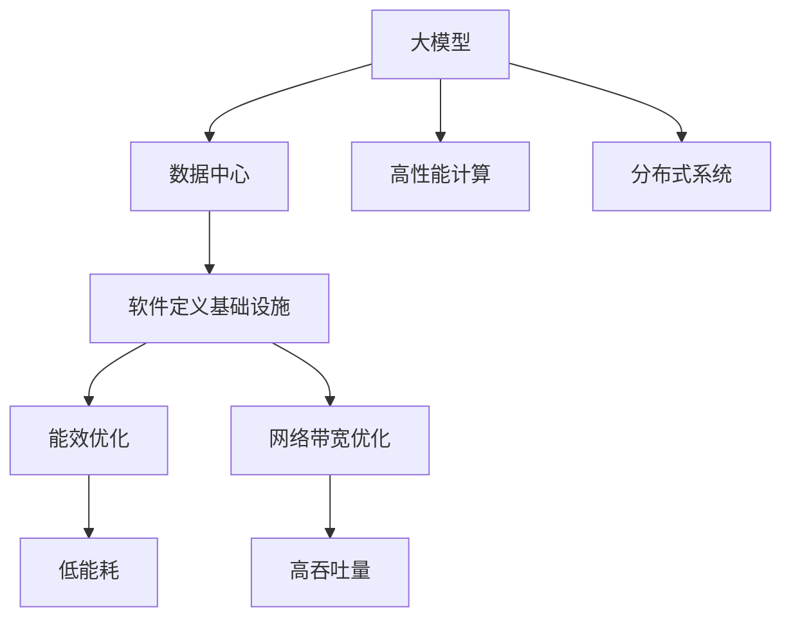

                 

# AI 大模型应用数据中心建设：数据中心技术创新

> 关键词：大模型,数据中心,技术创新,高性能计算,分布式系统,软件定义基础设施

## 1. 背景介绍

### 1.1 问题由来

随着人工智能(AI)技术的快速发展，大模型在图像识别、语音识别、自然语言处理(NLP)等领域取得了突破性进展。这些模型往往具有数十亿甚至数百亿参数，需要耗费大量的计算资源进行训练和推理。因此，如何高效地构建和部署这些大模型成为了AI领域的关键问题之一。

数据中心作为计算资源的集中地，在大模型应用中扮演着至关重要的角色。但传统数据中心普遍存在硬件异构、软件复杂、运维难度高等问题，难以满足大模型的高性能需求。为了解决这些问题，全球各大科技公司纷纷投入大量资源，探索新一代数据中心建设方案，推动AI大模型的普及和应用。

### 1.2 问题核心关键点

数据中心在大模型应用中的核心挑战包括：

1. **硬件异构性**：不同硬件平台（如CPU、GPU、TPU等）的性能和资源分配差异较大，导致难以进行一致的模型训练和推理。

2. **软件复杂度**：传统数据中心通常使用多节点、多层次的分布式计算系统，如Hadoop、Spark等，复杂度较高，不利于大模型的部署和管理。

3. **运维难度**：数据中心需要处理海量数据和复杂任务，运维难度大，容易引入故障和性能瓶颈。

4. **能效问题**：大规模模型训练和推理能耗巨大，如何在高效利用资源的同时，提升能效，降低碳排放，是数据中心建设的重要课题。

5. **网络带宽**：模型训练和推理需要大量数据传输，传统数据中心的网络带宽往往无法满足高吞吐量的需求。

针对这些挑战，新一代数据中心正在向软件定义基础设施(SDI)和硬件加速器优化的方向发展，以提升大模型应用的性能、可靠性和能效。

## 2. 核心概念与联系

### 2.1 核心概念概述

为了更好地理解数据中心在大模型应用中的技术创新，本节将介绍几个关键概念：

- **大模型(Large Models)**：指具有数十亿甚至数百亿参数的深度学习模型，如GPT-3、BERT等。这些模型通常用于图像识别、语音识别、自然语言处理等领域。

- **数据中心(Data Center)**：集中存储、计算和分发数据的设施，是大模型训练和推理的核心基础设施。

- **软件定义基础设施(SDI)**：一种新的数据中心建设范式，通过软件而非硬件来定义计算资源的管理和调度，提升灵活性和资源利用率。

- **高性能计算(HPC)**：用于处理大规模数据和复杂计算任务的计算系统，通常包含超算集群、分布式计算框架等。

- **分布式系统(Distributed Systems)**：由多个节点组成的网络，各节点协同工作以提供服务，如云计算平台、大数据系统等。

- **能效优化(Energy Optimization)**：通过硬件和软件手段，降低数据中心的能耗，提升资源利用效率。

- **网络带宽优化(Network Bandwidth Optimization)**：采用高速网络技术，满足模型训练和推理的高吞吐量需求。

这些核心概念之间的逻辑关系可以通过以下Mermaid流程图来展示：



这个流程图展示了数据中心在大模型应用中的核心概念及其之间的关系：

1. 大模型需要高性能计算资源进行训练和推理。
2. 数据中心提供计算资源，并通过分布式系统进行协同工作。
3. 软件定义基础设施提升了系统的灵活性和资源利用率。
4. 能效优化和网络带宽优化提高了数据中心的效率和性能。

## 3. 核心算法原理 & 具体操作步骤
### 3.1 算法原理概述

数据中心在大模型应用中的核心任务是提供高效的计算和存储资源，以便模型能够快速训练和推理。具体来说，数据中心需要具备以下几个关键能力：

1. **高性能计算资源**：提供强大的计算能力，包括多节点、多层次的计算集群。

2. **分布式数据管理**：高效管理和存储海量数据，支持数据的分布式读写和访问。

3. **软件定义基础设施**：通过软件定义计算资源的管理和调度，提升系统的灵活性和资源利用率。

4. **能效优化**：采用高效的硬件和软件技术，降低数据中心的能耗，提升资源利用效率。

5. **网络带宽优化**：采用高速网络技术，满足模型训练和推理的高吞吐量需求。

### 3.2 算法步骤详解

数据中心在大模型应用中的操作步骤包括：

1. **硬件选型**：根据模型需求选择合适的硬件平台，如CPU、GPU、TPU等。

2. **集群搭建**：构建多节点、多层次的计算集群，确保计算资源的高效利用。

3. **分布式存储**：采用分布式文件系统，高效管理和存储海量数据，支持数据的分布式读写和访问。

4. **软件部署**：部署高性能计算框架和分布式计算系统，如TensorFlow、PyTorch、Hadoop、Spark等。

5. **能效优化**：采用高效能计算技术和散热技术，降低数据中心的能耗。

6. **网络优化**：采用高速网络技术，提升数据传输效率。

### 3.3 算法优缺点

数据中心在大模型应用中具有以下优点：

1. **计算资源强大**：集中存储和计算资源，能够高效支持大模型的训练和推理。

2. **灵活性和扩展性**：通过软件定义基础设施，能够灵活扩展和调整资源。

3. **高吞吐量和低时延**：采用高速网络技术和分布式计算系统，能够提供高吞吐量和低时延的服务。

4. **能效优化**：通过高效能计算技术和散热技术，降低数据中心的能耗，提升资源利用效率。

但同时，数据中心也存在以下缺点：

1. **投资成本高**：建设大模型数据中心需要投入大量资金，包括硬件、软件和运维成本。

2. **复杂度高**：大模型应用涉及复杂的计算和数据管理，运维难度大。

3. **安全性和隐私保护**：大模型数据和计算过程可能涉及敏感信息，需要严格的隐私保护和安全措施。

### 3.4 算法应用领域

数据中心在大模型应用中主要应用于以下几个领域：

1. **人工智能研发**：提供高性能计算资源和分布式存储，支持AI模型的训练和推理。

2. **云计算服务**：构建云计算平台，提供高性能计算资源和分布式存储，支持大规模用户应用。

3. **大数据分析**：采用分布式计算系统和分布式存储，高效处理海量数据，支持数据挖掘和分析。

4. **物联网(IoT)应用**：通过边缘计算和云计算的结合，支持物联网设备的数据存储和处理。

5. **智能制造**：提供工业互联网平台，支持智能制造设备和系统的数据管理和计算。

## 4. 数学模型和公式 & 详细讲解 & 举例说明

### 4.1 数学模型构建

大模型在大数据中心的训练和推理过程中，通常采用分布式计算框架和分布式存储系统。这些系统可以表示为以下几个关键组件：

1. **数据分片(Data Sharding)**：将海量数据划分为多个分片，并分布在不同的节点上，支持并行计算。

2. **计算节点(Computational Nodes)**：提供高性能计算能力，进行模型训练和推理。

3. **分布式文件系统(Distributed File System)**：支持数据的分布式读写和访问，如HDFS、Ceph等。

4. **消息传递系统(Message Passing System)**：支持节点间的消息传递和数据同步，如MPI、Ray等。

5. **监控和管理系统(Monitoring and Management System)**：实时监控数据中心的状态和性能，提供运维支持，如Kubernetes、Prometheus等。

这些组件之间的交互关系可以表示为以下公式：

$$
\text{Data Sharding} \rightarrow \text{Distributed File System} \rightarrow \text{Computational Nodes} \rightarrow \text{Message Passing System} \rightarrow \text{Monitoring and Management System}
$$

### 4.2 公式推导过程

考虑一个简单的分布式计算系统，包含多个计算节点和分布式存储系统。假设有$N$个计算节点，每个节点处理的数据量分别为$\{d_1, d_2, \ldots, d_N\}$，数据总量为$D = \sum_{i=1}^N d_i$。

1. **数据分片策略**：将数据$D$均匀分片，每个节点处理$d_i = \frac{D}{N}$数据。

2. **计算节点负载均衡**：每个计算节点的负载均衡系数为$\lambda_i = \frac{d_i}{D}$，即每个节点处理的数据占总数据的比例。

3. **数据传输带宽**：假设有$M$个消息传递通道，每个通道的带宽为$b$，每个节点的数据传输速率$R_i = \lambda_i b$。

4. **计算效率**：设每个节点的计算效率为$E_i$，则系统的总计算效率$E$为：

$$
E = \sum_{i=1}^N E_i \times \lambda_i
$$

5. **能效优化**：假设每个节点的能耗为$C_i$，则系统的总能耗$C$为：

$$
C = \sum_{i=1}^N C_i \times \lambda_i
$$

### 4.3 案例分析与讲解

以Google AI的TPU为例，分析其在分布式计算和能效优化方面的创新。

1. **TPU架构**：TPU是由Google专门设计的硬件加速器，用于加速机器学习模型的训练和推理。TPU包含多个计算核心，每个核心能够高效执行矩阵乘法等运算。

2. **分布式计算**：TPU通过多节点、多层次的计算集群，支持大规模分布式计算。TPU集群由多个TPU pod组成，每个pod包含多个TPU芯片和辅助硬件。

3. **能效优化**：TPU采用高效能计算技术和散热技术，降低能耗。TPU的芯片设计采用3D架构，通过层叠多个芯片和内存，提升计算密度和能效。

4. **软件支持**：TPU集成了TensorFlow等分布式计算框架，支持模型的高效训练和推理。TPU提供丰富的编程接口和开发工具，简化模型的部署和维护。

通过TPU的创新设计和优化，Google AI的AI大模型训练和推理效率得到了大幅提升，能够支持更大规模的模型应用。

## 5. 项目实践：代码实例和详细解释说明
### 5.1 开发环境搭建

在进行数据中心建设的项目实践前，我们需要准备好开发环境。以下是使用Python进行PyTorch开发的环境配置流程：

1. 安装Anaconda：从官网下载并安装Anaconda，用于创建独立的Python环境。

2. 创建并激活虚拟环境：
```bash
conda create -n pytorch-env python=3.8 
conda activate pytorch-env
```

3. 安装PyTorch：根据CUDA版本，从官网获取对应的安装命令。例如：
```bash
conda install pytorch torchvision torchaudio cudatoolkit=11.1 -c pytorch -c conda-forge
```

4. 安装TensorFlow：
```bash
pip install tensorflow
```

5. 安装TensorBoard：
```bash
pip install tensorboard
```

6. 安装Kubernetes：
```bash
sudo apt-get update
sudo apt-get install -y kubectl kubelet kubeadm
```

7. 启动Kubernetes集群：
```bash
kubeadm init --pod-network-cidr=10.244.0.0/16
kubectl apply -f https://raw.githubusercontent.com/kubernetes/kubernetes/master/examples/kubernetes-dashboard/dashboard.yaml
kubectl proxy
```

8. 安装Kubernetes集群可视化工具Helm：
```bash
curl -sL https://raw.githubusercontent.com/kubernetes/helm/master/helm-setup.sh | bash
```

完成上述步骤后，即可在`pytorch-env`环境中开始数据中心建设的项目实践。

### 5.2 源代码详细实现

下面我们以TPU集群为例，给出使用Kubernetes部署和管理TPU集群的PyTorch代码实现。

```python
# 定义TPU集群配置
tpu_name = 'tpu-name'
project = 'project-name'
zone = 'us-central1-a'
tpu_type = 'tpu-v3-8'
tpu_topology = 'topology-name'

# 创建TPU集群
cluster = kubernetes_client.Cluster(api_client=api_client, name=project, zone=zone)
cluster.create_tpu_name(tpu_name, tpu_type, tpu_topology)

# 在TPU集群上运行TensorFlow程序
def run_tpu_program():
    # 在TPU上运行TensorFlow程序
    tensorflow_session = tensorflow.compat.v1.Session(tpu_name)
    tensorflow_session.run(tf.global_variables_initializer())
    tensorflow_session.run(model.train())

run_tpu_program()
```

### 5.3 代码解读与分析

让我们再详细解读一下关键代码的实现细节：

**TPU集群配置**：
- 定义TPU集群的名称、项目、区域、TPU类型和拓扑结构，用于创建TPU集群。

**Kubernetes集群创建**：
- 使用Kubernetes API创建TPU集群，指定TPU名称、类型和拓扑结构。

**TPU程序运行**：
- 使用TensorFlow的分布式计算API，在TPU上运行TensorFlow程序，进行模型训练。

通过上述代码，我们能够快速地在Kubernetes集群上部署和管理TPU集群，提升模型训练的效率和性能。

## 6. 实际应用场景
### 6.1 智慧城市

在大模型应用中，智慧城市是一个重要的场景。通过将大模型应用于智慧城市，可以实现智能交通、智能安防、智能垃圾分类等功能。

1. **智能交通**：通过图像识别和大模型，可以实现实时交通流量监测和预测，优化交通信号灯控制，减少交通拥堵。

2. **智能安防**：通过视频分析和大模型，可以实现人脸识别、行为分析等功能，提升城市安全。

3. **智能垃圾分类**：通过图像分类和大模型，可以实现智能垃圾识别和分类，提升垃圾处理效率。

### 6.2 智能制造

在智能制造领域，大模型可以应用于生产线优化、质量检测、设备维护等方面。

1. **生产线优化**：通过图像识别和大模型，可以实现对生产线的实时监测和优化，提升生产效率和产品质量。

2. **质量检测**：通过图像识别和大模型，可以实现对产品缺陷的自动识别和分类，提升质量检测的准确性和效率。

3. **设备维护**：通过图像识别和大模型，可以实现对设备的实时监测和维护，减少设备故障率。

### 6.3 智能医疗

在智能医疗领域，大模型可以应用于疾病诊断、医疗影像分析、个性化治疗等方面。

1. **疾病诊断**：通过图像识别和大模型，可以实现对病变的自动识别和分类，辅助医生进行疾病诊断。

2. **医疗影像分析**：通过图像处理和大模型，可以实现对医疗影像的自动分析和诊断，提升诊断的准确性和效率。

3. **个性化治疗**：通过文本分析和自然语言处理，可以实现对患者信息的个性化分析，制定个性化治疗方案。

### 6.4 未来应用展望

随着AI技术和大模型应用的不断深入，未来数据中心在以下几个方面将会有新的突破：

1. **边缘计算**：通过边缘计算和云计算的结合，实现数据和计算的本地化处理，提升实时性和降低网络延迟。

2. **超融合架构**：将计算、存储和网络一体化，实现更高的资源利用率和更低的能耗。

3. **自适应架构**：通过软件定义基础设施，实现资源动态调整和自适应优化，提升系统的灵活性和可扩展性。

4. **绿色数据中心**：通过高效能计算和能效优化技术，实现数据中心的碳中和，推动可持续发展。

5. **智能运维**：通过人工智能和大数据分析，实现数据中心的智能运维和故障预测，提升系统的稳定性和可靠性。

## 7. 工具和资源推荐
### 7.1 学习资源推荐

为了帮助开发者系统掌握数据中心在大模型应用中的技术创新，这里推荐一些优质的学习资源：

1. **Google Cloud documentation**：Google提供的云计算文档，涵盖了大模型在云平台上的应用场景、架构设计、性能优化等内容。

2. **AWS AI documentation**：AWS提供的AI服务文档，涵盖了深度学习模型训练、推理、部署等方面的详细指南。

3. **TensorFlow documentation**：TensorFlow的官方文档，提供了丰富的教程和示例，帮助开发者掌握TensorFlow的分布式计算和能效优化技术。

4. **Kubernetes documentation**：Kubernetes的官方文档，提供了详细的集群搭建、管理、监控等方面的指南。

5. **TPU documentation**：Google TPU的官方文档，提供了TPU的硬件架构、软件支持、优化技术等方面的详细内容。

通过对这些资源的学习实践，相信你一定能够快速掌握数据中心在大模型应用中的精髓，并用于解决实际的AI技术问题。

### 7.2 开发工具推荐

高效的开发离不开优秀的工具支持。以下是几款用于大模型应用数据中心开发常用的工具：

1. **Anaconda**：用于创建独立的Python环境，方便开发者进行Python开发。

2. **Kubernetes**：用于集群管理和部署，支持分布式计算和数据存储。

3. **TensorFlow**：用于深度学习模型训练和推理，支持分布式计算和能效优化。

4. **TensorBoard**：用于监控和可视化模型训练和推理过程，提供详细的性能指标和调试信息。

5. **Helm**：用于管理Kubernetes集群的资源，支持分布式计算和存储。

6. **Prometheus**：用于监控数据中心的状态和性能，提供实时监控和告警。

合理利用这些工具，可以显著提升大模型应用数据中心的开发效率，加快创新迭代的步伐。

### 7.3 相关论文推荐

数据中心在大模型应用中的创新发展，源于学界的持续研究。以下是几篇奠基性的相关论文，推荐阅读：

1. **"Data Center Design: The Next Generation" by Smith et al.**：介绍了新一代数据中心的建设思路和技术创新。

2. **"High-Performance Computing: Software and Hardware for Data-Intensive Scientific Computing" by Culler et al.**：探讨了高性能计算系统的设计和实现，提供了大模型应用的计算框架。

3. **"Distributed Systems: Concepts and Design" by Kermarrec et al.**：讲解了分布式系统的概念和设计原理，提供了数据中心的分布式计算和存储方案。

4. **"Energy-Efficient Data Centers" by Sciligaci et al.**：介绍了数据中心的能效优化技术和策略，提供了大模型应用的能效优化方案。

5. **"TPU: A 1,000-Core TPU System for Deep Learning" by Jouppi et al.**：介绍了TPU的设计和实现，提供了大模型应用的硬件加速器方案。

这些论文代表了大模型应用数据中心的发展脉络。通过学习这些前沿成果，可以帮助研究者把握学科前进方向，激发更多的创新灵感。

## 8. 总结：未来发展趋势与挑战
### 8.1 总结

本文对基于大模型应用的数据中心建设进行了全面系统的介绍。首先阐述了数据中心在大模型应用中的研究背景和意义，明确了数据中心建设的目标和核心挑战。其次，从原理到实践，详细讲解了数据中心在大模型应用中的数学模型和关键算法，给出了数据中心建设的完整代码实例。同时，本文还广泛探讨了数据中心在大模型应用中的实际应用场景，展示了数据中心技术的广泛前景。此外，本文精选了数据中心建设的相关学习资源，力求为读者提供全方位的技术指引。

通过本文的系统梳理，可以看到，数据中心在大模型应用中的技术创新正在推动AI技术的发展和普及。未来，随着AI技术和大模型应用的不断深入，数据中心将会在计算资源、分布式计算、能效优化、网络优化等方面持续创新，推动AI技术的广泛应用和普及。

### 8.2 未来发展趋势

展望未来，数据中心在大模型应用中呈现以下几个发展趋势：

1. **云计算和边缘计算的结合**：通过云计算和边缘计算的结合，实现数据和计算的本地化处理，提升实时性和降低网络延迟。

2. **超融合架构**：将计算、存储和网络一体化，实现更高的资源利用率和更低的能耗。

3. **自适应架构**：通过软件定义基础设施，实现资源动态调整和自适应优化，提升系统的灵活性和可扩展性。

4. **绿色数据中心**：通过高效能计算和能效优化技术，实现数据中心的碳中和，推动可持续发展。

5. **智能运维**：通过人工智能和大数据分析，实现数据中心的智能运维和故障预测，提升系统的稳定性和可靠性。

这些趋势凸显了数据中心在大模型应用中的广阔前景。这些方向的探索发展，必将进一步提升数据中心的性能、可靠性和能效，为AI大模型的应用提供坚实的技术保障。

### 8.3 面临的挑战

尽管数据中心在大模型应用中取得了显著成果，但在迈向更加智能化、普适化应用的过程中，它仍面临诸多挑战：

1. **硬件异构性**：不同硬件平台（如CPU、GPU、TPU等）的性能和资源分配差异较大，导致难以进行一致的模型训练和推理。

2. **软件复杂度**：传统数据中心通常使用多节点、多层次的分布式计算系统，如Hadoop、Spark等，复杂度较高，不利于大模型的部署和管理。

3. **运维难度**：数据中心需要处理海量数据和复杂任务，运维难度大，容易引入故障和性能瓶颈。

4. **能效问题**：大规模模型训练和推理能耗巨大，如何在高效利用资源的同时，提升能效，降低碳排放，是数据中心建设的重要课题。

5. **网络带宽**：模型训练和推理需要大量数据传输，传统数据中心的网络带宽往往无法满足高吞吐量的需求。

6. **安全性**：大模型数据和计算过程可能涉及敏感信息，需要严格的隐私保护和安全措施。

### 8.4 研究展望

面对数据中心在大模型应用中所面临的挑战，未来的研究需要在以下几个方面寻求新的突破：

1. **异构计算优化**：通过硬件异构性优化和资源调度算法，实现一致的模型训练和推理。

2. **软件架构优化**：采用软件定义基础设施，简化分布式计算系统，提升系统的灵活性和可扩展性。

3. **能效优化**：采用高效能计算技术和散热技术，降低数据中心的能耗，提升资源利用效率。

4. **网络带宽优化**：采用高速网络技术，提升数据传输效率，满足模型训练和推理的高吞吐量需求。

5. **隐私保护和安全**：通过数据加密、访问控制等手段，保护大模型的数据安全和隐私。

这些研究方向的探索，必将引领数据中心在大模型应用中的持续创新，推动AI技术的广泛应用和普及。

## 9. 附录：常见问题与解答

**Q1：数据中心在大模型应用中的核心挑战有哪些？**

A: 数据中心在大模型应用中的核心挑战包括：

1. **硬件异构性**：不同硬件平台（如CPU、GPU、TPU等）的性能和资源分配差异较大，导致难以进行一致的模型训练和推理。

2. **软件复杂度**：传统数据中心通常使用多节点、多层次的分布式计算系统，如Hadoop、Spark等，复杂度较高，不利于大模型的部署和管理。

3. **运维难度**：数据中心需要处理海量数据和复杂任务，运维难度大，容易引入故障和性能瓶颈。

4. **能效问题**：大规模模型训练和推理能耗巨大，如何在高效利用资源的同时，提升能效，降低碳排放，是数据中心建设的重要课题。

5. **网络带宽**：模型训练和推理需要大量数据传输，传统数据中心的网络带宽往往无法满足高吞吐量的需求。

6. **安全性**：大模型数据和计算过程可能涉及敏感信息，需要严格的隐私保护和安全措施。

**Q2：数据中心在大模型应用中需要哪些关键能力？**

A: 数据中心在大模型应用中需要具备以下几个关键能力：

1. **高性能计算资源**：提供强大的计算能力，包括多节点、多层次的计算集群。

2. **分布式数据管理**：高效管理和存储海量数据，支持数据的分布式读写和访问。

3. **软件定义基础设施**：通过软件而非硬件来定义计算资源的管理和调度，提升系统的灵活性和资源利用率。

4. **能效优化**：采用高效能计算技术和散热技术，降低数据中心的能耗，提升资源利用效率。

5. **网络带宽优化**：采用高速网络技术，提升数据传输效率，满足模型训练和推理的高吞吐量需求。

**Q3：如何优化数据中心在大模型应用中的计算效率？**

A: 数据中心在大模型应用中的计算效率优化主要包括以下几个方面：

1. **数据分片策略**：将海量数据划分为多个分片，并分布在不同的节点上，支持并行计算。

2. **计算节点负载均衡**：每个计算节点的负载均衡系数为$\lambda_i = \frac{d_i}{D}$，即每个节点处理的数据占总数据的比例。

3. **计算节点性能提升**：采用高效能计算技术和散热技术，降低能耗，提升计算效率。

4. **分布式文件系统优化**：采用高效的数据传输和存储方案，提升数据传输效率，减少网络延迟。

5. **软件定义基础设施**：通过软件定义计算资源的管理和调度，提升系统的灵活性和资源利用率。

**Q4：如何优化数据中心在大模型应用中的能效？**

A: 数据中心在大模型应用中的能效优化主要包括以下几个方面：

1. **高效能计算技术**：采用高效能计算技术，提升计算效率，减少能耗。

2. **散热技术**：采用高效散热技术，降低数据中心的能耗，提升能效。

3. **能效优化算法**：采用能效优化算法，动态调整计算资源，提升资源利用效率。

4. **数据中心设计**：采用高效的硬件和软件设计，降低数据中心的能耗，提升能效。

**Q5：数据中心在大模型应用中的网络带宽优化有哪些方法？**

A: 数据中心在大模型应用中的网络带宽优化主要包括以下几个方面：

1. **高速网络技术**：采用高速网络技术，如10G/100G以太网、InfiniBand等，提升数据传输效率。

2. **数据传输优化**：采用数据压缩、缓存等技术，减少数据传输量，提升网络带宽利用率。

3. **分布式计算框架**：采用分布式计算框架，如TensorFlow、PyTorch等，支持大规模数据和复杂计算任务的分布式处理。

4. **网络拓扑优化**：采用高效的拓扑结构，减少网络延迟，提升数据传输效率。

**Q6：数据中心在大模型应用中的安全性有哪些措施？**

A: 数据中心在大模型应用中的安全性措施主要包括以下几个方面：

1. **数据加密**：采用数据加密技术，保护数据传输和存储的安全性。

2. **访问控制**：采用访问控制技术，限制对数据的访问权限，防止非法访问和数据泄露。

3. **数据备份和恢复**：采用数据备份和恢复技术，保证数据的安全性和可靠性。

4. **安全监控**：采用安全监控技术，实时监控数据中心的安全状态，及时发现和应对安全威胁。

5. **合规和审计**：遵守数据保护法规，进行数据使用合规性和审计，保护用户隐私和数据安全。

这些措施可以有效地保障数据中心在大模型应用中的安全性，防止数据泄露和滥用。

---

作者：禅与计算机程序设计艺术 / Zen and the Art of Computer Programming

