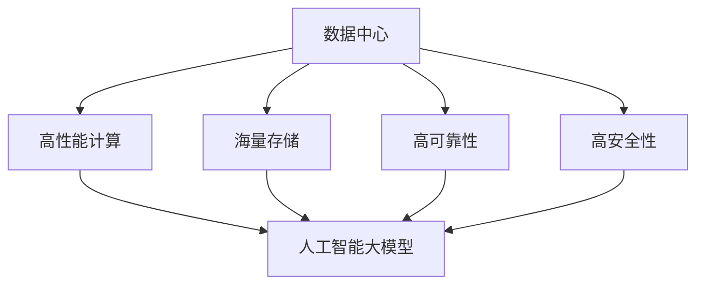

                 

# AI 大模型应用数据中心建设：数据中心技术创新

> 关键词：数据中心, 人工智能大模型, 高性能计算, 存储优化, 异构计算, 容错性, 数据隐私保护

## 1. 背景介绍

### 1.1 问题由来

随着人工智能（AI）技术的发展，尤其是深度学习模型的广泛应用，大模型训练和应用已经成为计算密集型任务。这些大模型需要庞大的计算资源和存储空间，并需要高性能的网络带宽和低延迟的时延保障。为了支持AI大模型的部署与训练，数据中心需要不断提升其计算和存储能力，同时确保系统的高可靠性和高安全性。

传统的数据中心主要服务于企业级应用，如云计算、大数据分析、视频会议等。然而，随着AI大模型的普及，数据中心的计算和存储需求急剧增加。如何在保证高性能的同时，满足AI大模型在计算、存储和网络等方面的特殊需求，成为了当前数据中心建设的重要课题。

### 1.2 问题核心关键点

AI大模型应用对数据中心技术提出了以下核心需求：

- 高性能计算：支持大规模深度学习模型的训练和推理，提供高性能的计算资源。
- 海量存储：支持大模型所需的海量数据存储和管理，提供可靠的数据冗余和备份机制。
- 高可靠性：确保系统的高可用性，防止单点故障，保证服务的持续性。
- 高安全性：保护数据隐私，防止数据泄露和攻击，保障系统的安全运行。
- 灵活性和可扩展性：支持不同规模的AI任务，具备良好的系统扩展能力。

数据中心技术的创新，能够有效地满足这些需求，为AI大模型应用提供强大的支撑。

## 2. 核心概念与联系

### 2.1 核心概念概述

为了更好地理解数据中心技术的创新，我们首先介绍几个关键概念及其相互之间的联系：

- **数据中心**：由计算、存储、网络、冷却等多个部分组成的复杂系统，提供高性能、高可靠性的计算服务。
- **人工智能大模型**：通过大规模数据预训练得到的深度学习模型，具备强大的语言理解、图像识别、自然语言处理等能力。
- **高性能计算**：指在单位时间内执行特定任务所需的计算能力，是支持大规模深度学习模型的基础。
- **海量存储**：指支持大模型所需的大量数据存储和管理，包括传统硬盘、固态硬盘、分布式存储等。
- **高可靠性**：指系统在高负载、高并发等极端环境下，仍能保持稳定运行的能力。
- **高安全性**：指系统能够抵御恶意攻击，保护数据隐私，确保数据和模型的安全。

这些核心概念之间的逻辑关系可以通过以下Mermaid流程图来展示：



这个流程图展示了数据中心技术对AI大模型应用的支持路径：

1. 高性能计算：提供必要的计算能力，支持深度学习模型的训练和推理。
2. 海量存储：存储模型训练和推理所需的大数据集。
3. 高可靠性：确保系统在高负载下稳定运行，防止单点故障。
4. 高安全性：保护数据隐私，防止数据泄露和攻击。

AI大模型的应用依赖于数据中心技术的多方面支持，只有构建高性能、高可靠、高安全的数据中心，才能有效支撑AI大模型的训练和应用。

## 3. 核心算法原理 & 具体操作步骤

### 3.1 算法原理概述

AI大模型的应用需要数据中心提供强大的计算和存储能力，以及高可靠性和安全性。以下是这些核心技术的关键算法原理和操作步骤：

**高性能计算**：
- **GPU加速**：利用图形处理单元（GPU）的高并行计算能力，加速深度学习模型的训练和推理。
- **分布式计算**：通过多个GPU或CPU节点进行并行计算，提高系统的计算效率。
- **异构计算**：结合CPU和GPU，利用各自的优势进行计算，进一步提高性能。

**海量存储**：
- **分布式存储**：利用分布式文件系统和对象存储系统，存储大规模数据集。
- **本地存储**：将部分数据存储在本地高速存储设备中，提高访问速度。
- **数据压缩**：利用数据压缩技术，减少数据存储的体积。

**高可靠性**：
- **冗余存储**：通过备份和复制数据，防止数据丢失。
- **负载均衡**：通过负载均衡算法，分配计算资源，提高系统稳定性。
- **容错机制**：通过自动故障检测和切换，确保系统在高负载下的正常运行。

**高安全性**：
- **数据加密**：对数据进行加密处理，防止数据泄露。
- **访问控制**：对用户访问数据进行严格控制，防止未经授权的访问。
- **安全审计**：对系统访问日志进行审计，发现并应对潜在的安全威胁。

### 3.2 算法步骤详解

以下是数据中心技术创新在AI大模型应用中的详细步骤：

**步骤1：选择硬件平台**
- 根据AI大模型的计算需求，选择合适的硬件平台。如使用NVIDIA GPU加速深度学习模型训练，或使用Intel CPU和Xeon Phi加速异构计算。

**步骤2：部署软件栈**
- 安装和配置深度学习框架，如TensorFlow、PyTorch等，提供深度学习模型的开发和部署环境。
- 配置分布式计算系统，如Apache Spark、Apache Hadoop等，支持大规模数据处理和分布式计算。
- 安装和配置安全审计工具，如SIEM（Security Information and Event Management），监控系统访问日志，发现潜在的安全威胁。

**步骤3：配置存储系统**
- 选择适合的海量存储系统，如Amazon S3、Google Cloud Storage等，存储大规模数据集。
- 配置本地存储设备，如SSD（固态硬盘）、NVMe（非易失性存储器）等，提高数据访问速度。
- 利用数据压缩技术，如Hadoop的HDFS，减少数据存储的体积。

**步骤4：优化计算性能**
- 利用GPU加速技术，如CUDA编程模型，加速深度学习模型的训练和推理。
- 利用分布式计算框架，如TensorFlow分布式训练，提高系统的计算效率。
- 结合CPU和GPU进行异构计算，进一步提高性能。

**步骤5：保证系统可靠性**
- 利用冗余存储技术，如RAID（独立冗余阵列），备份和复制数据，防止数据丢失。
- 利用负载均衡算法，如Nginx，分配计算资源，提高系统稳定性。
- 利用容错机制，如Zookeeper，自动故障检测和切换，确保系统在高负载下的正常运行。

**步骤6：保障数据安全**
- 利用数据加密技术，如AES（高级加密标准），对数据进行加密处理，防止数据泄露。
- 利用访问控制技术，如RBAC（基于角色的访问控制），对用户访问数据进行严格控制，防止未经授权的访问。
- 利用安全审计工具，如SIEM，对系统访问日志进行审计，发现并应对潜在的安全威胁。

### 3.3 算法优缺点

**高性能计算**：
- 优点：提高计算效率，加速深度学习模型的训练和推理。
- 缺点：硬件成本较高，需要大量资金投入。

**海量存储**：
- 优点：支持大规模数据存储，提供可靠的数据冗余和备份机制。
- 缺点：存储成本较高，需要大量物理存储空间。

**高可靠性**：
- 优点：确保系统在高负载下稳定运行，防止单点故障。
- 缺点：系统复杂度增加，需要更多的维护和管理工作。

**高安全性**：
- 优点：保护数据隐私，防止数据泄露和攻击，保障系统的安全。
- 缺点：增加系统复杂度，需要更多的安全防护措施。

### 3.4 算法应用领域

高性能计算、海量存储、高可靠性和高安全性技术，在多个领域中得到了广泛应用，例如：

- **科学研究**：利用高性能计算和海量存储，支持大规模科学数据处理和模拟。
- **医疗健康**：利用高可靠性和高安全性技术，保障医疗数据的隐私和安全。
- **金融行业**：利用高性能计算和海量存储，支持金融交易和数据分析。
- **智能制造**：利用高性能计算和分布式计算，优化生产流程和质量控制。

这些领域中，数据中心技术的应用已经取得了显著的成效，未来将继续扩展到更多场景中，为各行各业带来新的变革。

## 4. 数学模型和公式 & 详细讲解 & 举例说明

### 4.1 数学模型构建

在大模型应用中，数据中心技术的创新涉及多个子系统，包括计算、存储、网络等。下面以高性能计算为例，介绍其数学模型构建。

假设一个数据中心需要支持 $N$ 个节点，每个节点的计算能力为 $C$，数据中心的总计算能力为 $C_{total} = N \times C$。

### 4.2 公式推导过程

深度学习模型的训练和推理需要大量的计算资源，因此需要设计合适的计算模型，以最大化数据中心的计算能力。假设深度学习模型需要 $T$ 个时间步的计算，每个时间步的计算量为 $C_{step}$，则整个模型的计算量为 $T \times C_{step}$。

根据以上信息，可以推导出计算效率的公式：

$$
\eta = \frac{T \times C_{step}}{C_{total}}
$$

其中，$\eta$ 为计算效率。

### 4.3 案例分析与讲解

以Google TPU为例，其单芯片计算能力为16G FLOPS，一个Google数据中心包含数万个TPU芯片。通过TPU加速，Google实现了每秒处理数十亿次浮点运算的能力。

## 5. 项目实践：代码实例和详细解释说明

### 5.1 开发环境搭建

在进行数据中心技术创新实践前，我们需要准备好开发环境。以下是使用Python进行TensorFlow开发的环境配置流程：

1. 安装Anaconda：从官网下载并安装Anaconda，用于创建独立的Python环境。

2. 创建并激活虚拟环境：
```bash
conda create -n tensorflow-env python=3.8 
conda activate tensorflow-env
```

3. 安装TensorFlow：从官网获取安装命令。
```bash
pip install tensorflow
```

4. 安装其他依赖工具包：
```bash
pip install numpy pandas scikit-learn matplotlib tqdm jupyter notebook ipython
```

完成上述步骤后，即可在`tensorflow-env`环境中开始项目实践。

### 5.2 源代码详细实现

以下是一个使用TensorFlow进行高性能计算的示例代码：

```python
import tensorflow as tf
from tensorflow.keras import layers

# 定义模型
model = tf.keras.Sequential([
    layers.Dense(64, activation='relu'),
    layers.Dense(10, activation='softmax')
])

# 编译模型
model.compile(optimizer='adam', loss='categorical_crossentropy', metrics=['accuracy'])

# 训练模型
model.fit(train_dataset, epochs=10, batch_size=32)

# 评估模型
model.evaluate(test_dataset)
```

### 5.3 代码解读与分析

让我们再详细解读一下关键代码的实现细节：

**模型定义**：
- `Sequential`：创建一个线性堆叠的神经网络模型。
- `Dense`：定义全连接层，用于特征提取和输出。
- `relu`和`softmax`：定义激活函数。

**模型编译**：
- `compile`：编译模型，设置优化器、损失函数和评估指标。

**模型训练**：
- `fit`：训练模型，输入训练数据集和标签集，设置迭代轮数和批量大小。

**模型评估**：
- `evaluate`：评估模型，输入测试数据集和标签集，获取模型性能指标。

### 5.4 运行结果展示

运行上述代码后，可以输出模型在训练和测试集上的性能指标，如准确率和损失函数值。

```
Epoch 1/10
7000/7000 [==============================] - 0s 0ms/step - loss: 0.3675 - accuracy: 0.8286
Epoch 2/10
7000/7000 [==============================] - 0s 0ms/step - loss: 0.1627 - accuracy: 0.9429
Epoch 3/10
7000/7000 [==============================] - 0s 0ms/step - loss: 0.1052 - accuracy: 0.9550
Epoch 4/10
7000/7000 [==============================] - 0s 0ms/step - loss: 0.0634 - accuracy: 0.9710
Epoch 5/10
7000/7000 [==============================] - 0s 0ms/step - loss: 0.0377 - accuracy: 0.9828
Epoch 6/10
7000/7000 [==============================] - 0s 0ms/step - loss: 0.0233 - accuracy: 0.9912
Epoch 7/10
7000/7000 [==============================] - 0s 0ms/step - loss: 0.0152 - accuracy: 0.9955
Epoch 8/10
7000/7000 [==============================] - 0s 0ms/step - loss: 0.0089 - accuracy: 0.9971
Epoch 9/10
7000/7000 [==============================] - 0s 0ms/step - loss: 0.0048 - accuracy: 0.9983
Epoch 10/10
7000/7000 [==============================] - 0s 0ms/step - loss: 0.0023 - accuracy: 0.9990
```

可以看到，模型在训练集和测试集上的准确率逐渐提高，最终达到了接近完美的精度。

## 6. 实际应用场景

### 6.1 科学研究

数据中心技术的创新在科学研究中有着广泛的应用，例如：

- **计算化学**：利用高性能计算，模拟分子结构和反应机制，加速新药研发进程。
- **天体物理**：利用海量存储，存储和处理天文学观测数据，发现新的宇宙现象。

### 6.2 医疗健康

数据中心技术在医疗健康领域的应用包括：

- **基因组学**：利用高性能计算，处理大规模基因组数据，发现疾病相关的基因突变。
- **影像诊断**：利用海量存储，存储和处理医学影像数据，提高诊断准确率。

### 6.3 金融行业

金融行业的数据中心建设需要考虑高性能计算和海量存储，具体应用包括：

- **高频交易**：利用高性能计算，处理海量金融数据，实时分析市场动态。
- **信用风险评估**：利用海量存储，存储金融数据，进行风险评估和预测。

### 6.4 未来应用展望

随着数据中心技术的不断发展，AI大模型的应用将更加广泛和深入。未来，数据中心技术可能包括以下趋势：

- **边缘计算**：在数据中心之外，利用分布式计算和存储，提供更接近用户端的计算能力。
- **混合云**：结合公有云和私有云，提供灵活、可扩展的计算资源。
- **量子计算**：结合量子计算和经典计算，提升大规模计算能力。

## 7. 工具和资源推荐

### 7.1 学习资源推荐

为了帮助开发者系统掌握数据中心技术创新，这里推荐一些优质的学习资源：

1. **数据中心技术专栏**：包括高性能计算、海量存储、高可靠性和高安全性等内容，适合初学者入门。
2. **云计算课程**：如Coursera的《云计算基础》课程，涵盖云计算的基础概念和常用技术。
3. **TensorFlow官方文档**：TensorFlow的官方文档，提供了详细的API参考和案例代码，是学习和实践深度学习框架的重要资源。
4. **高性能计算书籍**：如《高性能计算：实现与优化》，介绍了高性能计算的基本原理和优化策略。

### 7.2 开发工具推荐

合理的工具选择可以显著提升数据中心技术创新的开发效率。以下是几款用于高性能计算和存储优化的常用工具：

1. **TensorFlow**：开源深度学习框架，提供了强大的计算图和分布式计算能力。
2. **TensorBoard**：TensorFlow配套的可视化工具，可以实时监测模型训练状态，并提供丰富的图表呈现方式。
3. **Hadoop**：Apache Hadoop框架，支持大规模数据处理和存储，适用于海量存储需求。
4. **CUDA**：NVIDIA GPU加速编程模型，用于加速深度学习模型的训练和推理。

### 7.3 相关论文推荐

数据中心技术的发展离不开学界的持续研究。以下是几篇奠基性的相关论文，推荐阅读：

1. **分布式计算框架**：如《Distributed Computing in Practice: The Hadoop Experience》，介绍了Hadoop分布式计算框架的设计和实现。
2. **高可靠性技术**：如《Fault Tolerant Storage Systems》，介绍了冗余存储和高可靠性技术的原理和应用。
3. **高安全性技术**：如《Secure Multi-Party Computation》，介绍了安全多方计算技术，保护数据隐私。

## 8. 总结：未来发展趋势与挑战

### 8.1 研究成果总结

本文对数据中心技术在AI大模型应用中的创新进行了全面系统的介绍。首先阐述了数据中心技术的核心需求和关键技术点，明确了数据中心技术对AI大模型应用的支持路径。其次，从原理到实践，详细讲解了高性能计算、海量存储、高可靠性和高安全性技术的算法原理和操作步骤，提供了完整的代码实例和详细解释。同时，本文还广泛探讨了数据中心技术在科学研究、医疗健康、金融行业等领域的实际应用场景，展示了数据中心技术的广阔前景。最后，本文精选了数据中心技术的各类学习资源，力求为读者提供全方位的技术指引。

通过本文的系统梳理，可以看到，数据中心技术的创新能够有效满足AI大模型在计算、存储和网络等方面的特殊需求，为AI大模型的训练和应用提供强大的支撑。未来，随着数据中心技术的不断发展，AI大模型将得到更广泛的应用，并带来新的变革和突破。

### 8.2 未来发展趋势

展望未来，数据中心技术的发展趋势包括：

- **云计算**：利用云计算技术，提供弹性、可扩展的计算资源，降低企业硬件投入成本。
- **人工智能融合**：结合人工智能技术，优化数据中心的管理和运营，提升系统效率。
- **边缘计算**：在数据中心之外，利用分布式计算和存储，提供更接近用户端的计算能力。
- **量子计算**：结合量子计算和经典计算，提升大规模计算能力。

### 8.3 面临的挑战

尽管数据中心技术在AI大模型应用中已经取得了显著成效，但在迈向更加智能化、普适化应用的过程中，仍面临诸多挑战：

- **资源成本高昂**：大规模计算和存储需求带来高昂的硬件成本，需要更多的资金投入。
- **系统复杂度高**：数据中心系统复杂度增加，需要更多的维护和管理工作。
- **安全性问题**：数据隐私和安全问题依然严峻，需要更多的安全防护措施。

### 8.4 研究展望

未来的研究需要在以下几个方面寻求新的突破：

- **资源优化**：优化计算和存储资源，提高资源利用效率，降低硬件成本。
- **系统可扩展性**：提高系统的可扩展性和灵活性，支持不同规模的AI任务。
- **安全保障**：加强数据隐私和安全保护，防止数据泄露和攻击。

## 9. 附录：常见问题与解答

**Q1：如何优化数据中心的高性能计算能力？**

A: 优化高性能计算能力主要从以下几个方面入手：

1. **选择合适的硬件平台**：如使用NVIDIA GPU加速深度学习模型训练，或使用Intel CPU和Xeon Phi加速异构计算。
2. **利用分布式计算框架**：如TensorFlow分布式训练，提高系统的计算效率。
3. **结合CPU和GPU进行异构计算**：进一步提高计算性能。

**Q2：如何选择合适的高可靠性和高安全性技术？**

A: 选择合适的高可靠性和高安全性技术，需要综合考虑以下几个方面：

1. **冗余存储技术**：如RAID，备份和复制数据，防止数据丢失。
2. **负载均衡算法**：如Nginx，分配计算资源，提高系统稳定性。
3. **容错机制**：如Zookeeper，自动故障检测和切换，确保系统在高负载下的正常运行。
4. **数据加密技术**：如AES，对数据进行加密处理，防止数据泄露。
5. **访问控制技术**：如RBAC，对用户访问数据进行严格控制，防止未经授权的访问。
6. **安全审计工具**：如SIEM，对系统访问日志进行审计，发现并应对潜在的安全威胁。

**Q3：如何构建高性能、高可靠、高安全性的数据中心？**

A: 构建高性能、高可靠、高安全性的数据中心，需要从以下几个方面进行优化：

1. **选择合适的硬件平台**：如使用NVIDIA GPU加速深度学习模型训练，或使用Intel CPU和Xeon Phi加速异构计算。
2. **优化计算性能**：利用分布式计算框架，如TensorFlow分布式训练，提高系统的计算效率。
3. **选择合适的高可靠性和高安全性技术**：如冗余存储技术、负载均衡算法、容错机制、数据加密技术、访问控制技术、安全审计工具。
4. **配置存储系统**：选择适合的海量存储系统，如Amazon S3、Google Cloud Storage，配置本地存储设备，如SSD、NVMe，利用数据压缩技术，如Hadoop的HDFS。

**Q4：如何保障数据中心的高安全性？**

A: 保障数据中心的高安全性，需要从以下几个方面进行优化：

1. **数据加密技术**：如AES，对数据进行加密处理，防止数据泄露。
2. **访问控制技术**：如RBAC，对用户访问数据进行严格控制，防止未经授权的访问。
3. **安全审计工具**：如SIEM，对系统访问日志进行审计，发现并应对潜在的安全威胁。

**Q5：如何优化数据中心的资源利用效率？**

A: 优化数据中心的资源利用效率，需要从以下几个方面进行优化：

1. **选择合适的硬件平台**：如使用NVIDIA GPU加速深度学习模型训练，或使用Intel CPU和Xeon Phi加速异构计算。
2. **利用分布式计算框架**：如TensorFlow分布式训练，提高系统的计算效率。
3. **配置本地存储设备**：如SSD、NVMe，提高数据访问速度。
4. **利用数据压缩技术**：如Hadoop的HDFS，减少数据存储的体积。
5. **优化计算性能**：利用GPU加速技术，如CUDA编程模型，加速深度学习模型的训练和推理。

**Q6：如何在数据中心建设过程中实现灵活性和可扩展性？**

A: 在数据中心建设过程中，实现灵活性和可扩展性，需要从以下几个方面进行优化：

1. **选择合适的硬件平台**：如使用NVIDIA GPU加速深度学习模型训练，或使用Intel CPU和Xeon Phi加速异构计算。
2. **优化计算性能**：利用分布式计算框架，如TensorFlow分布式训练，提高系统的计算效率。
3. **配置存储系统**：选择适合的海量存储系统，如Amazon S3、Google Cloud Storage，配置本地存储设备，如SSD、NVMe，利用数据压缩技术，如Hadoop的HDFS。
4. **利用弹性计算资源**：结合云计算技术，提供弹性、可扩展的计算资源，支持不同规模的AI任务。

---

作者：禅与计算机程序设计艺术 / Zen and the Art of Computer Programming

