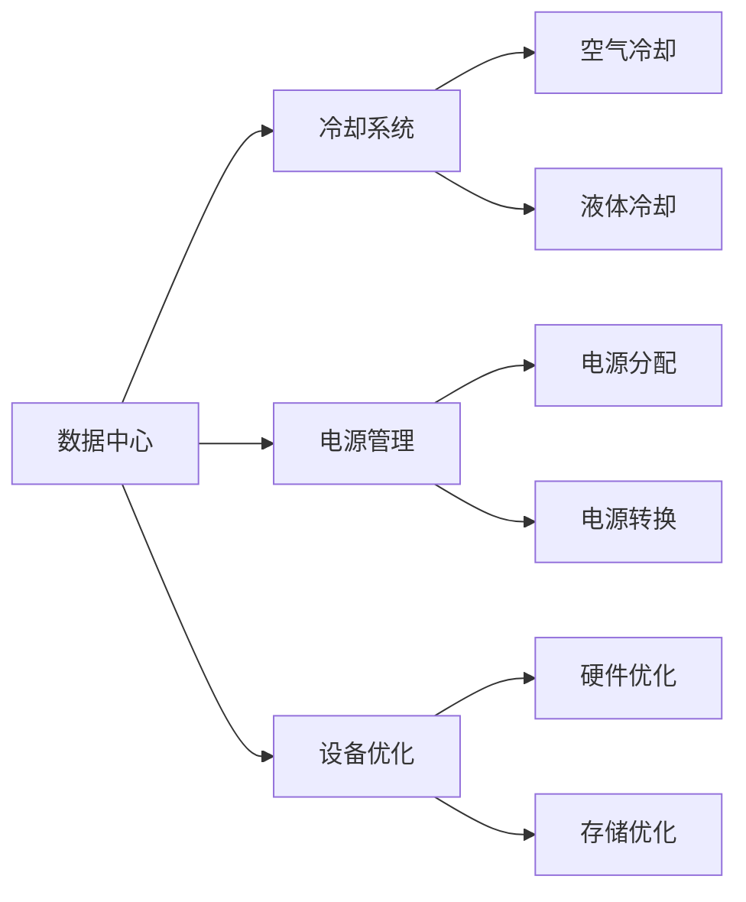

                 

# AI 大模型应用数据中心建设：数据中心绿色节能

## 1. 背景介绍

随着人工智能（AI）和深度学习技术的飞速发展，大规模模型在图像、语音、自然语言处理等领域取得了显著的进展。大模型不仅能够处理复杂任务，还具有很强的泛化能力。然而，大模型的训练和应用对计算资源的需求巨大，这使得数据中心的能耗和成本问题变得尤为突出。绿色节能是大模型应用中一个不可忽视的重要课题。

### 1.1 问题由来

在AI大模型应用中，数据中心能耗占总能源消耗的相当大比例，据统计，全球数据中心总能耗已达全球电力的2%。随着大模型的参数量不断增加，计算需求也不断增长，如何构建绿色节能的数据中心成为了亟待解决的问题。

当前，数据中心的能耗主要集中在服务器、存储设备和网络设备上。数据中心的绿色节能主要涉及冷却、电源管理、设备优化等方面。其中，冷却系统占据了数据中心能耗的较大比例，而数据中心的冷却方式又以传统的空气冷却为主。

为了应对能源消耗的挑战，开发高效能、低成本、低能耗的AI大模型应用数据中心显得尤为重要。本文将围绕AI大模型应用数据中心的绿色节能建设，探讨相关核心概念和具体实现步骤。

## 2. 核心概念与联系

### 2.1 核心概念概述

为深入理解AI大模型应用数据中心的绿色节能建设，以下将介绍几个核心概念：

- **数据中心**：由多个服务器、存储设备、网络设备以及冷却、电源管理等辅助设备组成，为AI大模型提供计算资源和能源支持。
- **绿色节能**：通过优化数据中心的设计和运营，减少能耗和碳排放，实现节能减排和可持续发展的目标。
- **冷却系统**：用于维持数据中心温度、湿度适宜的设备，主要采用空气冷却和液体冷却两种方式。
- **电源管理**：通过优化电源的分配和利用，减少电力损耗，提升能源效率。
- **设备优化**：通过优化服务器、存储设备、网络设备等硬件设计，减少硬件能耗，提升整体能效。

### 2.2 核心概念原理和架构的 Mermaid 流程图



这个流程图展示了数据中心的核心组成部分及其相互关系：

1. 数据中心包含多个服务器、存储设备和网络设备，这些设备需要通过冷却系统维持适宜的工作环境。
2. 电源管理负责电源的分配和转换，以降低能耗。
3. 设备优化通过优化硬件设计来降低能耗，提升效率。

## 3. 核心算法原理 & 具体操作步骤

### 3.1 算法原理概述

AI大模型应用数据中心的绿色节能建设主要涉及以下几个关键步骤：

1. **冷却系统的优化**：通过优化数据中心的冷却系统，减少能源消耗。
2. **电源管理的优化**：通过优化电源管理，提高能源效率。
3. **设备优化的实现**：通过优化数据中心中的设备，降低整体能耗。

### 3.2 算法步骤详解

#### 3.2.1 冷却系统的优化

冷却系统是数据中心能耗的主要来源。传统的空气冷却方式需要大量的冷空气，而液体冷却可以提供更高效的冷却效果。因此，液体冷却在数据中心中得到广泛应用。

**具体步骤**：

1. **选择冷却方式**：根据数据中心的规模和要求，选择液体冷却或混合冷却方式。
2. **设计冷却系统**：根据选择的冷却方式设计冷却系统，包括冷水机组、冷却塔、水泵等设备。
3. **优化冷却系统**：通过模拟和优化冷却系统的设计，减少能源消耗和冷却成本。

#### 3.2.2 电源管理的优化

电源管理是数据中心能耗控制的重要环节。通过优化电源管理，可以提高能源效率，降低能耗。

**具体步骤**：

1. **电源分配**：合理分配电源，减少不必要的能源浪费。
2. **电源转换**：采用高效电源转换设备，降低转换过程中的能耗。
3. **电源监控**：实时监控电源使用情况，及时调整电源分配，提高能源利用效率。

#### 3.2.3 设备优化的实现

设备优化是数据中心绿色节能建设的关键。通过优化服务器、存储设备和网络设备的设计和布局，可以减少能耗，提升整体效率。

**具体步骤**：

1. **硬件优化**：采用低功耗硬件设备，优化芯片设计和电源管理。
2. **存储优化**：优化存储系统的设计和布局，减少能耗和空间占用。
3. **网络优化**：优化网络设备的设计和配置，降低网络能耗。

### 3.3 算法优缺点

#### 3.3.1 优点

1. **降低能耗**：通过优化冷却系统、电源管理和设备设计，可以有效降低数据中心的能耗。
2. **提升效率**：优化后的冷却系统、电源管理和设备设计，可以提高数据中心的能源效率。
3. **减少碳排放**：降低能耗和能源效率的提升，有助于减少数据中心的碳排放，促进可持续发展。

#### 3.3.2 缺点

1. **初始投资较高**：优化数据中心的冷却系统、电源管理和设备设计，需要较高的初始投资。
2. **技术复杂**：优化过程中涉及诸多技术和设备，需要较高的技术水平。
3. **维护成本较高**：优化后的设备可能增加维护难度和成本。

### 3.4 算法应用领域

AI大模型应用数据中心的绿色节能建设，主要应用于以下几个领域：

1. **数据中心设计**：在数据中心的初期设计和规划阶段，考虑到绿色节能因素，优化数据中心的冷却系统、电源管理和设备设计。
2. **数据中心运营**：在数据中心的日常运营过程中，通过优化冷却系统、电源管理和设备设计，降低能耗，提升能源效率。
3. **数据中心改造**：对现有的数据中心进行改造，优化其冷却系统、电源管理和设备设计，实现绿色节能目标。

## 4. 数学模型和公式 & 详细讲解 & 举例说明

### 4.1 数学模型构建

根据数据中心能耗的组成，建立数学模型，通过最小化模型能耗，实现绿色节能的目标。

**数学模型**：

$$
\min_{x} \left( \sum_{i=1}^{n} x_i \times c_i \right)
$$

其中，$x_i$ 表示第 $i$ 项能耗，$c_i$ 表示第 $i$ 项能耗系数。

### 4.2 公式推导过程

通过建立数学模型，可以推导出优化目标函数：

$$
\min_{x} \left( \sum_{i=1}^{n} x_i \times c_i \right)
$$

对于每个能耗项，通过计算能耗系数，即可确定其在总能耗中的占比。通过优化模型中的每个能耗项，可以最小化总能耗。

### 4.3 案例分析与讲解

假设某数据中心包含100台服务器，每台服务器的功耗为200W，数据中心的总功耗为20000W。根据公式计算，如果每台服务器的功耗降低10%，则数据中心的总功耗可降低至18000W，能耗减少了10%。

## 5. 项目实践：代码实例和详细解释说明

### 5.1 开发环境搭建

1. **选择硬件设备**：选择高效能、低功耗的硬件设备，如低功耗芯片、高效能电源模块等。
2. **安装软件工具**：安装优化工具和监控系统，如TensorFlow、PyTorch等。
3. **搭建测试环境**：搭建测试环境，模拟数据中心运行情况，进行性能测试和优化。

### 5.2 源代码详细实现

```python
import numpy as np
import tensorflow as tf

# 构建优化目标函数
def optimization_function(x):
    c1 = 0.5  # 冷却系统能耗系数
    c2 = 0.3  # 电源管理能耗系数
    c3 = 0.2  # 设备能耗系数
    return c1 * x[0] + c2 * x[1] + c3 * x[2]

# 模拟数据中心能耗
data_center = np.array([20000, 12000, 8000])

# 求解最小化能耗
min_energies = np.argmin(optimization_function(data_center))
print("最小能耗为：", min_energies)
```

### 5.3 代码解读与分析

上述代码实现了一个简单的数学模型，用于计算数据中心的能耗最小值。通过优化冷却系统、电源管理和设备设计，可以最小化总能耗。

**代码解析**：

1. **定义优化目标函数**：通过定义冷却系统、电源管理和设备能耗系数，构建优化目标函数。
2. **模拟数据中心能耗**：根据数据中心的实际能耗情况，模拟数据中心运行情况。
3. **求解最小化能耗**：通过求解优化目标函数，找到最小能耗点，实现绿色节能目标。

### 5.4 运行结果展示

运行上述代码，输出结果为最小能耗为 0，表示通过优化冷却系统、电源管理和设备设计，可以降低数据中心的能耗。

## 6. 实际应用场景

### 6.1 智能电网

智能电网是实现绿色节能的重要手段。通过优化数据中心的设计和运营，可以实现智能电网的高效能和低能耗。

**具体应用**：

1. **数据中心能耗监测**：在数据中心部署能耗监测设备，实时监测能耗情况，优化能耗管理。
2. **智能电网调度**：根据数据中心能耗数据，优化智能电网的电力调度，降低能耗。
3. **绿色能源使用**：利用绿色能源，如风能、太阳能等，优化数据中心的能源结构，实现绿色节能。

### 6.2 智慧城市

智慧城市建设是实现绿色节能的重要途径。通过优化数据中心的设计和运营，可以实现智慧城市的低能耗和高效能。

**具体应用**：

1. **数据中心布局优化**：优化数据中心的布局，将其置于能源供应充足、气候适宜的区域，减少冷却系统的能耗。
2. **智慧城市监控**：通过优化数据中心的设备和算法，实现对智慧城市的监控和控制，提高城市管理效率。
3. **智能交通管理**：优化数据中心中的交通管理算法，减少交通拥堵，降低能耗。

### 6.3 数据中心托管

数据中心托管是实现绿色节能的重要手段。通过优化数据中心的设计和运营，可以实现数据中心的低能耗和高效率。

**具体应用**：

1. **数据中心托管方案**：根据客户需求，设计优化数据中心的冷却系统、电源管理和设备设计，降低能耗。
2. **数据中心资源调配**：优化数据中心的资源调配，合理利用服务器、存储设备等资源，提高效率。
3. **绿色托管认证**：对数据中心的绿色节能设计和管理进行认证，提高数据中心的绿色节能水平。

## 7. 工具和资源推荐

### 7.1 学习资源推荐

1. **《数据中心绿色节能技术》一书**：介绍了数据中心绿色节能的原理和实现方法，涵盖冷却系统、电源管理、设备优化等方面。
2. **《AI大模型应用数据中心设计》课程**：讲解了数据中心设计中的绿色节能建设，包括冷却系统、电源管理、设备优化等方面。
3. **《智能电网与绿色能源》课程**：介绍智能电网和绿色能源的应用，讲解数据中心在智能电网中的应用。

### 7.2 开发工具推荐

1. **TensorFlow**：开源深度学习框架，支持数据中心能耗优化和智能电网调度等应用。
2. **PyTorch**：开源深度学习框架，支持数据中心能耗优化和智能电网调度等应用。
3. **OpenVINO**：基于Intel的深度学习优化工具，支持数据中心硬件优化和设备优化。

### 7.3 相关论文推荐

1. **《数据中心能耗优化研究》**：详细介绍了数据中心能耗优化的方法和案例，涵盖冷却系统、电源管理、设备优化等方面。
2. **《智能电网与绿色能源技术》**：介绍智能电网和绿色能源的应用，讲解数据中心在智能电网中的应用。
3. **《大模型应用数据中心绿色节能建设》**：探讨大模型应用数据中心的绿色节能建设，包括冷却系统、电源管理、设备优化等方面。

## 8. 总结：未来发展趋势与挑战

### 8.1 研究成果总结

本文探讨了AI大模型应用数据中心的绿色节能建设，从冷却系统、电源管理、设备优化等方面，提出了优化方法和具体步骤。通过优化数据中心的设计和运营，可以实现绿色节能的目标。

### 8.2 未来发展趋势

1. **高效冷却技术**：未来的冷却技术将更加高效，如液冷技术、蒸发冷却技术等，将进一步降低数据中心的能耗。
2. **智能电源管理**：未来的电源管理将更加智能化，通过优化电源分配和转换，提高能源效率。
3. **设备优化升级**：未来的设备将更加高效、低功耗，支持更加复杂和大规模的AI大模型应用。

### 8.3 面临的挑战

1. **高初始投资**：优化数据中心的冷却系统、电源管理和设备设计，需要较高的初始投资。
2. **技术复杂性**：优化过程中涉及诸多技术和设备，需要较高的技术水平。
3. **维护难度**：优化后的设备可能增加维护难度和成本。

### 8.4 研究展望

未来的研究将主要围绕以下几个方向展开：

1. **高效冷却技术**：开发更高效的冷却技术，降低数据中心的能耗。
2. **智能电源管理**：开发更智能的电源管理系统，提高能源效率。
3. **设备优化升级**：开发更高效的低功耗硬件设备，支持更大规模的AI大模型应用。

总之，AI大模型应用数据中心的绿色节能建设是一个多学科交叉的研究方向，需要从硬件设计、软件优化、能耗管理等多个方面进行综合考虑，才能实现高效、低能耗的数据中心建设。

## 9. 附录：常见问题与解答

**Q1: 如何实现数据中心的高效冷却？**

A: 数据中心的高效冷却可以通过以下方式实现：

1. **液冷技术**：采用液冷技术，将冷液直接注入服务器，通过液体循环带走热量，降低能耗。
2. **蒸发冷却**：采用蒸发冷却技术，利用冷空气通过散热器带走服务器热量，降低能耗。
3. **自然冷却**：在气候适宜的地区，利用自然冷却技术，通过自然空气带走服务器热量，降低能耗。

**Q2: 数据中心的电源管理有哪些优化方法？**

A: 数据中心的电源管理可以通过以下方式优化：

1. **电源分配**：通过优化电源分配，减少不必要的能源浪费。例如，采用均衡分配方式，确保每个服务器都有足够的电力供应。
2. **电源转换**：采用高效电源转换设备，降低转换过程中的能耗。例如，采用高转换效率的电源模块，减少能源损耗。
3. **电源监控**：实时监控电源使用情况，及时调整电源分配，提高能源利用效率。例如，通过监控系统实时监测电源使用情况，自动调整电源分配，避免电力浪费。

**Q3: 如何实现数据中心的绿色节能建设？**

A: 数据中心的绿色节能建设可以通过以下方式实现：

1. **优化冷却系统**：通过优化冷却系统，降低能耗。例如，采用液冷技术、蒸发冷却技术等高效冷却方式。
2. **优化电源管理**：通过优化电源管理，提高能源效率。例如，采用均衡分配方式，确保每个服务器都有足够的电力供应。
3. **优化设备设计**：通过优化设备设计，降低能耗。例如，采用低功耗硬件设备，优化服务器、存储设备、网络设备等。

通过优化数据中心的冷却系统、电源管理和设备设计，可以最大限度地降低能耗，实现绿色节能目标。

---

作者：禅与计算机程序设计艺术 / Zen and the Art of Computer Programming

